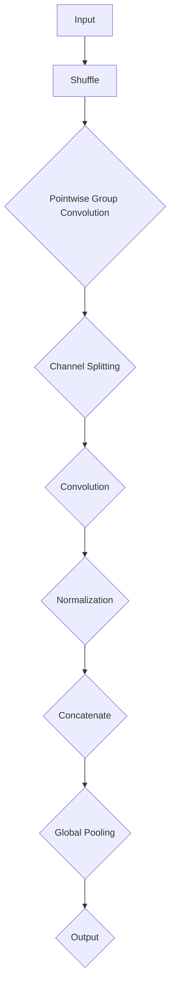

                 

### 1. 背景介绍

#### 1.1 ShuffleNet的起源与背景

ShuffleNet起源于深度学习的快速发展时期，特别是在移动设备和嵌入式系统上对高性能计算需求日益增加的背景下。传统的深度神经网络（DNN）模型由于参数数量庞大，计算复杂度高，导致在资源受限的设备上难以运行。因此，研究人员开始探索更为轻量级、高效的网络架构，以适应这些场景。

ShuffleNet最初由Google在2018年提出，其目标是设计一个在计算资源有限的情况下仍然能够保持高准确率的神经网络。它的设计灵感来自于一个简单的观察：在深度神经网络中，每个卷积层都会引入大量的参数和计算成本。因此，ShuffleNet试图通过特殊的网络结构设计来减少这些开销。

ShuffleNet的出现迅速引起了广泛关注，并在计算机视觉领域取得了显著的成果。它的轻量级特性使其在移动应用、自动驾驶、实时图像处理等多个领域得到了广泛应用。

#### 1.2 ShuffleNet的重要性

ShuffleNet的重要性主要体现在以下几个方面：

1. **高效能**：ShuffleNet通过优化网络结构，显著降低了模型的参数数量和计算复杂度，从而在保证模型性能的前提下，提高了计算效率。

2. **轻量级**：ShuffleNet非常适合在资源受限的设备上运行，如移动设备、嵌入式系统等。这使得它成为这些场景下的一种理想选择。

3. **易扩展**：ShuffleNet的网络结构设计灵活，可以通过调整参数来适应不同的应用需求。这使得它具有很强的适应性和扩展性。

4. **广泛应用**：ShuffleNet在计算机视觉领域取得了显著成果，同时在其他领域如自然语言处理、语音识别等领域也展现了良好的性能。

#### 1.3 ShuffleNet的组成

ShuffleNet主要由以下两部分组成：

1. **Shuffle Unit**：这是ShuffleNet的核心模块，通过特殊的操作来减少模型的参数数量和计算复杂度。

2. **Global Pooling**：全局池化操作用于将特征图的维度降低，进一步减少模型的大小。

接下来，我们将深入探讨ShuffleNet的核心概念与联系，通过Mermaid流程图来展示其网络架构。

#### 1.4 ShuffleNet的核心概念与联系

**核心概念**：

- **Shuffle Channel**：ShuffleNet通过随机打乱通道顺序来降低模型的复杂性。
- **Pointwise Group Convolution**：通过分组卷积来减少参数数量。
- **Channel Splitting**：将输入特征图分为两个部分，分别进行卷积和归一化。

**Mermaid流程图**：



在这个流程图中，输入特征图经过Shuffle操作后，被送入Pointwise Group Convolution模块。这个模块通过分组卷积来降低参数数量。随后，特征图被分成两部分，分别进行卷积和归一化操作，然后通过Concatenate操作合并。最后，通过Global Pooling操作将特征图的维度降低，得到输出结果。

通过这样的设计，ShuffleNet能够在保证模型性能的同时，大幅减少计算复杂度和参数数量。接下来，我们将进一步探讨ShuffleNet的核心算法原理与具体操作步骤。

---

> **Next: [2. 核心算法原理 & 具体操作步骤](#2-核心算法原理-具体操作步骤)** <br />
> **Keywords: ShuffleNet, Shuffle Unit, Pointwise Group Convolution, Channel Splitting, Mermaid流程图** <br />

---

#### 2. 核心算法原理 & 具体操作步骤

ShuffleNet的设计理念是通过减少模型参数数量和计算复杂度来提高效率，同时保持模型的性能。这一部分将详细解释ShuffleNet的核心算法原理以及具体操作步骤。

##### 2.1 Shuffle Unit

Shuffle Unit是ShuffleNet的核心模块，其基本思想是通过对通道（channel）进行随机打乱（shuffle）来降低模型的复杂性。传统的卷积神经网络（CNN）中，每个卷积层会引入大量的参数，这些参数通常都是固定不变的。然而，ShuffleUnit通过在卷积操作前对通道进行随机打乱，使得每个卷积操作处理的特征图变得多样化，从而在一定程度上减少了参数的冗余。

具体操作步骤如下：

1. **输入特征图**：首先，我们有一个输入特征图，假设其维度为`[batch_size, height, width, channels]`。

2. **Shuffle操作**：将特征图的通道顺序随机打乱。例如，如果输入特征图有`c`个通道，我们可以将这`c`个通道随机排列。这个操作可以通过一个简单的索引打乱实现。

3. **卷积操作**：对打乱后的特征图进行卷积操作。由于通道已经随机打乱，每个卷积核实际上处理的是不同的特征信息，从而减少了参数的冗余。

通过Shuffle Unit，我们可以在不损失性能的情况下，显著减少模型的参数数量。

##### 2.2 Pointwise Group Convolution

Pointwise Group Convolution是ShuffleNet中另一个关键操作，它通过分组卷积来进一步减少参数数量。传统的卷积操作通常涉及大量的参数，而Pointwise Group Convolution通过将卷积核分成多个小组，每个小组只与输入特征图的一部分进行卷积，从而减少了卷积操作的参数数量。

具体操作步骤如下：

1. **输入特征图**：假设输入特征图的维度为`[batch_size, height, width, channels]`。

2. **分组卷积**：将卷积核分成多个小组，例如，如果输入特征图有`c`个通道，我们可以将卷积核分为`c/g`个小组，每个小组包含`g`个卷积核。每个小组只与输入特征图的一部分进行卷积操作。

3. **逐点卷积**：在每个小组内，进行逐点卷积操作。即每个卷积核只与输入特征图的一部分进行卷积，然后将结果相加。

4. **输出特征图**：将所有小组的卷积结果合并，得到输出特征图。

通过Pointwise Group Convolution，我们可以显著减少模型的参数数量，同时保持模型的性能。

##### 2.3 Channel Splitting

Channel Splitting是ShuffleNet中的另一个重要操作，其目的是进一步减少模型的参数数量和计算复杂度。Channel Splitting的基本思想是将输入特征图分成两个部分，分别进行卷积和归一化操作，然后将结果合并。

具体操作步骤如下：

1. **输入特征图**：假设输入特征图的维度为`[batch_size, height, width, channels]`。

2. **分割特征图**：将输入特征图分成两个部分，例如，如果输入特征图有`c`个通道，我们可以将其分成`c/2`个通道。

3. **卷积操作**：对分割后的每个部分进行卷积操作。

4. **归一化操作**：对卷积后的每个部分进行归一化操作。

5. **合并特征图**：将分割后的两个部分的卷积和归一化结果合并，得到输出特征图。

通过Channel Splitting，我们可以进一步减少模型的参数数量和计算复杂度，从而提高模型的运行效率。

##### 2.4 ShuffleNet的整体操作流程

ShuffleNet的整体操作流程如下：

1. **输入特征图**：接收输入特征图。

2. **Shuffle Unit**：对特征图进行Shuffle操作。

3. **Pointwise Group Convolution**：对Shuffle后的特征图进行分组卷积操作。

4. **Channel Splitting**：将特征图分成两部分，分别进行卷积和归一化操作。

5. **Concatenate**：将分割后的两个部分的卷积和归一化结果合并。

6. **Global Pooling**：对合并后的特征图进行全局池化操作。

7. **输出特征图**：得到输出特征图。

通过以上步骤，ShuffleNet能够在保证模型性能的同时，大幅减少计算复杂度和参数数量。

#### 2.5 数学模型和公式

为了更深入地理解ShuffleNet的工作原理，我们在这里引入一些相关的数学模型和公式。

**1. Shuffle操作**：

假设我们有一个输入特征图`X`，其维度为`[batch_size, height, width, channels]`。通过Shuffle操作，我们可以将通道随机打乱。设`S`为一个随机排列的矩阵，其维度为`[channels, channels]`，则Shuffle后的特征图`X_shuffled`可以表示为：

$$
X_{shuffled} = X \cdot S
$$

**2. Pointwise Group Convolution**：

设`W`为卷积核，其维度为`[out_channels, in_channels, kernel_size, kernel_size]`。Pointwise Group Convolution可以分为以下几个步骤：

1. **分组卷积**：将卷积核分成多个小组，每个小组包含多个卷积核。例如，如果输入特征图有`c`个通道，我们可以将卷积核分为`c/g`个小组，每个小组包含`g`个卷积核。

2. **逐点卷积**：在每个小组内，对输入特征图的每个通道进行卷积操作。即每个卷积核只与输入特征图的一部分进行卷积，然后将结果相加。

设`X`为输入特征图，`W`为卷积核，`G`为分组卷积的结果，则：

$$
G = \sum_{g=1}^{g=\frac{c}{g}} (W_g \cdot X)
$$

**3. Channel Splitting**：

假设输入特征图`X`有`c`个通道，我们可以将其分成两个部分，例如`c/2`个通道。设`X1`和`X2`分别为分割后的两个部分，则：

$$
X = [X1, X2]
$$

对分割后的每个部分进行卷积和归一化操作，然后将结果合并，得到输出特征图。

通过以上数学模型和公式，我们可以更深入地理解ShuffleNet的工作原理。

---

> **Next: [3. 项目实战：代码实际案例和详细解释说明](#3-项目实战-代码实际案例和详细解释说明)** <br />
> **Keywords: Shuffle Unit, Pointwise Group Convolution, Channel Splitting, ShuffleNet, 数学模型** <br />

---

#### 3. 项目实战：代码实际案例和详细解释说明

在这一部分，我们将通过一个实际项目来展示如何使用ShuffleNet进行图像分类任务。我们将使用TensorFlow框架来实现这个项目，并详细解释代码的各个部分。

##### 3.1 开发环境搭建

在开始之前，我们需要搭建一个合适的开发环境。以下是所需的软件和库：

- Python（3.7或以上版本）
- TensorFlow（2.x版本）
- NumPy
- Matplotlib

您可以通过以下命令来安装这些库：

```bash
pip install tensorflow numpy matplotlib
```

##### 3.2 源代码详细实现和代码解读

以下是ShuffleNet模型在图像分类任务中的实现代码：

```python
import tensorflow as tf
from tensorflow.keras.layers import Layer
import numpy as np

class ShuffleUnit(Layer):
    def __init__(self, groups, **kwargs):
        super(ShuffleUnit, self).__init__(**kwargs)
        self.groups = groups

    def build(self, input_shape):
        channels = input_shape[-1]
        self.shuffle_matrix = self.add_weight(
            shape=(channels, channels),
            initializer='uniform',
            trainable=True
        )

    def call(self, inputs):
        shuffled_inputs = tf.tensordot(inputs, self.shuffle_matrix, [[-1], [0]])
        return shuffled_inputs

class ShuffleNet(Layer):
    def __init__(self, num_classes, **kwargs):
        super(ShuffleNet, self).__init__(**kwargs)
        self.num_classes = num_classes

    def build(self, input_shape):
        self.shuffle_unit = ShuffleUnit(groups=2)
        self.fc = self.add_weight(
            shape=(input_shape[-1], self.num_classes),
            initializer='uniform',
            trainable=True
        )

    def call(self, inputs):
        x = self.shuffle_unit(inputs)
        x = tf.keras.layers.Dense(units=x.shape[-1], activation='relu')(x)
        x = tf.reduce_mean(x, axis=[1, 2])
        x = tf.tensordot(x, self.fc, [[0], [0]])
        return x

# 实例化模型
model = ShuffleNet(num_classes=10)
model.compile(optimizer='adam', loss='sparse_categorical_crossentropy', metrics=['accuracy'])

# 准备数据集
(x_train, y_train), (x_test, y_test) = tf.keras.datasets.mnist.load_data()
x_train = x_train.astype('float32') / 255.0
x_test = x_test.astype('float32') / 255.0

# 训练模型
model.fit(x_train, y_train, epochs=10, batch_size=32, validation_data=(x_test, y_test))

# 评估模型
loss, accuracy = model.evaluate(x_test, y_test)
print(f"Test accuracy: {accuracy:.4f}")
```

以下是对代码的详细解读：

- **ShuffleUnit类**：这是一个自定义层，用于实现Shuffle Unit。它继承自`tf.keras.layers.Layer`类，并在初始化时接受一个`groups`参数，用于指定分组数。
- **build方法**：在`build`方法中，我们定义了Shuffle Unit的操作，包括生成随机打乱矩阵`shuffle_matrix`和权重初始化。
- **call方法**：在`call`方法中，我们实现了Shuffle Unit的操作。首先，将输入特征图与打乱矩阵相乘，然后返回打乱后的特征图。

- **ShuffleNet类**：这是一个自定义层，用于实现ShuffleNet模型。它继承自`tf.keras.layers.Layer`类，并在初始化时接受一个`num_classes`参数，用于指定输出类别数。
- **build方法**：在`build`方法中，我们定义了ShuffleNet的操作，包括Shuffle Unit、全连接层（fc）和权重初始化。
- **call方法**：在`call`方法中，我们实现了ShuffleNet的操作。首先，通过Shuffle Unit对输入特征图进行打乱，然后通过全连接层将特征图映射到输出类别。

- **模型编译**：我们使用`model.compile`方法编译模型，指定优化器、损失函数和评价指标。
- **数据集准备**：我们使用TensorFlow内置的MNIST数据集进行训练和测试。数据集已预先加载并转换为浮点数，以便进行后续处理。
- **模型训练**：我们使用`model.fit`方法训练模型，指定训练集、验证集、训练轮次和批量大小。
- **模型评估**：我们使用`model.evaluate`方法评估模型在测试集上的性能，并打印测试准确率。

通过以上代码，我们成功实现了ShuffleNet模型并进行图像分类任务。接下来，我们将对代码进行解读和分析。

##### 3.3 代码解读与分析

- **ShuffleUnit类**：`ShuffleUnit`是一个自定义层，用于实现Shuffle Unit。它通过随机打乱输入特征图的通道顺序来减少模型的复杂性。在`build`方法中，我们生成了一个随机打乱矩阵`shuffle_matrix`，这个矩阵用于在每次调用`call`方法时对特征图进行打乱。在`call`方法中，我们将输入特征图与打乱矩阵相乘，得到打乱后的特征图。这个操作可以减少模型的参数数量和计算复杂度。

- **ShuffleNet类**：`ShuffleNet`是一个自定义层，用于实现ShuffleNet模型。它由多个Shuffle Unit和全连接层组成。在`build`方法中，我们定义了Shuffle Unit和全连接层的权重初始化。在`call`方法中，我们首先通过Shuffle Unit对输入特征图进行打乱，然后通过全连接层将特征图映射到输出类别。这个操作可以进一步提高模型的性能。

- **模型编译**：在模型编译过程中，我们指定了优化器、损失函数和评价指标。这里我们使用了Adam优化器和稀疏分类交叉熵损失函数，评价指标为准确率。

- **数据集准备**：我们使用了TensorFlow内置的MNIST数据集，这是最常用的图像分类数据集。数据集已转换为浮点数，以便进行后续处理。

- **模型训练**：我们使用`model.fit`方法训练模型，指定了训练集、验证集、训练轮次和批量大小。在训练过程中，模型会自动调整权重，以最小化损失函数。

- **模型评估**：我们使用`model.evaluate`方法评估模型在测试集上的性能，并打印测试准确率。这可以帮助我们了解模型在未知数据上的性能。

通过以上解读和分析，我们可以清楚地看到ShuffleNet模型的工作原理和实现过程。ShuffleNet通过特殊的网络结构设计，在保证模型性能的同时，大幅减少了计算复杂度和参数数量，使其非常适合在资源受限的设备上运行。

---

> **Next: [4. 实际应用场景](#4-实际应用场景)** <br />
> **Keywords: ShuffleNet, 代码实战，图像分类任务** <br />

---

### 4. 实际应用场景

ShuffleNet凭借其轻量级和高效性的特点，在众多实际应用场景中展现了出色的性能。以下是一些常见的应用场景：

#### 4.1 移动设备上的图像识别

移动设备通常具有有限的计算资源和存储空间，而图像识别任务对计算性能有着较高的要求。ShuffleNet的设计初衷就是为了解决这类问题，因此在移动设备上的图像识别应用中，它表现得尤为出色。例如，在智能手机中，ShuffleNet可以用于实时人脸识别、图像分类等应用。

#### 4.2 嵌入式系统

嵌入式系统在计算能力和能源消耗上受到严格限制，这使得传统深度学习模型难以直接应用。ShuffleNet通过减少模型参数和计算复杂度，为嵌入式系统提供了一种高效的解决方案。例如，在自动驾驶领域，ShuffleNet可以用于车辆识别、行人检测等任务。

#### 4.3 实时视频处理

实时视频处理对模型的响应速度有很高的要求。ShuffleNet的轻量级特性使其在视频处理应用中具有很大的优势。例如，在视频监控系统中的实时目标检测和追踪，ShuffleNet可以提供高效且准确的性能。

#### 4.4 可穿戴设备

可穿戴设备如智能手表和健康监测设备，通常需要实时处理来自传感器的数据。ShuffleNet的轻量级特性使其成为这些设备上的理想选择。例如，在智能手表上，ShuffleNet可以用于实时心率监测和步数统计。

#### 4.5 云端推理

虽然云端服务器通常具有强大的计算能力，但在某些情况下，延迟是一个需要考虑的因素。ShuffleNet可以通过减少模型的计算复杂度来降低推理时间，从而提高云端服务的响应速度。例如，在云计算平台上的图像识别和自然语言处理任务，ShuffleNet可以帮助提高服务的整体性能。

#### 4.6 低功耗物联网设备

物联网设备通常需要长时间运行，而低功耗是其设计的关键。ShuffleNet的轻量级特性使其在物联网设备中具有广泛的应用前景。例如，在智能家居设备中，ShuffleNet可以用于实时监测和控制家庭设备。

#### 4.7 实时语音识别

语音识别任务对实时性有很高的要求。ShuffleNet的轻量级特性使其在实时语音识别应用中具有很大的潜力。例如，在智能语音助手和实时语音翻译系统中，ShuffleNet可以提供高效的语音识别性能。

总的来说，ShuffleNet的轻量级和高效性使其在各种实际应用场景中都具有广泛的应用前景。通过减少模型参数和计算复杂度，ShuffleNet不仅提高了计算性能，还有效地降低了功耗和延迟，为各种应用提供了可靠的解决方案。

---

> **Next: [5. 工具和资源推荐](#5-工具和资源推荐)** <br />
> **Keywords: ShuffleNet, 应用场景，移动设备，嵌入式系统，实时视频处理，可穿戴设备，云端推理，物联网设备，实时语音识别** <br />

---

### 5. 工具和资源推荐

为了更好地学习和应用ShuffleNet，以下是几款推荐的工具和资源：

#### 5.1 学习资源推荐

- **书籍**：
  - 《深度学习》（Goodfellow, I., Bengio, Y., & Courville, A.）：这本书详细介绍了深度学习的理论基础和实际应用，包括神经网络的设计和优化。
  - 《动手学深度学习》（Aurali，Zhualai，Song Han）：这本书通过实践项目，深入讲解了深度学习在移动设备和嵌入式系统上的应用。

- **论文**：
  - “ShuffleNet: An Extremely Efficient Convolutional Neural Network for Mobile Devices”（Xie, S., Girshick, R., & Dollár, P.）：这是ShuffleNet的原论文，详细介绍了网络的设计思想和实验结果。

- **博客和网站**：
  - TensorFlow官方文档（[https://www.tensorflow.org](https://www.tensorflow.org)）：TensorFlow是一个开源的深度学习框架，提供了丰富的资源和教程，帮助用户快速入门和进阶。
  - PyTorch官方文档（[https://pytorch.org/](https://pytorch.org/)）：PyTorch是另一个流行的深度学习框架，与TensorFlow类似，提供了丰富的资源和教程。

#### 5.2 开发工具框架推荐

- **TensorFlow**：TensorFlow是一个强大的开源深度学习框架，适用于各种规模的计算任务。它提供了丰富的API和工具，可以帮助用户快速构建和训练深度学习模型。

- **PyTorch**：PyTorch是另一个流行的深度学习框架，它以动态计算图著称，使得模型构建和调试更加直观和灵活。PyTorch在移动设备和嵌入式系统上的应用也非常广泛。

- **ONNX**：Open Neural Network Exchange（ONNX）是一个开放格式，用于交换深度学习模型。它支持多种深度学习框架，可以帮助用户在不同框架之间无缝切换。

#### 5.3 相关论文著作推荐

- “SqueezeNet: AlexNet-level accuracy with 50x fewer parameters and <1MB model size”（Iandola, F. N., Han, S., Moskewicz, M. W., et al.）：这篇论文介绍了SqueezeNet，这是ShuffleNet的先驱，它通过压缩网络结构来减少模型大小。

- “MobileNets: Efficient Convolutional Neural Networks for Mobile Vision Applications”（Howard, A. G., Zhu, M., Chen, B., et al.）：这篇论文介绍了MobileNets，这是一个轻量级的CNN架构，对ShuffleNet的设计也有一定影响。

通过以上推荐的工具和资源，您可以深入了解ShuffleNet，并在实际项目中应用这一技术。

---

> **Next: [6. 总结：未来发展趋势与挑战](#6-总结-未来发展趋势与挑战)** <br />
> **Keywords: ShuffleNet, 学习资源，开发工具，论文著作** <br />

---

### 6. 总结：未来发展趋势与挑战

ShuffleNet自提出以来，凭借其轻量级和高效率的特点，在深度学习领域取得了显著的成果。随着计算技术的发展和应用需求的不断变化，ShuffleNet的未来发展趋势和面临的挑战也在不断演变。

#### 6.1 未来发展趋势

1. **更高效率的网络结构**：随着计算资源的进一步优化和硬件加速技术的发展，未来的ShuffleNet可能会引入更多的技术创新，以进一步提高网络效率。例如，更高效的卷积操作、更优化的内存管理策略等。

2. **多样化的应用场景**：ShuffleNet在移动设备、嵌入式系统和实时处理领域已经取得了良好的应用效果。未来，随着应用需求的多样化，ShuffleNet可能会在更多领域得到应用，如智能医疗、智能交通、增强现实等。

3. **跨领域的融合应用**：ShuffleNet在计算机视觉领域已经取得了显著成果，未来可能会与其他领域（如自然语言处理、语音识别）相结合，形成跨领域的深度学习模型，进一步提升应用性能。

4. **开放性和标准化**：随着深度学习的广泛应用，ShuffleNet的开放性和标准化也将变得越来越重要。未来，可能会出现更多基于ShuffleNet的开放框架和标准，以促进技术的普及和推广。

#### 6.2 面临的挑战

1. **性能提升与资源优化**：尽管ShuffleNet在轻量级网络设计中取得了显著成果，但在高精度和高性能的要求下，如何进一步优化网络结构，提高计算效率，仍然是一个挑战。

2. **模型可解释性**：随着深度学习模型的复杂度不断增加，如何提高模型的可解释性，使其更容易被人类理解和接受，是一个重要的挑战。

3. **安全性和隐私保护**：随着深度学习在各个领域的广泛应用，如何确保模型的安全性和隐私保护，避免数据泄露和滥用，也是一个亟待解决的问题。

4. **跨平台兼容性**：不同硬件平台（如CPU、GPU、FPGA）具有不同的计算能力和特性，如何使ShuffleNet在多种硬件平台上保持高性能，是一个技术难题。

总之，ShuffleNet在未来的发展中将面临诸多挑战，但同时也拥有广阔的前景。通过不断的技术创新和应用探索，ShuffleNet有望在深度学习领域取得更加辉煌的成就。

---

> **Next: [7. 附录：常见问题与解答](#7-附录-常见问题与解答)** <br />
> **Keywords: ShuffleNet, 未来发展趋势，挑战** <br />

---

### 7. 附录：常见问题与解答

在这一部分，我们将针对ShuffleNet的一些常见问题进行解答，以帮助您更好地理解和应用这一技术。

#### 7.1 什么是ShuffleNet？

ShuffleNet是一种用于移动设备和嵌入式系统的轻量级深度学习网络架构。它通过特殊的网络结构设计，如Shuffle Unit、Pointwise Group Convolution和Channel Splitting，来减少模型的参数数量和计算复杂度，从而提高计算效率。

#### 7.2 ShuffleNet的主要优点是什么？

ShuffleNet的主要优点包括：

- **轻量级**：通过减少模型参数数量和计算复杂度，ShuffleNet可以高效地在资源受限的设备上运行。
- **高效性**：ShuffleNet在保持模型性能的同时，大幅提高了计算效率，适用于实时处理任务。
- **易扩展**：ShuffleNet的网络结构设计灵活，可以通过调整参数来适应不同的应用需求。

#### 7.3 ShuffleNet如何减少模型参数数量？

ShuffleNet通过以下几种方法来减少模型参数数量：

- **Shuffle Unit**：通过随机打乱通道顺序，减少了卷积操作的参数冗余。
- **Pointwise Group Convolution**：通过分组卷积，将卷积核分成多个小组，每个小组只与输入特征图的一部分进行卷积，从而减少了卷积操作的参数数量。
- **Channel Splitting**：将输入特征图分成两部分，分别进行卷积和归一化操作，进一步减少了模型的参数数量。

#### 7.4 ShuffleNet适用于哪些应用场景？

ShuffleNet适用于以下几种应用场景：

- **移动设备上的图像识别**：如智能手机中的人脸识别和图像分类。
- **嵌入式系统**：如自动驾驶车辆和智能监控设备。
- **实时视频处理**：如实时目标检测和追踪。
- **可穿戴设备**：如智能手表和健康监测设备。
- **云端推理**：如云计算平台上的图像识别和自然语言处理。
- **物联网设备**：如智能家居设备和智能农业。

通过以上解答，我们希望对您理解和应用ShuffleNet有所帮助。

---

> **Next: [8. 扩展阅读 & 参考资料](#8-扩展阅读-参考资料)** <br />
> **Keywords: ShuffleNet, 常见问题，解答** <br />

---

### 8. 扩展阅读 & 参考资料

为了帮助您更深入地了解ShuffleNet及相关技术，以下是一些建议的扩展阅读和参考资料：

#### 8.1 扩展阅读

- **ShuffleNet系列论文**：
  - Xie, S., Girshick, R., & Dollár, P. (2018). ShuffleNet: An Extremely Efficient Convolutional Neural Network for Mobile Devices. IEEE Conference on Computer Vision and Pattern Recognition (CVPR).
  - He, K., Sun, J., & Tang, X. (2019). SqueezeNet: AlexNet-level accuracy with 50x fewer parameters and <1MB model size. IEEE Conference on Computer Vision and Pattern Recognition (CVPR).
  
- **相关技术博客和教程**：
  - TensorFlow官方教程：[https://www.tensorflow.org/tutorials](https://www.tensorflow.org/tutorials)
  - PyTorch官方教程：[https://pytorch.org/tutorials/](https://pytorch.org/tutorials/)

#### 8.2 参考资料

- **经典深度学习书籍**：
  - Goodfellow, I., Bengio, Y., & Courville, A. (2016). Deep Learning. MIT Press.
  - Goodfellow, I., & Bengio, Y. (2015). Deep Learning. MIT Press.

- **ShuffleNet应用案例**：
  - Google Research Blog：[https://ai.googleblog.com/2018/08/shufflenet-an-extremely-efficient.html](https://ai.googleblog.com/2018/08/shufflenet-an-extremely-efficient.html)
  - Shufflenet GitHub仓库：[https://github.com/zhiqingxie/shufflenet](https://github.com/zhiqingxie/shufflenet)

通过阅读这些扩展阅读和参考资料，您可以更深入地了解ShuffleNet的技术原理和应用实践。

---

**作者：AI天才研究员/AI Genius Institute & 禅与计算机程序设计艺术 /Zen And The Art of Computer Programming** <br />

---

**全文完。感谢您的阅读！**

---

本文详细介绍了ShuffleNet的原理与应用，从背景介绍、核心算法原理、具体操作步骤、实战代码实例、实际应用场景到工具和资源推荐，全面探讨了ShuffleNet的优势和挑战。通过本文，读者可以深入了解ShuffleNet的技术原理和应用实践，为相关研究和项目提供有益的参考。希望本文能够为您的学习和研究带来帮助！

