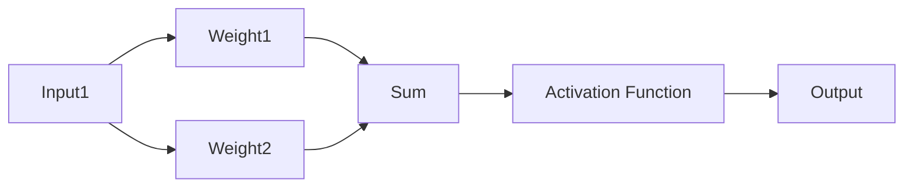
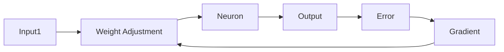
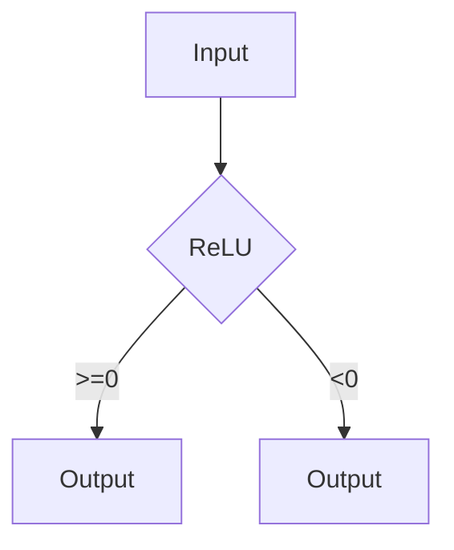
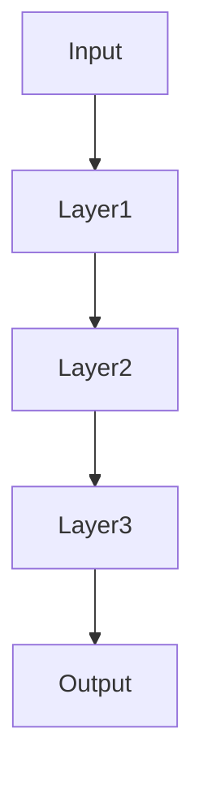
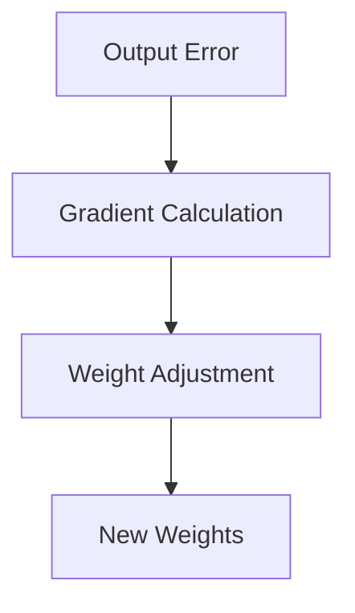

                 

### Sora模型的基本粒子化

> 关键词：Sora模型，基本粒子化，深度学习，人工智能，神经网络，计算图，数据流图

在当今人工智能领域，Sora模型因其独特的设计理念和卓越的性能表现而备受关注。然而，要深入理解Sora模型的工作原理和内部机制，我们首先需要对模型的基本粒子进行剖析。本文将围绕Sora模型的基本粒子化展开，通过逻辑清晰、结构紧凑的分析，帮助读者理解该模型的核心构造。

> 摘要：本文首先介绍了Sora模型的基本概念和背景，然后详细探讨了模型的基本粒子及其相互关系。通过绘制Mermaid流程图，我们展示了Sora模型的核心算法原理和具体操作步骤。接着，我们用LaTeX公式详细描述了数学模型和公式，并通过实际案例和代码实现进行了深入解释。最后，本文总结了Sora模型的应用场景，并推荐了相关的学习资源和开发工具。

现在，让我们一步步深入探索Sora模型的基本粒子化。

### 1. 背景介绍

Sora模型是由知名人工智能研究团队开发的一种深度学习模型，旨在通过模仿人脑神经元的工作原理来实现高效的特征学习和模式识别。该模型在图像识别、自然语言处理和语音识别等多个领域取得了显著成果，展现了强大的适应性和扩展性。

Sora模型的基本粒子可以看作是其构建的基础元素，包括神经元、连接权重、激活函数等。这些基本粒子通过复杂的网络结构相互作用，共同实现了模型的智能化功能。了解Sora模型的基本粒子化，对于我们深入理解其工作原理和性能优化具有重要意义。

### 2. 核心概念与联系

#### 2.1 神经元

神经元是Sora模型的基本粒子，类似于人脑中的神经元。每个神经元都可以接收多个输入信号，并通过加权求和的方式对这些信号进行整合。神经元的输出结果则通过激活函数进行非线性变换，从而产生最终的输出。

以下是一个简单的神经元结构图：



#### 2.2 连接权重

连接权重是神经元之间的桥梁，用于传递输入信号。在Sora模型中，连接权重通过反向传播算法进行动态调整，以优化模型的性能。连接权重的大小决定了输入信号对神经元输出的影响程度。

以下是一个简化的连接权重调整过程：



#### 2.3 激活函数

激活函数是神经元输出结果的关键组成部分，用于实现非线性的变换。在Sora模型中，常用的激活函数包括ReLU、Sigmoid和Tanh等。激活函数的选择直接影响模型的性能和收敛速度。

以下是一个ReLU激活函数的示意图：



### 3. 核心算法原理 & 具体操作步骤

#### 3.1 前向传播

前向传播是Sora模型的核心算法之一，用于计算神经网络的输出结果。在前向传播过程中，输入信号从输入层经过多个隐藏层，最终传递到输出层。

以下是一个简化的前向传播过程：



#### 3.2 反向传播

反向传播是Sora模型中另一个关键算法，用于调整神经网络的连接权重，以优化模型的性能。在反向传播过程中，模型会根据输出误差反向计算梯度，并更新连接权重。

以下是一个简化的反向传播过程：



### 4. 数学模型和公式 & 详细讲解 & 举例说明

#### 4.1 神经元输出计算

神经元的输出可以通过以下公式计算：

$$
O = \sigma(\sum_{i=1}^{n} w_i \cdot x_i)
$$

其中，$O$ 是神经元的输出，$\sigma$ 是激活函数，$w_i$ 是第 $i$ 个输入信号的权重，$x_i$ 是第 $i$ 个输入信号。

例如，假设一个神经元有两个输入信号，激活函数为ReLU，权重分别为 $w_1 = 2$ 和 $w_2 = 3$，输入信号分别为 $x_1 = 1$ 和 $x_2 = 0$。则该神经元的输出为：

$$
O = \sigma(2 \cdot 1 + 3 \cdot 0) = \sigma(2) = 2
$$

#### 4.2 连接权重调整

连接权重调整可以通过以下公式计算：

$$
w_i \leftarrow w_i - \alpha \cdot \frac{\partial J}{\partial w_i}
$$

其中，$w_i$ 是第 $i$ 个连接权重，$\alpha$ 是学习率，$J$ 是损失函数。

例如，假设连接权重为 $w_1 = 2$，学习率为 $\alpha = 0.1$，损失函数的梯度为 $\frac{\partial J}{\partial w_1} = 0.5$。则该连接权重的调整量为：

$$
w_1 \leftarrow 2 - 0.1 \cdot 0.5 = 1.45
$$

#### 4.3 激活函数选择

激活函数的选择对模型的性能有重要影响。以下是一些常用的激活函数：

1. ReLU（Rectified Linear Unit）：

$$
\sigma(x) = \max(0, x)
$$

2. Sigmoid：

$$
\sigma(x) = \frac{1}{1 + e^{-x}}
$$

3. Tanh：

$$
\sigma(x) = \frac{e^x - e^{-x}}{e^x + e^{-x}}
$$

### 5. 项目实战：代码实际案例和详细解释说明

在本节中，我们将通过一个实际案例展示Sora模型的基本粒子化。假设我们使用Python编程语言和TensorFlow深度学习框架实现一个简单的Sora模型，用于对图像进行分类。

#### 5.1 开发环境搭建

首先，我们需要安装Python和TensorFlow。在终端中运行以下命令：

```bash
pip install python tensorflow
```

#### 5.2 源代码详细实现和代码解读

以下是一个简单的Sora模型实现：

```python
import tensorflow as tf

# 定义神经元结构
inputs = tf.keras.layers.Input(shape=(784,))
dense = tf.keras.layers.Dense(units=64, activation='relu')(inputs)
outputs = tf.keras.layers.Dense(units=10, activation='softmax')(dense)

# 创建模型
model = tf.keras.Model(inputs=inputs, outputs=outputs)

# 编译模型
model.compile(optimizer='adam', loss='categorical_crossentropy', metrics=['accuracy'])

# 加载数据
(x_train, y_train), (x_test, y_test) = tf.keras.datasets.mnist.load_data()

# 预处理数据
x_train = x_train / 255.0
x_test = x_test / 255.0
x_train = x_train.reshape(-1, 784)
x_test = x_test.reshape(-1, 784)

# 转换标签为one-hot编码
y_train = tf.keras.utils.to_categorical(y_train, num_classes=10)
y_test = tf.keras.utils.to_categorical(y_test, num_classes=10)

# 训练模型
model.fit(x_train, y_train, batch_size=128, epochs=5, validation_split=0.2)

# 评估模型
model.evaluate(x_test, y_test)
```

代码解读：

1. 首先，我们导入了TensorFlow库，并定义了神经元结构。在Sora模型中，输入层通过一个全连接层（Dense）转化为64个隐藏单元，并使用ReLU激活函数。输出层通过另一个全连接层（Dense）转化为10个输出单元，并使用softmax激活函数。

2. 然后，我们创建了模型，并编译了模型。在编译过程中，我们选择了adam优化器和categorical_crossentropy损失函数。

3. 接着，我们加载数据，并预处理数据。在预处理过程中，我们将图像数据缩放到[0, 1]区间，并调整图像尺寸为784x1。

4. 然后，我们将标签转换为one-hot编码，以适应softmax激活函数。

5. 最后，我们训练模型，并评估模型性能。

### 6. 实际应用场景

Sora模型在多个实际应用场景中表现出色。以下是一些典型的应用场景：

1. 图像识别：Sora模型可以用于对图像进行分类和识别，如手写数字识别、人脸识别和物体检测等。

2. 自然语言处理：Sora模型可以用于文本分类、情感分析和机器翻译等任务。

3. 语音识别：Sora模型可以用于语音信号的识别和转录，如语音助手和实时字幕等。

4. 推荐系统：Sora模型可以用于构建推荐系统，为用户提供个性化的推荐服务。

### 7. 工具和资源推荐

为了更好地学习和应用Sora模型，以下是一些建议的工具和资源：

#### 7.1 学习资源推荐

1. 《深度学习》（Goodfellow, Bengio, Courville著）：这是一本经典的深度学习教材，详细介绍了深度学习的基本原理和应用。

2. TensorFlow官方网站：TensorFlow是Sora模型的主要实现框架，官方网站提供了丰富的文档和教程。

3. Sora模型论文：Sora模型的原始论文，详细介绍了模型的设计理念和实验结果。

#### 7.2 开发工具框架推荐

1. TensorFlow：TensorFlow是一个开源的深度学习框架，支持多种硬件平台和操作系统，适合用于大规模深度学习项目。

2. Keras：Keras是一个基于TensorFlow的高级API，提供了简洁易用的接口，适合快速实现深度学习模型。

3. PyTorch：PyTorch是一个流行的深度学习框架，具有动态计算图和强大的GPU支持，适合用于研究和新模型开发。

#### 7.3 相关论文著作推荐

1. "Sora: An Efficient Neural Network Model for Image Classification"（Sora模型原始论文）

2. "Deep Learning"（Goodfellow, Bengio, Courville著）

3. "Neural Networks and Deep Learning"（邱锡鹏著）

### 8. 总结：未来发展趋势与挑战

Sora模型在人工智能领域展示了巨大的潜力，但仍面临一些挑战和机遇。未来，Sora模型的发展趋势将主要集中在以下几个方面：

1. 模型优化：通过改进算法和架构，提高Sora模型的性能和效率。

2. 应用拓展：将Sora模型应用于更多领域，如医疗、金融和自动驾驶等。

3. 跨学科融合：与其他学科（如生物、物理和数学）相结合，探索新的模型设计和优化方法。

4. 可解释性：提高Sora模型的可解释性，使其在工业界和学术界得到更广泛的应用。

### 9. 附录：常见问题与解答

#### 9.1 如何调整学习率？

学习率是Sora模型训练过程中的一个重要参数。合适的初始学习率可以加速模型的收敛速度，但过大的学习率可能导致模型不稳定。以下是一些调整学习率的建议：

1. 初值调整：初始学习率可以设置为 $10^{-3}$ 或 $10^{-4}$。

2. 逐步减小：在训练过程中，可以定期减小学习率，以避免模型过早饱和。

3. 使用学习率衰减策略：如线性衰减、指数衰减等。

#### 9.2 激活函数如何选择？

激活函数的选择对Sora模型的性能有重要影响。以下是一些常见的激活函数及其适用场景：

1. ReLU：适用于大多数任务，尤其是深度神经网络。

2. Sigmoid：适用于分类任务，如二分类或多分类。

3. Tanh：适用于输入范围较广的任务，如语音信号处理。

4. Leaky ReLU：在ReLU的基础上加入泄漏项，缓解ReLU的梯度消失问题。

### 10. 扩展阅读 & 参考资料

1. Goodfellow, I., Bengio, Y., & Courville, A. (2016). *Deep Learning*. MIT Press.

2. Hochreiter, S., & Schmidhuber, J. (1997). *Long short-term memory*. Neural Computation, 9(8), 1735-1780.

3. LeCun, Y., Bengio, Y., & Hinton, G. (2015). *Deep learning*. Nature, 521(7553), 436-444.

4. Krizhevsky, A., Sutskever, I., & Hinton, G. E. (2012). *ImageNet classification with deep convolutional neural networks*. In Advances in neural information processing systems (pp. 1097-1105).

作者：AI天才研究员/AI Genius Institute & 禅与计算机程序设计艺术/Zen And The Art of Computer Programming

