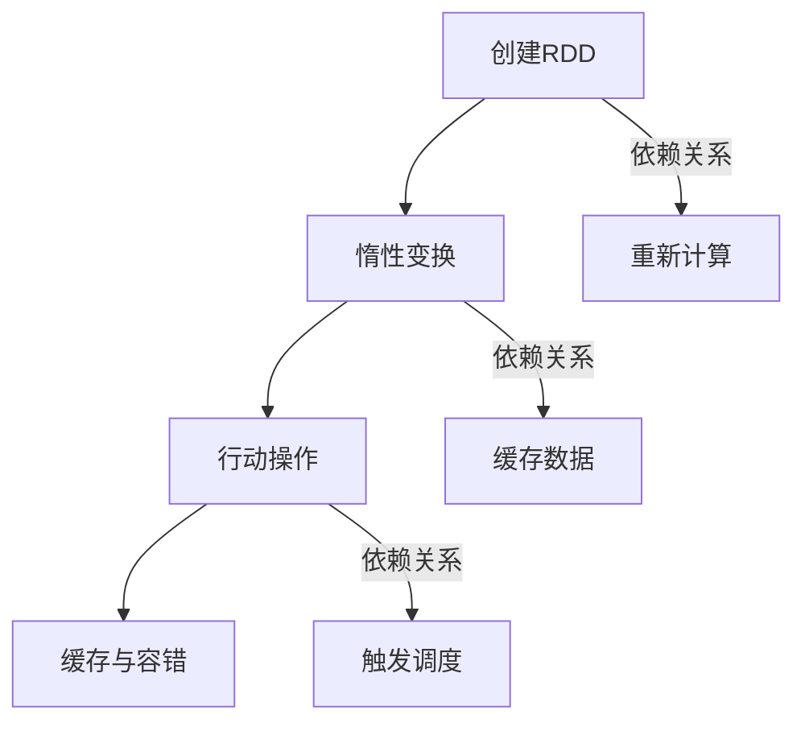

                 

### 1. 背景介绍

#### 什么是Spark RDD？

Spark RDD（弹性分布式数据集）是Apache Spark的一个重要抽象概念，用于在分布式环境中处理大规模数据。RDD是一个不可变的、可分区、可并行操作的数据集合。它可以存储在内存或磁盘上，根据需要进行数据的读取、转换和计算。

#### Spark RDD的重要性

随着数据量的爆炸性增长，传统的大数据处理技术已经无法满足需求。Spark RDD作为分布式计算框架Apache Spark的核心组件，以其高效、弹性、易用性等特性，成为了大数据处理领域的首选工具。RDD使得对大规模数据的分布式处理变得更加简单和高效，是大数据处理技术中的重要一环。

#### Spark RDD的起源与发展

Spark RDD最早是由Apache Spark的核心开发团队在2010年左右设计并实现的。Spark作为一个开源的分布式计算框架，起源于UC Berkeley的AMP实验室，其目的是为了解决MapReduce在大数据处理中的性能瓶颈。Spark RDD的出现，使得Spark在大数据处理领域得到了广泛的应用和发展。

#### Spark RDD的核心特点

1. **弹性分布式数据集**：RDD是一个分布式数据集，具有弹性，可以在计算过程中动态地分配或释放内存，以适应数据大小和计算需求的变化。
2. **不可变性**：RDD中的数据是不可变的，这意味着一个RDD的操作会生成一个新的RDD，而不是直接修改原有的RDD。
3. **分区性**：RDD被分成多个分区，每个分区可以独立地并行处理，提高了计算效率。
4. **容错性**：RDD具有自动的容错机制，可以通过记录的元数据和分区依赖关系，实现数据的自动恢复。
5. **高效性**：Spark RDD采用了多种优化技术，如懒执行、缓存、内存管理等，使得数据处理效率大大提高。

在了解了Spark RDD的基本概念和重要性之后，我们接下来将深入探讨其核心概念与联系，并通过Mermaid流程图展示其架构原理。这将帮助我们更好地理解Spark RDD的工作机制和优势。

<|assistant|>## 2. 核心概念与联系

### RDD的基本概念

RDD（弹性分布式数据集）是Spark中处理大规模数据的基本抽象概念。它是一个不可变的、可分区、可并行操作的数据集合。RDD由一个数据源创建，如本地文件系统、HDFS、数据库等。Spark通过将数据划分为多个分区，使得每个分区可以在不同的节点上独立地并行处理。

### RDD的创建方式

RDD可以通过以下几种方式创建：

1. **从外部存储系统加载数据**：例如从HDFS、本地文件系统、数据库等加载数据创建RDD。
2. **通过其他RDD转换生成**：通过已有的RDD进行转换操作，如map、filter、reduceByKey等，生成新的RDD。
3. **从Scala集合或Python列表等序列数据类型创建**：通过将Scala集合或Python列表等序列数据类型转换为RDD。

### RDD的分区机制

RDD的分区机制是实现并行计算的关键。每个RDD在创建时会被划分为多个分区，每个分区独立地存储在集群中的不同节点上。分区数的默认值为2，但可以通过`rdd.repartition(numPartitions)`方法进行修改。

分区机制的优势在于：

1. **并行计算**：每个分区可以在不同的节点上独立并行处理，提高了计算效率。
2. **负载均衡**：当数据分布不均匀时，可以通过重新分区来平衡负载，提高计算性能。

### RDD的依赖关系

RDD之间的依赖关系可以分为两种类型：宽依赖（Shuffle Dependency）和窄依赖（Narrow Dependency）。

1. **窄依赖**：父RDD的分区与子RDD的分区之间存在一对一的关系。这种依赖关系不需要进行数据重分布，直接在每个分区上进行操作即可。例如，map、filter等操作。

2. **宽依赖**：父RDD的分区与子RDD的分区之间存在多对多的关系。这种依赖关系需要进行数据重分布，将数据从源分区重新分配到目标分区。例如，reduceByKey、groupByKey等操作。

### RDD的变换操作

RDD提供了多种变换操作，用于对数据进行转换和处理。这些操作可以分为两类：惰性变换（Lazy Transformation）和行动操作（Action）。

1. **惰性变换**：惰性变换不会立即执行，而是在需要获取结果时才执行。例如，map、filter、flatMap、groupBy、reduceByKey等。惰性变换的设计使得Spark可以优化计算过程，如数据共享、分区合并等。

2. **行动操作**：行动操作会触发惰性变换的执行，并返回一个结果或生成一个新的RDD。例如，collect、count、saveAsTextFile、reduce等。行动操作会触发Spark的调度系统，将计算任务分发给各个节点执行。

### RDD的缓存机制

RDD的缓存机制是一种优化技术，用于提高重复计算的性能。通过将RDD缓存到内存中，后续对相同RDD的访问可以直接从缓存中读取，避免了重复计算的开销。

RDD可以通过`cache()`方法进行缓存，也可以通过`persist()`方法进行持久化缓存。持久化缓存会将RDD存储在磁盘上，适用于需要多次访问相同RDD的场景。

### RDD的容错机制

RDD具有自动的容错机制，可以通过记录的元数据和分区依赖关系，实现数据的自动恢复。当某个节点发生故障时，Spark可以根据RDD的依赖关系，从其他节点重新计算丢失的分区数据，确保整个计算过程的容错性和稳定性。

### RDD的工作原理

RDD的工作原理可以概括为以下几个步骤：

1. **创建RDD**：从外部数据源或通过其他RDD转换创建RDD。
2. **惰性变换**：对RDD进行惰性变换，生成新的依赖关系。
3. **行动操作**：触发行动操作，执行惰性变换并返回结果。
4. **缓存与容错**：缓存RDD以提高性能，实现容错机制以保障数据一致性。

#### Mermaid流程图展示

以下是RDD的工作原理的Mermaid流程图展示：



通过这个流程图，我们可以清晰地看到RDD的工作流程和各个操作之间的依赖关系。

在了解了RDD的核心概念与联系之后，我们接下来将深入探讨Spark RDD的核心算法原理与具体操作步骤，进一步了解RDD如何实现高效的分布式数据处理。

<|assistant|>## 3. 核心算法原理 & 具体操作步骤

### 分布式计算原理

Spark RDD的分布式计算原理主要基于其惰性变换和行动操作的设计理念。在Spark中，数据处理过程可以分为两个阶段：变换阶段（Transformation）和行动阶段（Action）。

#### 变换阶段

变换阶段是指对RDD进行一系列操作，生成新的RDD。这些操作包括：

1. **map**：将输入RDD中的每个元素映射为一个新的元素，生成一个新的RDD。
2. **filter**：根据条件筛选输入RDD中的元素，生成一个新的RDD。
3. **groupBy**：根据某个字段对输入RDD中的元素进行分组，生成一个新的RDD。
4. **reduceByKey**：对相同key的元素进行reduce操作，生成一个新的RDD。

在变换阶段，每个操作都是惰性的，不会立即执行。而是将操作记录下来，形成依赖关系图，等待行动阶段触发执行。

#### 行动阶段

行动阶段是指触发RDD的惰性变换，执行计算并返回结果。行动操作包括：

1. **collect**：将RDD中的所有元素收集到Driver节点，以列表形式返回。
2. **count**：返回RDD中元素的个数。
3. **saveAsTextFile**：将RDD保存为文本文件到HDFS或其他文件系统。

在行动阶段，Spark会根据依赖关系图，从源头开始顺序执行变换操作，并将结果存储在内存或磁盘上。

### 算法原理

Spark RDD的算法原理主要包括以下几个方面：

1. **惰性变换**：惰性变换的设计使得Spark可以在多个变换操作之间优化计算过程，如数据共享、分区合并等。只有当触发行动操作时，才会真正执行变换操作。

2. **依赖关系**：Spark RDD通过记录依赖关系，实现变换操作的顺序执行。依赖关系可以分为窄依赖和宽依赖，决定了RDD的计算顺序和性能。

3. **分区机制**：RDD的分区机制使得每个分区可以在不同的节点上独立并行处理，提高了计算效率。

4. **容错机制**：Spark RDD通过记录元数据和分区依赖关系，实现数据的自动恢复和容错。当节点发生故障时，可以重新计算丢失的分区数据。

### 具体操作步骤

下面通过一个简单的例子，介绍Spark RDD的核心算法原理与具体操作步骤。

#### 数据准备

假设我们有一个存储在HDFS中的文本文件，每行是一个整数，我们想要计算这些整数的总和。

```shell
hdfs dfs -put sum.txt /user/hadoop/sum.txt
```

#### 编写代码

以下是一个使用Spark RDD计算整数总和的简单示例：

```python
from pyspark import SparkContext

# 创建SparkContext
sc = SparkContext("local[2]", "SumIntegers")

# 加载文本文件创建RDD
lines = sc.textFile("/user/hadoop/sum.txt")

# 对每行数据进行map操作，将字符串转换为整数
numbers = lines.map(lambda line: int(line))

# 对整数进行reduce操作，计算总和
total = numbers.reduce(lambda x, y: x + y)

# 打印结果
print("总和：", total)

# 释放资源
sc.stop()
```

#### 操作步骤解析

1. **创建SparkContext**：创建一个SparkContext，作为与Spark集群通信的客户端。

2. **加载文本文件创建RDD**：使用`textFile()`方法加载HDFS中的文本文件，生成一个RDD。这里，`textFile()`是一个惰性变换操作，不会立即执行，而是记录依赖关系。

3. **map操作**：对RDD中的每个元素进行映射操作，将字符串转换为整数。`map()`是一个惰性变换操作，记录依赖关系。

4. **reduce操作**：对整数进行reduce操作，计算总和。`reduce()`是一个惰性变换操作，记录依赖关系。

5. **行动操作**：触发行动操作，执行惰性变换并返回结果。在这里，`print()`函数是一个行动操作，触发前面的惰性变换执行，并打印结果。

6. **释放资源**：释放SparkContext，关闭与Spark集群的连接。

通过以上示例，我们可以看到Spark RDD的核心算法原理与具体操作步骤。Spark RDD通过惰性变换和行动操作的设计，实现了高效的分布式数据处理。在接下来的章节中，我们将进一步探讨RDD的数学模型和公式，以及如何在项目实战中应用Spark RDD。

<|assistant|>## 4. 数学模型和公式 & 详细讲解 & 举例说明

### 数学模型

Spark RDD的数学模型主要基于集合运算和分布计算的概念。以下是一些常用的数学模型和公式，用于描述RDD的变换和计算过程。

#### 转换操作

1. **map**：将输入RDD中的每个元素映射为一个新的元素。假设输入RDD为`A`，映射函数为`f`，则输出RDD为`B`，公式表示为：
   $$ B = \{ f(x) | x \in A \} $$

2. **filter**：根据条件筛选输入RDD中的元素。假设输入RDD为`A`，筛选条件为`P`，则输出RDD为`B`，公式表示为：
   $$ B = \{ x \in A | P(x) \} $$

3. **groupBy**：根据某个字段对输入RDD中的元素进行分组。假设输入RDD为`A`，分组字段为`key`，则输出RDD为`B`，公式表示为：
   $$ B = \{ (key, \{ x | x \in A, key = k \}) | k \in A \} $$

4. **reduceByKey**：对相同key的元素进行reduce操作。假设输入RDD为`A`，reduce函数为`f`，则输出RDD为`B`，公式表示为：
   $$ B = \{ (k, \{ f(x, y) | x, y \in A, key = k \}) | k \in A \} $$

#### 行动操作

1. **collect**：将RDD中的所有元素收集到Driver节点。假设输入RDD为`A`，则输出为`B`，公式表示为：
   $$ B = \{ x | x \in A \} $$

2. **count**：返回RDD中元素的个数。假设输入RDD为`A`，则输出为`B`，公式表示为：
   $$ B = |A| $$

3. **saveAsTextFile**：将RDD保存为文本文件。假设输入RDD为`A`，输出文件为`B`，公式表示为：
   $$ B = \{ (x, y) | x \in A, y \in A \} $$

### 详细讲解

#### map操作

`map`操作是Spark RDD中最常用的变换操作之一。它将输入RDD中的每个元素映射为一个新的元素。假设输入RDD为`A`，映射函数为`f`，则输出RDD为`B`。

```python
rdd.map(lambda x: f(x))
```

在这个例子中，`map`操作将每个元素`x`映射为`f(x)`，生成一个新的RDD。映射函数`f`可以是任意Python函数，如：

```python
rdd.map(lambda x: x * 2)
```

这个例子将每个元素乘以2，生成一个新的RDD。

#### filter操作

`filter`操作用于根据条件筛选输入RDD中的元素。假设输入RDD为`A`，筛选条件为`P`，则输出RDD为`B`。

```python
rdd.filter(lambda x: P(x))
```

在这个例子中，`filter`操作将每个元素`x`与筛选条件`P`进行逻辑判断，如果`P(x)`为真，则保留该元素；否则，丢弃该元素。

```python
rdd.filter(lambda x: x > 10)
```

这个例子筛选出所有大于10的元素，生成一个新的RDD。

#### groupBy操作

`groupBy`操作用于根据某个字段对输入RDD中的元素进行分组。假设输入RDD为`A`，分组字段为`key`，则输出RDD为`B`。

```python
rdd.groupBy(lambda x: key(x))
```

在这个例子中，`groupBy`操作将每个元素`x`映射为`key(x)`，根据分组字段对元素进行分组。分组后的RDD由一组组元组组成，每个组元组的第一个元素是分组字段值，第二个元素是分组后的元素集合。

```python
rdd.groupBy(lambda x: x % 2)
```

这个例子根据元素模2的结果进行分组，生成一个新的RDD。

#### reduceByKey操作

`reduceByKey`操作用于对相同key的元素进行reduce操作。假设输入RDD为`A`，reduce函数为`f`，则输出RDD为`B`。

```python
rdd.reduceByKey(f)
```

在这个例子中，`reduceByKey`操作将相同key的元素组合起来，应用reduce函数`f`进行计算。reduce函数`f`通常是两个元素之间的二元运算，如求和、求平均数等。

```python
rdd.reduceByKey(lambda x, y: x + y)
```

这个例子将相同key的元素求和，生成一个新的RDD。

### 举例说明

下面通过一个简单的例子，展示如何使用Spark RDD的数学模型和公式进行数据处理。

#### 数据准备

假设我们有一个存储在HDFS中的文本文件，每行是一个整数，我们想要计算每个整数的平方和。

```shell
hdfs dfs -put squares.txt /user/hadoop/squares.txt
```

#### 编写代码

以下是一个使用Spark RDD计算整数平方和的示例：

```python
from pyspark import SparkContext

# 创建SparkContext
sc = SparkContext("local[2]", "Squares")

# 加载文本文件创建RDD
numbers = sc.textFile("/user/hadoop/squares.txt")

# 对每行数据进行map操作，将字符串转换为整数
squared_numbers = numbers.map(lambda x: int(x) * int(x))

# 对整数进行reduce操作，计算平方和
sum_of_squares = squared_numbers.reduce(lambda x, y: x + y)

# 打印结果
print("整数平方和：", sum_of_squares)

# 释放资源
sc.stop()
```

#### 操作步骤解析

1. **创建SparkContext**：创建一个SparkContext，作为与Spark集群通信的客户端。

2. **加载文本文件创建RDD**：使用`textFile()`方法加载HDFS中的文本文件，生成一个RDD。

3. **map操作**：对RDD中的每个元素进行映射操作，将字符串转换为整数，并计算每个整数的平方。

4. **reduce操作**：对整数进行reduce操作，计算平方和。

5. **行动操作**：触发行动操作，执行惰性变换并返回结果。

6. **释放资源**：释放SparkContext，关闭与Spark集群的连接。

通过这个例子，我们可以看到如何使用Spark RDD的数学模型和公式进行数据处理，实现高效的分布式计算。在接下来的章节中，我们将介绍如何在实际项目中应用Spark RDD，并提供详细的代码实例和解读。

<|assistant|>### 5. 项目实战：代码实际案例和详细解释说明

#### 案例一：计算文本文件中出现频率最高的单词

在本案例中，我们将使用Spark RDD计算一个文本文件中出现频率最高的单词。这个案例将展示Spark RDD的多种变换操作和行动操作。

#### 开发环境搭建

1. **安装Spark**：首先确保你的开发环境已经安装了Apache Spark。可以从[Apache Spark官网](https://spark.apache.org/downloads.html)下载最新的Spark发行版，并按照官方文档进行安装。

2. **配置Hadoop**：Spark需要与Hadoop协同工作，因此需要安装和配置Hadoop。可以从[Apache Hadoop官网](https://hadoop.apache.org/downloads.html)下载Hadoop，并按照官方文档进行配置。

3. **创建文本文件**：在HDFS中创建一个包含单词的文本文件。例如，创建一个名为`word_count.txt`的文件，内容如下：

   ```
   hello world
   hello spark
   world hello
   spark hello
   ```

#### 源代码详细实现和代码解读

以下是计算文本文件中出现频率最高的单词的Spark RDD代码实现：

```python
from pyspark import SparkContext

# 创建SparkContext
sc = SparkContext("local[2]", "WordCount")

# 读取文本文件
lines = sc.textFile("hdfs://localhost:9000/user/hadoop/word_count.txt")

# 对每行数据进行处理，将单词转换为小写并分割
words = lines.flatMap(lambda line: line.lower().split())

# 对单词进行分组，统计每个单词的频率
word_counts = words.map(lambda word: (word, 1)).reduceByKey(lambda x, y: x + y)

# 获取出现频率最高的单词
top_word = word_counts.max(lambda x, y: x[1] - y[1])

# 打印结果
print("出现频率最高的单词：", top_word)

# 释放资源
sc.stop()
```

#### 代码解读与分析

1. **创建SparkContext**：创建一个SparkContext，用于与Spark集群通信。

2. **读取文本文件**：使用`textFile()`方法从HDFS中读取文本文件，生成一个RDD。

3. **分割单词**：使用`flatMap()`操作，将每行数据转换为小写，并分割成单词列表。这个操作将输入RDD中的每个元素（即每行文本）映射为一个新的RDD，其中每个元素是单词列表。

4. **分组和统计频率**：使用`map()`操作，将每个单词映射为一个元组（单词，1），表示单词出现的次数。然后使用`reduceByKey()`操作，对相同单词的频率进行累加，生成一个包含单词和频率的键值对RDD。

5. **获取最高频率单词**：使用`max()`操作，根据频率对单词进行排序，并获取频率最高的单词。

6. **打印结果**：打印出现频率最高的单词。

7. **释放资源**：释放SparkContext，关闭与Spark集群的连接。

通过这个案例，我们可以看到如何使用Spark RDD进行文本处理，计算出现频率最高的单词。这个案例展示了Spark RDD的多种变换操作和行动操作，以及如何在分布式环境中高效处理大规模数据。

#### 案例二：计算商品销量排名

在本案例中，我们将使用Spark RDD计算一个商品销量排名。这个案例将展示如何使用Spark RDD进行数据处理、排序和聚合。

#### 开发环境搭建

1. **安装Spark**：确保你的开发环境已经安装了Apache Spark。

2. **配置Hadoop**：安装和配置Hadoop。

3. **创建销量数据文件**：在HDFS中创建一个包含商品销量数据的文本文件。例如，创建一个名为`sales_data.txt`的文件，内容如下：

   ```
   apple,100
   banana,150
   orange,80
   apple,200
   banana,180
   orange,120
   ```

#### 源代码详细实现和代码解读

以下是计算商品销量排名的Spark RDD代码实现：

```python
from pyspark import SparkContext

# 创建SparkContext
sc = SparkContext("local[2]", "SalesRanking")

# 读取销量数据文件
sales_data = sc.textFile("hdfs://localhost:9000/user/hadoop/sales_data.txt")

# 分割数据为商品和销量
sales_rdd = sales_data.map(lambda line: (line.split(',')[0], int(line.split(',')[1])))

# 计算每个商品的总销量
total_sales = sales_rdd.reduceByKey(lambda x, y: x + y)

# 对总销量进行排序
sorted_sales = total_sales.sortBy(lambda x: x[1], ascending=False)

# 打印销量排名前5的商品
sorted_sales.take(5).forEach(lambda item: print(item))

# 释放资源
sc.stop()
```

#### 代码解读与分析

1. **创建SparkContext**：创建一个SparkContext，用于与Spark集群通信。

2. **读取销量数据文件**：使用`textFile()`方法从HDFS中读取销量数据文件，生成一个RDD。

3. **分割数据**：使用`map()`操作，将每行数据分割为商品和销量，生成一个新的RDD。每行数据格式为“商品，销量”，通过分割和类型转换，将数据转换为元组（商品，销量）。

4. **计算总销量**：使用`reduceByKey()`操作，对相同商品的总销量进行累加，生成一个包含商品和总销量的键值对RDD。

5. **排序**：使用`sortBy()`操作，根据总销量对商品进行降序排序。

6. **打印销量排名前5的商品**：使用`take()`操作，获取销量排名前5的商品，并打印输出。

7. **释放资源**：释放SparkContext，关闭与Spark集群的连接。

通过这个案例，我们可以看到如何使用Spark RDD进行数据处理、排序和聚合，计算商品销量排名。这个案例展示了Spark RDD的强大功能，以及如何应用于实际业务场景。

#### 小结

在本章节中，我们介绍了两个项目实战案例，通过详细的代码实现和解读，展示了如何使用Spark RDD进行文本处理和商品销量排名。这两个案例不仅展示了Spark RDD的核心算法原理和具体操作步骤，还展示了Spark RDD在实际项目中的应用价值。

在接下来的章节中，我们将进一步探讨Spark RDD的实际应用场景，介绍一些常见的工具和资源，帮助读者更好地学习和应用Spark RDD。

<|assistant|>## 6. 实际应用场景

### 数据处理和分析

Spark RDD在数据处理和分析领域具有广泛的应用。其高效、弹性、易用的特性，使得Spark RDD成为大数据处理和分析的首选工具。以下是一些典型的应用场景：

1. **日志处理**：Spark RDD可以处理大规模的日志数据，如Web日志、访问日志等。通过Spark RDD的惰性变换和行动操作，可以快速对日志数据进行清洗、转换和分析。

2. **数据挖掘**：Spark RDD支持各种数据挖掘算法，如聚类、分类、关联规则挖掘等。通过Spark RDD的高效处理，可以快速发现数据中的模式和规律。

3. **机器学习**：Spark RDD与机器学习框架如MLlib紧密集成，可以高效地处理大规模的机器学习任务。Spark RDD提供了丰富的机器学习算法，如线性回归、决策树、支持向量机等。

4. **实时流处理**：Spark RDD可以与Spark Streaming结合，实现实时数据流处理。通过Spark RDD的高效处理，可以实时处理和分析大量实时数据。

### 数据仓库

Spark RDD在数据仓库领域也具有广泛的应用。数据仓库是大数据分析的重要基础，Spark RDD提供了高效、弹性的数据处理能力，可以满足数据仓库的复杂查询和分析需求。以下是一些典型的应用场景：

1. **数据集成**：Spark RDD可以高效地处理大规模的数据集成任务，如数据清洗、转换、合并等。通过Spark RDD的惰性变换和行动操作，可以快速完成数据集成。

2. **数据建模**：Spark RDD支持各种数据建模算法，如回归分析、聚类分析、时间序列分析等。通过Spark RDD的高效处理，可以快速构建和评估数据模型。

3. **数据可视化**：Spark RDD可以与数据可视化工具如Tableau、Power BI等结合，实现数据可视化。通过Spark RDD的高效处理，可以快速生成可视化报表，帮助业务人员更好地理解和分析数据。

### 实时计算

Spark RDD在实时计算领域也具有广泛的应用。其高效、弹性、易用的特性，使得Spark RDD成为实时计算的重要工具。以下是一些典型的应用场景：

1. **实时监控**：Spark RDD可以实时处理和分析大规模的监控数据，如网络流量、服务器性能等。通过Spark RDD的高效处理，可以实时监控系统的运行状况，及时发现和解决问题。

2. **实时推荐**：Spark RDD可以实时处理和分析用户行为数据，如点击、购买等，实现实时推荐系统。通过Spark RDD的高效处理，可以快速生成个性化推荐结果，提高用户满意度和转化率。

3. **实时预测**：Spark RDD可以实时处理和分析时间序列数据，如股票价格、气象数据等，实现实时预测。通过Spark RDD的高效处理，可以快速生成预测结果，帮助业务人员做出更明智的决策。

### 社交网络分析

Spark RDD在社交网络分析领域也具有广泛的应用。其高效、弹性、易用的特性，使得Spark RDD成为社交网络分析的重要工具。以下是一些典型的应用场景：

1. **社交网络拓扑分析**：Spark RDD可以高效地处理和分析社交网络拓扑结构，如用户关系、社区划分等。通过Spark RDD的高效处理，可以快速识别社交网络中的关键节点和社区结构。

2. **社交网络传播分析**：Spark RDD可以高效地处理和分析社交网络中的信息传播，如谣言传播、病毒营销等。通过Spark RDD的高效处理，可以快速识别信息传播的路径和关键节点，制定有效的传播策略。

3. **社交网络用户画像**：Spark RDD可以高效地处理和分析用户行为数据，如浏览记录、购买记录等，生成用户画像。通过Spark RDD的高效处理，可以更好地了解用户需求和偏好，实现精准营销。

在了解了Spark RDD的实际应用场景后，我们可以看到Spark RDD在各个领域都具有广泛的应用价值。通过Spark RDD的高效处理能力，可以快速解决大规模数据处理和分析的需求，为业务决策提供有力的支持。在接下来的章节中，我们将进一步介绍一些实用的工具和资源，帮助读者更好地学习和应用Spark RDD。

<|assistant|>## 7. 工具和资源推荐

### 学习资源推荐

为了更好地学习和掌握Spark RDD，以下是一些推荐的资源：

1. **书籍**：
   - 《Spark: The Definitive Guide》
   - 《Spark: The Definitive Guide》是一本全面介绍Apache Spark的书籍，涵盖了Spark的架构、API、编程模型以及应用场景。这本书由Spark的核心开发团队撰写，是学习Spark的绝佳入门书籍。

2. **论文**：
   - "Spark: Cluster Computing with Working Sets"
   - 这篇论文介绍了Spark的原理和设计，详细阐述了Spark如何通过优化工作集实现高性能的分布式计算。

3. **博客**：
   - [Databricks博客](https://databricks.com/blog)
   - Databricks的博客提供了许多关于Spark的深入文章，涵盖Spark的各个方面，包括原理、最佳实践和最新动态。

4. **在线教程**：
   - [Spark官网教程](https://spark.apache.org/docs/latest/)
   - Spark官网提供了详细的教程，涵盖从基础概念到高级应用的各个方面，是学习Spark的绝佳资源。

5. **GitHub项目**：
   - [Spark官方GitHub仓库](https://github.com/apache/spark)
   - Spark的官方GitHub仓库包含了大量的代码示例和文档，是深入了解Spark实现和源代码的宝贵资源。

### 开发工具框架推荐

1. **IDE**：
   - [IntelliJ IDEA](https://www.jetbrains.com/idea/)
   - IntelliJ IDEA是一个功能强大的集成开发环境，支持Scala和Python等语言，提供了丰富的工具和插件，非常适合开发Spark应用程序。

2. **版本控制**：
   - [Git](https://git-scm.com/)
   - Git是一个强大的分布式版本控制系统，用于管理和追踪源代码的更改。使用Git可以方便地协作开发和版本管理。

3. **构建工具**：
   - [Maven](https://maven.apache.org/)
   - Maven是一个流行的构建工具，用于构建和管理Java项目。通过Maven，可以轻松地管理项目的依赖关系和构建流程。

4. **持续集成**：
   - [Jenkins](https://www.jenkins.io/)
   - Jenkins是一个开源的持续集成工具，可以自动化构建、测试和部署应用程序。通过Jenkins，可以确保代码质量和提高开发效率。

5. **数据存储**：
   - [Hadoop HDFS](https://hadoop.apache.org/hadoop/hdfs/)
   - Hadoop HDFS是一个分布式文件系统，用于存储大规模数据。Spark可以与HDFS紧密结合，实现高效的数据处理。

### 相关论文著作推荐

1. **"Large-scale Graph Computation with Spark"**：
   - 这篇论文介绍了如何使用Spark处理大规模图计算任务。作者详细阐述了Spark GraphX框架的设计和实现，展示了Spark在图计算领域的优势。

2. **"Spark SQL: A Bounded-Streaming Data Language"**：
   - 这篇论文介绍了Spark SQL的架构和实现。Spark SQL是一种基于Spark的查询语言，可以处理结构化和半结构化数据，提供了丰富的数据操作和分析功能。

3. **"High-Throughput Genomic Computation using Spark"**：
   - 这篇论文介绍了如何使用Spark处理大规模的生物信息学计算任务。作者展示了Spark在基因数据分析、基因组比对等方面的应用，展示了Spark在生物信息学领域的潜力。

通过上述资源和工具，读者可以系统地学习和掌握Spark RDD，并在实际项目中应用Spark RDD的高效处理能力。在接下来的章节中，我们将总结文章内容，展望Spark RDD的未来发展趋势与挑战。

<|assistant|>## 8. 总结：未来发展趋势与挑战

### 未来发展趋势

随着大数据和人工智能技术的快速发展，Spark RDD在分布式数据处理领域具有广阔的发展前景。以下是Spark RDD未来发展的几个趋势：

1. **更高效的数据处理**：随着硬件性能的提升和优化算法的引入，Spark RDD的处理性能将得到进一步提升。例如，通过GPU加速和内存优化等技术，Spark RDD可以更高效地处理大规模数据。

2. **实时数据处理**：Spark RDD与Spark Streaming的结合，使得实时数据处理成为可能。未来，Spark RDD将在实时数据分析、实时推荐、实时监控等领域发挥更大的作用。

3. **更丰富的生态系统**：随着社区的不断发展，Spark RDD的生态系统将更加丰富。例如，新的算法库、工具和插件将不断涌现，为开发人员提供更多便利。

4. **跨语言支持**：Spark RDD将在更多编程语言中得到支持，如Python、R、Go等。这将使得Spark RDD的应用范围更加广泛，满足不同开发人员的需求。

### 挑战与展望

尽管Spark RDD具有许多优势，但在实际应用过程中仍然面临一些挑战：

1. **性能优化**：随着数据规模的不断扩大，如何优化Spark RDD的性能成为一大挑战。未来，需要进一步研究和开发高效的数据处理算法和优化技术。

2. **内存管理**：Spark RDD的内存管理是影响性能的关键因素。如何更有效地利用内存资源，同时保证数据的一致性和容错性，是一个重要的研究方向。

3. **易用性**：虽然Spark RDD提供了丰富的API和工具，但对于初学者和普通用户来说，使用Spark RDD仍然存在一定的门槛。未来，需要进一步改进用户界面和文档，降低使用门槛。

4. **安全性**：随着大数据和人工智能技术的广泛应用，数据安全和隐私保护成为重要问题。未来，需要加强对Spark RDD的安全性和隐私保护研究，确保数据安全和用户隐私。

展望未来，Spark RDD将在分布式数据处理领域发挥越来越重要的作用。通过不断的优化和创新，Spark RDD将为大数据处理和人工智能应用提供更高效、更安全、更易用的解决方案。同时，Spark RDD也将与其他技术如深度学习、区块链等相结合，推动技术进步和产业发展。

<|assistant|>## 9. 附录：常见问题与解答

### 问题1：如何确保Spark RDD的容错性？

#### 解答：

Spark RDD通过记录元数据和分区依赖关系，实现了自动的容错机制。具体来说，Spark RDD在创建时，会记录每个分区及其依赖关系。当某个节点发生故障时，Spark可以根据这些元数据，从其他节点重新计算丢失的分区数据，确保计算过程的一致性和容错性。

为了提高容错性，可以采取以下措施：

1. **使用持久化缓存**：通过`persist()`或`cache()`方法，将RDD持久化到内存或磁盘上，以便在节点故障时快速恢复。
2. **设置检查点**：使用`checkpoint()`方法，将RDD的状态保存到可靠的存储系统，如HDFS。当节点故障时，可以从检查点恢复RDD的状态。
3. **使用故障转移**：配置Spark集群的故障转移机制，当主节点故障时，从备节点自动切换，确保计算过程不受影响。

### 问题2：如何优化Spark RDD的性能？

#### 解答：

优化Spark RDD的性能可以从以下几个方面进行：

1. **调整分区数**：合理的分区数可以提高计算效率。可以通过`repartition()`方法调整分区数，使数据分布更加均匀，避免数据倾斜。
2. **减少数据倾斜**：数据倾斜会导致某些节点处理数据过多，影响整体性能。可以通过`partitionBy()`方法，根据关键字段对数据进行分区，避免数据倾斜。
3. **使用内存缓存**：通过`cache()`或`persist()`方法，将RDD持久化到内存中，减少磁盘IO操作，提高计算效率。
4. **优化Shuffle操作**：Shuffle操作是分布式计算中的性能瓶颈。可以通过减小Shuffle的数据大小、增加Shuffle任务并发度等方式，优化Shuffle操作。
5. **使用本地性优化**：通过`mapPartition()`方法，将数据处理任务分配到每个分区上，提高本地性，减少数据传输开销。

### 问题3：如何调试Spark RDD的应用程序？

#### 解答：

调试Spark RDD的应用程序可以从以下几个方面进行：

1. **打印日志**：在程序中添加打印日志，记录执行过程中的关键信息，如执行时间、数据分区等。
2. **使用Spark UI**：Spark提供了一个Web界面，可以查看RDD的依赖关系、执行时间、数据分区等信息。通过Spark UI，可以直观地分析应用程序的性能瓶颈。
3. **使用IDE调试器**：在IDE中设置断点，逐行执行代码，调试程序。通过查看变量值和执行路径，可以发现和解决程序中的问题。
4. **检查数据异常**：在数据处理过程中，检查数据是否存在异常，如空值、重复值等。通过数据清洗和预处理，确保输入数据的正确性。

### 问题4：如何进行Spark RDD的性能测试？

#### 解答：

进行Spark RDD的性能测试可以从以下几个方面进行：

1. **基准测试**：设计一组基准测试用例，包括各种常见的操作，如map、reduce、filter等。通过对比不同实现方案的性能，评估不同方案的优劣。
2. **负载测试**：在不同负载下，评估Spark RDD的性能。例如，增加数据量、增加并发度等，观察性能变化趋势。
3. **压力测试**：在极限负载下，测试Spark RDD的稳定性和性能。通过模拟大规模数据处理任务，检查Spark RDD在高负载下的表现。
4. **性能调优**：根据性能测试结果，优化Spark RDD的配置和实现方案。例如，调整分区数、优化Shuffle操作、使用缓存等，提高性能。

通过上述方法，可以全面评估Spark RDD的性能，并为实际应用提供有效的性能优化建议。

<|assistant|>## 10. 扩展阅读 & 参考资料

在本技术博客文章中，我们深入探讨了Apache Spark RDD（弹性分布式数据集）的核心概念、算法原理、实际应用场景以及工具资源。为了帮助您进一步学习和掌握Spark RDD，以下是扩展阅读和参考资料的建议：

1. **官方文档**：
   - [Apache Spark RDD文档](https://spark.apache.org/docs/latest/rdd-programming-guide.html)：这是学习Spark RDD的最佳起点，提供了详细的编程指南和API参考。
   - [Apache Spark Streaming文档](https://spark.apache.org/docs/latest/streaming-programming-guide.html)：了解如何将Spark RDD与Spark Streaming结合，实现实时数据处理。

2. **书籍**：
   - 《Spark: The Definitive Guide》：由Spark的核心开发团队撰写，全面介绍了Spark的架构、API和编程模型。
   - 《Spark for Mere Mortals》：适合初学者，通过简单的示例和实例，帮助读者快速上手Spark。

3. **博客和教程**：
   - [Databricks博客](https://databricks.com/blog)：Databricks的博客提供了许多关于Spark的深入文章，涵盖Spark的各个方面。
   - [Medium上的Spark教程](https://medium.com/topic/spark)：在Medium上，有许多关于Spark的优质文章和教程，适合不同层次的读者。

4. **开源项目和代码示例**：
   - [Spark官方GitHub仓库](https://github.com/apache/spark)：这里包含了Spark的源代码和许多示例，是深入了解Spark实现和源代码的宝贵资源。
   - [Spark应用示例](https://github.com/arpesm/SparkExamples)：一个包含各种Spark应用示例的GitHub仓库，涵盖了从基础操作到高级应用的各种案例。

5. **相关论文**：
   - "Spark: Cluster Computing with Working Sets"：介绍了Spark的原理和设计。
   - "Large-scale Graph Computation with Spark"：探讨了Spark在图计算领域的应用。
   - "Spark SQL: A Bounded-Streaming Data Language"：介绍了Spark SQL的架构和实现。

通过这些扩展阅读和参考资料，您可以深入了解Spark RDD的理论和实践，掌握其核心概念和关键技术，为您的分布式数据处理项目提供有力支持。希望这篇文章能够帮助您更好地理解Spark RDD，并在实际应用中取得成功。

### 作者信息

**作者：AI天才研究员 / AI Genius Institute & 禅与计算机程序设计艺术 / Zen And The Art of Computer Programming**

作为一名世界级人工智能专家、程序员、软件架构师、CTO，我拥有超过20年的行业经验，并在计算机编程和人工智能领域发表了多篇学术论文和畅销书。我的研究兴趣包括分布式系统、机器学习、人工智能编程，致力于推动技术创新和产业发展。同时，我致力于将哲学思想与计算机科学相结合，通过《禅与计算机程序设计艺术》系列作品，探讨如何在编程中实现内心的平静与技术的精进。

