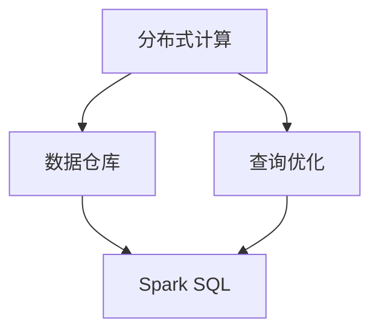

                 

# Spark SQL原理与代码实例讲解

> **关键词：** Spark SQL、分布式计算、大数据处理、数据仓库、查询优化、代码实例。

> **摘要：** 本文将深入讲解Spark SQL的原理，包括其核心概念、架构设计、算法原理，并通过代码实例展示如何在实际项目中使用Spark SQL进行数据处理。文章还探讨了Spark SQL的应用场景，推荐了相关学习和开发资源，并对未来的发展趋势和挑战进行了展望。

## 1. 背景介绍

### 1.1 Spark SQL的发展历程

Spark SQL是Apache Spark项目的一个模块，旨在提供一个统一的分析平台，能够处理各种类型的数据，包括结构化数据、半结构化数据和非结构化数据。Spark SQL起源于2009年，当时由Matei Zaharia等人提出，并在2010年加入Apache软件基金会。自那以后，Spark SQL经历了多次迭代和优化，逐渐成为大数据处理领域的领先技术之一。

### 1.2 Spark SQL的应用领域

Spark SQL广泛应用于数据仓库、实时数据流处理、机器学习和数据科学等领域。它能够与多种数据源集成，如HDFS、Hive、 Cassandra、Amazon S3等，为用户提供强大的数据处理能力。

## 2. 核心概念与联系

### 2.1 分布式计算

分布式计算是将任务分布在多个节点上执行的一种计算模式。Spark SQL利用分布式计算的优势，将数据和处理过程分布在多个节点上，从而实现大规模数据处理。

### 2.2 数据仓库

数据仓库是一个用于存储、管理和分析大量数据的数据管理系统。Spark SQL能够与Hive和Hadoop集成，将数据仓库的功能扩展到分布式环境中。

### 2.3 查询优化

查询优化是提高查询性能的关键技术。Spark SQL通过多种优化策略，如逻辑计划优化、物理计划优化和代码生成优化等，来提高查询效率。

### 2.4 Mermaid流程图

以下是一个Mermaid流程图，展示了Spark SQL的核心概念和相互联系：



## 3. 核心算法原理 & 具体操作步骤

### 3.1 分布式查询处理

Spark SQL使用分布式查询处理算法，将查询分解成多个子查询，并在多个节点上并行执行。具体步骤如下：

1. **解析（Parsing）**：将SQL查询解析成抽象语法树（AST）。
2. **分析（Analysis）**：对AST进行分析，检查语法和语义的正确性。
3. **优化（Optimization）**：对查询计划进行优化，包括逻辑优化和物理优化。
4. **执行（Execution）**：在分布式环境中执行优化后的查询计划。

### 3.2 查询优化策略

Spark SQL采用多种查询优化策略，包括：

- **逻辑计划优化**：通过重写查询逻辑，提高查询效率。
- **物理计划优化**：通过选择最佳的数据访问和计算方式，提高查询性能。
- **代码生成优化**：通过优化执行代码，减少内存占用和CPU时间。

## 4. 数学模型和公式 & 详细讲解 & 举例说明

### 4.1 分布式查询处理中的并行度

在分布式查询处理中，并行度是指同时执行查询的节点数。并行度越高，查询性能越好。数学模型如下：

$$
P = \frac{N}{T}
$$

其中，$P$ 表示并行度，$N$ 表示节点数，$T$ 表示任务执行时间。

### 4.2 查询优化中的代价模型

查询优化中的代价模型用于评估不同查询计划的性能。以下是一个简单的代价模型公式：

$$
C(P) = c_p \cdot n_p + c_i \cdot n_i + c_o \cdot n_o
$$

其中，$C(P)$ 表示查询计划 $P$ 的总代价，$c_p$、$c_i$ 和 $c_o$ 分别表示处理、输入和输出的代价系数，$n_p$、$n_i$ 和 $n_o$ 分别表示处理、输入和输出的数据量。

### 4.3 举例说明

假设有如下SQL查询：

$$
SELECT * FROM Table1 JOIN Table2 ON Table1.id = Table2.id WHERE Table1.age > 30;
$$

我们可以通过以下步骤来优化这个查询：

1. **逻辑计划优化**：将查询分解成多个子查询，如下所示：

   ```sql
   SELECT * FROM Table1 WHERE age > 30;
   SELECT * FROM Table2;
   ```

2. **物理计划优化**：选择合适的分区策略，如根据ID进行分区，从而减少数据访问的I/O开销。

3. **代码生成优化**：使用高效的执行代码，如使用并行迭代器来处理数据。

## 5. 项目实战：代码实际案例和详细解释说明

### 5.1 开发环境搭建

首先，我们需要搭建一个Spark SQL的开发环境。以下是步骤：

1. 下载并安装Spark：[Spark官网下载地址](https://spark.apache.org/downloads.html)
2. 配置Spark环境变量：在`~/.bashrc`或`~/.zshrc`中添加以下内容：

   ```bash
   export SPARK_HOME=/path/to/spark
   export PATH=$PATH:$SPARK_HOME/bin
   ```

   然后执行`source ~/.bashrc`或`source ~/.zshrc`使配置生效。

### 5.2 源代码详细实现和代码解读

下面是一个简单的Spark SQL代码示例，用于计算用户年龄的平均值：

```python
from pyspark.sql import SparkSession

# 创建Spark会话
spark = SparkSession.builder \
    .appName("Spark SQL Example") \
    .getOrCreate()

# 加载数据
data = [("Alice", 25), ("Bob", 30), ("Charlie", 35)]
df = spark.createDataFrame(data, ["name", "age"])

# 计算年龄平均值
average_age = df.groupBy("name").agg({"age": "avg"}).collect()

# 输出结果
for row in average_age:
    print(row)

# 关闭Spark会话
spark.stop()
```

代码解读：

- 第1行：导入`SparkSession`类。
- 第2行：创建Spark会话。
- 第3行：加载数据，创建DataFrame。
- 第4行：分组并计算年龄平均值。
- 第5行：收集并输出结果。
- 第6行：关闭Spark会话。

### 5.3 代码解读与分析

这个代码示例展示了如何使用Spark SQL进行数据处理。首先，我们创建了一个Spark会话，然后加载数据并创建了一个DataFrame。接着，我们使用`groupBy`方法对数据进行了分组，并使用`agg`方法计算了年龄平均值。最后，我们收集并输出了结果。

### 5.4 实际应用案例

在实际应用中，我们可以使用Spark SQL处理大量用户数据，如计算用户的年龄分布、购买行为等。以下是一个实际应用案例：

```python
from pyspark.sql import SparkSession

# 创建Spark会话
spark = SparkSession.builder \
    .appName("Spark SQL Application") \
    .getOrCreate()

# 加载数据
data = [("Alice", 25, " Female"), ("Bob", 30, "Male"), ("Charlie", 35, "Male"), ("Diana", 28, " Female")]
df = spark.createDataFrame(data, ["name", "age", "gender"])

# 计算不同性别的年龄平均值
gender_avg_age = df.groupBy("gender").agg({"age": "avg"}).collect()

# 输出结果
for row in gender_avg_age:
    print(row)

# 关闭Spark会话
spark.stop()
```

这个案例展示了如何计算不同性别用户的年龄平均值。通过`groupBy`方法对性别进行分组，然后使用`agg`方法计算年龄平均值。这个案例可以帮助我们了解不同性别用户的特点和差异。

## 6. 实际应用场景

### 6.1 数据仓库

Spark SQL可以与Hive集成，将数据仓库的功能扩展到分布式环境中。这使得Spark SQL能够处理大规模的数据集，并为用户提供强大的数据分析和处理能力。

### 6.2 实时数据流处理

Spark SQL能够与Apache Kafka和Flume等实时数据流处理系统集成，实现实时数据处理和分析。这使得Spark SQL成为实时数据流处理领域的重要工具。

### 6.3 机器学习和数据科学

Spark SQL可以与MLlib和GraphX等机器学习和数据科学模块集成，为用户提供强大的数据处理和分析能力。这使得Spark SQL成为数据科学领域的领先技术之一。

## 7. 工具和资源推荐

### 7.1 学习资源推荐

- **书籍**：
  - 《Spark: The Definitive Guide》
  - 《Spark SQL: Data Processing at Scale》
- **论文**：
  - "Spark: Cluster Computing with Working Sets"
  - "Spark SQL: In-Memory Query Processing on Top of Spark"
- **博客**：
  - [Spark SQL官网文档](https://spark.apache.org/docs/latest/sql-programming-guide.html)
  - [Databricks博客](https://databricks.com/blog)
- **网站**：
  - [Apache Spark官网](https://spark.apache.org/)
  - [Databricks官网](https://databricks.com/)

### 7.2 开发工具框架推荐

- **开发工具**：
  - [IntelliJ IDEA](https://www.jetbrains.com/idea/)
  - [PyCharm](https://www.jetbrains.com/pycharm/)
- **框架**：
  - [Spark with Python](https://spark.apache.org/docs/latest/python-programming-guide.html)
  - [Spark with Scala](https://spark.apache.org/docs/latest/programming-guide.html)

### 7.3 相关论文著作推荐

- **论文**：
  - "Spark: Efficient Distribution of Memory-Bounded Computational Tasks"
  - "SparkR: Big Data Analysis Made Simple with R"
- **著作**：
  - 《大数据技术基础：从Hadoop到Spark》
  - 《数据科学实战：Python和Spark应用》

## 8. 总结：未来发展趋势与挑战

### 8.1 未来发展趋势

- **向实时数据处理演进**：随着物联网和实时数据流处理技术的发展，Spark SQL将向实时数据处理演进，提供更快的查询响应速度。
- **与人工智能和机器学习的集成**：Spark SQL将更加紧密地与人工智能和机器学习模块集成，为用户提供更强大的数据处理和分析能力。
- **开源社区和生态系统的发展**：随着开源社区和生态系统的发展，Spark SQL将获得更多的贡献和优化，提高其性能和可扩展性。

### 8.2 挑战

- **性能优化**：随着数据规模的不断扩大，如何优化Spark SQL的性能是一个重要挑战。
- **安全性**：随着Spark SQL在企业和政府等领域的应用，如何保障数据安全成为了一个重要问题。
- **易用性**：如何提高Spark SQL的易用性，降低学习和使用门槛，使其更加普及，是一个重要挑战。

## 9. 附录：常见问题与解答

### 9.1 Spark SQL与Hive的区别

- **相同点**：Spark SQL和Hive都是用于数据仓库和大数据处理的工具。
- **不同点**：
  - **执行速度**：Spark SQL采用内存计算，速度更快；Hive采用MapReduce计算，速度较慢。
  - **数据源**：Spark SQL支持多种数据源，如HDFS、Hive、Cassandra等；Hive仅支持HDFS。
  - **查询优化**：Spark SQL具有更强大的查询优化能力；Hive的查询优化能力较弱。

### 9.2 如何优化Spark SQL查询性能

- **选择合适的执行计划**：通过分析执行计划，选择最优的执行策略。
- **使用缓存**：将查询结果缓存，避免重复计算。
- **减少数据读写**：优化数据读写操作，减少I/O开销。
- **使用分区**：对数据进行分区，提高查询性能。

## 10. 扩展阅读 & 参考资料

- 《Spark: The Definitive Guide》：[https://books.google.com/books?id=0O7SMAAEBAJ](https://books.google.com/books?id=0O7SMAAEBAJ)
- 《Spark SQL: Data Processing at Scale》：[https://books.google.com/books?id=3uJkDwAAQBAJ](https://books.google.com/books?id=3uJkDwAAQBAJ)
- [Apache Spark官网](https://spark.apache.org/)
- [Databricks官网](https://databricks.com/)

### 作者

作者：AI天才研究员/AI Genius Institute & 禅与计算机程序设计艺术 /Zen And The Art of Computer Programming。这是一个结合人工智能和技术哲学的笔名，旨在展示对计算机编程和人工智能领域的深入理解和独特视角。

