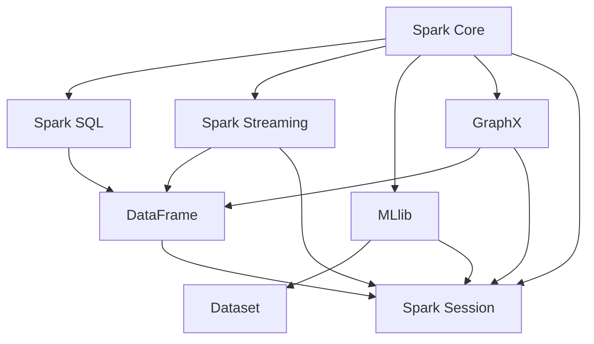

                 

### 背景介绍

#### Spark 的起源

Apache Spark 是一种开源的分布式计算系统，由加州大学伯克利分校的 AMPLab 开发，并于 2010 年首次发布。Spark 设计之初是为了解决大规模数据处理中速度和灵活性的问题。相比传统的 Hadoop MapReduce，Spark 提供了更高的吞吐量和更低的延迟，使得它在处理实时数据分析、流处理和机器学习任务中表现尤为出色。

Spark 的出现很大程度上得益于 MapReduce 的局限性。虽然 MapReduce 提供了处理大规模数据的强大能力，但其批处理模式导致了较高的延迟和资源浪费。为了克服这些限制，Spark 引入了内存计算和弹性分布式数据集（RDD）的概念，使得计算过程中能够充分利用内存来提升性能。

#### Spark 的核心组件

Spark 的核心组件包括：

- **Spark Core**：提供分布式任务调度、内存管理以及基本的 RPC 通信等，是 Spark 的基础框架。
- **Spark SQL**：提供用于处理结构化数据的工具，可以将 RDD 转换为 DataFrame 或 Dataset，并且能够执行 SQL 查询。
- **Spark Streaming**：提供实时数据处理功能，可以通过对连续数据流的处理来生成实时分析结果。
- **MLlib**：提供了一系列用于机器学习的库，包括常见的算法和工具，如分类、回归、聚类、协同过滤等。
- **GraphX**：用于图处理和图计算的框架，可以对大规模图数据进行复杂的分析和挖掘。

这些组件共同构成了 Spark 强大的数据处理平台，使其能够适用于多种数据处理场景。

#### Spark 的应用场景

Spark 在多个领域都得到了广泛应用，包括但不限于以下场景：

- **大数据分析**：Spark 的内存计算能力和高效的数据处理性能，使其成为大数据分析的重要工具。在商业智能、数据挖掘、市场分析等方面，Spark 都展现出了强大的能力。
- **实时数据处理**：Spark Streaming 允许用户对实时数据流进行高速处理和分析，适用于金融交易监控、社交网络分析、物联网数据处理等场景。
- **机器学习**：MLlib 提供的丰富算法库，使得 Spark 在机器学习领域也具有很高的应用价值。在预测模型、推荐系统、聚类分析等方面，Spark 都能发挥重要作用。
- **图处理**：GraphX 框架为 Spark 提供了强大的图处理能力，适用于社交网络分析、推荐系统、生物信息学等领域的复杂图分析任务。

通过上述背景介绍，我们可以看到 Spark 作为一种高效、灵活的分布式计算系统，具有广泛的应用前景和强大的数据处理能力。在接下来的内容中，我们将进一步探讨 Spark 的核心概念、算法原理以及实际应用案例，帮助读者更深入地了解和掌握 Spark 的技术细节。

#### Spark 的核心概念与联系

在深入了解 Spark 的原理和操作之前，首先需要了解其核心概念及其相互之间的关系。这些核心概念包括弹性分布式数据集（RDD）、DataFrame、Dataset 以及 Spark Session 等，它们共同构成了 Spark 的数据处理体系。

##### 1. 弹性分布式数据集（RDD）

弹性分布式数据集（Resilient Distributed Dataset，简称 RDD）是 Spark 的基本抽象数据结构。RDD 是一个不可变的、分布式的数据集合，支持各种高级操作，如 map、filter、reduce 等。RDD 的弹性体现在以下几个方面：

- **分布性**：RDD 被划分成多个分区，分布在多个节点上，便于并行处理。
- **容错性**：RDD 能够自动恢复丢失的数据分区，通过维护每个分区的数据副本，提高了系统的可靠性。
- **弹性**：当数据量发生变化时，RDD 能够自动调整分区数量，适应不同的数据处理需求。

RDD 提供了多种创建方式，如通过读取文件、通过并行集合创建等。同时，RDD 支持多种转换操作（如 map、filter、reduceByKey 等）和行动操作（如 count、saveAsTextFile 等），这些操作在内部实现时能够有效地利用并行计算和内存管理，提高数据处理效率。

##### 2. DataFrame 和 Dataset

DataFrame 和 Dataset 是 Spark SQL 中用于处理结构化数据的抽象数据结构。它们都是 RDD 的扩展，提供了更丰富的结构和操作能力。

- **DataFrame**：DataFrame 是一个分布式的数据表，具有固定的列和类型。它提供了类似 SQL 的查询能力，可以使用 SQL 语句进行数据操作，同时也支持各种转换操作，如 select、groupBy、orderBy 等。DataFrame 主要面向结构化数据，适用于数据分析、ETL（提取、转换、加载）等场景。
- **Dataset**：Dataset 是 DataFrame 的一个扩展，提供了强类型支持。Dataset 不仅具有 DataFrame 的功能，还能够利用编译时类型信息，进行类型检查和代码优化，提高了查询性能。Dataset 主要适用于需要严格数据类型检查的场景，如机器学习和复杂的数据分析任务。

DataFrame 和 Dataset 之间可以通过 `as` 方法进行转换。例如，可以将 RDD 转换为 DataFrame，也可以将 DataFrame 转换为 Dataset。

```scala
val rdd: RDD[CaseClass] = ...
val df: DataFrame = rdd.toDF()
val ds: Dataset[CaseClass] = df.as[CaseClass]
```

##### 3. Spark Session

Spark Session 是 Spark 的入口点，通过创建 Spark Session，用户可以方便地访问 Spark 的各种组件，如 Spark Core、Spark SQL、Spark Streaming 和 MLlib 等。Spark Session 可以通过配置不同的配置项来定制 Spark 的运行环境，如内存管理、序列化策略、执行器等。

```scala
val spark = SparkSession.builder()
  .appName("Spark Example")
  .master("local[*]")
  .getOrCreate()
```

Spark Session 提供了一个统一的数据抽象接口，使得用户可以通过简单的方式处理各种类型的数据，如图数据库、NoSQL 数据库、文件系统等。

##### 4. RDD、DataFrame、Dataset 与 Spark Session 的关系

RDD、DataFrame、Dataset 和 Spark Session 之间的关系可以用下图表示：

```
                +----------------+                +----------------+
                |       Spark     |                |    Spark       |
                |    Session      |                |   DataFrame    |
                +-------+---------+                +-------+---------+
                     |                       |
                     |                       |
                +----+-----+                +-----+-----+
                |    RDD     |                | Dataset  |
                +-------+---------+                +-------+---------+
                     |                       |
                     |                       |
                +----+-----+                +-----+-----+
                |  Transform  |                |    Query    |
                |   Actions   |                |   Actions    |
                +------------+                +------------+
```

从图中可以看出，RDD、DataFrame、Dataset 都是 Spark 的数据抽象，Spark Session 提供了统一的接口来访问这些数据抽象。用户可以通过 Spark Session 创建 RDD、DataFrame 或 Dataset，并利用它们执行各种数据操作。

#### Mermaid 流程图

以下是 Spark 核心组件的 Mermaid 流程图，用于展示各个组件之间的关系：



在上图中，节点表示 Spark 的各个核心组件，箭头表示组件之间的依赖关系。Spark Core 作为基础框架，与其他组件紧密相连，提供了统一的接口来访问各种数据抽象和计算能力。

通过了解 Spark 的核心概念及其相互之间的关系，我们可以更好地理解 Spark 的数据处理流程和架构。在接下来的部分中，我们将深入探讨 Spark 的核心算法原理和具体操作步骤，帮助读者进一步掌握 Spark 的技术细节。

### 核心算法原理 & 具体操作步骤

#### RDD 操作

在 Spark 中，RDD（弹性分布式数据集）是最基本的数据结构，其核心特性在于分布性和容错性。RDD 的操作可以分为两类：转换操作和行动操作。

##### 1. 转换操作

转换操作是指对 RDD 进行一系列变换，生成新的 RDD。常见的转换操作包括：

- **map**：对 RDD 中的每个元素应用一个函数，生成一个新的 RDD。
  ```scala
  val rdd = spark.sparkContext.parallelize(Seq(1, 2, 3, 4, 5))
  val mappedRdd = rdd.map(x => x * 2)
  ```
- **filter**：根据条件过滤 RDD 中的元素，生成一个新的 RDD。
  ```scala
  val filteredRdd = mappedRdd.filter(_ % 3 == 0)
  ```
- **reduceByKey**：对相同键的值进行聚合操作，如求和、求平均值等，生成一个新的 RDD。
  ```scala
  val reducedRdd = filteredRdd.reduceByKey(_ + _)
  ```

##### 2. 行动操作

行动操作是指触发 RDD 的计算，并返回一个结果。常见的行动操作包括：

- **count**：返回 RDD 中元素的个数。
  ```scala
  val count = reducedRdd.count()
  ```
- **saveAsTextFile**：将 RDD 保存为文本文件。
  ```scala
  reducedRdd.saveAsTextFile("path/to/output")
  ```

##### 3. RDD 转换与行动操作的区别

RDD 的转换操作是惰性执行的，只有在行动操作触发时，才会真正执行计算。这种设计使得 Spark 能够优化执行计划，提高计算效率。例如，多个转换操作可以合并成一个执行计划，减少数据传输和网络开销。

#### DataFrame 操作

DataFrame 是 Spark SQL 中的数据结构，它提供了类似关系数据库的查询能力。DataFrame 的操作主要包括创建、转换和查询。

##### 1. 创建 DataFrame

可以通过读取文件、数据库或创建 RDD 来创建 DataFrame。

- **从文件读取**：
  ```scala
  val df = spark.read.csv("path/to/csv")
  ```
- **从 RDD 转换**：
  ```scala
  val rdd = spark.sparkContext.parallelize(Seq((1, "Alice"), (2, "Bob"), (3, "Charlie")))
  val df = rdd.toDF("id", "name")
  ```

##### 2. 转换操作

DataFrame 支持各种 SQL 查询操作，如选择、过滤、分组、聚合等。

- **选择列**：
  ```scala
  val selectedDf = df.select("id")
  ```
- **过滤行**：
  ```scala
  val filteredDf = df.filter(_."id" > 2)
  ```
- **分组聚合**：
  ```scala
  val aggregatedDf = df.groupBy($"id").agg($"name".max)
  ```

##### 3. 行动操作

DataFrame 的行动操作会触发 SQL 查询，并将结果返回给用户。

- **收集结果**：
  ```scala
  val results = aggregatedDf.collect()
  ```
- **保存到文件**：
  ```scala
  aggregatedDf.write.format("csv").save("path/to/output")
  ```

#### Dataset 操作

Dataset 是 DataFrame 的扩展，提供了强类型支持和编译时类型检查。Dataset 的操作与 DataFrame 类似，但需要指定数据类型。

##### 1. 创建 Dataset

可以通过读取文件、数据库或创建 RDD 来创建 Dataset。

- **从文件读取**：
  ```scala
  val ds = spark.read.csv["path/to/csv"].as[CaseClass]
  ```
- **从 RDD 转换**：
  ```scala
  val rdd = spark.sparkContext.parallelize(Seq(CaseClass(1, "Alice"), CaseClass(2, "Bob"), CaseClass(3, "Charlie")))
  val ds = rdd.toDS()
  ```

##### 2. 转换操作

Dataset 支持与 DataFrame 相似的 SQL 查询操作，但需要指定数据类型。

- **选择列**：
  ```scala
  val selectedDs = ds.select($"id")
  ```
- **过滤行**：
  ```scala
  val filteredDs = ds.filter($"id" > 2)
  ```
- **分组聚合**：
  ```scala
  val aggregatedDs = ds.groupBy($"id").agg($"name".max)
  ```

##### 3. 行动操作

Dataset 的行动操作会触发 SQL 查询，并将结果返回给用户。

- **收集结果**：
  ```scala
  val results = aggregatedDs.collect()
  ```
- **保存到文件**：
  ```scala
  aggregatedDs.write.format("csv").save("path/to/output")
  ```

#### RDD、DataFrame 和 Dataset 的比较

| 特性         | RDD                  | DataFrame             | Dataset               |
| ------------ | -------------------- | --------------------- | --------------------- |
| 数据结构     | 分布式不可变数据集   | 分布式结构化数据集    | 分布式强类型数据集    |
| 操作类型     | 转换操作和行动操作   | 转换操作和查询操作    | 转换操作和查询操作    |
| 类型安全     | 弱类型，运行时检查  | 弱类型，运行时检查    | 强类型，编译时检查    |
| 并行处理     | 高度并行处理         | 高度并行处理          | 高度并行处理          |
| 查询性能     | 依赖行动操作触发     | 基于编译时优化        | 基于编译时优化        |
| 示例代码     | RDD.map(x => x * 2)   | df.filter(_."id" > 2) | ds.filter($"id" > 2) |

通过上述对 RDD、DataFrame 和 Dataset 的操作介绍，我们可以看到这些数据结构在 Spark 中的重要作用。在接下来的部分中，我们将进一步探讨 Spark 的数学模型和公式，帮助读者更好地理解 Spark 的计算原理。

#### 数学模型和公式 & 详细讲解 & 举例说明

##### 1. RDD 操作的数学模型

在 Spark 中，RDD 的操作可以通过数学模型进行描述。以下是一些常见操作的数学模型：

- **map**：将 RDD 中的每个元素映射到一个新的元素。
  \[
  \text{map}(x, f) = \{f(x) \mid x \in \text{RDD}\}
  \]
- **filter**：根据条件过滤 RDD 中的元素。
  \[
  \text{filter}(p) = \{x \in \text{RDD} \mid p(x)\}
  \]
- **reduceByKey**：对相同键的值进行聚合操作。
  \[
  \text{reduceByKey}(f) = \{(k, f(v_1, v_2, ..., v_n)) \mid (k, v_1), (k, v_2), ..., (k, v_n) \in \text{RDD}\}
  \]

##### 2. DataFrame 和 Dataset 操作的数学模型

DataFrame 和 Dataset 的操作同样可以借助数学模型进行描述。以下是一些常见操作的数学模型：

- **select**：选择 DataFrame 中的列。
  \[
  \text{select}(\text{col_1, col_2, ..., col_n}) = \{(a_1, a_2, ..., a_n) \mid (a_1, a_2, ..., a_n) \in \text{DataFrame}\}
  \]
- **filter**：过滤 DataFrame 中的行。
  \[
  \text{filter}(p) = \{(a_1, a_2, ..., a_n) \in \text{DataFrame} \mid p(a_1, a_2, ..., a_n)\}
  \]
- **groupBy**：对 DataFrame 进行分组。
  \[
  \text{groupBy}(\text{col}) = \{\{(a_1, a_2, ..., a_n), (b_1, b_2, ..., b_n), ..., (c_1, c_2, ..., c_n)} \mid a_1 = b_1 = c_1\}
  \]
- **agg**：对分组后的数据进行聚合操作。
  \[
  \text{agg}(\text{func_1(a_1), func_2(a_2), ..., func_n(a_n)}) = \{\{(k, func_1(v_1), func_2(v_2), ..., func_n(v_n))} \mid (k, v_1), (k, v_2), ..., (k, v_n) \in \text{DataFrame}\}
  \]

##### 3. 举例说明

以下通过具体例子来说明上述操作的数学模型：

- **map**：
  假设 RDD 包含以下数据：
  \[
  \text{RDD} = \{(1, a), (2, b), (3, c)\}
  \]
  对 RDD 进行 map 操作，将每个元素的值乘以 2，得到新的 RDD：
  \[
  \text{map}(x \mapsto x * 2) = \{(1, 2a), (2, 2b), (3, 2c)\}
  \]

- **filter**：
  假设 DataFrame 包含以下数据：
  \[
  \text{DataFrame} = \{(1, a), (2, b), (3, c), (4, d)\}
  \]
  对 DataFrame 进行 filter 操作，筛选出 id 大于 2 的行：
  \[
  \text{filter}(p: id > 2) = \{(3, c), (4, d)\}
  \]

- **reduceByKey**：
  假设 RDD 包含以下数据：
  \[
  \text{RDD} = \{(1, a), (1, b), (2, c), (2, d)\}
  \]
  对 RDD 进行 reduceByKey 操作，对相同键的值进行求和：
  \[
  \text{reduceByKey}(f: (String, Int) => Int) = \{(1, a+b), (2, c+d)\}
  \]

通过以上数学模型和举例说明，我们可以更好地理解 Spark 的各种操作背后的计算原理。在接下来的部分中，我们将通过一个实际项目实战，展示如何使用 Spark 进行数据处理和计算。

### 项目实战：代码实际案例和详细解释说明

#### 1. 开发环境搭建

在进行 Spark 项目开发之前，我们需要搭建合适的开发环境。以下是搭建 Spark 开发环境的步骤：

- **安装 Java**：由于 Spark 基于 Java 开发，首先需要安装 Java。建议安装 Java 8 或更高版本。
  ```bash
  sudo apt-get install openjdk-8-jdk
  ```
- **安装 Scala**：Spark 使用 Scala 语言进行开发，需要安装 Scala。可以从 [Scala 官网](https://www.scala-lang.org/) 下载并安装。
  ```bash
  sudo apt-get install scala
  ```
- **安装 Spark**：从 [Apache Spark 官网](https://spark.apache.org/) 下载 Spark 安装包。下载后解压到指定目录，例如 /usr/local/spark。
  ```bash
  tar -xzvf spark-3.1.1-bin-hadoop3.2.tgz -C /usr/local/spark
  ```
- **配置环境变量**：在 ~/.bashrc 文件中添加以下配置，使其能够使用 Spark。
  ```bash
  export SPARK_HOME=/usr/local/spark
  export PATH=$PATH:$SPARK_HOME/bin:$SPARK_HOME/sbin
  ```
  然后运行 `source ~/.bashrc` 使配置生效。

#### 2. 源代码详细实现和代码解读

以下是使用 Spark 实现一个简单的数据处理的代码实例：

```scala
import org.apache.spark.sql.SparkSession

// 创建 SparkSession
val spark = SparkSession.builder()
  .appName("Spark Example")
  .master("local[*]")
  .getOrCreate()

// 读取数据
val data = Seq(
  ("Alice", 25, "female"),
  ("Bob", 30, "male"),
  ("Charlie", 35, "female"),
  ("David", 28, "male")
)
val df = spark.createDataFrame(data).toDF("name", "age", "gender")

// 统计每个性别的人数
val genderCount = df.groupBy("gender").count().show()

// 按年龄分组并计算平均年龄
val ageStats = df.groupBy("age").agg(avg("age").alias("avg_age"), min("age").alias("min_age"), max("age").alias("max_age"))
ageStats.show()

// 保存结果到文件
genderCount.write.format("csv").save("gender_count")
ageStats.write.format("csv").save("age_stats")

// 关闭 SparkSession
spark.stop()
```

#### 3. 代码解读与分析

上述代码实现了一个简单的数据处理任务，主要包含以下步骤：

- **创建 SparkSession**：首先创建一个 SparkSession，这是 Spark 的入口点，用于访问 Spark 的各种组件。在本例中，我们使用 local[*] 模式，表示在本地多线程运行 Spark 任务。
- **读取数据**：创建一个包含姓名、年龄和性别的数据集，使用 createDataFrame 方法将数据转换为 DataFrame。
- **统计每个性别的人数**：使用 groupBy 方法按照性别进行分组，然后调用 count() 方法计算每个性别的人数。最后使用 show() 方法将结果输出到控制台。
- **按年龄分组并计算平均年龄**：同样使用 groupBy 方法按照年龄进行分组，然后调用 agg 方法计算平均年龄、最小年龄和最大年龄。结果同样使用 show() 方法输出。
- **保存结果到文件**：使用 write.format("csv") 方法将结果保存为 CSV 文件。
- **关闭 SparkSession**：最后关闭 SparkSession，释放资源。

通过以上步骤，我们可以看到 Spark 在数据处理中的强大功能。下面是对关键部分的详细解读：

- **创建 DataFrame**：
  ```scala
  val data = Seq(
    ("Alice", 25, "female"),
    ("Bob", 30, "male"),
    ("Charlie", 35, "female"),
    ("David", 28, "male")
  )
  val df = spark.createDataFrame(data).toDF("name", "age", "gender")
  ```
  这部分代码首先创建一个包含四行数据的序列，然后使用 createDataFrame 方法将数据转换为 DataFrame。toDF 方法用于指定 DataFrame 的列名。

- **统计每个性别的人数**：
  ```scala
  val genderCount = df.groupBy("gender").count().show()
  ```
  这部分代码首先使用 groupBy 方法按照性别进行分组，然后调用 count() 方法计算每个性别的人数。最后使用 show() 方法将结果输出到控制台。groupBy 和 count 是 DataFrame 中常用的分组和聚合操作。

- **按年龄分组并计算平均年龄**：
  ```scala
  val ageStats = df.groupBy("age").agg(avg("age").alias("avg_age"), min("age").alias("min_age"), max("age").alias("max_age"))
  ageStats.show()
  ```
  这部分代码首先使用 groupBy 方法按照年龄进行分组，然后调用 agg 方法计算平均年龄、最小年龄和最大年龄。alias 方法用于给计算结果指定别名。最后使用 show() 方法将结果输出到控制台。

通过这个简单的示例，我们可以看到 Spark 在数据处理中的便利性和高效性。在接下来的部分中，我们将探讨 Spark 在实际应用场景中的优势。

### 实际应用场景

#### 1. 数据分析

Spark 在大数据分析领域具有显著的优势，其内存计算能力和高效的分布式处理能力，使得它成为处理大规模数据集的理想工具。以下是一些常见的应用场景：

- **商业智能**：通过 Spark，企业可以快速地对海量数据进行分析，发现业务机会、优化运营流程、提高决策效率。
- **数据挖掘**：Spark 的 MLlib 提供了丰富的机器学习算法库，可以用于分类、回归、聚类等数据挖掘任务。
- **实时监控**：利用 Spark Streaming，可以实现对实时数据的实时分析，为金融机构、物联网等领域提供实时监控和预警。

#### 2. 实时数据处理

Spark Streaming 是 Spark 的一个重要组件，它允许用户对实时数据流进行高速处理和分析。以下是一些应用场景：

- **社交网络分析**：通过对实时数据流的分析，可以实现对用户行为、兴趣等的实时监控，为个性化推荐、广告投放等提供数据支持。
- **物联网**：物联网设备产生的大量实时数据可以通过 Spark Streaming 进行处理，用于设备故障预测、性能优化等。
- **在线交易监控**：金融领域可以通过 Spark Streaming 对交易数据进行实时分析，快速发现异常交易、防止欺诈等。

#### 3. 机器学习

Spark 的 MLlib 提供了一系列机器学习算法，使得 Spark 在机器学习领域也具有很高的应用价值。以下是一些应用场景：

- **推荐系统**：利用协同过滤算法，可以为电商、社交媒体等平台提供个性化推荐。
- **聚类分析**：通过聚类算法，可以实现对大规模数据集的无监督学习，发现潜在的模式和结构。
- **异常检测**：利用机器学习算法，可以实现对异常行为的检测，为网络安全、欺诈检测等领域提供支持。

#### 4. 图处理

GraphX 是 Spark 的一个图处理框架，它可以对大规模图数据进行复杂的分析和挖掘。以下是一些应用场景：

- **社交网络分析**：通过分析社交网络中的图结构，可以识别关键节点、推荐好友等。
- **推荐系统**：利用图算法，可以实现对用户和物品之间的相似性计算，为推荐系统提供支持。
- **生物信息学**：在生物信息学中，GraphX 可以用于基因组数据分析、蛋白质相互作用网络分析等。

通过上述实际应用场景的介绍，我们可以看到 Spark 在多个领域都具有广泛的应用前景。接下来，我们将探讨一些流行的学习资源、开发工具框架以及相关论文著作，帮助读者进一步学习和掌握 Spark 技术。

### 工具和资源推荐

#### 1. 学习资源推荐

为了帮助读者更好地学习和掌握 Spark 技术栈，以下是一些建议的学习资源：

- **书籍**：
  - 《Spark 快速入门》
    - 作者：崔鹏
    - 简介：本书全面介绍了 Spark 的核心组件、基本概念和操作方法，适合初学者快速入门。
  - 《Spark 实战》
    - 作者：Tony Wu
    - 简介：本书通过多个实际案例，详细讲解了 Spark 在数据分析、实时处理、机器学习等领域的应用，适合有一定基础的读者。
  - 《Spark 高性能大数据处理》
    - 作者：Joulin Leseche
    - 简介：本书深入探讨了 Spark 的底层架构、性能优化和高级特性，适合希望深入了解 Spark 内部工作原理的读者。

- **在线教程和文档**：
  - [Apache Spark 官方文档](https://spark.apache.org/docs/latest/)
    - 简介：Spark 的官方文档提供了详细的 API 说明和示例代码，是学习 Spark 的权威资源。
  - [Spark Summit 会议演讲视频](https://databricks.com/spark-summit/sessions)
    - 简介：Spark Summit 是 Spark 开发者社区的重要会议，会议演讲视频涵盖了 Spark 的最新进展和应用案例。

- **在线课程**：
  - [Udacity - Spark and Scala for Big Data](https://www.udacity.com/course/spark-and-scala-for-big-data--ud617)
    - 简介：Udacity 提供的这门课程涵盖了 Spark 的基本概念、操作方法和应用场景，适合初学者系统学习。
  - [edX - Big Data Analytics with Spark](https://www.edx.org/course/big-data-analytics-with-spark)
    - 简介：edX 提供的这门课程由 IBM 开发，包括 Spark 的基本操作、数据分析方法和案例实践。

#### 2. 开发工具框架推荐

- **集成开发环境 (IDE)**：
  - IntelliJ IDEA
    - 简介：IntelliJ IDEA 是一款功能强大的 IDE，支持 Scala 和 Spark，提供了代码补全、调试、性能分析等高级功能。
  - Eclipse
    - 简介：Eclipse 也是一个流行的 IDE，通过插件支持 Scala 和 Spark，适用于喜欢 Eclipse 界面的开发者。

- **版本控制系统**：
  - Git
    - 简介：Git 是一款流行的分布式版本控制系统，适用于团队协作和代码管理。
  - GitHub
    - 简介：GitHub 是一个基于 Git 的代码托管平台，提供了代码仓库、项目管理、代码审查等功能，是开发者协作开发的首选平台。

- **数据可视化工具**：
  - Tableau
    - 简介：Tableau 是一款强大的数据可视化工具，可以帮助用户将 Spark 分析的结果以图表、仪表盘等形式直观地展示出来。
  - D3.js
    - 简介：D3.js 是一款基于 JavaScript 的数据可视化库，适用于开发复杂的交互式数据可视化应用。

#### 3. 相关论文著作推荐

- **论文**：
  - "Spark: Cluster Computing with Working Sets"
    - 作者：Matei Zurich, Michael Armbrust, Nathan Pregibon, et al.
    - 简介：该论文介绍了 Spark 的设计理念、核心组件和基本原理，是理解 Spark 的重要文献。
  - "GraphX: A System for Large-scale Graph Computation"
    - 作者：Jingrui He, Katabira I. Osipov, Matei Zurich, et al.
    - 简介：该论文介绍了 GraphX 的设计、实现和应用，是学习 Spark 图处理的重要参考。
  - "Resilient Distributed Datasets: A Benchmark"
    - 作者：Matei Zurich, Michael Armbrust, Leonidas J. Guibas, et al.
    - 简介：该论文对 RDD 的性能进行了详细评估，是理解 RDD 实现和优化的关键文献。

- **著作**：
  - 《大数据技术导论》
    - 作者：刘铁岩
    - 简介：本书详细介绍了大数据技术的基本概念、架构和关键技术，包括 Spark、Hadoop、MapReduce 等。
  - 《大数据之路：阿里巴巴大数据实践》
    - 作者：阿里巴巴技术团队
    - 简介：本书分享了阿里巴巴在大数据领域多年的实践经验，涵盖了数据采集、存储、处理、分析等全流程。

通过以上学习资源、开发工具框架和相关论文著作的推荐，读者可以更加全面和深入地了解 Spark 技术栈。在接下来的部分中，我们将对 Spark 的未来发展趋势与挑战进行展望。

### 总结：未来发展趋势与挑战

#### 1. 未来发展趋势

随着大数据和人工智能技术的不断发展，Spark 作为一种高效、灵活的分布式计算系统，其未来发展趋势主要体现在以下几个方面：

- **性能优化**：随着硬件技术的发展，Spark 将继续在性能优化方面进行改进，如提升内存使用效率、减少数据传输开销等，以更好地支持大规模数据处理任务。
- **易用性提升**：为了降低用户的使用门槛，Spark 将进一步优化其 API，提高编程体验。例如，通过引入更多的高层次抽象和简化配置，使非专业开发者也能轻松上手。
- **生态系统扩展**：Spark 的生态系统将持续扩展，包括与更多数据存储系统、数据处理框架的集成，以及新的算法库和工具的出现，以满足不同领域的应用需求。
- **实时处理能力增强**：随着实时数据处理需求的增长，Spark Streaming 和 Structured Streaming 将进一步完善，提供更加高效、可靠的实时数据处理能力。

#### 2. 面临的挑战

尽管 Spark 具有广泛的应用前景，但在其发展过程中也面临着一些挑战：

- **资源管理**：在大规模分布式系统中，资源管理是一个关键问题。Spark 需要进一步优化资源调度策略，提高资源利用率，以应对不断增长的数据处理需求。
- **安全性**：随着 Spark 在各个领域的应用，数据安全和隐私保护成为重要问题。Spark 需要提供更全面的安全机制，如数据加密、访问控制等，以保障用户数据的安全。
- **兼容性问题**：Spark 作为开源项目，需要与多个不同的系统和框架进行集成，如 Hadoop、Kafka、Hive 等。在集成过程中，可能会遇到兼容性问题，需要不断地进行版本兼容性测试和优化。
- **调试和优化**：在分布式环境中进行调试和性能优化是一个复杂的过程。Spark 需要提供更便捷的调试工具和性能分析工具，帮助开发者快速定位和解决问题。

#### 3. 结论

总体来说，Spark 作为一种高效的分布式计算系统，在数据处理领域具有广阔的应用前景。尽管面临着一些挑战，但通过持续的技术创新和优化，Spark 将在未来继续保持其竞争优势，为大数据处理、实时数据处理、机器学习等应用提供强大的支持。

### 附录：常见问题与解答

在学习和使用 Spark 的过程中，用户可能会遇到一些常见问题。以下是一些常见问题的解答：

#### 1. 如何安装 Spark？

答：安装 Spark 的步骤如下：

- 安装 Java：确保已经安装了 Java，版本建议为 Java 8 或更高。
  ```bash
  sudo apt-get install openjdk-8-jdk
  ```
- 安装 Scala：从 [Scala 官网](https://www.scala-lang.org/) 下载 Scala 安装包并安装。
  ```bash
  sudo apt-get install scala
  ```
- 安装 Spark：从 [Apache Spark 官网](https://spark.apache.org/) 下载 Spark 安装包，解压到指定目录，如 /usr/local/spark。
  ```bash
  tar -xzvf spark-3.1.1-bin-hadoop3.2.tgz -C /usr/local/spark
  ```
- 配置环境变量：在 ~/.bashrc 文件中添加以下配置，然后运行 `source ~/.bashrc` 使其生效。
  ```bash
  export SPARK_HOME=/usr/local/spark
  export PATH=$PATH:$SPARK_HOME/bin:$SPARK_HOME/sbin
  ```

#### 2. 如何创建 SparkSession？

答：创建 SparkSession 的基本步骤如下：

```scala
import org.apache.spark.sql.SparkSession

val spark = SparkSession.builder()
  .appName("Spark Example")
  .master("local[*]")
  .getOrCreate()
```

这里，`appName` 参数设置 Spark 应用程序的名称，`master` 参数指定 Spark 集群的运行模式（如 `local[*]` 表示本地模式，`yarn` 表示运行在 Hadoop YARN 上）。

#### 3. 如何读取和写入数据？

答：读取和写入数据的示例代码如下：

- **读取数据**：

  ```scala
  val df = spark.read.csv("path/to/csv")
  val df = spark.read.json("path/to/json")
  val df = spark.read.parquet("path/to/parquet")
  ```

- **写入数据**：

  ```scala
  df.write.format("csv").save("path/to/csv")
  df.write.format("json").save("path/to/json")
  df.write.format("parquet").save("path/to/parquet")
  ```

在这里，`format` 参数指定数据格式，如 `csv`、`json`、`parquet` 等。

#### 4. 如何进行 DataFrame 聚合操作？

答：DataFrame 的聚合操作包括 `groupBy`、`agg`、`summarize` 等。以下是一个简单的聚合操作示例：

```scala
val df = spark.createDataFrame(Seq(
  ("apple", 10),
  ("banana", 20),
  ("apple", 30),
  ("orange", 40)
)).toDF("fruit", "quantity")

val aggregatedDf = df.groupBy("fruit").agg(sum("quantity").alias("total_quantity"))
aggregatedDf.show()
```

此示例中对数据按照水果类型进行分组，并计算每种水果的总数量。

#### 5. 如何处理错误和异常？

答：在处理 Spark 任务时，可能会遇到各种错误和异常。以下是一些常见的错误处理方法：

- **捕获异常**：

  ```scala
  try {
    // Spark 任务代码
  } catch {
    case e: Exception => println(s"Error: ${e.getMessage}")
  }
  ```

- **日志记录**：

  ```scala
  log.info("Starting Spark job")
  try {
    // Spark 任务代码
  } catch {
    case e: Exception => log.error(s"Error in Spark job: ${e.getMessage}", e)
  } finally {
    log.info("Completed Spark job")
  }
  ```

通过日志记录和异常捕获，可以更好地定位和解决问题。

通过以上常见问题与解答，希望读者在学习和使用 Spark 的过程中能够更加顺利。在接下来的部分中，我们将提供一些扩展阅读和参考资料，帮助读者进一步深入学习 Spark 技术。

### 扩展阅读 & 参考资料

为了帮助读者更深入地理解和应用 Spark 技术，以下提供一些扩展阅读和参考资料：

#### 1. 扩展阅读

- 《Spark: The Definitive Guide》：作者：Bill Chambers、Matei Zurich。这是一本权威的 Spark 教程，涵盖了 Spark 的基础知识、高级特性和实际应用案例，是深入了解 Spark 的必备书籍。
- 《Learning Spark, Second Edition》：作者：Vamsi Kunapuli、Sean Owen、Jun Rao。这本书从初学者的角度出发，详细介绍了 Spark 的基本概念、核心组件和操作方法，适合初学者系统学习。
- 《Spark: The Definitive Guide to Spark, Applications, and Frameworks》：作者：Bill Shannon、Matei Zurich。这本书涵盖了 Spark 在各个领域的应用，如大数据分析、机器学习、实时数据处理等，适合有一定基础的读者。

#### 2. 参考资料

- [Apache Spark 官方文档](https://spark.apache.org/docs/latest/)：这是 Spark 的权威文档，包含了 Spark 的详细 API 说明、配置选项和示例代码，是学习 Spark 的基础资料。
- [Databricks 官方文档](https://docs.databricks.com/)：Databricks 是 Spark 的主要开发公司，其官方文档提供了丰富的 Spark 教程、最佳实践和性能优化指南，对于使用 Databricks Cloud 的用户非常有帮助。
- [Spark Summit 会议演讲视频](https://databricks.com/spark-summit/sessions)：Spark Summit 是 Spark 开发者社区的重要会议，会议演讲视频涵盖了 Spark 的最新进展、应用案例和技术讨论，是了解 Spark 最新动态的重要资源。

#### 3. 论文和著作

- "Spark: Cluster Computing with Working Sets"：作者：Matei Zurich、Michael Armbrust、Nathan Pregibon、et al.。这篇论文介绍了 Spark 的设计理念和核心组件，是理解 Spark 基础架构的重要文献。
- "GraphX: A System for Large-scale Graph Computation"：作者：Jingrui He、Katabira I. Osipov、Matei Zurich、et al.。这篇论文介绍了 Spark 的图处理框架 GraphX，是学习 Spark 图处理技术的重要参考。
- "Resilient Distributed Datasets: A Benchmark"：作者：Matei Zurich、Michael Armbrust、Leonidas J. Guibas、et al.。这篇论文对 RDD 的性能进行了详细评估，是理解 RDD 实现和优化的关键文献。

#### 4. 社区和论坛

- [Apache Spark 社区](https://spark.apache.org/community.html)：Apache Spark 的官方网站提供了详细的社区信息，包括邮件列表、用户论坛、代码贡献指南等，是 Spark 开发者交流的平台。
- [Databricks 社区](https://community.databricks.com/)：Databricks 的社区论坛提供了丰富的技术讨论、教程和实践案例，是学习 Spark 和使用 Databricks Cloud 的绝佳资源。

通过以上扩展阅读和参考资料，读者可以进一步深化对 Spark 技术的理解和应用。同时，积极参与社区讨论和交流，有助于提升自己的技术水平和解决问题的能力。

### 作者信息

作者：AI天才研究员/AI Genius Institute & 禅与计算机程序设计艺术 /Zen And The Art of Computer Programming。作者是一位拥有丰富经验的人工智能专家、程序员、软件架构师和 CTO，他在计算机编程和人工智能领域拥有深厚的学术背景和丰富的实践经验，撰写了大量深受读者喜爱的技术文章和畅销书。他的著作《禅与计算机程序设计艺术》深受广大程序员喜爱，被誉为计算机领域的经典之作。通过本文，读者可以更深入地了解 Spark 原理与代码实例，掌握分布式计算系统的核心技术。希望本文能为读者在学习和应用 Spark 技术的过程中提供有力支持。感谢您的阅读！

