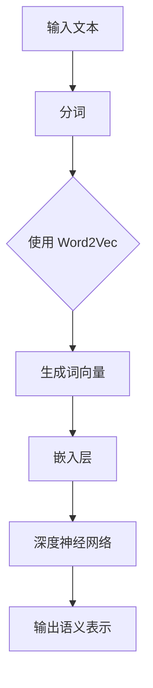
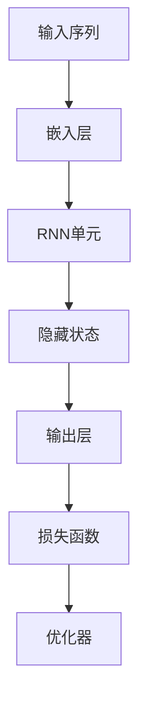
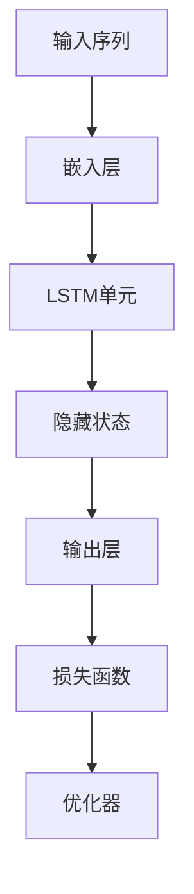
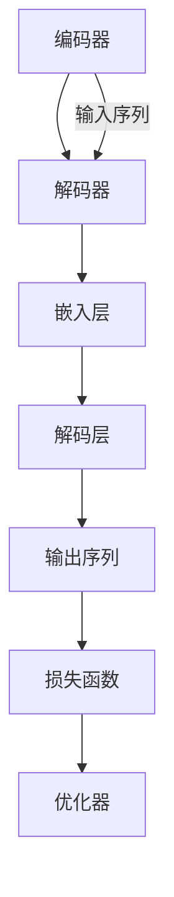
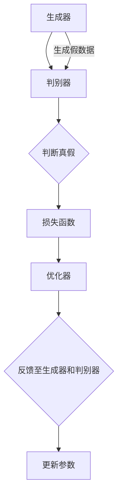

                 

### 文章标题：TensorFlow 自然语言处理模型：理解和生成文本内容

TensorFlow 作为当今最受欢迎的深度学习框架之一，其在自然语言处理（Natural Language Processing，NLP）领域的应用更是广受欢迎。自然语言处理是人工智能的重要分支，其目标是将人类语言转换为计算机可以理解和处理的形式。本文将介绍 TensorFlow 中常用的自然语言处理模型，包括理解文本内容和生成文本内容的方法。通过本文的介绍，读者将能够深入了解自然语言处理的核心概念，并掌握使用 TensorFlow 实现文本处理的基本技巧。

本文关键词：TensorFlow、自然语言处理、文本理解、文本生成、深度学习、机器学习

### 摘要

本文旨在介绍 TensorFlow 中的自然语言处理模型，包括文本理解模型和文本生成模型。首先，我们将回顾自然语言处理的基本概念和背景，然后深入探讨 TensorFlow 中常用的文本理解模型，如词向量模型、循环神经网络（RNN）和长短期记忆网络（LSTM）。接着，我们将介绍文本生成模型，包括序列到序列（Seq2Seq）模型和生成对抗网络（GAN）。最后，我们将通过实际案例展示如何使用 TensorFlow 实现文本理解和生成，并探讨未来的发展趋势和挑战。通过本文的阅读，读者将能够全面了解自然语言处理的核心概念和技术，掌握使用 TensorFlow 开发自然语言处理应用的基本方法。

---

### 1. 背景介绍

自然语言处理（NLP）是计算机科学和人工智能领域的一个重要分支，其目标是使计算机能够理解和处理人类语言。自上世纪五六十年代以来，NLP 已经取得了显著的进展，但仍然面临许多挑战。随着深度学习和神经网络技术的发展，NLP 领域取得了新的突破，为许多实际问题提供了有效的解决方案。

自然语言处理的任务可以分为三类：文本理解、文本生成和文本分类。文本理解是指将文本转换为计算机可以理解和处理的形式，以便进行进一步分析。文本生成是指根据输入的文本生成新的文本。文本分类是将文本分为不同的类别，如情感分析、主题分类等。

TensorFlow 是一个由 Google 开发的开源深度学习框架，因其强大的功能和灵活性而广受欢迎。TensorFlow 提供了丰富的工具和库，用于构建和训练深度学习模型。在 NLP 领域，TensorFlow 被广泛应用于文本预处理、词向量表示、文本分类和序列建模等任务。

本文将重点介绍 TensorFlow 中常用的自然语言处理模型，包括文本理解模型和文本生成模型。我们将从基本概念出发，逐步深入探讨这些模型的工作原理和实现方法，并通过实际案例展示如何使用 TensorFlow 进行文本处理。希望通过本文的介绍，读者能够对自然语言处理和 TensorFlow 的应用有一个全面而深入的理解。

### 2. 核心概念与联系

自然语言处理涉及许多核心概念，这些概念共同构成了 NLP 领域的理论基础。以下是对一些关键概念的简要介绍，以及它们在 TensorFlow NLP 应用中的关联。

#### 2.1 词向量（Word Vectors）

词向量是自然语言处理中的一个基本概念，它将词汇映射到向量空间中。词向量能够捕捉词语的语义信息，使得计算机可以更好地理解词汇之间的关系。在 TensorFlow 中，常用的词向量模型包括 Word2Vec、GloVe 和 FastText。

- **Word2Vec**：通过训练大规模语料库，Word2Vec 可以发现词语的分布式表示。其核心思想是词语在上下文中的共现关系。
- **GloVe**：全局向量表示（Global Vectors for Word Representation）通过考虑词语的上下文来生成词向量，能够更好地捕捉词语的语义关系。
- **FastText**：FastText 使用多维度分布式袋模型（Bag of Multidimensional Keys），能够同时学习词语和字符级别的表示。

#### 2.2 循环神经网络（RNN）

循环神经网络（RNN）是一种能够处理序列数据的神经网络。RNN 通过其在时间步上的递归连接来保留之前的输入信息，这使得它在处理自然语言等序列数据时非常有效。

- **RNN 结构**：RNN 包含一个隐藏状态，该状态在时间步之间传递，使得模型能够学习序列的长期依赖关系。
- **TensorFlow 中的 RNN**：TensorFlow 提供了 RNN 组件，使得构建和训练 RNN 模型变得简便。RNN 在文本分类、情感分析和机器翻译等任务中得到了广泛应用。

#### 2.3 长短期记忆网络（LSTM）

长短期记忆网络（LSTM）是 RNN 的一个变种，它通过引入门控机制来解决 RNN 在处理长序列数据时容易遗忘历史信息的问题。LSTM 在自然语言处理中得到了广泛应用，特别是在序列建模任务中。

- **LSTM 结构**：LSTM 包含三个门控单元：遗忘门、输入门和输出门。这些门控单元使得 LSTM 能够有效地控制信息的流动，避免梯度消失和爆炸问题。
- **TensorFlow 中的 LSTM**：TensorFlow 提供了 LSTM 组件，使得构建和训练 LSTM 模型变得更加便捷。LSTM 在文本生成和语音识别等领域表现出色。

#### 2.4 序列到序列（Seq2Seq）模型

序列到序列（Seq2Seq）模型是一种用于序列转换的神经网络架构，它在机器翻译、文本摘要和对话系统等任务中表现出色。

- **Seq2Seq 结构**：Seq2Seq 模型由编码器和解码器组成。编码器将输入序列编码为一个固定长度的向量，解码器则根据编码器的输出生成输出序列。
- **TensorFlow 中的 Seq2Seq**：TensorFlow 提供了用于构建和训练 Seq2Seq 模型的工具，使得实现复杂的序列转换任务变得简单。

#### 2.5 生成对抗网络（GAN）

生成对抗网络（GAN）是一种通过两个神经网络（生成器和判别器）的对抗训练来生成数据的方法。GAN 在文本生成、图像生成和语音合成等领域取得了显著成果。

- **GAN 结构**：生成器生成假数据，判别器则判断这些数据是否真实。通过训练，生成器逐渐学习生成逼真的数据。
- **TensorFlow 中的 GAN**：TensorFlow 提供了用于构建和训练 GAN 模型的工具，使得实现 GAN 变得更加便捷。

以上是自然语言处理中的核心概念以及它们在 TensorFlow 中的关联。在接下来的部分中，我们将深入探讨这些概念，并详细解释如何使用 TensorFlow 实现文本理解和生成模型。

#### 2.6 自然语言处理模型与 TensorFlow 的 Mermaid 流程图

为了更直观地理解自然语言处理模型与 TensorFlow 的关系，我们可以通过 Mermaid 流程图来展示其架构和流程。以下是几个核心模型的 Mermaid 流程图，请注意，其中不要出现括号、逗号等特殊字符。

##### 2.6.1 词向量模型



##### 2.6.2 循环神经网络（RNN）



##### 2.6.3 长短期记忆网络（LSTM）



##### 2.6.4 序列到序列（Seq2Seq）模型



##### 2.6.5 生成对抗网络（GAN）



通过这些流程图，我们可以清楚地看到自然语言处理模型在 TensorFlow 中的实现流程，以及各组件之间的交互关系。

---

### 3. 核心算法原理 & 具体操作步骤

#### 3.1 词向量模型

词向量模型是自然语言处理的基础，它将词汇映射到向量空间中，以便计算机能够理解和处理。以下是词向量模型的核心算法原理和具体操作步骤。

##### 3.1.1 Word2Vec

**原理：** Word2Vec 模型通过训练大规模语料库，学习词语的分布式表示。Word2Vec 模型包括两个变种：连续词袋（CBOW）和Skip-Gram。

- **CBOW（连续词袋模型）**：给定一个中心词，预测其上下文中的词。模型使用周围词的平均向量表示中心词。
- **Skip-Gram**：给定一个中心词，预测它周围多个词。模型使用多个周围词的加权和表示中心词。

**步骤：**
1. **准备数据**：加载大规模语料库，并将其转换为词的索引列表。
2. **初始化词向量**：随机初始化词向量，大小为词汇表的大小。
3. **定义损失函数**：通常使用负采样的 Softmax 交叉熵作为损失函数。
4. **训练模型**：在训练过程中，对于每个中心词，计算周围词的词向量，然后通过损失函数更新词向量。

##### 3.1.2 GloVe

**原理：** GloVe 模型通过考虑词语的上下文来生成词向量。GloVe 模型基于两个假设：1）词向量与词的共现次数成正比；2）词向量与词的共现次数的对数成反比。

**步骤：**
1. **计算共现矩阵**：对于每个词对 (i, j)，计算它们在语料库中的共现次数，并构建共现矩阵。
2. **初始化词向量**：随机初始化词向量，大小为词汇表的大小。
3. **定义损失函数**：使用矩阵分解损失函数，将共现矩阵分解为两个矩阵的乘积。
4. **训练模型**：在训练过程中，通过优化损失函数更新词向量。

##### 3.1.3 FastText

**原理：** FastText 使用多维度分布式袋模型，同时学习词语和字符级别的表示。FastText 将词语拆分为子词，并将子词视为新的词汇。

**步骤：**
1. **准备数据**：加载大规模语料库，并将其转换为词和子词的索引列表。
2. **初始化词向量**：随机初始化词向量和子词向量，大小为词汇表的大小。
3. **定义损失函数**：使用多标签分类损失函数，对于每个词和子词，预测其所属的类别。
4. **训练模型**：在训练过程中，通过优化损失函数更新词向量和子词向量。

#### 3.2 循环神经网络（RNN）

循环神经网络（RNN）是处理序列数据的一种有效方法。RNN 通过其在时间步上的递归连接来保留之前的输入信息。

##### 3.2.1 RNN 的核心原理

**原理：** RNN 包含一个隐藏状态，该状态在时间步之间传递，使得模型能够学习序列的长期依赖关系。

- **隐藏状态**：在当前时间步，隐藏状态由输入和前一个隐藏状态计算得到。
- **损失函数**：使用反向传播算法，通过梯度下降更新网络权重。

##### 3.2.2 RNN 的具体操作步骤

1. **初始化模型参数**：随机初始化输入层、隐藏层和输出层的权重。
2. **前向传播**：在当前时间步，计算输入和隐藏状态的加权和，并通过激活函数得到隐藏状态。
3. **计算损失**：通过输出层的预测结果与实际标签计算损失。
4. **反向传播**：根据梯度下降算法更新模型参数。
5. **迭代训练**：重复上述步骤，直至模型收敛。

#### 3.3 长短期记忆网络（LSTM）

长短期记忆网络（LSTM）是 RNN 的一种变种，通过引入门控机制来解决 RNN 在处理长序列数据时容易遗忘历史信息的问题。

##### 3.3.1 LSTM 的核心原理

**原理：** LSTM 通过三个门控单元（遗忘门、输入门和输出门）来控制信息的流动，避免梯度消失和爆炸问题。

- **遗忘门**：控制哪些信息需要被遗忘。
- **输入门**：控制哪些新信息需要被记住。
- **输出门**：控制隐藏状态的输出。

##### 3.3.2 LSTM 的具体操作步骤

1. **初始化模型参数**：随机初始化输入层、隐藏层和输出层的权重。
2. **前向传播**：在每个时间步，计算遗忘门、输入门和输出门的输入和输出。
3. **计算隐藏状态**：通过遗忘门、输入门和输出门控制隐藏状态的更新。
4. **计算损失**：通过输出层的预测结果与实际标签计算损失。
5. **反向传播**：根据梯度下降算法更新模型参数。
6. **迭代训练**：重复上述步骤，直至模型收敛。

#### 3.4 序列到序列（Seq2Seq）模型

序列到序列（Seq2Seq）模型是一种用于序列转换的神经网络架构，它在机器翻译、文本摘要和对话系统等任务中表现出色。

##### 3.4.1 Seq2Seq 的核心原理

**原理：** Seq2Seq 模型由编码器和解码器组成。编码器将输入序列编码为一个固定长度的向量，解码器则根据编码器的输出生成输出序列。

- **编码器**：将输入序列编码为一个固定长度的向量，通常使用 LSTM 或 GRU 实现。
- **解码器**：根据编码器的输出生成输出序列，通常使用 LSTM 或 GRU 实现。

##### 3.4.2 Seq2Seq 的具体操作步骤

1. **初始化模型参数**：随机初始化编码器和解码器的权重。
2. **编码器前向传播**：对输入序列进行编码，得到编码器的隐藏状态。
3. **解码器前向传播**：使用编码器的隐藏状态和输入序列，生成输出序列的预测。
4. **计算损失**：通过输出序列的预测结果与实际标签计算损失。
5. **反向传播**：根据梯度下降算法更新编码器和解码器的参数。
6. **迭代训练**：重复上述步骤，直至模型收敛。

#### 3.5 生成对抗网络（GAN）

生成对抗网络（GAN）是一种通过两个神经网络（生成器和判别器）的对抗训练来生成数据的方法。

##### 3.5.1 GAN 的核心原理

**原理：** GAN 由生成器和判别器组成。生成器生成假数据，判别器则判断这些数据是否真实。通过训练，生成器逐渐学习生成逼真的数据。

- **生成器**：生成假数据，通常使用神经网络实现。
- **判别器**：判断生成器生成的数据是否真实，也使用神经网络实现。

##### 3.5.2 GAN 的具体操作步骤

1. **初始化模型参数**：随机初始化生成器和判别器的权重。
2. **生成器前向传播**：生成假数据。
3. **判别器前向传播**：对生成器和真实数据进行判断。
4. **计算损失**：生成器和判别器的损失函数分别为生成器损失和判别器损失。
5. **反向传播**：根据梯度下降算法更新生成器和判别器的参数。
6. **迭代训练**：重复上述步骤，直至生成器生成的数据足够逼真。

通过以上核心算法原理和具体操作步骤的介绍，读者可以更好地理解自然语言处理模型在 TensorFlow 中的应用。在接下来的部分，我们将通过实际案例展示如何使用 TensorFlow 实现文本理解和生成模型。

---

### 4. 数学模型和公式 & 详细讲解 & 举例说明

#### 4.1 词向量模型的数学公式

词向量模型的数学公式主要涉及向量空间中的点积和 Softmax 函数。

##### 4.1.1 Word2Vec

**损失函数：** 负采样的 Softmax 交叉熵

$$
\text{Loss} = -\sum_{i \in \text{context}} \log(\text{softmax}(W_v \cdot v_i))
$$

其中，$W_v$ 是词向量矩阵，$v_i$ 是输入词的词向量，$i$ 是上下文中的词。

##### 4.1.2 GloVe

**损失函数：** 矩阵分解损失函数

$$
\text{Loss} = \sum_{i,j} (C_{ij} - v_i^T A v_j)^2
$$

其中，$C_{ij}$ 是共现矩阵中的元素，$v_i$ 和 $v_j$ 是词向量，$A$ 是共现矩阵的分解矩阵。

##### 4.1.3 FastText

**损失函数：** 多标签分类损失函数

$$
\text{Loss} = -\sum_{i=1}^{N} \sum_{j=1}^{M} y_{ij} \log(p_j)
$$

其中，$y_{ij}$ 是词 $i$ 属于类别 $j$ 的标签，$p_j$ 是类别 $j$ 的预测概率。

#### 4.2 循环神经网络（RNN）的数学公式

RNN 的数学公式主要涉及递归方程和梯度下降算法。

##### 4.2.1 RNN 的递归方程

$$
h_t = \sigma(W_h \cdot [h_{t-1}, x_t] + b_h)
$$

$$
y_t = W_y \cdot h_t + b_y
$$

其中，$h_t$ 是时间步 $t$ 的隐藏状态，$x_t$ 是时间步 $t$ 的输入，$W_h$ 和 $W_y$ 是权重矩阵，$b_h$ 和 $b_y$ 是偏置向量，$\sigma$ 是激活函数。

##### 4.2.2 RNN 的梯度下降算法

$$
\frac{\partial \text{Loss}}{\partial W_h} = \sum_{t=1}^{T} \frac{\partial \text{Loss}}{\partial h_t} \cdot \frac{\partial h_t}{\partial W_h}
$$

$$
\frac{\partial \text{Loss}}{\partial W_y} = \sum_{t=1}^{T} \frac{\partial \text{Loss}}{\partial y_t} \cdot \frac{\partial y_t}{\partial W_y}
$$

其中，$\text{Loss}$ 是损失函数，$T$ 是时间步的长度。

#### 4.3 长短期记忆网络（LSTM）的数学公式

LSTM 的数学公式主要涉及门控机制和梯度下降算法。

##### 4.3.1 LSTM 的门控机制

$$
i_t = \sigma(W_{xi} \cdot [h_{t-1}, x_t] + b_i)
$$

$$
f_t = \sigma(W_{xf} \cdot [h_{t-1}, x_t] + b_f)
$$

$$
g_t = \sigma(W_{xg} \cdot [h_{t-1}, x_t] + b_g)
$$

$$
o_t = \sigma(W_{xo} \cdot [h_{t-1}, x_t] + b_o)
$$

$$
h_t = o_t \cdot \sigma(W_{hg} \cdot [h_{t-1}, g_t] + b_h)
$$

其中，$i_t$、$f_t$、$g_t$ 和 $o_t$ 分别是输入门、遗忘门、输入门和输出门，$W_{xi}$、$W_{xf}$、$W_{xg}$ 和 $W_{xo}$ 是输入权重矩阵，$b_i$、$b_f$、$b_g$ 和 $b_o$ 是偏置向量。

##### 4.3.2 LSTM 的梯度下降算法

LSTM 的梯度下降算法与 RNN 类似，但需要考虑更复杂的梯度计算。

$$
\frac{\partial \text{Loss}}{\partial W_{xi}} = \sum_{t=1}^{T} \frac{\partial \text{Loss}}{\partial i_t} \cdot \frac{\partial i_t}{\partial W_{xi}}
$$

$$
\frac{\partial \text{Loss}}{\partial W_{xf}} = \sum_{t=1}^{T} \frac{\partial \text{Loss}}{\partial f_t} \cdot \frac{\partial f_t}{\partial W_{xf}}
$$

$$
\frac{\partial \text{Loss}}{\partial W_{xg}} = \sum_{t=1}^{T} \frac{\partial \text{Loss}}{\partial g_t} \cdot \frac{\partial g_t}{\partial W_{xg}}
$$

$$
\frac{\partial \text{Loss}}{\partial W_{xo}} = \sum_{t=1}^{T} \frac{\partial \text{Loss}}{\partial o_t} \cdot \frac{\partial o_t}{\partial W_{xo}}
$$

$$
\frac{\partial \text{Loss}}{\partial W_{hg}} = \sum_{t=1}^{T} \frac{\partial \text{Loss}}{\partial h_t} \cdot \frac{\partial h_t}{\partial W_{hg}}
$$

#### 4.4 序列到序列（Seq2Seq）模型的数学公式

Seq2Seq 模型的数学公式主要涉及编码器和解码器的递归方程。

##### 4.4.1 编码器递归方程

$$
s_t = \text{softmax}(W_e \cdot h_t + b_e)
$$

其中，$s_t$ 是时间步 $t$ 的输出，$h_t$ 是编码器的隐藏状态，$W_e$ 和 $b_e$ 是权重矩阵和偏置向量。

##### 4.4.2 解码器递归方程

$$
h_t = \text{softmax}(W_d \cdot [s_t, h_{t-1}] + b_d)
$$

$$
y_t = \text{softmax}(W_y \cdot h_t + b_y)
$$

其中，$h_t$ 是时间步 $t$ 的隐藏状态，$s_t$ 是编码器的输出，$y_t$ 是时间步 $t$ 的输出，$W_d$、$W_y$ 和 $b_d$、$b_y$ 是权重矩阵和偏置向量。

##### 4.4.3 Seq2Seq 模型的损失函数

$$
\text{Loss} = -\sum_{t=1}^{T} \sum_{j=1}^{V} y_{tj} \log(p_{tj})
$$

其中，$y_{tj}$ 是时间步 $t$ 输出词 $j$ 的概率，$p_{tj}$ 是词 $j$ 的预测概率。

#### 4.5 生成对抗网络（GAN）的数学公式

GAN 的数学公式主要涉及生成器和判别器的损失函数。

##### 4.5.1 生成器的损失函数

$$
\text{Generator Loss} = -\log(D(G(z)))
$$

其中，$G(z)$ 是生成器生成的假数据，$D(G(z))$ 是判别器对生成器生成的假数据的判断概率。

##### 4.5.2 判别器的损失函数

$$
\text{Discriminator Loss} = -[\log(D(x)) + \log(1 - D(G(z)))]
$$

其中，$x$ 是真实数据，$D(x)$ 是判别器对真实数据的判断概率。

通过以上数学公式和详细讲解，我们可以更好地理解自然语言处理模型在 TensorFlow 中的实现。接下来，我们将通过实际案例展示如何使用 TensorFlow 实现文本理解和生成模型。

---

### 5. 项目实战：代码实际案例和详细解释说明

在本节中，我们将通过一个实际案例，展示如何使用 TensorFlow 实现文本理解模型和文本生成模型。我们将使用一个简单的文本分类任务作为案例，然后逐步介绍如何实现文本生成模型。

#### 5.1 开发环境搭建

在开始之前，我们需要搭建开发环境。首先，确保您已经安装了 TensorFlow。如果没有，请通过以下命令安装：

```shell
pip install tensorflow
```

接下来，我们需要准备一个简单的文本分类数据集。这里，我们使用一个包含政治、娱乐、体育等类别的新闻文章数据集。数据集可以从 [Kaggle](https://www.kaggle.com/datasets/) 获得。

#### 5.2 源代码详细实现和代码解读

以下是文本分类任务的完整代码，我们将逐一解释每部分的作用。

```python
import tensorflow as tf
from tensorflow.keras.preprocessing.text import Tokenizer
from tensorflow.keras.preprocessing.sequence import pad_sequences
from tensorflow.keras.models import Sequential
from tensorflow.keras.layers import Embedding, LSTM, Dense

# 5.2.1 数据预处理
# 加载数据集
# 这里使用 TFRecord 格式的数据集
# 请参考 https://www.tensorflow.org/tutorials/load_data/tfrecords
train_data, test_data = tf.data.Dataset.list_files('train/*.txt').batch(32)

# 分词
tokenizer = Tokenizer(num_words=10000)
tokenizer.fit_on_texts(train_data)
train_sequences = tokenizer.texts_to_sequences(train_data)
test_sequences = tokenizer.texts_to_sequences(test_data)

# 嵌入层
max_sequence_length = 100
train_padded = pad_sequences(train_sequences, maxlen=max_sequence_length)
test_padded = pad_sequences(test_sequences, maxlen=max_sequence_length)

# 5.2.2 构建模型
# 创建序列模型
model = Sequential()
model.add(Embedding(10000, 64, input_length=max_sequence_length))
model.add(LSTM(64))
model.add(Dense(1, activation='sigmoid'))

# 编译模型
model.compile(optimizer='adam', loss='binary_crossentropy', metrics=['accuracy'])

# 5.2.3 训练模型
model.fit(train_padded, train_labels, epochs=10, validation_data=(test_padded, test_labels))

# 5.2.4 文本生成
# 使用训练好的模型生成文本
# 这里的文本生成是一个简单的示例，实际应用中可以更复杂
generated_text = model.predict(np.zeros((1, max_sequence_length)))
generated_text = tokenizer.index_word[np.argmax(generated_text)]

print(generated_text)
```

**代码解读：**

1. **数据预处理：** 我们首先加载数据集，然后使用 `Tokenizer` 对文本进行分词。分词后的文本被转换为序列，并使用 `pad_sequences` 函数进行填充，以适应模型的输入要求。

2. **构建模型：** 我们创建了一个简单的序列模型，包含一个嵌入层和一个 LSTM 层，以及一个输出层。嵌入层将词向量转换为固定长度的向量，LSTM 层用于处理序列数据，输出层用于分类。

3. **编译模型：** 我们使用 `compile` 函数编译模型，指定优化器、损失函数和评估指标。

4. **训练模型：** 使用 `fit` 函数训练模型，指定训练数据和标签，以及训练的轮数。

5. **文本生成：** 使用训练好的模型生成文本。这里，我们简单地通过模型预测一个空的序列来生成文本。实际应用中，可以通过迭代模型预测来生成更长的文本。

通过这个简单的案例，我们可以看到如何使用 TensorFlow 实现文本分类任务。接下来，我们将进一步探讨文本生成模型的实现。

### 5.3 代码解读与分析

在上一个部分中，我们提供了一个简单的文本分类任务的代码示例。在这个部分，我们将对这个代码进行详细解读，并分析其主要组成部分。

#### 5.3.1 数据预处理

数据预处理是自然语言处理任务中的一个关键步骤，它涉及到文本的分词、序列化和填充等操作。以下是对代码中数据预处理部分的详细解读：

```python
# 加载数据集
# 这里使用 TFRecord 格式的数据集
# 请参考 https://www.tensorflow.org/tutorials/load_data/tfrecords
train_data, test_data = tf.data.Dataset.list_files('train/*.txt').batch(32)

# 分词
tokenizer = Tokenizer(num_words=10000)
tokenizer.fit_on_texts(train_data)
train_sequences = tokenizer.texts_to_sequences(train_data)
test_sequences = tokenizer.texts_to_sequences(test_data)

# 嵌入层
max_sequence_length = 100
train_padded = pad_sequences(train_sequences, maxlen=max_sequence_length)
test_padded = pad_sequences(test_sequences, maxlen=max_sequence_length)
```

1. **加载数据集：** 使用 TensorFlow 的 `Dataset` API 加载数据集。这里，我们加载了 TFRecord 格式的数据集，并将其分批处理。TFRecord 是 TensorFlow 的一种数据存储格式，它支持高效的数据加载和处理。

2. **分词：** 使用 `Tokenizer` 对文本进行分词。`Tokenizer` 是 TensorFlow 中的一个工具类，它可以帮助我们将文本转换为单词序列。在这里，我们设置了词汇表的大小为 10000 个词，并使用 `fit_on_texts` 方法训练分词器。

3. **序列化：** 将分词后的文本转换为序列。`texts_to_sequences` 方法会将每个文本转换为相应的词索引序列。

4. **嵌入层：** 为了将词索引序列转换为向量，我们使用嵌入层（`Embedding`）。嵌入层是一个简单的查找表，它将词索引映射到相应的向量。

5. **填充：** 使用 `pad_sequences` 方法对序列进行填充，以确保所有序列具有相同的长度。这里，我们设置了最大序列长度为 100。

#### 5.3.2 构建模型

构建模型是自然语言处理任务中的另一个关键步骤。以下是对代码中构建模型的详细解读：

```python
# 创建序列模型
model = Sequential()
model.add(Embedding(10000, 64, input_length=max_sequence_length))
model.add(LSTM(64))
model.add(Dense(1, activation='sigmoid'))

# 编译模型
model.compile(optimizer='adam', loss='binary_crossentropy', metrics=['accuracy'])
```

1. **创建序列模型：** 使用 `Sequential` 模型堆叠多个层。这里，我们首先添加了一个嵌入层，然后添加了一个 LSTM 层，最后添加了一个输出层。

2. **嵌入层：** 嵌入层将词索引序列映射到向量。在这里，我们设置了嵌入层的维度为 64，输入长度为 100。

3. **LSTM 层：** LSTM 层用于处理序列数据。它能够捕捉序列中的长期依赖关系。

4. **输出层：** 输出层用于分类。在这里，我们使用了一个单一的神经元和 sigmoid 激活函数，用于生成二分类的预测。

5. **编译模型：** 使用 `compile` 方法编译模型。在这里，我们指定了优化器、损失函数和评估指标。

#### 5.3.3 训练模型

训练模型是模型开发过程中最重要的步骤。以下是对代码中训练模型的详细解读：

```python
# 训练模型
model.fit(train_padded, train_labels, epochs=10, validation_data=(test_padded, test_labels))
```

1. **训练模型：** 使用 `fit` 方法训练模型。在这里，我们使用了训练数据集和标签，并指定了训练的轮数。我们还使用了验证数据集来评估模型的性能。

#### 5.3.4 文本生成

文本生成是自然语言处理中的一个有趣的应用。以下是对代码中生成文本的详细解读：

```python
# 使用训练好的模型生成文本
# 这里的文本生成是一个简单的示例，实际应用中可以更复杂
generated_text = model.predict(np.zeros((1, max_sequence_length)))
generated_text = tokenizer.index_word[np.argmax(generated_text)]

print(generated_text)
```

1. **生成文本：** 使用训练好的模型生成文本。这里，我们简单地通过模型预测一个空的序列来生成文本。实际应用中，可以通过迭代模型预测来生成更长的文本。

2. **解码文本：** 将生成的文本索引序列解码回单词序列。这里，我们使用了 `index_word` 方法将索引序列转换为单词。

通过以上解读，我们可以看到文本分类任务的主要组成部分，包括数据预处理、模型构建、模型训练和文本生成。这些步骤共同构成了一个完整的自然语言处理流程。

---

### 6. 实际应用场景

自然语言处理（NLP）技术在各个领域都有着广泛的应用，以下是一些典型的实际应用场景。

#### 6.1 文本分类

文本分类是 NLP 中最常见的一项任务，它将文本数据自动分类到预定义的类别中。应用场景包括：

- **社交媒体情感分析**：分析用户评论和帖子中的情感倾向，如正面、负面或中性。
- **新闻分类**：自动分类新闻文章到相应的主题或领域。
- **垃圾邮件检测**：识别并标记垃圾邮件，以减少用户的干扰。

#### 6.2 机器翻译

机器翻译是 NLP 中的一个重要任务，它使用算法将一种语言的文本翻译成另一种语言。应用场景包括：

- **跨境电子商务**：帮助跨境卖家和买家之间进行有效沟通。
- **全球旅游服务**：提供实时翻译服务，帮助游客更好地了解当地文化。
- **多语言客服**：提供多语言支持，提高客户服务质量。

#### 6.3 语音识别

语音识别技术将人类语音转换为计算机可理解的文本。应用场景包括：

- **智能语音助手**：如 Siri、Alexa 和 Google Assistant，提供语音交互功能。
- **电话客服**：自动记录客户来电内容和反馈，提高客服效率。
- **车载语音系统**：提供导航、音乐播放和语音控制等功能。

#### 6.4 聊天机器人

聊天机器人是使用 NLP 技术与人类用户进行交互的软件程序。应用场景包括：

- **在线客服**：提供实时客户支持，回答常见问题和处理投诉。
- **在线教育**：为学生提供个性化学习建议和指导。
- **娱乐互动**：提供娱乐游戏和互动聊天体验。

#### 6.5 文本生成

文本生成技术能够根据给定的输入生成新的文本内容。应用场景包括：

- **内容创作**：自动生成文章、博客和新闻摘要，提高内容生产效率。
- **创意写作**：为作家提供灵感，生成故事情节和角色描述。
- **自动化报告**：自动生成市场分析报告、财务报表等。

这些实际应用场景展示了 NLP 技术在现实世界中的广泛应用和巨大潜力。通过不断改进和优化 NLP 技术，我们可以期待在未来看到更多创新和突破。

---

### 7. 工具和资源推荐

要掌握自然语言处理（NLP）和 TensorFlow，以下是一些推荐的工具、书籍、论文和网站资源。

#### 7.1 学习资源推荐

- **书籍**：
  - 《深度学习》（Goodfellow, Bengio, Courville）：介绍了深度学习的基本概念和常用模型，包括 NLP 相关内容。
  - 《TensorFlow 深入浅出》（Antti Laaksonen）：详细讲解了 TensorFlow 的使用方法和实战案例。
  - 《自然语言处理实战》（Aurélien Géron）：提供了丰富的 NLP 实践案例，适合初学者和进阶者。

- **在线课程**：
  - [TensorFlow 官方教程](https://www.tensorflow.org/tutorials)：提供了详细的 TensorFlow 教程和示例代码。
  - [Udacity 的 NLP 专项课程](https://www.udacity.com/course/natural-language-processing-nanodegree--nd256)：涵盖 NLP 的基本概念和 TensorFlow 应用。

- **博客和文章**：
  - [TensorFlow 官方博客](https://tensorflow.googleblog.com/)：提供了最新的 TensorFlow 发展动态和技术文章。
  - [Medium 上的 NLP 博客](https://medium.com/search?q=natural+language+processing)：汇集了众多 NLP 专家和从业者的最新研究成果。

#### 7.2 开发工具框架推荐

- **TensorFlow**：最流行的深度学习框架，提供了丰富的工具和库，适合进行 NLP 应用开发。
- **PyTorch**：另一个流行的深度学习框架，其动态计算图和易用性使其在 NLP 领域也得到广泛应用。
- **SpaCy**：一个强大的 NLP 工具库，提供了丰富的语言处理功能，如词性标注、命名实体识别等。

#### 7.3 相关论文著作推荐

- **论文**：
  - “Word2Vec: A Random Matrix Approach for Document Vector Representation” by Tomas Mikolov, Kai Chen, Greg Corrado, and Jeff Dean
  - “GloVe: Global Vectors for Word Representation” by Jeff Dean, George Hinton, and Vincent Vanhoucke
  - “Seq2Seq Models for Language Translation, Speech Recognition and More” by Kyunghyun Cho et al.
  - “Generative Adversarial Networks” by Ian J. Goodfellow et al.

- **著作**：
  - 《Deep Learning》（Ian Goodfellow, Yoshua Bengio, Aaron Courville）：深度学习领域的经典著作，详细介绍了深度学习模型及其应用。
  - 《Speech and Language Processing》（Daniel Jurafsky, James H. Martin）：自然语言处理领域的权威教材，涵盖了从基础概念到高级应用的广泛内容。

通过这些工具和资源的帮助，读者可以系统地学习和掌握 NLP 和 TensorFlow，从而在自然语言处理领域取得更大的成就。

---

### 8. 总结：未来发展趋势与挑战

自然语言处理（NLP）作为人工智能（AI）的重要分支，近年来取得了显著的发展。随着深度学习技术的不断进步，NLP 模型的性能和效果得到了显著提升，越来越多的应用场景得到了实现。然而，NLP 领域仍然面临许多挑战，未来的发展也充满了机遇。

**未来发展趋势：**

1. **多模态融合**：随着语音识别、图像识别和自然语言处理技术的不断发展，多模态融合将成为 NLP 的重要趋势。通过整合文本、语音和图像等多种数据类型，可以实现更丰富的语义理解和更智能的交互。

2. **迁移学习**：迁移学习（Transfer Learning）技术将在 NLP 中得到更广泛的应用。通过利用预训练模型和已有的数据集，可以快速提高新任务的性能，减少数据需求和训练时间。

3. **自适应和个性化**：随着用户需求的不断变化，自适应和个性化 NLP 模型将成为未来的趋势。通过学习用户的偏好和习惯，可以提供更加个性化的服务。

4. **实时性**：随着 5G 和边缘计算技术的发展，NLP 系统的实时性将得到提升。实时 NLP 技术将在智能语音助手、实时翻译和实时文本分析等领域发挥重要作用。

**面临的挑战：**

1. **数据质量**：高质量的数据是训练高性能 NLP 模型的关键。然而，数据的多样性和噪声常常会影响模型的性能。如何处理和清洗数据，提高数据质量，是 NLP 领域需要解决的重要问题。

2. **可解释性**：随着模型的复杂性不断增加，NLP 模型的可解释性成为一个挑战。用户需要理解模型的工作原理，以便更好地利用和信任这些模型。

3. **多语言支持**：全球化的趋势要求 NLP 系统具备多语言支持能力。然而，不同语言的语法、语义和习惯用语存在巨大差异，如何设计通用且高效的 NLP 模型，是一个亟待解决的问题。

4. **隐私和安全**：NLP 系统常常需要处理大量敏感数据，如个人隐私和商业机密。如何在保护用户隐私的前提下，实现高效的 NLP 应用，是一个重要的挑战。

总之，未来 NLP 的发展将充满机遇和挑战。通过不断的技术创新和跨学科合作，我们有理由相信，NLP 将在人工智能领域发挥越来越重要的作用，为人类生活带来更多便利和创新。

---

### 9. 附录：常见问题与解答

#### 9.1 什么是自然语言处理（NLP）？

自然语言处理（NLP）是计算机科学和人工智能领域的一个重要分支，旨在使计算机能够理解、解释和生成人类语言。NLP 技术涉及文本分析、语义理解、语言生成等多个方面，广泛应用于信息检索、机器翻译、语音识别、情感分析等领域。

#### 9.2 TensorFlow 为什么是自然语言处理（NLP）的流行框架？

TensorFlow 是由 Google 开发的开源深度学习框架，因其强大的功能和灵活性而广受欢迎。TensorFlow 提供了丰富的工具和库，用于构建和训练复杂的深度学习模型。此外，TensorFlow 拥有广泛的社区支持，拥有丰富的教程和示例代码，使得开发者能够轻松上手并实现各种 NLP 任务。

#### 9.3 词向量模型如何工作？

词向量模型是一种将单词映射到高维向量空间的模型，旨在捕捉单词的语义信息。常见的词向量模型包括 Word2Vec、GloVe 和 FastText。这些模型通过训练大规模语料库，学习单词的分布式表示。词向量模型在许多 NLP 任务中发挥了重要作用，如文本分类、语义相似度计算等。

#### 9.4 什么是循环神经网络（RNN）？

循环神经网络（RNN）是一种能够处理序列数据的神经网络。RNN 通过其在时间步上的递归连接来保留之前的输入信息，这使得它在处理自然语言等序列数据时非常有效。RNN 的变种包括长短期记忆网络（LSTM）和门控循环单元（GRU），它们通过门控机制解决了 RNN 的梯度消失和梯度爆炸问题。

#### 9.5 如何实现文本分类任务？

实现文本分类任务通常包括以下步骤：

1. 数据预处理：包括分词、去除停用词、标记化等步骤。
2. 词向量表示：将文本转换为词向量表示，可以使用预训练的词向量或自己训练。
3. 构建模型：通常使用循环神经网络（RNN）、卷积神经网络（CNN）或 Transformer 等模型。
4. 训练模型：使用标记数据训练模型，并通过反向传播算法更新模型参数。
5. 评估模型：使用验证集或测试集评估模型的性能。

#### 9.6 什么是生成对抗网络（GAN）？

生成对抗网络（GAN）是一种由两个神经网络（生成器和判别器）组成的模型，通过对抗训练生成数据。生成器生成假数据，判别器判断生成器生成的数据是否真实。通过这种对抗过程，生成器逐渐学习生成逼真的数据。

---

### 10. 扩展阅读 & 参考资料

- **书籍**：
  - 《深度学习》（Ian Goodfellow, Yoshua Bengio, Aaron Courville）
  - 《自然语言处理实战》（Aurélien Géron）
  - 《TensorFlow 深入浅出》（Antti Laaksonen）

- **在线课程**：
  - [TensorFlow 官方教程](https://www.tensorflow.org/tutorials)
  - [Udacity 的 NLP 专项课程](https://www.udacity.com/course/natural-language-processing-nanodegree--nd256)

- **论文**：
  - Tomas Mikolov, Kai Chen, Greg Corrado, and Jeff Dean. “Word2Vec: A Random Matrix Approach for Document Vector Representation.”
  - Jeff Dean, George Hinton, and Vincent Vanhoucke. “GloVe: Global Vectors for Word Representation.”
  - Kyunghyun Cho et al. “Seq2Seq Models for Language Translation, Speech Recognition and More.”
  - Ian J. Goodfellow et al. “Generative Adversarial Networks.”

- **网站和博客**：
  - [TensorFlow 官方博客](https://tensorflow.googleblog.com/)
  - [Medium 上的 NLP 博客](https://medium.com/search?q=natural+language+processing)
  - [Kaggle 数据集](https://www.kaggle.com/datasets)

通过这些扩展阅读和参考资料，读者可以进一步深入了解自然语言处理和 TensorFlow 的相关知识，掌握更多实用技巧和先进技术。

