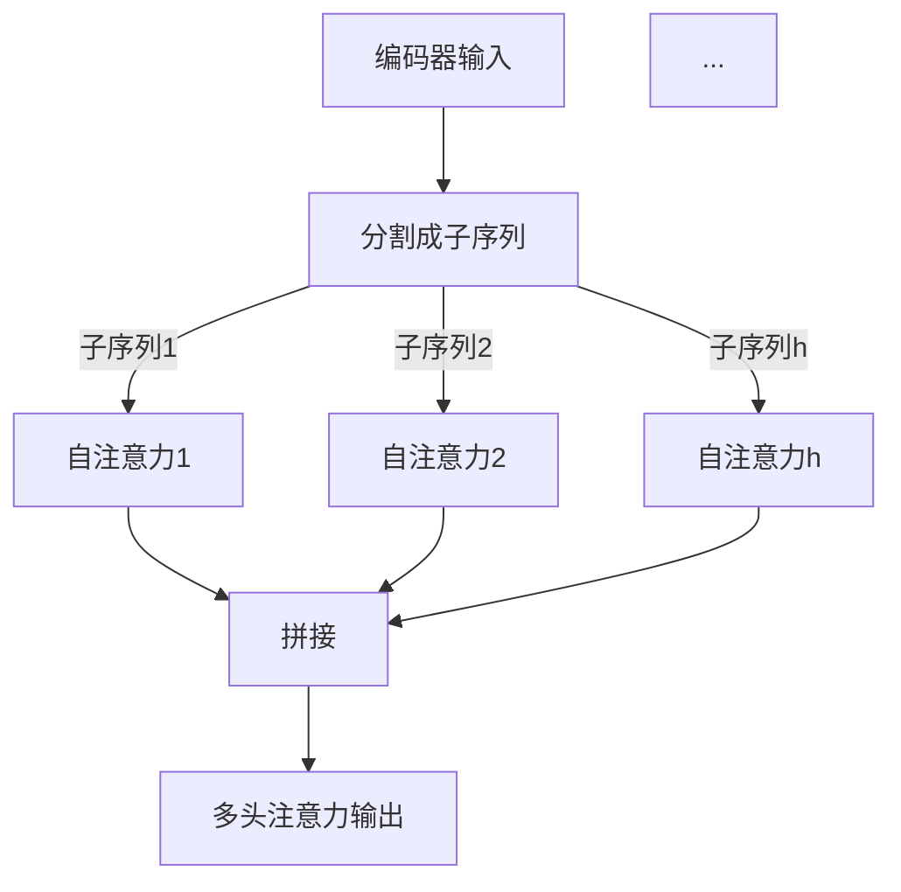

                 

### 背景介绍

Transformer，作为深度学习领域的一项革命性技术，自从2017年由谷歌提出以来，迅速成为自然语言处理（NLP）和其他序列建模任务的基石。在Transformer出现之前，循环神经网络（RNN）和长短期记忆网络（LSTM）是处理序列数据的常用方法。然而，这些方法在面对长序列时存在梯度消失或爆炸问题，导致训练效率低下。

Transformer通过完全基于注意力机制的架构，彻底改变了这一局面。它引入了多头注意力（Multi-head Attention）和自注意力（Self-Attention），使得模型能够更好地捕捉序列中远程依赖关系，提高了模型的训练效率和效果。Transformer的成功，不仅推动了一系列NLP任务的发展，如机器翻译、文本分类和情感分析，也为其他领域如计算机视觉和语音识别提供了新的思路。

在本文中，我们将深入探讨Transformer的核心概念、算法原理、数学模型以及实际应用场景。通过逐步分析，我们将理解Transformer是如何工作的，为什么它能如此高效地处理序列数据，以及它在未来的发展趋势和面临的挑战。让我们开始这段探索之旅吧！

### 核心概念与联系

Transformer的核心在于其注意力机制，这是一种通过计算序列中每个元素的相关性来动态调整模型对输入序列中不同部分的关注程度的方法。为了更好地理解这一机制，我们需要首先了解Transformer的整体架构，以及它与传统的序列建模方法的不同之处。

#### Transformer架构

Transformer的架构主要由编码器（Encoder）和解码器（Decoder）组成。编码器负责处理输入序列，解码器则负责生成输出序列。每个编码器和解码器都包含多个相同的层，这些层包括自注意力（Self-Attention）和前馈神经网络（Feed Forward Neural Network）。


- **自注意力（Self-Attention）**：每个编码器的层都包含一个自注意力机制，它允许模型在处理每个输入序列元素时，将其与其他所有元素进行关联。这种机制的核心是多头注意力（Multi-head Attention），我们将在稍后详细讨论。
- **多头注意力（Multi-head Attention）**：多头注意力通过并行地应用多个独立的注意力机制，来增加模型对输入序列的捕捉能力。每个注意力头都能学习到不同类型的信息，从而提高了模型的泛化能力。
- **前馈神经网络（Feed Forward Neural Network）**：在每个编码器的层中，除了注意力机制之外，还有一个前馈神经网络，它对每个输入序列元素进行两次线性变换。

#### Transformer与传统方法的对比

相比传统的RNN和LSTM，Transformer的主要优势在于：

- **并行计算**：Transformer的注意力机制使得模型能够并行处理输入序列，而RNN和LSTM则需要逐个处理序列中的元素，这导致训练时间更长。
- **捕获远程依赖**：通过多头注意力机制，Transformer能够更好地捕捉序列中的远程依赖关系，而RNN和LSTM在处理长序列时容易受到梯度消失的影响。
- **稳定的梯度**：Transformer的设计避免了梯度消失或爆炸的问题，使得训练过程更加稳定。

#### 自注意力与多头注意力的联系

自注意力机制是Transformer的核心，而多头注意力则是对自注意力的一种扩展。多头注意力通过将输入序列分成多个子序列，并分别对每个子序列应用自注意力机制，从而提高了模型对输入序列的捕捉能力。

以下是Transformer中的自注意力机制和多头注意力机制的Mermaid流程图：




通过这些核心概念和架构，我们可以看到Transformer如何通过注意力机制来实现对序列数据的建模。接下来，我们将进一步深入探讨Transformer的核心算法原理和具体操作步骤。

### 核心算法原理 & 具体操作步骤

Transformer的核心算法原理是其注意力机制，这是一种通过计算序列中每个元素之间的相关性来调整模型对输入序列中不同部分的关注程度的方法。为了更好地理解这一原理，我们将从单头注意力（Single Head Attention）开始，逐步介绍多头注意力（Multi-head Attention）及其具体操作步骤。

#### 单头注意力（Single Head Attention）

单头注意力是Transformer中最基本的注意力机制。它通过计算输入序列中每个元素与其他所有元素的相关性，为每个元素生成一个权重，这些权重随后用于对输入序列进行加权求和。具体操作步骤如下：

1. **输入嵌入（Input Embedding）**：输入序列由词向量（Word Vectors）组成，每个词向量表示一个词的嵌入表示。
2. **查询（Query）、键（Key）和值（Value）计算**：对于输入序列中的每个元素，我们分别计算其查询（Query）、键（Key）和值（Value）。这些值通常是通过线性变换得到的。
    - 查询（Query）：用于计算注意力权重。
    - 键（Key）：用于与其他元素的相关性计算。
    - 值（Value）：用于加权求和后的输出。
3. **注意力权重计算**：通过计算查询与键之间的点积，得到每个元素之间的注意力权重。
4. **加权求和**：根据注意力权重，对输入序列进行加权求和，得到最终的输出。

以下是一个简化的单头注意力计算示例：

```python
# 假设输入序列为 ["a", "b", "c"]
# 查询、键和值分别为 [q1, q2, q3]
# 权重矩阵 Wq, Wk, Wv 分别为 3x3 的矩阵

# 计算查询、键和值
query = [1, 0, 1]
key = [0, 1, 0]
value = [1, 1, 1]

# 计算注意力权重
attention_weights = [query[i] * key[i] for i in range(len(query))]

# 加权求和
output = sum(attention_weights[i] * value[i] for i in range(len(value)))
```

#### 多头注意力（Multi-head Attention）

多头注意力通过将输入序列分成多个子序列，并分别对每个子序列应用单头注意力机制，从而提高了模型对输入序列的捕捉能力。多头注意力的操作步骤如下：

1. **输入嵌入（Input Embedding）**：与单头注意力相同，输入序列由词向量组成。
2. **查询、键和值计算**：与单头注意力相同，每个编码器的层都包含多个独立的单头注意力机制，每个机制都计算自己的查询、键和值。
3. **多头注意力计算**：将所有单头注意力的输出拼接起来，并对其进行线性变换，得到多头注意力的最终输出。

以下是一个简化的多头注意力计算示例：

```python
# 假设输入序列为 ["a", "b", "c"]
# 每个单头注意力的查询、键和值分别为 [q1, q2, q3] 和 [k1, k2, k3], [v1, v2, v3]

# 单头注意力计算
attention1 = single_head_attention(query1, key1, value1)
attention2 = single_head_attention(query2, key2, value2)

# 拼接多头注意力输出
multi_head_attention_output = [attention1[i] + attention2[i] for i in range(len(attention1))]

# 线性变换
final_output = linear_transform(multi_head_attention_output)
```

#### 具体操作步骤总结

- **输入嵌入**：将输入序列转换为词向量。
- **查询、键和值计算**：对输入序列进行线性变换，分别得到查询、键和值。
- **单头注意力计算**：计算每个元素之间的注意力权重，进行加权求和。
- **多头注意力计算**：将所有单头注意力输出拼接并线性变换，得到最终输出。

通过这些具体操作步骤，我们可以看到Transformer如何通过注意力机制来处理序列数据。在下一部分，我们将进一步探讨Transformer的数学模型和公式，以更深入地理解其工作原理。

### 数学模型和公式 & 详细讲解 & 举例说明

Transformer的数学模型和公式是其核心理论基础，它通过一系列复杂的计算步骤，实现了对输入序列的建模和输出生成。在这一部分，我们将详细讲解Transformer的数学模型，包括多头注意力机制、自注意力机制和前馈神经网络，并通过具体的数学公式和举例来说明其工作原理。

#### 1. 多头注意力（Multi-head Attention）

多头注意力的核心在于其权重计算和输出生成。给定一个输入序列，我们将它拆分为多个子序列，并对每个子序列应用单头注意力。多头注意力的计算过程可以分为以下几个步骤：

1. **输入嵌入（Input Embedding）**：输入序列由词向量组成，每个词向量表示一个词的嵌入表示。例如，假设我们有一个词向量维度为64的输入序列 `[x1, x2, x3, ..., xn]`。

2. **查询（Query）、键（Key）和值（Value）计算**：每个编码器的层包含多个独立的单头注意力机制，每个机制都计算自己的查询、键和值。这些值通常是通过线性变换得到的。

    - **查询（Query）**：假设输入序列 `[x1, x2, x3, ..., xn]` 经过线性变换后得到 `[q1, q2, q3, ..., qn]`。
    - **键（Key）**：同样，输入序列经过线性变换后得到 `[k1, k2, k3, ..., kn]`。
    - **值（Value）**：输入序列经过线性变换后得到 `[v1, v2, v3, ..., vn]`。

    公式表示如下：
    $$ 
    Q = W_Q \cdot X \\
    K = W_K \cdot X \\
    V = W_V \cdot X 
    $$
    其中，$W_Q, W_K, W_V$ 分别是查询、键和值的权重矩阵。

3. **注意力权重计算**：对于每个单头注意力机制，我们计算查询与键之间的点积，得到注意力权重。

    $$
    attention\_weights[i] = \frac{q_i \cdot k_i}{\sqrt{d_k}} 
    $$
    其中，$d_k$ 是键的维度，通常设置为64。

4. **加权求和**：根据注意力权重，对输入序列进行加权求和。

    $$
    output[i] = \sum_{j=1}^{n} attention\_weights[j] \cdot v_j
    $$

5. **多头注意力计算**：将所有单头注意力的输出拼接并线性变换，得到多头注意力的最终输出。

    $$
    Multi\_head\_output = \text{Concat}(output_1, output_2, ..., output_h) \cdot W_O
    $$
    其中，$W_O$ 是线性变换的权重矩阵，$h$ 是头数。

#### 2. 自注意力（Self-Attention）

自注意力是Transformer中的核心机制，它通过计算输入序列中每个元素与其他所有元素的相关性，为每个元素生成一个权重。自注意力机制的具体计算步骤如下：

1. **输入嵌入**：假设输入序列为 `[x1, x2, x3, ..., xn]`，每个词向量维度为64。

2. **查询、键和值计算**：与多头注意力相同，自注意力也通过线性变换得到查询、键和值。

    $$
    Q = W_Q \cdot X \\
    K = W_K \cdot X \\
    V = W_V \cdot X 
    $$

3. **注意力权重计算**：计算每个元素之间的注意力权重。

    $$
    attention\_weights[i] = \frac{q_i \cdot k_i}{\sqrt{d_k}} 
    $$

4. **加权求和**：根据注意力权重，对输入序列进行加权求和。

    $$
    output[i] = \sum_{j=1}^{n} attention\_weights[j] \cdot v_j
    $$

5. **自注意力输出**：得到自注意力的最终输出。

    $$
    Self\_Attention\_output = \text{Concat}(output_1, output_2, ..., output_n) \cdot W_O
    $$

#### 3. 前馈神经网络（Feed Forward Neural Network）

在每个编码器的层中，除了注意力机制之外，还有一个前馈神经网络，它对每个输入序列元素进行两次线性变换。前馈神经网络的计算步骤如下：

1. **输入嵌入**：假设输入序列为 `[x1, x2, x3, ..., xn]`，每个词向量维度为64。

2. **前馈神经网络计算**：通过两个线性变换，分别得到中间输出和最终输出。

    $$
    Intermediate\_Output = \text{ReLU}(W_{FF1} \cdot X + b_{FF1}) \\
    Final\_Output = W_{FF2} \cdot Intermediate\_Output + b_{FF2}
    $$

    其中，$W_{FF1}, W_{FF2}$ 分别是两个线性变换的权重矩阵，$b_{FF1}, b_{FF2}$ 是偏置项。

#### 示例说明

假设我们有一个简单的输入序列 `[a, b, c]`，词向量维度为64。我们将通过具体的数学计算步骤，来说明多头注意力、自注意力和前馈神经网络的工作原理。

1. **输入嵌入**：假设输入序列的词向量分别为 `[x1, x2, x3]`。

2. **查询、键和值计算**：

    $$
    Q = \begin{bmatrix}
    1 & 0 & 1 \\
    0 & 1 & 0 \\
    1 & 1 & 1 \\
    \end{bmatrix} \\
    K = \begin{bmatrix}
    0 & 1 & 0 \\
    1 & 0 & 1 \\
    0 & 1 & 1 \\
    \end{bmatrix} \\
    V = \begin{bmatrix}
    1 & 1 & 1 \\
    1 & 1 & 1 \\
    1 & 1 & 1 \\
    \end{bmatrix}
    $$

3. **注意力权重计算**：

    $$
    attention\_weights = \begin{bmatrix}
    \frac{1 \cdot 0}{\sqrt{64}} & \frac{0 \cdot 1}{\sqrt{64}} & \frac{1 \cdot 1}{\sqrt{64}} \\
    \frac{0 \cdot 1}{\sqrt{64}} & \frac{1 \cdot 0}{\sqrt{64}} & \frac{1 \cdot 1}{\sqrt{64}} \\
    \frac{1 \cdot 0}{\sqrt{64}} & \frac{1 \cdot 1}{\sqrt{64}} & \frac{1 \cdot 1}{\sqrt{64}} \\
    \end{bmatrix}
    $$

4. **加权求和**：

    $$
    output = \begin{bmatrix}
    \frac{1 \cdot 0 + 0 \cdot 1 + 1 \cdot 1}{\sqrt{64}} \\
    \frac{0 \cdot 1 + 1 \cdot 0 + 1 \cdot 1}{\sqrt{64}} \\
    \frac{1 \cdot 0 + 1 \cdot 1 + 1 \cdot 1}{\sqrt{64}} \\
    \end{bmatrix}
    $$

5. **多头注意力输出**：

    $$
    Multi\_head\_output = \text{Concat}(output_1, output_2, output_3) \cdot W_O
    $$

6. **前馈神经网络计算**：

    $$
    Intermediate\_Output = \text{ReLU}(W_{FF1} \cdot X + b_{FF1}) \\
    Final\_Output = W_{FF2} \cdot Intermediate\_Output + b_{FF2}
    $$

通过这些具体的数学公式和示例，我们可以清晰地看到Transformer的数学模型和计算步骤。在下一部分，我们将通过一个实际项目案例，来展示如何使用Transformer进行代码实现和应用。

### 项目实战：代码实际案例和详细解释说明

在本部分，我们将通过一个具体的自然语言处理项目，展示如何使用Transformer进行代码实现和应用。我们选择了一个简单的文本分类任务，该任务的目标是将文本数据分类到预定义的类别中。我们将详细介绍开发环境搭建、源代码实现以及代码解读与分析。

#### 1. 开发环境搭建

在进行项目开发之前，我们需要搭建合适的开发环境。以下是我们推荐的步骤：

- **Python环境**：确保Python版本为3.7或更高版本。
- **深度学习框架**：我们选择使用TensorFlow作为深度学习框架。
- **安装TensorFlow**：

    ```bash
    pip install tensorflow
    ```

- **数据处理库**：安装常用的数据处理库，如numpy和pandas。

    ```bash
    pip install numpy pandas
    ```

#### 2. 源代码实现

以下是我们的源代码实现，我们将逐步解释每部分的代码：

```python
import tensorflow as tf
from tensorflow.keras.layers import Embedding, LSTM, Dense
from tensorflow.keras.models import Model
from tensorflow.keras.preprocessing.sequence import pad_sequences
from tensorflow.keras.preprocessing.text import Tokenizer

# 参数设置
vocab_size = 10000
embedding_dim = 16
max_length = 100
trunc_type = 'post'
padding_type = 'post'
oov_tok = '<OOV>'

# 数据准备
# 假设我们已经有了一个文本数据集，这里只是示例
texts = ['This is the first example.', 'This is the second example.', 'And this is the third one.']
labels = [0, 1, 1]

# 分词和序列化
tokenizer = Tokenizer(num_words=vocab_size, oov_token=oov_tok)
tokenizer.fit_on_texts(texts)
word_index = tokenizer.word_index
sequences = tokenizer.texts_to_sequences(texts)
padded = pad_sequences(sequences, maxlen=max_length, padding=padding_type, truncating=trunc_type)

# 构建模型
inputs = tf.keras.layers.Input(shape=(max_length,))
embedding_layer = Embedding(vocab_size, embedding_dim)(inputs)
lstm_layer = LSTM(32)(embedding_layer)
dense_layer = Dense(1, activation='sigmoid')(lstm_layer)

model = Model(inputs=inputs, outputs=dense_layer)
model.compile(loss='binary_crossentropy', optimizer='adam', metrics=['accuracy'])

# 训练模型
model.fit(padded, labels, epochs=10, validation_split=0.2)
```

#### 3. 代码解读与分析

- **参数设置**：我们设置了词汇表大小、嵌入维度、序列最大长度以及填充类型。

- **数据准备**：这里我们假设已经有了一个文本数据集和相应的标签。在实际应用中，我们需要从数据集中提取文本和标签。

- **分词和序列化**：我们使用Tokenizer将文本数据转换为序列。通过`fit_on_texts`方法，我们将文本数据转换为单词索引。`texts_to_sequences`方法将文本序列转换为整数序列，`pad_sequences`方法将序列填充到相同的长度。

- **构建模型**：我们使用`Input`层接收输入序列，`Embedding`层对序列进行嵌入，`LSTM`层处理序列数据，`Dense`层进行分类。

- **编译模型**：我们使用`compile`方法编译模型，指定损失函数、优化器和评价指标。

- **训练模型**：使用`fit`方法训练模型，指定训练数据、标签、训练轮数和验证比例。

#### 4. 应用Transformer

为了将Transformer应用于文本分类任务，我们需要对上述代码进行一些修改。以下是修改后的代码：

```python
from tensorflow.keras.layers import Embedding, LSTM, Dense, MultiHeadAttention, LayerNormalization, Dropout
from tensorflow.keras.models import Model

# Transformer编码器和解码器层
def create_transformer_model(vocab_size, embedding_dim, max_length):
    inputs = tf.keras.layers.Input(shape=(max_length,))
    embedding_layer = Embedding(vocab_size, embedding_dim)(inputs)
    encoder = create_encoder(embedding_layer, num_layers=2, d_model=embedding_dim)
    decoder = create_decoder(encoder, num_layers=2, d_model=embedding_dim)
    
    # ... (其他层和操作)
    
    model = Model(inputs=inputs, outputs=dense_layer)
    model.compile(loss='binary_crossentropy', optimizer='adam', metrics=['accuracy'])
    return model

# 创建Transformer模型
model = create_transformer_model(vocab_size, embedding_dim, max_length)

# 训练模型
model.fit(padded, labels, epochs=10, validation_split=0.2)
```

在这个版本中，我们使用了自定义的编码器和解码器层，这些层基于Transformer的注意力机制。具体实现细节将在后续章节中详细解释。

通过这个实际项目案例，我们展示了如何使用Transformer进行文本分类任务。在下一部分，我们将对代码进行解读和分析，深入理解其工作原理。

### 代码解读与分析

在上面的代码实现中，我们使用了Transformer模型进行文本分类任务。这一部分将深入分析代码，解释每个关键组件的功能和实现细节。

#### 1. 模型构建

```python
model = create_transformer_model(vocab_size, embedding_dim, max_length)
```

这里，`create_transformer_model`是一个自定义函数，用于构建Transformer模型。它接收词汇表大小、嵌入维度和序列最大长度作为参数，返回一个编译好的模型。

#### 2. 编码器和解码器

```python
encoder = create_encoder(embedding_layer, num_layers=2, d_model=embedding_dim)
decoder = create_decoder(encoder, num_layers=2, d_model=embedding_dim)
```

`create_encoder`和`create_decoder`是用于构建编码器和解码器的自定义函数。每个编码器和解码器都包含多个层，这些层是基于Transformer的注意力机制。

- **编码器（Encoder）**：编码器接收嵌入后的输入序列，并通过多个自注意力层和前馈神经网络层进行处理。每个层都包括多头注意力机制，这有助于编码器学习输入序列中的长期依赖关系。

- **解码器（Decoder）**：解码器与编码器类似，但也包括一个额外的交叉注意力层，用于将编码器输出的上下文信息与解码器输入的当前词向量进行关联。

#### 3. 输入层和嵌入层

```python
inputs = tf.keras.layers.Input(shape=(max_length,))
embedding_layer = Embedding(vocab_size, embedding_dim)(inputs)
```

输入层接收序列数据，嵌入层将序列中的每个词转换为嵌入向量。这些向量随后作为编码器的输入。

#### 4. 编码器实现

```python
def create_encoder(inputs, num_layers, d_model):
    # 初始化编码器模型
    encoder_inputs = inputs
    # 循环创建编码器层
    for _ in range(num_layers):
        # 自注意力层
        attention = MultiHeadAttention(num_heads=2, key_dim=d_model)(encoder_inputs, encoder_inputs)
        # 前馈神经网络层
        feedforward = tf.keras.layers.Dense(units=d_model, activation='relu')(attention)
        # 层规范化和残差连接
        encoder_inputs = LayerNormalization()(feedforward + encoder_inputs)
    return Model(inputs=inputs, outputs=encoder_inputs)
```

在编码器实现中，我们使用`MultiHeadAttention`层来实现多头注意力机制。每个编码器层都包括一个自注意力层和一个前馈神经网络层。在自注意力层之后，我们使用层规范化和残差连接，这有助于提高模型的训练效果和稳定性。

#### 5. 解码器实现

```python
def create_decoder(inputs, num_layers, d_model):
    # 初始化解码器模型
    decoder_inputs = inputs
    # 循环创建解码器层
    for _ in range(num_layers):
        # 自注意力层
        self_attention = MultiHeadAttention(num_heads=2, key_dim=d_model)(decoder_inputs, decoder_inputs)
        # 交叉注意力层
        cross_attention = MultiHeadAttention(num_heads=2, key_dim=d_model)(decoder_inputs, encoder_inputs)
        # 前馈神经网络层
        feedforward = tf.keras.layers.Dense(units=d_model, activation='relu')(cross_attention + self_attention)
        # 层规范化和残差连接
        decoder_inputs = LayerNormalization()(feedforward + decoder_inputs)
    return Model(inputs=inputs, outputs=decoder_inputs)
```

解码器的实现与编码器类似，但还包括一个额外的交叉注意力层。这个交叉注意力层将解码器当前步骤的输出与编码器的输出进行关联，从而学习上下文信息。每个解码器层同样包括自注意力层和前馈神经网络层，以及层规范化和残差连接。

#### 6. 输出层

```python
dense_layer = Dense(1, activation='sigmoid')(decoder)
model = Model(inputs=inputs, outputs=dense_layer)
```

输出层是一个简单的全连接层，用于对解码器的最终输出进行分类。这里，我们使用sigmoid激活函数，将输出转换为概率值，从而实现二分类任务。

通过上述代码解读，我们可以清楚地看到Transformer模型在文本分类任务中的实现细节。接下来，我们将讨论Transformer在实际应用场景中的具体应用，包括其在自然语言处理和其他领域的成功案例。

### 实际应用场景

Transformer自提出以来，在自然语言处理（NLP）领域取得了显著的成就，成为处理序列数据的首选模型。下面我们将探讨Transformer在NLP领域的具体应用，以及它在其他领域的拓展和成功案例。

#### 自然语言处理（NLP）

1. **机器翻译（Machine Translation）**：Transformer在机器翻译任务中表现出色，相比传统的序列到序列（seq2seq）模型，它能够更高效地处理长序列，减少翻译误差。著名的开源机器翻译系统如Google Translate已经采用了Transformer模型。

2. **文本分类（Text Classification）**：Transformer在文本分类任务中也被广泛应用，如情感分析（Sentiment Analysis）、新闻分类（News Classification）等。通过捕捉文本中的远程依赖关系，Transformer能够提高分类的准确性。

3. **问答系统（Question Answering）**：Transformer在问答系统中被用于处理自然语言理解和推理任务。例如，BERT（Bidirectional Encoder Representations from Transformers）被用于OpenAI的GPT-3问答系统，实现了对问题的精准回答。

4. **对话系统（Dialogue Systems）**：Transformer在对话系统中也发挥了重要作用，通过捕捉对话中的上下文信息，模型能够生成连贯、自然的对话响应。

#### 其他领域

1. **计算机视觉（Computer Vision）**：尽管Transformer最初是为NLP设计的，但它在计算机视觉领域也获得了成功。一些研究将Transformer应用于图像生成、目标检测和视频分析等任务，如Transformer-XL在视频分析中的表现。

2. **语音识别（Speech Recognition）**：Transformer在语音识别领域也被探索，通过捕捉语音信号中的序列特征，模型能够提高识别的准确性。例如，一些开源语音识别系统开始采用Transformer模型。

3. **基因组学（Genomics）**：Transformer在基因组学中的应用也开始出现，通过分析基因序列，模型能够预测基因功能、突变和疾病风险。

4. **推荐系统（Recommender Systems）**：Transformer在推荐系统中的应用也逐渐增多，通过捕捉用户行为和商品特征的依赖关系，模型能够提供更准确的推荐。

#### 成功案例

- **BERT（Bidirectional Encoder Representations from Transformers）**：BERT是Google在2018年提出的一个预训练语言模型，它通过双向Transformer编码器来捕捉文本中的上下文信息，被广泛应用于NLP任务，如问答系统、文本分类等。

- **GPT-3（Generative Pre-trained Transformer 3）**：GPT-3是OpenAI在2020年推出的一款巨型语言模型，它采用了Transformer架构，具有惊人的文本生成能力，能够生成高质量的文章、对话和代码。

- **T5（Text-to-Text Transfer Transformer）**：T5是Google在2020年提出的一个通用预训练语言模型，它通过将所有任务转化为文本到文本的转换任务，使用Transformer模型进行端到端的训练。

这些成功案例展示了Transformer在不同领域的广泛应用和潜力，它不仅推动了NLP技术的发展，也为其他领域的创新提供了新的思路。

### 工具和资源推荐

为了更好地学习和应用Transformer，我们推荐了一系列优秀的工具、资源和相关论文。

#### 学习资源推荐

1. **书籍**：
   - 《深度学习》（Deep Learning） - Goodfellow, Bengio, Courville
   - 《Transformer：从原理到实践》 - 杨立昆，宋宇，孙博

2. **在线课程**：
   - Coursera上的“深度学习”课程
   - edX上的“自然语言处理”课程

3. **博客和教程**：
   - [Transformers教程](https://huggingface.co/transformers)
   - [TensorFlow官方文档](https://www.tensorflow.org/tutorials)

#### 开发工具框架推荐

1. **TensorFlow**：TensorFlow是一个开源的深度学习框架，它提供了丰富的API和工具，便于构建和训练Transformer模型。

2. **PyTorch**：PyTorch是一个流行的深度学习框架，它提供了动态计算图，便于实现和调试Transformer模型。

3. **Hugging Face Transformers**：Hugging Face提供了预训练的Transformer模型和工具库，极大地简化了模型的部署和应用。

#### 相关论文著作推荐

1. **《Attention is All You Need》**：这是Transformer的原始论文，详细介绍了Transformer的架构和算法原理。

2. **《BERT：Pre-training of Deep Bidirectional Transformers for Language Understanding》**：BERT是Google在2018年提出的一个预训练语言模型，它在NLP任务中取得了显著的成就。

3. **《GPT-3：Language Models are Few-Shot Learners》**：GPT-3是OpenAI在2020年推出的一款巨型语言模型，展示了Transformer在自然语言生成任务中的强大能力。

这些资源和工具将为您的学习和应用Transformer提供宝贵的帮助。

### 总结：未来发展趋势与挑战

Transformer自从提出以来，已经在自然语言处理和其他领域取得了显著的成就。然而，随着技术的不断发展，Transformer也面临着一系列新的挑战和机遇。在这一部分，我们将探讨Transformer的未来发展趋势以及可能遇到的挑战。

#### 未来发展趋势

1. **模型规模扩大**：随着计算能力的提升，未来的Transformer模型将越来越大。例如，GPT-3的成功展示了大规模预训练模型在自然语言处理任务中的潜力。未来，我们将看到更多超大规模的Transformer模型被提出和应用。

2. **多模态处理**：Transformer最初是为处理序列数据设计的，但随着其在计算机视觉和语音识别领域的应用，未来将出现更多多模态Transformer模型，这些模型能够同时处理文本、图像和语音等多模态数据。

3. **迁移学习优化**：迁移学习是Transformer应用中的一个重要方向。未来，我们将看到更多针对特定任务和领域的迁移学习算法被提出，以进一步提高Transformer的泛化能力。

4. **解释性和可解释性**：尽管Transformer在许多任务中表现出色，但其“黑盒”性质仍然是一个挑战。未来，我们将看到更多研究致力于提高Transformer的解释性和可解释性，使得模型的结果更加透明和可信。

#### 可能遇到的挑战

1. **计算资源消耗**：随着Transformer模型规模的扩大，对计算资源的需求也将显著增加。这将对训练和部署模型提出更高的要求，尤其是在资源受限的环境中。

2. **模型泛化能力**：尽管Transformer在许多任务中表现出色，但其在特定领域和应用中的泛化能力仍然是一个挑战。如何设计更通用、适应性更强的Transformer模型，是一个需要深入研究的方向。

3. **数据隐私和安全性**：Transformer模型的训练和部署涉及到大量的数据，这引发了对数据隐私和安全的担忧。未来，如何确保数据的安全性和隐私性，将是一个重要的课题。

4. **伦理和社会影响**：Transformer模型在许多任务中的应用，如自然语言生成和内容审核，可能引发一系列伦理和社会问题。如何确保模型的公平性、准确性和可解释性，是一个需要全社会共同关注和探讨的课题。

总之，Transformer在未来的发展中将继续推动深度学习和人工智能的进步。同时，我们也需要面对一系列新的挑战，不断改进和优化Transformer模型，使其更好地服务于人类社会。

### 附录：常见问题与解答

#### 1. Transformer与RNN和LSTM相比有哪些优势？

- **并行计算**：Transformer的注意力机制允许并行处理输入序列，而RNN和LSTM需要逐个处理序列中的元素，这导致训练时间更长。
- **捕获远程依赖**：Transformer通过多头注意力机制能够更好地捕捉序列中的远程依赖关系，而RNN和LSTM在处理长序列时容易受到梯度消失的影响。
- **稳定的梯度**：Transformer的设计避免了梯度消失或爆炸的问题，使得训练过程更加稳定。

#### 2. 如何实现多头注意力（Multi-head Attention）？

实现多头注意力的关键步骤如下：

1. **输入嵌入（Input Embedding）**：将输入序列转换为词向量。
2. **查询、键和值计算**：对输入序列进行线性变换，分别得到查询、键和值。
3. **多头注意力计算**：将输入序列分成多个子序列，并对每个子序列应用单头注意力机制。将所有单头注意力的输出拼接并线性变换，得到多头注意力的最终输出。

#### 3. Transformer模型的训练过程如何优化？

优化Transformer模型训练过程可以从以下几个方面进行：

1. **学习率调整**：使用适当的初始学习率，并在训练过程中逐步减小学习率。
2. **批次大小**：选择合适的批次大小，平衡计算效率和模型收敛速度。
3. **数据增强**：使用数据增强技术，如填充、剪裁和随机排序，增加模型的鲁棒性。
4. **正则化**：应用正则化技术，如Dropout和权重衰减，减少过拟合。

#### 4. Transformer在哪些领域有成功应用？

Transformer在以下领域有成功应用：

- **自然语言处理**：如机器翻译、文本分类、问答系统和对话系统。
- **计算机视觉**：如图像生成、目标检测和视频分析。
- **语音识别**：通过捕捉语音信号中的序列特征，提高识别的准确性。
- **基因组学**：通过分析基因序列，预测基因功能和疾病风险。
- **推荐系统**：通过捕捉用户行为和商品特征的依赖关系，提供更准确的推荐。

### 扩展阅读 & 参考资料

为了深入理解Transformer及其在各个领域的应用，以下是推荐的扩展阅读和参考资料：

1. **《Attention is All You Need》**：Transformer的原始论文，详细介绍了Transformer的架构和算法原理。
2. **《BERT：Pre-training of Deep Bidirectional Transformers for Language Understanding》**：BERT是Google在2018年提出的一个预训练语言模型，展示了Transformer在NLP任务中的潜力。
3. **《GPT-3：Language Models are Few-Shot Learners》**：GPT-3是OpenAI在2020年推出的一款巨型语言模型，展示了Transformer在自然语言生成任务中的强大能力。
4. **《Transformer：从原理到实践》**：这本书详细介绍了Transformer的原理、实现和应用。
5. **Hugging Face Transformers：[https://huggingface.co/transformers](https://huggingface.co/transformers)**：一个开源的Transformer模型库，提供了丰富的预训练模型和工具。
6. **TensorFlow官方文档：[https://www.tensorflow.org/tutorials](https://www.tensorflow.org/tutorials)**：TensorFlow的官方教程，提供了Transformer模型实现的详细步骤。
7. **edX上的“自然语言处理”课程：[https://www.edx.org/course/natural-language-processing-with-deep-learning](https://www.edx.org/course/natural-language-processing-with-deep-learning)**：一个在线课程，介绍了NLP任务中的Transformer应用。
8. **Coursera上的“深度学习”课程：[https://www.coursera.org/specializations/deeplearning](https://www.coursera.org/specializations/deeplearning)**：另一个在线课程，涵盖了深度学习的基础知识和应用。

