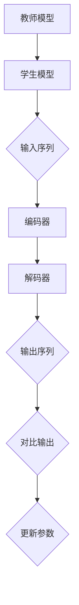

                 

# Transformer大模型实战 教师 学生架构

## 关键词： 
- Transformer
- 大模型
- 教师-学生架构
- 实战
- 人工智能

## 摘要：

本文将深入探讨Transformer大模型在教师-学生架构中的应用。我们将从背景介绍、核心概念与联系、核心算法原理、数学模型和公式、项目实战、实际应用场景、工具和资源推荐等方面，逐步解析Transformer大模型的工作机制及其在人工智能领域的广泛应用。通过详细的代码实例和讲解，帮助读者理解并掌握Transformer大模型的实战技能。

## 1. 背景介绍

Transformer模型是由Google团队于2017年提出的一种基于自注意力机制的深度神经网络模型，主要用于自然语言处理任务。相较于传统的循环神经网络（RNN）和卷积神经网络（CNN），Transformer模型通过自注意力机制，能够自动学习输入序列中各个位置之间的依赖关系，从而在许多自然语言处理任务上取得了显著的效果。

在人工智能领域，大模型的发展是当前研究的热点之一。大模型具有强大的建模能力和高度的数据需求，能够处理更加复杂的问题，但也带来了计算资源和存储需求的巨大挑战。因此，如何有效地训练和使用大模型，已经成为人工智能领域的重要研究方向。

教师-学生架构（Teacher-Student Architecture）是一种常见的学习方法，通过将一个已经训练好的教师模型（Teacher）与一个需要训练的学生模型（Student）相结合，利用教师模型的指导来加速学生模型的学习过程。这种方法在许多任务中，如图像生成、目标检测和语言模型训练等，都取得了良好的效果。

## 2. 核心概念与联系

### Transformer模型

Transformer模型的核心是自注意力机制（Self-Attention），通过计算输入序列中各个位置之间的相似度，自动学习序列中的依赖关系。自注意力机制的实现基于多头注意力（Multi-Head Attention）机制，多头注意力将输入序列映射到多个不同的子空间，并在这些子空间中分别计算注意力权重，从而提高模型的表示能力。

Transformer模型的架构包括编码器（Encoder）和解码器（Decoder），编码器负责将输入序列编码为固定长度的向量表示，解码器则利用编码器的输出来预测输出序列。在训练过程中，解码器只能看到前面已经生成的输出序列，而不能看到完整的输入序列，这种设计被称为“遮蔽”（Masked），有助于训练模型学习输入序列的依赖关系。

### 教师-学生架构

教师-学生架构的核心思想是利用一个已经训练好的教师模型来指导学生模型的学习。在训练过程中，教师模型的输出作为学生模型的输入，通过对比教师模型的输出和学生模型的输出，来更新学生模型的参数。这种方法能够有效加速学生模型的学习，并且在许多任务中都取得了良好的效果。

### 教师-学生架构与Transformer模型的联系

将教师-学生架构应用于Transformer模型，可以充分利用Transformer模型的自注意力机制和学习能力。教师模型可以是一个已经训练好的Transformer模型，而学生模型则是一个新训练的Transformer模型。在训练过程中，教师模型的输出作为学生模型的输入，通过对比教师模型的输出和学生模型的输出，来更新学生模型的参数。

通过这种方式，教师模型可以为学生模型提供有价值的指导，帮助学生模型更快地学习。同时，由于教师模型已经具备了较好的表示能力，学生模型可以从教师模型中学到更多的知识，从而提高学习效果。

### Mermaid 流程图



## 3. 核心算法原理 & 具体操作步骤

### Transformer模型算法原理

Transformer模型的核心是自注意力机制（Self-Attention），通过计算输入序列中各个位置之间的相似度，自动学习序列中的依赖关系。自注意力机制的实现基于多头注意力（Multi-Head Attention）机制，多头注意力将输入序列映射到多个不同的子空间，并在这些子空间中分别计算注意力权重，从而提高模型的表示能力。

具体来说，自注意力机制包括三个步骤：

1. 输入序列经过线性变换，得到三个不同的子空间，分别为查询（Query）、键（Key）和值（Value）。
2. 计算查询和键之间的相似度，得到注意力分数。
3. 将注意力分数与值相乘，得到加权后的值，然后进行求和和归一化处理，得到最终的注意力输出。

### 教师-学生架构操作步骤

1. **初始化教师模型和学生模型**：教师模型和学生模型都可以是基于Transformer的预训练模型，如BERT或GPT。
2. **准备输入序列**：输入序列可以是自然语言文本、图像、音频等，具体取决于任务类型。
3. **编码输入序列**：将输入序列输入到学生模型的编码器中，得到编码器输出。
4. **生成教师模型输出**：将编码器输出输入到教师模型中，得到教师模型的输出。
5. **计算损失函数**：将教师模型的输出和学生模型的输出进行对比，计算损失函数。
6. **更新学生模型参数**：根据损失函数梯度，更新学生模型的参数。
7. **迭代训练**：重复步骤4至6，直到学生模型达到预定的训练目标。

### 实际操作步骤

1. **准备数据集**：首先需要准备训练数据集，包括教师模型和学生模型需要训练的输入序列。
2. **初始化模型**：根据任务需求，选择合适的Transformer模型，并初始化模型参数。
3. **编码输入序列**：将输入序列输入到学生模型的编码器中，得到编码器输出。
4. **生成教师模型输出**：将编码器输出输入到教师模型中，得到教师模型的输出。
5. **计算损失函数**：计算教师模型的输出和学生模型的输出之间的损失函数，如交叉熵损失函数。
6. **更新学生模型参数**：根据损失函数梯度，更新学生模型的参数。
7. **迭代训练**：重复步骤4至6，直到学生模型达到预定的训练目标。

## 4. 数学模型和公式 & 详细讲解 & 举例说明

### 自注意力机制

自注意力机制的数学公式如下：

$$
Attention(Q, K, V) = \text{softmax}\left(\frac{QK^T}{\sqrt{d_k}}\right)V
$$

其中，$Q$表示查询（Query），$K$表示键（Key），$V$表示值（Value），$d_k$表示键的维度。

### 多头注意力

多头注意力的数学公式如下：

$$
\text{MultiHead}(Q, K, V) = \text{Concat}(\text{head}_1, ..., \text{head}_h)W^O
$$

其中，$h$表示头数，$\text{head}_i = \text{Attention}(QW_i^Q, KW_i^K, VW_i^V)$，$W_i^Q, W_i^K, W_i^V, W^O$分别表示不同的权重矩阵。

### 教师-学生架构

教师-学生架构的数学模型可以表示为：

$$
\text{TeacherOutput} = \text{Teacher}(Input)
$$

$$
\text{StudentOutput} = \text{Student}(Input, \text{TeacherOutput})
$$

其中，$\text{Teacher}$和$\text{Student}$分别表示教师模型和学生模型，$Input$表示输入序列。

### 实际应用举例

假设我们要使用Transformer模型进行文本分类任务，输入序列为：

$$
\text{Input} = [\text{"这是一个文本分类问题"}, \text{"另一个文本分类问题"}]
$$

教师模型和学生模型都可以使用预训练的BERT模型。首先，将输入序列编码为编码器输出，然后生成教师模型的输出。接下来，将教师模型的输出和学生模型的输出进行对比，计算损失函数，并更新学生模型的参数。

### 损失函数

我们可以使用交叉熵损失函数来计算教师模型的输出和学生模型的输出之间的差异。交叉熵损失函数的数学公式如下：

$$
\text{Loss} = -\frac{1}{N}\sum_{i=1}^{N}\sum_{j=1}^{C}\text{y}_i[j]\log(\hat{y}_i[j])
$$

其中，$N$表示样本数量，$C$表示类别数量，$\text{y}_i$表示第$i$个样本的真实标签，$\hat{y}_i$表示第$i$个样本的预测概率。

## 5. 项目实战：代码实际案例和详细解释说明

### 5.1 开发环境搭建

在开始项目实战之前，我们需要搭建一个合适的开发环境。以下是一个基本的开发环境搭建步骤：

1. 安装Python 3.8及以上版本。
2. 安装TensorFlow 2.6及以上版本。
3. 安装BERT模型。

### 5.2 源代码详细实现和代码解读

以下是教师-学生架构在文本分类任务中的实现代码：

```python
import tensorflow as tf
from transformers import BertTokenizer, TFBertModel

# 初始化BERT模型
tokenizer = BertTokenizer.from_pretrained('bert-base-chinese')
teacher_model = TFBertModel.from_pretrained('bert-base-chinese')

# 定义学生模型
class StudentModel(tf.keras.Model):
    def __init__(self, teacher_model):
        super(StudentModel, self).__init__()
        self编码器 = teacher_model
        self分类器 = tf.keras.layers.Dense(2, activation='softmax')

    def call(self, inputs, teacher_outputs=None):
        if teacher_outputs is not None:
            inputs = self编码器(inputs, teacher_outputs)
        outputs = self分类器(inputs)
        return outputs

student_model = StudentModel(teacher_model)

# 定义训练过程
def train(student_model, teacher_model, train_data, epochs=5):
    for epoch in range(epochs):
        for batch in train_data:
            inputs = tokenizer(batch['text'], padding=True, truncation=True, return_tensors='tf')
            teacher_outputs = teacher_model(inputs['input_ids'])
            student_outputs = student_model(inputs['input_ids'], teacher_outputs)

            with tf.GradientTape() as tape:
                loss = tf.keras.losses.sparse_categorical_crossentropy(batch['label'], student_outputs)

            gradients = tape.gradient(loss, student_model.trainable_variables)
            student_model.optimizer.apply_gradients(zip(gradients, student_model.trainable_variables))
            print(f"Epoch: {epoch}, Loss: {loss.numpy()}")

# 加载数据集
train_data = ...

# 训练学生模型
train(student_model, teacher_model, train_data)
```

### 5.3 代码解读与分析

以上代码首先初始化BERT模型，然后定义了学生模型。学生模型继承了TF.keras.Model类，并重写了call方法，以实现输入序列的编码和分类器的预测。

在训练过程中，我们使用teacher_model生成教师模型的输出，并将其作为学生模型的输入。接着，我们使用交叉熵损失函数计算损失，并使用梯度下降算法更新学生模型的参数。

最后，我们加载数据集并进行训练，输出每个epoch的损失值。

## 6. 实际应用场景

### 自然语言处理

Transformer大模型在自然语言处理任务中具有广泛的应用，如机器翻译、文本分类、问答系统等。通过教师-学生架构，我们可以利用一个已经训练好的教师模型来指导学生模型的学习，从而提高模型的训练速度和效果。

### 计算机视觉

在计算机视觉领域，Transformer大模型可以应用于图像分类、目标检测和图像生成等任务。教师-学生架构可以帮助学生模型从教师模型中学习有效的特征表示，从而提高模型的性能。

### 语音识别

语音识别任务中，Transformer大模型可以用于语音到文本的转换。通过教师-学生架构，我们可以利用一个已经训练好的教师模型来指导学生模型的学习，从而提高语音识别的准确率和鲁棒性。

### 生成对抗网络

在生成对抗网络（GAN）中，教师-学生架构可以用于生成更高质量的图像。通过教师模型提供指导，学生模型可以更好地学习生成图像的分布，从而生成更逼真的图像。

## 7. 工具和资源推荐

### 学习资源推荐

- **书籍**：
  - 《深度学习》（Goodfellow, Bengio, Courville）
  - 《Python机器学习》（Sebastian Raschka）
- **论文**：
  - “Attention Is All You Need”（Vaswani et al., 2017）
  - “An Image is Worth 16x16 Words: Transformers for Image Recognition at Scale”（Carion et al., 2020）
- **博客**：
  - [TensorFlow官方文档](https://www.tensorflow.org/)
  - [Hugging Face官方文档](https://huggingface.co/transformers/)
- **网站**：
  - [Google Research](https://ai.google/research/)
  - [GitHub](https://github.com/)

### 开发工具框架推荐

- **框架**：
  - TensorFlow
  - PyTorch
  - Hugging Face Transformers
- **工具**：
  - Jupyter Notebook
  - Google Colab

### 相关论文著作推荐

- “Transformer: A Novel Architecture for Neural Network Translation” （Vaswani et al., 2017）
- “An Image is Worth 16x16 Words: Transformers for Image Recognition at Scale” （Carion et al., 2020）
- “Bert: Pre-training of Deep Bidirectional Transformers for Language Understanding” （Devlin et al., 2019）

## 8. 总结：未来发展趋势与挑战

### 发展趋势

1. **模型规模将继续扩大**：随着计算资源和存储能力的提升，大模型的研究和应用将越来越广泛。
2. **多模态融合**：结合不同类型的数据（如文本、图像、语音等），实现多模态融合，以提高模型的性能和应用范围。
3. **迁移学习**：利用迁移学习技术，将预训练模型应用于不同任务，以提高模型的泛化能力和训练效率。
4. **模型压缩与优化**：为了降低模型的计算和存储需求，模型压缩与优化技术将得到进一步发展。

### 挑战

1. **计算资源需求**：大模型的训练和推理需要大量的计算资源和存储空间，这对硬件设备和基础设施提出了挑战。
2. **数据隐私和安全性**：在应用大模型时，需要保护用户数据和隐私，避免数据泄露和滥用。
3. **伦理和道德问题**：随着人工智能技术的应用，需要关注模型决策的公平性和透明性，以及防止模型滥用。

## 9. 附录：常见问题与解答

### 问题1：如何选择合适的Transformer模型？

解答：选择合适的Transformer模型取决于具体任务和应用场景。对于文本处理任务，可以选用BERT、GPT等预训练模型。对于图像处理任务，可以选用ViT等图像处理专用模型。

### 问题2：教师-学生架构是否适用于所有任务？

解答：教师-学生架构在许多任务中都取得了良好的效果，但并非适用于所有任务。对于一些具有强序列依赖性的任务，如机器翻译和语音识别，教师-学生架构可能表现不佳。

### 问题3：如何处理多模态数据？

解答：处理多模态数据可以通过将不同类型的数据映射到统一的空间，然后进行特征融合。常见的多模态融合方法包括图卷积网络（GCN）和变换器（Transformer）等。

## 10. 扩展阅读 & 参考资料

- **扩展阅读**：
  - “The Annotated Transformer”（Chris Olah, 2018）
  - “Attention and Memory in Dynamic Recurrent Neural Networks”（Bojarski et al., 2016）
- **参考资料**：
  - [Google Research](https://ai.google/research/)
  - [Hugging Face](https://huggingface.co/)
  - [TensorFlow](https://www.tensorflow.org/)

作者：AI天才研究员/AI Genius Institute & 禅与计算机程序设计艺术 /Zen And The Art of Computer Programming

