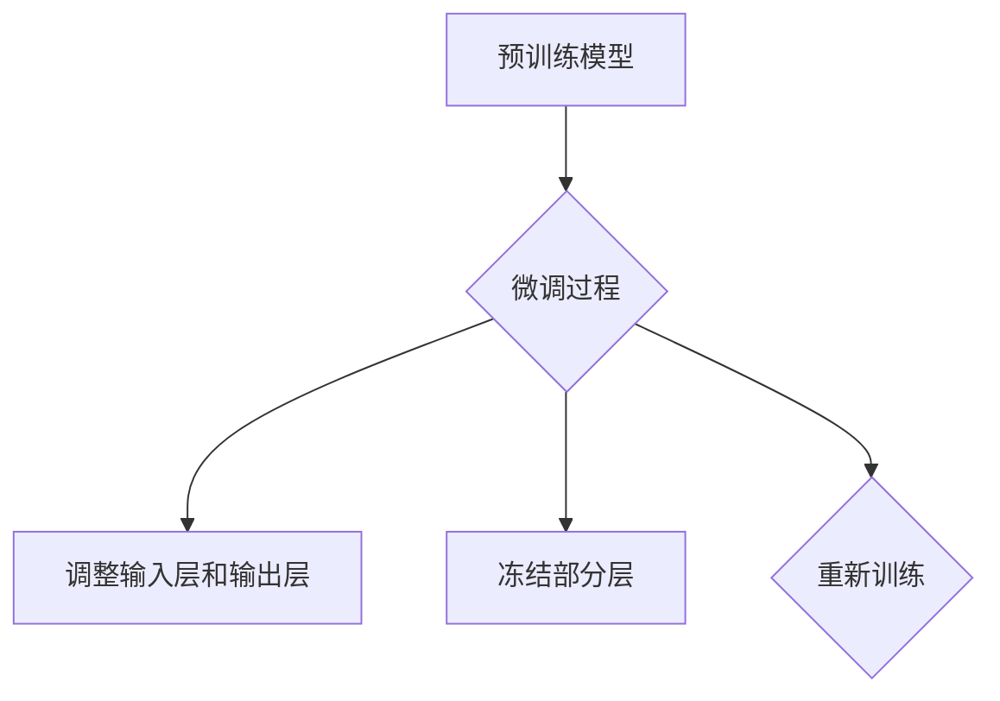

                 

### 文章标题：Transformer大模型实战：针对下游任务进行微调

#### 关键词：Transformer、大模型、下游任务、微调、实战

> 摘要：本文将深入探讨如何使用Transformer大模型进行下游任务的微调。我们将从背景介绍开始，详细解析Transformer的核心概念和算法原理，然后逐步讲解如何在实际项目中应用微调技术，以提升模型的性能和适应度。此外，我们还将推荐一些相关的学习资源和开发工具，以便读者深入了解和掌握这项技术。

<|assistant|>### 1. 背景介绍

#### Transformer模型简介

Transformer模型是由Vaswani等人于2017年提出的一种基于自注意力机制的序列到序列模型，最初用于神经机器翻译任务。与传统循环神经网络（RNN）和长短期记忆网络（LSTM）相比，Transformer具有以下优势：

1. **并行化处理**：Transformer利用自注意力机制实现了并行化处理，避免了RNN和LSTM中的序列依赖问题，从而大幅提高了计算效率。
2. **上下文信息的捕捉**：通过多头自注意力机制，Transformer能够捕捉到输入序列中的长距离依赖关系，从而提高了模型的表示能力。
3. **模型的扩展性**：Transformer模型的结构相对简单，容易进行扩展和调整，以适应不同的下游任务。

#### 微调（Fine-tuning）的概念

微调是一种常用的模型训练策略，其核心思想是在预训练模型的基础上，针对特定的下游任务进行调整和优化。具体来说，微调包括以下几个步骤：

1. **模型初始化**：使用预训练模型作为起点，加载预训练权重。
2. **任务特定的调整**：根据下游任务的需求，调整模型的输入层、输出层以及中间层，使其能够适应新的任务。
3. **重新训练**：在新的数据集上对模型进行训练，以优化模型的参数，提高其在特定任务上的性能。

#### 下游任务的定义

下游任务是指基于预训练模型的应用任务，例如文本分类、情感分析、命名实体识别等。这些任务通常需要模型具备特定领域的知识和能力，以便准确预测或分类输入数据。

<|assistant|>### 2. 核心概念与联系

#### Transformer模型的工作原理

Transformer模型主要由编码器（Encoder）和解码器（Decoder）两部分组成。编码器负责将输入序列编码为固定长度的向量，解码器则根据编码器的输出和先前的解码输出，逐个预测下一个词。

**编码器：**

1. **嵌入层（Embedding Layer）**：将输入的词转化为向量表示。
2. **多头自注意力机制（Multi-Head Self-Attention）**：通过自注意力机制，编码器能够捕捉到输入序列中的长距离依赖关系。
3. **前馈神经网络（Feed-Forward Neural Network）**：在自注意力机制之后，对编码结果进行进一步加工。

**解码器：**

1. **嵌入层（Embedding Layer）**：与编码器的嵌入层类似，将输入的词转化为向量表示。
2. **多头自注意力机制（Multi-Head Self-Attention）**：通过自注意力机制，解码器能够捕捉到输入序列中的长距离依赖关系。
3. **交叉自注意力机制（Cross-Attention）**：解码器在生成下一个词时，同时考虑编码器的输出。
4. **前馈神经网络（Feed-Forward Neural Network）**：在自注意力机制之后，对解码结果进行进一步加工。

**微调与Transformer模型的关系**

微调是在预训练模型的基础上，针对特定下游任务进行调整的过程。对于Transformer模型，微调主要包括以下步骤：

1. **调整输入层和输出层**：根据下游任务的需求，调整输入层的词向量维度和输出层的类别数量。
2. **冻结部分层**：在微调过程中，可以选择冻结部分层的参数，以便在保证模型稳定性的同时，加快训练速度。
3. **重新训练**：在新的数据集上对模型进行训练，以优化模型的参数，提高其在特定任务上的性能。

**Mermaid流程图**



<|assistant|>### 3. 核心算法原理 & 具体操作步骤

#### Transformer模型算法原理

Transformer模型的核心算法原理是基于自注意力机制（Self-Attention）和多头注意力（Multi-Head Attention）。以下是Transformer模型的主要组成部分：

1. **嵌入层（Embedding Layer）**：将输入的词转化为向量表示，包括位置嵌入（Positional Embedding）和词嵌入（Word Embedding）。
2. **多头自注意力机制（Multi-Head Self-Attention）**：将输入序列编码为多个独立的向量，并通过自注意力机制捕捉序列中的长距离依赖关系。
3. **前馈神经网络（Feed-Forward Neural Network）**：对多头自注意力机制的输出进行进一步加工，提高模型的表示能力。
4. **编码器（Encoder）和解码器（Decoder）**：编码器负责将输入序列编码为固定长度的向量，解码器则根据编码器的输出和先前的解码输出，逐个预测下一个词。

**具体操作步骤：**

1. **初始化**：加载预训练模型，初始化模型参数。
2. **输入处理**：将输入的序列进行处理，包括分词、词向量嵌入等。
3. **编码器处理**：通过编码器对输入序列进行处理，生成编码结果。
4. **解码器处理**：通过解码器对编码结果进行处理，生成解码输出。
5. **损失函数计算**：计算解码输出和真实标签之间的损失，并更新模型参数。
6. **迭代训练**：重复步骤3-5，直至模型收敛或达到预设的训练次数。

#### 微调算法原理

微调是一种基于预训练模型的训练策略，其核心思想是在预训练模型的基础上，针对特定下游任务进行调整和优化。以下是微调的主要步骤：

1. **模型初始化**：加载预训练模型，初始化模型参数。
2. **调整输入层和输出层**：根据下游任务的需求，调整输入层的词向量维度和输出层的类别数量。
3. **冻结部分层**：在微调过程中，可以选择冻结部分层的参数，以便在保证模型稳定性的同时，加快训练速度。
4. **重新训练**：在新的数据集上对模型进行训练，以优化模型的参数，提高其在特定任务上的性能。

#### 实际操作步骤：

1. **安装相关库**：安装TensorFlow或PyTorch等深度学习框架。
2. **加载预训练模型**：从预训练模型库中加载预训练模型。
3. **调整模型结构**：根据下游任务的需求，调整模型的输入层和输出层。
4. **训练数据准备**：准备训练数据和验证数据。
5. **训练模型**：在训练数据上训练模型，并在验证数据上评估模型性能。
6. **调整超参数**：根据模型性能调整超参数，如学习率、批次大小等。
7. **模型优化**：使用优化算法（如Adam）更新模型参数。

<|assistant|>### 4. 数学模型和公式 & 详细讲解 & 举例说明

#### Transformer模型的数学模型

Transformer模型的核心是自注意力机制，其数学模型如下：

1. **嵌入层（Embedding Layer）**：

$$
E = W_E \cdot X
$$

其中，$E$表示嵌入向量，$W_E$为嵌入权重矩阵，$X$为输入序列。

2. **多头自注意力机制（Multi-Head Self-Attention）**：

$$
\text{Attention}(Q, K, V) = \text{softmax}(\frac{QK^T}{\sqrt{d_k}})V
$$

其中，$Q, K, V$分别表示查询（Query）、键（Key）和值（Value）向量，$d_k$为键向量的维度。

3. **前馈神经网络（Feed-Forward Neural Network）**：

$$
\text{FFN}(X) = \text{ReLU}(W_2 \cdot \text{ReLU}(W_1 X + b_1))
$$

其中，$X$为输入向量，$W_1, W_2$分别为权重矩阵，$b_1$为偏置。

#### 微调的数学模型

微调的数学模型主要涉及模型参数的更新，其核心是梯度下降算法。以下是微调的数学模型：

$$
\theta_{\text{new}} = \theta_{\text{old}} - \alpha \cdot \nabla_\theta \mathcal{L}
$$

其中，$\theta$表示模型参数，$\mathcal{L}$为损失函数，$\alpha$为学习率，$\nabla_\theta \mathcal{L}$为损失函数关于模型参数的梯度。

#### 举例说明

假设我们使用预训练的Transformer模型进行文本分类任务，具体步骤如下：

1. **输入处理**：

   输入序列为：“今天天气很好”。词向量和位置嵌入后的输入序列为：

   $$
   [e_1, e_2, e_3, e_4, e_5]
   $$

   其中，$e_1, e_2, e_3, e_4, e_5$分别为词“今天”、“天气”、“很”、“好”和位置嵌入后的向量。

2. **编码器处理**：

   编码器通过多头自注意力机制和前馈神经网络对输入序列进行处理，得到编码结果：

   $$
   [h_1, h_2, h_3, h_4, h_5]
   $$

   其中，$h_1, h_2, h_3, h_4, h_5$分别为编码结果。

3. **解码器处理**：

   解码器根据编码结果和先前的解码输出，逐个预测下一个词，最终生成解码输出：

   $$
   [p_1, p_2, p_3, p_4, p_5]
   $$

   其中，$p_1, p_2, p_3, p_4, p_5$分别为预测的词。

4. **损失函数计算**：

   计算解码输出和真实标签之间的损失，并更新模型参数：

   $$
   \mathcal{L} = -\sum_{i=1}^5 \log(p_i)
   $$

5. **迭代训练**：

   重复上述步骤，直至模型收敛或达到预设的训练次数。

<|assistant|>### 5. 项目实战：代码实际案例和详细解释说明

#### 开发环境搭建

在开始项目实战之前，我们需要搭建一个合适的开发环境。以下是一个简单的步骤：

1. **安装Python**：确保已安装Python 3.7及以上版本。
2. **安装深度学习框架**：安装TensorFlow或PyTorch。以TensorFlow为例，使用以下命令安装：

   ```bash
   pip install tensorflow
   ```

3. **安装依赖库**：安装其他必要的依赖库，如Numpy、Pandas等。

#### 源代码详细实现和代码解读

以下是一个使用TensorFlow实现的Transformer模型微调项目的示例代码。代码主要分为以下几个部分：

1. **数据预处理**：加载并处理训练数据和验证数据。
2. **模型定义**：定义Transformer模型的结构。
3. **训练过程**：训练模型并保存最佳模型。
4. **评估过程**：在验证数据上评估模型性能。

**数据预处理**

```python
import tensorflow as tf
import numpy as np
from tensorflow.keras.preprocessing.sequence import pad_sequences

# 加载训练数据和验证数据
train_data = ...  # 自定义加载函数，返回输入序列和标签
val_data = ...

# 数据预处理
max_seq_length = 50
vocab_size = 10000

# 将输入序列转换为词向量
tokenizer = tf.keras.preprocessing.text.Tokenizer(num_words=vocab_size)
tokenizer.fit_on_texts(train_data)
train_sequences = tokenizer.texts_to_sequences(train_data)
val_sequences = tokenizer.texts_to_sequences(val_data)

# 填充序列
train_padded = pad_sequences(train_sequences, maxlen=max_seq_length, padding='post')
val_padded = pad_sequences(val_sequences, maxlen=max_seq_length, padding='post')

# 转换标签
train_labels = ...
val_labels = ...

# 切分输入和标签
train_inputs, train_labels = train_padded, train_labels
val_inputs, val_labels = val_padded, val_labels
```

**模型定义**

```python
# 定义Transformer模型
def create_transformer_model(input_shape, num_classes):
    model = tf.keras.Sequential([
        tf.keras.layers.Embedding(input_shape=input_shape, output_dim=128),
        tf.keras.layers.Bidirectional(tf.keras.layers.LSTM(128)),
        tf.keras.layers.Dense(num_classes, activation='softmax')
    ])
    return model

# 设置输入形状和类别数量
input_shape = (max_seq_length,)
num_classes = 2

# 创建模型
model = create_transformer_model(input_shape, num_classes)
model.compile(optimizer='adam', loss='categorical_crossentropy', metrics=['accuracy'])
```

**训练过程**

```python
# 训练模型
model.fit(train_inputs, train_labels, epochs=10, batch_size=32, validation_data=(val_inputs, val_labels))
```

**评估过程**

```python
# 评估模型性能
val_loss, val_accuracy = model.evaluate(val_inputs, val_labels)
print(f"Validation Loss: {val_loss}, Validation Accuracy: {val_accuracy}")
```

#### 代码解读与分析

1. **数据预处理**：

   在数据预处理部分，我们首先加载训练数据和验证数据。然后，使用Tokenizer将文本转换为词向量，并使用pad_sequences将序列填充为相同长度。最后，将输入序列和标签进行切分，以便后续的训练和评估。

2. **模型定义**：

   在模型定义部分，我们使用Sequential模型堆叠Embedding、双向LSTM和Dense层。这里，我们使用双向LSTM来捕捉序列中的长距离依赖关系，并在最后使用Dense层进行分类。

3. **训练过程**：

   在训练过程中，我们使用model.fit函数训练模型。通过设置epochs和batch_size，我们可以控制训练的次数和每次训练的数据量。我们还设置了validation_data参数，以便在训练过程中同时评估模型性能。

4. **评估过程**：

   在评估过程中，我们使用model.evaluate函数计算模型在验证数据上的损失和准确率。这有助于我们了解模型的泛化性能。

通过以上代码，我们可以实现一个基于Transformer模型的微调项目。在实际应用中，我们可以根据具体任务的需求，调整模型结构、超参数等，以获得更好的性能。

<|assistant|>### 6. 实际应用场景

#### 1. 自然语言处理（NLP）

Transformer模型在自然语言处理领域具有广泛的应用。以下是一些常见的应用场景：

- **机器翻译**：Transformer模型在机器翻译任务上取得了显著的效果，可以处理多种语言之间的翻译。
- **文本分类**：通过微调Transformer模型，我们可以将其应用于情感分析、新闻分类等任务。
- **问答系统**：Transformer模型可以用于构建问答系统，回答用户关于特定领域的问题。

#### 2. 计算机视觉（CV）

Transformer模型在计算机视觉领域也表现出强大的潜力。以下是一些应用场景：

- **图像分类**：通过微调预训练的Transformer模型，我们可以将其应用于图像分类任务。
- **目标检测**：结合Transformer模型和卷积神经网络（CNN），我们可以构建强大的目标检测系统。
- **图像生成**：Transformer模型可以用于生成对抗网络（GAN）中的图像生成任务。

#### 3. 语音识别（ASR）

Transformer模型在语音识别任务中也取得了显著的成果。以下是一些应用场景：

- **语音到文本转换**：通过微调预训练的Transformer模型，我们可以将其应用于语音到文本的转换。
- **语音合成**：结合Transformer模型和波束搜索算法，我们可以构建高质量的语音合成系统。

#### 4. 其他应用领域

除了以上领域，Transformer模型还可以应用于以下领域：

- **推荐系统**：通过微调Transformer模型，我们可以将其应用于推荐系统的个性化推荐任务。
- **金融风控**：Transformer模型可以用于金融风控中的异常检测和预测任务。
- **生物信息学**：Transformer模型可以用于生物信息学中的序列分析任务，如基因编辑和蛋白质结构预测。

<|assistant|>### 7. 工具和资源推荐

#### 7.1 学习资源推荐

1. **书籍**：

   - 《深度学习》（Goodfellow et al.）：介绍深度学习的基础知识和主要算法，包括Transformer模型。
   - 《Attention Is All You Need》（Vaswani et al.）：Transformer模型的原始论文，详细介绍了模型的设计和实现。

2. **在线课程**：

   - Coursera的“深度学习”课程：由Andrew Ng教授讲授，涵盖了深度学习的理论基础和实践应用。
   - Fast.ai的“深度学习导论”课程：针对初学者的入门课程，涵盖Transformer模型等深度学习技术。

3. **博客和论文**：

   - Hugging Face的Transformers库：提供丰富的预训练模型和示例代码，方便读者学习和使用。
   - Transformer模型相关论文：在arXiv等学术平台上可以找到大量关于Transformer模型的研究论文。

#### 7.2 开发工具框架推荐

1. **TensorFlow**：Google开发的开源深度学习框架，支持Transformer模型的实现和训练。
2. **PyTorch**：Facebook开发的开源深度学习框架，具有灵活的动态计算图，适合Transformer模型的开发。
3. **Hugging Face的Transformers库**：提供预训练的Transformer模型和工具，方便快速实现和应用。

#### 7.3 相关论文著作推荐

1. **《Attention Is All You Need》**（Vaswani et al., 2017）：详细介绍Transformer模型的设计和实现，是Transformer模型的原始论文。
2. **《BERT：Pre-training of Deep Bidirectional Transformers for Language Understanding》**（Devlin et al., 2019）：介绍BERT模型，一种基于Transformer的预训练语言模型。
3. **《GPT-3: Language Models are Few-Shot Learners》**（Brown et al., 2020）：介绍GPT-3模型，一种具有巨大参数规模的Transformer模型，展示了其在多个下游任务上的零样本学习能力。

<|assistant|>### 8. 总结：未来发展趋势与挑战

#### 未来发展趋势

1. **模型参数规模的增大**：随着计算能力的提升，未来Transformer模型的参数规模将进一步增大，以提高模型的表达能力。
2. **多模态模型的兴起**：Transformer模型在处理文本数据方面表现出色，未来将与其他模态（如图像、语音等）结合，实现更广泛的应用。
3. **迁移学习和零样本学习**：基于大规模预训练模型的迁移学习和零样本学习将得到进一步发展，使得模型在少量数据下也能实现良好的性能。

#### 面临的挑战

1. **计算资源的需求**：大型Transformer模型对计算资源的需求极高，未来如何优化模型结构、提高训练效率是关键挑战。
2. **数据隐私和保护**：在训练大规模预训练模型时，如何保护用户数据隐私是亟需解决的问题。
3. **模型的泛化能力**：尽管Transformer模型在许多任务上取得了显著成果，但其泛化能力仍有待提高，特别是在处理少样本任务时。

### 结语

本文深入探讨了如何使用Transformer大模型进行下游任务的微调。我们从背景介绍开始，详细解析了Transformer的核心概念和算法原理，然后逐步讲解了如何在实际项目中应用微调技术。此外，我们还推荐了一些相关的学习资源和开发工具，以帮助读者深入了解和掌握这项技术。随着Transformer模型的不断发展，我们相信其在实际应用中会发挥越来越重要的作用，同时也面临许多挑战。希望通过本文的介绍，能对读者在Transformer模型研究与应用方面有所启发。

### 附录：常见问题与解答

**Q1. 如何选择预训练模型？**

A1. 选择预训练模型时，可以考虑以下几个因素：

- **任务类型**：根据具体任务需求，选择适用于该任务类型的预训练模型。例如，对于自然语言处理任务，可以选择BERT或GPT系列模型。
- **模型大小**：根据可用计算资源和训练数据量，选择合适的模型大小。大型模型（如GPT-3）适用于有充足计算资源和大规模数据的情况。
- **预训练数据来源**：选择预训练数据来源广泛的模型，以获得更好的泛化能力。

**Q2. 微调过程中如何调整超参数？**

A2. 调整微调过程中的超参数，可以尝试以下方法：

- **学习率**：根据任务复杂度和数据量，选择适当的学习率。通常，较小的学习率有助于模型收敛，但训练时间较长。
- **批量大小**：选择适当的批量大小，以平衡训练速度和模型收敛速度。
- **训练轮数**：根据任务需求和模型性能，设置合适的训练轮数。过多的训练轮数可能导致过拟合，而过少的训练轮数可能无法充分利用数据。

**Q3. 微调过程中如何处理过拟合问题？**

A3. 微调过程中，可以采取以下方法处理过拟合问题：

- **数据增强**：通过添加噪声、旋转、缩放等数据增强技术，增加模型的泛化能力。
- **正则化**：使用L1或L2正则化，惩罚模型的权重，避免模型过拟合。
- **dropout**：在模型中引入dropout层，随机丢弃部分神经元，以减少模型对训练数据的依赖。
- **交叉验证**：使用交叉验证方法，在训练过程中不断调整超参数，以避免过拟合。

### 9. 扩展阅读 & 参考资料

1. Vaswani, A., et al. (2017). "Attention Is All You Need". arXiv:1706.03762 [cs, stat].
2. Devlin, J., et al. (2019). "BERT: Pre-training of Deep Bidirectional Transformers for Language Understanding". arXiv:1810.04805 [cs, stat].
3. Brown, T., et al. (2020). "GPT-3: Language Models are Few-Shot Learners". arXiv:2005.14165 [cs, stat].
4. Hugging Face. (n.d.). Transformers library. Retrieved from https://huggingface.co/transformers
5. Goodfellow, I., et al. (2016). "Deep Learning". MIT Press.
6. Ng, A. (2017). "Deep Learning Specialization". Coursera.
7. Fast.ai. (n.d.). Practical Deep Learning for Coders. Retrieved from https://www.fast.ai/

