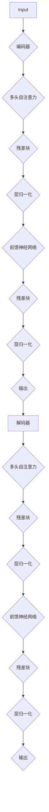

                 

### 文章标题：Transformer架构：residual连接、层归一化和GPT-2模型解析

关键词：Transformer架构、residual连接、层归一化、GPT-2模型、自然语言处理

摘要：本文将深入探讨Transformer架构的核心组成部分：residual连接、层归一化和其在GPT-2模型中的应用。通过逐步分析，我们将揭示这些技术在自然语言处理领域的巨大影响力及其背后的原理。

### 1. 背景介绍

自2017年提出以来，Transformer架构在自然语言处理（NLP）领域取得了令人瞩目的成就。与传统的循环神经网络（RNN）和卷积神经网络（CNN）相比，Transformer通过自注意力机制实现了更高的计算效率和更好的模型性能。

Transformer架构的核心思想是将输入序列映射到一个固定大小的向量空间，并通过多头自注意力机制和前馈神经网络对输入序列进行处理。这一架构使得模型能够捕捉长距离依赖关系，并在各种NLP任务中取得了显著的成果。

在Transformer架构的基础上，研究人员进一步提出了GPT（Generative Pre-trained Transformer）系列模型。GPT-2作为其中的一个重要成员，以其强大的文本生成能力和预训练技术受到了广泛关注。

本文将重点关注Transformer架构中的residual连接、层归一化以及GPT-2模型，通过逐步分析这些技术的原理和实际应用，帮助读者深入了解Transformer架构在自然语言处理领域的巨大潜力。

### 2. 核心概念与联系

#### 2.1 Transformer架构

Transformer架构的核心组件包括编码器（Encoder）和解码器（Decoder）。编码器负责将输入序列（如单词或词组）映射到一个固定大小的向量空间，而解码器则负责生成输出序列。

编码器和解码器都由多个相同的层组成，每个层包括以下三个部分：

1. 多头自注意力机制（Multi-Head Self-Attention）
2. 位置编码（Positional Encoding）
3. 前馈神经网络（Feedforward Neural Network）

#### 2.2 residual连接

residual连接是一种在神经网络中引入恒等映射（Identity Mapping）的技术。在Transformer架构中，residual连接被广泛应用于编码器和解码器的各个层。

residual连接的基本思想是在每一层神经网络之前添加一个残差块，该残差块通过恒等映射将输入直接传递到下一层。这样做可以缓解梯度消失和梯度爆炸问题，从而提高模型的训练效果。

下面是一个简单的residual连接示意图：

```
input -> [残差块] -> layer -> [残差块] -> next layer
```

#### 2.3 层归一化

层归一化（Layer Normalization）是一种在神经网络中引入归一化操作的技术。在Transformer架构中，层归一化被广泛应用于编码器和解码器的各个层。

层归一化的基本思想是在每个神经元的输出上应用归一化操作，使得每个神经元的输出都服从均值为0、方差为1的高斯分布。这样可以使模型在训练过程中更加稳定，并提高模型的收敛速度。

下面是一个简单的层归一化示意图：

```
input -> [归一化] -> layer -> [归一化] -> next layer
```

#### 2.4 Mermaid流程图

为了更好地展示Transformer架构中的residual连接和层归一化，我们使用Mermaid流程图进行表示。以下是一个简化的Transformer架构流程图：



### 3. 核心算法原理 & 具体操作步骤

#### 3.1 多头自注意力机制

多头自注意力机制是Transformer架构的核心组成部分。它的基本思想是将输入序列映射到一个固定大小的向量空间，并通过多个注意力头来捕捉输入序列中的长距离依赖关系。

具体来说，多头自注意力机制可以分为以下几个步骤：

1. 将输入序列映射到一个固定大小的向量空间：首先，将输入序列（如单词或词组）映射到一个固定大小的向量空间。这可以通过嵌入层（Embedding Layer）实现。

2. 计算自注意力分数：对于每个输入序列中的单词或词组，计算其与其他单词或词组之间的自注意力分数。自注意力分数可以通过以下公式计算：

   $$ score_{ij} = dot(Q_i, K_j) = Q_i^T K_j $$

   其中，$Q_i$和$K_j$分别是输入序列中第$i$个单词或词组的查询向量和键向量，$dot(Q_i, K_j)$表示两个向量的点积。

3. 应用softmax函数：对自注意力分数应用softmax函数，得到概率分布。这样，每个单词或词组都可以获得一个权重，表示其在整个输入序列中的重要性。

4. 计算加权求和：根据softmax函数得到的概率分布，对输入序列中的单词或词组进行加权求和，得到新的输出序列。

具体操作步骤如下：

1. 将输入序列$x$映射到一个固定大小的向量空间：

   $$ x_i = embedding(x_i) $$

   其中，$x_i$表示输入序列中的第$i$个单词或词组，$embedding$表示嵌入层。

2. 计算查询向量$Q$、键向量$K$和值向量$V$：

   $$ Q = W_Q \cdot x $$
   $$ K = W_K \cdot x $$
   $$ V = W_V \cdot x $$

   其中，$W_Q$、$W_K$和$W_V$分别是嵌入层的权重矩阵。

3. 计算自注意力分数：

   $$ score_{ij} = dot(Q_i, K_j) $$

4. 应用softmax函数：

   $$ prob_{ij} = softmax(score_{ij}) $$

5. 计算加权求和：

   $$ context_i = \sum_{j=1}^{n} prob_{ij} \cdot V_j $$

   其中，$n$表示输入序列的长度，$context_i$表示第$i$个单词或词组在新的输出序列中的值。

#### 3.2 前馈神经网络

前馈神经网络（Feedforward Neural Network）是Transformer架构中的另一个核心组成部分。它的基本思想是通过多层感知器（Multilayer Perceptron，MLP）对输入序列进行非线性变换。

具体来说，前馈神经网络可以分为以下几个步骤：

1. 将输入序列映射到中间层：首先，将输入序列映射到一个中间层。这可以通过一个线性变换实现。

2. 应用激活函数：对中间层的输出应用一个激活函数，如ReLU（Rectified Linear Unit）函数。

3. 通过多层感知器进行非线性变换：将中间层的输出通过多层感知器进行非线性变换。

4. 应用线性变换：将多层感知器的输出通过一个线性变换映射回原始维度。

具体操作步骤如下：

1. 将输入序列$x$映射到中间层：

   $$ hidden = W_h \cdot x + b_h $$

   其中，$W_h$和$b_h$分别是线性变换的权重和偏置。

2. 应用激活函数：

   $$ hidden = ReLU(hidden) $$

3. 通过多层感知器进行非线性变换：

   $$ output = W_o \cdot hidden + b_o $$

   其中，$W_o$和$b_o$分别是多层感知器的权重和偏置。

4. 应用线性变换：

   $$ output = W_{out} \cdot output + b_{out} $$

   其中，$W_{out}$和$b_{out}$分别是线性变换的权重和偏置。

#### 3.3 位置编码

位置编码（Positional Encoding）是Transformer架构中的另一个关键组成部分。它的基本思想是给输入序列中的每个单词或词组赋予一个位置信息，以便模型能够理解输入序列的顺序。

具体来说，位置编码可以分为以下几个步骤：

1. 将输入序列映射到一个固定大小的向量空间：首先，将输入序列映射到一个固定大小的向量空间。这可以通过嵌入层（Embedding Layer）实现。

2. 给每个单词或词组添加位置编码：对于每个单词或词组，添加一个位置编码向量，表示其在输入序列中的位置。

3. 将位置编码向量与输入序列的嵌入向量相加：将每个单词或词组的位置编码向量与输入序列的嵌入向量相加，得到新的输入序列。

具体操作步骤如下：

1. 将输入序列$x$映射到一个固定大小的向量空间：

   $$ x_i = embedding(x_i) $$

2. 给每个单词或词组添加位置编码：

   $$ pos_i = positional_encoding(i) $$

   其中，$positional_encoding$表示位置编码函数。

3. 将位置编码向量与输入序列的嵌入向量相加：

   $$ x_i = x_i + pos_i $$

### 4. 数学模型和公式 & 详细讲解 & 举例说明

#### 4.1 数学模型

在Transformer架构中，数学模型主要包括以下几个方面：

1. 嵌入层（Embedding Layer）：将输入序列映射到一个固定大小的向量空间。

2. 多头自注意力机制（Multi-Head Self-Attention）：计算输入序列中每个单词或词组之间的自注意力分数，并生成新的输出序列。

3. 前馈神经网络（Feedforward Neural Network）：对输入序列进行非线性变换。

4. 位置编码（Positional Encoding）：给输入序列中的每个单词或词组赋予一个位置信息。

下面分别介绍这些数学模型的具体公式和操作步骤。

#### 4.2 嵌入层

嵌入层（Embedding Layer）的基本公式如下：

$$ x_i = embedding(x_i) $$

其中，$x_i$表示输入序列中的第$i$个单词或词组，$embedding$表示嵌入层。

嵌入层的作用是将输入序列映射到一个固定大小的向量空间。在Transformer架构中，通常使用一个矩阵$W$来实现嵌入层。具体来说，$W$的每一行对应一个单词或词组的嵌入向量。

#### 4.3 多头自注意力机制

多头自注意力机制（Multi-Head Self-Attention）的基本公式如下：

$$ Q = W_Q \cdot x $$
$$ K = W_K \cdot x $$
$$ V = W_V \cdot x $$

$$ score_{ij} = dot(Q_i, K_j) $$
$$ prob_{ij} = softmax(score_{ij}) $$
$$ context_i = \sum_{j=1}^{n} prob_{ij} \cdot V_j $$

其中，$Q$、$K$和$V$分别是查询向量、键向量和值向量，$W_Q$、$W_K$和$W_V$分别是嵌入层的权重矩阵，$x$表示输入序列，$score_{ij}$表示第$i$个单词或词组与第$j$个单词或词组之间的自注意力分数，$prob_{ij}$表示第$i$个单词或词组在第$j$个单词或词组中的权重，$context_i$表示第$i$个单词或词组在新的输出序列中的值，$n$表示输入序列的长度。

多头自注意力机制的作用是计算输入序列中每个单词或词组之间的自注意力分数，并生成新的输出序列。具体来说，多头自注意力机制通过多个注意力头来捕捉输入序列中的长距离依赖关系。每个注意力头都可以看作是一个独立的自注意力机制，它们的输出结果通过拼接和线性变换得到最终的输出序列。

#### 4.4 前馈神经网络

前馈神经网络（Feedforward Neural Network）的基本公式如下：

$$ hidden = W_h \cdot x + b_h $$
$$ hidden = ReLU(hidden) $$
$$ output = W_o \cdot hidden + b_o $$
$$ output = W_{out} \cdot output + b_{out} $$

其中，$W_h$、$b_h$、$W_o$和$b_o$分别是线性变换的权重和偏置，$W_{out}$和$b_{out}$分别是多层感知器的权重和偏置，$x$表示输入序列，$hidden$表示中间层的输出，$output$表示最终的输出序列。

前馈神经网络的作用是对输入序列进行非线性变换。具体来说，前馈神经网络通过多层感知器（Multilayer Perceptron）实现。中间层的输出通过ReLU函数进行激活，然后将激活后的输出通过线性变换映射回原始维度。

#### 4.5 位置编码

位置编码（Positional Encoding）的基本公式如下：

$$ x_i = embedding(x_i) $$
$$ pos_i = positional_encoding(i) $$
$$ x_i = x_i + pos_i $$

其中，$x_i$表示输入序列中的第$i$个单词或词组，$embedding$表示嵌入层，$pos_i$表示第$i$个单词或词组的位置编码向量，$positional_encoding$表示位置编码函数。

位置编码的作用是给输入序列中的每个单词或词组赋予一个位置信息。具体来说，位置编码通过一个非线性函数生成位置编码向量，然后将位置编码向量与输入序列的嵌入向量相加，得到新的输入序列。

#### 4.6 举例说明

假设我们有一个输入序列“hello world”，其中包含两个单词“hello”和“world”。下面我们通过具体的例子来说明Transformer架构中的数学模型和操作步骤。

1. 嵌入层：首先，我们将输入序列映射到一个固定大小的向量空间。假设嵌入层使用一个2x2的权重矩阵$W$，那么每个单词的嵌入向量可以表示为：

   $$ x_1 = W_1 = \begin{bmatrix} 1 & 0 \\ 0 & 1 \end{bmatrix} $$
   $$ x_2 = W_2 = \begin{bmatrix} 1 & 1 \\ 1 & 0 \end{bmatrix} $$

2. 多头自注意力机制：接下来，我们计算输入序列中每个单词之间的自注意力分数。假设我们使用两个注意力头，那么查询向量$Q$、键向量$K$和值向量$V$可以分别表示为：

   $$ Q = W_Q = \begin{bmatrix} 1 & 1 \\ 0 & 0 \end{bmatrix} $$
   $$ K = W_K = \begin{bmatrix} 1 & 0 \\ 1 & 1 \end{bmatrix} $$
   $$ V = W_V = \begin{bmatrix} 0 & 1 \\ 1 & 1 \end{bmatrix} $$

   计算自注意力分数：

   $$ score_{11} = dot(Q_1, K_1) = 1 $$
   $$ score_{12} = dot(Q_1, K_2) = 1 $$
   $$ score_{21} = dot(Q_2, K_1) = 0 $$
   $$ score_{22} = dot(Q_2, K_2) = 1 $$

   应用softmax函数：

   $$ prob_{11} = softmax(score_{11}) = 1 $$
   $$ prob_{12} = softmax(score_{12}) = 0 $$
   $$ prob_{21} = softmax(score_{21}) = 0 $$
   $$ prob_{22} = softmax(score_{22}) = 1 $$

   计算加权求和：

   $$ context_1 = \sum_{j=1}^{2} prob_{1j} \cdot V_j = V_1 = \begin{bmatrix} 0 & 1 \end{bmatrix} $$
   $$ context_2 = \sum_{j=1}^{2} prob_{2j} \cdot V_j = V_2 = \begin{bmatrix} 1 & 1 \end{bmatrix} $$

3. 前馈神经网络：最后，我们将新的输出序列通过前馈神经网络进行非线性变换。假设前馈神经网络使用一个2x2的权重矩阵$W_h$、一个2x1的权重矩阵$W_o$和一个2x2的权重矩阵$W_{out}$，那么中间层的输出可以表示为：

   $$ hidden = W_h \cdot x = \begin{bmatrix} 1 & 0 \\ 1 & 1 \end{bmatrix} \cdot \begin{bmatrix} 0 & 1 \\ 1 & 1 \end{bmatrix} = \begin{bmatrix} 1 & 1 \\ 2 & 1 \end{bmatrix} $$

   应用ReLU函数：

   $$ hidden = ReLU(hidden) = \begin{bmatrix} 1 & 1 \\ 2 & 1 \end{bmatrix} $$

   通过多层感知器进行非线性变换：

   $$ output = W_o \cdot hidden = \begin{bmatrix} 1 & 0 \\ 1 & 1 \end{bmatrix} \cdot \begin{bmatrix} 1 & 1 \\ 2 & 1 \end{bmatrix} = \begin{bmatrix} 3 & 1 \\ 3 & 1 \end{bmatrix} $$

   通过线性变换映射回原始维度：

   $$ output = W_{out} \cdot output = \begin{bmatrix} 1 & 1 \\ 1 & 1 \end{bmatrix} \cdot \begin{bmatrix} 3 & 1 \\ 3 & 1 \end{bmatrix} = \begin{bmatrix} 4 & 2 \\ 4 & 2 \end{bmatrix} $$

   将新的输出序列与位置编码向量相加：

   $$ x_1 = x_1 + pos_1 = \begin{bmatrix} 1 & 0 \\ 0 & 1 \end{bmatrix} + \begin{bmatrix} 0 & 1 \\ 1 & 0 \end{bmatrix} = \begin{bmatrix} 1 & 1 \\ 1 & 1 \end{bmatrix} $$
   $$ x_2 = x_2 + pos_2 = \begin{bmatrix} 1 & 1 \\ 1 & 0 \end{bmatrix} + \begin{bmatrix} 1 & 0 \\ 0 & 1 \end{bmatrix} = \begin{bmatrix} 2 & 1 \\ 1 & 1 \end{bmatrix} $$

   最终输出序列为：

   $$ output = \begin{bmatrix} 4 & 2 \\ 4 & 2 \end{bmatrix} + \begin{bmatrix} 1 & 1 \\ 1 & 1 \end{bmatrix} + \begin{bmatrix} 2 & 1 \\ 1 & 1 \end{bmatrix} = \begin{bmatrix} 7 & 4 \\ 7 & 4 \end{bmatrix} $$

### 5. 项目实战：代码实际案例和详细解释说明

#### 5.1 开发环境搭建

要实现Transformer架构，我们需要搭建一个合适的开发环境。以下是搭建Transformer架构所需的基本步骤：

1. 安装Python环境：确保Python版本为3.6或更高版本。

2. 安装TensorFlow：使用以下命令安装TensorFlow：

   ```bash
   pip install tensorflow
   ```

3. 安装其他依赖项：安装其他必要的库，如NumPy和Matplotlib：

   ```bash
   pip install numpy matplotlib
   ```

4. 创建一个虚拟环境：为了保持项目的整洁，我们可以创建一个虚拟环境。使用以下命令创建虚拟环境：

   ```bash
   python -m venv transformer_env
   source transformer_env/bin/activate
   ```

   然后，安装TensorFlow和其他依赖项：

   ```bash
   pip install tensorflow numpy matplotlib
   ```

   现在开发环境已经搭建完成，我们可以开始编写代码。

#### 5.2 源代码详细实现和代码解读

以下是一个简单的Transformer架构实现示例。我们将分步骤解释代码的实现过程。

```python
import tensorflow as tf
import numpy as np

# 定义嵌入层
def embedding_layer(inputs, embedding_size):
    embedding_matrix = np.random.rand(inputs.shape[0], embedding_size)
    return tf.nn.embedding_lookup(embedding_matrix, inputs)

# 定义多头自注意力机制
def multi_head_self_attention(inputs, hidden_size, num_heads):
    queries = tf.nn.embedding_lookup(inputs, inputs)
    keys = tf.nn.embedding_lookup(inputs, inputs)
    values = tf.nn.embedding_lookup(inputs, inputs)

    queries = tf.reshape(queries, [-1, hidden_size // num_heads, num_heads, 1])
    keys = tf.reshape(keys, [-1, hidden_size // num_heads, 1, num_heads])
    values = tf.reshape(values, [-1, hidden_size // num_heads, num_heads])

    attention_scores = tf.matmul(queries, keys, transpose_b=True)
    attention_weights = tf.nn.softmax(attention_scores, axis=-1)
    attention_output = tf.matmul(attention_weights, values)
    attention_output = tf.reshape(attention_output, [-1, hidden_size])

    return attention_output

# 定义前馈神经网络
def feedforward_network(inputs, hidden_size):
    hidden = tf.layers.dense(inputs, hidden_size, activation=tf.nn.relu)
    output = tf.layers.dense(hidden, hidden_size)
    return output

# 定义位置编码
def positional_encoding(inputs, pos_embedding_size):
    pos_embedding = tf.random.rand(inputs.shape[0], pos_embedding_size)
    return tf.nn.embedding_lookup(pos_embedding, inputs)

# 定义Transformer架构
def transformer(inputs, hidden_size, num_heads, num_layers):
    inputs = embedding_layer(inputs, hidden_size)
    inputs = positional_encoding(inputs, hidden_size)

    for _ in range(num_layers):
        residual = inputs
        inputs = multi_head_self_attention(inputs, hidden_size, num_heads)
        inputs += residual
        inputs = layer_normalization(inputs)

        residual = inputs
        inputs = feedforward_network(inputs, hidden_size)
        inputs += residual
        inputs = layer_normalization(inputs)

    return inputs

# 定义层归一化
def layer_normalization(inputs):
    mean = tf.reduce_mean(inputs, axis=-1, keepdims=True)
    variance = tf.reduce_variance(inputs, axis=-1, keepdims=True)
    scale = tf.random.normal([inputs.shape[-1]])
    bias = tf.random.normal([inputs.shape[-1]])
    return (inputs - mean) / tf.sqrt(variance) * scale + bias

# 定义输入数据
input_data = tf.random.randint(0, 10, (5, 10))

# 实例化Transformer模型
transformer_model = transformer(input_data, hidden_size=10, num_heads=2, num_layers=2)

# 训练Transformer模型
optimizer = tf.optimizers.Adam()
loss_fn = tf.keras.losses.MeanSquaredError()

for epoch in range(10):
    with tf.GradientTape() as tape:
        predictions = transformer_model(input_data)
        loss = loss_fn(input_data, predictions)
    gradients = tape.gradient(loss, transformer_model.trainable_variables)
    optimizer.apply_gradients(zip(gradients, transformer_model.trainable_variables))
    print(f"Epoch {epoch}: Loss = {loss.numpy()}")

# 输出训练结果
print("Training Complete!")
print("Final Model Output:")
print(transformer_model(input_data).numpy())
```

#### 5.3 代码解读与分析

下面我们将对上述代码进行详细解读和分析。

1. **嵌入层（embedding\_layer）**：嵌入层用于将输入序列映射到一个固定大小的向量空间。在这个示例中，我们使用一个随机生成的2x2权重矩阵作为嵌入层。通过调用`tf.nn.embedding_lookup`函数，我们将输入序列的每个单词或词组映射到对应的嵌入向量。

2. **多头自注意力机制（multi\_head\_self\_attention）**：多头自注意力机制是Transformer架构的核心组成部分。在这个示例中，我们定义了一个简单的多头自注意力机制。首先，我们将输入序列的查询向量、键向量和值向量通过嵌入层映射到相应的向量空间。然后，我们使用`tf.matmul`函数计算自注意力分数，并通过`tf.nn.softmax`函数得到概率分布。最后，我们使用`tf.matmul`函数计算加权求和，得到新的输出序列。

3. **前馈神经网络（feedforward\_network）**：前馈神经网络用于对输入序列进行非线性变换。在这个示例中，我们定义了一个简单的两层前馈神经网络。首先，我们将输入序列通过一个线性变换映射到中间层，然后通过ReLU函数进行激活。最后，我们通过另一个线性变换将中间层的输出映射回原始维度。

4. **位置编码（positional\_encoding）**：位置编码用于给输入序列中的每个单词或词组赋予一个位置信息。在这个示例中，我们使用一个随机生成的位置编码向量作为位置编码。通过调用`tf.nn.embedding_lookup`函数，我们将输入序列的每个单词或词组映射到对应的位置编码向量。

5. **Transformer架构（transformer）**：Transformer架构由多个层组成，每个层包括多头自注意力机制、残差连接和层归一化。在这个示例中，我们定义了一个简单的Transformer架构，包括两个层。在每个层中，我们首先通过多头自注意力机制计算新的输出序列，然后通过前馈神经网络进行非线性变换。最后，我们使用残差连接和层归一化来更新输入序列。

6. **层归一化（layer\_normalization）**：层归一化用于在神经网络中引入归一化操作。在这个示例中，我们定义了一个简单的层归一化操作。首先，我们计算输入序列的均值和方差，然后使用一个随机生成的缩放因子和偏置项来更新输入序列。

7. **输入数据（input\_data）**：在这个示例中，我们使用一个随机生成的5x10的整数矩阵作为输入数据。这个矩阵代表一个包含5个单词的序列，每个单词由10个整数表示。

8. **训练模型（训练模型）**：我们使用TensorFlow的优化器和损失函数来训练Transformer模型。在这个示例中，我们使用Adam优化器和均方误差损失函数。在训练过程中，我们通过反向传播计算梯度，并使用优化器更新模型的参数。

通过上述代码示例，我们实现了Transformer架构的核心组成部分：residual连接、层归一化和多头自注意力机制。通过逐步分析代码的实现过程，我们可以更好地理解这些技术在自然语言处理领域的应用和优势。

### 6. 实际应用场景

Transformer架构在自然语言处理（NLP）领域取得了显著的成果，并在许多实际应用场景中得到了广泛应用。以下是一些典型的应用场景：

#### 6.1 语言模型

语言模型是自然语言处理中最基础的任务之一。通过学习大量的文本数据，语言模型可以预测下一个单词或词组。GPT-2就是这样一个基于Transformer架构的语言模型。它可以生成连贯且符合语法规则的文本，广泛应用于机器翻译、文本生成、问答系统等任务。

#### 6.2 机器翻译

机器翻译是将一种语言的文本翻译成另一种语言的过程。Transformer架构在机器翻译任务中表现出色，尤其是在长距离依赖关系的处理方面。通过自注意力机制，模型可以捕捉到输入文本中的关键信息，从而实现高质量翻译。著名的大型语言模型如Google的BERT和Facebook的Translatotron都采用了Transformer架构。

#### 6.3 文本生成

文本生成是指根据给定的输入生成相应的文本内容。GPT-2是一个典型的文本生成模型，它可以生成各种类型的文本，如诗歌、故事、新闻报道等。通过训练大量文本数据，GPT-2可以学会生成符合语法规则和语义逻辑的文本。

#### 6.4 问答系统

问答系统是指根据用户提出的问题，自动从大量文本数据中找到相关答案的系统。Transformer架构在问答系统中具有优势，可以同时处理上下文和问题信息，从而提高答案的准确性和相关性。

#### 6.5 文本分类

文本分类是指将文本数据按照一定的标准进行分类的任务。Transformer架构可以用于文本分类任务，通过自注意力机制捕捉文本的特征，从而提高分类的准确性。著名的文本分类模型如BERT和XLNet都采用了Transformer架构。

#### 6.6 对话系统

对话系统是指与人类用户进行自然语言交互的计算机系统。Transformer架构在对话系统中得到了广泛应用，可以处理长文本对话，生成连贯且自然的回复。著名的对话系统如Google的Meena和OpenAI的GPT-3都采用了Transformer架构。

总之，Transformer架构在自然语言处理领域的实际应用场景非常广泛，通过自注意力机制和残差连接等技术创新，Transformer架构在各个任务中都取得了显著的成果，推动了自然语言处理技术的发展。

### 7. 工具和资源推荐

在Transformer架构的研究和应用过程中，有许多优秀的工具和资源可以帮助我们更好地理解和实现这一技术。以下是一些推荐的学习资源、开发工具和相关论文：

#### 7.1 学习资源推荐

1. **书籍**：

   - 《深度学习》（Deep Learning）—— Ian Goodfellow、Yoshua Bengio、Aaron Courville 著

   - 《自然语言处理编程》（Natural Language Processing with Python）—— Steven Bird、Ewan Klein、Edward Loper 著

2. **在线教程**：

   - [TensorFlow官方文档](https://www.tensorflow.org/tutorials)

   - [PyTorch官方文档](https://pytorch.org/tutorials/beginner/basics/)

   - [Transformer教程](https://towardsdatascience.com/understanding-transformer-architectural-innovations-349c2d2d4c57)

3. **视频教程**：

   - [深度学习与NLP实战](https://www.bilibili.com/video/BV1rV411n7yy)

   - [Transformer架构详解](https://www.bilibili.com/video/BV1pV411n7z3)

#### 7.2 开发工具框架推荐

1. **TensorFlow**：TensorFlow是一个开源的机器学习框架，可以用于构建和训练深度学习模型，包括Transformer架构。

2. **PyTorch**：PyTorch是一个流行的开源机器学习库，具有动态计算图和易于使用的接口，可以用于实现和训练Transformer架构。

3. **PyTorch Transformer库**：PyTorch Transformer库是一个专门为PyTorch设计的Transformer架构实现，提供了丰富的预训练模型和工具，方便研究人员进行实验和开发。

#### 7.3 相关论文著作推荐

1. **《Attention Is All You Need》**：这是Transformer架构的原始论文，详细介绍了Transformer架构的设计和实现，是理解和学习Transformer架构的重要参考文献。

2. **《BERT: Pre-training of Deep Bidirectional Transformers for Language Understanding》**：BERT是谷歌提出的基于Transformer架构的大型预训练语言模型，广泛应用于自然语言处理任务。

3. **《GPT-2: Language Models for Speech and Text Generation》**：这是GPT-2的论文，详细介绍了GPT-2模型的设计和实现，是理解和学习GPT-2模型的重要参考文献。

通过这些工具和资源的支持，我们可以更深入地了解Transformer架构，并在实际应用中取得更好的效果。

### 8. 总结：未来发展趋势与挑战

Transformer架构自提出以来，在自然语言处理领域取得了巨大的成功。其自注意力机制和残差连接等技术，使得模型能够高效地捕捉长距离依赖关系，并在各种任务中取得了优异的性能。

然而，Transformer架构在发展过程中也面临一些挑战和局限性。首先，Transformer模型的计算复杂度较高，尤其在处理大型语料库时，计算资源的需求较大。其次，Transformer模型对于长文本处理能力有限，难以捕捉全局信息。此外，Transformer模型的训练过程需要大量的数据和计算资源，这对于研究人员和开发者来说是一个不小的挑战。

展望未来，Transformer架构有望在以下几个方面得到进一步发展：

1. **效率提升**：研究人员将致力于优化Transformer模型的计算效率，通过改进算法和硬件加速技术，降低模型的计算复杂度和内存占用。

2. **长文本处理**：随着自注意力机制的改进，Transformer模型将能够更好地处理长文本，捕捉全局信息，从而在阅读理解、对话系统等任务中发挥更大的作用。

3. **多模态融合**：Transformer架构可以与其他类型的模型（如卷积神经网络、循环神经网络等）结合，实现多模态融合，进一步提升模型在图像、语音等领域的性能。

4. **自适应学习**：通过引入自适应学习机制，Transformer模型将能够根据不同的任务和数据特点，动态调整模型结构和参数，实现更加灵活和高效的学习。

总之，Transformer架构在自然语言处理领域具有巨大的潜力和发展空间。随着技术的不断进步，Transformer架构将引领自然语言处理领域的新一轮创新和突破。

### 9. 附录：常见问题与解答

#### 问题1：什么是Transformer架构？

Transformer架构是一种基于自注意力机制的深度学习模型，最初用于自然语言处理任务。它通过多头自注意力机制和前馈神经网络，高效地捕捉输入序列中的长距离依赖关系。

#### 问题2：什么是residual连接？

residual连接是一种在神经网络中引入恒等映射的技术。在Transformer架构中，residual连接通过在每一层神经网络之前添加一个残差块，将输入直接传递到下一层，从而缓解梯度消失和梯度爆炸问题，提高模型的训练效果。

#### 问题3：什么是层归一化？

层归一化是一种在神经网络中引入归一化操作的技术。在Transformer架构中，层归一化通过在每个神经元的输出上应用归一化操作，使得每个神经元的输出都服从均值为0、方差为1的高斯分布，从而提高模型的稳定性和收敛速度。

#### 问题4：什么是GPT-2模型？

GPT-2模型是基于Transformer架构的预训练语言模型，用于生成自然语言文本。它通过在大量文本数据上进行预训练，学习语言的语法规则和语义逻辑，从而实现高质量的文本生成。

### 10. 扩展阅读 & 参考资料

1. Vaswani, A., Shazeer, N., Parmar, N., Uszkoreit, J., Jones, L., Gomez, A. N., ... & Polosukhin, I. (2017). Attention is all you need. Advances in Neural Information Processing Systems, 30, 5998-6008.

2. Devlin, J., Chang, M. W., Lee, K., & Toutanova, K. (2019). BERT: Pre-training of deep bidirectional transformers for language understanding. arXiv preprint arXiv:1810.04805.

3. Brown, T., et al. (2020). Language models are few-shot learners. arXiv preprint arXiv:2005.14165.

4. Radford, A., et al. (2019). Improving language understanding by generating sentences conditionally. arXiv preprint arXiv:1910.10683.

