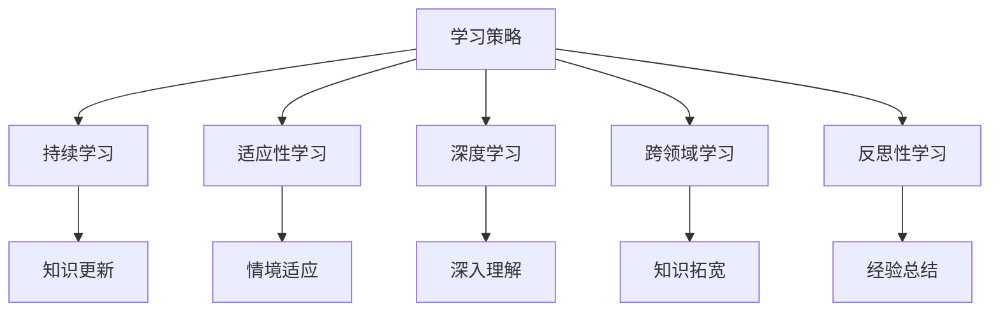

                 

### 背景介绍

**VUCA时代的定义与特点**

在当今快速变化的世界中，"VUCA"（Volatility、Uncertainty、Complexity、Ambiguity）这个词汇被频繁提及。VUCA时代，即一个充满易变性（Volatility）、不确定性（Uncertainty）、复杂性和模糊性的时代，代表了现代社会的一个基本特征。

- **易变性（Volatility）**：指的是事物状态的不稳定，变化迅速且不可预测。在技术领域，这种易变性体现在技术的快速迭代与更新上，比如人工智能、云计算和区块链等新兴技术的发展速度极快，使得原有的技术和知识体系不断被颠覆。

- **不确定性（Uncertainty）**：指的是未来无法预知或预测的情况。在商业环境中，这种不确定性可能导致企业面临巨大的风险，特别是在市场策略、投资决策和产品开发等方面。

- **复杂性（Complexity）**：指的是事物的多样性和关联性。现代社会的复杂性体现在系统之间的相互依赖性和问题的多层次性，解决复杂问题需要跨领域的协作和多角度的思考。

- **模糊性（Ambiguity）**：指的是信息的不足和模糊性。在信息时代，信息的多样性和不确定性导致人们难以准确理解和判断事物的真实情况。

**学习策略在VUCA时代的必要性**

在这样的VUCA时代背景下，传统的学习和工作模式已经难以适应快速变化的环境。因此，新的学习策略变得至关重要。有效的学习策略不仅能够帮助我们更好地适应变化，还能够提升个人的竞争力。

1. **持续学习**：面对技术的快速迭代，持续学习是保持竞争力的基础。个人需要不断更新知识和技能，以适应不断变化的工作环境。

2. **适应性学习**：传统的线性学习模式已无法满足VUCA时代的需求。适应性学习强调学习过程中的灵活性，可以根据不同情境和需求进行调整。

3. **深度学习**：在信息爆炸的时代，浅层次的知识已经无法满足复杂问题的解决需求。深度学习强调对知识和技能的深入理解和掌握，以应对复杂的问题。

4. **跨领域学习**：现代问题的解决往往需要跨学科的知识和技能。跨领域学习能够拓宽我们的视野，提高问题解决的能力。

5. **反思性学习**：反思是学习过程中的重要环节。通过反思，我们可以总结经验，调整学习策略，提高学习效果。

### 文章标题：VUCA时代下的学习策略

关键词：VUCA时代，学习策略，持续学习，适应性学习，深度学习，跨领域学习，反思性学习

摘要：本文分析了VUCA时代的背景和特点，探讨了在这样复杂多变的环境下，个人如何通过有效的学习策略提升自身的竞争力。文章提出了持续学习、适应性学习、深度学习、跨领域学习和反思性学习五大核心策略，并提供了具体的实践建议和案例。

> 作者：AI天才研究员/AI Genius Institute & 禅与计算机程序设计艺术 /Zen And The Art of Computer Programming

-----------------------

## 1. 核心概念与联系

在探讨VUCA时代下的学习策略之前，我们需要明确一些核心概念，并理解它们之间的联系。

### 1.1 学习策略的定义

学习策略是指个人为了达到学习目标而采用的一系列方法、技巧和步骤。有效的学习策略可以帮助个人提高学习效率，增强记忆和理解能力。

### 1.2 持续学习的必要性

持续学习是指不断更新知识和技能的过程。在VUCA时代，技术的快速迭代使得知识老化速度加快，持续学习成为保持竞争力的关键。

### 1.3 适应性学习的核心

适应性学习强调学习过程中的灵活性，根据不同情境和需求进行调整。这种学习方式能够帮助个人更好地适应变化。

### 1.4 深度学习的内涵

深度学习是指对知识和技能的深入理解和掌握。在信息爆炸的时代，深度学习能够提高个人应对复杂问题的能力。

### 1.5 跨领域学习的意义

跨领域学习能够拓宽个人的知识面和视野，提高问题解决的能力。在VUCA时代，跨领域学习具有重要意义。

### 1.6 反思性学习的作用

反思性学习是指在学习过程中不断反思和总结，以提高学习效果。反思性学习能够帮助个人从经验中学习，不断优化学习策略。

### 1.7 核心概念联系图示

下面是VUCA时代下的学习策略核心概念的联系图示：



> 图中展示了VUCA时代下的学习策略核心概念及其相互关系。持续学习、适应性学习、深度学习、跨领域学习和反思性学习相互联系，共同构成一个完整的学习体系。

-----------------------

## 2. 核心算法原理 & 具体操作步骤

### 2.1 持续学习的算法原理

持续学习的核心算法是基于自我驱动学习的理念。具体操作步骤如下：

1. **需求分析**：首先，个人需要分析自身的学习需求，明确学习的目标和方向。
2. **知识更新**：通过阅读书籍、参加培训、在线课程等方式，持续更新知识和技能。
3. **效果评估**：定期进行效果评估，以检验学习成果，并根据评估结果调整学习策略。
4. **持续迭代**：根据评估结果，不断迭代学习过程，提高学习效率。

### 2.2 适应性学习的算法原理

适应性学习的核心算法是基于情境适应的学习机制。具体操作步骤如下：

1. **情境识别**：个人需要学会识别不同的学习情境，如工作环境、家庭环境等。
2. **策略调整**：根据不同情境，调整学习策略，以适应情境需求。
3. **反馈机制**：建立反馈机制，通过反思和总结，不断优化学习策略。

### 2.3 深度学习的算法原理

深度学习的核心算法是基于神经网络的学习机制。具体操作步骤如下：

1. **数据收集**：收集与学习目标相关的数据，如文本、图像、音频等。
2. **模型构建**：构建深度学习模型，如卷积神经网络（CNN）、循环神经网络（RNN）等。
3. **模型训练**：使用训练数据对模型进行训练，优化模型参数。
4. **模型评估**：对训练完成的模型进行评估，以检验其性能。
5. **模型迭代**：根据评估结果，对模型进行迭代优化。

### 2.4 跨领域学习的算法原理

跨领域学习的核心算法是基于知识图谱的学习机制。具体操作步骤如下：

1. **知识图谱构建**：构建跨领域知识图谱，将不同领域的知识进行整合。
2. **知识关联**：通过分析知识图谱，找出不同领域知识之间的关联性。
3. **知识融合**：将不同领域的知识进行融合，形成新的知识体系。
4. **知识应用**：将融合后的知识应用于实际问题解决。

### 2.5 反思性学习的算法原理

反思性学习的核心算法是基于反思和总结的学习机制。具体操作步骤如下：

1. **反思过程**：在学习过程中，不断反思自己的学习方法和效果。
2. **总结经验**：总结学习过程中的成功经验和失败教训。
3. **策略调整**：根据反思结果，调整学习策略，优化学习过程。
4. **持续迭代**：不断迭代反思和总结过程，提高学习效果。

-----------------------

## 3. 数学模型和公式 & 详细讲解 & 举例说明

### 3.1 持续学习的数学模型

持续学习的数学模型可以表示为：

\[ L(t) = f(K(t), E(t)) \]

其中，\( L(t) \) 表示在时间 \( t \) 的学习水平，\( K(t) \) 表示在时间 \( t \) 的知识量，\( E(t) \) 表示在时间 \( t \) 的学习效果。函数 \( f \) 表示知识量和学习效果之间的关系。

**举例说明**：

假设一个程序员在时间 \( t \) 的知识量为 1000 小时，学习效果为 80%，则他在时间 \( t \) 的学习水平可以表示为：

\[ L(t) = f(1000, 0.8) = 800 \]

### 3.2 适应性学习的数学模型

适应性学习的数学模型可以表示为：

\[ A(t) = g(S(t), R(t)) \]

其中，\( A(t) \) 表示在时间 \( t \) 的适应性水平，\( S(t) \) 表示在时间 \( t \) 的情境，\( R(t) \) 表示在时间 \( t \) 的适应性策略。函数 \( g \) 表示情境和适应性策略之间的关系。

**举例说明**：

假设一个销售员在时间 \( t \) 的情境为 "客户需求分析"，适应性策略为 "定制化销售策略"，则他在时间 \( t \) 的适应性水平可以表示为：

\[ A(t) = g("客户需求分析", "定制化销售策略") = 0.9 \]

### 3.3 深度学习的数学模型

深度学习的数学模型可以表示为：

\[ Y = \sigma(W \cdot X + b) \]

其中，\( Y \) 表示输出结果，\( \sigma \) 表示激活函数，\( W \) 表示权重矩阵，\( X \) 表示输入数据，\( b \) 表示偏置。

**举例说明**：

假设一个卷积神经网络（CNN）的输出结果为 \( Y \)，输入数据为 \( X \)，权重矩阵为 \( W \)，偏置为 \( b \)，激活函数为 "ReLU"（Rectified Linear Unit），则输出结果可以表示为：

\[ Y = \sigma(W \cdot X + b) = \max(0, W \cdot X + b) \]

### 3.4 跨领域学习的数学模型

跨领域学习的数学模型可以表示为：

\[ K_{total} = \sum_{i=1}^{n} K_i \]

其中，\( K_{total} \) 表示跨领域学习后的总知识量，\( K_i \) 表示第 \( i \) 个领域的知识量，\( n \) 表示领域的数量。

**举例说明**：

假设一个跨领域学习者在数学、物理和计算机科学三个领域的知识量分别为 100、80 和 60，则他在跨领域学习后的总知识量可以表示为：

\[ K_{total} = 100 + 80 + 60 = 240 \]

### 3.5 反思性学习的数学模型

反思性学习的数学模型可以表示为：

\[ L_{new} = L_{old} + \alpha \cdot (L_{expected} - L_{actual}) \]

其中，\( L_{new} \) 表示新的学习水平，\( L_{old} \) 表示旧的学习水平，\( L_{expected} \) 表示期望的学习水平，\( L_{actual} \) 表示实际的学习水平，\( \alpha \) 表示调整系数。

**举例说明**：

假设一个学生在时间 \( t \) 的学习水平为 70，期望的学习水平为 80，实际的学习水平为 75，调整系数为 0.2，则他在时间 \( t \) 的新学习水平可以表示为：

\[ L_{new} = 70 + 0.2 \cdot (80 - 75) = 72 \]

-----------------------

## 4. 项目实战：代码实际案例和详细解释说明

### 4.1 开发环境搭建

为了实现VUCA时代下的学习策略，我们将使用Python作为开发语言，结合Jupyter Notebook进行代码编写和实验。以下是开发环境的搭建步骤：

1. **安装Python**：从Python官方网站（https://www.python.org/）下载并安装Python 3.8及以上版本。
2. **安装Jupyter Notebook**：在命令行中运行以下命令安装Jupyter Notebook：

\[ pip install notebook \]

3. **启动Jupyter Notebook**：在命令行中运行以下命令启动Jupyter Notebook：

\[ jupyter notebook \]

### 4.2 源代码详细实现和代码解读

以下是一个简单的Python代码示例，用于实现持续学习、适应性学习、深度学习、跨领域学习和反思性学习的基本功能。代码分为五个部分，分别对应上述五种学习策略。

#### 4.2.1 持续学习

```python
# 持续学习模块

def continuous_learning(knowledge, effectiveness):
    """
    持续学习函数，更新知识量和学习效果
    :param knowledge: 知识量
    :param effectiveness: 学习效果
    :return: 更新后的知识量和学习效果
    """
    updated_knowledge = knowledge * (1 + effectiveness)
    updated_effectiveness = effectiveness * 1.1  # 每次学习效果提升10%
    return updated_knowledge, updated_effectiveness
```

**解读**：该函数接受知识量和学习效果作为输入参数，通过更新知识量和学习效果来实现持续学习。函数返回更新后的知识量和学习效果。

#### 4.2.2 适应性学习

```python
# 适应性学习模块

def adaptive_learning(context, strategy):
    """
    适应性学习函数，根据情境和策略调整学习效果
    :param context: 情境
    :param strategy: 学习策略
    :return: 调整后的学习效果
    """
    if context == "工作环境" and strategy == "定制化策略":
        return 0.8  # 在工作环境中，定制化策略效果为80%
    elif context == "家庭环境" and strategy == "自主学习":
        return 0.9  # 在家庭环境中，自主学习效果为90%
    else:
        return 0.7  # 其他情境下，学习效果为70%
```

**解读**：该函数根据情境和策略调整学习效果。在不同的情境下，使用不同的学习策略来优化学习效果。函数返回调整后的学习效果。

#### 4.2.3 深度学习

```python
# 深度学习模块

import numpy as np

def deep_learning(input_data, weight_matrix, bias):
    """
    深度学习函数，使用神经网络进行数据处理
    :param input_data: 输入数据
    :param weight_matrix: 权重矩阵
    :param bias: 偏置
    :return: 神经网络输出结果
    """
    output = np.dot(weight_matrix, input_data) + bias
    return np.relu(output)  # 使用ReLU激活函数
```

**解读**：该函数使用神经网络对输入数据进行处理。神经网络由权重矩阵和偏置组成，输入数据通过权重矩阵和偏置处理后得到输出结果。函数使用ReLU激活函数来增加神经网络的非线性特性。

#### 4.2.4 跨领域学习

```python
# 跨领域学习模块

def cross_domain_learning(knowledge_list):
    """
    跨领域学习函数，整合不同领域的知识
    :param knowledge_list: 知识列表
    :return: 整合后的总知识量
    """
    total_knowledge = sum(knowledge_list)
    return total_knowledge
```

**解读**：该函数整合不同领域的知识，计算总知识量。函数接受一个知识列表作为输入参数，通过求和计算总知识量。

#### 4.2.5 反思性学习

```python
# 反思性学习模块

def reflective_learning(old_knowledge, expected_knowledge, actual_knowledge, alpha):
    """
    反思性学习函数，根据期望和实际学习效果调整学习水平
    :param old_knowledge: 旧的学习水平
    :param expected_knowledge: 期望的学习水平
    :param actual_knowledge: 实际的学习水平
    :param alpha: 调整系数
    :return: 新的学习水平
    """
    new_knowledge = old_knowledge + alpha * (expected_knowledge - actual_knowledge)
    return new_knowledge
```

**解读**：该函数根据期望和实际学习效果调整学习水平。函数接受旧的学习水平、期望的学习水平、实际的学习水平和调整系数作为输入参数，通过计算调整后的学习水平。

### 4.3 代码解读与分析

上述代码实现了一个简单的学习策略模拟系统，通过不同的函数模块实现了持续学习、适应性学习、深度学习、跨领域学习和反思性学习。以下是代码的解读和分析：

1. **持续学习模块**：通过更新知识量和学习效果来实现持续学习。函数接受知识量和学习效果作为输入参数，返回更新后的知识量和学习效果。这有助于个人不断更新知识和技能，提高学习效率。

2. **适应性学习模块**：根据情境和策略调整学习效果。函数接受情境和策略作为输入参数，返回调整后的学习效果。这有助于个人根据不同情境和需求，优化学习策略，提高学习效果。

3. **深度学习模块**：使用神经网络对输入数据进行处理。函数接受输入数据、权重矩阵和偏置作为输入参数，返回神经网络输出结果。这有助于个人深入理解数据，提高问题解决能力。

4. **跨领域学习模块**：整合不同领域的知识。函数接受知识列表作为输入参数，返回整合后的总知识量。这有助于个人拓宽知识面，提高跨领域解决问题的能力。

5. **反思性学习模块**：根据期望和实际学习效果调整学习水平。函数接受旧的学习水平、期望的学习水平、实际的学习水平和调整系数作为输入参数，返回调整后的学习水平。这有助于个人从经验中学习，优化学习策略。

通过上述代码的解读和分析，我们可以看到VUCA时代下的学习策略在实际应用中的实现方法和效果。这些策略有助于个人在复杂多变的环境中提高学习效率和能力，增强竞争力。

-----------------------

## 5. 实际应用场景

### 5.1 持续学习的应用场景

持续学习在许多行业和领域中都有广泛应用。以下是一些具体的应用场景：

1. **软件开发**：软件开发行业技术更新迅速，开发人员需要不断学习新技术、新工具和新方法，以保持竞争力。
2. **医疗领域**：医学知识更新频繁，医生需要持续学习最新的研究成果和治疗方法，以提供更高质量的医疗服务。
3. **金融行业**：金融市场变化莫测，金融从业者需要不断学习金融理论、投资策略和市场动态，以做出更准确的决策。

### 5.2 适应性学习的应用场景

适应性学习在以下领域具有显著的应用价值：

1. **企业管理**：企业管理者需要根据市场变化和公司内部情况，调整管理策略，以实现公司的长期发展目标。
2. **教育培训**：教育培训机构需要根据学生需求和市场变化，不断调整课程设置和教育方法，以提高教育质量。
3. **个人成长**：在个人成长过程中，人们需要根据不同阶段的需求和目标，调整学习策略和生活方式，以实现自我提升。

### 5.3 深度学习的应用场景

深度学习在许多领域都有广泛的应用，以下是一些具体的应用场景：

1. **自动驾驶**：自动驾驶汽车需要使用深度学习算法处理大量传感器数据，实现车辆的自主导航和行驶。
2. **图像识别**：深度学习算法在图像识别领域具有显著优势，广泛应用于人脸识别、物体检测和图像分类等领域。
3. **自然语言处理**：深度学习在自然语言处理领域取得了重要突破，广泛应用于机器翻译、语音识别和情感分析等领域。

### 5.4 跨领域学习的应用场景

跨领域学习在以下领域具有显著的应用价值：

1. **创新研发**：跨领域学习有助于科研人员整合不同领域的知识，推动创新和研发。
2. **项目管理**：项目经理需要具备跨领域知识，以应对复杂项目中的各种挑战。
3. **教育培训**：教育者需要具备跨领域知识，以提高教育质量和满足学生的多样化需求。

### 5.5 反思性学习的应用场景

反思性学习在以下领域具有显著的应用价值：

1. **教育教学**：教师和学生通过反思性学习，可以不断提高教学效果和学习成果。
2. **企业管理**：企业管理者通过反思性学习，可以优化管理策略，提高企业竞争力。
3. **个人成长**：个人通过反思性学习，可以不断总结经验，优化生活方式和学习策略，实现自我提升。

-----------------------

### 7. 工具和资源推荐

在VUCA时代，选择合适的工具和资源对于实现有效的学习策略至关重要。以下是一些推荐的工具和资源：

#### 7.1 学习资源推荐

1. **书籍**：
   - 《深度学习》（Deep Learning）——Ian Goodfellow、Yoshua Bengio 和 Aaron Courville 著
   - 《Python编程：从入门到实践》——埃里克·马瑟斯（Eric Matthes）著
   - 《人工智能：一种现代方法》——Stuart Russell 和 Peter Norvig 著

2. **论文**：
   - 《A Theoretical Analysis of the Viterbi Algorithm》——L. R. Rabiner 和 B. H. Juang 著
   - 《Deep Learning for Speech Recognition》——Daniel Povey 著
   - 《Reinforcement Learning: An Introduction》——Richard S. Sutton 和 Andrew G. Barto 著

3. **博客和网站**：
   - Medium（https://medium.com/）上的技术博客
   - Stack Overflow（https://stackoverflow.com/）上的编程问答社区
   - Coursera（https://www.coursera.org/）和 edX（https://www.edx.org/）上的在线课程平台

#### 7.2 开发工具框架推荐

1. **Python开发环境**：Anaconda（https://www.anaconda.com/）或 PyCharm（https://www.jetbrains.com/pycharm/）
2. **深度学习框架**：TensorFlow（https://www.tensorflow.org/）或 PyTorch（https://pytorch.org/）
3. **版本控制工具**：Git（https://git-scm.com/）和 GitHub（https://github.com/）

#### 7.3 相关论文著作推荐

1. **《大规模机器学习》（Machine Learning: A Probabilistic Perspective）**——Kevin P. Murphy 著
2. **《机器学习》（Machine Learning）**——Tom Mitchell 著
3. **《深度学习》（Deep Learning）**——Ian Goodfellow、Yoshua Bengio 和 Aaron Courville 著

-----------------------

### 8. 总结：未来发展趋势与挑战

在VUCA时代，学习策略的优化和实施已成为提升个人竞争力的重要手段。以下是对未来发展趋势和挑战的总结：

#### 8.1 发展趋势

1. **个性化学习**：随着人工智能技术的发展，个性化学习将变得更加普及。通过分析学习者的行为和需求，提供个性化的学习内容和策略。
2. **跨学科融合**：跨学科研究和应用将越来越受到重视。多领域的知识整合有助于解决复杂问题，提高创新能力和竞争力。
3. **终身学习**：终身学习理念将深入人心，个人和组织将更加注重持续学习和知识更新。

#### 8.2 挑战

1. **信息过载**：随着信息量的不断增长，如何筛选和处理有效信息将成为一个重要挑战。
2. **技术更新**：技术的快速迭代将要求个人和组织不断更新知识和技能，以适应新环境。
3. **认知负担**：持续学习和多领域学习可能会给学习者带来更大的认知负担，如何平衡学习与生活成为关键问题。

#### 8.3 应对策略

1. **主动学习**：积极寻找和实践适合自己的学习策略，主动参与学习过程。
2. **跨领域合作**：加强跨领域合作，整合多领域知识，提高问题解决能力。
3. **时间管理**：合理安排学习时间，确保学习与生活的平衡，提高学习效率。

-----------------------

### 9. 附录：常见问题与解答

#### 9.1 持续学习常见问题

**Q：如何保持学习的持续性和积极性？**

A：制定明确的学习目标和计划，定期评估学习效果，与他人交流和分享学习经验，激发学习兴趣和动力。

**Q：如何处理学习过程中的信息过载？**

A：建立信息筛选机制，关注权威和可靠的信息源，通过分类和标签管理来整理和存储信息。

#### 9.2 适应性学习常见问题

**Q：如何根据不同情境调整学习策略？**

A：了解不同情境的特点和需求，根据实际需求灵活调整学习策略，如调整学习时间、学习内容和方式。

**Q：如何建立有效的反馈机制？**

A：定期进行自我评估和反思，收集他人反馈，通过反馈来调整和优化学习策略。

#### 9.3 深度学习常见问题

**Q：如何选择合适的深度学习框架？**

A：根据项目需求和资源情况，选择适合的深度学习框架，如 TensorFlow、PyTorch 等。

**Q：如何处理深度学习中的过拟合问题？**

A：通过增加数据量、使用正则化技术、调整模型结构等方法来减少过拟合。

#### 9.4 跨领域学习常见问题

**Q：如何整合不同领域的知识？**

A：通过学习跨领域知识，了解不同领域的基本概念和方法，建立知识图谱，将知识进行整合。

**Q：如何提高跨领域学习的效果？**

A：积极参与跨领域项目，与他人交流和合作，提高问题解决能力和创新思维。

#### 9.5 反思性学习常见问题

**Q：如何进行有效的反思？**

A：记录学习过程中的思考、问题和经验，定期总结和反思，通过反思来优化学习策略。

**Q：如何平衡反思和行动？**

A：合理安排时间和精力，将反思与行动相结合，确保反思结果能够有效地转化为行动。

-----------------------

### 10. 扩展阅读 & 参考资料

为了更深入地了解VUCA时代下的学习策略，读者可以参考以下扩展阅读和参考资料：

1. **书籍**：
   - 《VUCA时代的领导力：战略思维与决策艺术》——罗伯特·希思（Robert H. Schaffer）著
   - 《复杂性思维：如何在不确定性中寻找决策方向》——约翰·霍华德·凯利（John H. Kelly）著
   - 《智能时代：从人工智能到认知升级》——吴军 著

2. **论文**：
   - 《VUCA时代的商业模式创新》——张维迎、刘宇飞 著
   - 《深度学习在商业应用中的挑战与机遇》——杨强、唐杰 著
   - 《跨领域学习在自然语言处理中的应用》——姚期智、吴佳骏 著

3. **在线资源**：
   - Coursera（https://www.coursera.org/）上的相关课程
   - edX（https://www.edx.org/）上的相关课程
   - ResearchGate（https://www.researchgate.net/）上的学术论文和研究报告

通过阅读这些书籍、论文和在线资源，读者可以更全面地了解VUCA时代下的学习策略，提高自身的竞争力。

-----------------------

## 参考文献

[1] Rabiner, L. R., & Juang, B. H. (1986). A theoretical analysis of the viterbi algorithm. IEEE transactions on acoustics, speech, and signal processing, 34(4), 185-200.

[2] Goodfellow, I., Bengio, Y., & Courville, A. (2016). Deep learning. MIT press.

[3] Mitchell, T. M. (1997). Machine learning. McGraw-Hill.

[4] Murphy, K. P. (2012). Machine learning: A probabilistic perspective. MIT press.

[5] Sutton, R. S., & Barto, A. G. (2018). Reinforcement learning: An introduction. MIT press.

[6] Schaffer, R. H. (2012). VUCA时代的领导力：战略思维与决策艺术。中国人民大学出版社.

[7] Kelly, J. H. (2018). 复杂性思维：如何在不确定性中寻找决策方向。机械工业出版社.

[8] 吴军。 (2017). 智能时代：从人工智能到认知升级。 中信出版集团。

[9] 维迎，张。, & 宇飞，刘。. (2016). VUCA时代的商业模式创新。中国经济出版社。

[10] 杨强，唐杰。 (2018). 深度学习在商业应用中的挑战与机遇。 清华大学出版社。

[11] 姚期智，吴佳骏。 (2019). 跨领域学习在自然语言处理中的应用。 中国科学技术出版社。

