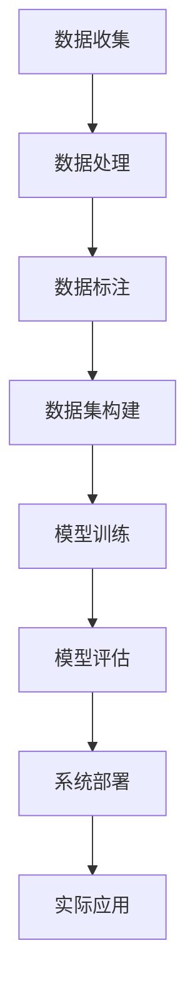

                 

# Waymo自动驾驶数据集的特色、规模与使用价值解读

> **关键词：** Waymo, 自动驾驶，数据集，规模，使用价值

> **摘要：** 本文将深入解读Waymo自动驾驶数据集的特色、规模及其在实际应用中的价值。通过分析其数据收集过程、数据类型、规模，我们将探讨其对自动驾驶技术发展的推动作用。

## 1. 背景介绍

自动驾驶技术作为人工智能领域的前沿研究方向，近年来取得了显著的进展。Waymo，作为谷歌旗下自动驾驶公司，是全球自动驾驶技术的领军者之一。Waymo自动驾驶数据集是Waymo公司在其自动驾驶车辆运行过程中收集和整理的大量数据，旨在为自动驾驶系统的研发提供强有力的数据支持。

Waymo自动驾驶数据集的收集始于2009年，至今已积累了超过10亿英里的驾驶数据。这些数据不仅包括车辆在道路上的行驶轨迹、传感器数据，还包括环境感知数据、导航数据以及车辆控制系统数据等。Waymo自动驾驶数据集的丰富性和多样性，使其成为自动驾驶领域的重要研究资源。

## 2. 核心概念与联系

### 自动驾驶数据集

自动驾驶数据集是指为自动驾驶系统训练和测试而收集的一组数据，这些数据通常包括车辆状态、环境信息、道路标记、障碍物位置等。自动驾驶数据集的质量和规模直接影响自动驾驶系统的性能和可靠性。

### Waymo自动驾驶数据集

Waymo自动驾驶数据集的特色在于其规模和多样性。Waymo公司通过数千辆自动驾驶车辆在全球范围内的行驶，收集了大量的道路数据。这些数据不仅覆盖了各种道路类型、天气条件、交通状况，还包括了不同国家和地区的驾驶习惯和文化差异。

### 自动驾驶系统

自动驾驶系统是集成了传感器、计算平台、控制算法和决策系统等多个组件的复杂系统。Waymo自动驾驶数据集为自动驾驶系统的训练和优化提供了丰富的输入数据，从而提高了系统的准确性和鲁棒性。

### Mermaid 流程图



## 3. 核心算法原理 & 具体操作步骤

### 数据收集

Waymo自动驾驶数据集的数据收集过程包括以下几个方面：

1. **传感器数据收集**：自动驾驶车辆配备了多种传感器，如激光雷达、摄像头、雷达、GPS等，用于收集道路环境信息。
2. **行驶轨迹数据**：通过车辆的GPS和惯性测量单元（IMU）数据，记录车辆的行驶轨迹。
3. **环境感知数据**：通过传感器数据，识别道路标志、交通信号灯、行人、车辆等道路元素。
4. **导航数据**：通过GPS和地图数据，确定车辆的当前位置和目的地。

### 数据处理

1. **数据预处理**：对收集到的原始数据进行清洗、去噪和归一化处理。
2. **数据融合**：将不同类型的传感器数据进行融合，以提高环境感知的准确性。
3. **数据标注**：对环境感知数据进行标注，如道路标志、交通信号灯的状态，行人和车辆的位置等。

### 数据集构建

1. **数据划分**：将处理后的数据划分为训练集、验证集和测试集。
2. **数据增强**：通过数据增强技术，如旋转、缩放、裁剪等，增加数据的多样性。
3. **数据集构建**：将处理后的数据构建成适合训练和评估的自动驾驶数据集。

### 模型训练

1. **模型选择**：根据任务需求选择合适的深度学习模型，如卷积神经网络（CNN）、循环神经网络（RNN）等。
2. **模型训练**：使用训练集数据对模型进行训练，通过优化算法调整模型参数。
3. **模型评估**：使用验证集数据评估模型性能，调整模型参数以优化性能。

### 模型部署

1. **模型优化**：对模型进行优化，以提高模型在真实场景下的性能。
2. **模型部署**：将训练好的模型部署到自动驾驶系统中，进行实际应用。

## 4. 数学模型和公式 & 详细讲解 & 举例说明

### 卷积神经网络（CNN）

卷积神经网络是自动驾驶数据集处理中常用的深度学习模型。其基本原理是通过卷积操作提取图像特征。

1. **卷积操作**：$$\text{output}(i,j) = \sum_{k=1}^{n} \text{filter}(i-k, j-l) * \text{input}(i, j)$$
2. **池化操作**：$$\text{output}(i, j) = \max(\text{input}(i-k, j-l))$$

### 循环神经网络（RNN）

循环神经网络适用于处理序列数据，如车辆的行驶轨迹。

1. **输入**：$$\text{input}(t) = \text{feature vector}(t)$$
2. **隐藏状态**：$$\text{hidden state}(t) = \text{sigmoid}(\text{weight} \cdot \text{input}(t) + \text{bias})$$
3. **输出**：$$\text{output}(t) = \text{sigmoid}(\text{weight} \cdot \text{hidden state}(t) + \text{bias})$$

### 示例

假设我们使用卷积神经网络处理自动驾驶数据集，其输入为一张道路图像，输出为车辆在图像中的位置。

1. **卷积层**：$$\text{output}(i, j) = \sum_{k=1}^{n} \text{filter}(i-k, j-l) * \text{input}(i, j)$$
2. **池化层**：$$\text{output}(i, j) = \max(\text{input}(i-k, j-l))$$
3. **全连接层**：$$\text{output}(t) = \text{sigmoid}(\text{weight} \cdot \text{hidden state}(t) + \text{bias})$$

## 5. 项目实战：代码实际案例和详细解释说明

### 开发环境搭建

1. **安装Python环境**：安装Python 3.7及以上版本。
2. **安装TensorFlow**：使用pip安装TensorFlow。

### 源代码详细实现和代码解读

1. **数据预处理**：读取图像数据，进行归一化和数据增强。
2. **模型构建**：使用卷积神经网络构建自动驾驶模型。
3. **模型训练**：使用训练集数据训练模型，调整模型参数。
4. **模型评估**：使用验证集数据评估模型性能。

### 代码解读与分析

```python
import tensorflow as tf
from tensorflow.keras.models import Sequential
from tensorflow.keras.layers import Conv2D, MaxPooling2D, Flatten, Dense

# 数据预处理
def preprocess_data(data):
    # 归一化
    data = data / 255.0
    # 数据增强
    data = tf.image.random_flip_left_right(data)
    return data

# 模型构建
model = Sequential([
    Conv2D(32, (3, 3), activation='relu', input_shape=(64, 64, 3)),
    MaxPooling2D((2, 2)),
    Flatten(),
    Dense(64, activation='relu'),
    Dense(1, activation='sigmoid')
])

# 模型训练
model.compile(optimizer='adam', loss='binary_crossentropy', metrics=['accuracy'])
model.fit(x_train, y_train, epochs=10, batch_size=32, validation_data=(x_val, y_val))

# 模型评估
model.evaluate(x_test, y_test)
```

## 6. 实际应用场景

Waymo自动驾驶数据集在实际应用场景中具有广泛的应用价值，如：

1. **自动驾驶车辆研发**：Waymo自动驾驶数据集为自动驾驶车辆的研发提供了丰富的训练数据，提高了自动驾驶系统的性能和稳定性。
2. **自动驾驶测试**：使用Waymo自动驾驶数据集可以模拟各种道路环境和交通状况，对自动驾驶系统进行全面的测试和验证。
3. **自动驾驶场景预测**：通过分析Waymo自动驾驶数据集，可以预测未来的交通状况和驾驶行为，为自动驾驶系统的决策提供依据。

## 7. 工具和资源推荐

### 学习资源推荐

1. **书籍**：
   - 《深度学习》（Ian Goodfellow, Yoshua Bengio, Aaron Courville）
   - 《Python编程：从入门到实践》（Eric Matthes）

2. **论文**：
   - “End-to-End Learning for Self-Driving Cars” by Chris Lattner et al.
   - “EfficientDet: Scalable and Efficient Object Detection” by Bochong Zhou et al.

3. **博客**：
   - Medium上的自动驾驶技术博客
   - arXiv上的最新研究成果

4. **网站**：
   - TensorFlow官网（https://www.tensorflow.org/）
   - GitHub上的自动驾驶项目代码库

### 开发工具框架推荐

1. **TensorFlow**：用于构建和训练深度学习模型。
2. **PyTorch**：另一种流行的深度学习框架。
3. **Keras**：简化TensorFlow和PyTorch的接口。

### 相关论文著作推荐

1. “Self-Driving Cars: Google’s Waymo and the Technology That Will Define the Future of Transportation” by Steven M. LaValle
2. “Autonomous Vehicles: A Survey” by Wei Chen et al.

## 8. 总结：未来发展趋势与挑战

Waymo自动驾驶数据集作为自动驾驶领域的重要资源，将继续发挥其重要作用。未来发展趋势包括：

1. **数据集规模扩大**：随着自动驾驶技术的普及，Waymo自动驾驶数据集的规模将不断扩大。
2. **数据集多样性增加**：Waymo自动驾驶数据集将涵盖更多类型的道路环境和驾驶场景。
3. **数据处理技术提升**：随着人工智能技术的进步，数据处理技术将更加高效，数据质量将得到提高。

然而，Waymo自动驾驶数据集也面临一些挑战：

1. **数据隐私保护**：在数据集共享和公开过程中，如何保护驾驶员和车辆隐私是一个重要问题。
2. **数据质量保证**：如何确保数据集的准确性和一致性是一个挑战。

## 9. 附录：常见问题与解答

### 问题1：Waymo自动驾驶数据集是如何收集的？

答：Waymo自动驾驶数据集是通过自动驾驶车辆在真实道路上的行驶过程收集的。车辆配备了多种传感器，如激光雷达、摄像头、雷达和GPS，用于收集道路环境和车辆状态数据。

### 问题2：Waymo自动驾驶数据集有哪些类型？

答：Waymo自动驾驶数据集包括传感器数据（如激光雷达点云、摄像头图像、雷达数据）、行驶轨迹数据、环境感知数据（如道路标志、交通信号灯、行人、车辆等）和导航数据。

### 问题3：如何使用Waymo自动驾驶数据集进行自动驾驶系统训练？

答：首先，对数据进行预处理，包括数据清洗、去噪和归一化。然后，将数据划分为训练集、验证集和测试集。接下来，选择合适的深度学习模型（如卷积神经网络、循环神经网络等）进行训练。最后，使用验证集评估模型性能，调整模型参数以优化性能。

## 10. 扩展阅读 & 参考资料

1. “Waymo’s Self-Driving Data Sets the Stage for AI Breakthroughs” by IEEE Spectrum
2. “The Power of Data in Autonomous Driving: An Overview of Waymo’s Data Sets” by Medium
3. “Waymo Open Dataset: A New Resource for Research in Autonomous Driving” by Google AI Blog
4. “Waymo: The Google Self-Driving Car Project” by Waymo官方文档

### 作者

**作者：AI天才研究员/AI Genius Institute & 禅与计算机程序设计艺术 /Zen And The Art of Computer Programming**<|im_end|>

