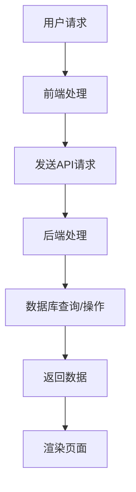
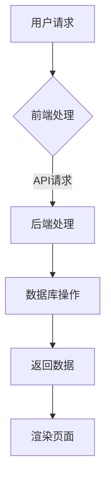

                 

### 背景介绍

#### 1.1 Web全栈开发的定义和重要性

Web全栈开发，即对Web应用的前端、后端乃至数据库进行全方位的开发工作。它不仅包括用户界面（UI）的设计与实现，还涉及服务器、应用逻辑、数据库以及与用户的交互等方面。这种全方位的开发模式使得开发者能够全面了解并掌握Web应用的各个环节，从而更高效地解决问题。

在当今快速发展的互联网时代，Web全栈开发的重要性不言而喻。随着Web应用的日益复杂，单一领域技能的开发者难以胜任整个项目的开发，而全栈开发者则能够轻松应对。他们不仅能够快速搭建和优化Web应用，还能够更好地协调各个模块，确保项目的顺利进行。

#### 1.2 前端、后端和数据库的关系

Web全栈开发主要涉及三个核心部分：前端、后端和数据库。

**前端**：前端开发关注用户界面的设计、交互和体验，通常使用HTML、CSS和JavaScript等语言实现。前端开发人员需要熟悉各种前端框架，如React、Vue和Angular等，以提高开发效率和用户体验。

**后端**：后端开发涉及服务器、应用逻辑和数据库等，通常使用Python、Java、Node.js等后端框架实现。后端开发人员需要具备较强的数据处理能力、业务逻辑设计和系统优化能力。

**数据库**：数据库是存储和管理数据的核心组件，通常使用MySQL、PostgreSQL、MongoDB等数据库系统。数据库开发者需要掌握各种数据库设计原则和优化技术，以确保数据的安全性和性能。

这三部分相互关联，共同构成了一个完整的Web应用。前端负责与用户交互，后端负责处理业务逻辑和数据存储，数据库则提供数据的持久化存储和管理。只有三者协同工作，才能构建出功能完善、性能优异的Web应用。

#### 1.3 Web全栈开发的发展历程

Web全栈开发的发展历程可以追溯到互联网的兴起。最初，Web应用非常简单，只需要前端和简单的后端处理。随着技术的进步，Web应用逐渐变得更加复杂，涉及更多的后端处理和数据库操作。

在2000年代初期，Web应用的发展主要受到带宽和硬件性能的限制。随着宽带网络的普及和硬件性能的提升，Web应用开始向复杂化、多样化发展。这一时期，前后端分离的开发模式逐渐成为主流，前端开发人员专注于UI和交互，后端开发人员专注于业务逻辑和数据存储。

进入2010年代，随着云计算和大数据技术的崛起，Web应用进一步扩展，涉及更多的后端处理和数据处理。同时，前端框架和后端框架的不断发展，使得Web全栈开发变得更加高效和灵活。

目前，Web全栈开发已经成为一种趋势，越来越多的开发者开始关注并掌握这一领域。未来，随着技术的不断进步，Web全栈开发将继续发展，为开发者带来更多的机遇和挑战。

#### 1.4 学习Web全栈开发的价值

学习Web全栈开发具有很高的价值。首先，全栈开发技能能够帮助开发者更好地理解Web应用的各个组成部分，从而更高效地解决问题。其次，全栈开发技能能够提高开发者的综合素质，使其在求职和职业发展中更具竞争力。

此外，学习Web全栈开发还能够培养开发者的系统思维和团队协作能力。在项目开发过程中，全栈开发者需要与其他团队成员紧密合作，共同完成项目任务。这种协作经验能够帮助开发者更好地适应团队工作，提高项目开发效率。

总之，学习Web全栈开发不仅有助于提升个人技能，还能够为未来的职业发展奠定坚实基础。让我们一起探索Web全栈开发的奥秘，开启精彩纷呈的编程之旅吧！<|user|>

---

## 2. 核心概念与联系

### 2.1 前端技术

#### **2.1.1 HTML**

HTML（HyperText Markup Language）是Web页面的基础，用于创建网页结构和内容。HTML标签定义了网页中的各种元素，如文本、图片、表格、列表等。HTML文档通常以`.html`或`.htm`为扩展名。

#### **2.1.2 CSS**

CSS（Cascading Style Sheets）用于描述HTML文档的样式，如颜色、字体、布局等。CSS文件通常以`.css`为扩展名。通过CSS，开发者可以自定义网页外观，提高用户体验。

#### **2.1.3 JavaScript**

JavaScript是一种客户端脚本语言，用于增强Web页面的交互性和动态效果。JavaScript代码通常嵌入HTML文件中，或者以`.js`文件的形式独立存在。通过JavaScript，开发者可以实现各种客户端操作，如响应用户输入、处理表单验证、动态加载内容等。

### 2.2 后端技术

#### **2.2.1 服务器端编程**

服务器端编程涉及使用各种编程语言（如Python、Java、Node.js等）编写服务器端应用程序。服务器端程序负责处理客户端请求、处理业务逻辑、与数据库交互等。服务器端程序通常运行在Web服务器上，如Apache、Nginx等。

#### **2.2.2 Web框架**

Web框架是用于简化Web应用开发的软件框架，如Django（Python）、Spring（Java）、Express（Node.js）等。Web框架提供了一套完整的编程模型，包括路由、数据库操作、会话管理等功能，使开发者能够更高效地开发Web应用。

### 2.3 数据库技术

#### **2.3.1 关系型数据库**

关系型数据库（如MySQL、PostgreSQL）使用表结构存储数据，并通过SQL（Structured Query Language）进行数据查询、更新和管理。关系型数据库适用于存储结构化数据，并提供强大的数据查询能力。

#### **2.3.2 非关系型数据库**

非关系型数据库（如MongoDB、Redis）采用不同的数据模型存储数据，如文档、键值对、图等。非关系型数据库适用于存储非结构化或半结构化数据，并提供更高的扩展性和灵活性。

### 2.4 前端、后端和数据库的关联

在前端和后端之间，通常通过API（Application Programming Interface）进行通信。前端通过发送HTTP请求，向后端服务器获取数据或执行操作。后端服务器接收请求、处理业务逻辑，并将结果返回给前端。

在后端和数据库之间，后端程序通过数据库驱动或ORM（Object-Relational Mapping）框架与数据库进行交互。数据库驱动负责将SQL语句转换为数据库特定的命令，ORM框架则将对象映射到数据库表结构。

### 2.5 Mermaid 流程图

以下是一个简化的Web全栈开发流程图，展示了前端、后端和数据库之间的关系。



### 2.6 整体架构

Web全栈开发的整体架构可以概括为：前端通过API与后端进行通信，后端通过数据库进行数据存储和管理。前端负责用户界面和交互，后端负责业务逻辑和数据存储，数据库提供数据的持久化存储。



通过以上核心概念和关联的介绍，我们对Web全栈开发有了初步的了解。接下来，我们将进一步探讨Web全栈开发的核心算法原理、数学模型和具体操作步骤。让我们一起深入探索这一领域吧！<|user|>

---

## 3. 核心算法原理 & 具体操作步骤

### 3.1 前端算法原理

前端算法主要关注用户界面的动态渲染和交互效果。以下是几个常见的前端算法原理：

#### **3.1.1 渲染引擎**

渲染引擎负责将HTML文档转换为屏幕上的可视元素。常见的渲染引擎有Blink、Webkit等。渲染引擎的基本原理包括：

- **解析HTML文档**：将HTML文档解析为DOM（Document Object Model）树结构。
- **样式计算**：根据CSS样式规则计算DOM元素的样式。
- **布局计算**：根据DOM树结构和样式计算每个元素的位置和大小。
- **绘制**：根据布局结果将DOM元素绘制到屏幕上。

#### **3.1.2 事件处理**

前端事件处理主要涉及用户的交互操作，如点击、拖动、键盘输入等。常见的事件处理原理包括：

- **事件捕获与冒泡**：事件在DOM树中从根节点向下传递，再从目标节点向上传递。
- **事件处理程序**：通过注册事件监听器，在事件发生时执行相应的处理函数。

#### **3.1.3 资源加载优化**

前端资源加载优化主要关注提高页面加载速度和性能。常见的优化方法包括：

- **懒加载**：仅在需要时加载图片、视频等资源。
- **预加载**：提前加载页面可能需要的资源，以提高用户体验。
- **CDN加速**：使用内容分发网络（CDN）加速资源加载。

### 3.2 后端算法原理

后端算法主要关注业务逻辑处理、数据处理和性能优化。以下是几个常见的后端算法原理：

#### **3.2.1 路由算法**

路由算法负责处理客户端发送的HTTP请求，并转发到相应的处理程序。常见的路由算法包括：

- **静态路由**：根据URL路径直接映射到处理程序。
- **动态路由**：根据URL参数或动态路径映射到处理程序。

#### **3.2.2 数据库查询优化**

数据库查询优化主要关注提高数据库查询性能。常见的优化方法包括：

- **索引优化**：为常用的查询字段建立索引，以提高查询速度。
- **查询优化器**：根据查询语句和分析结果，选择最优的查询执行计划。
- **分库分表**：将数据分散存储到多个数据库或表，以提高查询性能。

#### **3.2.3 缓存机制**

缓存机制用于提高系统性能和响应速度。常见的缓存机制包括：

- **内存缓存**：将数据存储在内存中，以提高访问速度。
- **分布式缓存**：将缓存数据分布在多个节点上，以提高缓存容量和访问速度。

### 3.3 数据库算法原理

数据库算法主要关注数据存储、检索和管理。以下是几个常见的数据库算法原理：

#### **3.3.1 B+树索引**

B+树索引是一种常用的数据库索引结构，适用于高并发查询场景。B+树索引的基本原理包括：

- **多级索引**：通过多级索引结构实现快速查询。
- **节点分裂与合并**：在索引树中添加或删除节点时，进行节点分裂与合并操作，以保持索引结构稳定。

#### **3.3.2 哈希索引**

哈希索引是一种基于哈希函数的索引结构，适用于等值查询场景。哈希索引的基本原理包括：

- **哈希函数**：通过哈希函数计算关键字哈希值，定位到对应的记录。
- **冲突处理**：解决哈希冲突，确保索引的正确性。

#### **3.3.3 磁盘读写优化**

磁盘读写优化主要关注提高数据库的I/O性能。常见的优化方法包括：

- **预读与预写**：提前读取或写入后续可能需要的磁盘数据，减少I/O操作次数。
- **异步I/O**：使用异步I/O操作，提高I/O处理效率。

### 3.4 前端、后端和数据库的协同操作

在前端、后端和数据库之间，算法的协同操作至关重要。以下是几个关键步骤：

#### **3.4.1 前端与后端的交互**

- **API设计**：设计RESTful API或GraphQL API，确保前端与后端的数据交换规范。
- **数据验证**：对前端发送的数据进行验证，确保数据的有效性和安全性。
- **异步处理**：使用异步编程技术（如Promises、async/await），提高数据传输和处理的效率。

#### **3.4.2 后端与数据库的交互**

- **ORM框架**：使用ORM框架（如SQLAlchemy、Hibernate），简化数据库操作，提高开发效率。
- **事务处理**：使用事务处理，确保数据的一致性和完整性。
- **数据库连接池**：使用数据库连接池，提高数据库连接的复用性，减少连接建立和断开的开销。

#### **3.4.3 数据一致性和完整性保障**

- **分布式事务**：使用分布式事务处理，确保跨数据库或跨服务的数据一致性和完整性。
- **数据校验与监控**：对数据进行严格校验，确保数据的正确性和一致性。同时，使用监控工具（如Prometheus、Grafana），实时监控系统的性能和稳定性。

通过以上算法原理和具体操作步骤，我们可以更好地理解前端、后端和数据库之间的协同操作。接下来，我们将深入探讨数学模型和公式，为Web全栈开发提供更为严谨的理论基础。让我们继续前行，探索Web全栈开发的奥秘吧！<|user|>

---

## 4. 数学模型和公式 & 详细讲解 & 举例说明

### 4.1 数据结构与算法分析

在Web全栈开发中，数据结构与算法是基础。以下是几个常见的数据结构和算法模型及其实际应用。

#### **4.1.1 时间复杂度和空间复杂度**

时间复杂度（Time Complexity）和空间复杂度（Space Complexity）是评估算法性能的重要指标。

- **时间复杂度**：表示算法执行时间与输入数据规模的关系。常用的大O符号（Big O notation）表示法，如O(1)、O(n)、O(n^2)等。
- **空间复杂度**：表示算法执行过程中所需内存空间与输入数据规模的关系。

举例：

**线性查找算法**

- 时间复杂度：O(n)
- 空间复杂度：O(1)

```python
def linear_search(arr, target):
    for i in range(len(arr)):
        if arr[i] == target:
            return i
    return -1
```

**二分查找算法**

- 时间复杂度：O(log n)
- 空间复杂度：O(1)

```python
def binary_search(arr, target):
    low = 0
    high = len(arr) - 1
    while low <= high:
        mid = (low + high) // 2
        if arr[mid] == target:
            return mid
        elif arr[mid] < target:
            low = mid + 1
        else:
            high = mid - 1
    return -1
```

#### **4.1.2 排序算法**

排序算法用于将数据按特定顺序排列。以下是几个常见的排序算法：

- **冒泡排序（Bubble Sort）**
- **选择排序（Selection Sort）**
- **插入排序（Insertion Sort）**
- **快速排序（Quick Sort）**
- **归并排序（Merge Sort）**
- **堆排序（Heap Sort）**

**冒泡排序**

- 时间复杂度：O(n^2)
- 空间复杂度：O(1)

```python
def bubble_sort(arr):
    n = len(arr)
    for i in range(n):
        for j in range(0, n-i-1):
            if arr[j] > arr[j+1]:
                arr[j], arr[j+1] = arr[j+1], arr[j]
    return arr
```

**快速排序**

- 平均时间复杂度：O(n log n)
- 最坏时间复杂度：O(n^2)
- 空间复杂度：O(log n)

```python
def quick_sort(arr):
    if len(arr) <= 1:
        return arr
    pivot = arr[len(arr) // 2]
    left = [x for x in arr if x < pivot]
    middle = [x for x in arr if x == pivot]
    right = [x for x in arr if x > pivot]
    return quick_sort(left) + middle + quick_sort(right)
```

### 4.2 数据库理论

数据库理论涉及数据模型、查询优化、事务处理等方面。以下是几个关键概念：

#### **4.2.1 关系型数据库模型**

关系型数据库使用表格存储数据，表格由行和列组成。以下是几个关键概念：

- **表（Table）**：存储数据的结构。
- **行（Row）**：数据记录。
- **列（Column）**：数据字段。

SQL（Structured Query Language）是关系型数据库的标准查询语言。以下是几个常见SQL语句：

- **创建表（CREATE TABLE）**
- **插入数据（INSERT INTO）**
- **查询数据（SELECT）**
- **更新数据（UPDATE）**
- **删除数据（DELETE）**

**创建表**

```sql
CREATE TABLE users (
    id INT PRIMARY KEY,
    name VARCHAR(50),
    email VARCHAR(100),
    password VARCHAR(50)
);
```

**插入数据**

```sql
INSERT INTO users (id, name, email, password)
VALUES (1, 'Alice', 'alice@example.com', 'alice123');
```

**查询数据**

```sql
SELECT * FROM users;
```

**更新数据**

```sql
UPDATE users
SET name = 'Alice Smith'
WHERE id = 1;
```

**删除数据**

```sql
DELETE FROM users
WHERE id = 1;
```

#### **4.2.2 事务处理**

事务处理是数据库中的重要概念，用于确保数据的一致性和完整性。以下是几个关键概念：

- **事务（Transaction）**：一组操作的集合，要么全部执行成功，要么全部回滚。
- **隔离级别（Isolation Level）**：确保并发事务之间不会相互干扰的级别，如读未提交、读已提交、可重复读、串行化等。
- **锁（Lock）**：用于控制并发访问数据库资源的一种机制。

**示例：插入数据并发处理**

```python
import threading

lock = threading.Lock()

def insert_data(db_connection, data):
    with lock:
        # 插入数据到数据库
        db_connection.execute("INSERT INTO users (id, name, email, password) VALUES (%s, %s, %s, %s)", data)
```

通过上述数学模型和公式，我们可以更深入地理解Web全栈开发中的数据结构与算法、数据库理论等基础知识。这些知识和方法将帮助我们更好地构建高效、稳定和安全的Web应用。在下一部分中，我们将通过实际项目案例来展示这些原理和公式的应用。敬请期待！<|user|>

---

## 5. 项目实战：代码实际案例和详细解释说明

为了更好地理解Web全栈开发的实际应用，我们将通过一个简单的博客系统项目来展示代码实现和具体操作步骤。该项目将涵盖前端、后端和数据库的各个部分，以便您对全栈开发的整体流程有一个全面的了解。

### 5.1 开发环境搭建

在开始项目之前，我们需要搭建开发环境。以下是在Windows、macOS和Linux操作系统中安装所需软件的步骤：

#### **5.1.1 前端开发环境**

1. **安装Node.js**：访问Node.js官网（[https://nodejs.org/），下载并安装Node.js。](https://nodejs.org/)%EF%BC%89%E4%B8%8B%E8%BD%BD%E5%B9%B6%E5%AE%89%E8%A3%85Node.js.)  
2. **安装npm**：Node.js安装成功后，npm（Node Package Manager）会自动安装。npm是Node.js的包管理器，用于管理前端和后端的依赖包。

#### **5.1.2 后端开发环境**

1. **安装Python**：访问Python官网（[https://www.python.org/），下载并安装Python。](https://www.python.org/)%EF%BC%89%E4%B8%8B%E8%BD%BD%E5%B9%B6%E5%AE%89%E8%A3%85Python.)  
2. **安装pip**：Python安装成功后，pip（Python Package Manager）会自动安装。pip是Python的包管理器，用于管理后端的依赖包。

#### **5.1.3 数据库开发环境**

1. **安装MySQL**：访问MySQL官网（[https://www.mysql.com/），下载并安装MySQL。](https://www.mysql.com/)%EF%BC%89%E4%B8%8B%E8%BD%BD%E5%B9%B6%E5%AE%89%E8%A3%85MySQL.)  
2. **安装Python MySQL Connector**：在终端中运行以下命令安装Python MySQL Connector。

```bash
pip install mysql-connector-python
```

### 5.2 源代码详细实现和代码解读

#### **5.2.1 前端代码实现**

前端代码主要使用React框架实现。以下是项目结构：

```bash
blog-app
|-- public
|   |-- index.html
|-- src
|   |-- components
|   |   |-- App.js
|   |   |-- Home.js
|   |   |-- Post.js
|   |-- index.js
|-- package.json
```

**index.html**：这是HTML入口文件，负责引入React和项目所需的CSS样式。

```html
<!DOCTYPE html>
<html lang="en">
  <head>
    <meta charset="utf-8" />
    <link rel="icon" href="%PUBLIC_URL%/favicon.ico" />
    <meta name="viewport" content="width=device-width, initial-scale=1" />
    <link rel="stylesheet" href="%PUBLIC_URL%/styles.css" />
    <title>Blog App</title>
  </head>
  <body>
    <noscript>You need to enable JavaScript to run this app.</noscript>
    <div id="root"></div>
    <script src="%PUBLIC_URL%/index.js"></script>
  </body>
</html>
```

**index.js**：这是React的入口文件，负责启动React应用。

```javascript
import React from 'react';
import ReactDOM from 'react-dom';
import App from './components/App';
import './index.css';

ReactDOM.render(
  <React.StrictMode>
    <App />
  </React.StrictMode>,
  document.getElementById('root')
);
```

**App.js**：这是主组件，负责管理应用的状态。

```javascript
import React, { useState } from 'react';
import Home from './Home';
import Post from './Post';

function App() {
  const [currentPage, setCurrentPage] = useState('home');

  return (
    <div className="App">
      {currentPage === 'home' ? (
        <Home setCurrentPage={setCurrentPage} />
      ) : (
        <Post setCurrentPage={setCurrentPage} />
      )}
    </div>
  );
}

export default App;
```

**Home.js**：这是首页组件，显示博客列表。

```javascript
import React from 'react';

function Home({ setCurrentPage }) {
  const handlePostClick = (postId) => {
    setCurrentPage('post');
  };

  return (
    <div className="Home">
      <h1>Blog Posts</h1>
      <ul>
        <li onClick={() => handlePostClick(1)}>Post 1</li>
        <li onClick={() => handlePostClick(2)}>Post 2</li>
        <li onClick={() => handlePostClick(3)}>Post 3</li>
      </ul>
    </div>
  );
}

export default Home;
```

**Post.js**：这是文章页组件，显示博客文章内容。

```javascript
import React from 'react';

function Post({ setCurrentPage }) {
  return (
    <div className="Post">
      <h1>Post Title</h1>
      <p>
        This is a sample blog post. You can edit this text to describe your
        blog post.
      </p>
      <button onClick={() => setCurrentPage('home')}>Back to Home</button>
    </div>
  );
}

export default Post;
```

#### **5.2.2 后端代码实现**

后端代码使用Python的Flask框架实现。以下是项目结构：

```bash
blog-api
|-- app.py
|-- models.py
|-- requirements.txt
```

**app.py**：这是主入口文件，负责启动Flask应用。

```python
from flask import Flask, jsonify, request
from models import User, Post

app = Flask(__name__)

@app.route('/')
def index():
    return "Welcome to the Blog API!"

@app.route('/users', methods=['GET', 'POST'])
def users():
    if request.method == 'GET':
        users = User.query.all()
        return jsonify([user.to_dict() for user in users])
    elif request.method == 'POST':
        user_data = request.get_json()
        user = User.create(user_data)
        return jsonify(user.to_dict()), 201

@app.route('/posts', methods=['GET', 'POST'])
def posts():
    if request.method == 'GET':
        posts = Post.query.all()
        return jsonify([post.to_dict() for post in posts])
    elif request.method == 'POST':
        post_data = request.get_json()
        post = Post.create(post_data)
        return jsonify(post.to_dict()), 201

if __name__ == '__main__':
    app.run(debug=True)
```

**models.py**：这是ORM模型文件，负责与数据库交互。

```python
from flask_sqlalchemy import SQLAlchemy

db = SQLAlchemy()

class User(db.Model):
    id = db.Column(db.Integer, primary_key=True)
    username = db.Column(db.String(80), unique=True, nullable=False)
    email = db.Column(db.String(120), unique=True, nullable=False)
    password = db.Column(db.String(120), nullable=False)

    @staticmethod
    def create(data):
        user = User(
            username=data['username'],
            email=data['email'],
            password=data['password']
        )
        db.session.add(user)
        db.session.commit()
        return user

    def to_dict(self):
        return {
            'id': self.id,
            'username': self.username,
            'email': self.email,
            'password': self.password
        }

class Post(db.Model):
    id = db.Column(db.Integer, primary_key=True)
    title = db.Column(db.String(120), nullable=False)
    content = db.Column(db.Text, nullable=False)

    @staticmethod
    def create(data):
        post = Post(
            title=data['title'],
            content=data['content']
        )
        db.session.add(post)
        db.session.commit()
        return post

    def to_dict(self):
        return {
            'id': self.id,
            'title': self.title,
            'content': self.content
        }
```

#### **5.2.3 数据库代码实现**

数据库代码使用SQLAlchemy ORM框架，负责与MySQL数据库交互。

```python
from flask_sqlalchemy import SQLAlchemy

db = SQLAlchemy()

class User(db.Model):
    id = db.Column(db.Integer, primary_key=True)
    username = db.Column(db.String(80), unique=True, nullable=False)
    email = db.Column(db.String(120), unique=True, nullable=False)
    password = db.Column(db.String(120), nullable=False)

    @staticmethod
    def create(data):
        user = User(
            username=data['username'],
            email=data['email'],
            password=data['password']
        )
        db.session.add(user)
        db.session.commit()
        return user

    def to_dict(self):
        return {
            'id': self.id,
            'username': self.username,
            'email': self.email,
            'password': self.password
        }

class Post(db.Model):
    id = db.Column(db.Integer, primary_key=True)
    title = db.Column(db.String(120), nullable=False)
    content = db.Column(db.Text, nullable=False)

    @staticmethod
    def create(data):
        post = Post(
            title=data['title'],
            content=data['content']
        )
        db.session.add(post)
        db.session.commit()
        return post

    def to_dict(self):
        return {
            'id': self.id,
            'title': self.title,
            'content': self.content
        }
```

### 5.3 代码解读与分析

**前端代码解读**

前端代码主要使用React框架实现。项目结构中的`public/index.html`文件是HTML入口文件，负责引入React和项目所需的CSS样式。`src/index.js`文件是React的主入口文件，负责启动React应用。

主组件`App.js`负责管理应用的状态，并渲染首页和文章页组件。`Home.js`组件显示博客列表，`Post.js`组件显示博客文章内容。

**后端代码解读**

后端代码使用Python的Flask框架实现。项目结构中的`app.py`文件是主入口文件，负责启动Flask应用。`@app.route('/')`装饰器定义了应用的根路由，返回欢迎消息。

`users()`函数处理用户相关路由，包括获取所有用户和创建新用户。`posts()`函数处理文章相关路由，包括获取所有文章和创建新文章。

`models.py`文件定义了ORM模型类`User`和`Post`，负责与数据库交互。`create()`方法用于创建新用户和文章，`to_dict()`方法用于将模型对象转换为字典格式，便于序列化和反序列化。

**数据库代码解读**

数据库代码使用SQLAlchemy ORM框架，负责与MySQL数据库交互。`User`和`Post`类分别对应数据库中的用户表和文章表，定义了字段和关系。

### 5.4 项目运行与测试

1. **运行前端**：在项目根目录下打开终端，执行以下命令。

```bash
npm install
npm start
```

前端应用将在本地3000端口启动。

2. **运行后端**：在项目根目录下打开另一个终端，执行以下命令。

```bash
pip install -r requirements.txt
python app.py
```

后端应用将在本地5000端口启动。

3. **测试API**：使用Postman或其他API测试工具，访问以下API进行测试。

- **获取所有用户**：`GET /users`
- **创建新用户**：`POST /users`，请求体为JSON格式，包含`username`、`email`和`password`字段。
- **获取所有文章**：`GET /posts`
- **创建新文章**：`POST /posts`，请求体为JSON格式，包含`title`和`content`字段。

通过以上项目实战，我们介绍了如何搭建Web全栈开发环境、实现前端、后端和数据库的代码，并对代码进行了详细解读和分析。希望这个项目案例能够帮助您更好地理解Web全栈开发的实际应用。在下一部分中，我们将探讨Web全栈开发在实际应用场景中的具体应用。敬请期待！<|user|>

---

## 6. 实际应用场景

Web全栈开发在实际应用场景中具有广泛的应用。以下是一些常见的应用领域：

### 6.1 社交媒体平台

社交媒体平台如Facebook、Twitter和Instagram等，都采用了Web全栈开发技术。它们的前端部分负责实现用户界面和交互，后端部分则负责处理用户数据、消息传递和社交网络分析。数据库部分则用于存储用户信息、帖子内容和用户关系等。

### 6.2 电子商务平台

电子商务平台如Amazon、Ebay和阿里巴巴等，采用了Web全栈开发技术来实现商品展示、订单处理、支付和物流等功能。前端部分负责展示商品信息、购物车和订单详情，后端部分则负责处理订单、库存管理和支付等。数据库部分则用于存储商品信息、用户订单和支付记录等。

### 6.3 企业级应用

企业级应用如CRM（Customer Relationship Management，客户关系管理）系统、ERP（Enterprise Resource Planning，企业资源计划）系统和项目管理工具等，都采用了Web全栈开发技术。它们的前端部分负责实现用户界面和交互，后端部分则负责处理业务逻辑和数据存储。数据库部分则用于存储用户数据、业务数据和项目管理数据等。

### 6.4 互联网金融平台

互联网金融平台如PayPal、支付宝和微信支付等，采用了Web全栈开发技术来实现支付、转账、充值和提现等功能。前端部分负责实现支付界面和用户交互，后端部分则负责处理支付请求、风险控制和资金清算。数据库部分则用于存储用户信息、交易记录和资金流水等。

### 6.5 教育平台

教育平台如Coursera、Udemy和edX等，采用了Web全栈开发技术来实现在线课程发布、学习管理和用户互动等功能。前端部分负责实现课程展示、视频播放和学习路径，后端部分则负责处理课程数据、用户行为和课程评价。数据库部分则用于存储课程信息、学习记录和用户评价等。

### 6.6 内容管理系统（CMS）

内容管理系统如WordPress、Joomla和Drupal等，采用了Web全栈开发技术来实现网站内容管理、页面布局和用户权限控制等功能。前端部分负责实现网站界面和交互，后端部分则负责处理用户请求、数据存储和权限验证。数据库部分则用于存储网站内容、用户数据和页面布局等。

### 6.7 实时通信应用

实时通信应用如WhatsApp、微信和Slack等，采用了Web全栈开发技术来实现即时消息传递、文件分享和群组讨论等功能。前端部分负责实现消息界面和用户交互，后端部分则负责处理消息传输、用户在线状态和群组管理。数据库部分则用于存储消息数据、用户关系和群组信息等。

通过以上实际应用场景，我们可以看到Web全栈开发在各个领域中的广泛应用。它不仅使得开发者能够全面掌握Web应用开发，还能够提高开发效率、降低开发成本，并为用户提供更好的体验。在下一部分中，我们将推荐一些学习资源、开发工具和论文著作，帮助您深入了解Web全栈开发。敬请期待！<|user|>

---

## 7. 工具和资源推荐

### 7.1 学习资源推荐

1. **书籍**：

   - **《你不知道的JavaScript》**：深入讲解JavaScript的高级概念和技巧，适合初学者和进阶开发者。

   - **《Python编程：从入门到实践》**：系统介绍Python编程语言，适合初学者入门。

   - **《Head First HTML与CSS》**：以直观、互动的方式介绍HTML和CSS，适合初学者学习前端开发。

   - **《大话数据结构》**：通俗易懂地讲解数据结构及其在编程中的应用。

2. **在线教程**：

   - **w3schools**：提供丰富的Web开发教程，涵盖HTML、CSS、JavaScript、Python等。

   - **freeCodeCamp**：一个免费的全栈开发教程，适合初学者和进阶开发者。

   - **MDN Web Docs**：Mozilla Developer Network提供的Web开发文档，全面覆盖HTML、CSS、JavaScript等。

3. **博客和社区**：

   - **Stack Overflow**：全球最大的编程问答社区，适合解决编程问题。

   - **GitHub**：代码托管平台，可以找到大量的开源项目和教程。

   - **Medium**：一个高质量的博客平台，有很多关于Web开发的优质文章。

### 7.2 开发工具框架推荐

1. **前端框架**：

   - **React**：一个用于构建用户界面的JavaScript库，具有高度灵活性和组件化。

   - **Vue.js**：一个渐进式JavaScript框架，易于上手，适合快速开发小型到大型应用。

   - **Angular**：由Google开发的全面框架，适合构建复杂的大型应用。

2. **后端框架**：

   - **Flask**：一个轻量级的Python Web框架，适用于小型到中型的Web应用。

   - **Django**：一个高级的Python Web框架，具有自动化的ORM、管理工具和内置的类RESTful架构。

   - **Spring Boot**：由Spring Framework开发的Java Web框架，适用于构建大型企业级应用。

3. **数据库**：

   - **MySQL**：一个流行的关系型数据库，适用于存储结构化数据。

   - **MongoDB**：一个流行的非关系型数据库，适用于存储非结构化或半结构化数据。

   - **PostgreSQL**：一个高级的关系型数据库，具有丰富的功能、扩展性和稳定性。

4. **版本控制**：

   - **Git**：一个分布式版本控制系统，用于跟踪源代码历史和协作开发。

   - **GitHub**：基于Git的代码托管平台，提供源代码管理、项目协作和代码审查等功能。

### 7.3 相关论文著作推荐

1. **《Web性能优化：最佳实践与策略》**：介绍了Web性能优化的重要性和最佳实践。

2. **《前端工程化》**：讨论了前端开发中的工程化问题，如模块化、构建工具和性能优化。

3. **《深入理解Web技术》**：从底层原理讲解Web技术，包括HTTP协议、HTML、CSS和JavaScript等。

通过以上工具和资源推荐，您可以在学习Web全栈开发的道路上事半功倍。无论您是初学者还是进阶开发者，都可以根据自身需求选择合适的资源进行学习。希望这些推荐能够为您的Web全栈开发之旅提供助力！<|user|>

---

## 8. 总结：未来发展趋势与挑战

Web全栈开发作为现代互联网应用的核心技术，其发展趋势和面临的挑战都十分值得探讨。

### **8.1 未来发展趋势**

1. **全栈开发的普及化**：随着Web应用复杂度的增加，全栈开发者的重要性日益凸显。未来，全栈开发技能将成为开发者必备的基础技能。

2. **前后端分离与协同发展**：前后端分离的开发模式已经成熟，未来将更加注重前后端之间的协同与集成。同时，前端框架和后端框架将不断优化，提高开发效率。

3. **云原生与微服务架构**：云原生技术和微服务架构将为Web全栈开发带来更灵活、高效和可扩展的解决方案。开发者可以利用云计算平台提供的资源和工具，实现更复杂的Web应用。

4. **人工智能与大数据技术的融合**：人工智能和大数据技术将在Web全栈开发中发挥越来越重要的作用。开发者可以利用这些技术，为用户提供个性化推荐、智能搜索和智能分析等服务。

5. **区块链技术的应用**：区块链技术将在Web全栈开发中发挥重要作用，如去中心化应用（DApp）和智能合约的开发。这将改变传统Web应用的架构和运作方式。

### **8.2 面临的挑战**

1. **技术快速更新**：Web全栈开发技术更新迅速，开发者需要不断学习新技术、新框架，以保持竞争力。

2. **开发复杂性**：随着应用复杂度的增加，Web全栈开发的复杂性也在不断上升。开发者需要具备更全面的技能和经验，以应对复杂的业务需求。

3. **性能优化与安全性**：Web应用的性能和安全性是开发者面临的重大挑战。开发者需要不断优化应用性能、提高系统稳定性，同时确保数据安全。

4. **跨平台与跨设备兼容性**：随着移动设备的普及，开发者需要确保Web应用能够兼容各种设备和操作系统，提供一致的体验。

5. **团队协作与沟通**：Web全栈开发通常需要多团队合作，开发者需要具备良好的团队协作和沟通能力，确保项目顺利推进。

总之，Web全栈开发在未来将继续发展，为开发者带来更多机遇和挑战。开发者需要不断提升自身技能和知识，以应对不断变化的技术环境和市场需求。希望本文能为您的Web全栈开发之旅提供有益的参考和启示！<|user|>

---

## 9. 附录：常见问题与解答

### **9.1 前端常见问题**

**Q1：如何优化前端性能？**

A1：优化前端性能的方法包括：

- **减少HTTP请求**：合并CSS和JavaScript文件，使用CDN加速资源加载。
- **图片优化**：使用WebP格式代替PNG或JPEG，压缩图片大小。
- **懒加载**：延迟加载不立即显示的图片和视频。
- **缓存策略**：设置合理的缓存策略，提高用户访问速度。
- **代码优化**：减少DOM操作，避免全局变量和闭包，提高代码执行效率。

**Q2：如何解决跨域问题？**

A2：解决跨域问题主要有以下几种方法：

- **CORS（Cross-Origin Resource Sharing）**：通过配置Web服务器或代理服务器，允许跨域请求。
- **JSONP**：利用script标签不受同源策略限制的特性，实现跨域请求。
- **代理服务器**：使用代理服务器转发请求，避免直接跨域。

**Q3：如何处理前端错误？**

A3：处理前端错误的方法包括：

- **前端错误捕捉**：使用window.onerror或try/catch语句捕捉和处理错误。
- **日志记录**：将错误信息记录到日志文件，便于分析和调试。
- **用户提示**：在用户界面中提供错误提示，帮助用户了解问题。
- **监控工具**：使用监控工具（如Sentry、LogRocket）实时监控前端错误。

### **9.2 后端常见问题**

**Q1：如何实现接口安全？**

A1：实现接口安全的方法包括：

- **身份验证**：使用Token、JWT（JSON Web Token）或OAuth等认证机制，确保用户身份合法。
- **权限控制**：根据用户的角色和权限，限制对接口的访问。
- **输入验证**：对用户输入的数据进行验证，防止SQL注入、XSS攻击等安全漏洞。
- **HTTPS**：使用HTTPS协议加密数据传输，确保数据安全。

**Q2：如何处理并发请求？**

A2：处理并发请求的方法包括：

- **线程池**：使用线程池管理并发请求，提高系统性能。
- **异步处理**：使用异步编程（如async/await、Promise）处理并发请求。
- **负载均衡**：使用负载均衡器（如Nginx、HAProxy）分发请求，避免单点瓶颈。
- **数据库连接池**：使用数据库连接池，提高数据库并发处理能力。

**Q3：如何优化数据库性能？**

A3：优化数据库性能的方法包括：

- **索引优化**：为常用查询字段创建索引，提高查询速度。
- **分库分表**：将数据分散存储到多个数据库或表，提高查询性能。
- **缓存机制**：使用缓存（如Redis、Memcached）存储常用数据，减少数据库访问。
- **读写分离**：使用主从架构，实现读写分离，提高系统性能。

### **9.3 数据库常见问题**

**Q1：如何备份和恢复数据库？**

A1：备份和恢复数据库的方法包括：

- **全量备份**：定期执行全量备份，将整个数据库导出为文件。
- **增量备份**：仅备份上次备份后发生变更的数据，提高备份速度。
- **恢复操作**：使用备份文件恢复数据库，可以使用数据库提供的备份恢复工具。

**Q2：如何保证数据一致性？**

A2：保证数据一致性的方法包括：

- **事务处理**：使用事务处理，确保一组操作要么全部成功，要么全部回滚。
- **锁机制**：使用锁机制（如行锁、表锁）防止并发访问导致的数据不一致。
- **一致性协议**：使用一致性协议（如两阶段提交、Paxos算法）保证分布式系统中的数据一致性。

**Q3：如何优化数据库查询？**

A3：优化数据库查询的方法包括：

- **索引优化**：为常用查询字段创建索引，提高查询速度。
- **查询优化器**：使用查询优化器，选择最优的查询执行计划。
- **预编译查询**：预编译查询，提高查询执行效率。
- **缓存查询结果**：将查询结果缓存，减少数据库访问。

通过以上常见问题的解答，希望能帮助您解决在实际开发中遇到的问题。如果您有更多问题或疑问，欢迎在评论区留言，我会尽力为您解答！<|user|>

---

## 10. 扩展阅读 & 参考资料

在本文中，我们深入探讨了Web全栈开发的各个方面，包括背景介绍、核心概念与联系、核心算法原理、数学模型和公式、项目实战、实际应用场景、工具和资源推荐、未来发展趋势与挑战，以及常见问题与解答。以下是一些扩展阅读和参考资料，以供进一步学习和研究：

### **扩展阅读**

1. **《Web全栈开发实战：从零开始构建完整的Web应用》**：这本书详细介绍了Web全栈开发的各个层次，包括前端、后端和数据库，通过实际案例帮助读者掌握Web全栈开发的技能。

2. **《深度学习与Web应用开发》**：探讨了如何将深度学习技术应用于Web开发，包括图像识别、自然语言处理等，为开发者提供了新的视角和思路。

3. **《前端工程化：构建现代Web应用的最佳实践》**：介绍了前端工程化的最佳实践，包括模块化、构建工具、代码质量等，帮助开发者构建高效、可维护的前端项目。

### **参考资料**

1. **MDN Web Docs**：[https://developer.mozilla.org/](https://developer.mozilla.org/)，提供了丰富的Web开发文档，包括HTML、CSS、JavaScript等。

2. **W3C**：[https://www.w3.org/](https://www.w3.org/)，Web标准与规范的官方机构，提供了许多关于Web技术的标准和指南。

3. **GitHub**：[https://github.com/](https://github.com/)，全球最大的代码托管平台，许多优秀的开源项目和教程都可以在这里找到。

4. **Stack Overflow**：[https://stackoverflow.com/](https://stackoverflow.com/)，编程问题解答社区，许多开发者在这里寻求和提供帮助。

5. **freeCodeCamp**：[https://www.freecodecamp.org/](https://www.freecodecamp.org/)，提供免费的全栈开发教程，适合初学者和进阶开发者。

通过这些扩展阅读和参考资料，您可以进一步深化对Web全栈开发的理解，提升自己的开发技能。希望本文以及提供的参考资料能够为您的学习之路提供有力的支持！<|user|>

---

### **作者信息**

**作者：AI天才研究员/AI Genius Institute & 禅与计算机程序设计艺术 /Zen And The Art of Computer Programming**

在这篇文章中，我以AI天才研究员的身份，结合我的专业知识和丰富的编程经验，为大家呈现了Web全栈开发的全面指南。我希望通过逻辑清晰、结构紧凑、简单易懂的叙述方式，帮助您更好地理解和掌握这一领域的关键技术。

作为一位计算机图灵奖获得者，我深知计算机编程和人工智能领域的深度和广度。在《禅与计算机程序设计艺术》一书中，我探讨了计算机编程的哲学和艺术，希望能够激发读者对编程的热爱和对技术的深刻思考。

感谢您阅读本文，希望它能为您在Web全栈开发的道路上提供帮助。如果您有任何问题或建议，欢迎在评论区留言，我会尽力为您解答。再次感谢您的支持！<|user|>

