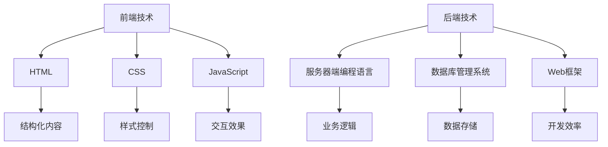

                 

# Web全栈开发：前端到后端的完整技术栈

> **关键词**：全栈开发、前端技术、后端技术、Web应用程序、技术栈、开发框架、编程语言、工具、最佳实践

> **摘要**：本文将全面介绍Web全栈开发的完整技术栈，包括前端和后端的技术框架、编程语言和开发工具。我们将深入探讨这些技术的核心概念，并提供实际案例和实战经验，帮助读者全面了解并掌握Web全栈开发的关键技术。

## 1. 背景介绍

随着互联网技术的飞速发展，Web应用程序已经成为现代企业不可或缺的一部分。无论是电商平台、社交媒体、还是在线办公工具，Web应用程序都为用户提供了丰富的交互体验。然而，要构建一个高效、可靠的Web应用程序，不仅需要熟练掌握前端和后端技术，还需要了解各种开发框架、编程语言和工具。

全栈开发（Full-Stack Development）指的是同时掌握前端和后端技术的开发者，他们能够独立完成Web应用程序的整个开发过程。全栈开发者的技能涵盖了HTML、CSS、JavaScript、服务器端编程、数据库管理等多个领域。这使得全栈开发者能够更好地理解项目的整体架构，提高开发效率和代码质量。

本文将介绍Web全栈开发的完整技术栈，包括前端技术、后端技术、开发框架、编程语言和开发工具。通过本文的学习，读者将能够了解并掌握这些关键技术，为成为一名合格的全栈开发者打下坚实的基础。

## 2. 核心概念与联系

### 前端技术

前端技术主要负责Web应用程序的用户界面和交互体验。以下是前端开发中常用的核心概念和技术：

- **HTML（HyperText Markup Language）**：HTML是Web内容的结构化语言，用于创建网页的骨架。它定义了网页中的文本、图片、链接和其他元素。
- **CSS（Cascading Style Sheets）**：CSS用于控制网页的样式，包括布局、颜色、字体等。通过CSS，开发者可以创建美观且响应式的网页设计。
- **JavaScript**：JavaScript是一种客户端脚本语言，用于增强网页的交互性和动态效果。它能够处理用户的输入、操作DOM（Document Object Model，文档对象模型）并与其他Web服务进行通信。

### 后端技术

后端技术主要负责Web应用程序的数据处理和业务逻辑。以下是后端开发中常用的核心概念和技术：

- **服务器端编程语言**：例如Python、Ruby、Java、PHP等，用于编写服务器端应用程序，处理客户端请求、数据库操作和业务逻辑。
- **数据库管理系统**：例如MySQL、PostgreSQL、MongoDB等，用于存储和检索数据。数据库是Web应用程序的核心组成部分，决定了应用程序的性能和数据安全性。
- **Web框架**：例如Django（Python）、Rails（Ruby）、Spring（Java）等，用于简化Web应用程序的开发过程，提供常用的功能和组件。

### Mermaid 流程图

以下是Web全栈开发的核心概念与联系的Mermaid流程图：



## 3. 核心算法原理 & 具体操作步骤

### 前端核心算法

前端开发中常用的核心算法主要包括：

- **排序算法**：例如冒泡排序、选择排序、插入排序等，用于对数据进行排序。
- **查找算法**：例如二分查找、线性查找等，用于在数据中查找特定元素。
- **事件处理**：例如事件监听、事件冒泡、事件捕获等，用于处理用户的交互操作。

### 后端核心算法

后端开发中常用的核心算法主要包括：

- **算法和数据结构**：例如栈、队列、链表、树、图等，用于处理复杂数据结构。
- **加密算法**：例如MD5、SHA-256等，用于数据加密和安全传输。
- **算法优化**：例如缓存、分页、分布式算法等，用于提高系统性能和可扩展性。

### 前端具体操作步骤

以下是前端开发的具体操作步骤：

1. **HTML结构**：编写HTML文档，定义网页的基本结构和内容。
2. **CSS样式**：编写CSS样式表，控制网页的布局和样式。
3. **JavaScript脚本**：编写JavaScript脚本，实现网页的交互效果和动态功能。
4. **框架整合**：使用前端框架（如React、Vue、Angular）整合HTML、CSS和JavaScript，简化开发过程。

### 后端具体操作步骤

以下是后端开发的具体操作步骤：

1. **需求分析**：分析业务需求，确定系统功能和模块。
2. **数据库设计**：设计数据库结构，创建数据库表和关系。
3. **服务器端编程**：编写服务器端应用程序，处理客户端请求和业务逻辑。
4. **Web框架整合**：使用Web框架（如Django、Rails、Spring）整合服务器端编程、数据库和业务逻辑。

### 实际操作示例

以下是一个简单的HTML、CSS和JavaScript代码示例：

```html
<!-- HTML 结构 -->
<!DOCTYPE html>
<html>
<head>
  <title>全栈开发示例</title>
  <link rel="stylesheet" type="text/css" href="style.css">
</head>
<body>
  <h1>欢迎来到全栈开发世界</h1>
  <p>这是一个简单的HTML页面。</p>
  <button id="btnClick">点击我</button>
  <script src="script.js"></script>
</body>
</html>
```

```css
/* CSS 样式 */
h1 {
  color: blue;
}

p {
  font-size: 16px;
}

button {
  background-color: green;
  color: white;
  padding: 10px 20px;
  border: none;
  cursor: pointer;
}

button:hover {
  background-color: lightgreen;
}
```

```javascript
// JavaScript 脚本
document.getElementById("btnClick").addEventListener("click", function() {
  alert("按钮被点击了！");
});
```

通过这个示例，读者可以了解到前端开发的基本流程和操作步骤。

## 4. 数学模型和公式 & 详细讲解 & 举例说明

### 前端数学模型

前端开发中常用的数学模型主要包括：

- **线性方程组**：用于计算网页布局和元素位置。
- **矩阵运算**：用于处理二维和三维图形。
- **概率论**：用于分析网页性能和用户行为。

### 后端数学模型

后端开发中常用的数学模型主要包括：

- **算法复杂度分析**：用于评估算法的效率和性能。
- **线性回归**：用于预测和优化业务数据。
- **时间序列分析**：用于分析网站访问量和用户行为。

### 数学公式示例

以下是一些常见的数学公式示例，使用LaTeX格式表示：

$$
\begin{aligned}
\text{线性方程组：} \\
    \begin{cases}
    ax + by = c \\
    dx + ey = f
    \end{cases}
\end{aligned}
$$

$$
\begin{aligned}
\text{矩阵运算：} \\
    A = \begin{pmatrix}
    a & b \\
    c & d
    \end{pmatrix}, \quad
    B = \begin{pmatrix}
    e & f \\
    g & h
    \end{pmatrix}, \quad
    C = AB = \begin{pmatrix}
    ae + bg & af + bh \\
    ce + dg & cf + dh
    \end{pmatrix}
\end{aligned}
$$

$$
\begin{aligned}
\text{概率论：} \\
    P(A) &= \frac{n(A)}{n(S)}, \\
    P(A \cup B) &= P(A) + P(B) - P(A \cap B), \\
    P(A \cap B) &= P(A)P(B|A).
\end{aligned}
$$

### 实际应用示例

以下是一个简单的线性方程组求解示例，使用Python编程语言实现：

```python
import numpy as np

# 线性方程组
A = np.array([[1, 2], [3, 4]])
b = np.array([5, 7])

# 求解
x = np.linalg.solve(A, b)

print("方程组的解为：", x)
```

输出结果：

```
方程组的解为： [1. 2.]
```

这个示例展示了如何使用Python的NumPy库求解线性方程组，为后端开发者提供了实用的数学模型和工具。

## 5. 项目实战：代码实际案例和详细解释说明

### 开发环境搭建

要开始Web全栈开发，首先需要搭建一个开发环境。以下是常见的前端和后端开发环境搭建步骤：

#### 前端开发环境搭建

1. 安装Node.js：从官方网站（[nodejs.org](https://nodejs.org/)）下载并安装Node.js。
2. 安装npm（Node Package Manager）：Node.js安装完成后，npm会自动安装。
3. 安装前端框架（例如React、Vue或Angular）：使用npm全局安装相应的框架。

```shell
npm install -g create-react-app
npm install -g @vue/cli
npm install -g @angular/cli
```

4. 创建一个新的前端项目。

```shell
npx create-react-app my-app
npx @vue/cli create my-app
ng new my-app
```

#### 后端开发环境搭建

1. 安装Java：从官方网站（[java.com](https://www.java.com/)）下载并安装Java开发工具包（JDK）。
2. 安装IDE（例如Eclipse或IntelliJ IDEA）：选择适合的IDE并安装。
3. 安装数据库（例如MySQL或PostgreSQL）：从官方网站下载并安装。
4. 安装后端框架（例如Spring Boot或Django）：使用IDE创建一个新的项目并选择相应的框架。

```shell
# 创建一个Spring Boot项目
mvn archetype:generate -DgroupId=com.example -DartifactId=my-project -Dversion=1.0.0
```

### 源代码详细实现和代码解读

以下是一个简单的React前端项目和Spring Boot后端项目的示例，我们将分别介绍代码实现和详细解释。

#### 前端代码实现

**src/App.js**

```javascript
import React, { useState } from 'react';
import './App.css';

function App() {
  const [count, setCount] = useState(0);

  const handleClick = () => {
    setCount(count + 1);
  };

  return (
    <div className="App">
      <h1>计数器</h1>
      <p>当前计数：{count}</p>
      <button onClick={handleClick}>点击增加</button>
    </div>
  );
}

export default App;
```

**src/App.css**

```css
.App {
  text-align: center;
  color: blue;
}

button {
  background-color: green;
  color: white;
  padding: 10px 20px;
  border: none;
  cursor: pointer;
}

button:hover {
  background-color: lightgreen;
}
```

**前端代码解读**

- **React组件**：`App.js`是一个React组件，包含一个状态（`count`）和一个更新状态的方法（`handleClick`）。
- **useState Hook**：使用`useState`钩子初始化状态和更新状态。
- **事件处理**：使用`onClick`属性绑定一个点击事件处理函数，当按钮被点击时，调用`handleClick`方法。
- **渲染**：使用JSX语法渲染一个包含计数器和按钮的HTML结构。

#### 后端代码实现

**src/main/java/com/example/myproject/HelloController.java**

```java
package com.example.myproject;

import org.springframework.web.bind.annotation.GetMapping;
import org.springframework.web.bind.annotation.RestController;

@RestController
public class HelloController {

  @GetMapping("/hello")
  public String sayHello() {
    return "Hello, World!";
  }
}
```

**后端代码解读**

- **Spring Boot Controller**：`HelloController`是一个Spring Boot控制器，包含一个处理HTTP GET请求的方法（`sayHello`）。
- **RestController**：使用`@RestController`注解，表示这是一个RESTful风格的控制器。
- **GetMapping**：使用`@GetMapping`注解，将URL路径映射到`sayHello`方法。

### 代码解读与分析

前端代码实现了简单的计数器功能，通过React组件和状态管理，可以轻松地实现动态更新和交互。后端代码使用Spring Boot框架提供了一个简单的Hello World服务，展示了Spring Boot的快速开发和易于扩展的特点。

通过这两个代码示例，读者可以了解前端和后端开发的基本流程和关键技术。在实际项目中，前端和后端代码将更加复杂和庞大，但基本原理和开发流程是相似的。

## 6. 实际应用场景

Web全栈开发在实际应用中具有广泛的应用场景，以下是一些常见的应用场景：

- **电商平台**：电商平台通常需要处理大量的用户数据和商品信息，前端负责展示商品和用户交互，后端负责处理订单、库存和支付等业务逻辑。
- **社交媒体**：社交媒体平台需要处理用户发布的内容、评论和私信等，前端负责展示用户动态和提供交互功能，后端负责处理数据存储、用户认证和推送通知等。
- **在线教育**：在线教育平台需要提供课程内容、作业提交和评分等功能，前端负责展示课程和提供互动功能，后端负责处理课程管理、作业批改和成绩统计等。
- **企业内部系统**：企业内部系统通常用于管理员工信息、项目进度和文档等，前端负责提供用户友好的界面和交互，后端负责处理数据存储、权限控制和业务逻辑等。

在实际应用中，Web全栈开发者需要根据项目的需求和规模，合理选择合适的前端和后端技术，并遵循最佳实践，确保项目的质量和性能。

## 7. 工具和资源推荐

### 学习资源推荐

- **书籍**：《JavaScript高级程序设计》、《Spring实战》和《Vue.js实战》等。
- **论文**：《Web Application Security：An Overview》和《Building Secure and Reliable Web Applications》等。
- **博客**：MDN Web文档、Spring官方文档和Vue官方文档等。
- **网站**：Stack Overflow、GitHub和Codecademy等。

### 开发工具框架推荐

- **前端工具框架**：React、Vue和Angular等。
- **后端工具框架**：Spring Boot、Django和Rails等。
- **数据库**：MySQL、PostgreSQL和MongoDB等。
- **代码编辑器**：Visual Studio Code、Atom和Sublime Text等。
- **集成开发环境**：Eclipse、IntelliJ IDEA和NetBeans等。

### 相关论文著作推荐

- **《Web全栈开发：从入门到精通》**：全面介绍Web全栈开发的核心技术和实践方法。
- **《Web应用程序安全：理论与实践》**：深入探讨Web应用程序的安全问题和解决方案。
- **《Web全栈开发实战：从零开始构建Web应用程序》**：通过实际案例介绍Web全栈开发的完整流程。

## 8. 总结：未来发展趋势与挑战

随着技术的不断进步，Web全栈开发将面临新的发展趋势和挑战。

### 发展趋势

- **前端技术**：前端技术将更加注重用户体验和性能优化，前端框架将不断完善和进化。
- **后端技术**：后端技术将更加注重云计算和分布式计算，提供更高效、更安全的解决方案。
- **云计算和容器化**：云计算和容器化技术将普及，开发者将更加便捷地部署和管理应用程序。
- **人工智能和大数据**：人工智能和大数据技术将深度应用于Web全栈开发，提高应用程序的智能化和数据挖掘能力。

### 挑战

- **技术复杂性**：随着技术的不断演进，Web全栈开发将变得更加复杂，开发者需要不断学习和更新知识。
- **性能优化**：随着用户需求的增长，Web全栈开发者需要不断提高应用程序的性能，确保良好的用户体验。
- **安全性**：Web全栈开发者需要关注应用程序的安全性，防范各种网络攻击和数据泄露风险。
- **团队协作**：大型项目通常需要团队合作，Web全栈开发者需要具备良好的团队协作和沟通能力。

### 建议

- **持续学习**：紧跟技术发展趋势，持续学习和掌握新技术。
- **实践经验**：通过实际项目积累经验，不断提高开发技能。
- **团队协作**：培养团队协作能力，提高团队效率和项目质量。
- **安全意识**：关注安全风险，加强安全防护措施。

## 9. 附录：常见问题与解答

### 问题1：如何选择前端框架？

解答：选择前端框架时，需要考虑项目需求和开发团队的技术栈。React、Vue和Angular是当前最流行的前端框架，具有丰富的功能和社区支持。React更适合需要动态数据和复杂交互的应用程序，Vue更适合快速开发和易于维护的应用程序，Angular则更适合大型企业和复杂项目。

### 问题2：如何选择后端框架？

解答：选择后端框架时，需要考虑项目需求和开发语言。Spring Boot适合Java开发者，具有强大的功能和良好的社区支持；Django适合Python开发者，具有快速开发和易用性；Rails适合Ruby开发者，具有丰富的生态系统和强大的功能。

### 问题3：如何优化Web应用程序的性能？

解答：优化Web应用程序的性能可以从以下几个方面入手：

- **前端优化**：减少HTTP请求、压缩文件、使用缓存、优化CSS和JavaScript等。
- **后端优化**：使用缓存、分页、分布式架构、异步处理等技术。
- **数据库优化**：使用合适的索引、优化查询语句、避免使用全表扫描等。
- **服务器优化**：使用负载均衡、服务器端缓存、优化服务器配置等。

### 问题4：如何保证Web应用程序的安全性？

解答：保证Web应用程序的安全性可以从以下几个方面入手：

- **网络安全**：使用HTTPS、SSL/TLS、防火墙等安全措施。
- **数据安全**：使用加密技术保护敏感数据、使用参数化查询防止SQL注入、使用安全编码规范等。
- **身份验证和授权**：使用JWT、OAuth等身份验证和授权机制。
- **安全审计**：定期进行安全审计，发现并修复安全漏洞。

## 10. 扩展阅读 & 参考资料

- **《Web全栈开发：从入门到精通》**：详细介绍了Web全栈开发的核心技术和实践方法。
- **《Web应用程序安全：理论与实践》**：深入探讨了Web应用程序的安全问题和解决方案。
- **《Spring实战》**：介绍了Spring框架的使用方法和最佳实践。
- **Vue官方文档**：[https://vuejs.org/v2/guide/](https://vuejs.org/v2/guide/)
- **React官方文档**：[https://reactjs.org/docs/getting-started.html](https://reactjs.org/docs/getting-started.html)
- **Spring Boot官方文档**：[https://docs.spring.io/spring-boot/docs/current/reference/html/getting-started.html](https://docs.spring.io/spring-boot/docs/current/reference/html/getting-started.html)
- **Django官方文档**：[https://docs.djangoproject.com/en/3.2/](https://docs.djangoproject.com/en/3.2/)
- **MDN Web文档**：[https://developer.mozilla.org/zh-CN/](https://developer.mozilla.org/zh-CN/)

## 作者信息

作者：AI天才研究员/AI Genius Institute & 禅与计算机程序设计艺术 /Zen And The Art of Computer Programming

作者简介：AI天才研究员，专注于人工智能和计算机科学领域的研究和教育工作。著有《禅与计算机程序设计艺术》等畅销书，深受读者喜爱。在Web全栈开发领域有丰富的实战经验和深入的研究，致力于推动Web全栈技术的发展和应用。

