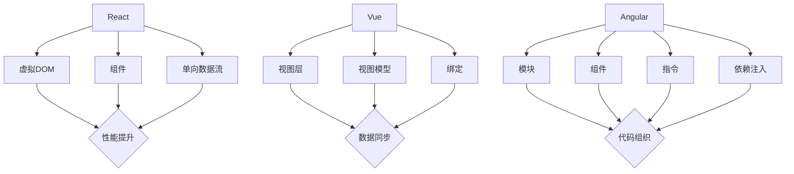

                 

# Web前端技术栈：React、Vue和Angular的比较

> **关键词**：Web前端技术栈，React，Vue，Angular，比较，特点，应用场景
>
> **摘要**：本文将从多个维度对比分析React、Vue和Angular三大主流Web前端框架，涵盖其核心概念、架构设计、使用场景等，帮助开发者更好地理解与选择适合自己项目的框架。

## 1. 背景介绍

在Web开发领域，前端技术栈的选择往往决定了项目的性能、可维护性和开发效率。随着技术的不断发展，React、Vue和Angular逐渐成为了前端开发的主流框架。这三种框架各有其独特的优势和特点，被广泛应用于各种规模的Web项目中。

- **React** 由Facebook推出，于2013年首次公开发布。React采用虚拟DOM、组件化设计，使得前端开发更加高效、灵活。
- **Vue** 由尤雨溪（Evan You）于2014年创建，其简洁的语法和双向数据绑定特性受到了广大开发者的喜爱。
- **Angular** 由Google开发，首次发布于2016年。Angular作为一款成熟的全功能框架，提供了丰富的功能和强大的工具集。

## 2. 核心概念与联系

### 2.1 核心概念

#### React

React的核心概念包括虚拟DOM（Virtual DOM）、组件（Component）和单向数据流（Unidirectional Data Flow）。虚拟DOM通过将组件的状态变化映射到实际的DOM操作，减少了直接操作DOM的次数，从而提高了性能。组件化设计使得代码更加模块化，易于复用和维护。单向数据流保证了数据的一致性和可预测性。

#### Vue

Vue的核心概念包括视图层（View）、视图模型（ViewModel）和视图层与视图模型之间的绑定（Binding）。Vue通过双向数据绑定，将视图和模型紧密连接，实现了数据与视图的同步更新。组件化设计使得Vue的代码结构更加清晰。

#### Angular

Angular的核心概念包括模块（Module）、组件（Component）、指令（Directive）和依赖注入（Dependency Injection）。模块负责组织代码，组件是视图和逻辑的组合，指令用于自定义DOM行为，依赖注入则确保组件能够获取所需的资源和服务。

### 2.2 联系

虽然React、Vue和Angular在核心概念上有所不同，但它们都具备以下共同点：

- 组件化设计：通过组件将UI划分为更小的模块，提高代码的可维护性和可复用性。
- 数据绑定：实现数据与视图的自动同步，减少手动操作DOM的频率。
- 虚拟DOM：通过虚拟DOM提高渲染性能。

### 2.3 Mermaid流程图

以下是React、Vue和Angular核心概念的Mermaid流程图：



## 3. 核心算法原理 & 具体操作步骤

### 3.1 React

#### 虚拟DOM

React通过虚拟DOM实现高效的UI渲染。虚拟DOM是一种内存中的数据结构，代表了实际的DOM结构。当组件的状态发生变化时，React会根据新的状态生成一个新的虚拟DOM，然后与旧的虚拟DOM进行比较，找出差异，并只对发生变化的部分进行实际的DOM操作。

#### 组件

组件是React的基本构建块。组件可以接受属性（props）作为输入，并返回一个表示UI结构的JSX元素。组件可以是函数组件或类组件。函数组件通过返回JSX元素来渲染UI，而类组件则继承了React.Component类，并使用this.state和this.props来管理状态和属性。

#### 单向数据流

React的单向数据流确保了数据的一致性和可预测性。数据从父组件流向子组件，而组件的状态只能通过更新函数（如setState）来修改。这种数据流方式避免了复杂的交叉依赖和状态管理问题。

### 3.2 Vue

#### 双向数据绑定

Vue通过观察者模式实现双向数据绑定。当数据发生变化时，视图会自动更新。同样，当视图发生变化时，数据也会同步更新。Vue使用Object.defineProperty为每个数据属性创建getter和setter，从而实现数据变化时的监听和更新。

#### 组件

Vue的组件与React类似，也是通过返回JSX元素或模板来渲染UI。Vue组件可以接受props作为属性，并使用data、methods、computed等选项来定义组件的行为和数据。

#### 绑定

Vue提供了丰富的绑定语法，包括v-bind、v-model、v-on等。这些语法使得数据与视图的绑定更加直观和灵活。

### 3.3 Angular

#### 模块

Angular中的模块负责组织代码。模块可以使用`@NgModule`装饰器来定义，其中包含了模块的元数据，如导入的模块、提供的组件、指令等。

#### 组件

Angular的组件是通过模板（HTML文件）来定义的。模板中包含了组件的结构和样式，并且可以通过数据绑定来显示组件的状态和属性。

#### 指令

指令是Angular中的核心概念之一。指令用于自定义DOM行为，例如，`ngFor`指令用于生成列表，`ngIf`指令用于条件渲染。

#### 依赖注入

依赖注入是Angular的核心特性之一。通过依赖注入，组件可以自动获取其所需的资源和服务，从而实现代码的解耦和可测试性。

## 4. 数学模型和公式 & 详细讲解 & 举例说明

### 4.1 React

#### 虚拟DOM

React中的虚拟DOM可以通过以下公式计算：

```latex
V_{\text{DOM}} = f(\text{state}, \text{props})
```

其中，`V_{\text{DOM}}`表示虚拟DOM，`f`是一个映射函数，`state`和`props`分别表示组件的状态和属性。

#### 示例

假设一个简单的计数器组件，其状态为`count`：

```jsx
class Counter extends React.Component {
  state = {
    count: 0,
  };

  increment = () => {
    this.setState({ count: this.state.count + 1 });
  };

  decrement = () => {
    this.setState({ count: this.state.count - 1 });
  };

  render() {
    return (
      <div>
        <span>{this.state.count}</span>
        <button onClick={this.increment}>+</button>
        <button onClick={this.decrement}>-</button>
      </div>
    );
  }
}
```

当点击“+”或“-”按钮时，`setState`函数会触发虚拟DOM的更新，并计算出新的虚拟DOM。React会将新的虚拟DOM与旧的虚拟DOM进行比较，找出差异，并只对发生变化的部分进行实际的DOM操作。

### 4.2 Vue

#### 双向数据绑定

Vue中的双向数据绑定可以通过以下公式表示：

```latex
\text{model} \Leftrightarrow \text{view}
```

其中，`model`表示模型（数据），`view`表示视图（UI）。

#### 示例

假设一个简单的计数器组件，其数据为`count`：

```html
<div id="app">
  <span>{{ count }}</span>
  <button @click="increment">+</button>
  <button @click="decrement">-</button>
</div>
```

```javascript
new Vue({
  el: '#app',
  data: {
    count: 0,
  },
  methods: {
    increment() {
      this.count++;
    },
    decrement() {
      this.count--;
    },
  },
});
```

当点击“+”或“-”按钮时，Vue会自动更新视图和模型，实现双向数据绑定。

### 4.3 Angular

#### 模块

Angular中的模块可以通过以下公式定义：

```javascript
@NgModule({
  imports: [RouterModule.forRoot(routes)],
  declarations: [AppComponent],
  exports: [AppComponent],
  bootstrap: [AppComponent],
})
export class AppModule {}
```

其中，`imports`表示导入的模块，`declarations`表示提供的组件，`exports`表示导出的组件，`bootstrap`表示引导组件。

#### 组件

Angular的组件可以通过以下公式表示：

```html
<div [ngClass]="{'active': isActive}">
  <h2>{{ title }}</h2>
  <p>{{ content }}</p>
</div>
```

其中，`ngClass`和`ngFor`是Angular的内置指令，用于动态更新类名和列表。

## 5. 项目实战：代码实际案例和详细解释说明

### 5.1 开发环境搭建

为了更好地比较React、Vue和Angular的实战应用，我们将搭建一个简单的待办事项（To-Do List）应用。以下是三个框架的搭建步骤：

#### React

1. 安装Node.js和npm。
2. 使用`create-react-app`脚手架创建新项目：

   ```bash
   npx create-react-app todo-list
   ```

3. 进入项目目录并启动开发服务器：

   ```bash
   cd todo-list
   npm start
   ```

#### Vue

1. 安装Node.js和npm。
2. 使用`vue-cli`脚手架创建新项目：

   ```bash
   npm install -g @vue/cli
   vue create todo-list
   ```

3. 进入项目目录并启动开发服务器：

   ```bash
   cd todo-list
   npm run serve
   ```

#### Angular

1. 安装Node.js和npm。
2. 使用`ng`命令创建新项目：

   ```bash
   npm install -g @angular/cli
   ng new todo-list
   ```

3. 进入项目目录并启动开发服务器：

   ```bash
   cd todo-list
   ng serve
   ```

### 5.2 源代码详细实现和代码解读

以下是React、Vue和Angular的待办事项应用的源代码及其解读。

#### React

```jsx
// App.js
import React, { useState } from 'react';
import './App.css';

function App() {
  const [todos, setTodos] = useState([]);

  const addTodo = (todo) => {
    setTodos([...todos, todo]);
  };

  const removeTodo = (index) => {
    const newTodos = [...todos];
    newTodos.splice(index, 1);
    setTodos(newTodos);
  };

  return (
    <div className="App">
      <h1>To-Do List</h1>
      <ul>
        {todos.map((todo, index) => (
          <li key={index}>
            {todo}
            <button onClick={() => removeTodo(index)}>X</button>
          </li>
        ))}
      </ul>
      <input type="text" placeholder="Add a new todo" onKeyPress={(e) => {
        if (e.key === 'Enter') {
          addTodo(e.target.value);
          e.target.value = '';
        }
      }} />
    </div>
  );
}

export default App;
```

解读：React应用通过`useState`钩子管理待办事项列表。`addTodo`和`removeTodo`函数用于添加和移除待办事项。当用户在输入框中按回车键时，`addTodo`函数会被触发，将输入的内容添加到待办事项列表中。

#### Vue

```html
<!-- App.vue -->
<template>
  <div class="app">
    <h1>To-Do List</h1>
    <ul>
      <li v-for="(todo, index) in todos" :key="index">
        {{ todo }}
        <button @click="removeTodo(index)">X</button>
      </li>
    </ul>
    <input type="text" placeholder="Add a new todo" @keypress.enter="addTodo" />
  </div>
</template>

<script>
export default {
  data() {
    return {
      todos: [],
    };
  },
  methods: {
    addTodo(todo) {
      this.todos.push(todo);
    },
    removeTodo(index) {
      this.todos.splice(index, 1);
    },
  },
};
</script>
```

解读：Vue应用使用`v-for`指令生成待办事项列表，使用`v-model`实现输入框的双向数据绑定。当用户在输入框中按回车键时，`addTodo`函数会被触发，将输入的内容添加到待办事项列表中。

#### Angular

```html
<!-- app.component.html -->
<div class="app">
  <h1>To-Do List</h1>
  <ul>
    <li *ngFor="let todo of todos; let i = index">
      {{ todo }}
      <button (click)="removeTodo(i)">X</button>
    </li>
  </ul>
  <input type="text" placeholder="Add a new todo" (keypress)="addTodo($event.target.value)" />
</div>
```

```javascript
// app.component.ts
import { Component } from '@angular/core';

@Component({
  selector: 'app-root',
  templateUrl: './app.component.html',
  styleUrls: ['./app.component.css'],
})
export class AppComponent {
  todos = [];

  addTodo(todo) {
    this.todos.push(todo);
  }

  removeTodo(index) {
    this.todos.splice(index, 1);
  }
}
```

解读：Angular应用使用`*ngFor`指令生成待办事项列表，使用`ngModel`实现输入框的双向数据绑定。当用户在输入框中按回车键时，`addTodo`函数会被触发，将输入的内容添加到待办事项列表中。

### 5.3 代码解读与分析

通过对比React、Vue和Angular的待办事项应用代码，我们可以看到：

- **数据管理**：React和Vue使用状态管理（useState和data选项）来管理待办事项列表，Angular使用本地数据管理（ngModel）来实现类似功能。
- **UI渲染**：React、Vue和Angular都使用了列表渲染（JSX、v-for、*ngFor）来生成待办事项列表。
- **交互处理**：React、Vue和Angular都提供了简单的方法（addTodo和removeTodo）来添加和移除待办事项。

## 6. 实际应用场景

### 6.1 React

React适用于以下场景：

- **大型应用**：React的组件化和虚拟DOM特性使其非常适合构建大型单页面应用（SPA）。
- **高性能需求**：React的虚拟DOM和高效的状态管理使得React在处理大量数据和复杂UI时具备较高的性能。
- **跨平台开发**：React Native使得React可以用于构建跨平台移动应用。

### 6.2 Vue

Vue适用于以下场景：

- **中小型应用**：Vue的简洁语法和快速开发特性使其非常适合中小型应用和初创项目。
- **双向数据绑定**：Vue的双向数据绑定特性使得Vue在处理表单和用户交互时具有较高的灵活性。
- **渐进式框架**：Vue可以作为渐进式框架与现有项目结合，逐步引入Vue的功能。

### 6.3 Angular

Angular适用于以下场景：

- **企业级应用**：Angular提供了丰富的功能和工具集，适合构建大型企业级应用。
- **代码组织**：Angular的模块和组件设计有助于代码的组织和管理。
- **依赖注入**：Angular的依赖注入机制使得组件的依赖管理更加清晰和可测试。

## 7. 工具和资源推荐

### 7.1 学习资源推荐

- **React**：
  - 《React Up & Running》
  - 《Learning React for Modern Applications》
  - React官方文档（[https://reactjs.org/docs/getting-started.html](https://reactjs.org/docs/getting-started.html)）
- **Vue**：
  - 《Vue.js Up and Running》
  - 《Vue 2 Up and Running》
  - Vue官方文档（[https://vuejs.org/v2/guide/](https://vuejs.org/v2/guide/)）
- **Angular**：
  - 《Angular Up and Running》
  - 《Angular: Up and Running》
  - Angular官方文档（[https://angular.io/tutorial](https://angular.io/tutorial)）

### 7.2 开发工具框架推荐

- **React**：
  - Create React App（[https://create-react-app.com/](https://create-react-app.com/)）
  - Next.js（[https://nextjs.org/](https://nextjs.org/)）
- **Vue**：
  - Vue CLI（[https://vuejs.org/v2/guide/installation.html](https://vuejs.org/v2/guide/installation.html)）
  - Vite（[https://vitejs.cn/](https://vitejs.cn/)）
- **Angular**：
  - Angular CLI（[https://angular.io/cli](https://angular.io/cli)）
  - NestJS（[https://nestjs.com/](https://nestjs.com/)）

### 7.3 相关论文著作推荐

- **React**：
  - "The Virtual DOM"（[https://dev.to/bradrydzewski/the-virtual-dom-4g9o](https://dev.to/bradrydzewski/the-virtual-dom-4g9o)）
  - "Unidirectional Data Flow in React"（[https://reactjs.org/docs/unidirectional-data-flow.html](https://reactjs.org/docs/unidirectional-data-flow.html)）
- **Vue**：
  - "Vue.js Data Binding"（[https://vuejs.org/v2/guide/bindings.html](https://vuejs.org/v2/guide/bindings.html)）
  - "Vue.js Components"（[https://vuejs.org/v2/guide/components.html](https://vuejs.org/v2/guide/components.html)）
- **Angular**：
  - "Angular Dependency Injection"（[https://angular.io/guide/dependency-injection](https://angular.io/guide/dependency-injection)）
  - "Angular Modules and Components"（[https://angular.io/guide/modules](https://angular.io/guide/modules)）

## 8. 总结：未来发展趋势与挑战

随着Web技术的发展，React、Vue和Angular将继续在Web前端领域发挥重要作用。未来，这三个框架可能会在以下方面取得突破：

- **性能优化**：通过引入更高效的渲染算法和虚拟DOM实现，提高应用性能。
- **跨平台支持**：进一步拓展跨平台开发能力，实现Web、移动端和桌面端的统一开发。
- **模块化**：不断完善模块化设计，提高代码的可维护性和可复用性。
- **智能辅助**：利用人工智能技术，提供智能代码提示、错误检测和优化建议。

同时，开发者也需要关注以下挑战：

- **框架选择**：在多种前端框架中做出合适的选择，以满足不同项目的需求。
- **代码组织**：随着项目规模的扩大，如何保持代码结构的清晰和可维护性。
- **性能优化**：在保证功能完整性的同时，优化应用性能，提升用户体验。

## 9. 附录：常见问题与解答

### 9.1 React相关问题

**Q：为什么React使用虚拟DOM？**

A：React使用虚拟DOM是为了提高渲染性能。虚拟DOM通过将组件的状态变化映射到实际的DOM操作，减少了直接操作DOM的次数，从而提高了应用的性能。

**Q：React的单向数据流有何优势？**

A：单向数据流保证了数据的一致性和可预测性，避免了复杂的交叉依赖和状态管理问题，使得应用更加易于理解和维护。

### 9.2 Vue相关问题

**Q：Vue的双向数据绑定是如何实现的？**

A：Vue通过观察者模式实现双向数据绑定。当数据发生变化时，视图会自动更新。同样，当视图发生变化时，数据也会同步更新。

**Q：Vue组件有哪些生命周期钩子？**

A：Vue组件的生命周期钩子包括`created`、`mounted`、`updated`和`destroyed`。这些钩子用于在组件的不同阶段执行特定的操作。

### 9.3 Angular相关问题

**Q：什么是Angular的依赖注入？**

A：Angular的依赖注入是一种机制，通过它，组件可以自动获取其所需的资源和服务，从而实现代码的解耦和可测试性。

**Q：什么是Angular的模块？**

A：Angular的模块是一种组织代码的方式。模块负责组织组件、指令、管道等，并定义了模块的导入和导出，使得代码结构更加清晰。

## 10. 扩展阅读 & 参考资料

- **React**：
  - [React官网](https://reactjs.org/)
  - [React Hooks](https://reactjs.org/docs/hooks-intro.html)
  - [React Router](https://reactrouter.com/)
- **Vue**：
  - [Vue官网](https://vuejs.org/)
  - [Vue Router](https://router.vuejs.org/)
  - [Vuex](https://vuex.vuejs.org/)
- **Angular**：
  - [Angular官网](https://angular.io/)
  - [Angular CLI](https://cli.angular.io/)
  - [NestJS](https://nestjs.com/)

## 作者

**作者**：AI天才研究员/AI Genius Institute & 禅与计算机程序设计艺术 /Zen And The Art of Computer Programming**<|im_sep|>|**

