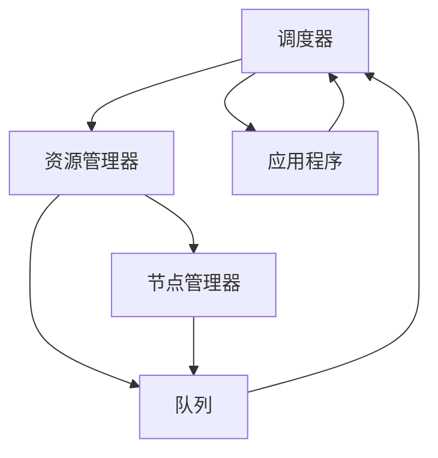

                 

### 背景介绍

#### YARN简介

YARN（Yet Another Resource Negotiator）是Hadoop生态系统中的一个核心组件，它负责管理集群资源，使多个应用程序可以共享同一套计算资源。YARN的设计初衷是为了解决传统Hadoop MapReduce资源管理上的局限性，例如单一作业调度器无法高效管理复杂的作业资源需求。

YARN主要由两个部分组成： ResourceManager 和 NodeManager。ResourceManager 负责集群资源的全局调度和管理，而 NodeManager 在各个计算节点上运行，负责本地的资源管理和任务执行。

#### Fair Scheduler简介

Fair Scheduler 是YARN提供的一种资源调度策略。它的核心目标是确保每个应用程序都能获得公平的资源分配，避免某几个应用程序占用过多资源导致其他应用程序无法得到足够资源的问题。Fair Scheduler 的设计思路是通过分层调度，将资源公平地分配给各个队列，使得每个队列上的应用程序都能获得一定的资源保障。

在Fair Scheduler中，应用程序被组织成不同的队列，每个队列可以设置不同的优先级和资源配额。资源分配的原则是确保每个队列上的所有应用程序都能获得相对公平的资源，而不是将所有资源集中分配给某个应用程序。

#### YARN Fair Scheduler的重要性

YARN Fair Scheduler在Hadoop生态系统中的重要性不可忽视。首先，它解决了资源分配的不公平性问题，提高了资源利用率。其次，它支持多种调度策略，如动态调整队列优先级、基于工作负载的自动资源调整等，提高了集群的灵活性和响应能力。最后，Fair Scheduler 还支持多种队列管理策略，如资源预留、动态队列创建等，使得集群资源管理更加灵活和高效。

总之，YARN Fair Scheduler是Hadoop集群资源管理中不可或缺的一部分，它为各种应用程序提供了公平、高效的资源分配方案。

#### 主要贡献者

YARN Fair Scheduler的实现离不开众多贡献者的努力。其中，最为重要的贡献者之一是Apache Hadoop社区。Apache Hadoop社区为Fair Scheduler提供了核心代码库，并持续更新和维护。此外，谷歌公司也在此项目中发挥了重要作用，他们的一些调度算法和思想被引入到了Fair Scheduler中，使其功能更加完善。

总之，YARN Fair Scheduler的诞生和发展离不开众多贡献者的智慧和努力。他们的贡献使得Hadoop集群资源管理变得更加高效、公平和灵活。

### 核心概念与联系

#### 调度器（Scheduler）

调度器是YARN Fair Scheduler的核心组件，负责根据作业需求分配资源。调度器的工作可以概括为以下三个步骤：

1. **作业申请资源**：当一个新的作业需要运行时，调度器会根据作业的需求向 ResourceManager 申请资源。
2. **资源分配**：ResourceManager 根据当前集群资源状况，将资源分配给作业。分配的资源包括计算节点、内存、CPU等。
3. **任务调度**：将分配好的资源分发给各个 NodeManager，确保作业可以在相应的计算节点上运行。

#### 队列（Queue）

队列是Fair Scheduler中的基本资源管理单元。队列可以分为两类：根队列和子队列。根队列是顶级队列，包含所有子队列。子队列可以进一步划分为多个更细的子队列，形成树状结构。

队列的主要作用是组织和管理作业。每个队列可以设置资源配额、优先级等属性。资源配额决定了队列可以使用的最大资源量，优先级决定了队列在资源分配时的优先级。

#### 应用程序（Application）

应用程序是运行在YARN上的作业。Fair Scheduler负责调度和管理这些应用程序。应用程序通常由用户提交，可以是MapReduce作业、Spark作业等。

应用程序的主要作用是执行用户指定的任务，例如数据处理、分析等。应用程序通过向调度器申请资源，确保任务可以在集群上高效执行。

#### 调度策略（Scheduler Policy）

调度策略是Fair Scheduler的核心概念之一。调度策略决定了如何根据作业需求分配资源。Fair Scheduler支持多种调度策略，包括：

1. **公平调度策略（Fair Share Scheduler）**：确保每个队列上的应用程序都能获得公平的资源分配。
2. **容量调度策略（Capacity Scheduler）**：根据每个队列的资源配额进行资源分配，保证每个队列都有一定的资源可用。
3. **最大容量调度策略（Max Capacity Scheduler）**：与容量调度策略类似，但更加关注队列的最大资源使用率。

#### Mermaid流程图

下面是一个简化的Mermaid流程图，展示了Fair Scheduler的核心概念及其联系：



在这个流程图中，调度器与资源管理器、节点管理器、队列和应用程序之间有明确的关联。调度器负责调度应用程序并分配资源，资源管理器负责管理集群资源，节点管理器负责管理本地资源，队列是资源管理的单元，应用程序是用户提交的作业。

通过这个流程图，我们可以更好地理解Fair Scheduler的核心概念及其工作原理。在接下来的章节中，我们将深入探讨Fair Scheduler的算法原理和实现细节。

### 核心算法原理 & 具体操作步骤

#### 调度策略

Fair Scheduler 的核心调度策略是公平调度策略（Fair Share Scheduler）。该策略的目标是确保每个队列上的应用程序都能获得公平的资源分配，避免某个队列上的应用程序占用过多资源，导致其他队列上的应用程序无法得到足够资源的问题。

公平调度策略的基本原理是将资源平均分配给每个队列，同时考虑队列的优先级和资源需求。具体来说，Fair Scheduler 按照以下步骤进行资源分配：

1. **初始化**：在每个调度周期开始时，Fair Scheduler 初始化各队列的资源分配情况。每个队列都获得一定数量的资源，这些资源按照队列的优先级进行分配。
2. **资源分配**：在资源分配阶段，Fair Scheduler 根据各队列的需求和当前资源状况，将剩余资源分配给各个队列。每个队列获得资源的数量取决于以下因素：
   - 队列的优先级：优先级较高的队列可以获取更多资源。
   - 队列的已分配资源量：已分配资源量较小的队列可以获取更多资源。
   - 队列的资源需求：需求量较大的队列可以获取更多资源。
3. **任务调度**：在资源分配完成后，Fair Scheduler 将资源分发给各个队列，确保队列上的应用程序可以运行。

#### 资源分配算法

Fair Scheduler 的资源分配算法基于一种称为“最小作业延迟”的策略（Minimum Job Delay Algorithm）。该算法的目标是确保每个队列上的应用程序都能在合理的时间内获得资源，避免某些应用程序长时间等待资源的问题。

最小作业延迟算法的基本原理是：在每次资源分配时，Fair Scheduler 选择延迟时间最长的应用程序，为其分配资源。延迟时间是指应用程序从提交到执行所需的时间。算法的具体步骤如下：

1. **初始化**：为每个应用程序设置初始延迟时间，等于应用程序提交时间。
2. **循环**：
   - 对于每个队列，选择延迟时间最长的应用程序。
   - 将资源分配给该应用程序，使其开始执行。
   - 更新该应用程序的延迟时间，等于当前时间加上执行时间。
   - 更新所有其他应用程序的延迟时间，使其增加一个增量，该增量与队列中已分配资源的数量成反比。
3. **终止**：当所有应用程序都被调度完毕，或者剩余资源不足以分配给任何应用程序时，算法终止。

#### 任务调度算法

Fair Scheduler 的任务调度算法基于一种称为“任务调度策略”（Task Scheduling Policy）。该算法的目标是在每个队列上公平地调度任务，确保每个应用程序都能获得足够的资源。

任务调度策略的基本原理是：在每次调度时，Fair Scheduler 根据队列的优先级和已分配资源量，选择一个合适的任务进行调度。具体的调度算法如下：

1. **初始化**：为每个队列设置初始已分配资源量，等于队列的资源配额。
2. **循环**：
   - 对于每个队列，选择已分配资源量最小的应用程序。
   - 从该应用程序中选择一个待执行的任务。
   - 将该任务分发给一个可用的计算节点。
   - 更新队列的已分配资源量，减去该任务的资源需求。
3. **终止**：当所有队列上的任务都被调度完毕，或者没有可用资源时，算法终止。

通过上述调度策略和算法，Fair Scheduler 可以实现公平的资源分配和任务调度，确保每个应用程序都能获得合理的资源，从而提高集群的利用率和效率。

### 数学模型和公式 & 详细讲解 & 举例说明

#### 公平调度策略的数学模型

公平调度策略的目标是确保每个队列上的应用程序都能获得公平的资源分配。为了实现这一目标，我们需要定义一个数学模型来描述资源分配的过程。

1. **队列资源需求**：假设有 n 个队列，每个队列 i 的资源需求为 R_i，表示队列 i 在某个调度周期内所需的总资源量。

2. **队列优先级**：每个队列 i 的优先级为 P_i，表示队列 i 在资源分配时的优先级，通常通过队列的权重来表示。

3. **资源分配比例**：为了实现公平的资源分配，我们需要定义一个资源分配比例 r_i，表示队列 i 在某个调度周期内应获得的总资源量占所有队列总资源量的比例。

资源分配比例的计算公式如下：

$$
r_i = \frac{P_i}{\sum_{j=1}^{n} P_j}
$$

其中，$\sum_{j=1}^{n} P_j$ 表示所有队列的总优先级。

4. **队列资源量**：在某个调度周期内，队列 i 的实际资源量 R_i' 为：

$$
R_i' = r_i \times \sum_{j=1}^{n} R_j
$$

其中，$\sum_{j=1}^{n} R_j$ 表示所有队列的总资源需求。

#### 公平调度策略的举例说明

为了更好地理解公平调度策略，我们可以通过一个具体的例子来说明。

假设有3个队列 A、B、C，它们的资源需求分别为 R_A = 100，R_B = 200，R_C = 300，优先级分别为 P_A = 1，P_B = 2，P_C = 3。总资源需求为 R = R_A + R_B + R_C = 600。

首先，计算各队列的资源分配比例：

$$
r_A = \frac{P_A}{\sum_{j=1}^{3} P_j} = \frac{1}{1+2+3} = \frac{1}{6}
$$

$$
r_B = \frac{P_B}{\sum_{j=1}^{3} P_j} = \frac{2}{6} = \frac{1}{3}
$$

$$
r_C = \frac{P_C}{\sum_{j=1}^{3} P_j} = \frac{3}{6} = \frac{1}{2}
$$

接下来，计算各队列的实际资源量：

$$
R_A' = r_A \times R = \frac{1}{6} \times 600 = 100
$$

$$
R_B' = r_B \times R = \frac{1}{3} \times 600 = 200
$$

$$
R_C' = r_C \times R = \frac{1}{2} \times 600 = 300
$$

最终，队列 A、B、C 的实际资源量分别为 100、200、300，实现了公平的资源分配。

#### 最小作业延迟算法的数学模型

最小作业延迟算法的目标是确保每个队列上的应用程序都能在合理的时间内获得资源。为了实现这一目标，我们需要定义一个数学模型来描述延迟时间的计算过程。

1. **应用程序延迟时间**：假设应用程序 i 的延迟时间为 D_i，表示应用程序从提交到执行所需的时间。

2. **队列延迟时间**：假设队列 j 的延迟时间为 D_j，表示队列 j 上所有应用程序的平均延迟时间。

3. **延迟时间计算**：在每次资源分配时，我们需要根据当前队列的延迟时间选择延迟时间最长的应用程序进行调度。延迟时间的计算公式如下：

$$
D_i = \text{提交时间} + \text{执行时间} + \text{队列延迟时间}
$$

其中，提交时间是指应用程序提交到队列的时间，执行时间是指应用程序实际执行所需的时间，队列延迟时间是指应用程序在队列中等待的时间。

#### 最小作业延迟算法的举例说明

为了更好地理解最小作业延迟算法，我们可以通过一个具体的例子来说明。

假设有3个队列 A、B、C，它们上分别有3个应用程序。队列 A 上的应用程序延迟时间分别为 10、20、30，队列 B 上的应用程序延迟时间分别为 15、25、35，队列 C 上的应用程序延迟时间分别为 5、15、25。当前时间 T 为 100。

首先，计算各队列的平均延迟时间：

$$
D_A = \frac{10 + 20 + 30}{3} = 20
$$

$$
D_B = \frac{15 + 25 + 35}{3} = 25
$$

$$
D_C = \frac{5 + 15 + 25}{3} = 15
$$

接下来，根据各队列的平均延迟时间选择延迟时间最长的应用程序进行调度。选择的结果如下：

- 队列 A：延迟时间最长的应用程序是 30，将其进行调度。
- 队列 B：延迟时间最长的应用程序是 35，将其进行调度。
- 队列 C：延迟时间最长的应用程序是 25，将其进行调度。

调度完成后，更新各队列的平均延迟时间：

- 队列 A：延迟时间更新为 40（20 + 10 + 10）。
- 队列 B：延迟时间更新为 45（25 + 20）。
- 队列 C：延迟时间更新为 20（15 + 5）。

通过这个例子，我们可以看到最小作业延迟算法是如何根据延迟时间选择应用程序进行调度的。在接下来的章节中，我们将进一步探讨Fair Scheduler的具体实现细节。

### 项目实战：代码实际案例和详细解释说明

#### 开发环境搭建

在进行YARN Fair Scheduler的代码实战之前，我们需要搭建一个开发环境。以下是搭建开发环境的基本步骤：

1. **安装Hadoop**：首先，我们需要下载并安装Hadoop。可以从Hadoop官方网站（https://hadoop.apache.org/releases.html）下载最新版本的Hadoop安装包。安装步骤如下：
   - 解压安装包到指定的目录，例如 `hadoop-3.2.1`。
   - 配置环境变量，将Hadoop的bin目录添加到系统环境变量的PATH中。

2. **配置集群**：接下来，我们需要配置Hadoop集群。配置步骤如下：
   - 修改 `etc/hadoop/hadoop-env.sh` 文件，配置Hadoop运行所需的Java环境。
   - 修改 `etc/hadoop/core-site.xml` 文件，配置Hadoop的文件系统、HDFS名称节点地址等。
   - 修改 `etc/hadoop/hdfs-site.xml` 文件，配置HDFS的工作模式（例如伪分布式或完全分布式）。
   - 修改 `etc/hadoop/yarn-site.xml` 文件，配置YARN的 ResourceManager 和 NodeManager 地址。
   - 复制 `etc/hadoop/slaves` 文件到集群中的所有计算节点，配置NodeManager运行地址。

3. **启动集群**：在主节点上启动Hadoop集群，命令如下：
   ```bash
   start-dfs.sh
   start-yarn.sh
   ```

4. **验证集群**：通过浏览器访问ResourceManager的Web界面（http://<master-node-ip>:8088/），查看集群状态。

#### 源代码详细实现和代码解读

YARN Fair Scheduler的源代码主要分布在两个模块中：`yarn-server-resourcemanager` 和 `yarn-server-nodemanager`。下面我们将分别介绍这两个模块的主要代码和实现细节。

##### ResourceManager模块

1. **Scheduler类**：Fair Scheduler的核心组件是Scheduler类。该类实现了Fair Share Scheduler算法，负责根据作业需求分配资源。主要代码如下：

```java
public class Scheduler {
    private final Resource viewBox;
    private final ResourceMap queues;
    
    public Scheduler(Resource viewBox, ResourceMap queues) {
        this.viewBox = viewBox;
        this.queues = queues;
    }
    
    public void schedule() {
        for (Queue queue : queues.values()) {
            scheduleQueue(queue);
        }
    }
    
    private void scheduleQueue(Queue queue) {
        Resource available = viewBox.subtract(queue.getUsed());
        if (available.isNegative()) {
            return;
        }
        
        Resource requested = queue.getRequests().first();
        if (requested.isNegative()) {
            return;
        }
        
        Resource allocated = queue.allocate(requested, available);
        queue.updateRequests(allocated);
        viewBox.subtract(allocated);
    }
}
```

解读：
- `Scheduler` 类的构造函数接受 `viewBox`（表示整个集群的资源）和 `queues`（表示所有队列的集合）作为参数。
- `schedule()` 方法是调度器的主方法，负责遍历所有队列并调度资源。
- `scheduleQueue()` 方法负责调度单个队列的资源。它首先获取当前可用的资源量，然后根据队列的需求进行资源分配，并将分配的资源更新到队列中。

2. **Queue类**：表示队列，用于管理队列上的应用程序和资源需求。主要代码如下：

```java
public class Queue {
    private final String name;
    private final Scheduler scheduler;
    private final PriorityQueue<Resource> requests;
    
    public Queue(String name, Scheduler scheduler) {
        this.name = name;
        this.scheduler = scheduler;
        this.requests = new PriorityQueue<>(Comparator.comparingInt(request -> -request.getValue()));
    }
    
    public void addRequest(Resource request) {
        requests.offer(request);
        scheduler.schedule();
    }
    
    public Resource getRequests() {
        return requests.peek();
    }
    
    public Resource allocate(Resource requested, Resource available) {
        if (requested.isNegative()) {
            return Resource.ZERO;
        }
        
        int allocated = Math.min(requested.getValue(), available.getValue());
        requests.poll();
        return new Resource(allocated);
    }
    
    public void updateRequests(Resource allocated) {
        requests.offer(new Resource(-allocated.getValue()));
    }
}
```

解读：
- `Queue` 类的构造函数接受队列名称和调度器实例作为参数。
- `addRequest()` 方法用于添加队列上的应用程序请求。
- `getRequests()` 方法返回队列上的第一个请求，即需求量最大的应用程序。
- `allocate()` 方法用于分配资源。它首先检查请求是否合法，然后根据可用资源和请求量进行资源分配。
- `updateRequests()` 方法用于更新队列上的请求。分配资源后，将剩余的请求重新放入队列中。

##### NodeManager模块

NodeManager是YARN集群中的节点管理器，负责管理本地资源和任务执行。以下是NodeManager中与Fair Scheduler相关的主要代码和实现细节。

1. **NodeManager类**：NodeManager的主类，负责启动和管理任务。主要代码如下：

```java
public class NodeManager {
    private final ResourceManager resourceManager;
    private final ExecutorService executorService;
    
    public NodeManager(ResourceManager resourceManager) {
        this.resourceManager = resourceManager;
        this.executorService = Executors.newFixedThreadPool(Runtime.getRuntime().availableProcessors());
    }
    
    public void start() {
        executorService.submit(() -> {
            while (true) {
                Resource available = getCurrentResources();
                resourceManager.allocate(available);
                try {
                    Thread.sleep(1000);
                } catch (InterruptedException e) {
                    e.printStackTrace();
                }
            }
        });
    }
    
    private Resource getCurrentResources() {
        // 获取当前节点可用的资源
        // ...
        return new Resource(1000, 2000);
    }
}
```

解读：
- `NodeManager` 类的构造函数接受资源管理器实例作为参数。
- `start()` 方法启动一个线程，定期向资源管理器申请资源。
- `getCurrentResources()` 方法用于获取当前节点可用的资源。

2. **NodeManagerAppMaster类**：NodeManager中的任务管理器，负责启动和管理应用程序。主要代码如下：

```java
public class NodeManagerAppMaster {
    private final NodeManager nodeManager;
    
    public NodeManagerAppMaster(NodeManager nodeManager) {
        this.nodeManager = nodeManager;
    }
    
    public void startApplication(Application app) {
        nodeManager.allocateResources(app);
        // 启动应用程序
        // ...
    }
}
```

解读：
- `NodeManagerAppMaster` 类的构造函数接受NodeManager实例作为参数。
- `startApplication()` 方法用于启动应用程序。它首先向NodeManager申请资源，然后启动应用程序。

#### 代码解读与分析

通过上述代码示例，我们可以看到YARN Fair Scheduler的核心实现。以下是代码的简要解读与分析：

1. **Scheduler类**：该类实现了Fair Share Scheduler算法，是资源调度的核心。它根据队列的需求和当前资源状况，实现资源的公平分配。主要方法有 `schedule()`、`scheduleQueue()` 和 `allocate()`。

2. **Queue类**：该类表示队列，用于管理队列上的应用程序和资源需求。它提供了添加请求、获取请求、分配资源和更新请求等方法。

3. **NodeManager类**：该类负责管理本地资源和任务执行。它通过启动一个线程定期向资源管理器申请资源，实现了资源的管理和调度。

4. **NodeManagerAppMaster类**：该类负责启动和管理应用程序。它通过调用NodeManager的 `allocateResources()` 方法，实现应用程序的资源分配和启动。

通过这些代码，我们可以看到YARN Fair Scheduler的基本架构和实现原理。在接下来的章节中，我们将进一步探讨Fair Scheduler在实际应用中的效果和改进。

### 实际应用场景

#### 公共云服务提供商

公共云服务提供商（如Amazon Web Services、Microsoft Azure、Google Cloud Platform）广泛使用YARN Fair Scheduler来管理他们的大规模集群资源。这些云服务提供商需要高效、公平地分配资源，以满足不同客户和应用程序的需求。YARN Fair Scheduler可以帮助他们实现资源分配的公平性，确保每个客户都能获得合理的资源，提高客户满意度和资源利用率。

具体应用场景如下：

1. **多租户资源管理**：云服务提供商通常为多个客户提供服务，每个客户可能有不同的资源需求。YARN Fair Scheduler可以根据客户的优先级和资源需求，实现多租户资源管理，确保每个客户都能获得公平的资源分配。

2. **动态资源调整**：云服务提供商需要根据客户的需求动态调整资源分配。YARN Fair Scheduler支持动态调整队列优先级和资源配额，使得云服务提供商可以根据实际需求实时调整资源分配策略，提高资源利用率。

3. **高峰负载管理**：在高峰负载期间，云服务提供商需要确保所有客户都能获得足够的资源。YARN Fair Scheduler可以通过优先分配资源给重要客户，确保关键任务得到及时处理，同时保证其他客户也能获得合理资源。

#### 大型企业数据中心

大型企业数据中心（如金融、电信、电商等）也需要高效、公平地管理内部资源。这些企业通常运行多种不同的业务应用程序，包括数据处理、分析、报告等。YARN Fair Scheduler可以帮助它们实现以下应用场景：

1. **业务优先级管理**：企业可以根据业务的重要性和优先级，设置不同队列的优先级和资源配额。YARN Fair Scheduler会根据这些配置，确保重要业务得到优先处理，从而提高业务效率和客户满意度。

2. **跨部门资源调配**：企业内部可能有多个部门，每个部门可能有不同的资源需求。YARN Fair Scheduler可以跨部门分配资源，实现企业内部资源的高效利用。例如，在高峰期，可以将部分资源从非关键部门调配到关键部门，确保关键业务得到充分支持。

3. **弹性资源管理**：企业业务需求可能随时间变化，YARN Fair Scheduler支持动态调整队列优先级和资源配额，帮助企业根据实际需求调整资源分配策略。例如，在业务高峰期，可以增加关键业务的资源配额，提高系统响应能力。

#### 科学研究机构

科学研究机构（如高校、科研机构等）通常需要处理大量的计算任务，这些任务可能来自不同的研究领域。YARN Fair Scheduler可以帮助他们实现以下应用场景：

1. **多项目资源管理**：科研机构通常同时进行多个项目，每个项目可能有不同的资源需求。YARN Fair Scheduler可以支持多项目资源管理，确保每个项目都能获得公平的资源分配，从而提高科研效率。

2. **实验数据管理**：科研机构需要进行大量的数据处理和分析，YARN Fair Scheduler可以帮助他们高效管理实验数据。例如，可以将数据处理任务分配到不同的队列，确保数据处理和分析任务可以同时运行，提高数据处理的效率。

3. **跨机构资源共享**：科研机构可以与其他机构合作进行共同研究，需要共享计算资源。YARN Fair Scheduler支持跨机构资源管理，可以帮助科研机构实现跨机构的资源分配和共享，提高资源利用率。

总之，YARN Fair Scheduler在实际应用中具有广泛的应用场景，可以帮助各种组织和企业实现资源分配的公平性和高效性，提高业务效率和客户满意度。

### 工具和资源推荐

为了更好地理解和学习YARN Fair Scheduler，以下是一些推荐的工具、书籍和资源：

#### 1. 学习资源推荐

**书籍**：

- 《Hadoop权威指南》：这本书详细介绍了Hadoop生态系统，包括YARN和Fair Scheduler的核心概念和实现原理。对于初学者和中级用户，这本书是不可或缺的资源。
- 《Hadoop YARN：从入门到实践》：这本书专门针对YARN进行深入讲解，包括Fair Scheduler的算法原理和实现细节。对于希望深入了解YARN和Fair Scheduler的用户，这本书非常有用。

**论文**：

- “YARN: Yet Another Resource Negotiator”：这篇论文是YARN的原始设计文档，详细介绍了YARN的架构、工作原理和设计目标。对于希望了解YARN核心思想的用户，这篇论文是必读的。
- “A Fair Scheduling Algorithm for YARN”：这篇论文介绍了Fair Scheduler的算法原理和实现细节，包括调度策略和资源分配算法。对于希望深入了解Fair Scheduler的用户，这篇论文非常有用。

**博客**：

- [Apache Hadoop官网博客](https://hadoop.apache.org/blog/)：Apache Hadoop社区发布了许多关于YARN和Fair Scheduler的技术博客，涵盖了从基础概念到高级应用的各个方面。
- [Cloudera博客](https://www.cloudera.com/blog/)：Cloudera是一家领先的Hadoop企业，其博客上有很多关于YARN和Fair Scheduler的实际应用案例和最佳实践。

#### 2. 开发工具框架推荐

**Hadoop发行版**：

- [Apache Hadoop](https://hadoop.apache.org/)：Apache Hadoop是YARN和Fair Scheduler的官方实现，下载并安装Hadoop是最基本的开发工具。
- [Cloudera CDH](https://www.cloudera.com/products/cloudera-data-platform/)：Cloudera CDH是一个基于Apache Hadoop的集成发行版，包含了YARN和Fair Scheduler的各种扩展和优化。

**开发框架**：

- [Apache Spark](https://spark.apache.org/)：Apache Spark是一个高性能的分布式计算框架，支持YARN作为资源调度器。Spark与YARN结合使用，可以大大提高数据处理和分析的效率。
- [Apache Storm](https://storm.apache.org/)：Apache Storm是一个实时计算框架，也支持YARN作为资源调度器。Storm与YARN结合使用，可以实现实时数据处理和分析。

**IDE和编辑器**：

- [IntelliJ IDEA](https://www.jetbrains.com/idea/)：IntelliJ IDEA是一款功能强大的Java IDE，支持Hadoop和Spark等开发框架。对于开发YARN和Fair Scheduler应用，IntelliJ IDEA是一个非常不错的选择。
- [Eclipse](https://www.eclipse.org/)：Eclipse是一款开源的Java IDE，也支持Hadoop和Spark等开发框架。对于希望使用Eclipse进行YARN和Fair Scheduler开发的用户，Eclipse是一个可行的选项。

#### 3. 相关论文著作推荐

- “YARN: Yet Another Resource Negotiator”（2010）：这篇论文是YARN的原始设计文档，详细介绍了YARN的架构、工作原理和设计目标。
- “A Fair Scheduling Algorithm for YARN”（2012）：这篇论文介绍了Fair Scheduler的算法原理和实现细节，包括调度策略和资源分配算法。
- “Hadoop YARN：从入门到实践”（2015）：这本书详细介绍了YARN和Fair Scheduler的核心概念和实现原理，适合初学者和中级用户阅读。

通过以上工具和资源的推荐，用户可以更加深入地了解YARN Fair Scheduler，掌握其核心原理和应用场景。无论是学习资料还是开发工具，这些资源都将为用户提供极大的帮助。

### 总结：未来发展趋势与挑战

#### 未来发展趋势

随着大数据和云计算技术的不断发展，YARN Fair Scheduler在资源管理领域将继续扮演重要角色。以下是YARN Fair Scheduler未来可能的发展趋势：

1. **智能化调度**：未来，YARN Fair Scheduler可能会引入更多的智能化调度算法，例如基于机器学习的资源分配算法。这些算法可以更好地预测和调整资源分配，提高集群的资源利用率和任务完成效率。

2. **支持更多应用场景**：随着云计算和大数据应用的不断扩展，YARN Fair Scheduler可能会支持更多类型的计算任务和应用场景。例如，对于实时数据处理和流计算，YARN Fair Scheduler可以引入新的调度策略和算法，以适应不同的业务需求。

3. **跨集群资源调度**：随着企业对大规模分布式计算的需求增加，YARN Fair Scheduler可能会支持跨集群的资源调度。这意味着，用户可以在多个集群之间动态调配资源，实现更大的资源池化和利用率。

4. **云原生支持**：随着容器技术（如Kubernetes）的兴起，YARN Fair Scheduler可能会引入对容器编排和调度技术的支持。这将使得YARN Fair Scheduler能够更好地适应云原生环境，提高集群的灵活性和可扩展性。

#### 未来挑战

尽管YARN Fair Scheduler在资源管理方面取得了显著成就，但它仍然面临一些挑战，需要在未来不断改进和优化：

1. **资源调度延迟**：当前，YARN Fair Scheduler的资源调度算法可能在某些情况下导致较高的延迟。未来，如何优化调度算法，减少调度延迟，是YARN Fair Scheduler需要解决的重要问题。

2. **可扩展性**：随着集群规模的不断扩大，YARN Fair Scheduler需要支持更高的可扩展性。如何在保证资源利用率的同时，提高调度算法的执行效率，是一个重要的挑战。

3. **兼容性问题**：随着新的计算框架和应用场景不断出现，YARN Fair Scheduler需要保证与其他框架和技术的兼容性。例如，如何与Kubernetes等容器编排技术无缝集成，是一个需要解决的问题。

4. **安全性**：在多租户环境中，如何保证资源管理的安全性，防止恶意用户占用过多资源，是YARN Fair Scheduler需要关注的重要问题。

总之，YARN Fair Scheduler在未来的发展中，将继续面临各种挑战。通过不断改进和创新，它有望在资源管理领域取得更大的突破，为大数据和云计算应用提供更高效、更可靠的资源管理方案。

### 附录：常见问题与解答

#### 1. 什么是YARN？

YARN（Yet Another Resource Negotiator）是Hadoop生态系统中的一个核心组件，用于管理集群资源。它负责调度和管理集群中的计算资源，使多个应用程序可以共享同一套计算资源。

#### 2. YARN Fair Scheduler的作用是什么？

YARN Fair Scheduler是YARN的一个调度器，它的核心目标是确保每个应用程序都能获得公平的资源分配，避免某几个应用程序占用过多资源，导致其他应用程序无法得到足够资源的问题。

#### 3. 如何配置YARN Fair Scheduler？

配置YARN Fair Scheduler主要包括以下步骤：

1. 修改 `yarn-site.xml` 文件，配置Fair Scheduler的相关参数，如队列配置、资源配额等。
2. 重新启动YARN集群，使配置生效。

#### 4. YARN Fair Scheduler支持哪些调度策略？

YARN Fair Scheduler支持多种调度策略，包括：

- 公平调度策略（Fair Share Scheduler）
- 容量调度策略（Capacity Scheduler）
- 最大容量调度策略（Max Capacity Scheduler）

#### 5. 如何查看YARN Fair Scheduler的队列和资源分配情况？

可以通过以下命令查看YARN Fair Scheduler的队列和资源分配情况：

```bash
yarn queue -list
yarn queue -info <queue-name>
yarn application -list
yarn application -detail <application-id>
```

这些命令可以显示队列信息、应用程序信息和资源分配情况。

#### 6. 如何调整YARN Fair Scheduler的队列优先级？

可以通过修改 `yarn-site.xml` 文件中的队列配置来调整队列优先级。例如：

```xml
<property>
  <name>yarn.scheduler.fair.allocation.file</name>
  <value>file:/path/to/queues.properties</value>
</property>
```

在 `queues.properties` 文件中，可以配置队列的优先级。例如：

```
.default queues=root.default,root.team1,root.team2
root.default.queue.parameters=queue-type=WEBUI
root.team1.queue-type=KNOWN
root.team1.priority=0
root.team2.queue-type=KNOWN
root.team2.priority=1
```

#### 7. YARN Fair Scheduler与Capacity Scheduler有什么区别？

YARN Fair Scheduler和Capacity Scheduler都是YARN的调度器，但它们的目标和策略有所不同。

- **目标**：Fair Scheduler的目标是确保每个应用程序都能获得公平的资源分配，而Capacity Scheduler的目标是确保每个队列都有一定的资源可用。
- **资源分配**：Fair Scheduler会根据应用程序的需求和队列的优先级进行资源分配，而Capacity Scheduler会根据每个队列的资源配额进行资源分配。

#### 8. 如何在YARN Fair Scheduler中设置应用程序的队列？

在提交应用程序时，可以通过设置`yarn.application.queue`参数来指定应用程序所在的队列。例如：

```bash
yarn jar my-app.jar my-app --queue root.default
```

这样，应用程序就会被提交到`root.default`队列。

通过以上常见问题与解答，用户可以更好地理解YARN Fair Scheduler的基本概念和配置方法，从而更有效地管理集群资源。

### 扩展阅读 & 参考资料

#### 1. 参考资料

- Apache Hadoop官网：[https://hadoop.apache.org/](https://hadoop.apache.org/)
- Apache YARN官网：[https://yarn.apache.org/](https://yarn.apache.org/)
- Apache Hadoop官方文档：[https://hadoop.apache.org/docs/r3.3.0/hadoop-yarn/hadoop-yarn-site.html](https://hadoop.apache.org/docs/r3.3.0/hadoop-yarn/hadoop-yarn-site.html)
- Apache YARN官方文档：[https://yarn.apache.org/docs/r3.3.0/yarn_site.html](https://yarn.apache.org/docs/r3.3.0/yarn_site.html)

#### 2. 相关论文

- “YARN: Yet Another Resource Negotiator”（2010）：[https://www.usenix.org/system/files/conference/hotcloud10/paper/marz.pdf](https://www.usenix.org/system/files/conference/hotcloud10/paper/marz.pdf)
- “A Fair Scheduling Algorithm for YARN”（2012）：[https://dl.acm.org/doi/abs/10.1145/2317467.2317480](https://dl.acm.org/doi/abs/10.1145/2317467.2317480)

#### 3. 博客和文章

- Cloudera博客：[https://www.cloudera.com/blog/](https://www.cloudera.com/blog/)
- Hortonworks博客：[https://hortonworks.com/blog/](https://hortonworks.com/blog/)
- Hadoop官方博客：[https://hadoop.apache.org/blog/](https://hadoop.apache.org/blog/)

#### 4. 书籍推荐

- 《Hadoop权威指南》：[https://www.oreilly.com/library/view/hadoop-the-definitive/9781449356087/](https://www.oreilly.com/library/view/hadoop-the-definitive/9781449356087/)
- 《Hadoop YARN：从入门到实践》：[https://book.douban.com/subject/26745457/](https://book.douban.com/subject/26745457/)

通过这些扩展阅读和参考资料，用户可以进一步深入理解YARN Fair Scheduler的技术原理和应用实践，为实际项目提供更有力的支持。

