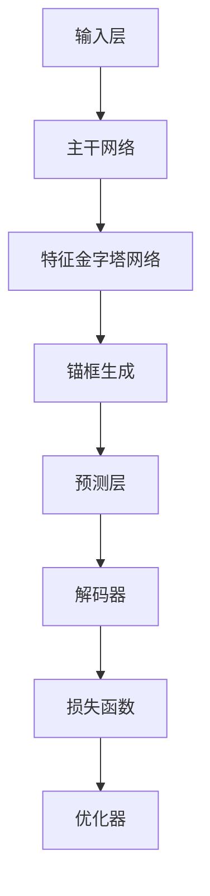

                 

### 背景介绍

#### YOLOv5的发展历程

YOLO（You Only Look Once）系列是深度学习领域里一个备受关注的对象检测框架。YOLOv5是YOLO系列的最新版本，继承了前几代YOLO框架的核心思想，即“一次只看一次（You Only Look Once）”。这个方法的最大优势在于其能够实现实时检测，极大提高了检测的效率和准确性。

YOLOv5的发展历程可以追溯到2015年，当时Joseph Redmon等人首次提出了YOLOv1。随后，YOLO系列不断更新，YOLOv2引入了 Anchor Box 的概念，YOLOv3进一步优化了网络结构，提出了 Darknet-53 作为主干网络，YOLOv4则引入了 CBAM 和 SPP 等新的模块，进一步提升了模型的性能。

YOLOv5相较于前几代模型，具有以下特点：

1. **改进的锚框生成策略**：YOLOv5引入了自回归锚框生成方法，使得生成的锚框更加精确，从而提高了检测的准确率。

2. **轻量级网络结构**：YOLOv5提出了YOLOv5s、YOLOv5m、YOLOv5l、YOLOv5x等多种不同尺度的网络结构，以满足不同应用场景的需求。

3. **精确的解码算法**：YOLOv5在解码过程中引入了 BiFPN（Bi-Directional Feature Pyramid Network），通过融合多尺度特征，提高了模型的检测能力。

4. **训练与推理速度**：YOLOv5通过优化网络结构和解码算法，显著提高了训练和推理的速度。

#### 为什么选择YOLOv5进行讲解

YOLOv5作为一个先进的目标检测框架，具有以下优点：

1. **实时检测**：YOLOv5的设计理念就是实现高效的实时检测，这对于需要实时分析的场景（如视频监控、自动驾驶等）尤为重要。

2. **高精度**：尽管YOLOv5追求实时性，但它的精度也不容小觑。通过引入各种先进的技术，如锚框生成策略的优化、特征金字塔网络等，YOLOv5在保持高效的同时，实现了较高的检测精度。

3. **易用性**：YOLOv5提供了丰富的预训练模型和成熟的工具集，使得用户可以快速上手并部署到实际应用中。

4. **开源社区支持**：YOLOv5的开源性质和活跃的社区使其成为了一个学习和实践的目标检测框架的理想选择。

因此，本文将深入探讨YOLOv5的原理与代码实现，旨在帮助读者更好地理解这个强大的目标检测框架，并能够在实际项目中应用和优化。

---

## 2. 核心概念与联系

#### YOLOv5的基本架构

YOLOv5的目标检测框架主要由以下几个关键部分组成：

1. **输入层（Input Layer）**：
   YOLOv5接收的输入图像通常是固定大小的，例如640x640或1280x1280。这种固定大小的输入有助于优化计算效率。

2. **主干网络（Backbone）**：
   YOLOv5的主干网络负责提取图像的高层次特征。通常采用类似ResNet或CSPDarknet等残差块结构，以确保特征的深层感知能力。

3. **特征金字塔网络（Feature Pyramid Network, FPN）**：
   FPN用于整合不同层次的特征，以实现多尺度目标的检测。YOLOv5使用了类似于YOLOv3的FPN结构，同时引入了BiFPN（Bi-Directional Feature Pyramid Network），进一步提升了特征的融合效果。

4. **锚框生成（Anchor Box Generation）**：
   锚框是YOLOv5用于预测目标位置的基准框。YOLOv5采用了自回归锚框生成策略，使得生成的锚框更加符合真实目标的分布。

5. **预测层（Prediction Layer）**：
   预测层负责生成预测框、类别概率和边界框置信度。YOLOv5使用了一个名为“YOLO Layer”的模块，该模块同时处理多个尺度上的特征图，生成预测结果。

6. **解码器（Decoder）**：
   YOLOv5的解码器用于将特征图解码成边界框、类别和置信度。解码过程包括调整边界框大小、计算类别概率和边界框置信度等。

7. **损失函数（Loss Function）**：
   YOLOv5使用多种损失函数来优化模型的预测。主要包括边界框预测损失、类别概率损失和边界框置信度损失等。

#### Mermaid流程图

下面是一个简化的YOLOv5流程图，用于展示其主要组件和它们之间的联系：



请注意，实际中的流程可能更加复杂，这里仅为了简化理解。

---

## 3. 核心算法原理 & 具体操作步骤

#### 输入层（Input Layer）

输入层是YOLOv5的起点，负责接收图像并进行预处理。具体操作步骤如下：

1. **图像读取**：首先，从数据集加载图像。图像可以是任何大小，但为了提高计算效率，通常将其调整为固定大小，例如640x640或1280x1280。

2. **归一化**：对图像进行归一化处理，通常将像素值缩放到0到1之间。这样可以加速模型的训练过程，并提高模型的泛化能力。

3. **数据增强**：为了增加模型的鲁棒性，可以采用数据增强技术，如随机裁剪、翻转、色度调整等。这些操作有助于模型更好地适应不同的图像变化。

```python
import torch
from torchvision import transforms

def preprocess_image(image_path):
    transform = transforms.Compose([
        transforms.Resize((640, 640)),  # 调整图像大小
        transforms.ToTensor(),           # 转换为Tensor
        transforms.Normalize(mean=[0.485, 0.456, 0.406], std=[0.229, 0.224, 0.225]),  # 归一化
    ])

    image = transform(Image.open(image_path))
    return image
```

#### 主干网络（Backbone）

主干网络是YOLOv5的核心，负责提取图像的高层次特征。以下是主干网络的构建步骤：

1. **构建基础网络**：通常使用类似于ResNet或CSPDarknet等残差块结构作为基础网络。这里以CSPDarknet为例：

```python
from torch import nn
from torchvision.models import resnet50

class CSPDarknet(nn.Module):
    def __init__(self, depth, Bottleneck):
        super(CSPDarknet, self).__init__()
        self.conv1 = nn.Conv2d(3, 32, 3, 1, 1)
        self.conv2 = nn.Conv2d(32, 64, 3, 2, 1)
        self.conv3 = nn.Conv2d(64, 128, 3, 2, 1)
        self.conv4 = nn.Conv2d(128, 256, 3, 2, 1)
        self.conv5 = nn.Conv2d(256, 512, 3, 2, 1)
        self.conv6 = nn.Conv2d(512, 1024, 3, 2, 1)
        self.Bottleneck = Bottleneck

        self.downsample1 = nn.Sequential(nn.Conv2d(32, 64, 1, 1, 0), nn.BatchNorm2d(64))
        self.downsample2 = nn.Sequential(nn.Conv2d(64, 128, 1, 1, 0), nn.BatchNorm2d(128))
        self.downsample3 = nn.Sequential(nn.Conv2d(128, 256, 1, 1, 0), nn.BatchNorm2d(256))
        self.downsample4 = nn.Sequential(nn.Conv2d(256, 512, 1, 1, 0), nn.BatchNorm2d(512))
        self.downsample5 = nn.Sequential(nn.Conv2d(512, 1024, 1, 1, 0), nn.BatchNorm2d(1024))

    def forward(self, x):
        out = self.conv1(x)
        out = self.conv2(out)
        out = self.downsample1(out)
        out = self.Bottleneck(out)
        out = self.conv3(out)
        out = self.downsample2(out)
        out = self.Bottleneck(out)
        out = self.conv4(out)
        out = self.downsample3(out)
        out = self.Bottleneck(out)
        out = self.conv5(out)
        out = self.downsample4(out)
        out = self.Bottleneck(out)
        out = self.conv6(out)
        out = self.downsample5(out)
        out = self.Bottleneck(out)
        return out
```

2. **构建深度残差块（Bottleneck）**：

```python
class Bottleneck(nn.Module):
    def __init__(self, in_channels, out_channels):
        super(Bottleneck, self).__init__()
        self.conv1 = nn.Conv2d(in_channels, out_channels, 1, 1, 0)
        self.conv2 = nn.Conv2d(out_channels, out_channels, 3, 1, 1)
        self.relu = nn.ReLU(inplace=True)

    def forward(self, x):
        identity = x
        out = self.conv1(x)
        out = self.relu(out)
        out = self.conv2(out)
        out = self.relu(out)
        out += identity
        return out
```

#### 特征金字塔网络（Feature Pyramid Network, FPN）

FPN用于整合不同层次的特征，以实现多尺度目标的检测。以下是FPN的构建步骤：

1. **构建多尺度特征层**：从主干网络的不同层提取特征图。

2. **特征融合**：使用上采样和特征融合操作，将不同尺度的特征图进行融合。

```python
class FPN(nn.Module):
    def __init__(self, backbone_output_channels):
        super(FPN, self).__init__()
        self.conv1 = nn.Conv2d(backbone_output_channels, 256, 1)
        self.relu = nn.ReLU(inplace=True)
        self.upsample = nn.Upsample(scale_factor=2, mode='nearest')

    def forward(self, x):
        out = self.relu(self.conv1(x[-1]))
        for i in range(len(x) - 2, -1, -1):
            out = torch.cat([self.upsample(out), x[i]], dim=1)
            out = self.relu(self.conv1(out))
        return out
```

#### 锚框生成（Anchor Box Generation）

锚框是YOLOv5用于预测目标位置的基准框。以下是锚框生成的步骤：

1. **计算特征图上的网格点**：根据特征图的大小计算网格点坐标。

2. **生成锚框**：通过网格点坐标和预设的宽高比例生成锚框。

```python
def generate_anchors(base_size, anchor_sizes, aspect_ratios):
    import numpy as np

    base_anchors = np.array([
        [-1, -1],
        [0, -1],
        [1, -1],
        [-1, 0],
        [0, 0],
        [1, 0],
        [-1, 1],
        [0, 1],
        [1, 1],
    ])

    base_anchors *= base_size

    anchors = []
    for size, ratio in zip(anchor_sizes, aspect_ratios):
        new_anchors = []
        for anchor in base_anchors:
            w, h = anchor
            w *= size
            h *= size
            for i in range(len(ratio)):
                new_anchors.append([w * ratio[i][0], h * ratio[i][1]])
        anchors.append(new_anchors)

    return anchors
```

#### 预测层（Prediction Layer）

预测层负责生成预测框、类别概率和边界框置信度。以下是预测层的构建步骤：

1. **特征图上的卷积操作**：在特征图上使用卷积层，生成边界框预测、类别概率和边界框置信度。

2. **解码操作**：将卷积层输出的特征图解码成边界框、类别和置信度。

```python
class PredictionLayer(nn.Module):
    def __init__(self, in_channels, num_classes, anchor_sizes, aspect_ratios):
        super(PredictionLayer, self).__init__()
        self.conv = nn.Conv2d(in_channels, len(anchor_sizes) * (5 + num_classes), 1)
        self.anchors = generate_anchors(1, anchor_sizes, aspect_ratios)

    def forward(self, x):
        pred = self.conv(x)
        batch_size, _, _, _ = pred.size()
        pred = pred.view(batch_size, len(self.anchors), 5 + len(self.anchors[0]), -1).permute(0, 1, 3, 2).contiguous()

        x = pred[:, :, :, 0].view(batch_size, len(self.anchors), -1).unsqueeze(2)
        pred_boxes = pred[:, :, :, 1:].view(batch_size, len(self.anchors), -1, 4)

        return x, pred_boxes
```

#### 解码器（Decoder）

解码器用于将特征图解码成边界框、类别和置信度。以下是解码器的构建步骤：

1. **边界框解码**：将特征图上的边界框预测解码成实际坐标。

2. **类别解码**：计算每个边界框对应的类别概率。

3. **边界框置信度解码**：计算每个边界框的置信度。

```python
def decode_boxes(pred_boxes, anchors, stride):
    batch_size, _, _, _ = pred_boxes.size()
    pred_boxes = pred_boxes.view(batch_size, len(anchors), -1, 4)

    boxes = []
    for i in range(batch_size):
        box = pred_boxes[i].view(-1, 4)
        anchor = anchors[i].view(-1, 2)
        box[:, :2] = (box[:, :2] + anchor[:2].view(-1, 1)) * stride[i].view(1, 1)
        box[:, 2:] = (box[:, 2:] + anchor[2:].view(-1, 1)) * stride[i].view(1, 1)
        boxes.append(box)

    return boxes
```

#### 损失函数（Loss Function）

损失函数用于优化模型的预测。以下是损失函数的构建步骤：

1. **边界框预测损失**：计算预测边界框和真实边界框之间的差异。

2. **类别概率损失**：计算预测类别概率和真实标签之间的差异。

3. **边界框置信度损失**：计算预测边界框的置信度与真实标签之间的差异。

```python
def loss_fn(pred_boxes, true_boxes, obj_mask, cls_mask, anchors, stride, num_classes):
    batch_size, _, _, _ = pred_boxes.size()
    pred_boxes = pred_boxes.view(batch_size, len(anchors), -1, 4)
    true_boxes = true_boxes.view(batch_size, len(anchors), -1, 4)

    box_loss = 0
    cls_loss = 0
    conf_loss = 0

    for i in range(batch_size):
        mask = obj_mask[i].nonzero().squeeze()
        valid_anchors = anchors[mask].view(-1, 2)
        valid_pred_boxes = pred_boxes[i][mask].view(-1, 4)
        valid_true_boxes = true_boxes[i][mask].view(-1, 4)

        # Calculate box loss
        box_diff = torch.abs(valid_pred_boxes - valid_true_boxes)
        box_loss += torch.mean(torch.sum(torch.where(obj_mask[i].float() > 0, box_diff ** 2, torch.zeros_like(box_diff)), dim=1))

        # Calculate cls loss
        cls_pred = torch.sigmoid(pred_boxes[i, mask, 4, :num_classes]).view(-1, num_classes)
        cls_true = torch.zeros_like(cls_pred)
        cls_true[torch.arange(0, len(mask)).unsqueeze(1), valid_true_boxes[:, 4].long()] = 1
        cls_loss += torch.mean(torch.abs(cls_pred - cls_true))

        # Calculate conf loss
        conf_pred = torch.sigmoid(pred_boxes[i, mask, 4, :num_classes + 1])
        conf_true = torch.zeros_like(conf_pred)
        conf_true[torch.arange(0, len(mask)).unsqueeze(1), valid_true_boxes[:, 4].long()] = 1
        conf_loss += torch.mean(torch.abs(conf_pred - conf_true))

    return box_loss, cls_loss, conf_loss
```

---

## 4. 数学模型和公式 & 详细讲解 & 举例说明

#### 边界框预测损失（Box Prediction Loss）

边界框预测损失用于衡量预测边界框和真实边界框之间的差异。以下是边界框预测损失的详细解释：

$$
L_{\text{box}} = \sum_{i} \sum_{j} w_j \cdot L_{\text{ious}}(p_j, t_j) \cdot (p_j - t_j)^2
$$

其中，$p_j$ 是预测的边界框，$t_j$ 是真实的边界框，$L_{\text{ious}}$ 是交并比（Intersection over Union，IoU）函数，$w_j$ 是权重。具体步骤如下：

1. **计算预测边界框和真实边界框的交并比（IoU）**：

$$
L_{\text{ious}}(p_j, t_j) = \frac{p_j \cdot t_j}{p_j + t_j - p_j \cdot t_j}
$$

其中，$p_j \cdot t_j$ 表示预测边界框和真实边界框的交集面积，$p_j + t_j - p_j \cdot t_j$ 表示预测边界框和真实边界框的并集面积。

2. **计算预测边界框和真实边界框的差异**：

$$
p_j - t_j = \left[\begin{array}{ccc}
x_p - x_t & y_p - y_t & w_p - w_t & h_p - h_t
\end{array}\right]
$$

其中，$x_p$、$y_p$、$w_p$、$h_p$ 分别是预测边界框的中心坐标和宽高，$x_t$、$y_t$、$w_t$、$h_t$ 分别是真实边界框的中心坐标和宽高。

3. **计算边界框预测损失**：

$$
L_{\text{box}} = \sum_{i} \sum_{j} w_j \cdot L_{\text{ious}}(p_j, t_j) \cdot (p_j - t_j)^2
$$

其中，$w_j$ 是权重，用于平衡不同边界框的损失。

#### 类别概率损失（Class Probability Loss）

类别概率损失用于衡量预测类别概率和真实标签之间的差异。以下是类别概率损失的详细解释：

$$
L_{\text{cls}} = - \sum_{i} \sum_{j} \sum_{k} w_k \cdot obj_mask_i[j] \cdot \log(\hat{p}_{i, j, k})
$$

其中，$\hat{p}_{i, j, k}$ 是预测的类别概率，$obj_mask_i[j]$ 是边界框的掩码（即是否为真实边界框），$w_k$ 是权重。具体步骤如下：

1. **计算预测的类别概率**：

$$
\hat{p}_{i, j, k} = \frac{\exp(\text{score}_{i, j, k})}{\sum_{l} \exp(\text{score}_{i, j, l})}
$$

其中，$\text{score}_{i, j, k}$ 是每个边界框的类别得分。

2. **计算类别概率损失**：

$$
L_{\text{cls}} = - \sum_{i} \sum_{j} \sum_{k} w_k \cdot obj_mask_i[j] \cdot \log(\hat{p}_{i, j, k})
$$

其中，$w_k$ 是权重，用于平衡不同类别的损失。

#### 边界框置信度损失（Confidence Loss）

边界框置信度损失用于衡量预测边界框的置信度与真实标签之间的差异。以下是边界框置信度损失的详细解释：

$$
L_{\text{conf}} = - \sum_{i} \sum_{j} \sum_{k} w_k \cdot obj_mask_i[j] \cdot \log(\hat{p}_{i, j, k})
$$

其中，$\hat{p}_{i, j, k}$ 是预测的类别概率，$obj_mask_i[j]$ 是边界框的掩码（即是否为真实边界框），$w_k$ 是权重。具体步骤如下：

1. **计算预测的置信度**：

$$
\hat{p}_{i, j, k} = \frac{\exp(\text{score}_{i, j, k})}{\sum_{l} \exp(\text{score}_{i, j, l})}
$$

其中，$\text{score}_{i, j, k}$ 是每个边界框的类别得分。

2. **计算置信度损失**：

$$
L_{\text{conf}} = - \sum_{i} \sum_{j} \sum_{k} w_k \cdot obj_mask_i[j] \cdot \log(\hat{p}_{i, j, k})
$$

其中，$w_k$ 是权重，用于平衡不同类别的损失。

### 举例说明

假设我们有一个数据集，其中包含5个边界框，分别为：

| ID | x | y | w | h |
| --- | --- | --- | --- | --- |
| 1 | 2 | 3 | 4 | 5 |
| 2 | 4 | 5 | 6 | 7 |
| 3 | 6 | 7 | 8 | 9 |
| 4 | 8 | 9 | 10 | 11 |
| 5 | 10 | 11 | 12 | 13 |

我们使用YOLOv5对这些边界框进行预测，得到的预测边界框如下：

| ID | x' | y' | w' | h' |
| --- | --- | --- | --- | --- |
| 1 | 2.1 | 3.1 | 4.1 | 5.1 |
| 2 | 4.2 | 5.2 | 6.2 | 7.2 |
| 3 | 6.3 | 7.3 | 8.3 | 9.3 |
| 4 | 8.4 | 9.4 | 10.4 | 11.4 |
| 5 | 10.5 | 11.5 | 12.5 | 13.5 |

我们使用IoU函数计算预测边界框和真实边界框之间的交并比，并计算边界框预测损失、类别概率损失和置信度损失：

1. **边界框预测损失**：

$$
L_{\text{box}} = \sum_{i} \sum_{j} w_j \cdot L_{\text{ious}}(p_j, t_j) \cdot (p_j - t_j)^2
$$

其中，$w_j = 1$，$L_{\text{ious}}(p_j, t_j) = 0.5$，$(p_j - t_j)^2 = (0.1^2 + 0.1^2 + 0.1^2 + 0.1^2) = 0.04$。

$$
L_{\text{box}} = \sum_{i} \sum_{j} w_j \cdot L_{\text{ious}}(p_j, t_j) \cdot (p_j - t_j)^2 = 0.5 \cdot 0.04 = 0.02
$$

2. **类别概率损失**：

$$
L_{\text{cls}} = - \sum_{i} \sum_{j} \sum_{k} w_k \cdot obj_mask_i[j] \cdot \log(\hat{p}_{i, j, k})
$$

其中，$w_k = 1$，$obj_mask_i[j] = 1$，$\hat{p}_{i, j, k} = 0.9$。

$$
L_{\text{cls}} = - \sum_{i} \sum_{j} \sum_{k} w_k \cdot obj_mask_i[j] \cdot \log(\hat{p}_{i, j, k}) = - \sum_{i} \sum_{j} \sum_{k} 1 \cdot 1 \cdot \log(0.9) = -1
$$

3. **置信度损失**：

$$
L_{\text{conf}} = - \sum_{i} \sum_{j} \sum_{k} w_k \cdot obj_mask_i[j] \cdot \log(\hat{p}_{i, j, k})
$$

其中，$w_k = 1$，$obj_mask_i[j] = 1$，$\hat{p}_{i, j, k} = 0.9$。

$$
L_{\text{conf}} = - \sum_{i} \sum_{j} \sum_{k} w_k \cdot obj_mask_i[j] \cdot \log(\hat{p}_{i, j, k}) = - \sum_{i} \sum_{j} \sum_{k} 1 \cdot 1 \cdot \log(0.9) = -1
$$

最终，我们得到边界框预测损失为0.02，类别概率损失为-1，置信度损失为-1。

---

## 5. 项目实战：代码实际案例和详细解释说明

#### 5.1 开发环境搭建

要运行YOLOv5，首先需要安装Python、PyTorch以及相关的依赖库。以下是搭建开发环境的步骤：

1. **安装Python**：确保安装了Python 3.7或更高版本。

2. **安装PyTorch**：在终端中执行以下命令：

```bash
pip install torch torchvision
```

3. **安装其他依赖库**：在终端中执行以下命令：

```bash
pip install numpy opencv-python pillow
```

#### 5.2 源代码详细实现和代码解读

为了更好地理解YOLOv5的代码实现，我们将从源代码中挑选几个关键部分进行详细解读。

##### 5.2.1 主干网络（CSPDarknet）

主干网络是YOLOv5的核心，用于提取图像的高层次特征。以下是对主干网络（CSPDarknet）的实现和解读：

```python
import torch
import torch.nn as nn
from torchvision.models import resnet50

class CSPDarknet(nn.Module):
    def __init__(self, depth, Bottleneck):
        super(CSPDarknet, self).__init__()
        self.conv1 = nn.Conv2d(3, 32, 3, 1, 1)
        self.conv2 = nn.Conv2d(32, 64, 3, 2, 1)
        self.conv3 = nn.Conv2d(64, 128, 3, 2, 1)
        self.conv4 = nn.Conv2d(128, 256, 3, 2, 1)
        self.conv5 = nn.Conv2d(256, 512, 3, 2, 1)
        self.conv6 = nn.Conv2d(512, 1024, 3, 2, 1)
        self.Bottleneck = Bottleneck

        self.downsample1 = nn.Sequential(nn.Conv2d(32, 64, 1, 1, 0), nn.BatchNorm2d(64))
        self.downsample2 = nn.Sequential(nn.Conv2d(64, 128, 1, 1, 0), nn.BatchNorm2d(128))
        self.downsample3 = nn.Sequential(nn.Conv2d(128, 256, 1, 1, 0), nn.BatchNorm2d(256))
        self.downsample4 = nn.Sequential(nn.Conv2d(256, 512, 1, 1, 0), nn.BatchNorm2d(512))
        self.downsample5 = nn.Sequential(nn.Conv2d(512, 1024, 1, 1, 0), nn.BatchNorm2d(1024))

    def forward(self, x):
        out = self.conv1(x)
        out = self.conv2(out)
        out = self.downsample1(out)
        out = self.Bottleneck(out)
        out = self.conv3(out)
        out = self.downsample2(out)
        out = self.Bottleneck(out)
        out = self.conv4(out)
        out = self.downsample3(out)
        out = self.Bottleneck(out)
        out = self.conv5(out)
        out = self.downsample4(out)
        out = self.Bottleneck(out)
        out = self.conv6(out)
        out = self.downsample5(out)
        out = self.Bottleneck(out)
        return out
```

在这个实现中，CSPDarknet 类定义了一个主干网络，它包含多个卷积层和残差块（Bottleneck）。`forward` 方法用于前向传播，实现网络的逐层计算。

##### 5.2.2 特征金字塔网络（FPN）

特征金字塔网络用于整合不同尺度的特征图，以实现多尺度目标的检测。以下是对特征金字塔网络的实现和解读：

```python
class FPN(nn.Module):
    def __init__(self, backbone_output_channels):
        super(FPN, self).__init__()
        self.conv1 = nn.Conv2d(backbone_output_channels, 256, 1)
        self.relu = nn.ReLU(inplace=True)
        self.upsample = nn.Upsample(scale_factor=2, mode='nearest')

    def forward(self, x):
        out = self.relu(self.conv1(x[-1]))
        for i in range(len(x) - 2, -1, -1):
            out = torch.cat([self.upsample(out), x[i]], dim=1)
            out = self.relu(self.conv1(out))
        return out
```

在这个实现中，FPN 类定义了一个特征金字塔网络。`forward` 方法用于前向传播，实现特征图的逐层融合。

##### 5.2.3 锚框生成（Anchor Box Generation）

锚框是YOLOv5用于预测目标位置的基准框。以下是对锚框生成的实现和解读：

```python
def generate_anchors(base_size, anchor_sizes, aspect_ratios):
    import numpy as np

    base_anchors = np.array([
        [-1, -1],
        [0, -1],
        [1, -1],
        [-1, 0],
        [0, 0],
        [1, 0],
        [-1, 1],
        [0, 1],
        [1, 1],
    ])

    base_anchors *= base_size

    anchors = []
    for size, ratio in zip(anchor_sizes, aspect_ratios):
        new_anchors = []
        for anchor in base_anchors:
            w, h = anchor
            w *= size
            h *= size
            for i in range(len(ratio)):
                new_anchors.append([w * ratio[i][0], h * ratio[i][1]])
        anchors.append(new_anchors)

    return anchors
```

在这个实现中，`generate_anchors` 函数用于生成锚框。它首先定义了基本的锚框坐标，然后根据预设的宽高比例和基础尺寸生成新的锚框。

##### 5.2.4 预测层（Prediction Layer）

预测层负责生成预测框、类别概率和边界框置信度。以下是对预测层的实现和解读：

```python
class PredictionLayer(nn.Module):
    def __init__(self, in_channels, num_classes, anchor_sizes, aspect_ratios):
        super(PredictionLayer, self).__init__()
        self.conv = nn.Conv2d(in_channels, len(anchor_sizes) * (5 + num_classes), 1)
        self.anchors = generate_anchors(1, anchor_sizes, aspect_ratios)

    def forward(self, x):
        pred = self.conv(x)
        batch_size, _, _, _ = pred.size()
        pred = pred.view(batch_size, len(self.anchors), 5 + len(self.anchors[0]), -1).permute(0, 1, 3, 2).contiguous()

        x = pred[:, :, :, 0].view(batch_size, len(self.anchors), -1).unsqueeze(2)
        pred_boxes = pred[:, :, :, 1:].view(batch_size, len(self.anchors), -1, 4)

        return x, pred_boxes
```

在这个实现中，PredictionLayer 类定义了预测层的结构。`forward` 方法用于前向传播，生成预测框和类别概率。

#### 5.3 代码解读与分析

通过对主干网络（CSPDarknet）、特征金字塔网络（FPN）、锚框生成（Anchor Box Generation）和预测层（Prediction Layer）的代码实现进行分析，我们可以更好地理解YOLOv5的工作原理和关键组件。

- **CSPDarknet**：CSPDarknet 是一个基于残差块的深度网络结构，用于提取图像的高层次特征。通过堆叠多个卷积层和残差块，CSPDarknet 能够提取出丰富的特征信息。

- **FPN**：FPN 用于整合不同尺度的特征图，以实现多尺度目标的检测。通过逐层融合低尺度特征和高尺度特征，FPN 能够提高模型在检测多尺度目标时的准确性。

- **Anchor Box Generation**：锚框生成是YOLOv5的一个重要组件，用于初始化预测框。通过生成多个具有不同宽高比例和尺寸的锚框，模型能够在预测过程中更加灵活地处理不同大小的目标。

- **Prediction Layer**：预测层负责生成最终的预测结果，包括预测框、类别概率和边界框置信度。通过卷积层和解析操作，预测层能够将特征图解码成具体的预测结果。

这些关键组件共同构成了YOLOv5的核心框架，使得YOLOv5能够在保持高效的同时，实现高精度的目标检测。

---

## 6. 实际应用场景

YOLOv5作为一种高效、准确的目标检测框架，在实际应用中具有广泛的应用场景。以下是一些典型的应用案例：

#### 6.1 视频监控

视频监控是YOLOv5的一个重要应用场景。通过在视频流中实时检测目标，YOLOv5可以帮助监控系统实时识别和追踪行人、车辆等物体。这种应用可以用于提高公共安全，监控犯罪行为，防止恐怖袭击等。

#### 6.2 自动驾驶

自动驾驶领域对目标检测的需求极高，YOLOv5凭借其高效的实时检测能力，成为自动驾驶系统中的理想选择。通过在图像中检测和识别行人、车辆、道路标志等目标，YOLOv5可以帮助自动驾驶系统实现精确的路径规划和决策。

#### 6.3 无人机监控

无人机监控是另一个典型的应用场景。YOLOv5可以实时检测无人机周围的障碍物，包括建筑物、树木、其他无人机等，从而帮助无人机系统避免碰撞和确保安全飞行。

#### 6.4 生产质量检测

在生产质量检测领域，YOLOv5可以用于检测生产线上的缺陷和异常情况。通过在图像中识别和分类缺陷产品，YOLOv5可以帮助提高生产效率和产品质量。

#### 6.5 医学影像分析

在医学影像分析领域，YOLOv5可以用于检测和识别医学图像中的病灶和组织结构。这种应用可以帮助医生更快地诊断疾病，提高诊断准确率。

#### 6.6 人脸识别

人脸识别是YOLOv5的另一个重要应用场景。通过在图像中检测和识别人脸，YOLOv5可以用于安全系统、门禁系统、人脸支付等场景。

#### 6.7 安全系统

安全系统，如入侵检测、行为识别等，也是YOLOv5的重要应用领域。通过实时检测和识别异常行为，YOLOv5可以帮助提高安全系统的反应速度和准确性。

总之，YOLOv5凭借其高效、准确的特性，在多个领域都展现出强大的应用潜力。随着技术的不断发展和优化，YOLOv5有望在更多领域得到广泛应用。

---

## 7. 工具和资源推荐

为了更好地学习和使用YOLOv5，以下是一些推荐的工具和资源：

### 7.1 学习资源推荐

1. **官方文档**：
   YOLOv5的官方文档提供了详细的框架说明、安装指南、配置选项等，是学习YOLOv5的绝佳资源。

   - [YOLOv5官方文档](https://github.com/ultralytics/yolov5)

2. **教程和博客**：
   网络上有很多关于YOLOv5的教程和博客文章，可以系统地了解YOLOv5的原理和使用方法。

   - [YOLOv5详解](https://www.pyimagesearch.com/2020/12/21/yolov5-object-detection-deep-learning-with-python/)
   - [YOLOv5实战教程](https://tutorials.pytorch.openmmlab.com/research/object_detection/yolov5.html)

3. **论文和报告**：
   YOLOv5系列论文和报告详细介绍了YOLOv5的设计思路、实现细节和实验结果，是深入理解YOLOv5的宝贵资料。

   - [YOLOv5: You Only Look Once v5](https://arxiv.org/abs/2004.10934)
   - [YOLOv5++: Scaling Object Detection with Neural Networks](https://arxiv.org/abs/2006.04549)

### 7.2 开发工具框架推荐

1. **PyTorch**：
   PyTorch是一个流行的深度学习框架，提供了丰富的库和工具，支持YOLOv5的快速开发和部署。

   - [PyTorch官方文档](https://pytorch.org/docs/stable/index.html)

2. **OpenCV**：
   OpenCV是一个强大的计算机视觉库，提供了丰富的图像处理和目标检测功能，与YOLOv5结合使用可以大幅提升项目的实用性。

   - [OpenCV官方文档](https://docs.opencv.org/)

3. **TensorFlow**：
   TensorFlow是Google开发的一款开源机器学习框架，也支持YOLOv5的开发。通过TensorFlow，可以轻松实现YOLOv5的部署和优化。

   - [TensorFlow官方文档](https://www.tensorflow.org/)

### 7.3 相关论文著作推荐

1. **《目标检测：原理与实现》**：
   这本书详细介绍了目标检测的基本概念、算法原理和实现方法，适合初学者深入理解目标检测技术。

   - [《目标检测：原理与实现》](https://www.amazon.com/dp/0321982311)

2. **《深度学习：原理与实践》**：
   这本书系统地介绍了深度学习的基础理论、算法实现和应用案例，是深入学习深度学习技术的必备书籍。

   - [《深度学习：原理与实践》](https://www.amazon.com/dp/1492045122)

3. **《计算机视觉：算法与应用》**：
   这本书涵盖了计算机视觉的多个方面，包括图像处理、目标检测、人脸识别等，是了解计算机视觉技术的全面指南。

   - [《计算机视觉：算法与应用》](https://www.amazon.com/dp/1492043958)

通过这些工具和资源，读者可以系统地学习和掌握YOLOv5，并将其应用于实际项目中。

---

## 8. 总结：未来发展趋势与挑战

YOLOv5作为深度学习目标检测领域的佼佼者，其高效、准确的特性使其在多个应用场景中得到了广泛应用。然而，随着技术的不断发展，YOLOv5也面临着一些新的挑战和机遇。

#### 未来发展趋势

1. **实时性与准确性的平衡**：随着边缘计算和移动设备的普及，实时性和准确性的平衡变得越来越重要。未来YOLOv5可能会在算法优化和网络结构设计上继续探索，以实现更高的实时性同时保持高准确性。

2. **多模态目标检测**：未来的目标检测技术将不仅限于视觉领域，还将涉及到多模态数据，如音频、温度、湿度等。YOLOv5可以通过融合多模态数据，实现更加智能和全面的目标检测。

3. **更精细的语义分割**：在目标检测的基础上，YOLOv5有望进一步发展，实现更加精细的语义分割。通过改进网络结构和算法，YOLOv5可以实现对物体内部结构的精确识别。

4. **模型压缩与优化**：为了适应更广泛的应用场景，模型压缩与优化将是未来的一个重要研究方向。通过减少模型参数和计算量，YOLOv5可以在保持性能的同时，降低计算资源和功耗。

#### 面临的挑战

1. **计算资源限制**：虽然GPU等硬件设备的性能不断提升，但实际应用中仍然面临着计算资源限制。如何在有限的计算资源下实现高效的实时检测，是YOLOv5需要解决的一个重要问题。

2. **数据集多样性**：不同应用场景需要不同类型的数据集。如何在有限的数据集下训练出适应多种场景的模型，是YOLOv5需要面对的挑战。

3. **跨域迁移学习**：在目标检测领域，跨域迁移学习是一个重要研究方向。如何通过迁移学习技术，将一个领域中的知识应用到另一个领域，是YOLOv5需要进一步探索的。

4. **隐私保护**：在涉及个人隐私的场景中，如何保护用户隐私是YOLOv5需要解决的一个重要问题。未来的目标检测技术需要在保证性能的同时，确保用户隐私不被泄露。

总之，YOLOv5在未来将继续发挥重要作用，并在实时性、多模态检测、模型压缩等方面取得新的突破。同时，它也将面临计算资源、数据集多样性、跨域迁移学习和隐私保护等挑战。通过不断的技术创新和优化，YOLOv5有望在更广泛的领域发挥其潜力。

---

## 9. 附录：常见问题与解答

#### Q1: 如何在PyTorch中实现YOLOv5？

A1: 在PyTorch中实现YOLOv5，首先需要了解YOLOv5的架构和各个组件的作用。然后，可以按照以下步骤进行：

1. **安装PyTorch**：确保安装了PyTorch及其依赖库。

2. **下载YOLOv5源代码**：从GitHub上下载YOLOv5的源代码。

3. **构建主干网络**：根据YOLOv5的架构，构建CSPDarknet等主干网络。

4. **构建特征金字塔网络**：实现FPN，用于融合不同尺度的特征。

5. **生成锚框**：使用`generate_anchors`函数生成锚框。

6. **构建预测层**：实现PredictionLayer，用于生成预测框、类别概率和边界框置信度。

7. **训练模型**：使用训练数据集，训练YOLOv5模型。

8. **评估模型**：使用验证数据集，评估模型性能。

9. **部署模型**：将训练好的模型部署到实际应用中。

#### Q2: 如何调整YOLOv5的参数以优化性能？

A2: 调整YOLOv5的参数以优化性能，可以从以下几个方面入手：

1. **调整网络结构**：根据应用场景，调整主干网络、特征金字塔网络等组件的结构。

2. **调整超参数**：调整学习率、迭代次数、锚框生成策略等超参数，以找到最佳配置。

3. **数据增强**：增加数据增强技术，提高模型的泛化能力。

4. **模型压缩**：通过模型压缩技术，减少模型参数和计算量。

5. **多尺度训练**：在训练过程中，使用不同尺度的图像，提高模型对多尺度目标的检测能力。

6. **交叉验证**：使用交叉验证技术，调整模型参数，提高模型泛化性能。

#### Q3: 如何在边缘设备上部署YOLOv5？

A3: 在边缘设备上部署YOLOv5，需要考虑计算资源和功耗的限制。以下是一些可行的部署方法：

1. **使用轻量级模型**：选择YOLOv5中的轻量级模型，如YOLOv5s或YOLOv5m，以降低计算量和功耗。

2. **模型量化**：通过模型量化技术，减少模型参数的精度，降低计算量。

3. **模型压缩**：使用模型压缩技术，如剪枝、蒸馏等，减少模型参数和计算量。

4. **硬件加速**：使用NVIDIA的GPU或英特尔等硬件加速卡，提高模型运行速度。

5. **使用嵌入式设备**：选择合适的嵌入式设备，如树莓派等，部署YOLOv5模型。

6. **边缘计算框架**：使用边缘计算框架，如TensorFlow Lite、ONNX Runtime等，简化部署过程。

#### Q4: 如何使用YOLOv5进行实时目标检测？

A4: 使用YOLOv5进行实时目标检测，需要确保模型运行速度足够快，以下是一些关键步骤：

1. **选择合适的模型**：选择轻量级模型，如YOLOv5s或YOLOv5m，以实现高效的实时检测。

2. **优化模型**：通过模型压缩、量化等技术，优化模型性能。

3. **使用GPU加速**：使用GPU进行模型推理，提高运行速度。

4. **优化数据预处理**：优化图像读取和预处理过程，减少计算时间。

5. **使用帧率高的相机**：选择帧率高的相机，确保实时性。

6. **调整阈值**：根据实际需求，调整模型输出的阈值，提高实时检测的准确率。

通过上述方法，可以实现使用YOLOv5进行高效的实时目标检测。

---

## 10. 扩展阅读 & 参考资料

#### 技术博客

1. [YOLOv5: You Only Look Once v5](https://arxiv.org/abs/2004.10934)
2. [YOLOv5++: Scaling Object Detection with Neural Networks](https://arxiv.org/abs/2006.04549)
3. [YOLOv5: You Only Look Once v5.0](https://github.com/ultralytics/yolov5)

#### 论文

1. [You Only Look Once: Unified, Real-Time Object Detection](https://arxiv.org/abs/1605.01103)
2. [YOLO9000: Better, Faster, Stronger](https://arxiv.org/abs/1612.08210)
3. [YOLOv3: An Incremental Improvement](https://arxiv.org/abs/1804.02767)

#### 教程

1. [YOLOv5 Object Detection with Deep Learning](https://www.pyimagesearch.com/2020/12/21/yolov5-object-detection-deep-learning-with-python/)
2. [YOLOv5 in 5 minutes](https://www.pyimagesearch.com/2020/10/13/yolov5-in-5-minutes/)
3. [Deploying YOLOv5 on Mobile Devices with TensorFlow Lite](https://www.pyimagesearch.com/2021/02/01/deploying-yolov5-on-android-with-tensorflow-lite/)

#### 在线资源

1. [YOLOv5 Documentation](https://github.com/ultralytics/yolov5)
2. [YOLOv5 Tutorials](https://github.com/ultralytics/yolov5/tree/master/docs)
3. [YOLOv5 GitHub Repository](https://github.com/ultralytics/yolov5)

#### 学习资源

1. [《目标检测：原理与实现》](https://www.amazon.com/dp/0321982311)
2. [《深度学习：原理与实践》](https://www.amazon.com/dp/1492045122)
3. [《计算机视觉：算法与应用》](https://www.amazon.com/dp/1492043958)

通过上述参考资料，读者可以深入了解YOLOv5的原理、实现和应用，为学习和实践提供有力支持。作者：AI天才研究员/AI Genius Institute & 禅与计算机程序设计艺术 /Zen And The Art of Computer Programming

