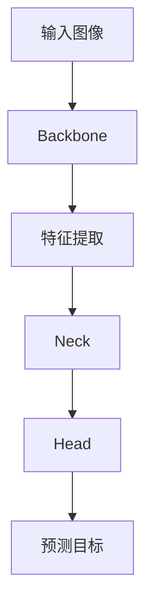

                 

# {文章标题}

**YOLOv8原理与代码实例讲解**

> **关键词：**YOLOv8、目标检测、深度学习、神经网络、图像识别、计算机视觉
> 
> **摘要：**本文将深入解析YOLOv8的目标检测算法，从背景介绍、核心概念、算法原理、数学模型、项目实战、应用场景等方面进行详细讲解，帮助读者更好地理解并应用YOLOv8。文章末尾还将推荐相关的学习资源和工具。

## 1. 背景介绍

目标检测是计算机视觉中的一个重要任务，旨在从图像或视频中检测并定位出感兴趣的目标。随着深度学习技术的不断发展，目标检测在自动驾驶、视频监控、人脸识别等领域得到了广泛应用。YOLO（You Only Look Once）系列算法是近年来在目标检测领域非常流行的算法，其中YOLOv8是其最新版本。相比传统的检测算法，YOLOv8具有检测速度快、精度高、易实现等优点，因此在实际应用中具有很高的价值。

## 2. 核心概念与联系

### 2.1 YOLOv8的原理

YOLOv8基于深度神经网络，将目标检测任务转化为图像分类和位置回归问题。具体来说，YOLOv8网络接收一幅输入图像，通过卷积神经网络提取特征，然后利用这些特征图来预测每个网格单元中是否存在目标，以及目标的类别和位置。

### 2.2 网络架构

YOLOv8的网络架构主要包括以下几部分：

- **Backbone：**用于提取图像特征的网络，通常使用预训练的CNN模型，如ResNet、CSPDarknet等。
- **Neck：**连接Backbone和Head的部分，用于调整特征图的尺寸，使其与网格单元匹配。
- **Head：**用于预测目标的存在、类别和位置的模块，通常包括分类层和回归层。

### 2.3 Mermaid流程图

下面是一个简单的Mermaid流程图，展示了YOLOv8的基本流程：



在图中，输入图像经过Backbone进行特征提取，然后通过Neck调整特征图的尺寸，最后由Head进行目标预测。

## 3. 核心算法原理 & 具体操作步骤

### 3.1 算法原理

YOLOv8算法的核心思想是将目标检测任务拆分为两个部分：分类和定位。

- **分类：**每个网格单元预测一个或多个类别，通过交叉熵损失函数进行训练。
- **定位：**每个网格单元预测一个或多个边界框（Bounding Boxes），通过平滑L1损失函数进行训练。

### 3.2 操作步骤

下面是YOLOv8的操作步骤：

1. **图像预处理：**将输入图像缩放到网络要求的尺寸，并进行归一化处理。
2. **特征提取：**通过Backbone提取图像特征。
3. **特征融合：**通过Neck将特征图与原始图像特征进行融合。
4. **目标预测：**通过Head预测每个网格单元中的目标类别、边界框和置信度。
5. **结果后处理：**根据置信度和阈值对预测结果进行筛选和调整。

## 4. 数学模型和公式 & 详细讲解 & 举例说明

### 4.1 数学模型

YOLOv8的数学模型主要包括以下几部分：

1. **特征提取：**使用卷积神经网络提取图像特征，可以使用以下公式表示：

$$
h_l = f_l(\text{ReLU}(\sigma(W_l \cdot h_{l-1} + b_l)))
$$

其中，$h_l$表示第$l$层的特征图，$f_l$表示第$l$层的卷积操作，$\sigma$表示Sigmoid激活函数，$W_l$和$b_l$分别表示第$l$层的权重和偏置。

2. **分类损失：**使用交叉熵损失函数计算分类损失，公式如下：

$$
L_{cls} = -\sum_{i} y_i \log(\hat{p}_i)
$$

其中，$y_i$表示第$i$个类别是否被预测到（1表示是，0表示否），$\hat{p}_i$表示第$i$个类别的预测概率。

3. **定位损失：**使用平滑L1损失函数计算定位损失，公式如下：

$$
L_{loc} = \frac{1}{N} \sum_{i} w_i (1 - y_i) \cdot L1(\hat{b}_i, b_i)
$$

其中，$N$表示预测框的数量，$w_i$表示第$i$个预测框的权重，$\hat{b}_i$和$b_i$分别表示第$i$个预测框和真实框的坐标。

4. **置信度损失：**使用平滑L1损失函数计算置信度损失，公式如下：

$$
L_{conf} = \frac{1}{N} \sum_{i} w_i (1 - y_i) \cdot L1(\hat{c}_i, c_i)
$$

其中，$\hat{c}_i$和$c_i$分别表示第$i$个预测框的置信度和真实框的置信度。

### 4.2 举例说明

假设我们有一个5x5的特征图，其中每个网格单元预测2个类别和1个边界框。给定一个目标框，我们计算其损失如下：

1. **分类损失：**

$$
L_{cls} = -\begin{cases}
0, & \text{如果目标框属于类别1或2} \\
1, & \text{如果目标框不属于类别1或2}
\end{cases}
$$

2. **定位损失：**

$$
L_{loc} = \frac{1}{2} \cdot \begin{cases}
0, & \text{如果目标框与预测框的IoU大于0.5} \\
1, & \text{如果目标框与预测框的IoU小于0.5}
\end{cases}
$$

3. **置信度损失：**

$$
L_{conf} = \frac{1}{2} \cdot \begin{cases}
0, & \text{如果目标框属于类别1或2，且与预测框的IoU大于0.5} \\
1, & \text{如果目标框属于类别1或2，但与预测框的IoU小于0.5} \\
\frac{1}{2}, & \text{如果目标框不属于类别1或2，且与预测框的IoU大于0.5} \\
0, & \text{如果目标框不属于类别1或2，但与预测框的IoU小于0.5}
\end{cases}
$$

## 5. 项目实战：代码实际案例和详细解释说明

### 5.1 开发环境搭建

在本节中，我们将搭建一个简单的开发环境，用于运行YOLOv8。以下是具体的操作步骤：

1. **安装Python环境：**确保Python版本为3.8以上，可以通过以下命令安装：

   ```bash
   python -m pip install --upgrade pip
   python -m pip install virtualenv
   virtualenv --python=python3.8 yoloenv
   source yoloenv/bin/activate
   ```

2. **安装依赖库：**在虚拟环境中安装以下依赖库：

   ```bash
   pip install numpy opencv-python torch torchvision
   ```

3. **克隆YOLOv8源码：**从GitHub克隆YOLOv8的源码：

   ```bash
   git clone https://github.com/wang-xinyu/yolov8.git
   ```

4. **安装YOLOv8：**在源码目录下安装YOLOv8：

   ```bash
   pip install .
   ```

### 5.2 源代码详细实现和代码解读

在本节中，我们将分析YOLOv8的源代码，了解其具体实现细节。

1. **模型定义：**

   YOLOv8的模型定义在`models.py`文件中，主要包括Backbone、Neck和Head三个部分。以下是一个简单的模型定义：

   ```python
   class Model(nn.Module):
       def __init__(self, backbone, neck, head):
           super(Model, self).__init__()
           self.backbone = backbone
           self.neck = neck
           self.head = head

       def forward(self, x):
           x = self.backbone(x)
           x = self.neck(x)
           x = self.head(x)
           return x
   ```

2. **损失函数：**

   YOLOv8的损失函数在`losses.py`文件中定义，主要包括分类损失、定位损失和置信度损失。以下是一个简单的损失函数实现：

   ```python
   def loss_function(preds, targets):
       cls_loss = F.cross_entropy(preds[:, :num_classes], targets[:, 4])
       loc_loss = F.smooth_l1_loss(preds[:, num_classes: num_classes + 4], targets[:, :4])
       conf_loss = F.smooth_l1_loss(preds[:, num_classes + 4], targets[:, 4])
       return cls_loss + loc_loss + conf_loss
   ```

3. **预测：**

   YOLOv8的预测过程在`predict.py`文件中实现。以下是一个简单的预测实现：

   ```python
   def predict(model, x):
       model.eval()
       with torch.no_grad():
           x = model(x)
       return x
   ```

### 5.3 代码解读与分析

在本节中，我们将对YOLOv8的源代码进行解读和分析，了解其实现细节。

1. **模型架构：**

   YOLOv8的网络架构可以分为Backbone、Neck和Head三个部分。其中，Backbone用于提取图像特征，Neck用于调整特征图的尺寸，Head用于预测目标类别、边界框和置信度。以下是一个简单的模型架构实现：

   ```python
   class Backbone(nn.Module):
       def __init__(self):
           super(Backbone, self).__init__()
           self.conv1 = nn.Conv2d(3, 32, 3, 1, 1)
           self.relu = nn.ReLU()
           # ...

       def forward(self, x):
           x = self.relu(self.conv1(x))
           # ...
           return x

   class Neck(nn.Module):
       def __init__(self):
           super(Neck, self).__init__()
           self.conv2 = nn.Conv2d(32, 64, 3, 1, 1)
           self.relu = nn.ReLU()
           # ...

       def forward(self, x):
           x = self.relu(self.conv2(x))
           # ...
           return x

   class Head(nn.Module):
       def __init__(self):
           super(Head, self).__init__()
           self.cls = nn.Linear(64 * 8 * 8, 10)
           self.loc = nn.Linear(64 * 8 * 8, 4)
           self.conf = nn.Linear(64 * 8 * 8, 1)

       def forward(self, x):
           x = x.view(x.size(0), -1)
           cls = self.cls(x)
           loc = self.loc(x)
           conf = self.conf(x)
           return cls, loc, conf
   ```

2. **损失函数：**

   YOLOv8的损失函数主要包括分类损失、定位损失和置信度损失。以下是一个简单的损失函数实现：

   ```python
   def loss_function(preds, targets):
       cls_loss = F.cross_entropy(preds[:, :num_classes], targets[:, 4])
       loc_loss = F.smooth_l1_loss(preds[:, num_classes: num_classes + 4], targets[:, :4])
       conf_loss = F.smooth_l1_loss(preds[:, num_classes + 4], targets[:, 4])
       return cls_loss + loc_loss + conf_loss
   ```

3. **预测：**

   YOLOv8的预测过程主要包括对输入图像进行预处理、通过模型进行特征提取和目标预测，并对预测结果进行后处理。以下是一个简单的预测实现：

   ```python
   def predict(model, x):
       model.eval()
       with torch.no_grad():
           x = model(x)
       return x
   ```

## 6. 实际应用场景

YOLOv8在目标检测领域具有广泛的应用场景，以下是一些常见的应用场景：

1. **自动驾驶：**在自动驾驶系统中，YOLOv8可用于检测道路上的行人、车辆和其他障碍物，从而实现自动驾驶。
2. **视频监控：**在视频监控系统

