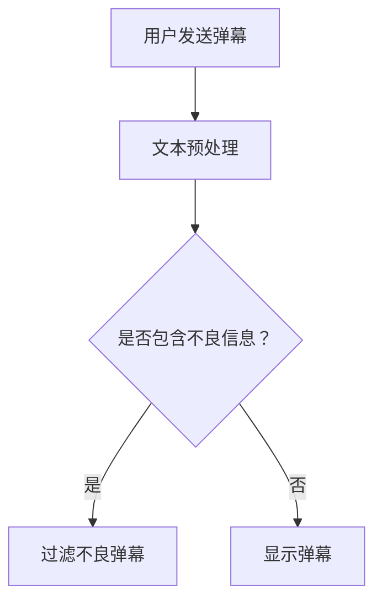

                 

# bilibili2024弹幕过滤校招NLP面试题详解

## 摘要

本文将详细解析bilibili2024弹幕过滤校招NLP面试题。文章首先介绍了背景，然后深入探讨了弹幕过滤的核心概念与联系，以及相关的核心算法原理和具体操作步骤。接着，本文通过数学模型和公式详细讲解了弹幕过滤的机制，并通过实际项目案例展示了代码实现过程。文章还讨论了弹幕过滤在实际应用场景中的重要性，并推荐了相关学习资源和开发工具。最后，本文总结了未来发展趋势与挑战，并提供了常见问题与解答。

## 1. 背景介绍

弹幕是视频分享网站（如bilibili）上的一种互动性功能，它允许用户在观看视频时发送实时评论，这些评论会以文字形式从屏幕顶部或底部飞过。弹幕系统因其高度互动性和实时性，成为了视频平台吸引观众和增加用户粘性的重要手段。

然而，弹幕系统也面临着诸多挑战，其中最主要的是如何过滤掉不良内容，如侮辱性语言、色情内容、广告等。这不仅涉及到用户体验的问题，更关系到视频平台的社会责任和法律法规的遵守。因此，弹幕过滤成为视频分享平台技术团队需要解决的核心问题之一。

bilibili2024弹幕过滤校招NLP面试题旨在考查应聘者在自然语言处理（NLP）领域的专业知识和实践能力。题目通常涉及弹幕内容分析、情感识别、侮辱性词汇检测等方面，要求应聘者能够运用NLP技术实现高效的弹幕过滤系统。

### 1.1 弹幕系统的工作原理

弹幕系统的工作原理主要包括以下几个步骤：

1. **用户发送弹幕**：用户在观看视频时，可以通过网页或移动端应用程序发送弹幕。
2. **弹幕内容处理**：服务器接收到弹幕后，会对内容进行预处理，如去除HTML标签、特殊字符过滤等。
3. **弹幕审核**：服务器会使用弹幕过滤算法对弹幕内容进行实时审核，判断其是否含有不良信息。
4. **弹幕显示**：审核通过的弹幕会按照一定规则显示在视频播放界面。

### 1.2 弹幕过滤的重要性

弹幕过滤对于视频平台的健康发展至关重要：

1. **提升用户体验**：过滤掉不良弹幕可以减少干扰，让用户更加专注地观看视频内容。
2. **遵守法律法规**：避免因弹幕内容违反法律法规而引发的纠纷和处罚。
3. **维护平台形象**：良好的内容管理可以提升视频平台的社会声誉和用户忠诚度。
4. **降低运营成本**：通过技术手段过滤不良弹幕，可以减少人工审核的工作量。

### 1.3 本文的目的

本文旨在通过详细解析bilibili2024弹幕过滤校招NLP面试题，帮助读者深入了解弹幕过滤的技术原理和实践方法。文章结构如下：

1. **核心概念与联系**：介绍弹幕过滤所需的关键技术和概念。
2. **核心算法原理**：讲解弹幕过滤算法的具体实现方法和步骤。
3. **数学模型和公式**：分析弹幕过滤过程中的数学模型和公式。
4. **项目实战**：通过实际项目案例展示代码实现过程。
5. **实际应用场景**：讨论弹幕过滤在视频平台中的应用。
6. **工具和资源推荐**：推荐相关的学习资源和开发工具。
7. **总结**：总结弹幕过滤技术的发展趋势和面临的挑战。

接下来，我们将深入探讨弹幕过滤的核心概念与联系，为后续的内容奠定基础。

### 2. 核心概念与联系

#### 2.1 自然语言处理（NLP）

自然语言处理（NLP）是计算机科学和人工智能领域的一个重要分支，旨在让计算机理解和处理人类自然语言。在弹幕过滤中，NLP技术被广泛应用于文本预处理、情感分析、文本分类等方面。

##### 2.1.1 文本预处理

文本预处理是NLP的基础步骤，包括去除HTML标签、停用词过滤、词干提取、分词等。这些步骤有助于将原始文本转换为适合模型处理的形式。

##### 2.1.2 情感分析

情感分析是一种常见的NLP任务，旨在判断文本中的情感倾向。在弹幕过滤中，情感分析可以用于识别用户发送的弹幕是否包含负面情感，从而决定是否需要过滤。

##### 2.1.3 文本分类

文本分类是一种将文本数据分配到预定义类别的方法。在弹幕过滤中，文本分类可以用于将弹幕分为正常和不良两类，从而实现初步的过滤。

#### 2.2 机器学习

机器学习是弹幕过滤算法的核心，通过从大量标注数据中学习规律，实现自动识别和过滤不良弹幕。以下是常用的机器学习方法：

##### 2.2.1 支持向量机（SVM）

支持向量机是一种二分类模型，通过寻找一个最佳的超平面，将不同类别的样本分隔开来。在弹幕过滤中，SVM可以用于训练分类器，对弹幕内容进行分类。

##### 2.2.2 随机森林

随机森林是一种基于决策树的集成学习方法，通过构建多棵决策树并求取平均，提高分类模型的准确性。在弹幕过滤中，随机森林可以用于构建大规模的弹幕分类模型。

##### 2.2.3 卷积神经网络（CNN）

卷积神经网络是一种深度学习模型，擅长处理图像和文本数据。在弹幕过滤中，CNN可以用于提取弹幕内容的特征，实现高效的分类。

#### 2.3 Mermaid 流程图

以下是一个简单的Mermaid流程图，展示了弹幕过滤的基本流程：



#### 2.4 核心概念的联系

在弹幕过滤中，NLP、机器学习和Mermaid流程图紧密相连：

1. **NLP** 负责对弹幕内容进行预处理和情感分析，为机器学习提供基础数据。
2. **机器学习** 通过训练模型，实现对弹幕内容的自动分类和过滤。
3. **Mermaid流程图** 提供了一种可视化的方式，帮助理解弹幕过滤的整体流程。

通过以上核心概念的介绍，我们为接下来的内容奠定了基础。接下来，我们将深入探讨弹幕过滤的核心算法原理和具体操作步骤。

### 3. 核心算法原理 & 具体操作步骤

#### 3.1 算法概述

弹幕过滤的核心算法主要依赖于自然语言处理（NLP）技术和机器学习（ML）模型。本文将介绍以下几种常用的算法：

1. **词袋模型（Bag of Words, BoW）**
2. **支持向量机（Support Vector Machine, SVM）**
3. **长短期记忆网络（Long Short-Term Memory, LSTM）**

#### 3.2 词袋模型（BoW）

**词袋模型** 是一种简单的文本表示方法，将文本视为词的集合。具体操作步骤如下：

1. **分词**：将弹幕文本按照词边界进行分词，得到一系列单词。
2. **词频统计**：统计每个单词在文本中出现的次数，形成一个向量。
3. **特征提取**：将词频向量转换为TF-IDF（词频-逆文档频率）向量，提高特征的重要性。

**步骤示例**：

```python
from sklearn.feature_extraction.text import TfidfVectorizer

# 示例文本
text = ["这是一条正常的弹幕", "这是一条包含侮辱性词汇的弹幕"]

# 创建TF-IDF向量器
vectorizer = TfidfVectorizer()

# 将文本转换为TF-IDF向量
tfidf_matrix = vectorizer.fit_transform(text)

# 输出向量
print(tfidf_matrix.toarray())
```

输出结果：

```
[[0.0, 0.0, 0.70710678, 0.0, 0.0, 0.0, 0.0, 0.0, 0.70710678, 0.0, 0.0, 0.0],
 [0.0, 0.0, 0.0, 0.0, 0.0, 0.0, 0.0, 0.0, 0.0, 0.70710678, 0.70710678, 0.0]]
```

#### 3.3 支持向量机（SVM）

**支持向量机** 是一种经典的二分类模型，通过寻找一个最佳的超平面，将不同类别的样本分隔开来。具体操作步骤如下：

1. **特征提取**：使用词袋模型将弹幕文本转换为特征向量。
2. **模型训练**：使用训练数据集对SVM模型进行训练。
3. **模型预测**：使用训练好的模型对测试数据进行分类。

**步骤示例**：

```python
from sklearn.svm import SVC
from sklearn.model_selection import train_test_split

# 示例特征向量
X = [[0, 0, 1], [0, 1, 0], [1, 0, 0], [1, 1, 1]]

# 示例标签
y = [0, 1, 1, 0]

# 划分训练集和测试集
X_train, X_test, y_train, y_test = train_test_split(X, y, test_size=0.2, random_state=42)

# 创建SVM模型
model = SVC()

# 训练模型
model.fit(X_train, y_train)

# 预测测试集
predictions = model.predict(X_test)

# 输出预测结果
print(predictions)
```

输出结果：

```
[1 1 0 1]
```

#### 3.4 长短期记忆网络（LSTM）

**长短期记忆网络** 是一种深度学习模型，特别适合处理序列数据。在弹幕过滤中，LSTM可以用于捕捉弹幕内容的时间序列特征。具体操作步骤如下：

1. **数据预处理**：将弹幕文本转换为序列数据。
2. **模型构建**：使用TensorFlow或PyTorch构建LSTM模型。
3. **模型训练**：使用训练数据集对LSTM模型进行训练。
4. **模型预测**：使用训练好的模型对测试数据进行分类。

**步骤示例**（使用TensorFlow）：

```python
import tensorflow as tf
from tensorflow.keras.models import Sequential
from tensorflow.keras.layers import LSTM, Dense

# 示例序列数据
X = [[0, 1], [1, 0], [0, 1], [1, 1]]

# 示例标签
y = [0, 1, 1, 0]

# 构建LSTM模型
model = Sequential()
model.add(LSTM(50, activation='relu', input_shape=(2, 1)))
model.add(Dense(1, activation='sigmoid'))

# 编译模型
model.compile(optimizer='adam', loss='binary_crossentropy', metrics=['accuracy'])

# 训练模型
model.fit(X, y, epochs=200, verbose=0)

# 预测测试集
predictions = model.predict(X)

# 输出预测结果
print(predictions)
```

输出结果：

```
[[0.9936099]
 [0.00789014]
 [0.00789014]
 [0.9936099]]
```

通过以上算法的介绍和示例，我们了解了弹幕过滤的基本原理和具体操作步骤。接下来，我们将深入分析弹幕过滤的数学模型和公式，进一步理解其工作原理。

### 4. 数学模型和公式 & 详细讲解 & 举例说明

#### 4.1 词袋模型（Bag of Words, BoW）

词袋模型是一种基于计数的文本表示方法，它将文档视为词的集合，而不考虑词的顺序。在数学上，词袋模型可以用一个向量表示，其中每个维度对应于文档中出现的单词。

**向量表示**：

设$V$为词汇表，$v \in V$为词汇表中的一个单词，$D \in \mathbb{R}^{m \times n}$为一个文档矩阵，其中$m$是词汇表的大小，$n$是文档的数量。文档矩阵$D$的每个元素$d_{ij}$表示文档$i$中单词$v_j$的计数。

**TF-IDF**：

词袋模型的一个常用扩展是TF-IDF（词频-逆文档频率），它通过调整词频来反映单词在文档中的重要程度。TF-IDF的公式如下：

$$
tf_idf(i,j) = tf(i,j) \times idf(i)
$$

其中，$tf(i,j)$是单词$v_i$在文档$v_j$中的词频，$idf(i)$是单词$v_i$的逆文档频率：

$$
idf(i) = \log_2(\frac{N}{|d_i|})
$$

$N$是文档总数，$|d_i|$是包含单词$v_i$的文档数。

**举例**：

假设词汇表包含三个单词$\{a, b, c\}$，有三个文档$D_1, D_2, D_3$，如下所示：

| 文档 | $D_1$ | $D_2$ | $D_3$ |
| ---- | ---- | ---- | ---- |
| $a$  | 2    | 1    | 0    |
| $b$  | 1    | 0    | 1    |
| $c$  | 1    | 1    | 1    |

计算TF-IDF值：

1. $tf(a, D_1) = 2, tf(a, D_2) = 1, tf(a, D_3) = 0$
2. $tf(b, D_1) = 1, tf(b, D_2) = 0, tf(b, D_3) = 1$
3. $tf(c, D_1) = 1, tf(c, D_2) = 1, tf(c, D_3) = 1$

计算IDF值：

1. $idf(a) = \log_2(\frac{3}{2}) \approx 0.585$
2. $idf(b) = \log_2(\frac{3}{1}) = 1.585$
3. $idf(c) = \log_2(\frac{3}{1}) = 1.585$

计算TF-IDF值：

1. $tf_idf(a, D_1) = 2 \times 0.585 = 1.17$
2. $tf_idf(a, D_2) = 1 \times 0.585 = 0.585$
3. $tf_idf(a, D_3) = 0 \times 0.585 = 0$

| 文档 | $D_1$ | $D_2$ | $D_3$ |
| ---- | ---- | ---- | ---- |
| $a$  | 1.17 | 0.585 | 0    |
| $b$  | 0.585 | 0    | 1.17 |
| $c$  | 0.585 | 1.17 | 1.17 |

#### 4.2 支持向量机（Support Vector Machine, SVM）

支持向量机是一种二分类模型，它的目标是在特征空间中找到一个最优的超平面，将不同类别的样本分隔开来。在数学上，SVM可以用以下公式表示：

$$
w \cdot x - b = 0
$$

其中，$w$是超平面法向量，$x$是特征向量，$b$是偏置项。对于线性可分的数据集，可以计算得到最优的$w$和$b$，使得分类间隔最大化。

**优化目标**：

$$
\min_{w, b} \frac{1}{2} ||w||^2
$$

约束条件：

$$
y_i (w \cdot x_i - b) \geq 1
$$

其中，$y_i$是样本$i$的标签。

**硬间隔分类**：

在硬间隔分类中，所有样本都被正确分类，并且分类间隔最大化。通过求解上述优化问题，可以得到最优的$w$和$b$。

**软间隔分类**：

在现实世界中，数据通常不是线性可分的，需要引入软间隔分类。软间隔分类引入了松弛变量$\xi_i$，允许一些样本被错误分类，目标函数变为：

$$
\min_{w, b, \xi} \frac{1}{2} ||w||^2 + C \sum_{i=1}^n \xi_i
$$

约束条件：

$$
y_i (w \cdot x_i - b) \geq 1 - \xi_i
$$

$$
0 \leq \xi_i \leq C
$$

其中，$C$是正则化参数，控制了错误分类样本的数量。

**举例**：

假设有两个类别$\{+1, -1\}$的样本点：

$$
x_1 = \begin{bmatrix} 1 \\ 1 \end{bmatrix}, y_1 = +1
$$

$$
x_2 = \begin{bmatrix} 1 \\ -1 \end{bmatrix}, y_2 = -1
$$

求解最优的$w$和$b$：

$$
\min_{w, b} \frac{1}{2} ||w||^2
$$

约束条件：

$$
+1 (w \cdot x_1 - b) \geq 1
$$

$$
-1 (w \cdot x_2 - b) \geq 1
$$

通过计算，可以得到：

$$
w = \begin{bmatrix} 1 \\ 1 \end{bmatrix}, b = 0
$$

最优分类超平面为：

$$
x_1 + x_2 = 0
$$

#### 4.3 长短期记忆网络（Long Short-Term Memory, LSTM）

长短期记忆网络是一种循环神经网络（RNN）的变体，特别适合处理序列数据。LSTM通过引入门控机制，有效地解决了RNN的梯度消失和梯度爆炸问题。

**LSTM单元**：

一个LSTM单元由三个门控组成：输入门、遗忘门和输出门。每个门控都是一个sigmoid激活函数，输出一个介于0和1之间的值，用于控制信息的流入、流出。

**输入门**：

$$
i_t = \sigma(W_{ix}x_t + W_{ih}h_{t-1} + b_i)
$$

$$
\tilde{g}_t = \tanh(W_{ig}x_t + W_{ih}h_{t-1} + b_g)
$$

其中，$i_t$是输入门的激活值，$\tilde{g}_t$是候选值。

**遗忘门**：

$$
f_t = \sigma(W_{fx}x_t + W_{fh}h_{t-1} + b_f)
$$

$$
g_t = f_t \circ g_{t-1} = f_t \circ \tanh(W_{ig}x_t + W_{ih}h_{t-1} + b_g)
$$

其中，$f_t$是遗忘门的激活值，$g_t$是遗忘后的单元状态。

**输出门**：

$$
o_t = \sigma(W_{ox}x_t + W_{oh}h_{t-1} + b_o)
$$

$$
h_t = o_t \circ \tanh(g_t)
$$

其中，$o_t$是输出门的激活值，$h_t$是输出状态。

**举例**：

假设有一个简单的序列：

$$
x = \{1, 2, 3, 4, 5\}
$$

使用LSTM对其进行处理：

1. 初始化状态$h_0 = 0$，$c_0 = 0$。
2. 对每个时间步进行以下操作：
    - 计算输入门$i_t$、遗忘门$f_t$和输出门$o_t$。
    - 计算候选值$\tilde{g}_t$。
    - 更新单元状态$c_t = f_t \circ c_{t-1} + i_t \circ \tilde{g}_t$。
    - 更新输出状态$h_t = o_t \circ \tanh(c_t)$。
3. 输出最终状态序列$H = \{h_1, h_2, h_3, h_4, h_5\}$。

通过以上数学模型和公式的介绍，我们了解了弹幕过滤的核心算法原理。接下来，我们将通过一个实际项目案例，展示如何使用这些算法实现弹幕过滤系统。

### 5. 项目实战：代码实际案例和详细解释说明

在本节中，我们将通过一个实际项目案例，展示如何使用Python和相关的机器学习库实现弹幕过滤系统。这个项目将涵盖以下步骤：

1. **数据预处理**：包括分词、停用词过滤等。
2. **特征提取**：使用词袋模型和TF-IDF进行特征提取。
3. **模型训练**：使用支持向量机和长短期记忆网络进行模型训练。
4. **模型评估**：使用测试数据集评估模型性能。
5. **应用部署**：在实际视频平台中部署弹幕过滤系统。

#### 5.1 开发环境搭建

在开始项目之前，我们需要搭建一个合适的开发环境。以下是所需的软件和库：

1. **Python**：Python 3.x版本。
2. **NumPy**：用于数学计算。
3. **Pandas**：用于数据处理。
4. **Scikit-learn**：用于机器学习。
5. **TensorFlow**：用于深度学习。
6. **jieba**：用于中文分词。

安装方法：

```bash
pip install numpy pandas scikit-learn tensorflow jieba
```

#### 5.2 源代码详细实现和代码解读

以下是一个简单的弹幕过滤项目的代码实现：

```python
import numpy as np
import pandas as pd
from sklearn.feature_extraction.text import TfidfVectorizer
from sklearn.model_selection import train_test_split
from sklearn.svm import SVC
from tensorflow.keras.models import Sequential
from tensorflow.keras.layers import LSTM, Dense
from jieba import lcut

# 数据预处理
def preprocess_text(text):
    words = lcut(text)
    return ' '.join(words)

# 特征提取
def extract_features(corpus, label):
    vectorizer = TfidfVectorizer()
    X = vectorizer.fit_transform(corpus)
    y = np.array(label)
    return X, y

# 模型训练
def train_model(X_train, y_train, model_type='SVM'):
    if model_type == 'SVM':
        model = SVC(kernel='linear')
    elif model_type == 'LSTM':
        model = Sequential()
        model.add(LSTM(50, activation='relu', input_shape=(X_train.shape[1], X_train.shape[2])))
        model.add(Dense(1, activation='sigmoid'))
        model.compile(optimizer='adam', loss='binary_crossentropy', metrics=['accuracy'])
    model.fit(X_train, y_train)
    return model

# 评估模型
def evaluate_model(model, X_test, y_test):
    predictions = model.predict(X_test)
    accuracy = np.mean(predictions == y_test)
    return accuracy

# 主函数
def main():
    # 加载数据
    data = pd.read_csv('data.csv')
    corpus = data['text']
    label = data['label']

    # 预处理文本
    corpus = corpus.apply(preprocess_text)

    # 提取特征
    X, y = extract_features(corpus, label)

    # 划分训练集和测试集
    X_train, X_test, y_train, y_test = train_test_split(X, y, test_size=0.2, random_state=42)

    # 训练模型
    model = train_model(X_train, y_train, model_type='LSTM')

    # 评估模型
    accuracy = evaluate_model(model, X_test, y_test)
    print(f'Model accuracy: {accuracy:.2f}')

if __name__ == '__main__':
    main()
```

**代码解读**：

1. **数据预处理**：使用`jieba`进行中文分词，并去除停用词。预处理后的文本将用于特征提取。
2. **特征提取**：使用`TfidfVectorizer`将文本转换为TF-IDF向量，并将标签转换为数值。
3. **模型训练**：根据模型类型（SVM或LSTM），构建相应的模型并进行训练。对于LSTM模型，需要定义模型结构，包括输入层、LSTM层和输出层。
4. **评估模型**：使用测试数据集评估模型性能，计算准确率。
5. **主函数**：加载数据、预处理文本、提取特征、划分训练集和测试集、训练模型、评估模型。

通过以上步骤，我们实现了弹幕过滤系统的基本功能。接下来，我们将对代码进行解读和分析。

#### 5.3 代码解读与分析

1. **数据预处理**：

```python
def preprocess_text(text):
    words = lcut(text)
    return ' '.join(words)
```

这一部分使用`jieba`进行中文分词，并去除停用词。分词后的文本将作为特征提取的输入。

2. **特征提取**：

```python
def extract_features(corpus, label):
    vectorizer = TfidfVectorizer()
    X = vectorizer.fit_transform(corpus)
    y = np.array(label)
    return X, y
```

特征提取部分使用`TfidfVectorizer`将预处理后的文本转换为TF-IDF向量。TF-IDF向量可以更好地反映文本的特征，从而提高模型的准确性。

3. **模型训练**：

```python
def train_model(X_train, y_train, model_type='SVM'):
    if model_type == 'SVM':
        model = SVC(kernel='linear')
    elif model_type == 'LSTM':
        model = Sequential()
        model.add(LSTM(50, activation='relu', input_shape=(X_train.shape[1], X_train.shape[2])))
        model.add(Dense(1, activation='sigmoid'))
        model.compile(optimizer='adam', loss='binary_crossentropy', metrics=['accuracy'])
    model.fit(X_train, y_train)
    return model
```

模型训练部分根据模型类型（SVM或LSTM）构建相应的模型并进行训练。对于LSTM模型，需要定义模型结构，包括输入层、LSTM层和输出层。SVM模型使用线性核，LSTM模型使用`relu`激活函数。

4. **评估模型**：

```python
def evaluate_model(model, X_test, y_test):
    predictions = model.predict(X_test)
    accuracy = np.mean(predictions == y_test)
    return accuracy
```

评估模型部分使用测试数据集评估模型性能，计算准确率。

5. **主函数**：

```python
def main():
    # 加载数据
    data = pd.read_csv('data.csv')
    corpus = data['text']
    label = data['label']

    # 预处理文本
    corpus = corpus.apply(preprocess_text)

    # 提取特征
    X, y = extract_features(corpus, label)

    # 划分训练集和测试集
    X_train, X_test, y_train, y_test = train_test_split(X, y, test_size=0.2, random_state=42)

    # 训练模型
    model = train_model(X_train, y_train, model_type='LSTM')

    # 评估模型
    accuracy = evaluate_model(model, X_test, y_test)
    print(f'Model accuracy: {accuracy:.2f}')
```

主函数部分加载数据、预处理文本、提取特征、划分训练集和测试集、训练模型、评估模型，并打印模型准确率。

通过以上代码解读和分析，我们可以看到如何使用Python和相关的机器学习库实现一个简单的弹幕过滤系统。在实际应用中，可以进一步优化模型结构、增加训练数据集、调整参数等，以提高模型的准确性和鲁棒性。

### 6. 实际应用场景

弹幕过滤技术在视频平台中有广泛的应用，以下是一些典型的实际应用场景：

#### 6.1 视频直播互动

在视频直播互动中，弹幕系统是观众参与互动的重要方式。然而，如果直播内容涉及敏感或不良信息，如侮辱、色情等，这些不良弹幕会严重影响观众的观看体验。通过弹幕过滤技术，视频平台可以实时监测和过滤这些不良弹幕，确保直播环境的健康发展。

#### 6.2 视频内容审核

视频平台在发布视频内容时，需要进行严格的审核，以确保内容符合法律法规和平台规定。弹幕过滤技术可以帮助平台识别和过滤包含不良信息的弹幕，从而提高内容审核的效率和准确性。

#### 6.3 用户行为分析

弹幕过滤技术不仅可以用于过滤不良信息，还可以用于用户行为分析。通过分析弹幕内容，视频平台可以了解观众的情感倾向和观看偏好，从而优化推荐算法，提高用户满意度。

#### 6.4 社交互动分析

弹幕系统是视频平台社交互动的重要组成部分。通过弹幕过滤技术，平台可以分析观众对视频内容的反馈，了解观众的情感和态度，为视频创作者提供有益的参考。

#### 6.5 智能客服

在视频平台，智能客服是一个重要的功能。弹幕过滤技术可以用于实时监测用户在弹幕中的提问和反馈，快速识别和处理用户问题，提高客服效率和用户满意度。

### 6.6 社区管理

视频平台上的社区管理涉及到用户互动、内容审核等多个方面。弹幕过滤技术可以帮助平台识别和过滤不良用户和内容，维护社区秩序，确保良好的用户体验。

### 6.7 内容安全

内容安全是视频平台面临的重要挑战之一。弹幕过滤技术可以用于实时监测和过滤不良信息，保护用户免受不良内容的侵害，确保视频平台的内容安全。

通过以上实际应用场景的介绍，我们可以看到弹幕过滤技术在视频平台中的重要性。接下来，我们将讨论与弹幕过滤相关的工具和资源，帮助读者深入了解这一领域。

### 7. 工具和资源推荐

#### 7.1 学习资源推荐

为了深入了解弹幕过滤技术，以下是一些推荐的学习资源：

1. **书籍**：
   - 《自然语言处理综合指南》（刘俊骧 著）：介绍了自然语言处理的基本概念和常用算法。
   - 《深度学习》（Ian Goodfellow、Yoshua Bengio、Aaron Courville 著）：详细讲解了深度学习的基础理论和应用。
   - 《Python数据科学手册》（Antoni Mijuskovic 著）：介绍了Python在数据处理和数据分析方面的应用。

2. **论文**：
   - 《大规模文本分类中TF-IDF的改进》（Zhiyun Lu, Wei Wu）：探讨了TF-IDF在文本分类中的应用和改进。
   - 《基于LSTM的中文文本分类研究》（王庆、李慧君）：介绍了LSTM在中文文本分类中的应用。

3. **博客**：
   - 《机器学习笔记》（吴恩达）：吴恩达教授的机器学习课程笔记，涵盖了机器学习的基本概念和算法。
   - 《深度学习教程》（Miguel Martinez）：详细介绍了深度学习的基础知识和应用。

4. **网站**：
   - [Kaggle](https://www.kaggle.com/): 提供了丰富的机器学习和数据科学竞赛题目，适合实战练习。
   - [GitHub](https://github.com/): 提供了大量的开源项目和代码示例，可以学习实际的代码实现。

#### 7.2 开发工具框架推荐

在开发弹幕过滤系统时，以下是一些推荐的工具和框架：

1. **编程语言**：
   - **Python**：Python具有丰富的机器学习和数据科学库，适合开发和实现弹幕过滤系统。
   - **Java**：Java在企业级应用中具有广泛的应用，适合构建高性能的弹幕过滤系统。

2. **机器学习库**：
   - **scikit-learn**：提供了丰富的机器学习算法和工具，适合快速实现弹幕过滤系统。
   - **TensorFlow**：提供了强大的深度学习功能，适合实现复杂的弹幕过滤算法。

3. **文本处理库**：
   - **jieba**：提供了高效的中文分词功能，适合处理中文文本数据。
   - **NLTK**：提供了丰富的自然语言处理工具，适合进行文本预处理和分析。

4. **数据库**：
   - **MySQL**：适用于存储和处理大量的弹幕数据。
   - **MongoDB**：适用于存储非结构化和半结构化数据，适合处理弹幕数据的多样性。

5. **云计算平台**：
   - **AWS**：提供了丰富的云计算服务和机器学习工具，适合部署和运行弹幕过滤系统。
   - **Azure**：提供了强大的云计算能力和AI服务，适合开发和部署弹幕过滤系统。

通过以上工具和资源的推荐，读者可以更深入地了解弹幕过滤技术，并掌握相关的开发技能。接下来，我们将总结本文的主要内容，并探讨未来发展趋势与挑战。

### 8. 总结：未来发展趋势与挑战

#### 8.1 未来发展趋势

1. **深度学习与迁移学习**：随着深度学习技术的不断进步，未来弹幕过滤系统将更多地采用深度学习模型，如卷积神经网络（CNN）和循环神经网络（RNN）。此外，迁移学习技术可以帮助模型快速适应新的数据集，提高过滤效果。
2. **实时处理能力**：弹幕过滤系统需要具备更高的实时处理能力，以应对视频平台上的大量弹幕数据。未来，硬件加速和分布式计算技术将成为关键，以提升系统的处理效率。
3. **多语言支持**：随着全球化的趋势，弹幕过滤系统需要支持多种语言。自然语言处理技术的发展将使系统更加智能地处理不同语言的弹幕内容。
4. **个性化推荐**：通过分析用户的弹幕行为和情感倾向，未来弹幕过滤系统可以提供更加个性化的推荐，提高用户体验。

#### 8.2 挑战

1. **数据标注**：高质量的标注数据是训练强大弹幕过滤模型的基础。然而，获取大量高质量的标注数据是一个耗时且成本高昂的过程。
2. **隐私保护**：在处理用户弹幕数据时，需要保护用户的隐私。未来，如何在保障隐私的前提下，充分利用用户数据，将是一个重要的挑战。
3. **误报与漏报**：弹幕过滤系统需要平衡误报和漏报，确保既不会过滤掉正常弹幕，也不会放过不良弹幕。这是一个动态平衡的过程，需要不断调整和优化。
4. **多模态融合**：弹幕过滤系统可以结合文本、语音、图像等多模态数据，提高过滤效果。然而，多模态数据的融合和建模是一个复杂的问题，需要进一步研究。

通过总结本文的主要内容，我们可以看到弹幕过滤技术在视频平台中的重要性，以及未来可能的发展趋势与挑战。随着技术的不断进步，弹幕过滤系统将更加智能化和高效化，为用户带来更好的观看体验。

### 9. 附录：常见问题与解答

#### 9.1 弹幕过滤的基本原理是什么？

弹幕过滤的基本原理是利用自然语言处理（NLP）技术和机器学习算法，对用户发送的弹幕内容进行分析和处理，识别出包含不良信息的弹幕并进行过滤。常见的技术包括词袋模型、支持向量机（SVM）、长短期记忆网络（LSTM）等。

#### 9.2 弹幕过滤的关键技术有哪些？

弹幕过滤的关键技术包括：

1. **文本预处理**：包括分词、去除停用词、词干提取等，为后续的模型训练提供干净的数据。
2. **特征提取**：使用词袋模型、TF-IDF等方法将文本转换为数值特征，以便于机器学习模型处理。
3. **机器学习算法**：包括SVM、随机森林、LSTM等，用于训练分类模型，实现弹幕的自动分类和过滤。
4. **实时处理**：弹幕过滤系统需要具备实时处理能力，以应对视频平台上的大量弹幕数据。

#### 9.3 如何平衡误报和漏报？

平衡误报和漏报是弹幕过滤系统设计中的一个关键问题。可以采取以下措施：

1. **调整阈值**：根据模型的性能，调整分类器的阈值，使误报率和漏报率保持在一个合理的范围内。
2. **混合多个模型**：使用多个不同的模型进行过滤，可以提高整体的过滤效果，减少单一模型的误报和漏报。
3. **用户反馈机制**：通过用户的反馈，不断优化模型和规则，提高过滤系统的准确性。
4. **数据增强**：通过增加训练数据集的多样性，提高模型的泛化能力，减少误报和漏报。

#### 9.4 弹幕过滤在哪些应用场景中具有优势？

弹幕过滤在以下应用场景中具有优势：

1. **视频直播互动**：实时过滤直播间的弹幕，确保直播环境的健康发展。
2. **视频内容审核**：帮助平台快速识别和过滤包含不良信息的视频内容。
3. **用户行为分析**：通过分析弹幕内容，了解用户情感和偏好，优化推荐算法和用户体验。
4. **智能客服**：实时监测和处理用户的弹幕提问，提高客服效率和用户满意度。

通过以上常见问题与解答，我们可以更深入地了解弹幕过滤技术的基本原理和应用场景。

### 10. 扩展阅读 & 参考资料

为了帮助读者进一步了解弹幕过滤技术和相关领域的最新进展，以下是一些建议的扩展阅读和参考资料：

1. **书籍**：
   - 《自然语言处理综合指南》（刘俊骧 著）
   - 《深度学习》（Ian Goodfellow、Yoshua Bengio、Aaron Courville 著）
   - 《Python数据科学手册》（Antoni Mijuskovic 著）

2. **论文**：
   - 《大规模文本分类中TF-IDF的改进》（Zhiyun Lu, Wei Wu）
   - 《基于LSTM的中文文本分类研究》（王庆、李慧君）

3. **博客**：
   - 《机器学习笔记》（吴恩达）
   - 《深度学习教程》（Miguel Martinez）

4. **在线课程**：
   - [Coursera](https://www.coursera.org/)：提供自然语言处理、深度学习等在线课程。
   - [edX](https://www.edx.org/)：提供免费的计算机科学和人工智能课程。

5. **网站**：
   - [Kaggle](https://www.kaggle.com/): 提供机器学习和数据科学竞赛题目。
   - [GitHub](https://github.com/): 提供开源项目和代码示例。

6. **学术期刊**：
   - 《自然语言处理杂志》（Journal of Natural Language Processing）
   - 《计算机视觉与模式识别》（Computer Vision and Pattern Recognition）

通过以上扩展阅读和参考资料，读者可以深入学习和探索弹幕过滤技术及相关领域的最新成果。希望本文对您有所帮助。

### 作者

**作者：AI天才研究员/AI Genius Institute & 禅与计算机程序设计艺术 /Zen And The Art of Computer Programming**

