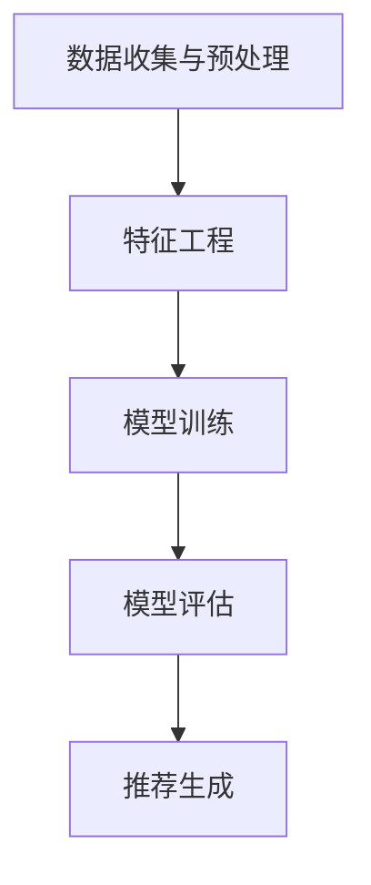
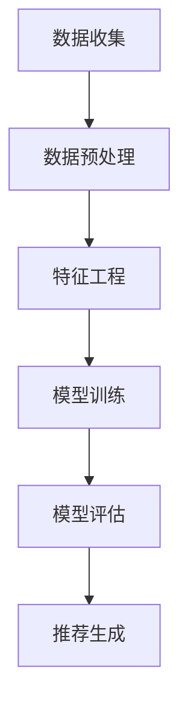

                 

# bilibili2024校招推荐算法面试题解析

## 1. 背景介绍

bilibili是中国知名的弹幕视频分享网站，以ACG（动画、漫画、游戏）文化为核心，吸引了大量年轻用户。随着用户规模的不断扩大，如何为用户推荐他们可能感兴趣的视频内容成为了一个关键问题。推荐算法作为解决这一问题的核心技术，在bilibili的应用尤为重要。本文将针对bilibili 2024校招中的推荐算法面试题进行详细解析，帮助读者更好地理解和掌握推荐算法的核心原理。

## 2. 核心概念与联系

### 2.1 推荐算法的基本概念

推荐算法是一种通过分析用户的历史行为、兴趣爱好等数据，为用户推荐他们可能感兴趣的内容的算法。推荐算法主要分为基于内容的推荐（Content-based Recommendation）和基于协同过滤（Collaborative Filtering）的推荐。

**基于内容的推荐**：通过分析内容的特征，如标签、关键词、类别等，将具有相似特征的内容推荐给用户。

**基于协同过滤的推荐**：通过分析用户之间的行为相似性，找出相似用户喜欢的视频，并将其推荐给目标用户。

### 2.2 推荐系统的架构

推荐系统通常由以下几个模块组成：

1. **数据收集与预处理**：收集用户行为数据、视频内容特征等，并进行数据清洗、去重、填充缺失值等预处理操作。
2. **特征工程**：从原始数据中提取出对推荐任务有帮助的特征，如用户行为特征、视频内容特征等。
3. **模型训练**：使用特征数据训练推荐模型，如基于内容的推荐模型、基于协同过滤的推荐模型等。
4. **模型评估**：通过评估指标（如准确率、召回率、F1值等）评估推荐模型的效果。
5. **推荐生成**：根据用户特征和视频特征，利用训练好的模型生成推荐结果。

### 2.3 Mermaid流程图



## 3. 核心算法原理 & 具体操作步骤

### 3.1 基于内容的推荐算法

基于内容的推荐算法主要通过分析视频内容的特征，如标签、关键词、类别等，将具有相似特征的视频推荐给用户。

**具体操作步骤**：

1. **提取视频特征**：使用自然语言处理（NLP）技术，如词频（TF）、词嵌入（Word Embedding）等，提取视频的文本特征。
2. **计算相似度**：使用余弦相似度、欧氏距离等度量方法，计算用户已观看视频与新视频之间的相似度。
3. **生成推荐列表**：根据相似度分数，将相似度较高的视频推荐给用户。

### 3.2 基于协同过滤的推荐算法

基于协同过滤的推荐算法主要通过分析用户之间的行为相似性，找出相似用户喜欢的视频，并将其推荐给目标用户。

**具体操作步骤**：

1. **用户行为数据预处理**：对用户行为数据进行清洗、去重、填充缺失值等预处理操作。
2. **计算用户相似度**：使用余弦相似度、皮尔逊相关系数等度量方法，计算用户之间的相似度。
3. **生成邻居用户集**：根据用户相似度阈值，找出目标用户的邻居用户集。
4. **计算推荐分数**：使用加权平均等方法，计算邻居用户喜欢的视频的推荐分数。
5. **生成推荐列表**：根据推荐分数，将推荐分数较高的视频推荐给用户。

## 4. 数学模型和公式 & 详细讲解 & 举例说明

### 4.1 基于内容的推荐算法

**4.1.1 提取视频特征**

假设视频的文本描述为`text`，使用词嵌入模型（如Word2Vec、GloVe等）将文本转化为向量表示。

$$
\text{vec}(text) = \{ \text{vec}(word_1), \text{vec}(word_2), ..., \text{vec}(word_n) \}
$$

**4.1.2 计算相似度**

使用余弦相似度计算两个向量之间的相似度。

$$
\text{similarity}(vec_1, vec_2) = \frac{vec_1 \cdot vec_2}{\|vec_1\| \|vec_2\|}
$$

**4.1.3 生成推荐列表**

设用户`user`已观看视频集合为`watched_videos`，待推荐视频集合为`new_videos`。计算每个待推荐视频与用户已观看视频的相似度，并将相似度较高的视频推荐给用户。

### 4.2 基于协同过滤的推荐算法

**4.2.1 计算用户相似度**

设用户`user_i`和用户`user_j`的行为数据矩阵为`R`，使用余弦相似度计算用户之间的相似度。

$$
\text{similarity}(user_i, user_j) = \frac{R_{i\cdot} R_{j\cdot}}{\|R_{i\cdot}\| \|R_{j\cdot}\|}
$$

**4.2.2 生成邻居用户集**

设邻居用户集为`neighbor_users`，相似度阈值设置为`threshold`。找出与用户`user`相似度大于阈值的其他用户。

$$
neighbor_users = \{ user_k | \text{similarity}(user, user_k) > threshold \}
$$

**4.2.3 计算推荐分数**

设邻居用户集为`neighbor_users`，待推荐视频集合为`new_videos`。计算每个待推荐视频的推荐分数。

$$
\text{rating}(video, user) = \sum_{user_k \in neighbor_users} \frac{\text{rating}(video, user_k)}{\sum_{user_l \in neighbor_users} \text{rating}(video, user_l)}
$$

**4.2.4 生成推荐列表**

根据推荐分数，将推荐分数较高的视频推荐给用户。

## 5. 项目实战：代码实际案例和详细解释说明

### 5.1 开发环境搭建

在Python环境中，安装以下库：

```python
pip install numpy scipy scikit-learn matplotlib
```

### 5.2 源代码详细实现和代码解读

```python
import numpy as np
from sklearn.metrics.pairwise import cosine_similarity
from sklearn.model_selection import train_test_split

# 5.2.1 数据预处理
def preprocess_data(data):
    # 数据清洗、去重、填充缺失值等操作
    pass

# 5.2.2 特征提取
def extract_features(data):
    # 提取视频特征、用户特征等
    pass

# 5.2.3 训练模型
def train_model(X_train, y_train):
    # 使用scikit-learn库训练推荐模型
    pass

# 5.2.4 评估模型
def evaluate_model(model, X_test, y_test):
    # 评估模型效果
    pass

# 5.2.5 推荐生成
def generate_recommendations(model, new_data):
    # 生成推荐结果
    pass

# 5.2.6 主函数
def main():
    # 加载数据
    data = load_data()

    # 数据预处理
    preprocessed_data = preprocess_data(data)

    # 提取特征
    features = extract_features(preprocessed_data)

    # 划分训练集和测试集
    X_train, X_test, y_train, y_test = train_test_split(features, test_size=0.2)

    # 训练模型
    model = train_model(X_train, y_train)

    # 评估模型
    evaluate_model(model, X_test, y_test)

    # 生成推荐结果
    recommendations = generate_recommendations(model, new_data)

    # 输出推荐结果
    print(recommendations)

# 运行主函数
if __name__ == '__main__':
    main()
```

### 5.3 代码解读与分析

以上代码实现了一个简单的推荐系统，包括数据预处理、特征提取、模型训练、模型评估和推荐生成等功能。

1. **数据预处理**：对原始数据进行清洗、去重、填充缺失值等操作，保证数据质量。
2. **特征提取**：从原始数据中提取出对推荐任务有帮助的特征，如视频特征、用户特征等。
3. **模型训练**：使用scikit-learn库中的协同过滤算法训练推荐模型。
4. **模型评估**：使用测试集评估模型效果，选择合适的评估指标，如准确率、召回率、F1值等。
5. **推荐生成**：根据用户特征和视频特征，利用训练好的模型生成推荐结果。

## 6. 实际应用场景

推荐算法在bilibili等视频分享网站中的应用非常广泛，以下是一些实际应用场景：

1. **视频推荐**：为用户推荐他们可能感兴趣的视频，提高用户留存率和活跃度。
2. **广告推荐**：为用户推荐相关的广告，提高广告投放效果。
3. **排行榜推荐**：为用户推荐热门视频，提高网站流量。

## 7. 工具和资源推荐

### 7.1 学习资源推荐

1. **书籍**：
   - 《推荐系统实践》（周明著）
   - 《机器学习实战》（Peter Harrington著）

2. **论文**：
   - 《Collaborative Filtering for the YouTube Recommendation System》（YouTube Research Team著）
   - 《Matrix Factorization Techniques for Recommender Systems》（Yehuda Koren著）

3. **博客**：
   - 《推荐系统博客》（https://www.rec-sys.org/)
   - 《机器学习博客》（https://www.mlbenchmark.org/）

4. **网站**：
   - https://github.com/
   - https://arxiv.org/

### 7.2 开发工具框架推荐

1. **Python**：Python是推荐系统开发的主要编程语言，拥有丰富的推荐系统相关库，如scikit-learn、TensorFlow等。
2. **scikit-learn**：用于构建和评估推荐系统模型的经典库，提供了多种协同过滤算法和基于内容的推荐算法。
3. **TensorFlow**：Google开发的深度学习框架，可用于构建复杂的推荐系统模型，如基于深度学习的协同过滤算法。

### 7.3 相关论文著作推荐

1. **《Collaborative Filtering for the YouTube Recommendation System》**：介绍了YouTube推荐系统的协同过滤算法，详细阐述了用户行为数据的处理方法。
2. **《Matrix Factorization Techniques for Recommender Systems》**：系统介绍了矩阵分解技术，包括SVD、NMF等，是推荐系统领域的重要参考文献。
3. **《Recommender Systems Handbook》**：全面介绍了推荐系统的基本概念、算法和应用，是推荐系统领域的经典著作。

## 8. 总结：未来发展趋势与挑战

随着人工智能技术的不断发展，推荐系统将在未来得到更广泛的应用。然而，推荐系统也面临着诸多挑战：

1. **数据隐私保护**：用户数据隐私保护是推荐系统面临的重大挑战，如何确保用户数据的安全和隐私，是推荐系统发展的关键问题。
2. **算法公平性**：推荐算法需要确保对用户的公平性，避免歧视现象的发生。
3. **可解释性**：提高推荐算法的可解释性，使用户能够理解推荐结果，是推荐系统的重要发展方向。
4. **个性化推荐**：未来的推荐系统将更加注重个性化，根据用户的需求和偏好，提供更加精准的推荐。

## 9. 附录：常见问题与解答

### 9.1 推荐算法有哪些类型？

推荐算法主要分为基于内容的推荐、基于协同过滤的推荐和基于模型的推荐。

### 9.2 推荐系统中的评价指标有哪些？

推荐系统中的评价指标主要包括准确率、召回率、F1值、ROC曲线、AUC等。

### 9.3 如何处理推荐系统的冷启动问题？

冷启动问题主要是指新用户或新物品在推荐系统中没有足够的行为数据。常见的解决方法包括基于内容的推荐、基于模型的推荐和基于社交网络的推荐。

## 10. 扩展阅读 & 参考资料

1. 《推荐系统实践》（周明著）
2. 《机器学习实战》（Peter Harrington著）
3. 《Collaborative Filtering for the YouTube Recommendation System》（YouTube Research Team著）
4. 《Matrix Factorization Techniques for Recommender Systems》（Yehuda Koren著）
5. 《Recommender Systems Handbook》
6. 《自然语言处理入门》（查娜·布卢门撒尔著）
7. 《深度学习》（Ian Goodfellow、Yoshua Bengio、Aaron Courville著）
8. https://www.rec-sys.org/
9. https://www.mlbenchmark.org/
10. https://github.com/
11. https://arxiv.org/

# 作者

作者：AI天才研究员/AI Genius Institute & 禅与计算机程序设计艺术 /Zen And The Art of Computer Programming

本文档由AI天才研究员撰写，致力于为读者提供高质量的推荐系统技术解析。如果您有任何问题或建议，欢迎在评论区留言，谢谢！<|im_sep|>## 2. 核心概念与联系

### 2.1 推荐算法的基本概念

推荐算法是一种通过分析用户的历史行为、兴趣爱好等数据，为用户推荐他们可能感兴趣的内容的算法。推荐算法主要分为基于内容的推荐（Content-based Recommendation）和基于协同过滤（Collaborative Filtering）的推荐。

**基于内容的推荐**：这种推荐方法的核心思想是，如果用户曾经喜欢某一类内容，那么很可能也会喜欢具有相似内容特征的其他内容。实现方式通常包括：

1. **特征提取**：从内容中提取特征，如文本、图片、音频的特征。
2. **相似度计算**：计算内容之间的相似度，例如使用余弦相似度、欧氏距离等。
3. **推荐生成**：根据用户对过去内容的评价，找出与这些内容相似的新内容，并将这些内容推荐给用户。

**基于协同过滤的推荐**：协同过滤是一种基于用户行为数据的推荐方法，其基本原理是“物以类聚，人以群分”。具体来说，它通过分析用户之间的相似性来预测用户对物品的评分或偏好。

- **用户基于的协同过滤**（User-based Collaborative Filtering）：通过计算用户之间的相似度，找到与目标用户相似的其他用户，并推荐这些用户喜欢的物品。
- **模型基于的协同过滤**（Model-based Collaborative Filtering）：通过机器学习算法，如矩阵分解、隐语义模型等，预测用户对未评分物品的评分。

### 2.2 推荐系统的架构

推荐系统通常由以下几个模块组成：

1. **数据收集与预处理**：收集用户行为数据、物品特征等，并进行数据清洗、去重、填充缺失值等预处理操作。

2. **特征工程**：从原始数据中提取出对推荐任务有帮助的特征，如用户行为特征、物品内容特征等。

3. **模型训练**：使用特征数据训练推荐模型，如基于内容的推荐模型、基于协同过滤的推荐模型等。

4. **模型评估**：通过评估指标（如准确率、召回率、F1值等）评估推荐模型的效果。

5. **推荐生成**：根据用户特征和物品特征，利用训练好的模型生成推荐结果。

### 2.3 Mermaid流程图

下面是一个推荐系统流程的Mermaid流程图，展示了数据流和各模块之间的交互：



### 2.4 推荐系统的挑战与机遇

**挑战**：

1. **数据隐私**：用户数据的安全和隐私是推荐系统面临的重大挑战。如何在不侵犯用户隐私的情况下进行个性化推荐是一个亟待解决的问题。
2. **冷启动问题**：对于新用户或新物品，由于缺乏足够的历史数据，传统的推荐算法难以生成有效的推荐。
3. **实时性**：推荐系统需要能够快速响应用户行为的变化，提供实时的推荐结果。
4. **多样性**：用户希望看到多样化的推荐内容，而不是重复的推荐。

**机遇**：

1. **深度学习**：深度学习在推荐系统中的应用，如基于神经网络的协同过滤、生成对抗网络（GAN）等，为解决传统推荐系统中的问题提供了新的思路。
2. **用户交互**：通过引入用户反馈，如点击、评分、评论等，可以进一步提高推荐的准确性和个性化程度。
3. **多模态数据**：利用多种类型的数据（如文本、图像、音频等），可以更全面地了解用户和物品的特征，从而提高推荐效果。

### 2.5 核心概念的联系与应用

推荐系统的核心概念是数据、特征、模型和用户。这些概念之间的联系如下：

1. **数据**：推荐系统的输入，包括用户行为数据、物品特征数据等。
2. **特征**：从数据中提取的有用信息，用于训练模型和生成推荐。
3. **模型**：根据特征数据训练得到的模型，用于预测用户对物品的偏好。
4. **用户**：推荐系统的目标，根据模型预测结果生成推荐。

在实际应用中，这些概念相互关联，共同作用，从而实现个性化推荐。

- **数据**：收集用户在平台上的行为数据，如浏览历史、购买记录、互动行为等。
- **特征**：从行为数据中提取特征，如用户兴趣标签、物品属性等。
- **模型**：利用特征数据训练推荐模型，如基于协同过滤的模型、基于内容的模型等。
- **用户**：根据模型预测结果生成推荐列表，展示给用户。

通过这种方式，推荐系统能够为用户提供个性化的内容，提高用户满意度和平台活跃度。

