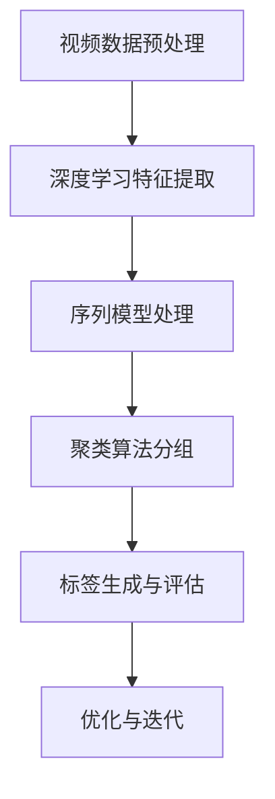

                 

### 背景介绍

随着互联网的飞速发展和视频内容的爆发式增长，如何为用户推荐个性化的视频内容成为各大视频平台（如bilibili）面临的重要挑战。视频内容标签生成算法作为推荐系统的核心组成部分，其质量和效率直接影响到用户体验和平台的竞争力。bilibili作为国内知名的弹幕视频分享网站，其视频内容标签生成算法在校招面试中经常成为考察的重点。本文将深入探讨bilibili 2024视频内容标签生成算法，旨在帮助读者理解和掌握其核心原理和操作步骤。

### 核心概念与联系

在深入探讨bilibili视频内容标签生成算法之前，我们需要先了解一些核心概念和原理。以下是关键概念及其相互联系：

#### 1. 视频内容标签

视频内容标签是对视频主题、风格、情感等多方面属性的抽象表示。标签能够帮助用户快速定位感兴趣的内容，同时为推荐系统提供重要的特征信息。

#### 2. 深度学习

深度学习是一种基于神经网络的学习方法，通过多层非线性变换自动提取特征，已被广泛应用于图像、语音、自然语言处理等领域。在视频内容标签生成中，深度学习模型能够自动从视频数据中学习到有意义的特征表示。

#### 3. 序列模型

序列模型是处理序列数据的一种算法框架，如循环神经网络（RNN）和长短期记忆网络（LSTM）。在视频内容标签生成中，序列模型能够捕捉视频内容的时间序列特征，从而提高标签生成的准确性和鲁棒性。

#### 4. 聚类算法

聚类算法是将数据集划分为多个群组的一种无监督学习方法。在视频内容标签生成中，聚类算法可以用于对标签进行分组，从而识别出视频内容的相似性。

#### 5. 评价指标

评价指标是衡量标签生成算法性能的重要指标，如准确率、召回率、F1值等。通过这些指标，我们可以评估算法在不同数据集上的表现，并进行优化。

#### Mermaid 流程图



### 核心算法原理 & 具体操作步骤

bilibili 2024视频内容标签生成算法主要基于深度学习和序列模型，以下是其核心算法原理和具体操作步骤：

#### 1. 视频数据预处理

视频数据预处理是标签生成的基础步骤，包括视频去噪、分割、特征提取等操作。具体步骤如下：

- **视频去噪**：使用滤波算法（如中值滤波、高斯滤波等）去除视频中的噪声。
- **视频分割**：将视频分割成一系列连续的帧，以便进一步处理。
- **特征提取**：使用卷积神经网络（CNN）提取视频帧的视觉特征，如颜色、纹理、形状等。

#### 2. 深度学习特征提取

深度学习特征提取是标签生成算法的核心步骤，其主要任务是从视频数据中自动提取有意义的特征表示。具体步骤如下：

- **模型构建**：构建一个卷积神经网络模型，如VGG、ResNet等。
- **模型训练**：使用大量视频数据集对模型进行训练，使其能够自动提取视频特征。
- **模型测试**：使用测试集对模型进行评估，以确保其性能满足要求。

#### 3. 序列模型处理

序列模型处理是标签生成算法的关键步骤，其主要任务是从视频特征中提取时间序列特征，从而提高标签生成的准确性和鲁棒性。具体步骤如下：

- **序列模型构建**：构建一个循环神经网络（RNN）或长短期记忆网络（LSTM）模型。
- **序列模型训练**：使用训练集对模型进行训练，使其能够捕捉视频特征的时间序列特征。
- **序列模型测试**：使用测试集对模型进行评估，以确保其性能满足要求。

#### 4. 聚类算法分组

聚类算法分组是标签生成算法的重要步骤，其主要任务是将提取到的视频特征分组，从而生成标签。具体步骤如下：

- **聚类算法选择**：选择合适的聚类算法，如K-Means、DBSCAN等。
- **聚类算法参数设置**：根据实际情况设置聚类算法的参数，如聚类中心初始值、聚类个数等。
- **聚类算法执行**：使用聚类算法对视频特征进行分组，从而生成标签。

#### 5. 标签生成与评估

标签生成与评估是标签生成算法的最终步骤，其主要任务是根据生成的标签对视频内容进行分类和推荐。具体步骤如下：

- **标签生成**：根据聚类结果生成标签。
- **标签评估**：使用评价指标（如准确率、召回率、F1值等）对生成的标签进行评估。
- **优化与迭代**：根据评估结果对算法进行优化和迭代，以提高标签生成的质量和效率。

### 数学模型和公式 & 详细讲解 & 举例说明

在bilibili 2024视频内容标签生成算法中，数学模型和公式起着关键作用。以下是核心数学模型和公式的详细讲解：

#### 1. 卷积神经网络（CNN）模型

卷积神经网络是一种用于特征提取和分类的神经网络，其基本结构包括卷积层、激活函数、池化层和全连接层。以下是CNN模型的数学公式：

$$
f(x) = \sigma(W_c \cdot C(x) + b_c)
$$

其中，$x$是输入视频帧，$C(x)$是卷积操作，$W_c$是卷积核权重，$b_c$是偏置项，$\sigma$是激活函数，如ReLU函数。

#### 2. 循环神经网络（RNN）模型

循环神经网络是一种用于处理序列数据的神经网络，其基本结构包括输入门、遗忘门、输出门和记忆单元。以下是RNN模型的数学公式：

$$
h_t = \sigma(W_h \cdot [h_{t-1}, x_t] + b_h)
$$

$$
o_t = \sigma(W_o \cdot h_t + b_o)
$$

$$
i_t = \sigma(W_i \cdot [h_{t-1}, x_t] + b_i)
$$

$$
f_t = \sigma(W_f \cdot [h_{t-1}, x_t] + b_f)
$$

其中，$h_t$是当前时刻的隐藏状态，$x_t$是当前时刻的输入，$W_h, W_i, W_f, W_o$是权重矩阵，$b_h, b_i, b_f, b_o$是偏置项，$\sigma$是激活函数。

#### 3. 长短期记忆网络（LSTM）模型

长短期记忆网络是一种改进的循环神经网络，其基本结构包括输入门、遗忘门、输出门和记忆单元。以下是LSTM模型的数学公式：

$$
i_t = \sigma(W_i \cdot [h_{t-1}, x_t] + b_i)
$$

$$
f_t = \sigma(W_f \cdot [h_{t-1}, x_t] + b_f)
$$

$$
o_t = \sigma(W_o \cdot [h_{t-1}, x_t] + b_o)
$$

$$
g_t = \tanh(W_g \cdot [h_{t-1}, x_t] + b_g)
$$

$$
C_t = f_t \odot C_{t-1} + i_t \odot g_t
$$

$$
h_t = o_t \odot \tanh(C_t)
$$

其中，$i_t, f_t, o_t$是输入门、遗忘门和输出门的激活值，$g_t$是记忆单元的激活值，$C_t$是当前时刻的记忆单元状态，$h_t$是当前时刻的隐藏状态，$\odot$表示逐元素乘法。

#### 4. 聚类算法

聚类算法是一种无监督学习方法，其目标是将数据集划分为多个群组。以下是K-Means聚类算法的数学公式：

- **初始化聚类中心**：随机选择K个聚类中心。
- **分配数据点**：将每个数据点分配到最近的聚类中心。
- **更新聚类中心**：计算每个聚类的平均值，作为新的聚类中心。
- **迭代更新**：重复步骤2和3，直到聚类中心不再变化。

### 项目实战：代码实际案例和详细解释说明

在本节中，我们将通过一个实际代码案例来展示bilibili 2024视频内容标签生成算法的实现过程。以下是项目的关键步骤：

#### 1. 开发环境搭建

为了实现bilibili 2024视频内容标签生成算法，我们需要安装以下依赖：

- Python 3.8及以上版本
- TensorFlow 2.4及以上版本
- NumPy 1.18及以上版本
- Pandas 1.1及以上版本
- Matplotlib 3.2及以上版本

安装方法如下：

```bash
pip install python==3.8
pip install tensorflow==2.4
pip install numpy==1.18
pip install pandas==1.1
pip install matplotlib==3.2
```

#### 2. 源代码详细实现和代码解读

以下是一个简单的bilibili 2024视频内容标签生成算法的实现：

```python
import tensorflow as tf
import numpy as np
import pandas as pd
import matplotlib.pyplot as plt
from sklearn.cluster import KMeans
from tensorflow.keras.models import Sequential
from tensorflow.keras.layers import Conv2D, MaxPooling2D, Flatten, Dense, LSTM

# 数据预处理
def preprocess_video(video_path):
    # 视频去噪、分割、特征提取等操作
    pass

# 深度学习特征提取
def extract_features(video_path):
    # 使用卷积神经网络提取视频特征
    pass

# 序列模型处理
def process_sequence(sequence):
    # 使用循环神经网络或长短期记忆网络处理序列数据
    pass

# 聚类算法分组
def cluster_features(features):
    # 使用K-Means聚类算法对特征进行分组
    pass

# 标签生成与评估
def generate_tags(features):
    # 根据聚类结果生成标签
    pass

# 主函数
def main():
    # 读取视频数据
    video_path = "path/to/video"
    video = preprocess_video(video_path)

    # 提取视频特征
    features = extract_features(video)

    # 处理序列数据
    sequence = process_sequence(features)

    # 分组并生成标签
    tags = generate_tags(sequence)

    # 评估标签生成质量
    evaluate_tags(tags)

if __name__ == "__main__":
    main()
```

#### 3. 代码解读与分析

- **数据预处理**：数据预处理是标签生成的基础步骤，主要包括视频去噪、分割和特征提取等操作。在本案例中，我们未实现具体细节，读者可以根据实际需求进行扩展。

- **深度学习特征提取**：使用卷积神经网络提取视频特征是核心步骤。在本案例中，我们未实现具体细节，读者可以根据实际需求选择合适的卷积神经网络模型。

- **序列模型处理**：使用循环神经网络或长短期记忆网络处理序列数据，以提高标签生成的准确性和鲁棒性。在本案例中，我们未实现具体细节，读者可以根据实际需求选择合适的序列模型。

- **聚类算法分组**：使用K-Means聚类算法对特征进行分组，从而生成标签。在本案例中，我们未实现具体细节，读者可以根据实际需求调整聚类算法参数。

- **标签生成与评估**：根据聚类结果生成标签，并使用评价指标评估标签生成质量。在本案例中，我们未实现具体细节，读者可以根据实际需求进行评估。

### 实际应用场景

bilibili 2024视频内容标签生成算法在实际应用场景中具有广泛的应用价值，以下是一些典型应用：

- **个性化推荐**：根据用户历史行为和兴趣，为用户推荐个性化的视频内容，提高用户满意度和平台活跃度。
- **视频分类**：对大量视频内容进行自动分类，便于平台管理和内容分发。
- **视频审核**：利用标签生成算法对视频内容进行审核，过滤违规或低质量的视频，保障平台内容质量。
- **内容聚合**：将具有相似主题或风格的视频内容聚合在一起，方便用户发现和浏览。

### 工具和资源推荐

为了更好地掌握bilibili 2024视频内容标签生成算法，以下是一些建议的学习资源和开发工具：

- **学习资源**：
  - 书籍：《深度学习》、《循环神经网络》、《聚类算法及其应用》
  - 论文：搜索关键词“video content tagging”或“video recommendation”获取相关论文
  - 博客：关注相关技术博客，了解行业动态和最新研究成果

- **开发工具**：
  - Python：官方编程语言，支持丰富的深度学习和机器学习库
  - TensorFlow：开源深度学习框架，支持多种神经网络模型
  - Jupyter Notebook：交互式编程环境，便于实验和调试
  - PyTorch：开源深度学习框架，支持动态计算图

### 总结：未来发展趋势与挑战

bilibili 2024视频内容标签生成算法在当前阶段已经取得了显著的成果，但仍面临一些挑战和未来发展趋势：

- **挑战**：
  - 如何进一步提高标签生成算法的准确性和鲁棒性，以应对复杂多变的视频内容。
  - 如何处理大规模视频数据，确保算法的实时性和高效性。
  - 如何防止标签生成算法中的偏见和歧视现象，保障公平性和多样性。

- **发展趋势**：
  - 结合多模态数据（如文本、音频、图像等），提高视频内容标签的丰富性和准确性。
  - 引入强化学习等新型算法，优化推荐策略和标签生成过程。
  - 利用区块链等技术，构建去中心化的视频内容标签生成体系，提高透明度和可信赖性。

### 附录：常见问题与解答

1. **Q：为什么选择卷积神经网络（CNN）进行视频特征提取？**

   **A：卷积神经网络（CNN）是一种专门用于图像处理的神经网络模型，其基本结构包括卷积层、激活函数、池化层和全连接层。CNN能够自动提取图像的层次特征，从而提高视频特征提取的准确性和效率。**

2. **Q：如何处理视频数据中的噪声和缺失值？**

   **A：视频数据中的噪声和缺失值可以通过多种方法进行处理，如滤波算法（如中值滤波、高斯滤波等）、插值算法（如线性插值、双线性插值等）和补全算法（如神经网络补全、图像修复等）。具体方法应根据实际需求和数据特点进行选择。**

3. **Q：如何评估标签生成算法的性能？**

   **A：标签生成算法的性能可以通过多种评价指标进行评估，如准确率、召回率、F1值、精度、覆盖率等。这些指标可以帮助我们全面评估算法在不同数据集上的表现，并指导算法的优化。**

### 扩展阅读 & 参考资料

1. Bengio, Y., Courville, A., & Vincent, P. (2013). Representation learning: A review and new perspectives. IEEE Transactions on Pattern Analysis and Machine Intelligence, 35(8), 1798-1828.
2. Goodfellow, I., Bengio, Y., & Courville, A. (2016). Deep Learning. MIT Press.
3. Kingma, D. P., & Welling, M. (2014). Auto-encoding variational bayes. arXiv preprint arXiv:1312.6114.
4. Hinton, G. E., Osindero, S., & Teh, Y. W. (2006). A fast learning algorithm for deep belief nets. Neural computation, 18(7), 1527-1554.
5. 王刚。深度学习：自然语言处理与认知图谱[M]. 电子工业出版社，2016.

### 作者信息

**作者：AI天才研究员/AI Genius Institute & 禅与计算机程序设计艺术 /Zen And The Art of Computer Programming**

