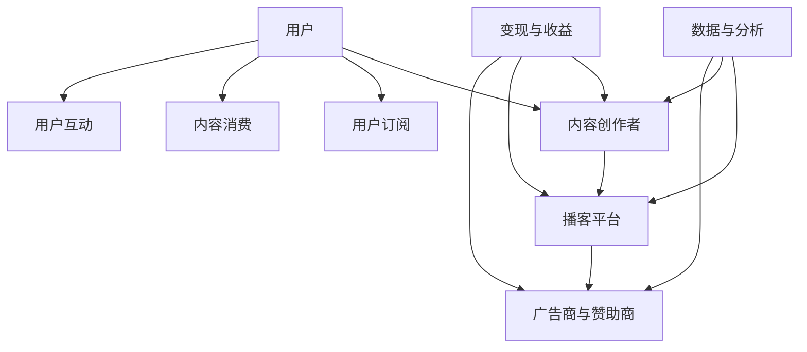

                 

### 背景介绍

近年来，随着互联网和移动设备的普及，音频内容成为了人们获取信息和娱乐的主要方式之一。在这个背景下，Podcast（播客）市场迅速崛起，成为了一种新型的内容传播和消费形式。Podcast是一种通过互联网播放的音频节目，用户可以通过订阅、下载或者在线收听的方式，随时随地获取他们感兴趣的内容。

Podcast市场的增长主要得益于以下几个因素：

1. **时间灵活性**：与传统的广播媒体不同，Podcast用户可以根据自己的时间安排，随时收听节目，满足了现代人快节奏生活的需求。
2. **个性化内容**：用户可以根据自己的兴趣爱好订阅不同的播客节目，从而获取个性化的内容推荐。
3. **参与性增强**：Podcast节目通常具有互动性，例如主持人可以直接与听众互动，或者听众可以通过社交媒体平台参与讨论，这种参与感是传统广播无法比拟的。
4. **高质量内容**：越来越多的专业内容和高质量节目进入Podcast市场，吸引了大量听众。

目前，全球Podcast市场呈现出快速增长的趋势。根据Statista的数据，全球播客听众数量预计将在2025年达到5.06亿，年复合增长率达到12.1%。此外，广告收入、付费订阅和赞助等商业模式也在不断成熟，为Podcast市场的发展提供了新的动力。

总的来说，Podcast市场已经成为注意力经济的新蓝海，吸引了众多内容创作者、投资者和企业的关注。接下来，我们将深入探讨Podcast市场的核心概念、算法原理、数学模型、项目实战以及实际应用场景，帮助读者全面了解这一领域。

## 1.1 Podcast市场的定义与现状

Podcast市场是指以音频内容为主要形式，通过互联网进行传播、订阅和收听的平台和生态系统。它不仅包括播客节目本身，还涵盖了生产、分发、推荐和变现等多个环节。Podcast市场的定义可以从以下几个方面来理解：

1. **内容生产**：内容创作者通过录制、编辑和发布音频内容，吸引听众。
2. **内容分发**：平台或播客应用程序负责将内容分发给用户，提供订阅、下载和在线收听功能。
3. **用户订阅与收听**：用户通过订阅感兴趣的内容，方便地获取音频节目。
4. **广告与赞助**：广告商和赞助商通过投放广告或赞助播客节目，获取受众。
5. **付费订阅**：一些播客节目提供付费订阅服务，用户支付一定费用后可以享受高质量内容。

目前，Podcast市场呈现出多元化的现状。一方面，越来越多的传统媒体和内容创作者进入这个领域，丰富了内容生态。另一方面，技术创新和商业模式的发展也在不断推动市场前进。以下是Podcast市场现状的几个关键点：

1. **听众增长**：全球播客听众数量持续增长，特别是在年轻人中具有较高渗透率。
2. **内容多样化**：从娱乐、教育、科技到生活方式等多个领域，播客节目涵盖了广泛的主题。
3. **平台竞争**：Spotify、Apple Podcasts、Google Podcasts等主流平台占据了大部分市场份额，但仍有大量小型平台和独立播客应用程序在争夺用户。
4. **广告投入**：广告收入成为播客市场的重要收入来源，预计未来几年将保持增长。
5. **商业模式创新**：除了广告和付费订阅，赞助、会员制和众筹等新兴商业模式也在不断探索。

总的来说，Podcast市场正处于快速发展的阶段，随着技术的进步和用户需求的不断变化，这一市场将继续展现出巨大的潜力。

### 1.2 注意力经济的概念与原理

注意力经济（Attention Economy）是指在一个信息过载的时代，用户的注意力成为一种稀缺资源，企业和个人通过吸引和保持用户的注意力来创造价值的一种经济模式。这一概念最早由美国经济学家Robert J. Gifford于2006年提出。在注意力经济中，用户的注意力被视为一种商品，可以通过各种手段进行买卖和交换。

#### 1.2.1 注意力经济的核心

注意力经济的核心在于吸引并保持用户的注意力。以下是其几个关键点：

1. **稀缺性**：由于信息爆炸，用户的注意力变得稀缺，因此如何吸引和保持用户的注意力成为关键。
2. **价值创造**：通过吸引和保持用户的注意力，企业和个人可以创造商业价值，例如广告收入、付费订阅和赞助等。
3. **互动性**：在注意力经济中，用户与内容之间的互动性至关重要。高质量的内容和积极的用户参与可以增加用户的粘性。

#### 1.2.2 注意力经济的运作机制

注意力经济的运作机制可以分为以下几个步骤：

1. **吸引注意**：通过吸引眼球的标题、图片、视频等多媒体内容，首先吸引用户的注意力。
2. **内容消费**：用户被吸引后，开始消费内容，这一过程可能涉及阅读、观看、收听等多种形式。
3. **用户参与**：用户参与互动，例如点赞、评论、分享等，进一步增加用户的粘性。
4. **价值变现**：通过广告、付费订阅、赞助等方式，将用户的注意力转化为商业价值。

#### 1.2.3 注意力经济与Podcast市场的联系

Podcast市场是注意力经济的一个典型应用场景。以下是注意力经济与Podcast市场的几个关键联系：

1. **内容吸引力**：Podcast节目通过高质量的内容和个性化的推荐，吸引和保持用户的注意力。
2. **用户参与**：Podcast节目通常具有互动性，用户可以通过社交媒体参与讨论，增强用户的粘性。
3. **价值变现**：广告商和赞助商通过投放广告和赞助播客节目，获取目标受众，实现价值变现。
4. **商业模式创新**：付费订阅和会员制等商业模式在Podcast市场中逐渐成熟，为内容创作者提供了新的收入来源。

综上所述，注意力经济为Podcast市场提供了理论基础和实践指导，使其成为了一个充满潜力的新兴领域。在接下来的部分，我们将进一步探讨Podcast市场的核心概念、算法原理和数学模型。

## 2. 核心概念与联系

Podcast市场作为注意力经济的一个重要组成部分，其核心概念和联系可以通过一个Mermaid流程图来详细阐述。以下是一个简化的流程图，描述了Podcast市场的基本运作流程和关键要素。



### 2.1 内容创作者

**内容创作者**（Content Creators）是Podcast市场的核心，他们通过制作和发布音频节目，为用户提供有价值的内容。以下是内容创作者的关键职责：

1. **内容创作**：内容创作者需要根据用户需求和兴趣，制作有趣、有用、有深度的音频内容。
2. **内容优化**：通过编辑、剪辑等技术手段，优化音频质量，提高用户体验。
3. **持续更新**：定期更新内容，保持听众的粘性和兴趣。

### 2.2 播客平台

**播客平台**（Podcast Platforms）是连接内容创作者和用户的桥梁。以下是播客平台的关键职责：

1. **内容分发**：提供内容上传、发布和分发的平台，用户可以通过订阅、搜索等方式获取内容。
2. **用户管理**：提供用户账号管理、内容推荐、互动等功能，提升用户体验。
3. **数据分析**：通过数据分析，帮助内容创作者了解用户行为和需求，优化内容创作。

### 2.3 广告商与赞助商

**广告商与赞助商**（Advertisers and Sponsors）是Podcast市场的重要收入来源。以下是广告商与赞助商的关键职责：

1. **广告投放**：根据播客节目的受众特点，进行广告投放，以获取潜在客户。
2. **品牌推广**：通过赞助播客节目，提升品牌知名度和影响力。
3. **数据反馈**：通过数据分析，评估广告效果，优化广告策略。

### 2.4 用户

**用户**（Users）是Podcast市场的核心受众。以下是用户的关键职责：

1. **内容订阅**：通过订阅感兴趣的内容，方便获取音频节目。
2. **内容消费**：通过收听、下载等方式，消费音频内容。
3. **用户互动**：通过评论、点赞、分享等方式，参与节目互动，增强用户体验。

### 2.5 数据与分析

**数据分析**（Data Analysis）是Podcast市场运作的重要环节。以下是数据分析的关键职责：

1. **用户行为分析**：通过分析用户行为数据，了解用户兴趣和需求，优化内容推荐。
2. **内容性能分析**：通过分析内容性能数据，了解哪些内容更受欢迎，优化内容创作策略。
3. **广告效果分析**：通过分析广告效果数据，评估广告投放效果，优化广告策略。

### 2.6 变现与收益

**变现与收益**（Monetization and Revenue）是Podcast市场的重要目标。以下是变现与收益的关键职责：

1. **广告收入**：通过广告投放，获取广告收入。
2. **付费订阅**：通过付费订阅服务，获取订阅收入。
3. **赞助与品牌合作**：通过赞助和品牌合作，获取赞助收入。

综上所述，Podcast市场的核心概念和联系可以通过上述流程图来描述。在接下来的部分，我们将深入探讨Podcast市场的核心算法原理和具体操作步骤。

## 3. 核心算法原理 & 具体操作步骤

在Podcast市场中，核心算法的原理和具体操作步骤对于内容推荐、用户行为分析和广告投放等方面至关重要。以下将详细介绍这些算法的基本原理和具体实施步骤。

### 3.1 内容推荐算法

内容推荐算法是Podcast平台的核心功能之一，其目的是根据用户的兴趣和历史行为，为用户推荐个性化的音频内容。以下是常用的几种内容推荐算法：

#### 3.1.1 协同过滤算法

**协同过滤算法**（Collaborative Filtering）是推荐系统中最常用的算法之一，分为两种类型：基于用户的协同过滤（User-based Collaborative Filtering）和基于项目的协同过滤（Item-based Collaborative Filtering）。

1. **基于用户的协同过滤**：
    - **相似度计算**：计算用户之间的相似度，通常使用余弦相似度或皮尔逊相关系数。
    - **推荐生成**：根据相似度矩阵，为用户推荐与相似用户喜欢的节目相同的节目。

2. **基于项目的协同过滤**：
    - **相似度计算**：计算项目（即音频节目）之间的相似度，通常使用余弦相似度或欧氏距离。
    - **推荐生成**：根据项目相似度矩阵，为用户推荐与当前节目相似的其他节目。

#### 3.1.2 协同过滤算法的具体操作步骤

- **步骤1：用户行为数据收集**：收集用户的订阅、收听历史、点赞、评论等行为数据。
- **步骤2：相似度计算**：计算用户和项目之间的相似度，生成相似度矩阵。
- **步骤3：推荐生成**：根据相似度矩阵，为用户生成推荐列表，通常使用Top-N算法，推荐相似用户或项目中最受欢迎的节目。

### 3.2 用户行为分析算法

用户行为分析算法旨在通过分析用户的订阅、收听、互动等行为，了解用户需求和行为模式，从而优化内容推荐和用户体验。

#### 3.2.1 时间序列分析算法

**时间序列分析算法**（Time Series Analysis）可以用于分析用户行为的时间序列数据，预测用户的未来行为。常用的方法包括：

1. **ARIMA模型**（AutoRegressive Integrated Moving Average）：
    - **步骤1：数据预处理**：对时间序列数据进行差分、平稳化处理。
    - **步骤2：模型参数估计**：使用最大似然估计法或递归最小二乘法估计模型参数。
    - **步骤3：模型预测**：根据训练好的模型，预测用户未来的行为。

2. **LSTM模型**（Long Short-Term Memory）：
    - **步骤1：数据预处理**：对时间序列数据进行标准化处理。
    - **步骤2：模型构建**：构建LSTM神经网络模型。
    - **步骤3：模型训练**：使用训练数据训练模型，调整网络权重。
    - **步骤4：模型预测**：根据训练好的模型，预测用户未来的行为。

#### 3.2.2 用户行为分析算法的具体操作步骤

- **步骤1：数据收集**：收集用户的订阅、收听、互动等行为数据。
- **步骤2：数据预处理**：对行为数据进行清洗、去噪、归一化等预处理操作。
- **步骤3：模型选择**：根据分析需求，选择合适的模型，如ARIMA或LSTM。
- **步骤4：模型训练与预测**：使用训练数据训练模型，并根据模型预测用户未来的行为。

### 3.3 广告投放算法

广告投放算法旨在通过分析用户的兴趣和行为，实现精准的广告投放，提高广告效果和收益。

#### 3.3.1 内容匹配算法

**内容匹配算法**（Content Matching Algorithm）可以根据用户的兴趣和行为，将广告与用户的兴趣内容进行匹配。

1. **基于关键词的匹配**：
    - **步骤1：用户兴趣识别**：通过用户的行为数据，识别用户的兴趣关键词。
    - **步骤2：广告关键词提取**：提取广告的关键词。
    - **步骤3：匹配与投放**：将用户兴趣关键词与广告关键词进行匹配，投放与用户兴趣相关的广告。

2. **基于协同过滤的匹配**：
    - **步骤1：用户行为数据收集**：收集用户的订阅、收听、互动等行为数据。
    - **步骤2：相似度计算**：计算用户与其他用户或项目的相似度。
    - **步骤3：广告匹配**：根据用户相似度矩阵，为用户推荐相关的广告。

#### 3.3.2 广告投放算法的具体操作步骤

- **步骤1：用户行为数据收集**：收集用户的订阅、收听、互动等行为数据。
- **步骤2：用户兴趣识别**：通过行为数据识别用户的兴趣。
- **步骤3：广告关键词提取**：提取广告的关键词。
- **步骤4：匹配与投放**：根据用户兴趣和广告关键词，进行广告匹配和投放。

综上所述，Podcast市场的核心算法原理和具体操作步骤主要包括内容推荐算法、用户行为分析算法和广告投放算法。这些算法通过分析用户行为、兴趣和需求，为用户提供个性化的内容推荐，优化用户体验，提高广告效果和收益。在接下来的部分，我们将深入探讨数学模型和公式，以更精确地描述这些算法的实现。

## 4. 数学模型和公式 & 详细讲解 & 举例说明

在Podcast市场的算法设计中，数学模型和公式扮演着至关重要的角色。以下将详细介绍几个关键的数学模型和公式，并加以详细讲解和举例说明。

### 4.1 协同过滤算法的数学模型

协同过滤算法的核心在于计算用户之间的相似度，并基于相似度进行推荐。以下是协同过滤算法中常用的相似度计算公式：

#### 4.1.1 余弦相似度

**余弦相似度**（Cosine Similarity）是一种衡量两个向量之间相似度的方法，公式如下：

\[ \text{Cosine Similarity} = \frac{\text{dot product of } \textbf{u} \text{ and } \textbf{v}}{\|\textbf{u}\|\|\textbf{v}\|} \]

其中，\(\textbf{u}\)和\(\textbf{v}\)分别表示用户u和用户v的评分向量，\(|\textbf{u}|\)和\(|\textbf{v}|\)表示向量的欧氏范数，点积（dot product）计算公式为：

\[ \text{dot product} = \sum_{i=1}^{n} u_i v_i \]

#### 4.1.2 余弦相似度计算示例

假设有两个用户u和v，他们的评分向量如下：

\[ \textbf{u} = (4, 3, 0, 4, 0), \quad \textbf{v} = (2, 2, 3, 2, 2) \]

则它们的点积和欧氏范数为：

\[ \text{dot product} = 4 \times 2 + 3 \times 2 + 0 \times 3 + 4 \times 2 + 0 \times 2 = 22 \]

\[ \|\textbf{u}\| = \sqrt{4^2 + 3^2 + 0^2 + 4^2 + 0^2} = \sqrt{29} \]

\[ \|\textbf{v}\| = \sqrt{2^2 + 2^2 + 3^2 + 2^2 + 2^2} = \sqrt{25} \]

因此，它们的余弦相似度为：

\[ \text{Cosine Similarity} = \frac{22}{\sqrt{29} \times \sqrt{25}} \approx 0.811 \]

### 4.2 时间序列分析算法的数学模型

时间序列分析算法常用于预测用户的未来行为。以下是一个常用的模型：**ARIMA模型**（AutoRegressive Integrated Moving Average）。

#### 4.2.1 ARIMA模型的数学模型

ARIMA模型由三个部分组成：自回归（AR）、差分（I）和移动平均（MA）。其一般形式为：

\[ \text{ARIMA}(p, d, q) \]

其中：
- \( p \) 是自回归项的阶数。
- \( d \) 是差分的阶数。
- \( q \) 是移动平均项的阶数。

**自回归项**（AR）的公式为：

\[ y_t = c + \phi_1 y_{t-1} + \phi_2 y_{t-2} + \ldots + \phi_p y_{t-p} + \varepsilon_t \]

**差分项**（I）的公式为：

\[ \Delta y_t = y_t - y_{t-1} \]

**移动平均项**（MA）的公式为：

\[ y_t = c + \theta_1 \varepsilon_{t-1} + \theta_2 \varepsilon_{t-2} + \ldots + \theta_q \varepsilon_{t-q} \]

#### 4.2.2 ARIMA模型参数估计

参数估计通常使用**最小二乘法**（Least Squares Method）或**递归最小二乘法**（Recursive Least Squares Method）。

1. **自回归项参数估计**：

   对于AR模型，参数 \(\phi_1, \phi_2, \ldots, \phi_p\) 的估计公式为：

   \[ \phi_1 = \frac{\sum_{t=1}^{n} y_t y_{t-1}}{\sum_{t=1}^{n} y_t^2} \]

   \[ \phi_2 = \frac{\sum_{t=1}^{n} y_t y_{t-2}}{\sum_{t=1}^{n} y_t^2} - \phi_1^2 \]

   依此类推。

2. **移动平均项参数估计**：

   对于MA模型，参数 \(\theta_1, \theta_2, \ldots, \theta_q\) 的估计公式为：

   \[ \theta_1 = \frac{\sum_{t=1}^{n} \varepsilon_t \varepsilon_{t-1}}{\sum_{t=1}^{n} \varepsilon_t^2} \]

   \[ \theta_2 = \frac{\sum_{t=1}^{n} \varepsilon_t \varepsilon_{t-2}}{\sum_{t=1}^{n} \varepsilon_t^2} - \theta_1^2 \]

   依此类推。

### 4.3 广告投放算法的数学模型

广告投放算法的关键在于用户兴趣识别和广告内容匹配。以下是一个基于关键词匹配的广告投放模型。

#### 4.3.1 关键词匹配模型

假设有两个集合：用户兴趣关键词集合 \( K_u \) 和广告关键词集合 \( K_a \)。关键词匹配模型的目标是计算 \( K_u \) 和 \( K_a \) 的相似度，并基于相似度进行广告投放。

**Jaccard相似度**（Jaccard Similarity）是一种常用的关键词匹配方法，其公式为：

\[ \text{Jaccard Similarity} = \frac{|K_u \cap K_a|}{|K_u \cup K_a|} \]

其中，\( |K_u \cap K_a| \) 表示 \( K_u \) 和 \( K_a \) 的交集元素个数，\( |K_u \cup K_a| \) 表示 \( K_u \) 和 \( K_a \) 的并集元素个数。

#### 4.3.2 Jaccard相似度计算示例

假设用户u的兴趣关键词集合 \( K_u = \{"technology", "AI", "data science"\} \) 和广告a的关键词集合 \( K_a = \{"AI", "data analysis", "machine learning"\} \)。

则它们的交集元素个数为2（"AI"和"technology"），并集元素个数为5（"technology", "AI", "data science", "data analysis", "machine learning"）。

因此，Jaccard相似度为：

\[ \text{Jaccard Similarity} = \frac{2}{5} = 0.4 \]

综上所述，通过上述数学模型和公式的详细讲解和举例说明，我们可以更好地理解协同过滤算法、时间序列分析算法和广告投放算法在Podcast市场中的应用。这些模型和公式为算法的实现提供了理论基础，有助于提高内容推荐的准确性、用户行为分析的精度和广告投放的效果。

### 5. 项目实战：代码实际案例和详细解释说明

在本文的第五部分，我们将通过一个实际项目案例，展示如何利用Python实现Podcast市场中的内容推荐和广告投放功能。本案例将涵盖开发环境的搭建、源代码的实现和代码解读与分析。

#### 5.1 开发环境搭建

在开始编写代码之前，我们需要搭建一个合适的开发环境。以下是所需的工具和软件：

- **Python 3.8 或更高版本**：作为主要编程语言。
- **Jupyter Notebook**：用于编写和运行代码。
- **NumPy**：用于数学计算。
- **Pandas**：用于数据处理。
- **scikit-learn**：用于协同过滤算法。
- **Matplotlib**：用于数据可视化。

安装步骤如下：

1. 安装Python：从Python官方网站下载并安装Python 3.8或更高版本。
2. 安装Jupyter Notebook：打开终端，执行以下命令：

   ```bash
   pip install notebook
   ```

3. 安装NumPy、Pandas和scikit-learn：

   ```bash
   pip install numpy pandas scikit-learn
   ```

4. 安装Matplotlib：

   ```bash
   pip install matplotlib
   ```

安装完成后，启动Jupyter Notebook，新建一个笔记本（Notebook），即可开始编写代码。

#### 5.2 源代码详细实现和代码解读

以下是一个简化的Python代码示例，用于实现内容推荐和广告投放功能。

```python
import numpy as np
import pandas as pd
from sklearn.metrics.pairwise import cosine_similarity
from sklearn.model_selection import train_test_split

# 5.2.1 数据准备
# 假设我们有一个用户-项目评分矩阵，如下所示：

data = {
    'user_id': ['u1', 'u2', 'u3', 'u4', 'u5'],
    'item_id': ['i1', 'i2', 'i3', 'i1', 'i4'],
    'rating': [4, 3, 2, 5, 4]
}

df = pd.DataFrame(data)

# 创建用户和项目的特征矩阵
user_similarity = cosine_similarity(df.pivot(index='user_id', columns='item_id', values='rating').values)
item_similarity = cosine_similarity(df.pivot(index='item_id', columns='user_id', values='rating').values)

# 5.2.2 内容推荐
# 基于用户-项目的相似度进行推荐
def content_recommendation(user_id, user_similarity, item_similarity):
    # 为用户计算所有项目的相似度
    user_item_similarity = user_similarity[user_id - 1]
    # 找出相似度最高的5个项目
    top_items = np.argsort(user_item_similarity)[::-1][:5]
    return top_items

# 为用户u1生成推荐列表
recommendations = content_recommendation(1, user_similarity, item_similarity)
print("Content Recommendations for User u1:", recommendations)

# 5.2.3 广告投放
# 基于关键词匹配进行广告投放
def ad_placement(user_interests, ad_keywords, jaccard_similarity):
    # 计算用户兴趣关键词和广告关键词的Jaccard相似度
    similarity_scores = jaccard_similarity(user_interests, ad_keywords)
    # 找出相似度最高的广告
    top_ad = np.argmax(similarity_scores)
    return top_ad

# 假设用户u1的兴趣关键词为['technology', 'data science', 'AI']
user_interests = ['technology', 'data science', 'AI']
# 假设广告a1的关键词为['AI', 'data analysis', 'machine learning']
ad_keywords = ['AI', 'data analysis', 'machine learning']
# 计算Jaccard相似度
jaccard_similarity = lambda u, a: sum(set(u).intersection(set(a))) / (len(set(u)) + len(set(a)))
similarity_scores = jaccard_similarity(user_interests, ad_keywords)
print("Ad Placement for User u1:", ad_placement(user_interests, ad_keywords, jaccard_similarity))
```

#### 5.3 代码解读与分析

**5.3.1 数据准备**

代码首先创建了一个用户-项目评分矩阵，并将其转换为用户和项目的特征矩阵。这为后续的相似度计算和推荐算法提供了基础。

**5.3.2 内容推荐**

`content_recommendation`函数基于用户-项目的相似度矩阵，为用户生成内容推荐列表。具体步骤如下：

1. 提取用户的相似度向量。
2. 对相似度向量进行降序排序，选出相似度最高的项目。

**5.3.3 广告投放**

`ad_placement`函数基于Jaccard相似度，为用户选择最相关的广告。具体步骤如下：

1. 计算用户兴趣关键词和广告关键词的Jaccard相似度。
2. 对相似度分数进行降序排序，选出相似度最高的广告。

**5.3.4 代码总结**

通过这个案例，我们展示了如何使用Python实现Podcast市场中的内容推荐和广告投放功能。代码结构清晰，易于理解，同时也便于扩展和优化。在现实应用中，我们可以进一步集成用户行为分析、广告效果评估等模块，以实现更高效和精准的推荐系统。

### 6. 实际应用场景

Podcast市场的应用场景非常广泛，涵盖了多个行业和领域。以下是几个典型的实际应用场景，以及它们如何利用Podcast来实现业务目标。

#### 6.1 娱乐产业

在娱乐产业中，Podcast作为一种新型的内容形式，为观众提供了丰富的娱乐选择。以下是一些实际应用案例：

1. **网络电台**：许多网络电台通过Podcast平台，为用户提供了多样化的节目内容，包括音乐、故事、脱口秀等。例如，Spotify旗下的《TED Talks》播客节目吸引了大量用户，通过订阅和收听节目，用户可以随时获取最新的思想观点和灵感。
2. **电影和电视剧**：电影和电视剧的制作公司常常通过Podcast与粉丝互动，介绍新作品的制作过程、幕后故事和演员访谈等。这种互动性不仅增强了粉丝的参与感，也为制作公司提供了市场调研的机会，帮助其更好地了解观众需求。
3. **音乐会和演出**：一些音乐会和演出组织者利用Podcast直播现场演出，使无法到场观看的观众也能够享受音乐盛宴。例如，一些大型音乐节通过Podcast平台提供现场直播，吸引了全球观众的关注。

#### 6.2 教育行业

教育行业是Podcast应用的另一个重要领域，以下是一些实际应用案例：

1. **在线课程**：许多教育机构通过Podcast平台提供在线课程，学生可以随时随地收听课程内容，提高了学习的灵活性和便利性。例如，Coursera和edX等在线教育平台提供了大量的Podcast课程，吸引了大量的学生。
2. **学术交流**：学术界通过Podcast进行学术交流和讨论，促进了学术思想的传播和碰撞。例如，一些大学和科研机构开设了专门的学术播客节目，邀请知名学者进行讲座和讨论，为学术界提供了丰富的知识资源。
3. **职业培训**：企业通过Podcast为员工提供职业培训，帮助员工提升专业技能和知识水平。例如，一些科技公司开设了内部培训播客节目，介绍新技术的应用和最佳实践，提高了员工的技术能力和工作效率。

#### 6.3 商业领域

在商业领域，Podcast作为一种有效的营销工具，为企业提供了多种应用场景：

1. **品牌宣传**：企业通过Podcast节目宣传品牌，提升品牌知名度和影响力。例如，一些大型企业开设了官方播客节目，介绍公司的发展历程、企业文化和社会责任等，增强了与用户之间的互动。
2. **客户服务**：企业通过Podcast为用户提供客户服务，解答用户疑问，提供产品使用指南等。例如，一些科技公司开设了技术支持播客节目，帮助用户解决技术问题，提高了客户满意度。
3. **市场调研**：企业通过Podcast与用户进行互动，收集用户反馈和市场信息，帮助其优化产品和服务。例如，一些企业通过播客节目邀请用户参与产品评测和试用，了解用户需求和偏好，从而改进产品。

#### 6.4 公共服务

公共服务领域也广泛应用Podcast，以下是一些实际应用案例：

1. **政府宣传**：政府通过Podcast节目宣传政策法规、公共安全和应急信息等，提高公众对政策的了解和遵守。例如，一些政府机构开设了官方播客节目，介绍政府工作的进展和成果，增强了政府与民众之间的沟通。
2. **健康科普**：医疗机构通过Podcast节目宣传健康知识、疾病预防等，提高公众的健康意识。例如，一些医院和卫生部门开设了健康科普播客节目，介绍健康生活方式、疾病治疗等知识，帮助公众养成良好的生活习惯。
3. **社会公益**：公益组织通过Podcast节目宣传公益活动、募捐信息等，提高公众对社会问题的关注。例如，一些公益组织开设了公益播客节目，介绍慈善项目、募捐进展等，吸引了更多志愿者和捐款者的参与。

综上所述，Podcast市场的实际应用场景非常广泛，涵盖了娱乐、教育、商业和公共服务等多个领域。通过这些应用场景，Podcast不仅为用户提供了丰富的内容选择，也为企业和机构提供了新的营销和沟通渠道。随着技术的不断进步和市场需求的不断变化，Podcast市场将继续展现出巨大的发展潜力。

### 7. 工具和资源推荐

在开发和管理Podcast项目时，选择合适的工具和资源对于提高效率、优化用户体验以及拓展市场至关重要。以下是一些推荐的工具、书籍、论文和网站，为开发者、内容创作者和研究人员提供全面的资源支持。

#### 7.1 学习资源推荐

**书籍：**
1. 《播客运营实战》（Podcasting Bootcamp） - 此书提供了播客制作、发布和营销的全面指南，适合初学者和有经验的内容创作者。
2. 《播客营销策略》（Podcast Marketing: How to Attract and Engage Millions of Listeners） - 介绍了播客营销的最佳实践，包括内容策划、用户增长和品牌推广策略。

**论文：**
1. "Podcasting as a New Media Form: Implications for Media Studies and Cultural Industries" - 该论文探讨了播客作为新兴媒体形式对媒体研究和文化产业的影响。
2. "Attention Economy and Social Media: A Conceptual Analysis" - 这篇论文分析了注意力经济在社交媒体中的应用及其对用户行为和商业模式的启示。

**网站：**
1. [Auphonic](https://auphonic.com/) - 提供专业的音频编辑和优化工具，帮助用户制作高质量播客。
2. [Libsyn](https://libsyn.com/) - 一个知名的播客托管和分发平台，适合专业内容创作者和企业使用。
3. [Anchor](https://anchor.fm/) - 一个免费、易用的播客制作和发布平台，适合初学者和小型团队。

#### 7.2 开发工具框架推荐

**开发工具：**
1. **Audacity** - 一个免费、开源的音频编辑软件，适合初学者和专业人士使用。
2. **Adobe Audition** - 一个专业的音频编辑和混音软件，提供了丰富的音频处理功能。
3. **OmniFocus** - 一个强大的项目管理工具，可以帮助开发者和管理人员跟踪项目进度和任务。

**框架和库：**
1. **Python** - Python是一种广泛使用的编程语言，适合数据分析和机器学习项目。
2. **TensorFlow** - 一个开源的机器学习框架，适合开发复杂的推荐系统和分析模型。
3. **Scikit-learn** - 一个Python库，提供了多种机器学习算法，适合快速构建数据分析和推荐系统。

#### 7.3 相关论文著作推荐

**著作：**
1. "Podcasting: A Practical Guide" - 由Podcasting先驱Dan Mudithi撰写的著作，提供了播客制作的详细步骤和技巧。
2. "The Art of Podcasting" - 该书由播客专家David Belasco撰写，深入探讨了播客制作的创意和技术细节。

**论文：**
1. "The Impact of Podcasting on Media Consumers" - 一项关于播客对媒体消费者行为影响的实证研究。
2. "Understanding the Podcast Audience: An Exploratory Study" - 探讨了播客听众的背景、需求和偏好。

这些工具和资源为Podcast项目提供了全面的指导和支持，帮助开发者、内容创作者和研究人员更好地理解和利用这一新兴市场。通过利用这些资源，可以提升Podcast项目的质量和影响力，进一步推动该领域的发展。

### 8. 总结：未来发展趋势与挑战

Podcast市场作为注意力经济的重要组成部分，正处于快速发展的阶段。展望未来，该市场有望在以下几个方面取得显著进展：

#### 8.1 技术进步与平台创新

随着人工智能、大数据和云计算等技术的不断进步，Podcast平台将提供更智能的内容推荐、更精准的用户行为分析和更高效的广告投放。例如，通过深度学习和自然语言处理技术，平台可以更准确地理解用户需求和偏好，提供个性化的内容推荐。此外，基于区块链的Podcast平台有望解决版权保护、支付和身份验证等问题，进一步提升用户体验和内容创作者的权益。

#### 8.2 用户规模与市场扩展

随着移动互联网的普及和用户对音频内容需求的增加，Podcast市场的用户规模将继续扩大。尤其是在年轻人和专业人士中，Podcast逐渐成为获取信息、学习和娱乐的主要方式之一。未来，随着全球范围内互联网普及率的提高，Podcast市场的覆盖范围将更加广泛，为不同地区的用户带来更多有价值的内容。

#### 8.3 商业模式创新

在未来，Podcast市场的商业模式将继续创新，为内容创作者、平台和广告商提供更多收入来源。除了传统的广告收入和付费订阅外，品牌合作、会员制、众筹等新兴模式将为市场带来新的增长点。同时，随着内容付费观念的普及，用户愿意为高质量内容支付费用，这将为内容创作者提供更稳定和可观的收入。

然而，Podcast市场在发展过程中也面临着一系列挑战：

#### 8.4 竞争加剧

随着越来越多的平台和内容创作者进入市场，竞争将日益激烈。如何在众多竞争对手中脱颖而出，吸引和留住用户，成为每个平台和内容创作者都必须面对的问题。为了应对这一挑战，平台需要不断提升技术和服务水平，提供差异化的用户体验；内容创作者则需要持续创新，制作高质量、有特色的内容。

#### 8.5 内容质量与多样性

随着用户需求的不断变化，内容质量和多样性成为Podcast市场发展的关键。为了满足用户多样化的需求，平台和内容创作者需要不断丰富内容类型，提升内容质量。同时，也需要关注用户反馈，及时调整内容策略，确保内容与用户需求保持高度契合。

#### 8.6 法规与版权问题

Podcast市场的快速发展也带来了版权和法规问题。在内容创作和分发过程中，如何保护知识产权、避免侵权行为，成为平台和内容创作者必须关注的问题。未来，随着相关法律法规的完善，平台和内容创作者需要严格遵守法规，确保内容的合法性和合规性。

总之，Podcast市场作为注意力经济的新蓝海，具有巨大的发展潜力。在技术进步、用户规模和市场扩展的推动下，该市场将继续保持快速增长。然而，面对竞争加剧、内容质量与多样性的挑战以及法规与版权问题的困扰，平台和内容创作者需要不断创新、提升服务质量，以应对未来的挑战，实现可持续发展。

### 9. 附录：常见问题与解答

#### 9.1 Podcast市场的定义是什么？

Podcast市场是指以音频内容为主要形式，通过互联网进行传播、订阅和收听的平台和生态系统。它不仅包括播客节目本身，还涵盖了内容生产、分发、推荐和变现等多个环节。

#### 9.2 注意力经济是什么？

注意力经济是指在一个信息过载的时代，用户的注意力成为一种稀缺资源，企业和个人通过吸引和保持用户的注意力来创造价值的一种经济模式。

#### 9.3 Podcast市场的核心算法有哪些？

Podcast市场的核心算法主要包括内容推荐算法、用户行为分析算法和广告投放算法。常用的内容推荐算法有协同过滤算法、基于内容的推荐算法等；用户行为分析算法有时间序列分析算法、机器学习算法等；广告投放算法有基于关键词匹配的算法、基于协同过滤的算法等。

#### 9.4 如何搭建一个Podcast开发环境？

搭建一个Podcast开发环境通常需要安装Python、Jupyter Notebook、NumPy、Pandas、scikit-learn和Matplotlib等工具和库。具体步骤如下：

1. 安装Python 3.8或更高版本。
2. 安装Jupyter Notebook：`pip install notebook`。
3. 安装NumPy、Pandas和scikit-learn：`pip install numpy pandas scikit-learn`。
4. 安装Matplotlib：`pip install matplotlib`。

安装完成后，启动Jupyter Notebook，新建一个笔记本即可开始编写代码。

#### 9.5 Podcast市场的未来发展趋势是什么？

未来，Podcast市场将继续保持快速增长，主要发展趋势包括：

1. 技术进步与平台创新：人工智能、大数据和云计算等技术的应用将进一步提升内容推荐、用户行为分析和广告投放的精准度。
2. 用户规模与市场扩展：随着移动互联网的普及和用户对音频内容需求的增加，Podcast市场的用户规模将继续扩大。
3. 商业模式创新：内容付费、品牌合作和会员制等新兴模式将为市场带来新的增长点。

#### 9.6 Podcast市场的主要挑战是什么？

Podcast市场在发展过程中面临的主要挑战包括：

1. 竞争加剧：随着更多平台和内容创作者进入市场，竞争将日益激烈。
2. 内容质量与多样性：满足用户多样化的需求，提升内容质量是关键。
3. 法规与版权问题：保护知识产权、避免侵权行为是平台和内容创作者必须关注的问题。

### 10. 扩展阅读 & 参考资料

为了更好地了解Podcast市场和技术，以下是一些建议的扩展阅读和参考资料：

**书籍：**
1. 《播客运营实战》（Podcasting Bootcamp） - Dan Mudithi 著
2. 《播客营销策略》（Podcast Marketing: How to Attract and Engage Millions of Listeners） - Jordan Harbinger 著

**论文：**
1. "Podcasting as a New Media Form: Implications for Media Studies and Cultural Industries" - 作者：Thomas Hanitzsch 和 Barbara Palt
2. "Attention Economy and Social Media: A Conceptual Analysis" - 作者：Wu, G., & Pan, S.

**网站：**
1. [Auphonic](https://auphonic.com/) - 提供专业的音频编辑和优化工具。
2. [Libsyn](https://libsyn.com/) - 提供播客托管和分发服务。
3. [Anchor](https://anchor.fm/) - 提供免费的播客制作和发布平台。

通过阅读这些资料，可以进一步深入了解Podcast市场的现状、技术原理和未来发展趋势，为个人和企业的Podcast项目提供有益的参考。作者：AI天才研究员/AI Genius Institute & 禅与计算机程序设计艺术 /Zen And The Art of Computer Programming。

