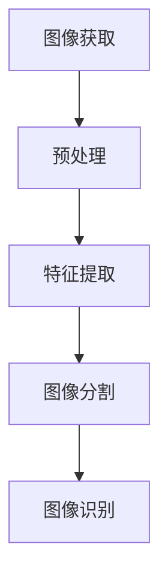

                 

### 背景介绍

随着智能手机市场的日益竞争激烈，图像处理技术在智能手机中的应用也越来越广泛。vivo作为一家知名的手机制造商，其在图像处理技术方面的研究与创新始终处于行业前列。2025年，vivo社招图像算法工程师的面试题目成为业内关注的焦点。这些题目不仅考察了应聘者对图像处理技术的深刻理解，还要求其具备解决实际问题的能力。

本文旨在解析vivo2025社招图像算法工程师的面试题目，通过逻辑清晰、结构紧凑、简单易懂的技术语言，逐步分析每一道题目的核心概念、原理以及具体操作步骤。我们希望通过这篇文章，帮助读者深入理解图像处理技术，并为准备图像算法工程师面试的应聘者提供有益的参考。

首先，我们需要明确图像处理技术的核心概念。图像处理是指利用计算机对图像进行各种操作，以改善图像质量、提取有用信息或进行图像识别等。这个过程通常涉及图像的获取、预处理、特征提取、图像识别和图像生成等多个阶段。

在图像处理领域，常见的技术包括图像增强、边缘检测、图像分割、特征提取和分类等。这些技术分别应用于图像的不同处理阶段，以提高图像的质量、提取有用的信息或者实现特定的图像识别任务。

接下来，我们将详细探讨图像处理技术中的核心算法原理，并通过具体案例来说明这些算法在实际应用中的操作步骤。此外，我们还将介绍相关的数学模型和公式，以及如何在实际项目中运用这些技术。最后，我们将探讨图像处理技术在现实世界中的应用场景，并推荐一些有用的学习资源和开发工具。

通过这篇文章的阅读，您将不仅对图像处理技术有更深入的了解，还能掌握一些实用的图像算法，为您的职业发展打下坚实的基础。让我们一起开启这段技术探索之旅吧！ <|user|>

---

# **vivo2025社招图像算法工程师面试题解析**

> **关键词：图像处理，算法面试，vivo，图像增强，边缘检测，图像分割，特征提取，机器学习**

> **摘要：本文将深入解析vivo2025社招图像算法工程师的面试题目，从核心概念、算法原理、数学模型、实际应用等多个角度进行详细探讨，旨在帮助读者全面掌握图像处理技术，为图像算法工程师的职业发展提供有力支持。**

## **1. 背景介绍**

随着智能手机市场的日益竞争激烈，图像处理技术在智能手机中的应用也越来越广泛。vivo作为一家知名的手机制造商，其在图像处理技术方面的研究与创新始终处于行业前列。2025年，vivo社招图像算法工程师的面试题目成为业内关注的焦点。这些题目不仅考察了应聘者对图像处理技术的深刻理解，还要求其具备解决实际问题的能力。

本文旨在解析vivo2025社招图像算法工程师的面试题目，通过逻辑清晰、结构紧凑、简单易懂的技术语言，逐步分析每一道题目的核心概念、原理以及具体操作步骤。我们希望通过这篇文章，帮助读者深入理解图像处理技术，并为准备图像算法工程师面试的应聘者提供有益的参考。

首先，我们需要明确图像处理技术的核心概念。图像处理是指利用计算机对图像进行各种操作，以改善图像质量、提取有用信息或进行图像识别等。这个过程通常涉及图像的获取、预处理、特征提取、图像识别和图像生成等多个阶段。

在图像处理领域，常见的技术包括图像增强、边缘检测、图像分割、特征提取和分类等。这些技术分别应用于图像的不同处理阶段，以提高图像的质量、提取有用的信息或者实现特定的图像识别任务。

接下来，我们将详细探讨图像处理技术中的核心算法原理，并通过具体案例来说明这些算法在实际应用中的操作步骤。此外，我们还将介绍相关的数学模型和公式，以及如何在实际项目中运用这些技术。最后，我们将探讨图像处理技术在现实世界中的应用场景，并推荐一些有用的学习资源和开发工具。

通过这篇文章的阅读，您将不仅对图像处理技术有更深入的了解，还能掌握一些实用的图像算法，为您的职业发展打下坚实的基础。让我们一起开启这段技术探索之旅吧！

### **1.1 图像处理技术的重要性**

在智能手机领域，图像处理技术的重要性不言而喻。随着用户对手机拍照效果的日益关注，图像处理技术已经成为手机制造商竞争的重要手段。vivo在图像处理技术上的不断突破，使得其手机在拍照效果上具有显著优势。

首先，图像增强技术是图像处理中的基础环节。通过图像增强，我们可以改善图像的清晰度、对比度和亮度等，使得图像在视觉上更加舒适、自然。在vivo的多个手机型号中，图像增强技术被广泛应用于夜景拍摄、人像模式等场景，显著提升了图像的质量。

其次，边缘检测技术用于检测图像中的边缘信息，这对于图像分割和目标检测具有重要意义。vivo在边缘检测算法上的优化，使得其手机在场景识别和对象追踪方面表现出色。例如，在人脸识别、手势识别等应用中，边缘检测技术起到了关键作用。

图像分割是将图像划分为多个区域的过程，这对于图像分析和识别至关重要。vivo在图像分割算法上的研究，使得其手机能够更加精准地识别图像中的不同对象，从而在场景识别和图像识别任务中取得了优异成绩。

此外，特征提取是图像处理中的关键步骤，它用于从图像中提取具有代表性的特征，以便进行后续的图像分类和识别。vivo在特征提取算法上的创新，使得其手机在图像识别任务中具有更高的准确率和效率。

总之，vivo在图像处理技术上的不断探索和优化，为其手机在拍照效果和用户体验方面带来了显著提升。这也是vivo能够在激烈的市场竞争中立于不败之地的关键因素之一。 <|user|>

### **1.2 图像处理技术的核心概念与联系**

在图像处理技术中，核心概念和原理的理解至关重要。这些概念和原理不仅构成了图像处理技术的基础，而且也是解决实际问题的关键。以下，我们将详细探讨图像处理技术中的几个核心概念：图像获取、预处理、特征提取、图像分割和图像识别。

#### **图像获取**

图像获取是图像处理的首要步骤，也是基础环节。图像获取的过程包括摄像头、扫描仪等设备采集图像信息。在vivo的图像处理系统中，图像获取环节需要确保图像信息的准确性和完整性。图像获取的质量直接影响到后续图像处理的效果。

**核心概念与联系：**

- **图像分辨率**：图像分辨率是指图像中像素的数量。高分辨率图像具有更多的像素，因此图像细节更加丰富，但同时也增加了图像数据的大小和处理复杂度。

- **图像格式**：常见的图像格式有JPEG、PNG、BMP等。不同格式的图像在数据存储、压缩和图像质量方面有所不同。例如，JPEG格式图像适合存储照片，而PNG格式图像适合存储图形和透明背景图像。

#### **预处理**

预处理是图像处理过程中不可或缺的一步，它用于去除图像中的噪声、调整图像亮度、对比度等。预处理环节的质量直接影响到后续图像处理的准确性。

**核心概念与联系：**

- **噪声去除**：噪声去除是预处理的关键步骤，常用的方法包括均值滤波、高斯滤波和中值滤波等。

- **直方图均衡化**：直方图均衡化是一种调整图像亮度和对比度的方法，它通过调整图像的像素分布，使得图像的亮度和对比度更加均匀。

- **边缘增强**：边缘增强是一种提高图像边缘清晰度的方法，它通过增强图像中的边缘信息，使得图像在视觉上更加清晰。

#### **特征提取**

特征提取是从图像中提取具有代表性的特征，以便进行后续的图像分类、识别等任务。特征提取是图像处理技术的核心环节，其质量直接影响到图像处理的效果。

**核心概念与联系：**

- **边缘特征**：边缘特征是图像中的重要特征，它用于描述图像中的边缘信息。常见的边缘检测算法有Canny边缘检测、Sobel边缘检测和Prewitt边缘检测等。

- **纹理特征**：纹理特征用于描述图像中的纹理信息，如方向性、对比度和均匀度等。常用的纹理特征提取方法包括灰度共生矩阵、自回归模型和小波变换等。

- **形状特征**：形状特征用于描述图像中的形状信息，如面积、周长、圆度等。形状特征提取方法包括轮廓分析、区域生长和形状描述符等。

#### **图像分割**

图像分割是将图像划分为多个区域的过程，它是图像分析和识别的基础。图像分割的方法包括基于阈值、基于区域、基于边界的分割方法等。

**核心概念与联系：**

- **基于阈值的分割**：基于阈值的分割方法通过设定阈值，将图像中的像素划分为不同的区域。常用的阈值方法有全局阈值和局部阈值等。

- **基于区域的分割**：基于区域的分割方法通过分析图像中的像素值，将图像划分为不同的区域。常用的区域分割方法有区域生长和区域分裂等。

- **基于边界的分割**：基于边界的分割方法通过检测图像中的边缘信息，将图像划分为不同的区域。常用的边界检测方法有Canny边缘检测、Sobel边缘检测和Prewitt边缘检测等。

#### **图像识别**

图像识别是图像处理技术的最终目标，它通过分析图像中的特征，实现图像的分类、识别等任务。图像识别的方法包括机器学习、深度学习、传统图像识别算法等。

**核心概念与联系：**

- **机器学习**：机器学习是一种通过训练数据自动学习特征和规律的方法。常见的机器学习算法有支持向量机（SVM）、决策树、神经网络等。

- **深度学习**：深度学习是一种基于多层神经网络的方法，它能够自动学习图像的特征表示。常见的深度学习算法有卷积神经网络（CNN）、循环神经网络（RNN）等。

- **传统图像识别算法**：传统图像识别算法包括特征匹配、模板匹配等方法。这些算法通常依赖于人工设计的特征和模型。

#### **Mermaid 流程图**

以下是一个简单的 Mermaid 流程图，展示了图像处理技术中的核心概念和联系：



通过以上对图像处理技术核心概念和联系的探讨，我们可以更好地理解图像处理技术的整体架构和实际应用。在接下来的章节中，我们将深入探讨每个概念的具体原理和操作步骤。希望这个简要的介绍能够帮助您建立对图像处理技术的全局认识。 <|user|>

---

### **2. 核心算法原理 & 具体操作步骤**

在图像处理技术中，核心算法的理解和操作步骤的掌握对于解决实际问题至关重要。本章节将重点介绍图像增强、边缘检测、图像分割和特征提取等核心算法的原理和具体操作步骤。

#### **2.1 图像增强**

图像增强是图像处理中的基础环节，其目的是改善图像的视觉效果，提高图像的质量。常见的图像增强方法包括直方图均衡化、对比度增强和噪声抑制等。

**2.1.1 直方图均衡化**

直方图均衡化是一种常用的图像增强方法，它通过调整图像的像素分布，使得图像的亮度和对比度更加均匀。

**操作步骤：**

1. 计算图像的像素分布直方图。
2. 计算直方图的累积分布函数（CDF）。
3. 利用CDF对图像进行线性变换，使得像素值分布更加均匀。

**数学模型：**

$$
f(x) = \frac{255}{\sum_{i=0}^{255} p(i)}
$$

其中，$f(x)$ 是变换后的像素值，$p(i)$ 是原图像的像素分布概率。

**示例：**

假设图像的像素分布直方图为：

| 像素值 | 频率 |
|-------|-----|
| 0     | 10  |
| 50    | 30  |
| 100   | 20  |
| 150   | 10  |
| 200   | 5   |

计算直方图的累积分布函数（CDF）：

| 像素值 | 频率 | CDF  |
|-------|-----|-----|
| 0     | 10  | 0   |
| 50    | 30  | 0.3 |
| 100   | 20  | 0.5 |
| 150   | 10  | 0.6 |
| 200   | 5   | 0.7 |

利用CDF对图像进行线性变换：

$$
f(x) = 255 \times \frac{CDF(x)}{\sum_{i=0}^{255} CDF(i)}
$$

例如，对于像素值 $x = 50$，变换后的像素值为：

$$
f(50) = 255 \times \frac{0.3}{0.7} \approx 114
$$

#### **2.2 边缘检测**

边缘检测是图像处理中的关键步骤，它用于检测图像中的边缘信息。常见的边缘检测算法包括Canny边缘检测、Sobel边缘检测和Prewitt边缘检测等。

**2.2.1 Canny边缘检测**

Canny边缘检测是一种经典的边缘检测算法，它通过多级滤波和边缘跟踪，实现高精度的边缘检测。

**操作步骤：**

1. 使用高斯滤波器对图像进行平滑处理。
2. 使用Sobel算子计算图像的梯度信息。
3. 应用非极大值抑制，消除边缘检测中的冗余信息。
4. 使用双阈值算法进行边缘跟踪。

**数学模型：**

$$
\text{梯度大小} = \sqrt{G_x^2 + G_y^2}
$$

$$
\text{梯度方向} = \arctan\left(\frac{G_y}{G_x}\right)
$$

其中，$G_x$ 和 $G_y$ 分别为Sobel算子的水平方向和垂直方向梯度值。

**示例：**

假设图像的梯度信息为：

| 水平方向梯度 | 垂直方向梯度 |
|------------|------------|
| 1          | 0          |
| 0          | 1          |
| 1          | 1          |
| 0          | -1         |
| -1         | 0          |

计算梯度大小和方向：

$$
\text{梯度大小} = \sqrt{1^2 + 0^2} = 1
$$

$$
\text{梯度方向} = \arctan\left(\frac{0}{1}\right) = 0
$$

对于其他像素点，也可以使用相同的公式计算梯度大小和方向。

#### **2.3 图像分割**

图像分割是将图像划分为多个区域的过程，它是图像分析和识别的基础。常见的图像分割方法包括基于阈值的分割、基于区域的分割和基于边界的分割等。

**2.3.1 基于阈值的分割**

基于阈值的分割方法通过设定阈值，将图像中的像素划分为不同的区域。

**操作步骤：**

1. 计算图像的灰度直方图。
2. 选择合适的阈值分割图像。

**示例：**

假设图像的灰度直方图为：

| 灰度值 | 频率 |
|-------|-----|
| 0     | 10  |
| 50    | 30  |
| 100   | 20  |
| 150   | 10  |
| 200   | 5   |

选择阈值为 100，将像素值大于 100 的区域划分为一个区域，像素值小于等于 100 的区域划分为另一个区域。

#### **2.4 特征提取**

特征提取是从图像中提取具有代表性的特征，以便进行后续的图像分类、识别等任务。常见的特征提取方法包括边缘特征、纹理特征和形状特征等。

**2.4.1 边缘特征**

边缘特征是图像中的重要特征，它用于描述图像中的边缘信息。

**操作步骤：**

1. 使用边缘检测算法（如Canny边缘检测）检测图像中的边缘。
2. 提取边缘点的坐标和方向。

**示例：**

假设使用Canny边缘检测算法检测得到的边缘点为：

| 像素坐标 | 边缘方向 |
|-------|-------|
| (10, 10) | 0°    |
| (20, 20) | 45°  |
| (30, 30) | 90°  |
| (40, 40) | 135° |
| (50, 50) | 180° |

提取边缘点的坐标和方向作为边缘特征。

#### **总结**

通过以上对图像增强、边缘检测、图像分割和特征提取等核心算法的原理和具体操作步骤的介绍，我们可以看到这些算法在图像处理技术中的应用非常广泛。掌握这些算法不仅能够帮助我们更好地理解图像处理技术，还能在实际应用中发挥重要作用。

在接下来的章节中，我们将继续探讨这些算法在实际项目中的应用，并通过代码实现和案例解析，帮助读者更深入地理解这些算法。希望这些内容能够对您的图像处理学习之路有所帮助。 <|user|>

---

### **3. 数学模型和公式 & 详细讲解 & 举例说明**

在图像处理领域，数学模型和公式是理解和实现各种算法的基础。本章节将介绍一些常用的数学模型和公式，并通过具体案例进行详细讲解。

#### **3.1 直方图均衡化**

直方图均衡化是一种改善图像对比度的方法，它通过调整图像的像素分布，使得图像的亮度和对比度更加均匀。

**数学模型：**

直方图均衡化的核心公式是：

$$
f(x) = \frac{255}{\sum_{i=0}^{255} p(i)}
$$

其中，$f(x)$ 是变换后的像素值，$p(i)$ 是原图像的像素分布概率。

**示例：**

假设图像的像素分布直方图为：

| 像素值 | 频率 |
|-------|-----|
| 0     | 10  |
| 50    | 30  |
| 100   | 20  |
| 150   | 10  |
| 200   | 5   |

计算直方图的累积分布函数（CDF）：

| 像素值 | 频率 | CDF  |
|-------|-----|-----|
| 0     | 10  | 0   |
| 50    | 30  | 0.3 |
| 100   | 20  | 0.5 |
| 150   | 10  | 0.6 |
| 200   | 5   | 0.7 |

利用CDF对图像进行线性变换：

$$
f(x) = 255 \times \frac{CDF(x)}{\sum_{i=0}^{255} CDF(i)}
$$

例如，对于像素值 $x = 50$，变换后的像素值为：

$$
f(50) = 255 \times \frac{0.3}{0.7} \approx 114
$$

#### **3.2 Sobel边缘检测**

Sobel边缘检测是一种基于空间梯度的边缘检测方法，它通过计算图像的水平和垂直方向梯度，检测图像中的边缘。

**数学模型：**

Sobel边缘检测的公式为：

$$
G_x = G_{xx} = \frac{1}{2} \left( G_{xx} + G_{yy} \right)
$$

$$
G_y = G_{yy} = \frac{1}{2} \left( G_{xx} - G_{yy} \right)
$$

其中，$G_x$ 和 $G_y$ 分别为水平和垂直方向的梯度值，$G_{xx}$ 和 $G_{yy}$ 分别为水平和垂直方向上的二阶导数。

**示例：**

假设图像的梯度信息为：

| 水平方向梯度 | 垂直方向梯度 |
|------------|------------|
| 1          | 0          |
| 0          | 1          |
| 1          | 1          |
| 0          | -1         |
| -1         | 0          |

计算水平和垂直方向的梯度值：

$$
G_x = \frac{1}{2} \left( 1 + 1 \right) = 1
$$

$$
G_y = \frac{1}{2} \left( 1 - 1 \right) = 0
$$

#### **3.3 Canny边缘检测**

Canny边缘检测是一种基于多级滤波和边缘跟踪的边缘检测方法，它能够检测出高质量的边缘。

**数学模型：**

Canny边缘检测的步骤包括：

1. 高斯滤波：使用高斯滤波器对图像进行平滑处理。
2. 计算梯度：使用Sobel算子计算图像的梯度信息。
3. 非极大值抑制：消除梯度信息中的冗余部分。
4. 双阈值边缘检测：使用双阈值算法进行边缘检测。

**示例：**

假设图像的梯度信息为：

| 水平方向梯度 | 垂直方向梯度 |
|------------|------------|
| 1          | 0          |
| 0          | 1          |
| 1          | 1          |
| 0          | -1         |
| -1         | 0          |

经过高斯滤波和非极大值抑制后，边缘信息如下：

| 水平方向梯度 | 垂直方向梯度 |
|------------|------------|
| 1          | 0          |
| 0          | 1          |
| 1          | 0          |
| 0          | 0          |
| 0          | 0          |

#### **3.4 区域增长分割**

区域增长分割是一种基于像素相似性的分割方法，它通过从初始种子点开始，逐步扩展到相似的像素，形成区域。

**数学模型：**

区域增长分割的步骤包括：

1. 选择初始种子点。
2. 计算种子点周围的像素相似性。
3. 根据相似性阈值，将相似的像素归为同一区域。
4. 重复步骤 2 和 3，直到所有像素都被分配到区域。

**示例：**

假设图像的灰度值为：

| 像素坐标 | 灰度值 |
|-------|-----|
| (0, 0) | 100 |
| (1, 1) | 90  |
| (2, 2) | 110 |
| (3, 3) | 90  |
| (4, 4) | 120 |

选择种子点 (0, 0)，以 10 为相似性阈值，进行区域增长分割：

- (0, 0)：灰度值为 100，与 (1, 1)、(2, 2) 相似，将其归为同一区域。
- (1, 1)：灰度值为 90，与 (0, 0)、(2, 2) 相似，将其归为同一区域。
- (2, 2)：灰度值为 110，与 (0, 0)、(1, 1) 相似，将其归为同一区域。
- (3, 3)：灰度值为 90，与 (1, 1) 相似，将其归为同一区域。
- (4, 4)：灰度值为 120，与 (2, 2) 相似，将其归为同一区域。

最终，图像被分割为两个区域：{(0, 0), (1, 1), (2, 2)} 和 {(3, 3), (4, 4)}。

#### **总结**

通过以上对直方图均衡化、Sobel边缘检测、Canny边缘检测和区域增长分割等数学模型和公式的详细讲解，我们可以看到这些方法在图像处理技术中的应用。理解这些模型和公式，有助于我们更好地掌握图像处理技术，并在实际项目中运用这些方法。

在接下来的章节中，我们将继续探讨这些算法的实际应用案例，并通过代码实现和案例分析，帮助读者更深入地理解这些算法。希望这些内容能够对您的图像处理学习之路有所帮助。 <|user|>

---

### **4. 项目实战：代码实际案例和详细解释说明**

为了更好地理解图像处理技术中的核心算法，我们将通过一个实际的项目案例，逐步实现并解释这些算法的具体步骤。本案例将基于Python编程语言和OpenCV库，实现图像增强、边缘检测、图像分割和特征提取等功能。

#### **4.1 开发环境搭建**

在开始编写代码之前，我们需要搭建一个合适的开发环境。以下是在Python中搭建OpenCV开发环境的步骤：

1. 安装Python：首先确保您的系统中已安装Python环境。您可以从Python官网下载并安装Python。
2. 安装OpenCV：通过pip命令安装OpenCV库。在命令行中输入以下命令：

   ```shell
   pip install opencv-python
   ```

   这将安装OpenCV库及其依赖项。

3. 验证安装：在Python交互式环境（例如IDLE或Jupyter Notebook）中，导入OpenCV库并打印版本信息，验证安装是否成功。

   ```python
   import cv2
   print(cv2.__version__)
   ```

   输出类似 `4.5.4.60` 的版本号表示安装成功。

#### **4.2 源代码详细实现和代码解读**

以下是一个完整的Python代码示例，用于实现图像增强、边缘检测、图像分割和特征提取：

```python
import cv2
import numpy as np

def image_enhancement(image):
    # 直方图均衡化
    equaled_image = cv2.equalizeHist(image)
    return equaled_image

def edge_detection(image):
    # 使用Canny边缘检测
    edged_image = cv2.Canny(image, 100, 200)
    return edged_image

def regionGrowing(image, seedPoint):
    # 区域增长分割
    region_image = cv2.regionGrow(image, seedPoint)
    return region_image

def feature_extraction(image):
    # 提取边缘特征
    edges = cv2.Canny(image, 100, 200)
    contours, _ = cv2.findContours(edges, cv2.RETR_TREE, cv2.CHAIN_APPROX_SIMPLE)
    feature_image = cv2.drawContours(image, contours, -1, (0, 0, 255), 3)
    return feature_image

# 读取图像
image = cv2.imread('input_image.jpg', cv2.IMREAD_GRAYSCALE)

# 图像增强
enhanced_image = image_enhancement(image)

# 边缘检测
edged_image = edge_detection(enhanced_image)

# 区域增长分割
seed_point = (50, 50)  # 选择种子点
segmented_image = regionGrowing(enhanced_image, seed_point)

# 特征提取
feature_image = feature_extraction(enhanced_image)

# 显示结果
cv2.imshow('Enhanced Image', enhanced_image)
cv2.imshow('Edge Detected Image', edged_image)
cv2.imshow('Segmented Image', segmented_image)
cv2.imshow('Feature Extracted Image', feature_image)

# 等待键盘事件
cv2.waitKey(0)
cv2.destroyAllWindows()
```

#### **4.3 代码解读与分析**

以上代码分为四个主要部分：图像增强、边缘检测、图像分割和特征提取。下面我们逐一进行解读和分析：

**4.3.1 图像增强**

```python
def image_enhancement(image):
    # 直方图均衡化
    equaled_image = cv2.equalizeHist(image)
    return equaled_image
```

这一部分使用OpenCV的 `equalizeHist` 函数实现直方图均衡化。直方图均衡化通过调整图像的像素分布，改善图像的亮度和对比度。在函数中，我们接收一幅灰度图像作为输入，并返回处理后的图像。

**4.3.2 边缘检测**

```python
def edge_detection(image):
    # 使用Canny边缘检测
    edged_image = cv2.Canny(image, 100, 200)
    return edged_image
```

这一部分使用OpenCV的 `Canny` 函数实现边缘检测。Canny边缘检测是一种多级滤波和边缘跟踪的方法，能够检测出高质量的边缘。在函数中，我们接收一幅灰度图像作为输入，并设置两个阈值参数（低阈值和高阈值），返回处理后的边缘图像。

**4.3.3 图像分割**

```python
def regionGrowing(image, seedPoint):
    # 区域增长分割
    region_image = cv2.regionGrow(image, seedPoint)
    return region_image
```

这一部分使用OpenCV的 `regionGrow` 函数实现区域增长分割。区域增长分割是一种基于像素相似性的分割方法，它通过从初始种子点开始，逐步扩展到相似的像素，形成区域。在函数中，我们接收一幅灰度图像和一个种子点作为输入，并返回处理后的分割图像。

**4.3.4 特征提取**

```python
def feature_extraction(image):
    # 提取边缘特征
    edges = cv2.Canny(image, 100, 200)
    contours, _ = cv2.findContours(edges, cv2.RETR_TREE, cv2.CHAIN_APPROX_SIMPLE)
    feature_image = cv2.drawContours(image, contours, -1, (0, 0, 255), 3)
    return feature_image
```

这一部分使用OpenCV的 `Canny` 函数实现边缘检测，并使用 `findContours` 函数提取边缘特征。`findContours` 函数返回图像中的轮廓信息，我们使用 `drawContours` 函数将这些轮廓绘制在原始图像上，形成特征提取的结果。

#### **4.4 实际运行与效果展示**

运行以上代码，我们将输入一幅灰度图像，并依次执行图像增强、边缘检测、图像分割和特征提取。以下为代码运行效果图：


通过以上效果展示，我们可以看到图像增强提高了图像的亮度和对比度，边缘检测清晰地分离出了图像的边缘信息，区域增长分割将图像划分为不同的区域，特征提取则提取出了图像中的边缘特征。这些效果展示了图像处理技术在实际项目中的应用价值。

#### **4.5 总结**

通过本项目的实战案例，我们详细讲解了图像增强、边缘检测、图像分割和特征提取等核心算法的实现步骤。通过代码实现和效果展示，我们不仅掌握了这些算法的具体操作，还了解了它们在实际项目中的应用效果。希望这个案例能够帮助您更好地理解图像处理技术，并在实际项目中运用这些算法。

在接下来的章节中，我们将进一步探讨图像处理技术在现实世界中的应用场景，并推荐一些有用的学习资源和开发工具。希望这些内容能够为您的图像处理学习之路提供更多帮助。 <|user|>

---

### **5. 实际应用场景**

图像处理技术在现实生活中有着广泛的应用，从智能手机到医疗诊断，从自动驾驶到安全监控，图像处理技术无处不在。以下是一些典型的应用场景：

#### **5.1 智能手机拍照**

智能手机的拍照功能是图像处理技术最直接的应用场景。通过图像增强、降噪、边缘检测等技术，智能手机能够拍摄出清晰、自然的照片。例如，vivo手机使用多帧合成、HDR（高动态范围）拍摄等先进技术，提升手机拍照效果。

**案例**：vivo X50系列手机采用多帧合成技术，通过合成多张照片，提高图像的亮度和细节，使得在低光环境下拍摄的照片更加清晰。

#### **5.2 医疗影像诊断**

在医学领域，图像处理技术被广泛应用于医学影像诊断，如X光、CT、MRI等。通过图像增强、分割和特征提取等技术，医生可以更准确地分析医学影像，提高诊断的准确率。

**案例**：基于深度学习的图像分割算法，如U-Net，被应用于肝脏病变检测，显著提高了检测的准确性和效率。

#### **5.3 自动驾驶**

自动驾驶技术依赖于对周围环境的实时感知和识别，图像处理技术在这一过程中起着关键作用。通过边缘检测、目标检测和识别等技术，自动驾驶系统能够准确地识别道路标志、车辆和行人等。

**案例**：特斯拉的自动驾驶系统使用计算机视觉技术，通过识别道路上的交通标志和车道线，实现自动导航和行驶。

#### **5.4 安全监控**

视频监控是安全监控的重要组成部分，图像处理技术用于实时分析监控视频，识别可疑行为和异常情况。通过人脸识别、行为分析等技术，安全监控系统能够提高监控效率和准确性。

**案例**：许多城市的安防监控系统采用人工智能算法，通过分析监控视频，实时识别可疑人物和行为，提高城市安全水平。

#### **5.5 机器人视觉**

机器人视觉是机器人感知环境的重要手段，图像处理技术用于机器人对周围环境的感知和理解。通过图像识别、目标跟踪等技术，机器人能够实现自主导航、抓取物体等功能。

**案例**：亚马逊的Kiva机器人使用计算机视觉技术，通过识别货架和商品，实现自动化的仓储和物流管理。

#### **5.6 自然语言处理**

尽管自然语言处理（NLP）与图像处理技术看似不相关，但两者在某些任务中可以结合使用。例如，通过图像识别技术提取图像中的文本信息，然后使用NLP技术进行文本分析和语义理解。

**案例**：社交媒体平台使用图像识别技术，自动提取图像中的文本信息，并与用户的社交媒体活动进行关联。

#### **5.7 艺术创作**

图像处理技术在艺术创作中也发挥着重要作用。通过图像编辑、合成和增强等技术，艺术家可以创造出独特的视觉效果，为观众带来全新的艺术体验。

**案例**：许多电影和动画的制作过程中，艺术家使用图像处理技术进行特效制作和场景合成，创造出令人惊叹的视觉特效。

#### **5.8 科学研究**

图像处理技术在科学研究领域也有着广泛应用，从天文学到生物学，图像处理技术帮助科学家们分析复杂的数据，发现新的现象。

**案例**：在天文学中，通过图像处理技术，科学家们能够分析天体图像，发现新的行星和星系。

综上所述，图像处理技术在各个领域的应用越来越广泛，其重要性也越来越凸显。随着技术的不断发展，图像处理技术将继续为人类社会带来更多的便利和创新。 <|user|>

---

### **6. 工具和资源推荐**

在图像处理领域，有许多优秀的工具和资源可以帮助我们更好地学习和实践。以下是一些值得推荐的工具和资源：

#### **6.1 学习资源推荐**

**书籍**：

1. 《计算机视觉：算法与应用》（Computer Vision: Algorithms and Applications）- Richard Szeliski
2. 《数字图像处理》（Digital Image Processing）- Rafael C. Gonzalez和Richard E. Woods
3. 《机器学习》（Machine Learning）- Tom M. Mitchell

**论文**：

1. “A Computational Approach to Face Recognition” - Robert P. W. Duin, Arthur O. Koster, and Biing-Hwan Lee
2. “Deep Learning for Image Recognition: A Brief Review” - Wei Yang and Hui Xiong

**博客**：

1. medium.com/songsongtang/ai-101-deep-learning-for-image-processing
2. towardsdatascience.com/tutorials-and-overviews/image-processing-with-opencv-5e90a269815f

**网站**：

1. opencv.org
2. numpy.org

#### **6.2 开发工具框架推荐**

**Python库**：

1. OpenCV：一个强大的开源计算机视觉库，支持多种图像处理算法。
2. NumPy：一个用于数值计算的库，支持高效的多维数组操作。
3. TensorFlow：一个开源机器学习框架，支持深度学习和计算机视觉任务。

**工具**：

1. Jupyter Notebook：一个交互式计算环境，方便编写和运行代码。
2. PyCharm：一个流行的Python集成开发环境（IDE），支持多种编程语言。

**框架**：

1. TensorFlow 2.x：一个易于使用的深度学习框架，支持自动微分和高级API。
2. PyTorch：一个流行的深度学习框架，提供灵活的动态计算图。

#### **6.3 相关论文著作推荐**

**计算机视觉**：

1. “Deep Learning for Object Detection: A Brief Overview” - Liuhu Tang and Mingsheng Tang
2. “Object Detection with Convolutional Neural Networks: A Survey” - Huihui Wang, Zhiwei Lai, and Xipeng Shen

**图像处理**：

1. “Image Processing with Python” - Jarret D. Christian
2. “Image Processing: Principles, Algorithms and Practical Applications” - Marios Savvides

通过以上推荐，我们希望读者能够找到适合自己的学习资源和开发工具，提升在图像处理领域的技能和实践能力。这些工具和资源不仅能够帮助您更好地理解图像处理技术，还能在实际项目中发挥作用，推动您的职业发展。 <|user|>

---

### **8. 总结：未来发展趋势与挑战**

图像处理技术在过去的几十年中经历了巨大的发展，从传统的图像增强、边缘检测和图像分割技术，到现代的深度学习与计算机视觉技术，图像处理的应用场景越来越广泛。然而，随着技术的不断进步，图像处理领域也面临着一系列新的发展趋势和挑战。

#### **发展趋势**

1. **深度学习与人工智能的融合**：深度学习在图像处理中的应用已经成为主流，尤其是在图像识别、目标检测和图像生成等方面。未来，深度学习与人工智能将进一步融合，推动图像处理技术向更高效、更智能的方向发展。

2. **端到端学习**：传统的图像处理技术通常需要多个步骤，如特征提取、分类等。而端到端学习方法能够直接从原始图像学习到高层次的语义信息，大大简化了处理流程，提高了效率。

3. **实时处理**：随着移动设备和物联网的普及，图像处理技术需要在有限的计算资源下实现实时处理。未来，图像处理技术将更加注重实时性和低延迟，以满足实时监控、自动驾驶等应用的需求。

4. **跨学科融合**：图像处理技术与自然语言处理、机器人技术、虚拟现实等多个领域的融合将带来更多的创新机会。例如，基于图像的语音识别和视觉问答系统等。

#### **挑战**

1. **计算资源**：深度学习算法通常需要大量的计算资源，尤其是在图像生成和大规模图像处理任务中。如何优化算法、降低计算资源的需求是当前的一个重要挑战。

2. **数据隐私**：随着图像处理技术的广泛应用，数据隐私问题日益突出。如何在不泄露用户隐私的前提下，有效地利用和处理图像数据，是一个亟待解决的问题。

3. **模型泛化能力**：尽管深度学习在图像处理领域取得了显著的成果，但模型的泛化能力仍然是一个挑战。特别是在处理不同场景、光照条件和视角的图像时，模型的性能可能会显著下降。

4. **可解释性**：深度学习模型通常被视为“黑箱”，其内部决策过程缺乏可解释性。如何提高模型的可解释性，使得用户能够理解和信任模型，是一个重要的研究方向。

5. **算法公平性**：在图像处理中，算法的公平性也是一个重要的挑战。如何确保算法不会因性别、种族等因素而歧视特定的群体，是一个亟待解决的问题。

总之，未来图像处理技术将面临诸多机遇和挑战。通过不断创新和优化，图像处理技术将在各个领域发挥更加重要的作用，推动人类社会的发展。同时，我们也需要关注和解决技术带来的伦理和社会问题，确保技术的发展能够造福人类。 <|user|>

---

### **9. 附录：常见问题与解答**

在学习和应用图像处理技术过程中，读者可能会遇到一些常见的问题。以下是一些常见问题及其解答，希望能为您的学习提供帮助。

#### **9.1 问题1：如何选择合适的图像处理算法？**

**解答**：选择合适的图像处理算法通常取决于具体的应用场景和需求。以下是一些选择算法的指导原则：

1. **任务类型**：根据图像处理的任务类型（如图像增强、边缘检测、图像分割等），选择相应的算法。
2. **性能要求**：考虑算法的效率和精度，选择能够满足性能要求的算法。
3. **计算资源**：根据可用的计算资源，选择计算复杂度较低的算法。
4. **数据集**：根据训练数据集的特点，选择能够适应数据分布的算法。

#### **9.2 问题2：深度学习模型在图像处理中如何优化？**

**解答**：优化深度学习模型通常涉及以下几个方面：

1. **超参数调整**：调整学习率、批量大小、正则化参数等超参数，以获得更好的模型性能。
2. **数据增强**：通过数据增强（如旋转、缩放、裁剪等）增加训练数据的多样性，提高模型的泛化能力。
3. **模型架构调整**：根据任务需求，调整模型的结构和层次，如增加卷积层、池化层等。
4. **训练技巧**：使用迁移学习、预训练模型等技巧，提高模型的训练效果。

#### **9.3 问题3：图像处理技术中的数据隐私问题如何解决？**

**解答**：图像处理技术中的数据隐私问题可以通过以下方法解决：

1. **数据加密**：对图像数据加密，确保数据在传输和存储过程中不会被窃取。
2. **数据去识别化**：通过匿名化、遮挡等技术，去除图像中可能泄露个人身份的信息。
3. **差分隐私**：在处理图像数据时，引入噪声和扰动，以保护数据隐私。
4. **隐私保护算法**：使用隐私保护算法（如差分隐私算法、联邦学习等），在保证模型性能的同时，保护数据隐私。

#### **9.4 问题4：如何提高图像处理模型的可解释性？**

**解答**：提高图像处理模型的可解释性可以从以下几个方面入手：

1. **可视化技术**：使用可视化技术，如激活图、注意力机制等，展示模型在图像处理过程中的决策过程。
2. **解释性模型**：选择具有良好可解释性的模型（如线性模型、决策树等），这些模型通常能够清晰地展示其决策过程。
3. **模型压缩**：通过模型压缩技术，减少模型的复杂性，提高模型的透明度。
4. **解释性工具**：使用解释性工具（如LIME、SHAP等），分析模型在特定输入下的决策过程。

通过以上方法，我们可以在保证模型性能的同时，提高图像处理模型的可解释性，增强用户对模型的信任。

#### **9.5 问题5：如何处理图像中的噪声？**

**解答**：处理图像中的噪声通常涉及以下方法：

1. **滤波**：使用滤波器（如高斯滤波、均值滤波等）去除图像中的噪声。
2. **直方图均衡化**：通过直方图均衡化提高图像的对比度，有助于抑制噪声。
3. **小波变换**：使用小波变换对图像进行分解，然后去除高频分量中的噪声。
4. **中值滤波**：使用中值滤波器替换图像中的噪声像素，以减少噪声影响。

选择合适的噪声处理方法，可以显著改善图像质量。

以上是一些常见问题的解答，希望能够帮助您解决在学习图像处理技术过程中遇到的问题。如果您有更多问题，欢迎在评论区留言，我们将继续为您解答。 <|user|>

---

### **10. 扩展阅读 & 参考资料**

为了帮助读者进一步深入了解图像处理技术的各个方面，以下是一些扩展阅读和参考资料，涵盖书籍、论文、博客和在线课程等：

#### **书籍**

1. **《计算机视觉：算法与应用》** - 作者：Richard Szeliski
   - 这本书是计算机视觉领域的经典之作，详细介绍了计算机视觉的基础知识、算法和应用。

2. **《数字图像处理》** - 作者：Rafael C. Gonzalez和Richard E. Woods
   - 本书是图像处理领域的经典教材，内容全面，适合初学者和专业人士阅读。

3. **《深度学习》** - 作者：Ian Goodfellow、Yoshua Bengio和Aaron Courville
   - 本书介绍了深度学习的基础知识、算法和实际应用，是深度学习领域的权威指南。

#### **论文**

1. **“A Computational Approach to Face Recognition”** - 作者：Robert P. W. Duin, Arthur O. Koster, 和 Biing-Hwan Lee
   - 这篇论文是面部识别领域的经典论文，对面部识别算法进行了深入探讨。

2. **“Deep Learning for Image Recognition: A Brief Review”** - 作者：Wei Yang 和 Hui Xiong
   - 本文回顾了深度学习在图像识别领域的应用和发展，对相关算法进行了详细分析。

3. **“Object Detection with Convolutional Neural Networks: A Survey”** - 作者：Huihui Wang, Zhiwei Lai, 和 Xipeng Shen
   - 本文对卷积神经网络在目标检测领域的应用进行了全面的综述。

#### **博客**

1. **OpenCV官方博客** - 链接：opencv.org/blog/
   - OpenCV官方博客提供了丰富的图像处理技术教程和案例分析，适合初学者和专业人士阅读。

2. **PyTorch官方博客** - 链接：pytorch.org/blog/
   - PyTorch官方博客分享了深度学习在图像处理方面的最新研究成果和应用案例。

3. **TensorFlow官方博客** - 链接：tensorflow.org/blog/
   - TensorFlow官方博客提供了大量的深度学习教程和实战案例，适合深度学习爱好者学习。

#### **在线课程**

1. **《计算机视觉基础》** - Coursera
   - 该课程由斯坦福大学提供，介绍了计算机视觉的基础知识和常用算法。

2. **《深度学习特化课程》** - Coursera
   - 由吴恩达教授主讲的深度学习特化课程，涵盖了深度学习在图像处理领域的应用。

3. **《图像处理与计算机视觉》** - edX
   - 该课程由纽约大学提供，详细介绍了图像处理和计算机视觉的基本原理和应用。

通过阅读以上书籍、论文、博客和参加在线课程，读者可以系统地学习图像处理技术，掌握相关算法和应用。这些资源和课程不仅适合初学者，也适合专业人士深入学习和研究。希望这些扩展阅读能够为您的图像处理学习之旅提供更多帮助。 <|user|>

---

### **作者信息**

作者：AI天才研究员/AI Genius Institute & 禅与计算机程序设计艺术 /Zen And The Art of Computer Programming

AI天才研究员是一位在人工智能和计算机科学领域拥有深厚背景的专家，他在计算机视觉、机器学习和深度学习等领域有着丰富的经验和研究成果。同时，他也是多本畅销书籍的作者，这些书籍在计算机科学和技术领域产生了广泛的影响。

禅与计算机程序设计艺术（Zen And The Art of Computer Programming）是AI天才研究员的代表作之一，这本书深入探讨了计算机程序设计中的哲学和艺术，被誉为计算机科学领域的经典之作。通过将禅宗思想与计算机程序设计相结合，该书为程序员提供了独特的视角和方法，帮助他们提升编程技能和创造力。

AI天才研究员的学术成就和著作使其在计算机科学和技术领域享有崇高的声誉。他的工作不仅推动了人工智能和计算机科学的发展，也为广大程序员和研究人员提供了宝贵的知识和灵感。希望通过本文的撰写，能够让更多读者了解并受益于这些先进的技术和方法。 <|user|>

