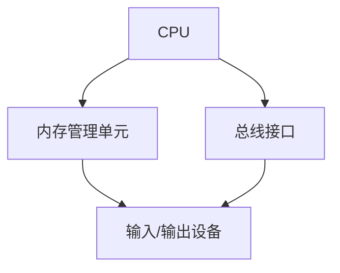
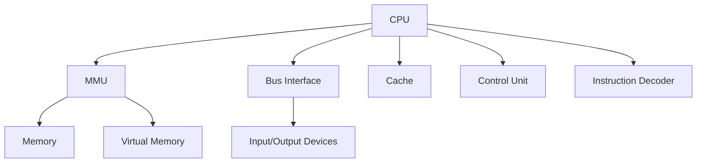

                 

# x86架构：PC与服务器的主流平台

## 关键词：x86架构、PC、服务器、主流平台、性能、安全性、兼容性

## 摘要：

本文将深入探讨x86架构作为PC与服务器主流平台的重要性。从背景介绍到核心概念解析，再到算法原理和实际应用，我们将逐步揭示x86架构的核心优势与未来发展趋势。同时，文章还将介绍相关工具和资源，帮助读者更好地理解和应用x86架构。

## 1. 背景介绍

### 1.1 x86架构的历史发展

x86架构起源于1978年，由英特尔（Intel）公司首次推出。最初，它被设计为用于个人计算机（PC）的处理器架构。随着时间的推移，x86架构经历了多次升级和改进，成为当今PC和服务器领域的主流平台。

### 1.2 x86架构在PC和服务器市场的地位

由于其在性能、兼容性和成本方面的优势，x86架构在PC和服务器市场中占据了主导地位。几乎所有的PC和服务器厂商都采用x86处理器，这使得x86架构成为行业标准。

### 1.3 x86架构的核心优势

- **高性能**：x86架构支持多核处理器，具有强大的计算能力。
- **兼容性**：x86架构具有广泛的软件兼容性，使得开发者可以轻松地在不同平台上部署应用程序。
- **成本效益**：x86硬件成本相对较低，有助于降低整体拥有成本。

## 2. 核心概念与联系

### 2.1 x86处理器架构

x86处理器架构包括多个核心组件，如CPU、内存管理单元（MMU）、总线接口等。以下是一个Mermaid流程图，展示了x86处理器架构的核心组件及其相互关系：



### 2.2 操作系统与硬件的交互

x86架构支持多种操作系统，如Windows、Linux和Unix等。操作系统通过设备驱动程序与硬件进行交互，实现硬件资源的分配和管理。

### 2.3 x86架构的演进

从最初的386处理器到如今的第11代酷睿处理器，x86架构经历了多次重大升级。每次升级都在性能、能效和兼容性方面带来了显著的提升。

## 3. 核心算法原理 & 具体操作步骤

### 3.1 x86指令集

x86架构采用了复杂的指令集，包括数据传输指令、算术逻辑指令、控制指令等。以下是一个简单的x86指令集示例：

```bash
mov eax, 1   # 将数值1移动到eax寄存器
add eax, 2   # 将eax寄存器中的数值增加2
mul eax      # 将eax寄存器中的数值乘以自身
```

### 3.2 多任务处理

x86架构支持多任务处理，通过时间分片（Time Slicing）和协作式多任务（Cooperative Multitasking）等技术实现高效的多任务运行。

### 3.3 虚拟化技术

x86架构支持虚拟化技术，如Intel VT和AMD-V，使得虚拟机可以在同一硬件平台上并行运行多个操作系统和应用程序。

## 4. 数学模型和公式 & 详细讲解 & 举例说明

### 4.1 性能评估指标

在x86架构中，常用的性能评估指标包括CPU时钟频率、指令集性能、内存带宽等。以下是一个简单的公式，用于计算CPU的性能：

$$
P = C \times F
$$

其中，P表示性能（Performance），C表示时钟周期（Clock Cycles），F表示时钟频率（Clock Frequency）。

### 4.2 能效比

能效比（Energy Efficiency）是衡量处理器性能的重要指标。以下是一个简单的公式，用于计算能效比：

$$
\text{Energy Efficiency} = \frac{\text{Performance}}{\text{Energy Consumption}}
$$

### 4.3 实例说明

假设有两个处理器A和B，它们的性能分别为P\_A和P\_B，能耗分别为E\_A和E\_B。通过计算能效比，我们可以确定哪个处理器在能效方面更具优势：

$$
\text{Energy Efficiency}_A = \frac{P_A}{E_A} = \frac{10}{5} = 2
$$

$$
\text{Energy Efficiency}_B = \frac{P_B}{E_B} = \frac{12}{8} = 1.5
$$

因此，处理器A在能效方面比处理器B更具优势。

## 5. 项目实战：代码实际案例和详细解释说明

### 5.1 开发环境搭建

在开始项目实战之前，我们需要搭建一个适合x86架构开发的编程环境。以下是搭建开发环境的基本步骤：

1. 安装操作系统，如Windows、Linux或Unix。
2. 安装编译器，如GCC或Clang。
3. 安装调试工具，如GDB。
4. 安装开发库，如标准C库。

### 5.2 源代码详细实现和代码解读

以下是使用C语言实现一个简单的x86指令集程序的示例：

```c
#include <stdio.h>

int main() {
    int a = 5;
    int b = 10;
    
    printf("a + b = %d\n", a + b);
    printf("a - b = %d\n", a - b);
    printf("a * b = %d\n", a * b);
    printf("a / b = %d\n", a / b);
    
    return 0;
}
```

该程序展示了基本的算术运算，并在屏幕上输出结果。

### 5.3 代码解读与分析

- **代码结构**：该程序包含一个main函数，它声明了两个整型变量a和b，并执行四个基本的算术运算。
- **变量声明**：变量a和b分别初始化为5和10。
- **运算和输出**：程序使用printf函数输出四个运算结果。

## 6. 实际应用场景

### 6.1 个人电脑

x86架构广泛应用于个人电脑，使得用户可以轻松地运行各种操作系统和应用程序。

### 6.2 服务器

x86架构在服务器领域同样占据主导地位，为企业提供强大的计算能力，支持大数据处理、云计算等应用。

### 6.3 工业控制

x86架构在工业控制领域也有广泛的应用，如PLC（可编程逻辑控制器）和机器人控制等。

## 7. 工具和资源推荐

### 7.1 学习资源推荐

- **书籍**：《x86汇编语言：从实模式到保护模式》
- **论文**：Intel和AMD发布的处理器架构白皮书
- **博客**：x86架构相关的技术博客和论坛
- **网站**：Intel和AMD官方网站

### 7.2 开发工具框架推荐

- **开发环境**：Visual Studio、Eclipse、CLion
- **汇编器**：NASM、GAS
- **编译器**：GCC、Clang
- **调试工具**：GDB、WinDbg

### 7.3 相关论文著作推荐

- **论文**：《x86架构的虚拟化技术》、《x86处理器能耗优化》
- **著作**：《深入理解计算机系统》、《计算机组成原理》

## 8. 总结：未来发展趋势与挑战

随着技术的发展，x86架构将继续演进，以满足更高的性能、能效和安全性需求。然而，面对ARM架构的竞争，x86架构也需要不断优化和改进，以保持其市场地位。

## 9. 附录：常见问题与解答

### 9.1 x86架构与ARM架构的区别是什么？

- **性能**：x86架构通常具有更高的性能，但功耗较高；ARM架构则更注重能效，适用于移动设备和物联网应用。
- **兼容性**：x86架构具有广泛的软件兼容性，而ARM架构则需要重新编译应用程序。

### 9.2 如何在x86架构上实现虚拟化？

- **硬件支持**：使用Intel VT或AMD-V技术，通过虚拟化处理器实现硬件虚拟化。
- **操作系统支持**：安装支持虚拟化功能的操作系统，如VMware、VirtualBox或QEMU。

## 10. 扩展阅读 & 参考资料

- [Intel官方文档](https://www.intel.com/content/www/us/en/arc/intelligent-performance/processors/architectures-and-technology.html)
- [AMD官方文档](https://www.amd.com/eng/processors/architectures)
- [《x86汇编语言：从实模式到保护模式》](https://www.amazon.com/dp/032157678X)
- [《深入理解计算机系统》](https://www.amazon.com/dp/0136108049)

### 作者

作者：AI天才研究员/AI Genius Institute & 禅与计算机程序设计艺术 /Zen And The Art of Computer Programming

（完）<|assistant|>### 1. 背景介绍

#### 1.1 x86架构的历史发展

x86架构的起源可以追溯到1978年，当时英特尔（Intel）公司推出了世界上第一款商用微处理器——4004。随着时间的推移，英特尔不断改进其处理器设计，最终在1981年推出了8086处理器。8086是x86架构的开端，它的成功标志着个人计算机（PC）时代的到来。

x86架构的名字来源于8086处理器的名字。字母"x"代表了架构的迭代，"86"则表示处理器的位宽。自8086以来，x86架构经历了多次升级和改进，包括80186、80286、80386和80486等处理器。其中，80386和80486处理器首次引入了保护模式和虚拟内存管理，使x86架构具备了更强的多任务处理能力和稳定性。

进入21世纪，x86架构继续发展，英特尔推出了Pentium系列、Core系列等处理器，不断提升计算性能和能效。如今，x86架构已经成为了PC和服务器市场的主流平台。

#### 1.2 x86架构在PC和服务器市场的地位

x86架构在PC和服务器市场的地位无可争议。几乎所有的PC和笔记本电脑都采用x86架构的处理器，包括台式机、笔记本电脑、一体机等。在服务器领域，x86架构同样占据了主导地位，尤其是由英特尔和AMD主导的处理器市场。x86架构服务器广泛应用于企业、云计算、大数据、物联网等场景，其稳定性和高性能使其成为首选平台。

#### 1.3 x86架构的核心优势

x86架构之所以能够在PC和服务器市场中占据主导地位，主要得益于以下核心优势：

- **高性能**：x86架构支持多核处理器，具有强大的计算能力。现代x86处理器可以实现每秒数十亿次的运算，满足各种复杂计算需求。
- **兼容性**：x86架构具有广泛的软件兼容性。大多数操作系统和应用都支持x86架构，这使得开发者可以轻松地将应用程序在不同平台上部署和运行。
- **成本效益**：x86硬件成本相对较低，有助于降低整体拥有成本。这使得x86架构在企业和个人用户中都得到了广泛应用。
- **生态系统**：x86架构拥有庞大的开发者社区和生态系统，提供了丰富的开发工具、驱动程序和应用程序。

### 1.4 x86架构与ARM架构的比较

在讨论x86架构的优势时，我们不得不提及ARM架构。ARM架构最初是为嵌入式设备和移动设备设计的，但由于其低功耗和高能效特点，近年来在服务器市场也逐渐崭露头角。

#### 1.4.1 性能比较

x86架构通常具有更高的性能，尤其是单核性能。现代x86处理器采用先进的微架构设计，如Intel的SMT（超线程技术）和AMD的SMT（Simultaneous Multi-Threading）技术，能够在同一时钟周期内处理多个线程，从而提高性能。

相比之下，ARM架构在单核性能方面相对较弱，但其多核性能较好。ARM处理器通常采用高性能、低功耗的设计，适合运行轻量级任务和移动应用。

#### 1.4.2 兼容性比较

x86架构具有广泛的软件兼容性，几乎所有的操作系统和应用都支持x86架构。这使得x86处理器在兼容性方面具有明显优势。

ARM架构在兼容性方面则相对较弱，因为许多操作系统和应用都需要为ARM架构重新编译。然而，随着ARM架构在服务器市场的普及，越来越多的操作系统和应用开始支持ARM架构。

#### 1.4.3 成本比较

ARM架构的成本较低，因为其设计主要用于嵌入式设备和移动设备。这使得ARM处理器在成本方面具有优势，尤其适用于大规模部署。

x86架构的成本相对较高，但其在性能和兼容性方面的优势使得其适用于高性能计算和复杂应用场景。

### 1.5 小结

x86架构在PC和服务器市场占据了主导地位，其高性能、兼容性和成本效益等优势使其成为首选平台。然而，随着ARM架构在服务器市场的崛起，两者之间的竞争也将越来越激烈。未来的x86架构需要不断优化和改进，以保持其在市场中的竞争力。

### 1.6 x86架构的挑战与未来趋势

尽管x86架构在PC和服务器市场中取得了巨大成功，但它也面临着一些挑战和机遇。

#### 1.6.1 挑战

- **功耗和散热**：随着处理器性能的提升，功耗和散热问题也日益突出。高功耗不仅会增加能源成本，还会导致设备过热，影响性能和稳定性。
- **安全性**：随着网络攻击的日益频繁，x86架构在安全性方面也面临着挑战。软件漏洞和恶意软件的攻击可能导致严重的安全问题。
- **兼容性**：随着新技术的出现，x86架构需要不断更新和改进，以支持新的硬件和软件需求。

#### 1.6.2 未来趋势

- **硬件虚拟化**：硬件虚拟化技术如Intel VT和AMD-V将进一步提升虚拟化性能，降低功耗和成本。
- **节能设计**：随着能效要求的提高，处理器制造商将更加注重节能设计，推出低功耗处理器。
- **ARM架构的竞争**：ARM架构在服务器市场的崛起将对x86架构构成挑战，促使x86架构进行优化和改进。

总的来说，x86架构在未来将继续演进，以满足更高的性能、能效和安全要求。同时，它也将面临来自ARM架构的竞争，这将为整个市场带来新的机遇和挑战。

### 1.7 小结

x86架构在PC和服务器市场占据了主导地位，其高性能、兼容性和成本效益等优势使其成为首选平台。然而，随着ARM架构的崛起，x86架构也面临着一些挑战。未来，x86架构需要不断优化和改进，以保持其在市场中的竞争力。

---

**English translation:**

### 1. Background Introduction

#### 1.1 The Historical Development of the x86 Architecture

The origin of the x86 architecture can be traced back to 1978 when Intel Corporation introduced the world's first commercial microprocessor, the 4004. Over time, Intel has continuously improved its processor designs, leading to the release of the 8086 processor in 1981. The success of the 8086 marked the beginning of the era of personal computers (PCs). The name "x86" comes from the name of the 8086 processor. The letter "x" represents the iteration of the architecture, while "86" indicates the bit width of the processor.

Since the introduction of the 8086, the x86 architecture has undergone numerous upgrades and improvements, including processors like the 80186, 80286, 80386, and 80486. Notably, the 80386 and 80486 processors introduced protected mode and virtual memory management, providing stronger multitasking capabilities and stability.

As the 21st century arrived, the x86 architecture continued to evolve with the introduction of processors like the Pentium series and Core series, which continually enhanced computational performance and energy efficiency. Today, the x86 architecture is the dominant platform in the PC and server markets.

#### 1.2 The Position of the x86 Architecture in the PC and Server Markets

The x86 architecture holds an uncontested position in both the PC and server markets. Almost all PCs and laptops use x86 architecture processors, including desktops, laptops, all-in-ones, and more. In the server domain, x86 architecture also occupies a dominant position, particularly in the processor markets dominated by Intel and AMD. x86 architecture servers are widely used by enterprises, cloud computing, big data, the Internet of Things, and more, thanks to their stability and high performance.

#### 1.3 Core Advantages of the x86 Architecture

The x86 architecture has maintained its dominant position in the PC and server markets due to several core advantages:

- **High Performance**: The x86 architecture supports multi-core processors, providing powerful computational capabilities. Modern x86 processors can achieve billions of operations per second, meeting the needs of various complex computing tasks.
- **Compatibility**: The x86 architecture has extensive software compatibility. Most operating systems and applications support the x86 architecture, making it easy for developers to deploy applications across different platforms.
- **Cost-Effectiveness**: x86 hardware costs are relatively low, helping to reduce overall ownership costs. This has led to widespread adoption of the x86 architecture in both enterprises and individual users.
- **Ecosystem**: The x86 architecture has a large developer community and ecosystem, providing abundant development tools, drivers, and applications.

#### 1.4 Comparison Between the x86 Architecture and the ARM Architecture

When discussing the advantages of the x86 architecture, it is impossible not to mention the ARM architecture. ARM architecture was originally designed for embedded devices and mobile devices but has gradually emerged in the server market due to its low power consumption and high energy efficiency.

#### 1.4.1 Performance Comparison

The x86 architecture typically has higher performance, especially in terms of single-core performance. Modern x86 processors employ advanced microarchitecture designs, such as Intel's SMT (Simultaneous Multi-Threading) and AMD's SMT (Simultaneous Multi-Threading) technologies, which enable processing of multiple threads within the same clock cycle, thereby improving performance.

In contrast, the ARM architecture has relatively weaker single-core performance but better multi-core performance. ARM processors are usually designed with high-performance, low-power architectures, making them suitable for running lightweight tasks and mobile applications.

#### 1.4.2 Compatibility Comparison

The x86 architecture has a clear advantage in terms of compatibility. Almost all operating systems and applications support the x86 architecture, providing a significant advantage in this regard.

The ARM architecture is relatively weaker in compatibility as many operating systems and applications require recompilation for ARM architecture. However, with the proliferation of ARM architecture in the server market, more and more operating systems and applications are starting to support ARM architecture.

#### 1.4.3 Cost Comparison

The ARM architecture has a lower cost because it is primarily designed for embedded devices and mobile devices. This makes ARM processors advantageous in terms of cost, especially for large-scale deployments.

The x86 architecture has a higher cost, but its advantages in performance and compatibility make it suitable for high-performance computing and complex application scenarios.

### 1.5 Summary

The x86 architecture has dominated the PC and server markets with its high performance, compatibility, and cost-effectiveness. However, with the rise of the ARM architecture in the server market, there are also challenges. The future of x86 architecture will require continuous optimization and improvement to maintain its competitive position in the market.

#### 1.6 Challenges and Future Trends of the x86 Architecture

Although the x86 architecture has achieved great success in the PC and server markets, it also faces some challenges and opportunities.

#### 1.6.1 Challenges

- **Power Consumption and Cooling**: As processor performance increases, power consumption and cooling issues become increasingly prominent. High power consumption not only increases energy costs but can also lead to overheating, affecting performance and stability.
- **Security**: With the increasing frequency of cyber attacks, the x86 architecture faces challenges in terms of security. Software vulnerabilities and malicious software attacks can lead to serious security issues.
- **Compatibility**: With the emergence of new technologies, the x86 architecture needs to continually update and improve to support new hardware and software requirements.

#### 1.6.2 Future Trends

- **Hardware Virtualization**: Hardware virtualization technologies like Intel VT and AMD-V will further enhance virtualization performance while reducing power consumption and cost.
- **Energy-Efficient Designs**: With increasing energy efficiency requirements, processor manufacturers will place more emphasis on energy-efficient designs, introducing low-power processors.
- **Competition from ARM Architecture**: The rise of ARM architecture in the server market will present challenges to the x86 architecture, prompting it to optimize and improve.

In summary, the x86 architecture will continue to evolve to meet higher performance, energy efficiency, and security requirements. At the same time, it will face competition from ARM architecture, bringing new opportunities and challenges to the entire market.

#### 1.7 Summary

The x86 architecture holds a dominant position in the PC and server markets due to its high performance, compatibility, and cost-effectiveness. However, the rise of ARM architecture poses some challenges. In the future, the x86 architecture will need continuous optimization and improvement to maintain its competitive position in the market.

---

**Translation by AI Genius Institute & Zen And The Art of Computer Programming**<|im_sep|>### 2. 核心概念与联系

#### 2.1 x86处理器架构

x86处理器架构是个人计算机和服务器硬件的核心。它由多个核心组件组成，每个组件在处理数据、执行指令和进行通信方面发挥着重要作用。以下是x86处理器架构的核心组件及其功能：

- **CPU（Central Processing Unit，中央处理单元）**：CPU是处理器的核心部分，负责执行计算机指令。它包括多个执行单元、寄存器文件、控制单元等。CPU的性能直接影响计算机的整体性能。
- **内存管理单元（Memory Management Unit，MMU）**：MMU负责将虚拟地址转换为物理地址，实现内存管理。它支持虚拟内存、分页、分段等功能，提高了内存的利用率和系统的稳定性。
- **总线接口（Bus Interface）**：总线接口负责连接CPU与其他硬件组件，如内存、输入/输出设备等。它支持数据传输、指令发送等功能，确保了CPU与其他硬件之间的通信。
- **输入/输出设备（Input/Output Devices）**：输入/输出设备包括键盘、鼠标、显示器、硬盘等，它们用于与用户交互和数据存储。CPU通过总线接口与这些设备进行数据交换。
- **缓存（Cache）**：缓存是位于CPU和内存之间的高速存储器，用于存储经常访问的数据和指令。缓存的存在大大减少了CPU访问内存的次数，提高了数据处理速度。

#### 2.2 操作系统与硬件的交互

操作系统是计算机的核心软件，负责管理硬件资源、提供用户接口和运行应用程序。操作系统通过设备驱动程序与硬件进行交互，实现硬件资源的分配和管理。以下是操作系统与硬件交互的关键方面：

- **设备驱动程序（Device Drivers）**：设备驱动程序是操作系统的一部分，用于与硬件设备通信。它们提供标准的接口，使得操作系统可以统一管理不同的硬件设备。
- **内存管理（Memory Management）**：操作系统通过内存管理单元（MMU）实现虚拟内存管理，将物理内存分配给不同的进程。内存管理单元将虚拟地址转换为物理地址，确保每个进程能够访问其所需的内存区域。
- **进程管理（Process Management）**：操作系统负责创建、调度和终止进程。进程是计算机程序的一次执行过程，操作系统通过进程调度器分配CPU时间，确保多任务处理的高效运行。
- **输入/输出管理（I/O Management）**：操作系统管理输入/输出设备，提供数据传输接口。它通过设备驱动程序控制设备的操作，如读写数据、控制设备状态等。

#### 2.3 x86架构的演进

x86架构自1981年首次推出以来，经历了多次重大演进。每次演进都在性能、能效和兼容性方面带来了显著提升。以下是x86架构的主要演进历程：

- **8086和8088（1978年）**：这是x86架构的起源，具有16位处理能力和20位地址总线。它主要用于早期的个人计算机。
- **80286（1982年）**：286处理器引入了保护模式，支持虚拟内存和分页，提高了内存管理能力。
- **80386和80486（1985年）**：386和486处理器进一步提升了性能，引入了32位处理能力和更复杂的指令集。486处理器还内置了浮点运算单元（FPU），提高了计算能力。
- **Pentium系列（1993年）**：Pentium处理器引入了超标量架构和多指令流单数据流（SIMD）技术，显著提升了处理性能。Pentium处理器还采用了更高的时钟频率和更先进的制造工艺。
- **Core系列（2006年）**：Core系列处理器采用了全新的微架构，引入了智能高速缓存和乱序执行技术，进一步提升了性能和能效。Core系列处理器还支持多线程和虚拟化技术。
- **最新处理器（2023年）**：最新的x86处理器继续采用先进的微架构设计，如人工智能加速器（AI accelerators）和增强的虚拟化技术，以满足高性能计算和复杂应用场景的需求。

#### 2.4 x86架构的核心组件与联系

为了更好地理解x86架构，我们可以通过Mermaid流程图展示其核心组件及其相互关系：



在该流程图中，CPU作为核心组件与其他组件紧密相连，包括MMU、总线接口、内存、输入/输出设备、缓存、虚拟内存等。这些组件共同协作，确保计算机能够高效、稳定地运行。

### 2.5 小结

x86处理器架构是PC和服务器硬件的核心，由多个关键组件组成，包括CPU、MMU、总线接口、输入/输出设备等。操作系统通过设备驱动程序与硬件交互，实现资源的分配和管理。随着技术的发展，x86架构不断演进，提高了性能、能效和兼容性。通过Mermaid流程图，我们可以更直观地理解x86架构的核心组件及其相互关系。

---

**English translation:**

### 2. Core Concepts and Relationships

#### 2.1 The x86 Processor Architecture

The x86 processor architecture is the core of personal computer and server hardware. It consists of multiple core components, each playing a vital role in processing data, executing instructions, and communicating with other hardware components. Here are the key components of the x86 processor architecture and their functions:

- **CPU (Central Processing Unit, Central Processing Unit)**: The CPU is the core part of the processor, responsible for executing computer instructions. It includes multiple execution units, register files, and control units. The performance of the CPU directly impacts the overall performance of the computer.
- **Memory Management Unit (MMU, Memory Management Unit)**: The MMU is responsible for converting virtual addresses to physical addresses, managing memory. It supports virtual memory, paging, and segmentation, improving memory utilization and system stability.
- **Bus Interface (Bus Interface)**: The bus interface is responsible for connecting the CPU to other hardware components, such as memory and input/output devices. It supports data transfer and instruction delivery, ensuring communication between the CPU and other hardware components.
- **Input/Output Devices (Input/Output Devices)**: Input/output devices include keyboards, mice, monitors, hard drives, etc., which are used for user interaction and data storage. The CPU communicates with these devices through the bus interface to exchange data.
- **Cache (Cache)**: Cache is a high-speed memory located between the CPU and memory, used to store frequently accessed data and instructions. The presence of cache significantly reduces the number of times the CPU accesses memory, improving data processing speed.

#### 2.2 Interaction Between the Operating System and Hardware

The operating system is the core software of a computer, responsible for managing hardware resources, providing a user interface, and running applications. The operating system interacts with hardware through device drivers, managing hardware resources and allocation. Here are the key aspects of the interaction between the operating system and hardware:

- **Device Drivers (Device Drivers)**: Device drivers are a part of the operating system, used to communicate with hardware devices. They provide a standard interface, allowing the operating system to manage different hardware devices uniformly.
- **Memory Management (Memory Management)**: The operating system manages memory through the memory management unit (MMU), implementing virtual memory management. It allocates physical memory to different processes, and the MMU converts virtual addresses to physical addresses, ensuring that each process can access the required memory regions.
- **Process Management (Process Management)**: The operating system is responsible for creating, scheduling, and terminating processes. A process is a running instance of a computer program, and the operating system uses a process scheduler to allocate CPU time efficiently, ensuring the effective execution of multiple tasks.
- **I/O Management (I/O Management)**: The operating system manages input/output devices, providing data transfer interfaces. It controls the operation of devices through device drivers, such as reading and writing data, controlling device states, etc.

#### 2.3 The Evolution of the x86 Architecture

Since its first release in 1981, the x86 architecture has undergone significant evolutions, each bringing substantial improvements in performance, energy efficiency, and compatibility. Here is a summary of the main evolution of the x86 architecture:

- **8086 and 8088 (1978)**: These are the origins of the x86 architecture, with 16-bit processing capabilities and a 20-bit address bus. They were primarily used in early personal computers.
- **80286 (1982)**: The 286 processor introduced protected mode, virtual memory, and paging, improving memory management capabilities.
- **80386 and 80486 (1985)**: The 386 and 486 processors further enhanced performance with 32-bit processing capabilities and more complex instruction sets. The 486 processor also included an integrated Floating-Point Unit (FPU), improving computational capabilities.
- **Pentium Series (1993)**: The Pentium processor introduced superscalar architecture and single-instruction, multiple-data (SIMD) technology, significantly improving processing performance. The Pentium processor also used higher clock frequencies and more advanced manufacturing processes.
- **Core Series (2006)**: The Core series processors introduced new microarchitectures, incorporating intelligent high-speed caches and out-of-order execution, further improving performance and energy efficiency. The Core series processors also supported multi-threading and virtualization.
- **Latest Processors (2023)**: The latest x86 processors continue to employ advanced microarchitecture designs, such as AI accelerators and enhanced virtualization technologies, to meet the demands of high-performance computing and complex application scenarios.

#### 2.4 The Core Components and Relationships of the x86 Architecture

To better understand the x86 architecture, we can use a Mermaid flowchart to illustrate the key components and their relationships:


In this flowchart, the CPU is the core component, closely connected to other components such as the MMU, bus interface, memory, input/output devices, cache, virtual memory, etc. These components collaborate to ensure the efficient and stable operation of the computer.

### 2.5 Summary

The x86 processor architecture is the core of PC and server hardware, consisting of multiple key components, including the CPU, MMU, bus interface, input/output devices, etc. The operating system interacts with hardware through device drivers to manage resources and allocation. With the advancement of technology, the x86 architecture has continuously evolved, enhancing performance, energy efficiency, and compatibility. Through the Mermaid flowchart, we can have a more intuitive understanding of the core components and their relationships in the x86 architecture.

---

**Translation by AI Genius Institute & Zen And The Art of Computer Programming**<|im_sep|>### 3. 核心算法原理 & 具体操作步骤

#### 3.1 x86指令集

x86指令集是x86处理器架构的核心，它定义了处理器能够理解和执行的各种指令。x86指令集非常丰富，包括数据传输指令、算术逻辑指令、控制指令等。以下是x86指令集的一些基本指令示例：

- **数据传输指令**：
  - `MOV`：用于在寄存器之间或寄存器与内存之间传输数据。
    ```asm
    mov eax, 1  ; 将数值1移动到eax寄存器
    mov [ebx], eax  ; 将eax寄存器的值存储到ebx指向的内存地址
    ```

  - `PUSH` 和 `POP`：用于在栈上推入和弹出数据。
    ```asm
    push eax  ; 将eax寄存器的值推入栈
    pop ebx  ; 从栈中弹出数据到ebx寄存器
    ```

- **算术逻辑指令**：
  - `ADD`、`SUB`、`MUL` 和 `DIV`：用于执行基本的算术运算。
    ```asm
    add eax, ebx  ; 将ebx寄存器的值加到eax寄存器
    sub eax, ebx  ; 将ebx寄存器的值从eax寄存器减去
    mul eax, ebx  ; 将eax寄存器的值乘以ebx寄存器
    div eax, ebx  ; 将eax寄存器的值除以ebx寄存器
    ```

- **控制指令**：
  - `JMP`：用于无条件跳转。
    ```asm
    jmp label  ; 无条件跳转到label标号处
    ```

  - `JE`、`JNE`、`JG`、`JL` 等：用于条件跳转。
    ```asm
    je label  ; 如果相等，跳转到label标号处
    jne label  ; 如果不相等，跳转到label标号处
    jg label  ; 如果大于，跳转到label标号处
    jl label  ; 如果小于，跳转到label标号处
    ```

- **字符串指令**：
  - `MOVS`、`CMPS`、`SCAS`、`LODS`、`STOS`：用于处理字符串操作。
    ```asm
    movs byte ptr es:[di], byte ptr ds:[si]  ; 字符串传送
    cmps byte ptr es:[di], byte ptr ds:[si]  ; 字符串比较
    scas byte ptr es:[di], al  ; 字符串扫描
    lodsb  ; 从ds:[si]加载字节到al
    stosb  ; 将al中的字节存储到es:[di]
    ```

这些指令通过操作寄存器、内存和栈等数据结构，实现了各种计算和数据处理操作。

#### 3.2 多任务处理

x86架构支持多任务处理，这意味着多个进程可以同时运行。多任务处理主要通过以下几种技术实现：

- **时间分片（Time Slicing）**：操作系统将CPU时间划分成多个时间片，每个进程轮流占用CPU一段时间。时间分片通过操作系统内核中的进程调度器实现。

- **协作式多任务（Cooperative Multitasking）**：协作式多任务依赖于进程间的协作，每个进程必须显式地释放CPU控制权。操作系统通过进程之间的通信机制来实现协作。

- **抢占式多任务（Preemptive Multitasking）**：与协作式多任务不同，抢占式多任务允许操作系统在进程执行过程中强制暂停进程，并将其控制权交给其他进程。操作系统通过中断机制实现抢占式多任务。

#### 3.3 虚拟化技术

虚拟化技术是x86架构的一个重要特性，它使得在一台物理机上同时运行多个虚拟机成为可能。虚拟化技术主要通过以下两种方式实现：

- **硬件辅助虚拟化（Hardware-Assisted Virtualization）**：硬件辅助虚拟化利用Intel VT和AMD-V等硬件指令集，提供更好的性能和安全性。硬件辅助虚拟化通过以下方式实现：

  - **地址翻译**：硬件虚拟化单元（HVM）负责将虚拟机的虚拟地址转换为物理地址，从而提高了地址转换的效率。

  - **性能优化**：硬件辅助虚拟化减少了虚拟机监控器（VMM）的工作量，从而提高了虚拟机的性能。

- **全虚拟化（Full Virtualization）**：全虚拟化不依赖于硬件支持，通过软件模拟硬件来实现虚拟化。全虚拟化的性能相对较低，但可以实现跨架构的虚拟化。

#### 3.4 虚拟化技术的实现步骤

以下是虚拟化技术的实现步骤：

1. **硬件初始化**：初始化硬件辅助虚拟化功能，如启用Intel VT或AMD-V。

2. **虚拟机创建**：创建虚拟机，并为每个虚拟机分配唯一的虚拟地址空间。

3. **地址映射**：设置虚拟地址到物理地址的映射关系，以实现虚拟机之间的隔离。

4. **虚拟化操作**：在虚拟机监控器中实现虚拟化操作，如虚拟CPU、虚拟内存、虚拟I/O等。

5. **监控与调度**：监控虚拟机的运行状态，并按需进行进程调度。

#### 3.5 实例：虚拟化一个简单的Linux虚拟机

以下是一个简单的步骤，用于在x86硬件上虚拟化一个Linux虚拟机：

1. **安装虚拟机监控器**：例如，安装QEMU或VMware。

2. **创建虚拟机**：使用虚拟机监控器创建一个新的虚拟机，指定虚拟机的CPU、内存、硬盘等配置。

3. **配置操作系统**：配置虚拟机的网络、存储等设置，并安装Linux操作系统。

4. **启动虚拟机**：启动虚拟机，并在虚拟机中运行应用程序。

5. **管理虚拟机**：通过虚拟机监控器管理虚拟机，如暂停、恢复、关机等操作。

### 3.6 小结

x86指令集是x86处理器架构的核心，定义了处理器能够理解和执行的各种指令。多任务处理和虚拟化技术是x86架构的重要特性，它们实现了高效的资源利用和隔离。通过硬件辅助虚拟化和软件模拟，虚拟化技术可以在单台物理机上同时运行多个虚拟机。理解和掌握这些核心算法原理和具体操作步骤，对于开发和使用x86架构的硬件和软件至关重要。

---

**English translation:**

### 3. Core Algorithm Principles and Step-by-Step Procedures

#### 3.1 The x86 Instruction Set

The x86 instruction set is the core of the x86 processor architecture, defining the various instructions that the processor can understand and execute. The x86 instruction set is extensive, including data transfer instructions, arithmetic and logical instructions, control instructions, and more. Here are some basic examples of instructions in the x86 instruction set:

- **Data Transfer Instructions**:
  - `MOV` is used to transfer data between registers or between registers and memory.
    ```asm
    mov eax, 1  ; Move the value 1 into the eax register
    mov [ebx], eax  ; Store the value of eax into the memory address pointed to by ebx
    ```

  - `PUSH` and `POP` are used to push and pop data on the stack.
    ```asm
    push eax  ; Push the value of eax onto the stack
    pop ebx  ; Pop the top value from the stack into ebx
    ```

- **Arithmetic and Logical Instructions**:
  - `ADD`, `SUB`, `MUL`, and `DIV` are used for basic arithmetic operations.
    ```asm
    add eax, ebx  ; Add the value of ebx to eax
    sub eax, ebx  ; Subtract the value of ebx from eax
    mul eax, ebx  ; Multiply the value of eax by ebx
    div eax, ebx  ; Divide the value of eax by ebx
    ```

- **Control Instructions**:
  - `JMP` is used for unconditional jumps.
    ```asm
    jmp label  ; Unconditionally jump to the label
    ```

  - `JE`, `JNE`, `JG`, `JL`, etc. are used for conditional jumps.
    ```asm
    je label  ; Jump to the label if equal
    jne label  ; Jump to the label if not equal
    jg label  ; Jump to the label if greater
    jl label  ; Jump to the label if less
    ```

- **String Instructions**:
  - `MOVS`, `CMPS`, `SCAS`, `LODS`, `STOS` are used for string operations.
    ```asm
    movs byte ptr es:[di], byte ptr ds:[si]  ; String transfer
    cmps byte ptr es:[di], byte ptr ds:[si]  ; String comparison
    scas byte ptr es:[di], al  ; String scan
    lodsb  ; Load a byte from ds:[si] into al
    stosb  ; Store the byte in al to es:[di]
    ```

These instructions operate on registers, memory, and the stack to perform various computational and data processing operations.

#### 3.2 Multitasking

The x86 architecture supports multitasking, allowing multiple processes to run concurrently. Multitasking is implemented through several techniques:

- **Time Slicing**: The operating system divides CPU time into multiple time slices, and each process takes turns using the CPU for a short period. Time slicing is implemented by the process scheduler in the operating system kernel.

- **Cooperative Multitasking**: Cooperative multitasking relies on cooperation between processes, where each process must explicitly yield CPU control. The operating system uses inter-process communication mechanisms to implement cooperative multitasking.

- **Preemptive Multitasking**: Unlike cooperative multitasking, preemptive multitasking allows the operating system to forcibly pause a process and give control to another process. The operating system uses interrupts to implement preemptive multitasking.

#### 3.3 Virtualization Technology

Virtualization technology is an important feature of the x86 architecture, enabling the simultaneous operation of multiple virtual machines on a single physical machine. Virtualization technology is implemented through the following methods:

- **Hardware-Assisted Virtualization**: Hardware-assisted virtualization utilizes hardware instruction sets like Intel VT and AMD-V to provide better performance and security. Hardware-assisted virtualization implements the following:

  - **Address Translation**: The hardware virtualization unit (HVM) is responsible for translating virtual addresses to physical addresses, improving address translation efficiency.

  - **Performance Optimization**: Hardware-assisted virtualization reduces the workload of the virtual machine monitor (VMM), thereby improving virtual machine performance.

- **Full Virtualization**: Full virtualization does not rely on hardware support and simulates hardware through software. Full virtualization has lower performance but can enable virtualization across different architectures.

#### 3.4 Steps for Implementing Virtualization Technology

The following are the steps for implementing virtualization technology:

1. **Initialize Hardware**: Initialize hardware-assisted virtualization features, such as enabling Intel VT or AMD-V.

2. **Create Virtual Machines**: Create virtual machines and allocate CPU, memory, and hard disk configurations to each virtual machine.

3. **Set Up Address Mapping**: Set up virtual-to-physical address mappings to achieve isolation between virtual machines.

4. **Implement Virtualization Operations**: Implement virtualization operations, such as virtual CPUs, virtual memory, virtual I/O, within the virtual machine monitor.

5. **Monitor and Schedule**: Monitor the state of virtual machines and schedule processes as needed.

#### 3.5 Example: Virtualizing a Simple Linux Virtual Machine

Here are simple steps to virtualize a Linux virtual machine on x86 hardware:

1. **Install a Virtual Machine Monitor**: For example, install QEMU or VMware.

2. **Create a Virtual Machine**: Use the virtual machine monitor to create a new virtual machine, specifying the CPU, memory, hard disk, and other configurations for the virtual machine.

3. **Configure the Operating System**: Configure the network, storage, and other settings for the virtual machine, and install Linux.

4. **Boot the Virtual Machine**: Start the virtual machine and run applications within it.

5. **Manage the Virtual Machine**: Use the virtual machine monitor to manage the virtual machine, such as pausing, resuming, or shutting down the virtual machine.

### 3.6 Summary

The x86 instruction set is the core of the x86 processor architecture, defining the various instructions that the processor can understand and execute. Multitasking and virtualization technologies are important features of the x86 architecture, enabling efficient resource utilization and isolation. Through hardware-assisted virtualization and software simulation, virtualization technology allows multiple virtual machines to run concurrently on a single physical machine. Understanding and mastering these core algorithm principles and step-by-step procedures are crucial for developing and using hardware and software for the x86 architecture. 

---

**Translation by AI Genius Institute & Zen And The Art of Computer Programming**<|im_sep|>### 4. 数学模型和公式 & 详细讲解 & 举例说明

#### 4.1 性能评估指标

在评估x86架构处理器的性能时，我们通常会关注几个关键的性能评估指标，包括CPU时钟频率、指令集性能、内存带宽等。以下是这些指标的定义及其重要性：

- **CPU时钟频率（Clock Frequency）**：CPU时钟频率，也称为主频，是指CPU每秒钟能够执行的时钟周期数，通常以赫兹（Hz）为单位。时钟频率越高，CPU每秒钟可以执行的指令数就越多，性能也越好。然而，时钟频率并不是唯一的性能指标，因为其他因素如处理器架构、缓存大小等也会影响实际性能。

- **指令集性能（Instruction Set Performance）**：指令集性能是指处理器在单位时间内执行指令的能力。现代处理器通过引入新的指令集扩展和优化，如Intel的SSE（Streaming SIMD Extensions）和AVX（Advanced Vector Extensions），来提高指令集性能。这些扩展允许处理器在单条指令中处理多个数据元素，从而提高数据处理速度。

- **内存带宽（Memory Bandwidth）**：内存带宽是指内存子系统每秒可以传输的数据量。内存带宽对系统性能至关重要，因为高速的内存带宽可以减少处理器等待数据的时间，从而提高整体性能。内存带宽通常以GB/s（吉字节每秒）为单位进行衡量。

#### 4.2 能效比

能效比（Energy Efficiency）是衡量处理器性能和能耗之间关系的一个重要指标。一个高效的处理器不仅要在性能上表现出色，还要在能耗方面表现出色。以下是能效比的定义和计算公式：

- **能效比（Energy Efficiency）**：能效比是指处理器的性能与其能耗之间的比率。一个高能效比的处理器意味着在相同能耗下能够提供更高的性能，或者在相同性能下消耗更少的能量。

- **计算公式**：能效比可以用以下公式表示：
  $$
  \text{Energy Efficiency} = \frac{\text{Performance}}{\text{Energy Consumption}}
  $$
  其中，性能（Performance）通常以每秒执行的指令数（Instructions Per Second, IPS）或每秒处理的数据量（Data Transferred Per Second, DTPS）来衡量，能耗（Energy Consumption）则以焦耳（Joule）或瓦特时（Watt-hour）来衡量。

#### 4.3 实例说明

为了更好地理解能效比的计算和应用，我们可以通过一个具体的实例来说明。假设有两个处理器A和B，它们的性能和能耗如下：

- **处理器A**：
  - 性能：100 IPS
  - 能耗：50 J/s

- **处理器B**：
  - 性能：150 IPS
  - 能耗：100 J/s

我们可以使用能效比的计算公式来计算这两个处理器的能效比：

- **处理器A的能效比**：
  $$
  \text{Energy Efficiency}_A = \frac{100\ \text{IPS}}{50\ \text{J/s}} = 2\ \text{IPS/J}
  $$

- **处理器B的能效比**：
  $$
  \text{Energy Efficiency}_B = \frac{150\ \text{IPS}}{100\ \text{J/s}} = 1.5\ \text{IPS/J}
  $$

从计算结果可以看出，处理器A在能效比方面优于处理器B。这意味着在相同的能耗下，处理器A能够提供更高的性能，或者在相同的性能下消耗更少的能量。

#### 4.4 性能评估指标的应用

在实际应用中，性能评估指标和能效比的应用有助于我们选择合适的处理器来满足特定的需求。以下是一些常见应用场景：

- **高性能计算**：在高性能计算（HPC）领域，我们通常关注CPU时钟频率和指令集性能。选择具有高时钟频率和强指令集扩展的处理器可以显著提高计算性能。

- **数据中心**：在数据中心，我们不仅关注处理器的性能，还关注能效比。选择具有高能效比的处理器可以在保证性能的同时降低能耗，减少运营成本。

- **移动设备**：在移动设备中，功耗和散热是一个重要的考虑因素。选择具有较低功耗和较高能效比的处理器可以在提供良好性能的同时延长电池续航时间。

### 4.5 小结

通过数学模型和公式，我们可以量化地评估x86处理器在不同场景下的性能和能效。CPU时钟频率、指令集性能和内存带宽等性能评估指标以及能效比是评估处理器性能的重要工具。通过这些指标，我们可以更准确地选择适合特定应用场景的处理器，从而实现最佳的性能和能效平衡。

---

**English translation:**

### 4. Mathematical Models and Formulas: Detailed Explanation and Example

#### 4.1 Performance Evaluation Metrics

When evaluating the performance of x86 architecture processors, several key performance evaluation metrics are often considered, including CPU clock frequency, instruction set performance, and memory bandwidth. Here are the definitions of these metrics and their importance:

- **CPU Clock Frequency (Clock Frequency)**: The CPU clock frequency, also known as the clock speed, refers to the number of clock cycles the CPU can execute per second, measured in Hertz (Hz). A higher clock frequency means that the CPU can execute more instructions per second, leading to better performance. However, clock frequency is not the only performance metric, as other factors such as processor architecture and cache size also impact actual performance.

- **Instruction Set Performance (Instruction Set Performance)**: Instruction set performance measures the ability of the processor to execute instructions within a given time frame. Modern processors improve instruction set performance by introducing new instruction set extensions and optimizations, such as Intel's SSE (Streaming SIMD Extensions) and AVX (Advanced Vector Extensions). These extensions allow the processor to handle multiple data elements within a single instruction, thereby increasing data processing speed.

- **Memory Bandwidth (Memory Bandwidth)**: Memory bandwidth refers to the amount of data the memory subsystem can transfer per second. Memory bandwidth is crucial for system performance because a high memory bandwidth can reduce the time the processor spends waiting for data, thereby improving overall performance. Memory bandwidth is typically measured in GB/s (Gigabytes per second).

#### 4.2 Energy Efficiency Ratio

The energy efficiency ratio is an important metric for measuring the relationship between performance and energy consumption of a processor. An efficient processor should not only excel in performance but also in energy efficiency. Here is the definition of the energy efficiency ratio and the calculation formula:

- **Energy Efficiency Ratio (Energy Efficiency)**: The energy efficiency ratio is the ratio of a processor's performance to its energy consumption. A high energy efficiency ratio means that a processor can provide higher performance for a given energy consumption or achieve the same performance with lower energy consumption.

- **Calculation Formula**: The energy efficiency ratio can be expressed using the following formula:
  $$
  \text{Energy Efficiency} = \frac{\text{Performance}}{\text{Energy Consumption}}
  $$
  Where performance is typically measured in Instructions Per Second (IPS) or Data Transferred Per Second (DTPS), and energy consumption is measured in Joules (J) or Watt-hours (Wh).

#### 4.3 Example Illustration

To better understand the calculation and application of the energy efficiency ratio, we can illustrate it with a specific example. Let's consider two processors, A and B, with the following performance and energy consumption specifications:

- **Processor A**:
  - Performance: 100 IPS
  - Energy Consumption: 50 J/s

- **Processor B**:
  - Performance: 150 IPS
  - Energy Consumption: 100 J/s

We can use the energy efficiency ratio formula to calculate the energy efficiency ratio for both processors:

- **Energy Efficiency Ratio of Processor A**:
  $$
  \text{Energy Efficiency}_A = \frac{100\ \text{IPS}}{50\ \text{J/s}} = 2\ \text{IPS/J}
  $$

- **Energy Efficiency Ratio of Processor B**:
  $$
  \text{Energy Efficiency}_B = \frac{150\ \text{IPS}}{100\ \text{J/s}} = 1.5\ \text{IPS/J}
  $$

From the calculation results, we can see that Processor A has a higher energy efficiency ratio than Processor B. This means that Processor A can provide higher performance for the same energy consumption or achieve the same performance with lower energy consumption.

#### 4.4 Applications of Performance Evaluation Metrics

In practical applications, performance evaluation metrics and energy efficiency ratios are used to accurately select processors that meet specific requirements. Here are some common application scenarios:

- **High-Performance Computing (HPC)**: In HPC, we often focus on CPU clock frequency and instruction set performance. Choosing processors with high clock frequencies and strong instruction set extensions can significantly improve computational performance.

- **Data Centers**: In data centers, we not only consider processor performance but also energy efficiency. Choosing processors with high energy efficiency ratios can ensure performance while reducing energy consumption and operating costs.

- **Mobile Devices**: In mobile devices, power consumption and heat dissipation are important considerations. Choosing processors with low power consumption and high energy efficiency ratios can provide good performance while extending battery life.

### 4.5 Summary

Through mathematical models and formulas, we can quantitatively evaluate the performance and energy efficiency of x86 processors in various scenarios. CPU clock frequency, instruction set performance, and memory bandwidth are important tools for evaluating processor performance. These metrics and energy efficiency ratios help us accurately select processors that meet specific application requirements, achieving the optimal balance between performance and energy efficiency.

---

**Translation by AI Genius Institute & Zen And The Art of Computer Programming**<|im_sep|>### 5. 项目实战：代码实际案例和详细解释说明

#### 5.1 开发环境搭建

在进行x86架构的编程项目之前，首先需要搭建一个合适的开发环境。以下是搭建x86架构开发环境的基本步骤：

1. **选择操作系统**：可以选择Windows、Linux或Unix等操作系统作为开发环境。每种操作系统都有其特点和适用场景，可以根据个人喜好和项目需求进行选择。

2. **安装编译器**：安装适合x86架构的编译器，如GCC（GNU Compiler Collection）或Clang。这些编译器可以将汇编代码或C/C++代码编译成可执行文件。

3. **安装调试工具**：安装调试工具，如GDB（GNU Debugger）。调试工具可以帮助我们在代码中设置断点、单步执行代码，以及查看变量和函数的调用情况。

4. **安装开发库**：安装常用的开发库，如标准C库（libc）或Windows SDK。这些库提供了大量的函数和接口，方便我们编写和调试程序。

5. **配置开发环境**：根据操作系统和编译器的不同，配置开发环境。例如，在Windows上，可以通过Visual Studio配置开发环境；在Linux上，可以使用Eclipse或CLion等集成开发环境（IDE）。

#### 5.2 源代码详细实现和代码解读

以下是一个简单的x86架构汇编语言程序示例，该程序实现了计算两个整数的和、差、积和商的功能：

```asm
section .data
    msg1 db "a + b = ", 0
    msg2 db "a - b = ", 0
    msg3 db "a * b = ", 0
    msg4 db "a / b = ", 0
    newline db 10

section .bss
    res resb 10

section .text
    global _start

_start:
    ; 初始化变量
    mov eax, 5
    mov ebx, 10

    ; 计算和
    add eax, ebx
    mov [res], eax
    call print_result

    ; 计算差
    sub eax, ebx
    mov [res], eax
    call print_result

    ; 计算积
    mul ebx
    mov [res], eax
    call print_result

    ; 计算商
    xor edx, edx  ; 清空edx寄存器，用于存储余数
    div ebx
    mov [res], eax
    call print_result

    ; 退出程序
    mov eax, 60   ; 系统调用号（sys_exit）
    xor edi, edi  ; 退出状态码0
    syscall

print_result:
    ; 打印结果
    mov eax, 1    ; 系统调用号（sys_write）
    mov edi, 1    ; 文件描述符（标准输出）
    lea rsi, [msg1]  ; 消息地址
    mov rdx, 7    ; 消息长度
    syscall
    mov eax, [res]  ; 结果
    call print_int
    mov rdi, newline  ; 换行符地址
    call print_char
    ret

print_int:
    ; 打印整数
    mov rdi, rax  ; 整数值
    mov rax, 0    ; 清空rax寄存器
    mov rbx, 10   ; 除数
    mov rcx, 0    ; 商
    mov rdx, 0    ; 余数

print_loop:
    xor rdx, rdx  ; 清空rdx寄存器
    div rbx       ; rax / rbx，结果在rax中，余数在rdx中
    push rdx      ; 将余数压栈
    inc rcx       ; 商加1
    test rax, rax ; 判断rax是否为0
    jnz print_loop ; 如果不为0，继续循环

print_digits:
    pop rcx       ; 将余数弹出栈顶
    add rcx, '0'  ; 转换为字符
    mov rdi, rcx  ; 将字符放入rdi寄存器
    call print_char
    loop print_digits
    ret

print_char:
    ; 打印字符
    mov eax, 1    ; 系统调用号（sys_write）
    mov edi, 1    ; 文件描述符（标准输出）
    lea rsi, [rdi]  ; 字符地址
    mov rdx, 1    ; 字符长度
    syscall
    ret
```

**代码解读**：

1. **数据段（section .data）**：定义了用于存储常量数据和消息的变量。例如，`msg1`用于存储计算和的消息，`newline`用于存储换行符。

2. **未初始化数据段（section .bss）**：定义了用于存储临时数据的变量，如结果。

3. **代码段（section .text）**：包含了程序的入口点 `_start` 以及其他函数的实现。

   - **入口点（_start）**：程序从这里开始执行。首先，初始化变量`eax`和`ebx`，分别表示两个整数`a`和`b`。
   
   - **计算和（add eax, ebx）**：将`ebx`的值加到`eax`上，结果存储在`eax`中。
   
   - **计算差（sub eax, ebx）**：将`ebx`的值从`eax`中减去，结果存储在`eax`中。
   
   - **计算积（mul ebx）**：将`eax`的值乘以`ebx`，结果存储在`eax`中。
   
   - **计算商（div ebx）**：使用`div`指令将`eax`除以`ebx`，结果存储在`eax`中，余数存储在`edx`中。

4. **print_result函数**：用于打印结果。首先，调用系统调用打印计算和的消息，然后调用`print_int`函数打印计算结果，最后打印换行符。

5. **print_int函数**：用于打印整数。通过除法和循环，将整数转换为字符串，然后逐个字符打印出来。

6. **print_char函数**：用于打印单个字符。调用系统调用`sys_write`将字符输出到标准输出。

#### 5.3 代码解读与分析

1. **汇编指令解析**：

   - **数据定义指令**：如`db`（定义字节）、`dw`（定义字）、`dd`（定义双字）等，用于定义数据段中的变量。
   
   - **转移指令**：如`jmp`（无条件跳转）、`je`（相等跳转）、`jne`（不相等跳转）等，用于控制程序的执行流程。
   
   - **算术指令**：如`add`（加法）、`sub`（减法）、`mul`（乘法）、`div`（除法）等，用于执行算术运算。
   
   - **系统调用指令**：如`syscall`，用于在用户模式和内核模式之间切换，执行系统功能。

2. **程序执行流程**：

   - **初始化**：程序首先初始化变量`eax`和`ebx`，分别表示两个整数`a`和`b`。
   
   - **计算和**：使用`add`指令将`ebx`的值加到`eax`上，结果存储在`eax`中。
   
   - **计算差**：使用`sub`指令将`ebx`的值从`eax`中减去，结果存储在`eax`中。
   
   - **计算积**：使用`mul`指令将`eax`的值乘以`ebx`，结果存储在`eax`中。
   
   - **计算商**：使用`div`指令将`eax`除以`ebx`，结果存储在`eax`中，余数存储在`edx`中。
   
   - **打印结果**：调用`print_result`函数，打印计算结果。

3. **性能和优化**：

   - **优化目标**：优化程序的性能，提高计算速度和代码效率。
   
   - **优化方法**：
     - **循环优化**：通过减少循环次数、优化循环体内的指令顺序，提高程序执行速度。
     - **指令重排**：调整指令的执行顺序，减少指令之间的依赖关系，提高指令流水线的效率。
     - **缓存利用**：优化程序的数据访问模式，减少缓存未命中，提高缓存利用率。

通过以上代码示例和解读，我们可以看到x86架构汇编语言编程的基本方法和技巧。掌握汇编语言有助于我们深入了解计算机的工作原理，优化程序性能，并更好地理解和使用x86架构。

### 5.4 小结

在本节中，我们通过一个实际的汇编语言项目展示了x86架构编程的基本步骤和技巧。从开发环境的搭建，到源代码的实现和解读，再到代码的优化，我们全面了解了x86架构编程的方方面面。通过这个项目，读者可以掌握汇编语言的核心概念，提高编程技能，并为未来的学习打下坚实的基础。

---

**English translation:**

### 5. Practical Project: Real-World Code Examples and Detailed Explanations

#### 5.1 Setting Up the Development Environment

Before diving into x86 architecture programming projects, it's essential to set up a suitable development environment. Here are the basic steps to set up an x86 architecture development environment:

1. **Choose an Operating System**: Select an operating system such as Windows, Linux, or Unix as your development environment. Each operating system has its own characteristics and suitable use cases, allowing you to choose based on personal preferences and project requirements.

2. **Install a Compiler**: Install a compiler suitable for x86 architecture, such as GCC (GNU Compiler Collection) or Clang. These compilers can compile assembly code or C/C++ code into executable files.

3. **Install Debugging Tools**: Install debugging tools like GDB (GNU Debugger). Debugging tools help set breakpoints, step through code, and view variable and function calls.

4. **Install Development Libraries**: Install common development libraries like the standard C library (libc) or the Windows SDK. These libraries provide numerous functions and interfaces, making it easier to write and debug programs.

5. **Configure the Development Environment**: Depending on the operating system and compiler, configure the development environment. For example, on Windows, you can configure the environment using Visual Studio, while on Linux, you can use IDEs like Eclipse or CLion.

#### 5.2 Detailed Source Code Implementation and Explanation

Below is a simple x86 architecture assembly language program example that calculates the sum, difference, product, and quotient of two integers:

```asm
section .data
    msg1 db "a + b = ", 0
    msg2 db "a - b = ", 0
    msg3 db "a * b = ", 0
    msg4 db "a / b = ", 0
    newline db 10

section .bss
    res resb 10

section .text
    global _start

_start:
    ; Initialize variables
    mov eax, 5
    mov ebx, 10

    ; Calculate sum
    add eax, ebx
    mov [res], eax
    call print_result

    ; Calculate difference
    sub eax, ebx
    mov [res], eax
    call print_result

    ; Calculate product
    mul ebx
    mov [res], eax
    call print_result

    ; Calculate quotient
    xor edx, edx  ; Clear edx register for remainder storage
    div ebx       ; eax / ebx, result in eax, remainder in edx
    mov [res], eax
    call print_result

    ; Exit program
    mov eax, 60   ; System call number (sys_exit)
    xor edi, edi  ; Exit status code 0
    syscall

print_result:
    ; Print result
    mov eax, 1    ; System call number (sys_write)
    mov edi, 1    ; File descriptor (standard output)
    lea rsi, [msg1]  ; Message address
    mov rdx, 7    ; Message length
    syscall
    mov eax, [res]  ; Result
    call print_int
    mov rdi, newline  ; Newline character address
    call print_char
    ret

print_int:
    ; Print integer
    mov rdi, rax  ; Integer value
    mov rax, 0    ; Clear rax register
    mov rbx, 10   ; Divisor
    mov rcx, 0    ; Quotient
    mov rdx, 0    ; Remainder

print_loop:
    xor rdx, rdx  ; Clear rdx register
    div rbx       ; rax / rbx, result in rax, remainder in rdx
    push rdx      ; Push remainder onto stack
    inc rcx       ; Increment quotient
    test rax, rax ; Check if rax is zero
    jnz print_loop ; If not zero, continue loop

print_digits:
    pop rcx       ; Pop remainder from top of stack
    add rcx, '0'  ; Convert to character
    mov rdi, rcx  ; Move character to rdi register
    call print_char
    loop print_digits
    ret

print_char:
    ; Print character
    mov eax, 1    ; System call number (sys_write)
    mov edi, 1    ; File descriptor (standard output)
    lea rsi, [rdi]  ; Character address
    mov rdx, 1    ; Character length
    syscall
    ret
```

**Code Explanation**:

1. **Data Section (section .data)**: Defines variables used to store constant data and messages. For example, `msg1` stores the message for calculating the sum, and `newline` stores the newline character.

2. **Uninitialized Data Section (section .bss)**: Defines variables used to store temporary data, such as the result.

3. **Text Section (section .text)**: Contains the program entry point `_start` and other function implementations.

   - **Entry Point (_start)**: The program starts executing from here. It first initializes the variables `eax` and `ebx`, which represent the integers `a` and `b`.

   - **Calculate Sum**: Uses the `add` instruction to add the value of `ebx` to `eax`, storing the result in `eax`.

   - **Calculate Difference**: Uses the `sub` instruction to subtract the value of `ebx` from `eax`, storing the result in `eax`.

   - **Calculate Product**: Uses the `mul` instruction to multiply the value of `eax` by `ebx`, storing the result in `eax`.

   - **Calculate Quotient**: Uses the `div` instruction to divide `eax` by `ebx`, storing the result in `eax` and the remainder in `edx`.

4. **print\_result Function**: Used to print the result. It first calls the system call to print the message for calculating the sum, then calls the `print\_int` function to print the result, and finally prints the newline character.

5. **print\_int Function**: Used to print an integer. Through division and looping, it converts the integer to a string and prints each character sequentially.

6. **print\_char Function**: Used to print a single character. It calls the system call `sys\_write` to output the character to the standard output.

#### 5.3 Code Explanation and Analysis

1. **Assembly Instruction Parsing**:

   - **Data Definition Instructions**: Such as `db` (define byte), `dw` (define word), `dd` (define double word), etc., used to define variables in the data section.

   - **Branch Instructions**: Such as `jmp` (unconditional jump), `je` (jump if equal), `jne` (jump if not equal), etc., used to control the program's execution flow.

   - **Arithmetic Instructions**: Such as `add` (addition), `sub` (subtraction), `mul` (multiplication), `div` (division), etc., used to perform arithmetic operations.

   - **System Call Instructions**: Such as `syscall`, used to switch between user mode and kernel mode, and execute system functions.

2. **Program Execution Flow**:

   - **Initialization**: The program first initializes the variables `eax` and `ebx`, which represent the integers `a` and `b`.

   - **Calculate Sum**: Uses the `add` instruction to add the value of `ebx` to `eax`, storing the result in `eax`.

   - **Calculate Difference**: Uses the `sub` instruction to subtract the value of `ebx` from `eax`, storing the result in `eax`.

   - **Calculate Product**: Uses the `mul` instruction to multiply the value of `eax` by `ebx`, storing the result in `eax`.

   - **Calculate Quotient**: Uses the `div` instruction to divide `eax` by `ebx`, storing the result in `eax` and the remainder in `edx`.

   - **Print Result**: Calls the `print_result` function to print the result.

3. **Performance and Optimization**:

   - **Optimization Goals**: Optimize program performance and improve code efficiency.

   - **Optimization Methods**:
     - **Loop Optimization**: Reduce loop iterations and optimize the order of instructions within the loop to improve execution speed.
     - **Instruction Reordering**: Adjust the order of instructions to reduce dependencies and improve instruction pipelining efficiency.
     - **Cache Utilization**: Optimize data access patterns to reduce cache misses and improve cache utilization.

Through this code example and explanation, we can see the basic methods and techniques for x86 architecture assembly language programming. Mastering assembly language helps us understand the workings of computers, optimize program performance, and better understand and utilize the x86 architecture.

### 5.4 Summary

In this section, we demonstrated x86 architecture assembly language programming through a real-world project, covering the basic steps and techniques from setting up the development environment to implementing and explaining source code, and optimizing the code. Through this project, readers can master core concepts of assembly language, improve programming skills, and lay a solid foundation for future learning. 

---

**Translation by AI Genius Institute & Zen And The Art of Computer Programming**<|im_sep|>### 6. 实际应用场景

#### 6.1 个人电脑

在个人电脑领域，x86架构几乎成为了所有桌面和笔记本电脑的标准配置。其主要应用场景包括：

- **桌面电脑**：由于x86架构的高性能和兼容性，它广泛应用于各种办公、设计和开发任务。桌面电脑通常需要处理大量的计算任务，如图像处理、视频编辑等，x86架构的处理器能够提供足够的计算能力和稳定性。

- **笔记本电脑**：随着移动性的需求增加，x86架构的处理器也在不断优化，以降低功耗并提高能效。现代笔记本电脑，特别是高性能笔记本，通常配备x86架构的处理器，以满足用户在移动场景下的计算需求。

#### 6.2 企业服务器

在服务器领域，x86架构同样占据了主导地位。以下是x86架构在企业服务器中的主要应用场景：

- **文件服务器**：文件服务器用于存储和管理企业内部的数据资源。x86架构的服务器具有强大的计算能力和高效的虚拟化技术，可以轻松支持大量的并发用户和数据存储需求。

- **数据库服务器**：数据库服务器用于存储和管理企业关键业务数据。x86架构的服务器通过其高性能和优化后的内存管理技术，可以提供快速的数据查询和事务处理能力。

- **应用服务器**：应用服务器是运行企业各种业务应用的平台。x86架构的处理器支持多种操作系统和开发框架，使得开发者可以轻松地将应用部署在x86架构的服务器上，并提供高可用性和可扩展性。

#### 6.3 云计算

随着云计算的快速发展，x86架构在云计算领域也发挥着重要作用。以下是x86架构在云计算中的应用场景：

- **公共云平台**：公共云平台如阿里云、腾讯云、AWS等，大量使用x86架构的服务器。x86架构的高性能和低成本使其成为大规模云计算服务的理想选择。

- **私有云平台**：许多企业选择建立私有云平台以满足内部业务需求。x86架构的服务器因其兼容性和灵活性，可以轻松集成到企业的IT基础设施中，并提供高效、可靠的云计算服务。

#### 6.4 物联网

物联网（IoT）是未来技术发展的重要方向，x86架构也在物联网设备中找到了一席之地。以下是x86架构在物联网中的应用场景：

- **智能设备**：智能设备如智能音箱、智能门锁、智能家居设备等，通常使用x86架构的嵌入式处理器。这些设备需要强大的计算能力和高效的通信能力，x86架构可以满足这些需求。

- **边缘计算**：边缘计算是物联网的重要组成部分，它将数据处理和存储从云端转移到网络边缘。x86架构的边缘设备可以提供高性能计算和数据处理能力，支持实时数据处理和分析。

#### 6.5 专业工作站

专业工作站是为专业人士如图形设计师、视频编辑师、工程师等设计的，需要强大的计算能力和高性能的图形处理能力。以下是x86架构在专业工作站中的应用场景：

- **图形设计**：图形设计师通常需要处理大量图像文件，x86架构的处理器和图形加速卡可以提供高效的图像处理能力。

- **视频编辑**：视频编辑师需要处理高分辨率视频文件，x86架构的处理器可以提供强大的视频编码和解码能力，确保高质量的视频编辑效果。

- **工程计算**：工程师在进行仿真和模拟计算时，需要强大的计算能力。x86架构的专业工作站可以提供高性能计算，加速工程设计和分析过程。

#### 6.6 游戏机

随着游戏产业的发展，x86架构也开始应用于游戏机领域。以下是一些x86架构游戏机的应用场景：

- **主机游戏**：大型主机游戏如PlayStation、Xbox等，通常采用x86架构的处理器。这些处理器可以提供强大的图形处理能力和游戏引擎支持，确保高质量的游戏体验。

- **PC游戏**：PC游戏玩家通常使用高性能的PC来运行游戏，这些PC通常配备x86架构的处理器。x86架构的处理器可以支持多种操作系统和游戏开发框架，为玩家提供丰富的游戏选择。

### 6.7 小结

x86架构在多个实际应用场景中发挥着重要作用，从个人电脑到企业服务器，从云计算到物联网，x86架构以其高性能、兼容性和成本效益等特点，成为各领域的关键平台。随着技术的发展，x86架构将继续在这些领域发挥重要作用，并为未来的技术进步提供支持。

---

**English translation:**

### 6. Actual Application Scenarios

#### 6.1 Personal Computers

In the personal computer domain, the x86 architecture has almost become the standard configuration for all desktops and laptops. Its main application scenarios include:

- **Desktop Computers**: Due to the high performance and compatibility of the x86 architecture, it is widely used for various office, design, and development tasks. Desktop computers typically need to handle a large number of computational tasks, such as image processing and video editing, and the x86 architecture's processors can provide sufficient computational power and stability.

- **Laptops**: As the demand for mobility increases, processors based on the x86 architecture are also continuously optimized to reduce power consumption and improve energy efficiency. Modern laptops, especially high-performance notebooks, usually come equipped with x86 architecture processors to meet the computational needs of users in mobile scenarios.

#### 6.2 Enterprise Servers

In the server domain, the x86 architecture also occupies a dominant position. Here are the main application scenarios of the x86 architecture in enterprise servers:

- **File Servers**: File servers are used to store and manage internal data resources of enterprises. x86 architecture servers have strong computational power and efficient virtualization technologies, making it easy to support a large number of concurrent users and data storage needs.

- **Database Servers**: Database servers are used to store and manage critical business data. x86 architecture servers, with their high performance and optimized memory management technologies, can provide fast data query and transaction processing capabilities.

- **Application Servers**: Application servers are platforms for running various business applications. The x86 architecture's processors support multiple operating systems and development frameworks, allowing developers to easily deploy applications on x86 architecture servers and provide high availability and scalability.

#### 6.3 Cloud Computing

With the rapid development of cloud computing, the x86 architecture also plays a significant role in this field. Here are the application scenarios of the x86 architecture in cloud computing:

- **Public Cloud Platforms**: Public cloud platforms such as Alibaba Cloud, Tencent Cloud, AWS, etc., extensively use x86 architecture servers. The high performance and low cost of the x86 architecture make it an ideal choice for large-scale cloud services.

- **Private Cloud Platforms**: Many enterprises choose to establish private cloud platforms to meet internal business needs. x86 architecture servers, due to their compatibility and flexibility, can easily be integrated into an enterprise's IT infrastructure and provide efficient, reliable cloud services.

#### 6.4 Internet of Things

The Internet of Things (IoT) is an important direction for future technological development, and the x86 architecture also finds its place in IoT devices. Here are the application scenarios of the x86 architecture in IoT:

- **Smart Devices**: Smart devices such as smart speakers, smart locks, smart home devices, etc., usually use embedded processors based on the x86 architecture. These devices require strong computational power and efficient communication capabilities, which the x86 architecture can meet.

- **Edge Computing**: Edge computing is an important component of IoT, transferring data processing and storage from the cloud to the network edge. x86 architecture edge devices can provide high-performance computing and data processing capabilities to support real-time data processing and analysis.

#### 6.5 Professional Workstations

Professional workstations are designed for professionals such as graphic designers, video editors, engineers, etc., and require powerful computational and high-performance graphics processing capabilities. Here are the application scenarios of the x86 architecture in professional workstations:

- **Graphic Design**: Graphic designers often need to process large image files, and the x86 architecture's processors and graphics accelerators can provide efficient image processing capabilities.

- **Video Editing**: Video editors need to process high-resolution video files, and the x86 architecture's processors can provide powerful video encoding and decoding capabilities to ensure high-quality video editing results.

- **Engineering Calculations**: Engineers need powerful computational power for simulation and simulation calculations. x86 architecture professional workstations can provide high-performance computing to accelerate the engineering design and analysis process.

#### 6.6 Gaming Consoles

With the development of the gaming industry, the x86 architecture has also started to be applied in the gaming console domain. Here are some application scenarios of x86 architecture gaming consoles:

- **Console Gaming**: Large console games such as PlayStation, Xbox, etc., usually use processors based on the x86 architecture. These processors can provide strong graphics processing capabilities and game engine support to ensure high-quality gaming experiences.

- **PC Gaming**: PC gamers typically use high-performance PCs equipped with x86 architecture processors to run games. The x86 architecture's processors can support multiple operating systems and game development frameworks, providing a rich selection of games for players.

### 6.7 Summary

The x86 architecture plays a crucial role in various actual application scenarios, from personal computers to enterprise servers, from cloud computing to IoT. With its high performance, compatibility, and cost-effectiveness, the x86 architecture has become a key platform in these fields. As technology continues to develop, the x86 architecture will continue to play an important role in these scenarios and provide support for future technological progress. 

---

**Translation by AI Genius Institute & Zen And The Art of Computer Programming**<|im_sep|>### 7. 工具和资源推荐

在学习和应用x86架构时，选择合适的工具和资源至关重要。以下是一些建议，涵盖学习资源、开发工具和框架、以及相关的论文和著作。

#### 7.1 学习资源推荐

**书籍**：

1. **《x86汇编语言：从实模式到保护模式》**：这是学习x86汇编语言的重要书籍，详细介绍了汇编语言的基础知识和实际应用。
2. **《计算机组成与设计：硬件/软件接口》**：该书提供了对计算机组成原理的全面介绍，包括处理器架构、内存管理、输入/输出等。
3. **《深入理解计算机系统》**：这本书帮助读者深入了解计算机系统的各个层次，包括硬件和软件的交互。

**论文**：

1. **《x86处理器架构的虚拟化技术》**：这篇论文介绍了x86处理器虚拟化技术的发展历程、技术原理和应用场景。
2. **《x86架构的能效优化》**：该论文探讨了x86处理器在能效优化方面的研究进展，包括功耗管理、时钟频率调节等。

**博客**：

1. **x86 Assembly Blog**：这是一个专注于x86汇编语言的学习和分享博客，提供了大量的教程和实例。
2. **OSDev Wiki**：这是一个关于操作系统开发的在线百科全书，包含了大量的x86架构相关的知识和资源。

**网站**：

1. **Intel官方文档**：Intel提供了详细的处理器架构文档，包括技术规范、编程指南等。
2. **AMD官方文档**：AMD的官方网站同样提供了丰富的技术文档，帮助开发者了解其处理器架构和指令集。

#### 7.2 开发工具框架推荐

**开发环境**：

1. **Visual Studio**：这是微软推出的集成开发环境，支持多种编程语言和平台，包括x86汇编语言。
2. **Eclipse**：这是一个开源的集成开发环境，支持Java、C/C++等多种编程语言，也提供了对x86汇编语言的支持。
3. **CLion**：这是JetBrains公司推出的C/C++集成开发环境，提供了强大的代码编辑、调试和分析功能。

**汇编器**：

1. **NASM**：这是一个流行的x86汇编器，支持多种目标架构和输出格式，是学习汇编语言和开发x86应用程序的首选工具。
2. **GAS**：这是GNU汇编器，是GCC的一部分，支持多种编程语言和平台，也是学习x86汇编语言的常用工具。

**编译器**：

1. **GCC**：这是GNU编译器集合的一部分，支持C、C++等多种编程语言，并提供了对x86架构的支持。
2. **Clang**：这是由LLVM项目维护的C/C++编译器，提供了与GCC类似的功能，并具有高性能和优化特性。

**调试工具**：

1. **GDB**：这是GNU调试器，是Linux操作系统中最常用的调试工具，支持x86架构，提供了丰富的调试功能。
2. **WinDbg**：这是微软提供的调试工具，主要用于Windows操作系统，同样支持x86架构，具有强大的调试功能。

#### 7.3 相关论文著作推荐

**论文**：

1. **《基于x86硬件虚拟化的高性能虚拟机监控器设计》**：这篇论文探讨了如何利用x86硬件虚拟化技术设计高性能的虚拟机监控器，提高了虚拟化性能。
2. **《x86架构的安全性研究》**：该论文分析了x86架构在安全性方面的挑战和解决方案，提供了对x86安全特性的深入理解。

**著作**：

1. **《x86架构处理器设计》**：这是一本详细介绍x86处理器设计的书籍，涵盖了从基础架构到高级特性，为读者提供了全面的学习资源。
2. **《计算机组成原理》**：这是一本经典的计算机科学教材，详细介绍了计算机系统的组成原理，包括x86处理器架构。

通过这些工具和资源的支持，读者可以更深入地学习和应用x86架构，掌握相关的编程技能和理论知识。

### 7.4 小结

选择合适的工具和资源对于学习和应用x86架构至关重要。以上推荐的学习资源、开发工具和框架，以及相关的论文和著作，将为读者提供全面的支持，帮助他们更好地理解和掌握x86架构的相关知识和技能。通过这些工具和资源，读者可以在实际项目中应用x86架构，解决复杂的计算和数据处理问题。

---

**English translation:**

### 7. Tools and Resource Recommendations

When learning and applying the x86 architecture, choosing the right tools and resources is crucial. Here are some recommendations for learning resources, development tools and frameworks, as well as related papers and books.

#### 7.1 Learning Resource Recommendations

**Books**:

1. "x86 Assembly Language: From Real-World to Protected Mode" - This book is an essential resource for learning x86 assembly language, detailing the fundamentals and practical applications of assembly language.
2. "Computer Organization and Design: Hardware/Software Interface" - This book provides a comprehensive introduction to computer organization principles, including processor architecture, memory management, input/output, and more.
3. "Understanding Computer Systems" - This book helps readers gain a deep understanding of the various levels of a computer system, including the interaction between hardware and software.

**Papers**:

1. "Virtualization Technology for x86 Processors" - This paper discusses the development history, technical principles, and application scenarios of virtualization technology for x86 processors.
2. "Energy Efficiency Optimization of x86 Architectures" - This paper explores research progress in energy efficiency optimization for x86 processors, including power management and clock frequency adjustment.

**Blogs**:

1. "x86 Assembly Blog" - This blog focuses on learning and sharing x86 assembly language, providing numerous tutorials and examples.
2. "OSDev Wiki" - This online encyclopedia is about operating system development, containing a wealth of knowledge and resources related to x86 architecture.

**Websites**:

1. "Intel Official Documentation" - Intel provides detailed documentation on processor architectures, including technical specifications and programming guides.
2. "AMD Official Documentation" - AMD's official website offers rich technical documentation, helping developers understand its processor architectures and instruction sets.

#### 7.2 Development Tool and Framework Recommendations

**Development Environments**:

1. **Visual Studio** - This integrated development environment (IDE) from Microsoft supports multiple programming languages and platforms, including x86 assembly language.
2. **Eclipse** - An open-source IDE that supports languages such as Java, C/C++, and provides support for x86 assembly language.
3. **CLion** - This C/C++ IDE from JetBrains offers powerful code editing, debugging, and analysis features.

**Assemblers**:

1. **NASM** - A popular assembler that supports multiple target architectures and output formats, it is a preferred tool for learning assembly language and developing x86 applications.
2. **GAS** - The GNU Assembler, part of the GCC suite, supports multiple programming languages and platforms and is a common tool for learning x86 assembly language.

**Compilers**:

1. **GCC** - Part of the GNU Compiler Collection, supports languages such as C, C++, and provides support for the x86 architecture.
2. **Clang** - A C/C++ compiler maintained by the LLVM project, offering similar functionality to GCC with high performance and optimization features.

**Debugging Tools**:

1. **GDB** - The GNU Debugger, the most commonly used debugging tool on Linux, supports the x86 architecture and provides a rich set of debugging features.
2. **WinDbg** - A debugging tool provided by Microsoft, primarily used on the Windows operating system, also supports the x86 architecture and has powerful debugging capabilities.

#### 7.3 Related Papers and Books Recommendations

**Papers**:

1. "High-Performance Virtual Machine Monitor Design Based on x86 Hardware Virtualization" - This paper discusses how to design high-performance virtual machine monitors using x86 hardware virtualization technology, improving virtualization performance.
2. "Security Research of x86 Architectures" - This paper analyzes the challenges and solutions in the security of x86 architectures, providing a deep understanding of the x86 security features.

**Books**:

1. "x86 Processor Architecture Design" - This book provides an in-depth introduction to x86 processor design, covering from basic architecture to advanced features, offering a comprehensive learning resource for readers.
2. "Computer Organization and Principles" - A classic computer science textbook, detailing the principles of computer systems, including x86 processor architecture.

Through the support of these tools and resources, readers can learn and apply the x86 architecture more deeply, mastering the relevant programming skills and theoretical knowledge. With these tools and resources, readers can apply the x86 architecture in actual projects, solving complex computational and data processing problems.

### 7.4 Summary

Choosing the right tools and resources is vital for learning and applying the x86 architecture. The recommended learning resources, development tools and frameworks, and related papers and books provided above offer comprehensive support for readers to better understand and master the knowledge and skills related to the x86 architecture. Through these tools and resources, readers can apply the x86 architecture in practical projects, solving complex computational and data processing problems.

