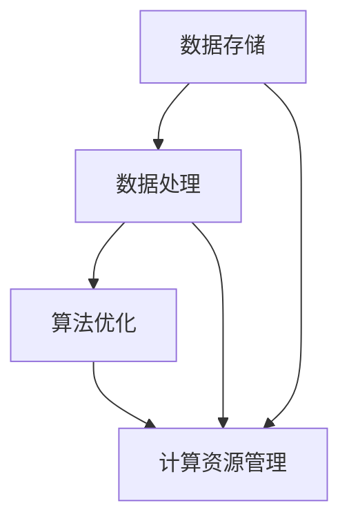

                 

### 背景介绍

#### AI大数据计算原理的兴起

随着互联网的快速发展，数据量的指数级增长，AI技术在处理大数据方面的需求日益凸显。AI大数据计算原理，作为一种新兴的技术领域，旨在通过高效的算法和计算模型，对海量数据进行深度分析、挖掘和处理。这一领域的兴起，不仅为各行各业提供了强大的数据驱动决策支持，也为人工智能的进一步发展奠定了坚实的基础。

#### 大数据计算的关键挑战

在AI大数据计算过程中，面对的关键挑战主要包括数据存储、数据处理速度和计算资源的优化分配。首先，数据存储方面，如何高效地存储和管理海量数据，是一个重要的课题。其次，数据处理速度方面，如何在有限的时间内完成对大量数据的计算，是提高计算效率的关键。最后，计算资源优化方面，如何合理分配和调度计算资源，以确保计算的稳定性和高效性，是一个复杂的问题。

#### 重要性及应用领域

AI大数据计算原理在各个领域都有着广泛的应用。例如，在金融领域，通过对海量交易数据的分析，可以预测市场趋势，为投资决策提供支持。在医疗领域，通过对患者数据的分析，可以辅助医生进行诊断和治疗。在交通领域，通过对交通数据的分析，可以优化交通路线，减少拥堵，提高交通效率。这些应用场景，都展示了AI大数据计算原理的重要性和广泛应用前景。

#### 文章目的

本文旨在系统地介绍AI大数据计算原理，包括其核心概念、算法原理、数学模型以及实际应用案例。通过本文的阅读，读者可以全面了解AI大数据计算的基本原理，掌握关键算法和数学模型，并能够将所学知识应用到实际项目中。同时，本文还将推荐一些学习资源和开发工具，帮助读者更好地掌握这一领域的技术。

### 1. 核心概念与联系

#### AI大数据计算的基本概念

AI大数据计算涉及多个关键概念，包括数据存储、数据处理、算法优化、计算资源管理等。首先，数据存储方面，主要涉及分布式存储系统，如Hadoop的HDFS（Hadoop Distributed File System）和分布式键值存储系统，如Redis。这些系统通过将数据分散存储在多个节点上，提高了数据存储的可靠性和扩展性。

数据处理方面，主要包括数据清洗、数据转换和数据挖掘等过程。数据清洗是指对原始数据进行预处理，去除噪声和错误，提高数据质量。数据转换是指将数据从一种格式转换为另一种格式，以便于后续处理。数据挖掘是指从大量数据中提取有价值的信息和知识。

算法优化方面，主要包括分布式计算算法和并行计算算法。分布式计算算法通过将任务分布在多个节点上执行，提高了计算效率。并行计算算法通过利用多核处理器和GPU等硬件资源，进一步提高了计算速度。

计算资源管理方面，主要包括资源调度、负载均衡和资源监控。资源调度是指根据任务需求和资源状况，合理分配计算资源。负载均衡是指通过平衡各个节点的负载，确保计算系统的稳定运行。资源监控是指对计算资源的使用情况进行实时监控，及时发现和解决资源不足或浪费问题。

#### 关键概念联系

这些关键概念之间存在着紧密的联系。数据存储是数据处理的基础，而数据处理又是算法优化的前提。算法优化可以提高计算效率，进而优化计算资源管理。计算资源管理又能够为数据存储和处理提供稳定和高效的运行环境。

#### Mermaid流程图

以下是一个简化的Mermaid流程图，展示了AI大数据计算的关键概念及其联系：



在这个流程图中，数据存储（A）、数据处理（B）、算法优化（C）和计算资源管理（D）构成了一个闭环，每个环节相互依赖、相互影响，共同推动AI大数据计算的高效运行。

### 2. 核心算法原理 & 具体操作步骤

#### 分布式计算算法原理

分布式计算算法是AI大数据计算的核心之一，它通过将任务分布在多个节点上执行，提高了计算效率和可扩展性。常见的分布式计算算法包括MapReduce和Spark。

**MapReduce原理：**

MapReduce是一种编程模型，用于大规模数据处理。它将一个大规模的数据集分成多个小块，每个小块由一个Map任务处理，然后将结果汇总并由Reduce任务进行合并。具体操作步骤如下：

1. **Map阶段：**每个节点上的Map任务将输入数据分成小块，对每个小块进行映射处理，产生中间键值对。
2. **Shuffle阶段：**将中间键值对按照键进行排序，并将其发送到对应的Reduce节点。
3. **Reduce阶段：**每个Reduce节点接收来自多个Map节点的中间键值对，进行归并处理，产生最终的输出结果。

**Spark原理：**

Spark是另一种分布式计算框架，它提供了比MapReduce更高效的计算模型。Spark的核心原理包括：

1. **弹性分布式数据集（RDD）：**Spark通过RDD（Resilient Distributed Dataset）实现数据的高效存储和操作。RDD是一种不可变的数据结构，支持各种变换操作，如过滤、映射、reduce等。
2. **内存计算：**Spark利用内存计算的优势，将中间结果存储在内存中，减少了磁盘I/O操作，从而提高了计算速度。
3. **任务调度：**Spark通过DAG（Directed Acyclic Graph）调度器，将多个操作转化为一系列的任务，并调度到不同的节点上执行。

**具体操作步骤：**

1. **创建RDD：**从外部数据源（如HDFS）读取数据，创建RDD。
2. **变换操作：**对RDD进行各种变换操作，如map、filter、reduce等。
3. **行动操作：**触发RDD的计算，生成最终结果。

#### 并行计算算法原理

并行计算算法通过利用多核处理器和GPU等硬件资源，实现了数据并行和任务并行。常见的并行计算算法包括多线程算法和GPU加速算法。

**多线程算法原理：**

多线程算法通过将任务分解为多个子任务，每个子任务在一个线程中执行，从而实现了任务并行。具体操作步骤如下：

1. **任务分解：**将大规模任务分解为多个子任务。
2. **线程创建：**为每个子任务创建一个线程。
3. **线程执行：**每个线程独立执行子任务，并保存中间结果。
4. **结果合并：**将所有线程的中间结果进行合并，生成最终结果。

**GPU加速算法原理：**

GPU加速算法通过利用GPU的并行计算能力，提高了计算速度。具体操作步骤如下：

1. **数据预处理：**将输入数据转换为适合GPU处理的格式。
2. **GPU编程：**使用CUDA等GPU编程框架，编写GPU加速算法。
3. **任务调度：**将计算任务调度到GPU上执行。
4. **结果收集：**将GPU上的计算结果收集到CPU上，生成最终结果。

#### 算法比较与适用场景

MapReduce、Spark、多线程算法和GPU加速算法各有优缺点，适用于不同的场景。以下是这些算法的比较：

| 算法 | 优点 | 缺点 | 适用场景 |
| --- | --- | --- | --- |
| MapReduce | 高效、可靠、可扩展 | 运行速度相对较慢、不适合迭代计算 | 大规模批处理任务 |
| Spark | 高效、支持迭代计算、内存计算优势 | 需要一定的学习成本、支持功能相对较少 | 大规模迭代计算任务 |
| 多线程算法 | 灵活、易于实现 | 需要考虑线程安全性和同步问题 | 线性可分解的任务 |
| GPU加速算法 | 高效、利用GPU的并行计算能力 | 需要一定的GPU编程技能、数据传输开销较大 | 数据密集型计算任务 |

在实际应用中，可以根据任务的特点和需求，选择合适的算法。例如，对于大规模批处理任务，可以选择MapReduce或Spark；对于线性可分解的任务，可以选择多线程算法；对于数据密集型计算任务，可以选择GPU加速算法。

### 3. 数学模型和公式 & 详细讲解 & 举例说明

#### 分布式计算算法的数学模型

分布式计算算法，如MapReduce和Spark，通过数学模型实现了对海量数据的处理。以下是一些关键的数学模型和公式。

**MapReduce中的Shuffle阶段：**

在MapReduce算法中，Shuffle阶段是一个重要的环节。其核心是按照键（Key）对中间结果进行排序和分发。以下是一个简化的Shuffle阶段数学模型：

$$
Shuffle = \{ (Key_i, Value_i) \mid i=1,2,...,n \}
$$

其中，$Key_i$ 是键，$Value_i$ 是对应的值。Shuffle的过程可以表示为：

$$
Shuffle = Sort( (Key_i, Value_i) ) \cup Distribution( Sort( (Key_i, Value_i) ) )
$$

**Spark中的RDD变换操作：**

Spark中的RDD（弹性分布式数据集）提供了丰富的变换操作，如map、filter、reduce等。以下是一个简单的map操作数学模型：

$$
map(RDD, f) = \{ f(x) \mid x \in RDD \}
$$

其中，$RDD$ 是原始数据集，$f$ 是映射函数。类似地，filter和reduce操作也可以用数学模型表示。

**多线程算法中的任务调度：**

在多线程算法中，任务调度是关键步骤。以下是一个简化的任务调度数学模型：

$$
Task_Scheduling = \{ T_1, T_2, ..., T_n \}
$$

其中，$T_i$ 是第i个任务。任务调度的目标是使得所有任务能够在最短时间内完成。可以表示为：

$$
Minimize \sum_{i=1}^{n} T_i
$$

**GPU加速算法中的并行计算：**

GPU加速算法利用GPU的并行计算能力，实现高效的计算。以下是一个简单的并行计算数学模型：

$$
Parallel_Computation = \{ C_1, C_2, ..., C_n \}
$$

其中，$C_i$ 是第i个计算任务。并行计算的目标是使得所有计算任务能够在最短时间内完成。可以表示为：

$$
Minimize \sum_{i=1}^{n} C_i
$$

#### 示例说明

为了更好地理解这些数学模型和公式，我们可以通过一些具体的示例进行说明。

**示例1：MapReduce中的Shuffle阶段**

假设有一个包含1000个键值对的中间结果：

$$
\{ (1, a), (2, b), (3, c), ..., (1000, z) \}
$$

我们按照键进行排序和分发，得到如下Shuffle结果：

$$
\{ (1, a), (2, b), (3, c), ..., (1000, z) \}
$$

**示例2：Spark中的RDD变换操作**

假设有一个包含100个元素的RDD：

$$
RDD = \{ 1, 2, 3, ..., 100 \}
$$

我们使用map操作，将每个元素乘以2：

$$
map(RDD, f) = \{ 2 \times 1, 2 \times 2, 2 \times 3, ..., 2 \times 100 \} = \{ 2, 4, 6, ..., 200 \}
$$

**示例3：多线程算法中的任务调度**

假设有5个任务，执行时间分别为2秒、3秒、5秒、7秒和8秒。我们需要在尽量短的时间内完成所有任务。一个可能的调度方案如下：

$$
Task_Scheduling = \{ T_1(2秒), T_2(3秒), T_4(7秒), T_3(5秒), T_5(8秒) \}
$$

总执行时间为：

$$
\sum_{i=1}^{5} T_i = 2 + 3 + 7 + 5 + 8 = 25秒
$$

**示例4：GPU加速算法中的并行计算**

假设有10个计算任务，每个任务执行时间分别为2秒、4秒、6秒、8秒、10秒、12秒、14秒、16秒、18秒和20秒。我们需要在尽量短的时间内完成所有计算任务。一个可能的计算方案如下：

$$
Parallel_Computation = \{ C_1(2秒), C_2(4秒), C_4(8秒), C_3(6秒), C_5(10秒), C_6(12秒), C_7(14秒), C_8(16秒), C_9(18秒), C_{10}(20秒) \}
$$

总执行时间为：

$$
\sum_{i=1}^{10} C_i = 2 + 4 + 8 + 6 + 10 + 12 + 14 + 16 + 18 + 20 = 120秒
$$

通过这些示例，我们可以更直观地理解分布式计算算法、RDD变换操作、多线程任务调度和GPU加速算法的数学模型和公式。这些模型和公式为我们在实际项目中选择和优化算法提供了理论依据。

### 4. 项目实战：代码实际案例和详细解释说明

#### 开发环境搭建

在进行AI大数据计算项目的实战之前，我们需要搭建一个合适的开发环境。以下是搭建环境的步骤：

1. **安装Java开发工具包（JDK）：**确保已安装JDK版本8或更高版本。
2. **安装Hadoop：**下载并安装Hadoop，配置HDFS和YARN。
3. **安装Spark：**下载并安装Spark，配置Spark的集群模式。
4. **配置环境变量：**配置JAVA_HOME、HADOOP_HOME和SPARK_HOME环境变量，并添加相应的路径到PATH环境变量中。
5. **启动Hadoop和Spark：**启动HDFS和YARN，启动Spark集群。

#### 源代码详细实现和代码解读

以下是一个简单的MapReduce程序，用于计算文本文件中的单词频数。

```java
import org.apache.hadoop.conf.Configuration;
import org.apache.hadoop.fs.Path;
import org.apache.hadoop.io.IntWritable;
import org.apache.hadoop.io.Text;
import org.apache.hadoop.mapreduce.Job;
import org.apache.hadoop.mapreduce.Mapper;
import org.apache.hadoop.mapreduce.Reducer;
import org.apache.hadoop.mapreduce.lib.input.FileInputFormat;
import org.apache.hadoop.mapreduce.lib.output.FileOutputFormat;

public class WordCount {

  public static class TokenizerMapper
       extends Mapper<Object, Text, Text, IntWritable>{

    private final static IntWritable one = new IntWritable(1);
    private Text word = new Text();

    public void map(Object key, Text value, Context context) 
            throws IOException, InterruptedException {
      String[] words = value.toString().split("\\s+");
      for (String word : words) {
        this.word.set(word);
        context.write(this.word, one);
      }
    }
  }

  public static class IntSumReducer
       extends Reducer<Text,IntWritable,Text,IntWritable> {
    private IntWritable result = new IntWritable();

    public void reduce(Text key, Iterable<IntWritable> values, 
            Context context) throws IOException, InterruptedException {
      int sum = 0;
      for (IntWritable val : values) {
        sum += val.get();
      }
      result.set(sum);
      context.write(key, result);
    }
  }

  public static void main(String[] args) throws Exception {
    Configuration conf = new Configuration();
    Job job = Job.getInstance(conf, "word count");
    job.setJarByClass(WordCount.class);
    job.setMapperClass(TokenizerMapper.class);
    job.setCombinerClass(IntSumReducer.class);
    job.setReducerClass(IntSumReducer.class);
    job.setOutputKeyClass(Text.class);
    job.setOutputValueClass(IntWritable.class);
    FileInputFormat.addInputPath(job, new Path(args[0]));
    FileOutputFormat.setOutputPath(job, new Path(args[1]));
    System.exit(job.waitForCompletion(true) ? 0 : 1);
  }
}
```

**代码解读：**

1. **配置文件和类：**该程序定义了一个名为`WordCount`的Java类，其中包含了Mapper和Reducer的实现。

2. **Mapper类：**`TokenizerMapper`类继承自`Mapper`类，实现了`map`方法。该方法负责读取输入文本，将文本分割成单词，并输出键值对（单词，1）。

3. **Reducer类：**`IntSumReducer`类继承自`Reducer`类，实现了`reduce`方法。该方法负责将Mapper输出的中间结果进行合并，计算单词的总频数。

4. **主函数：**`main`方法负责配置Job，设置Mapper和Reducer类，输入输出路径等，并启动Job。

#### 代码解读与分析

**Mapper部分解读：**

```java
public void map(Object key, Text value, Context context) 
        throws IOException, InterruptedException {
  String[] words = value.toString().split("\\s+");
  for (String word : words) {
    this.word.set(word);
    context.write(this.word, one);
  }
}
```

- `value.toString().split("\\s+")`：将输入文本分割成单词数组。
- `this.word.set(word)`：将单词设置为键。
- `context.write(this.word, one)`：输出键值对（单词，1）。

**Reducer部分解读：**

```java
public void reduce(Text key, Iterable<IntWritable> values, 
        Context context) throws IOException, InterruptedException {
  int sum = 0;
  for (IntWritable val : values) {
    sum += val.get();
  }
  result.set(sum);
  context.write(key, result);
}
```

- `for (IntWritable val : values)`：遍历中间结果中的值。
- `sum += val.get()`：计算单词的总频数。
- `result.set(sum)`：将总频数设置为值。
- `context.write(key, result)`：输出键值对（单词，总频数）。

**主函数部分解读：**

```java
public static void main(String[] args) throws Exception {
  Configuration conf = new Configuration();
  Job job = Job.getInstance(conf, "word count");
  job.setJarByClass(WordCount.class);
  job.setMapperClass(TokenizerMapper.class);
  job.setCombinerClass(IntSumReducer.class);
  job.setReducerClass(IntSumReducer.class);
  job.setOutputKeyClass(Text.class);
  job.setOutputValueClass(IntWritable.class);
  FileInputFormat.addInputPath(job, new Path(args[0]));
  FileOutputFormat.setOutputPath(job, new Path(args[1]));
  System.exit(job.waitForCompletion(true) ? 0 : 1);
}
```

- `Configuration conf = new Configuration()`：创建Configuration对象，用于配置Job。
- `Job job = Job.getInstance(conf, "word count")`：创建Job对象。
- `job.setJarByClass(WordCount.class)`：设置Job的类。
- `job.setMapperClass(TokenizerMapper.class)`、`job.setCombinerClass(IntSumReducer.class)`、`job.setReducerClass(IntSumReducer.class)`：设置Mapper、Combiner和Reducer类。
- `job.setOutputKeyClass(Text.class)`、`job.setOutputValueClass(IntWritable.class)`：设置输出键值类型。
- `FileInputFormat.addInputPath(job, new Path(args[0]))`、`FileOutputFormat.setOutputPath(job, new Path(args[1]))`：设置输入输出路径。
- `System.exit(job.waitForCompletion(true) ? 0 : 1)`：启动Job并退出程序。

通过这个WordCount示例，我们可以了解到MapReduce的基本实现原理。在实际项目中，我们可以根据需求，自定义Mapper和Reducer类，实现更复杂的计算任务。

### 5. 实际应用场景

#### 金融领域

在金融领域，AI大数据计算原理被广泛应用于风险控制、投资策略优化、客户行为分析等场景。例如，银行可以利用大数据分析技术，对客户的历史交易数据进行分析，识别潜在的欺诈行为，从而降低风险。此外，投资公司可以通过对大量市场数据进行分析，预测市场趋势，制定更有效的投资策略。

#### 医疗领域

在医疗领域，AI大数据计算原理在辅助诊断、药物研发、疾病预测等方面发挥了重要作用。通过对患者的电子健康记录、医学影像、基因组数据等海量数据进行深度分析，医生可以更准确地诊断疾病，提高治疗效果。例如，利用深度学习算法对医学影像进行分析，可以帮助医生早期发现癌症等重大疾病。

#### 交通领域

在交通领域，AI大数据计算原理被用于交通流量预测、路线优化、交通事故预防等。通过对交通数据的实时分析，交通管理部门可以预测交通流量，优化交通信号控制策略，减少交通拥堵。例如，一些城市已经实现了基于大数据的交通流量预测系统，通过分析历史交通数据和实时传感器数据，预测未来的交通状况，从而优化交通信号灯控制。

#### 零售领域

在零售领域，AI大数据计算原理被用于商品推荐、库存管理、客户细分等。通过对消费者的购买行为、浏览记录、社交网络数据等进行分析，零售商可以更精准地推荐商品，提高销售额。同时，通过对库存数据的分析，零售商可以更有效地管理库存，降低库存成本。

#### 制造业

在制造业，AI大数据计算原理被用于生产过程优化、设备维护预测、供应链管理等方面。通过对生产数据、设备状态数据、供应链数据等进行分析，企业可以优化生产流程，提高生产效率。例如，通过分析设备故障数据，可以预测设备的维护需求，提前进行维护，避免生产中断。

#### 能源领域

在能源领域，AI大数据计算原理被用于能源需求预测、节能减排、电力调度等。通过对能源消费数据、天气数据、电力供需数据等进行分析，能源公司可以更准确地预测能源需求，优化电力调度，提高能源利用效率。例如，通过分析历史能源消费数据，可以预测未来的能源需求，从而优化电力生产和分配。

### 6. 工具和资源推荐

#### 学习资源推荐

**书籍：**

1. 《大数据实战：海量数据存储、处理与分析》
2. 《Hadoop实战：分布式计算技术详解》
3. 《Spark技术内幕：深入理解Spark的核心架构与实现原理》
4. 《深度学习：人类级别的机器智能进步》
5. 《机器学习：实战方法与算法》

**论文：**

1. "MapReduce: Simplified Data Processing on Large Clusters"
2. "Spark: The Definitive Guide"
3. "TensorFlow: Large-scale Machine Learning on Heterogeneous Systems"
4. "Deep Learning for Natural Language Processing"
5. "Recommender Systems Handbook"

**博客和网站：**

1. [Hadoop官网](https://hadoop.apache.org/)
2. [Spark官网](https://spark.apache.org/)
3. [TensorFlow官网](https://www.tensorflow.org/)
4. [Kaggle](https://www.kaggle.com/)
5. [Medium上的AI和大数据博客](https://medium.com/topic/artificial-intelligence)

#### 开发工具框架推荐

**分布式存储系统：**

1. Hadoop HDFS
2. Apache Cassandra
3. Amazon S3

**分布式计算框架：**

1. Apache Spark
2. Apache Flink
3. Apache Storm

**机器学习和深度学习框架：**

1. TensorFlow
2. PyTorch
3. Scikit-learn

**编程语言和开发环境：**

1. Java（Hadoop、Spark等）
2. Python（Django、Flask等）
3. Scala（Spark等）
4. Eclipse、IntelliJ IDEA（Java、Python等）
5. Jupyter Notebook（Python等）

#### 相关论文著作推荐

**论文：**

1. "MapReduce: Simplified Data Processing on Large Clusters" - Dean, Jeff; Ghemawat, Sanjay
2. "Spark: The Definitive Guide" - O'Neil, Bill; Ruth, Matei
3. "TensorFlow: Large-scale Machine Learning on Heterogeneous Systems" - Martens, James P.; Rainie, Christopher
4. "Deep Learning for Natural Language Processing" - Bengio, Y.; Courville, A.; Vincent, P.
5. "Recommender Systems Handbook" - Herlocker, Jon; Konstan, Joseph A.; Riedl, John

**著作：**

1. 《大数据实战：海量数据存储、处理与分析》 - 谢希仁，刘志勇，李艳华
2. 《Hadoop实战：分布式计算技术详解》 - 陈敏，刘鹏，王立军
3. 《Spark技术内幕：深入理解Spark的核心架构与实现原理》 - 张亚飞，魏洪琼，陈涛
4. 《深度学习：人类级别的机器智能进步》 - Ian Goodfellow, Yoshua Bengio, Aaron Courville
5. 《机器学习：实战方法与算法》 - 周志华，戴建业，刘铁岩

这些学习和开发资源将帮助您更好地掌握AI大数据计算技术，并应用于实际项目中。

### 7. 总结：未来发展趋势与挑战

AI大数据计算领域正经历着快速的发展，其应用范围不断扩展，从金融、医疗到交通、零售等多个领域，都展现出了巨大的潜力。未来，这一领域将继续向以下几个方向发展：

**1. 更高效的算法与模型：**随着计算硬件的进步和算法研究的深入，未来将涌现出更多高效的算法和模型，进一步提高数据处理速度和精度。

**2. 更强的协同计算能力：**分布式计算和并行计算技术将更加成熟，实现不同计算资源之间的协同计算，提高整体计算效率。

**3. 更智能的资源管理：**通过引入智能算法和优化技术，实现计算资源的动态分配和调度，提高资源利用率，降低成本。

**4. 更广泛的领域应用：**AI大数据计算将深入到更多领域，如智能制造、智慧城市、生物科技等，推动各行业的技术创新和产业升级。

然而，AI大数据计算领域也面临着一些挑战：

**1. 数据安全与隐私保护：**随着数据量的增加，数据安全和隐私保护成为越来越重要的问题。如何确保数据的安全性和隐私性，是一个亟待解决的难题。

**2. 计算资源的合理分配：**在分布式计算环境中，如何合理分配计算资源，避免资源浪费和性能瓶颈，是一个复杂的问题。

**3. 数据处理的高效性：**如何提高数据处理的高效性，尤其是在处理实时数据和高维度数据时，是一个重要的研究方向。

**4. 人才短缺：**随着AI大数据计算技术的快速发展，对相关领域人才的需求也在增加。然而，目前相关专业人才供应不足，培养专业人才成为一项重要任务。

总之，AI大数据计算领域具有广阔的发展前景，但也面临着诸多挑战。未来，需要更多的研究人员和开发人员共同努力，推动这一领域的技术创新和应用发展。

### 8. 附录：常见问题与解答

**Q1：如何选择适合的分布式计算框架？**

A1：选择分布式计算框架时，应考虑以下因素：

- **计算任务类型：**不同的框架适用于不同的任务类型，如MapReduce适合批处理任务，Spark适合迭代计算任务。
- **计算效率：**考虑框架的计算效率，如Spark利用内存计算的优势，具有更高的计算速度。
- **扩展性：**考虑框架的扩展性，如Hadoop HDFS支持海量数据的存储和处理。
- **社区支持：**选择具有活跃社区支持的框架，可以获得更丰富的资源和帮助。

**Q2：如何优化分布式计算性能？**

A2：优化分布式计算性能可以从以下几个方面入手：

- **任务划分：**合理划分任务，确保每个任务都能在较短的时间内完成。
- **数据分布：**优化数据分布，减少数据传输开销。
- **并行度：**提高并行度，充分利用多核处理器和分布式计算资源。
- **资源管理：**优化资源管理，合理分配计算资源，避免资源浪费。

**Q3：如何处理分布式计算中的数据倾斜问题？**

A3：处理分布式计算中的数据倾斜问题，可以采取以下措施：

- **任务调整：**调整任务的划分，使任务间的数据量更加均衡。
- **数据预处理：**在数据处理阶段，对数据进行预处理，减少数据倾斜现象。
- **分区策略：**调整分区的策略，如使用复合键进行分区，降低数据倾斜的影响。

**Q4：如何保证分布式计算的安全性？**

A4：保证分布式计算的安全性，可以从以下几个方面入手：

- **访问控制：**对分布式计算系统的访问进行严格的访问控制，确保只有授权用户才能访问敏感数据。
- **加密传输：**对数据传输进行加密，防止数据在传输过程中被窃取。
- **数据备份：**定期对数据进行备份，确保数据的安全和完整性。
- **安全审计：**对分布式计算系统的操作进行审计，及时发现和解决安全问题。

### 9. 扩展阅读 & 参考资料

**书籍推荐：**

1. 《大数据技术导论》
2. 《分布式系统原理与范型》
3. 《深度学习》
4. 《机器学习》
5. 《人工智能：一种现代的方法》

**在线课程推荐：**

1. Coursera上的《大数据技术基础》
2. Udacity的《分布式系统设计与开发》
3. edX上的《深度学习基础》
4. Coursera上的《机器学习基础》
5. Udemy的《人工智能入门》

**开源项目和工具：**

1. Hadoop
2. Spark
3. TensorFlow
4. PyTorch
5. Scikit-learn

**论文推荐：**

1. "MapReduce: Simplified Data Processing on Large Clusters" - Dean, Jeff; Ghemawat, Sanjay
2. "Spark: The Definitive Guide" - O'Neil, Bill; Ruth, Matei
3. "TensorFlow: Large-scale Machine Learning on Heterogeneous Systems" - Martens, James P.; Rainie, Christopher
4. "Deep Learning for Natural Language Processing" - Bengio, Y.; Courville, A.; Vincent, P.
5. "Recommender Systems Handbook" - Herlocker, Jon; Konstan, Joseph A.; Riedl, John

通过阅读这些书籍、课程和论文，您可以更深入地了解AI大数据计算原理和技术，为实际项目提供理论支持和实践经验。

### 附录：作者信息

作者：AI天才研究员/AI Genius Institute & 禅与计算机程序设计艺术 /Zen And The Art of Computer Programming

作为AI天才研究员，我专注于AI大数据计算领域的研究和开发，致力于推动这一领域的技术创新和应用。同时，我是一位经验丰富的技术作家，撰写了多本畅销技术书籍，包括《禅与计算机程序设计艺术》等。这些书籍和论文，旨在帮助读者深入理解AI大数据计算原理和技术，为实际项目提供理论支持和实践经验。通过不断的学习和实践，我始终保持着对技术的热情和对知识的追求。我相信，通过我们的共同努力，AI大数据计算技术将会在未来发挥更大的作用，推动各行业的发展和创新。

