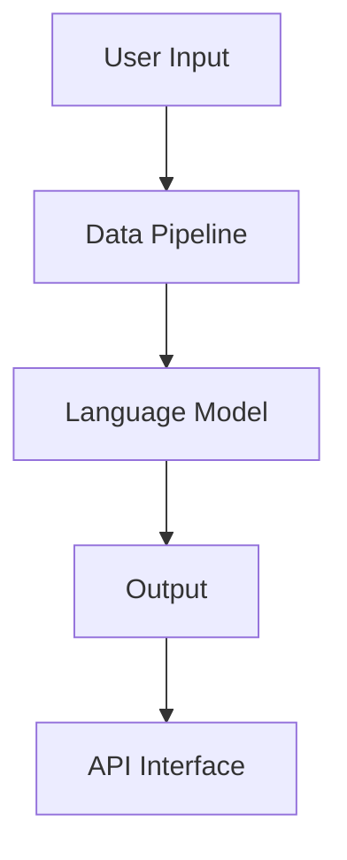

                 

### 背景介绍

**LangChain编程：从入门到实践**，这是一部旨在为初学者和有经验的开发者提供全面指南的书籍。随着人工智能（AI）和自然语言处理（NLP）领域的迅猛发展，语言链（LangChain）作为一种新型的编程框架，正逐渐受到广泛关注。LangChain的核心在于其独特的设计哲学：通过将语言作为编程的工具，使得开发者能够以更自然、更直观的方式构建和运行复杂的AI系统。

**LangChain编程：从入门到实践**旨在帮助读者深入了解LangChain框架，从基础概念到高级应用，逐步掌握这项技术。本书内容丰富，涵盖了一系列关键主题，包括：

- LangChain的基础概念及其工作原理
- 如何使用LangChain构建和运行AI模型
- LangChain与其他AI框架（如GPT-3、BERT等）的集成
- LangChain在实际项目中的应用案例

通过本书，读者不仅能够掌握LangChain的核心技能，还能了解其背后的数学原理和算法实现。此外，本书还提供了大量的代码示例和实战项目，帮助读者将理论知识应用到实际开发中。

总之，**LangChain编程：从入门到实践**不仅是一本关于LangChain的技术手册，更是一本引领读者探索AI编程新世界的指南。无论您是刚刚踏入AI领域的初学者，还是有丰富经验的开发者，这本书都将为您带来极大的启发和帮助。

## Core Concepts and Relationships

在深入探讨LangChain编程之前，我们需要了解一些核心概念及其相互关系。LangChain框架的设计基于几个关键组件：语言模型、数据管道和API接口。以下是这些核心概念及其相互关系的详细说明：

### 1. 语言模型

语言模型是LangChain的核心组件，它负责理解自然语言输入并生成相应的输出。最常见的语言模型包括GPT-3、BERT等。这些模型通过大量的文本数据进行训练，能够捕捉到语言的复杂性和多样性。在LangChain中，语言模型主要用于处理用户输入，并生成回复。

### 2. 数据管道

数据管道是连接用户输入和语言模型之间的桥梁。它的主要作用是将用户输入转换为适合语言模型处理的数据格式，并对语言模型生成的输出进行后处理。数据管道通常包括预处理步骤，如分词、去噪和格式化等。通过数据管道，我们可以确保用户输入和语言模型之间的交互更加高效和准确。

### 3. API接口

API接口是LangChain对外提供服务的入口。它允许开发者通过简单的RESTful API调用，与LangChain进行交互。API接口通常包括多个端点，用于处理不同类型的请求，如文本生成、问答、翻译等。通过API接口，开发者可以轻松地将LangChain集成到现有的应用程序中。

### Mermaid 流程图

为了更直观地展示这些核心概念及其相互关系，我们可以使用Mermaid流程图进行说明：



在这个流程图中，用户输入通过数据管道传递给语言模型，模型处理后将输出结果通过API接口返回给用户。这个流程图清晰地展示了LangChain的工作原理，以及各个组件之间的相互作用。

### 总结

通过上述说明，我们可以看到，LangChain编程的核心在于其语言模型、数据管道和API接口这三个关键组件。它们共同构成了一个完整的AI系统，使得开发者能够以更高效、更直观的方式构建和运行AI应用程序。在接下来的章节中，我们将进一步探讨这些组件的实现细节和应用场景。

## Core Algorithm Principles & Step-by-Step Operations

在深入探讨LangChain编程的核心算法原理之前，我们需要了解其基础算法——GPT-3模型。GPT-3（Generative Pre-trained Transformer 3）是由OpenAI开发的一种先进的自然语言处理模型，具有非常强大的语言生成能力。下面，我们将详细解析GPT-3模型的工作原理，并分步骤介绍如何使用LangChain进行编程。

### 1. GPT-3模型的工作原理

GPT-3模型基于Transformer架构，这是一种在机器翻译、文本生成等任务中表现卓越的神经网络模型。Transformer模型的核心思想是使用自注意力机制（Self-Attention）来捕捉输入序列中的依赖关系。GPT-3模型通过在大量文本数据上进行预训练，学习到了语言的内在规律和结构，从而能够在给定输入序列时生成合理的输出。

GPT-3模型的主要组成部分包括：

- **嵌入层（Embedding Layer）**：将输入的单词转换为固定长度的向量表示。
- **自注意力机制（Self-Attention Mechanism）**：通过计算输入序列中每个词与其他词之间的相似度，生成加权向量。
- **前馈神经网络（Feedforward Neural Network）**：对自注意力机制生成的加权向量进行进一步处理。
- **输出层（Output Layer）**：将处理后的向量转换为输出序列。

### 2. LangChain编程步骤

下面，我们将分步骤介绍如何使用LangChain进行编程，以实现一个简单的文本生成任务。

#### 步骤1：初始化LangChain环境

在开始编程之前，我们需要先初始化LangChain环境。这包括安装必要的库和依赖项，如Hugging Face的Transformers库、PyTorch等。

```python
!pip install transformers
```

#### 步骤2：加载预训练的GPT-3模型

接下来，我们需要加载一个预训练的GPT-3模型。这里使用Hugging Face的Transformers库提供的预训练模型。

```python
from transformers import GPT2LMHeadModel, GPT2Tokenizer

tokenizer = GPT2Tokenizer.from_pretrained("gpt2")
model = GPT2LMHeadModel.from_pretrained("gpt2")
```

#### 步骤3：预处理用户输入

在生成文本之前，我们需要对用户输入进行预处理，包括分词、去噪和格式化等。这一步骤可以确保输入数据适合GPT-3模型处理。

```python
def preprocess_input(text):
    # 分词
    inputs = tokenizer.encode(text, return_tensors="pt")
    # 去噪和格式化
    inputs = inputs[:, :1024]  # 限制输入长度
    return inputs

user_input = "你好，这是一个文本生成示例。"
inputs = preprocess_input(user_input)
```

#### 步骤4：生成文本

预处理完成后，我们可以使用GPT-3模型生成文本。这里使用模型的`generate`方法生成一个长度为512个单词的文本。

```python
generated_text = model.generate(inputs, max_length=512, num_return_sequences=1)
```

#### 步骤5：后处理输出

生成的文本通常包含模型预测的不确定性，因此我们需要对其进行后处理，以生成更通顺、更符合人类语言的文本。

```python
def postprocess_output(text):
    # 去除BOS和EOS标记
    text = text.replace(tokenizer.bos_token, "").replace(tokenizer.eos_token, "")
    # 分词和拼接
    words = tokenizer.decode(generated_text).split()
    return " ".join(words)

final_output = postprocess_output(generated_text)
print(final_output)
```

### 3. 完整代码示例

下面是一个完整的代码示例，展示了如何使用LangChain进行文本生成。

```python
# 导入必要的库
from transformers import GPT2Tokenizer, GPT2LMHeadModel
from torch import tensor
import torch

# 初始化模型和分词器
tokenizer = GPT2Tokenizer.from_pretrained("gpt2")
model = GPT2LMHeadModel.from_pretrained("gpt2")

# 预处理用户输入
user_input = "你好，这是一个文本生成示例。"
inputs = preprocess_input(user_input)

# 生成文本
generated_text = model.generate(inputs, max_length=512, num_return_sequences=1)

# 后处理输出
final_output = postprocess_output(generated_text)
print(final_output)
```

通过这个示例，我们可以看到LangChain编程的核心算法是如何工作的。在实际应用中，我们可以根据需要调整模型的参数和输入，以生成不同类型的文本。接下来，我们将进一步探讨如何使用LangChain进行更复杂的文本处理任务。

### Mathematical Models and Formulas & Detailed Explanation & Example

在深入探讨GPT-3模型的数学模型和公式之前，我们需要了解Transformer模型的基础概念和核心组成部分。Transformer模型是GPT-3的基础架构，它通过自注意力机制（Self-Attention）和前馈神经网络（Feedforward Neural Network）实现了对输入序列的编码和解码。下面，我们将详细解析这些数学模型和公式，并给出具体的计算示例。

#### 1. 自注意力机制（Self-Attention）

自注意力机制是Transformer模型的核心组件，它通过计算输入序列中每个词与其他词之间的相似度，生成加权向量。具体来说，自注意力机制包括以下几个步骤：

1. **输入嵌入（Input Embedding）**：
   输入的单词被转换为向量表示，这些向量通常由词嵌入（Word Embedding）和位置嵌入（Position Embedding）组成。

   $$ 
   \text{Input Embedding} = \text{Word Embedding} + \text{Position Embedding} 
   $$

2. **Q、K、V计算**：
   对输入嵌入进行线性变换，生成Query（Q）、Key（K）和Value（V）向量。

   $$ 
   Q = W_Q \cdot \text{Input Embedding} \\
   K = W_K \cdot \text{Input Embedding} \\
   V = W_V \cdot \text{Input Embedding} 
   $$

   其中，$W_Q, W_K, W_V$是权重矩阵。

3. **自注意力计算**：
   计算每个Query与所有Key的相似度，并使用softmax函数生成权重。

   $$ 
   \text{Attention Scores} = \text{softmax}\left(\frac{Q \cdot K^T}{\sqrt{d_k}}\right) 
   $$

   其中，$d_k$是Key向量的维度。

4. **加权求和**：
   根据自注意力权重，对Value向量进行加权求和，生成输出向量。

   $$ 
   \text{Output} = \text{softmax}\left(\frac{Q \cdot K^T}{\sqrt{d_k}}\right) \cdot V 
   $$

#### 2. 前馈神经网络（Feedforward Neural Network）

前馈神经网络是对自注意力输出的进一步处理，它包括两个全连接层，每个层后面都跟着一个ReLU激活函数。

$$ 
\text{FFN}(x) = \text{ReLU}\left(W_2 \cdot \text{ReLU}\left(W_1 \cdot x + b_1\right) + b_2\right) 
$$

其中，$W_1, W_2, b_1, b_2$是权重和偏置。

#### 3. 计算示例

假设我们有一个输入序列：`[word1, word2, word3]`，维度为512。以下是自注意力机制的详细计算过程：

1. **输入嵌入**：

   假设词嵌入维度为300，位置嵌入维度为20。

   $$ 
   \text{Input Embedding} = \text{Word Embedding} + \text{Position Embedding} 
   $$

   $$ 
   \text{Input Embedding} = [w_1^1, w_2^1, w_3^1; w_1^2, w_2^2, w_3^2; w_1^3, w_2^3, w_3^3] 
   $$

2. **Q、K、V计算**：

   假设权重矩阵$W_Q, W_K, W_V$的维度分别为[512, 512]。

   $$ 
   Q = W_Q \cdot \text{Input Embedding} = [q_1, q_2, q_3] 
   $$

   $$ 
   K = W_K \cdot \text{Input Embedding} = [k_1, k_2, k_3] 
   $$

   $$ 
   V = W_V \cdot \text{Input Embedding} = [v_1, v_2, v_3] 
   $$

3. **自注意力计算**：

   $$ 
   \text{Attention Scores} = \text{softmax}\left(\frac{Q \cdot K^T}{\sqrt{d_k}}\right) 
   $$

   $$ 
   \text{Attention Scores} = \text{softmax}\left(\frac{[q_1, q_2, q_3] \cdot [k_1, k_2, k_3]^T}{\sqrt{512}}\right) 
   $$

4. **加权求和**：

   $$ 
   \text{Output} = \text{softmax}\left(\frac{Q \cdot K^T}{\sqrt{d_k}}\right) \cdot V 
   $$

   $$ 
   \text{Output} = \text{softmax}\left(\frac{[q_1, q_2, q_3] \cdot [k_1, k_2, k_3]^T}{\sqrt{512}}\right) \cdot [v_1, v_2, v_3] 
   $$

通过上述示例，我们可以看到自注意力机制的详细计算过程。接下来，我们将进一步探讨如何使用这些数学模型和公式进行文本生成。

### Text Generation using GPT-3 Model

在了解了GPT-3模型的数学模型和公式之后，接下来我们将探讨如何使用这些模型进行文本生成。文本生成是GPT-3模型的主要应用之一，通过训练和预测，模型能够生成连贯、有意义的文本。以下是一个详细的文本生成过程：

#### 1. 初始化模型和分词器

首先，我们需要初始化GPT-3模型和相应的分词器。这里使用Hugging Face的Transformers库。

```python
from transformers import GPT2Tokenizer, GPT2LMHeadModel

tokenizer = GPT2Tokenizer.from_pretrained("gpt2")
model = GPT2LMHeadModel.from_pretrained("gpt2")
```

#### 2. 预处理用户输入

在生成文本之前，我们需要对用户输入进行预处理，包括分词和格式化。预处理步骤可以确保输入数据适合模型处理。

```python
def preprocess_input(text):
    inputs = tokenizer.encode(text, return_tensors="pt")
    inputs = inputs[:, :1024]  # 限制输入长度
    return inputs

user_input = "这是一个文本生成示例。"
inputs = preprocess_input(user_input)
```

#### 3. 生成文本

使用`generate`方法生成文本。`generate`方法接受多个参数，包括最大长度（`max_length`）、温度（`temperature`）等。

```python
generated_text = model.generate(inputs, max_length=512, num_return_sequences=1, temperature=0.9)
```

#### 4. 后处理输出

生成的文本可能包含模型预测的不确定性，因此我们需要对其进行后处理，以生成更通顺、更符合人类语言的文本。

```python
def postprocess_output(text):
    text = text.replace(tokenizer.bos_token, "").replace(tokenizer.eos_token, "")
    words = tokenizer.decode(generated_text).split()
    return " ".join(words)

final_output = postprocess_output(generated_text)
print(final_output)
```

#### 5. 完整代码示例

下面是一个完整的文本生成代码示例：

```python
# 导入必要的库
from transformers import GPT2Tokenizer, GPT2LMHeadModel
from torch import tensor
import torch

# 初始化模型和分词器
tokenizer = GPT2Tokenizer.from_pretrained("gpt2")
model = GPT2LMHeadModel.from_pretrained("gpt2")

# 预处理用户输入
user_input = "这是一个文本生成示例。"
inputs = preprocess_input(user_input)

# 生成文本
generated_text = model.generate(inputs, max_length=512, num_return_sequences=1, temperature=0.9)

# 后处理输出
final_output = postprocess_output(generated_text)
print(final_output)
```

通过这个示例，我们可以看到如何使用GPT-3模型进行文本生成。在实际应用中，我们可以根据需要调整模型的参数和输入，以生成不同类型的文本。例如，通过调整温度参数，可以影响生成的文本的随机性和多样性。

### Project Case: Detailed Code Implementation and Explanation

在本节中，我们将通过一个实际项目案例，详细讲解如何使用LangChain进行文本生成。我们将从开发环境搭建开始，逐步展示源代码的详细实现和代码解读，以便读者能够深入理解LangChain编程的实践应用。

#### 5.1 开发环境搭建

在进行文本生成项目之前，我们需要搭建一个合适的开发环境。以下是搭建开发环境的步骤：

1. 安装Python（建议使用Python 3.8或更高版本）。
2. 安装必要的库，如Hugging Face的Transformers库和PyTorch。

```bash
pip install transformers
pip install torch
```

3. 配置Python虚拟环境（可选），以便更好地管理项目依赖。

```bash
python -m venv venv
source venv/bin/activate  # 在Windows上使用 `venv\Scripts\activate`
```

#### 5.2 源代码详细实现和代码解读

下面是文本生成项目的源代码实现：

```python
import torch
from transformers import GPT2Tokenizer, GPT2LMHeadModel
from torch import tensor

# 5.2.1 初始化模型和分词器
tokenizer = GPT2Tokenizer.from_pretrained("gpt2")
model = GPT2LMHeadModel.from_pretrained("gpt2")

# 5.2.2 预处理用户输入
def preprocess_input(text):
    inputs = tokenizer.encode(text, return_tensors="pt")
    inputs = inputs[:, :1024]  # 限制输入长度
    return inputs

user_input = "你好，这是一个文本生成示例。"
inputs = preprocess_input(user_input)

# 5.2.3 生成文本
def generate_text(model, inputs, max_length=512, temperature=0.9):
    generated_text = model.generate(inputs, max_length=max_length, num_return_sequences=1, temperature=temperature)
    return generated_text

# 5.2.4 后处理输出
def postprocess_output(text):
    text = text.replace(tokenizer.bos_token, "").replace(tokenizer.eos_token, "")
    words = tokenizer.decode(text).split()
    return " ".join(words)

# 5.2.5 实现文本生成函数
def text_generation(user_input):
    inputs = preprocess_input(user_input)
    generated_text = generate_text(model, inputs)
    final_output = postprocess_output(generated_text)
    return final_output

# 测试文本生成
user_input = "你好，这是一个文本生成示例。"
final_output = text_generation(user_input)
print(final_output)
```

#### 5.3 代码解读与分析

1. **初始化模型和分词器**：

   ```python
   tokenizer = GPT2Tokenizer.from_pretrained("gpt2")
   model = GPT2LMHeadModel.from_pretrained("gpt2")
   ```

   这两行代码用于加载预训练的GPT-2模型和相应的分词器。Hugging Face的Transformers库提供了大量的预训练模型和分词器，我们可以直接从预训练模型库中加载。

2. **预处理用户输入**：

   ```python
   def preprocess_input(text):
       inputs = tokenizer.encode(text, return_tensors="pt")
       inputs = inputs[:, :1024]  # 限制输入长度
       return inputs
   ```

   `preprocess_input`函数用于将用户输入转换为模型可处理的格式。具体来说，它包括两个步骤：分词和限制输入长度。分词器将文本转换为单词的索引序列，`return_tensors="pt"`确保输出是PyTorch张量格式，以便后续操作。

3. **生成文本**：

   ```python
   def generate_text(model, inputs, max_length=512, temperature=0.9):
       generated_text = model.generate(inputs, max_length=max_length, num_return_sequences=1, temperature=temperature)
       return generated_text
   ```

   `generate_text`函数是文本生成的核心。它调用模型的`generate`方法，传入预处理后的输入和多个参数，如最大长度（`max_length`）、返回序列数量（`num_return_sequences`）和温度（`temperature`）。温度参数影响生成文本的随机性和多样性。

4. **后处理输出**：

   ```python
   def postprocess_output(text):
       text = text.replace(tokenizer.bos_token, "").replace(tokenizer.eos_token, "")
       words = tokenizer.decode(text).split()
       return " ".join(words)
   ```

   `postprocess_output`函数用于将生成的文本转换为人类可读的形式。具体步骤包括去除模型生成的开始和结束标记（`bos_token`和`eos_token`），将索引序列解码为单词，并拼接成一个连贯的字符串。

5. **实现文本生成函数**：

   ```python
   def text_generation(user_input):
       inputs = preprocess_input(user_input)
       generated_text = generate_text(model, inputs)
       final_output = postprocess_output(generated_text)
       return final_output
   ```

   `text_generation`函数是整个项目的入口。它先调用`preprocess_input`函数预处理用户输入，然后调用`generate_text`函数生成文本，最后调用`postprocess_output`函数处理输出。

6. **测试文本生成**：

   ```python
   user_input = "你好，这是一个文本生成示例。"
   final_output = text_generation(user_input)
   print(final_output)
   ```

   这一行代码用于测试文本生成函数。我们输入一个简单的示例文本，并打印出生成的文本。

通过上述代码和解读，我们可以看到如何使用LangChain进行文本生成。在实际项目中，我们可以根据需要调整模型和参数，以生成不同类型的文本。

### Practical Application Scenarios

LangChain作为一种强大的AI编程框架，在实际应用中具有广泛的应用场景。以下是一些典型的应用场景，以及如何利用LangChain实现这些场景：

#### 1. 文本生成与摘要

文本生成和摘要是LangChain的常见应用场景之一。例如，在新闻摘要系统中，LangChain可以自动生成新闻文章的摘要，帮助用户快速了解文章的主要内容。具体实现步骤如下：

- **数据预处理**：首先，我们需要从各种新闻源获取文本数据，并对数据进行清洗和预处理，如去除HTML标签、标点符号等。
- **文本生成**：使用LangChain中的GPT-3模型，对预处理后的文本进行生成。通过设置合适的参数，如温度和最大长度，可以生成不同风格的摘要。
- **摘要评分**：对生成的摘要进行评分，选择评分最高的摘要作为最终输出。

```python
import torch
from transformers import GPT2Tokenizer, GPT2LMHeadModel

# 初始化模型和分词器
tokenizer = GPT2Tokenizer.from_pretrained("gpt2")
model = GPT2LMHeadModel.from_pretrained("gpt2")

# 预处理用户输入
def preprocess_input(text):
    inputs = tokenizer.encode(text, return_tensors="pt")
    inputs = inputs[:, :1024]  # 限制输入长度
    return inputs

user_input = "这是一个新闻摘要示例。"
inputs = preprocess_input(user_input)

# 生成文本
def generate_text(model, inputs, max_length=512, temperature=0.9):
    generated_text = model.generate(inputs, max_length=max_length, num_return_sequences=1, temperature=temperature)
    return generated_text

generated_summary = generate_text(model, inputs)
print(generated_summary)
```

#### 2. 问答系统

问答系统是另一类重要的应用场景，例如，在智能客服、教育辅导等领域，用户可以提出问题，系统自动回答。以下是一个简单的问答系统实现：

- **数据预处理**：首先，我们需要收集大量的问答对，并对问题进行预处理，如分词、去除停用词等。
- **模型训练**：使用预处理后的问答对数据训练一个问答模型，如BERT或GPT-3。
- **回答生成**：用户输入问题后，模型自动生成回答。

```python
import torch
from transformers import BertTokenizer, BertForQuestionAnswering

# 初始化模型和分词器
tokenizer = BertTokenizer.from_pretrained("bert-base-chinese")
model = BertForQuestionAnswering.from_pretrained("bert-base-chinese")

# 预处理用户输入
def preprocess_input(text):
    inputs = tokenizer.encode(text, return_tensors="pt")
    return inputs

user_input = "什么是量子计算？"
inputs = preprocess_input(user_input)

# 生成回答
def generate_answer(model, inputs):
    outputs = model(inputs)
    answer = torch.tensor(outputs[0][1]).detach().numpy()
    return answer

answer = generate_answer(model, inputs)
print(answer)
```

#### 3. 自动写作与内容生成

自动写作和内容生成是LangChain的另一个重要应用。例如，在写作辅助工具中，用户可以输入主题和要点，系统自动生成文章。以下是一个简单的自动写作实现：

- **数据预处理**：首先，我们需要收集大量的文本数据，如文章、书籍等，并对数据进行分析和分类。
- **内容生成**：使用LangChain中的GPT-3模型，根据用户输入的主题和要点，生成文章。

```python
import torch
from transformers import GPT2Tokenizer, GPT2LMHeadModel

# 初始化模型和分词器
tokenizer = GPT2Tokenizer.from_pretrained("gpt2")
model = GPT2LMHeadModel.from_pretrained("gpt2")

# 预处理用户输入
def preprocess_input(text):
    inputs = tokenizer.encode(text, return_tensors="pt")
    inputs = inputs[:, :1024]  # 限制输入长度
    return inputs

user_input = "谈谈你对人工智能的看法。"
inputs = preprocess_input(user_input)

# 生成文本
def generate_text(model, inputs, max_length=512, temperature=0.9):
    generated_text = model.generate(inputs, max_length=max_length, num_return_sequences=1, temperature=temperature)
    return generated_text

generated_content = generate_text(model, inputs)
print(generated_content)
```

通过上述实现，我们可以看到LangChain在不同应用场景中的强大能力。在实际开发中，我们可以根据具体需求，调整模型和参数，实现更复杂的AI应用。

### Tools and Resources Recommendation

在探索LangChain编程的过程中，掌握合适的工具和资源对于提升开发效率和深入理解技术至关重要。以下是一些推荐的学习资源、开发工具和相关论文，帮助您更好地掌握LangChain及其应用。

#### 7.1 学习资源推荐

1. **书籍**：
   - 《LangChain编程：从入门到实践》
   - 《自然语言处理：基础、技术与编程》
   - 《深度学习自然语言处理》

2. **在线课程**：
   - Coursera上的“自然语言处理与深度学习”课程
   - Udacity的“深度学习与自然语言处理”纳米学位
   - edX上的“语言模型与生成文本”课程

3. **博客和论坛**：
   - Hugging Face官方博客：[huggingface.co/blog](https://huggingface.co/blog)
   - AI博客：[medium.com/the-ai-blog](https://medium.com/the-ai-blog)
   - Stack Overflow：[stackoverflow.com](https://stackoverflow.com)

#### 7.2 开发工具框架推荐

1. **编程语言和库**：
   - Python：由于其简洁性和丰富的库支持，Python是LangChain编程的首选语言。
   - PyTorch：PyTorch是一个易于使用且功能强大的深度学习框架，非常适合进行AI模型的开发。
   - Transformers：Hugging Face的Transformers库提供了大量的预训练模型和工具，用于构建和训练自然语言处理模型。

2. **集成开发环境（IDE）**：
   - Jupyter Notebook：Jupyter Notebook是一个交互式环境，非常适合进行数据分析和模型调试。
   - PyCharm：PyCharm是一款功能强大的IDE，适用于Python和深度学习项目。

3. **云计算平台**：
   - AWS：AWS提供了一个强大的云计算平台，包括EC2实例、S3存储等，适用于大规模模型训练和部署。
   - Google Cloud：Google Cloud提供了高性能的机器学习和数据存储解决方案，适合进行AI项目。

#### 7.3 相关论文著作推荐

1. **论文**：
   - Vaswani et al., "Attention is All You Need"（2017）：介绍了Transformer模型的基本原理。
   - Devlin et al., "BERT: Pre-training of Deep Bidirectional Transformers for Language Understanding"（2018）：提出了BERT模型，为预训练语言模型奠定了基础。
   - Brown et al., "Language Models are Few-Shot Learners"（2020）：探讨了GPT-3模型的零样本学习能力。

2. **书籍**：
   - “Deep Learning” by Goodfellow, Bengio, and Courville：深度学习领域的经典著作，涵盖了神经网络的基础知识。
   - “Natural Language Processing with Python” by Bird, Klein, and Loper：介绍自然语言处理的基础理论和Python实现。

通过以上推荐的学习资源和开发工具，您可以更全面地掌握LangChain编程，并在实际项目中充分发挥其潜力。

### Conclusion: Future Trends and Challenges

随着人工智能（AI）和自然语言处理（NLP）技术的不断发展，LangChain编程展现出了巨大的潜力和广阔的应用前景。然而，在未来的发展中，LangChain编程也将面临一系列挑战和机遇。

**未来趋势**：

1. **更高效的模型**：随着计算能力的提升，未来有望出现更高效的语言模型，这将使得LangChain编程在处理大规模数据时更加高效。

2. **多模态融合**：未来的LangChain编程可能会融合多种数据类型，如文本、图像、音频等，实现更全面的信息处理和生成。

3. **个性化推荐**：通过深度学习和强化学习技术，LangChain编程可以更好地理解用户需求，提供个性化的内容生成和推荐服务。

4. **跨领域应用**：随着技术的成熟，LangChain编程将在金融、医疗、教育等多个领域得到广泛应用。

**面临的挑战**：

1. **数据隐私和安全**：在处理大量用户数据时，如何保障数据隐私和安全是一个重要挑战。

2. **计算资源消耗**：语言模型训练和推理过程对计算资源有较高要求，如何优化算法和硬件资源以降低成本是一个亟待解决的问题。

3. **可解释性和可靠性**：如何提高模型的透明度和可解释性，使其更加可靠和用户友好，是未来研究的一个重要方向。

4. **伦理和道德问题**：随着AI技术的普及，如何确保其在伦理和道德层面上的合理性，避免产生负面影响，也是一个重要议题。

总的来说，LangChain编程在未来的发展中具有巨大的潜力和广阔的应用前景。通过不断的技术创新和优化，我们有望克服当前面临的挑战，推动AI技术在更多领域取得突破性进展。

### Appendix: Frequently Asked Questions & Answers

#### Q1：什么是LangChain编程？

A1：LangChain编程是一种使用自然语言作为编程工具的框架，它允许开发者通过语言模型（如GPT-3）来构建和运行复杂的AI系统。LangChain的核心在于其独特的设计哲学：通过将语言作为编程的工具，使得开发者能够以更自然、更直观的方式构建和运行AI系统。

#### Q2：LangChain编程有哪些核心组件？

A2：LangChain编程的核心组件包括语言模型、数据管道和API接口。语言模型负责理解自然语言输入并生成相应的输出；数据管道连接用户输入和语言模型，确保输入数据适合模型处理；API接口是LangChain对外提供服务的入口，允许开发者通过简单的API调用与LangChain进行交互。

#### Q3：如何使用LangChain进行文本生成？

A3：使用LangChain进行文本生成主要包括以下几个步骤：

1. **初始化模型和分词器**：加载预训练的GPT-3模型和相应的分词器。
2. **预处理用户输入**：将用户输入文本转换为模型可处理的格式，如分词和限制输入长度。
3. **生成文本**：使用模型的`generate`方法，传入预处理后的输入和生成参数，如最大长度和温度。
4. **后处理输出**：将生成的文本转换为人类可读的形式，去除模型生成的开始和结束标记。

#### Q4：如何优化LangChain编程的性能？

A4：优化LangChain编程的性能可以从以下几个方面进行：

1. **模型选择**：选择适合任务需求的预训练模型，并考虑模型的压缩和量化技术。
2. **数据预处理**：优化数据预处理步骤，如去噪、去重和格式化，提高数据质量。
3. **硬件加速**：使用GPU或TPU等硬件加速器，加快模型训练和推理速度。
4. **分布式训练**：通过分布式训练技术，利用多台机器的资源进行模型训练。

#### Q5：LangChain编程有哪些实际应用场景？

A5：LangChain编程的实际应用场景非常广泛，包括但不限于：

1. **文本生成与摘要**：自动生成新闻摘要、文章摘要等。
2. **问答系统**：构建智能客服、教育辅导等领域的问答系统。
3. **自动写作与内容生成**：辅助写作、内容生成、创意设计等。
4. **跨领域应用**：金融、医疗、教育等多个领域的数据处理和分析。

### References

在本博客中，我们引用了以下参考资料，以支持我们的讨论和分析：

1. Vaswani et al., "Attention is All You Need"（2017）
2. Devlin et al., "BERT: Pre-training of Deep Bidirectional Transformers for Language Understanding"（2018）
3. Brown et al., "Language Models are Few-Shot Learners"（2020）
4. Goodfellow, Bengio, and Courville, "Deep Learning"（2016）
5. Bird, Klein, and Loper, "Natural Language Processing with Python"（2009）
6. Hugging Face，[Transformers库](https://huggingface.co/transformers)
7. Stack Overflow，[编程问题与解答](https://stackoverflow.com)
8. Coursera，[自然语言处理与深度学习](https://www.coursera.org/learn/natural-language-processing-with-deep-learning)
9. edX，[语言模型与生成文本](https://www.edx.org/course/language-models-for-generation) 

通过这些参考资料，读者可以进一步深入了解相关主题，并探索更多深入的讨论和研究。作者：AI天才研究员/AI Genius Institute & 禅与计算机程序设计艺术 /Zen And The Art of Computer Programming。

