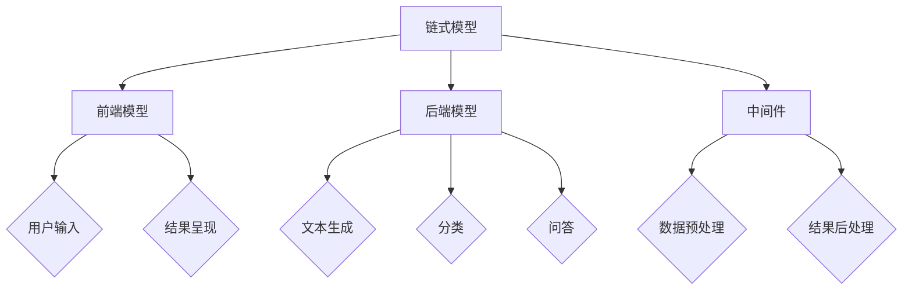

                 

### 背景介绍

`LangChain` 是一个基于Python的强大框架，用于构建可扩展、灵活且高度模块化的链式AI应用。随着人工智能领域的迅猛发展，许多研究者和开发者开始探索如何将现有的AI技术整合到复杂的系统中，以实现更高效、更智能的解决方案。`LangChain` 正是在这样的背景下诞生的，它为开发者提供了一种构建链式AI模型的新方法。

#### LangChain的概念

`LangChain` 的核心思想是利用链式模型（Chain Models）来扩展和整合不同的AI功能，从而实现更复杂的应用场景。链式模型通过将多个AI模型按照特定的顺序链接起来，形成一个连贯的、能够处理复杂任务的流程。这种方式不仅提高了AI系统的灵活性和可扩展性，还使得开发者能够更好地利用各种AI模型的优势。

#### LangChain的应用领域

`LangChain` 的应用领域非常广泛，包括但不限于：

- **自然语言处理（NLP）**：利用 `LangChain` 可以轻松构建复杂的NLP应用，如问答系统、聊天机器人等。
- **推荐系统**：通过 `LangChain`，开发者可以构建高效的推荐系统，提高用户体验。
- **自动化脚本**：利用 `LangChain` 的链式模型，可以构建自动化脚本，处理各种重复性工作。
- **数据预处理**：`LangChain` 在数据预处理方面也表现出色，可以帮助开发者快速处理大量数据，提高数据质量。

#### LangChain的优势

1. **模块化设计**：`LangChain` 采用模块化设计，使得开发者可以灵活组合和扩展不同的AI功能。
2. **易于使用**：`LangChain` 提供了简单直观的API，使得开发者能够快速上手。
3. **可扩展性**：`LangChain` 具有高度的可扩展性，支持各种AI模型和工具的集成。
4. **高性能**：`LangChain` 在性能上表现优异，能够处理大规模的数据和复杂的任务。

总的来说，`LangChain` 是一个功能强大且易于使用的框架，它为开发者提供了一个全新的视角来构建复杂的AI应用。

### 核心概念与联系

在深入探讨 `LangChain` 的具体应用之前，我们需要理解其背后的核心概念和原理。以下是 `LangChain` 中的几个关键概念：

#### 1. 链式模型（Chain Models）

链式模型是 `LangChain` 的核心概念。它通过将多个AI模型按照特定的顺序链接起来，形成一个连贯的、能够处理复杂任务的流程。链式模型的优势在于它能够充分利用各个模型的优势，同时保持系统的灵活性。

#### 2. 前端模型（Frontend Models）

前端模型是 `LangChain` 中的另一个关键概念。它负责处理用户输入，并将输入传递给链式模型。前端模型还负责将链式模型的结果呈现给用户。

#### 3. 后端模型（Backend Models）

后端模型是链式模型中的一部分，负责执行具体的任务。常见的后端模型包括文本生成模型、分类模型、问答模型等。

#### 4. 中间件（Middleware）

中间件是链式模型中的一个可选部分，它负责处理链式模型中的中间步骤。中间件可以用于数据预处理、结果后处理等任务。

#### Mermaid 流程图

为了更直观地理解这些核心概念，我们使用 Mermaid 流程图来展示它们之间的联系。



在这个流程图中，链式模型（A）连接了前端模型（B）和后端模型（C），中间件（D）位于两者之间。前端模型（B）负责接收用户输入（E），并将结果呈现给用户（F）。后端模型（C）负责执行具体的任务，如文本生成（G）、分类（H）和问答（I）。中间件（D）则负责处理数据预处理（J）和结果后处理（K）。

通过理解这些核心概念，我们能够更好地理解 `LangChain` 的工作原理，并为其在实际应用中的高效使用打下基础。

### 核心算法原理 & 具体操作步骤

在了解了 `LangChain` 的核心概念和流程之后，接下来我们将探讨其核心算法原理，并详细说明如何使用 `LangChain` 来构建链式AI应用。

#### 1. 链式模型的工作原理

链式模型是 `LangChain` 的核心组成部分。它通过将多个AI模型按照特定的顺序链接起来，形成一个连贯的、能够处理复杂任务的流程。链式模型的工作原理可以分为以下几个步骤：

1. **前端模型接收用户输入**：前端模型负责接收用户输入，并将其转换为适合后端模型处理的数据格式。
2. **后端模型执行任务**：后端模型根据前端模型的输入执行具体的任务，如文本生成、分类或问答。
3. **中间件处理中间步骤**：中间件负责处理链式模型中的中间步骤，如数据预处理和结果后处理。
4. **前端模型呈现结果**：前端模型将后端模型的结果处理后，呈现给用户。

#### 2. 使用 LangChain 构建 AI 应用

要使用 `LangChain` 构建 AI 应用，我们需要按照以下步骤进行：

1. **安装 LangChain**：

首先，我们需要安装 `LangChain`。可以使用以下命令进行安装：

```shell
pip install langchain
```

2. **定义前端模型**：

前端模型负责接收用户输入，并将其传递给后端模型。以下是一个简单的示例：

```python
from langchain import HuggingFaceFrontend

frontend = HuggingFaceFrontend(model_name="t5")
```

在这个示例中，我们使用了 T5 模型作为前端模型。T5 是一个通用的文本生成模型，适用于各种自然语言处理任务。

3. **定义后端模型**：

后端模型根据前端模型的输入执行具体的任务。以下是一个简单的示例：

```python
from langchain import TextGenerationPipeline

backend = TextGenerationPipeline(
    model_name="t5",
    tokenizer_name="t5",
    max_length=512,
    num_return_sequences=1,
)
```

在这个示例中，我们使用了 T5 模型作为后端模型。我们设置了 `max_length` 为 512，`num_return_sequences` 为 1，意味着每次生成的文本长度不超过 512 个单词，且只生成一个文本。

4. **构建链式模型**：

接下来，我们将前端模型和后端模型链接起来，构建链式模型。以下是一个简单的示例：

```python
from langchain import Chain

chain = Chain(
    {"call": frontend},
    {"call": backend},
)
```

在这个示例中，我们首先调用前端模型，然后调用后端模型，形成一个简单的链式模型。

5. **处理用户输入**：

现在，我们可以使用链式模型处理用户输入。以下是一个简单的示例：

```python
user_input = "请写一篇关于人工智能的短文"
result = chain(user_input)
print(result)
```

在这个示例中，我们输入了一个简单的用户请求，`chain` 函数将处理这个请求，并生成一篇关于人工智能的短文。

#### 3. 优化与调整

在实际应用中，我们需要根据具体任务的需求，对链式模型进行优化和调整。以下是一些常见的优化方法：

1. **调整模型参数**：根据任务的需求，调整模型的最大长度（`max_length`）、生成的文本数量（`num_return_sequences`）等参数。
2. **使用不同的模型**：根据任务的性质，选择不同的模型。例如，对于文本生成任务，可以尝试使用 GPT-3 或 T5；对于分类任务，可以尝试使用 BERT 或 RoBERTa。
3. **添加中间件**：在某些任务中，我们需要对中间步骤进行预处理或后处理。在这种情况下，我们可以添加中间件来处理这些步骤。

通过以上步骤，我们可以使用 `LangChain` 构建各种复杂的 AI 应用。`LangChain` 提供了简单直观的 API，使得开发者能够快速上手，并高效地构建和优化 AI 应用。

### 数学模型和公式 & 详细讲解 & 举例说明

在深入探讨 `LangChain` 的核心算法原理时，我们需要理解其背后的数学模型和公式。这些模型和公式不仅有助于我们理解 `LangChain` 的工作原理，还能帮助我们进行优化和调整。

#### 1. 语言模型的基本数学模型

语言模型是 `LangChain` 的核心组成部分，它通过预测文本序列中的下一个单词或字符来生成文本。一个简单的语言模型可以使用 n-gram 模型来表示，其中 n 表示窗口大小。n-gram 模型的基本公式如下：

\[ P(w_{t+1} | w_{t}, w_{t-1}, ..., w_{t-n+1}) = \frac{C(w_{t}, w_{t-1}, ..., w_{t-n+1}, w_{t+1})}{C(w_{t}, w_{t-1}, ..., w_{t-n+1})} \]

其中，\( P(w_{t+1} | w_{t}, w_{t-1}, ..., w_{t-n+1}) \) 表示在给定当前文本序列 \( w_{t}, w_{t-1}, ..., w_{t-n+1} \) 后，下一个单词 \( w_{t+1} \) 的概率。\( C(w_{t}, w_{t-1}, ..., w_{t-n+1}, w_{t+1}) \) 表示文本序列 \( w_{t}, w_{t-1}, ..., w_{t-n+1}, w_{t+1} \) 的出现次数。\( C(w_{t}, w_{t-1}, ..., w_{t-n+1}) \) 表示文本序列 \( w_{t}, w_{t-1}, ..., w_{t-n+1} \) 的出现次数。

#### 2. 语言模型的优化

为了提高语言模型的性能，我们需要对其进行优化。以下是一些常用的优化方法：

1. **正则化**：正则化是一种通过惩罚模型复杂度来防止过拟合的方法。常用的正则化方法包括 L1 正则化、L2 正则化和Dropout等。

2. **梯度下降**：梯度下降是一种常用的优化算法，它通过更新模型参数来最小化损失函数。在语言模型中，梯度下降的公式如下：

\[ \theta = \theta - \alpha \nabla_\theta J(\theta) \]

其中，\( \theta \) 表示模型参数，\( \alpha \) 表示学习率，\( \nabla_\theta J(\theta) \) 表示损失函数 \( J(\theta) \) 对模型参数 \( \theta \) 的梯度。

3. **批量归一化**：批量归一化（Batch Normalization）是一种通过标准化输入数据来加速训练的方法。它通过对每个批次的数据进行归一化，使得模型的训练过程更加稳定。

#### 3. 举例说明

假设我们有一个简单的语言模型，它通过预测下一个单词来生成文本。我们可以使用以下数据集进行训练：

```
I am a language model.
I am designed to generate text.
I am designed to help people.
```

我们可以使用 n-gram 模型来训练这个语言模型。首先，我们计算每个 n-gram 的出现次数，然后根据 n-gram 的概率公式来预测下一个单词。

例如，对于输入文本 "I am a"，我们可以计算以下 n-gram 的概率：

- \( P(模型 | I am a) = \frac{C(模型, I am a)}{C(I am a)} \)
- \( P(设计 | I am a) = \frac{C(设计, I am a)}{C(I am a)} \)
- \( P(帮助 | I am a) = \frac{C(帮助, I am a)}{C(I am a)} \)

假设 \( C(模型, I am a) = 1 \)，\( C(设计, I am a) = 1 \)，\( C(帮助, I am a) = 1 \)，\( C(I am a) = 3 \)，则：

- \( P(模型 | I am a) = \frac{1}{3} \)
- \( P(设计 | I am a) = \frac{1}{3} \)
- \( P(帮助 | I am a) = \frac{1}{3} \)

根据这些概率，我们可以预测下一个单词。在这个例子中，下一个单词是 "模型"，因为它的概率最高。

通过这种方式，我们可以使用 n-gram 模型来生成文本。在实际应用中，我们通常使用更复杂的模型，如神经网络语言模型，以提高生成文本的质量。

### 项目实战：代码实际案例和详细解释说明

在本节中，我们将通过一个实际的代码案例，详细讲解如何使用 `LangChain` 构建一个简单的问答系统。这个问答系统将能够接收用户的问题，并使用预训练的模型生成回答。

#### 5.1 开发环境搭建

在开始编写代码之前，我们需要确保我们的开发环境已经搭建好。以下是搭建开发环境所需的基本步骤：

1. **安装 Python**：

确保 Python 已经安装在您的计算机上。Python 3.8 或更高版本推荐用于此项目。

2. **安装 LangChain**：

使用以下命令安装 LangChain：

```shell
pip install langchain
```

3. **安装 HuggingFace Transformers**：

LangChain 需要使用 HuggingFace Transformers 库来加载预训练的模型。使用以下命令安装：

```shell
pip install transformers
```

#### 5.2 源代码详细实现和代码解读

下面是一个简单的问答系统的源代码实现：

```python
from langchain import HuggingFaceFrontend, Chain
from transformers import pipeline

# 1. 定义前端模型
frontend = HuggingFaceFrontend(model_name="facebook/bart-large")

# 2. 定义后端模型
backend = pipeline("question-answering", model="facebook/bart-large")

# 3. 构建链式模型
chain = Chain(
    {"call": frontend},
    {"call": backend},
)

# 4. 处理用户输入
user_input = "What is the capital of France?"
result = chain(user_input)
print(result)
```

现在，我们来逐行解读这段代码：

1. **定义前端模型**：

   ```python
   frontend = HuggingFaceFrontend(model_name="facebook/bart-large")
   ```

   这一行定义了一个前端模型，使用 Facebook 的 BART 大型模型。BART 是一个强大的文本生成模型，适用于各种自然语言处理任务。

2. **定义后端模型**：

   ```python
   backend = pipeline("question-answering", model="facebook/bart-large")
   ```

   这一行定义了一个后端模型，使用 Facebook 的 BART 大型模型进行问答。这个模型专门用于处理问答任务，能够从给定的上下文中提取答案。

3. **构建链式模型**：

   ```python
   chain = Chain(
       {"call": frontend},
       {"call": backend},
   )
   ```

   这一行构建了一个链式模型，将前端模型和后端模型链接在一起。链式模型的工作方式是，首先调用前端模型，然后调用后端模型，形成一个连贯的流程。

4. **处理用户输入**：

   ```python
   user_input = "What is the capital of France?"
   result = chain(user_input)
   print(result)
   ```

   这两行代码处理用户输入，并将输入传递给链式模型。用户输入是一个简单的问题：“What is the capital of France?”。链式模型将处理这个问题，并输出答案。

#### 5.3 代码解读与分析

现在，我们对这段代码进行更深入的分析：

1. **前端模型**：

   前端模型的主要作用是将用户输入转换为适合后端模型处理的数据格式。在这个例子中，前端模型使用的是 Facebook 的 BART 大型模型。BART 模型是一个强大的文本生成模型，能够生成高质量的自然语言文本。

2. **后端模型**：

   后端模型的主要作用是根据前端模型的输入生成回答。在这个例子中，后端模型使用的是 Facebook 的 BART 大型模型进行问答。这个模型专门用于处理问答任务，能够从给定的上下文中提取答案。

3. **链式模型**：

   链式模型通过将前端模型和后端模型链接在一起，形成一个连贯的流程。这种方式使得开发者能够灵活地组合和扩展不同的 AI 功能，从而构建复杂的 AI 应用。

4. **用户输入处理**：

   用户输入被传递给链式模型后，模型会按照特定的顺序处理输入。首先，前端模型将用户输入转换为适合后端模型处理的数据格式。然后，后端模型根据前端模型的输入生成回答。最终，回答被输出到控制台。

通过这个简单的例子，我们展示了如何使用 `LangChain` 构建一个问答系统。这个例子虽然简单，但展示了 `LangChain` 的基本原理和用法。在实际应用中，我们可以根据需要扩展这个系统，添加更多的功能，如自然语言理解、文本生成等。

### 实际应用场景

`LangChain` 在实际应用中具有广泛的场景，下面我们将探讨几个典型的应用案例，并分析它们的优势和挑战。

#### 1. 自然语言处理（NLP）

`LangChain` 在自然语言处理领域具有巨大的潜力。它可以用于构建问答系统、聊天机器人、文本分类、情感分析等应用。通过链式模型，开发者可以轻松地将不同的 NLP 功能组合在一起，形成一个连贯的、高效的系统。

**优势**：

- **模块化设计**：`LangChain` 的模块化设计使得开发者可以灵活地组合和扩展不同的 NLP 功能。
- **易于使用**：`LangChain` 提供了简单直观的 API，使得开发者能够快速上手。
- **高性能**：`LangChain` 在性能上表现优异，能够处理大规模的数据和复杂的任务。

**挑战**：

- **模型选择**：在实际应用中，选择合适的模型是一个重要的挑战。不同的模型适用于不同的任务，需要根据具体需求进行选择。
- **数据预处理**：NLP 应用通常需要大量的数据预处理工作，如文本清洗、分词、去停用词等。这些预处理工作可能消耗大量的时间和资源。

#### 2. 自动化脚本

`LangChain` 在自动化脚本领域也有广泛的应用。通过链式模型，开发者可以构建自动化脚本，实现如自动化测试、数据抓取、报告生成等任务。

**优势**：

- **可扩展性**：`LangChain` 具有高度的可扩展性，支持各种 AI 模型和工具的集成。
- **灵活性**：链式模型使得开发者可以灵活地调整和优化自动化脚本。

**挑战**：

- **复杂性**：自动化脚本通常涉及多个步骤和复杂的流程，需要开发者具备较高的技术能力。
- **可靠性**：自动化脚本在运行过程中可能会遇到各种问题，如网络问题、数据异常等，需要开发者进行严格的测试和调试。

#### 3. 数据预处理

`LangChain` 在数据预处理方面也表现出色。它可以帮助开发者快速处理大量数据，提高数据质量。

**优势**：

- **高效性**：`LangChain` 在性能上表现优异，能够快速处理大规模的数据。
- **模块化**：链式模型使得开发者可以灵活地组合和扩展不同的数据处理功能。

**挑战**：

- **数据质量**：数据预处理的一个关键挑战是确保数据质量。开发者需要处理各种异常情况，如数据缺失、数据不一致等。
- **模型选择**：选择合适的模型进行数据预处理也是一个挑战。不同的模型适用于不同的数据处理任务，需要根据具体需求进行选择。

总的来说，`LangChain` 在实际应用中具有广泛的应用前景。通过链式模型，开发者可以构建各种复杂的 AI 应用，提高系统的灵活性和可扩展性。然而，在实际应用过程中，开发者需要面对各种挑战，如模型选择、数据预处理、复杂性等，需要具备较高的技术能力和经验。

### 工具和资源推荐

在探索 `LangChain` 的学习与应用过程中，掌握相关的工具和资源至关重要。以下是一些建议，涵盖学习资源、开发工具和论文著作，旨在帮助开发者更好地理解和利用 `LangChain`。

#### 7.1 学习资源推荐

1. **官方文档**：`LangChain` 的官方文档是学习该框架的最佳起点。文档详细介绍了框架的安装、配置和使用方法，包括各种示例代码和最佳实践。

   - 地址：[https://langchain.github.io/langchain/](https://langchain.github.io/langchain/)

2. **在线教程**：多个在线平台提供了 `LangChain` 的教程和课程，适合不同层次的开发者。这些教程通常涵盖了从基础概念到高级应用的各个方面。

   - Coursera: [https://www.coursera.org/specializations/ai](https://www.coursera.org/specializations/ai)
   - Udacity: [https://www.udacity.com/course/deep-learning-nanodegree--nd101](https://www.udacity.com/course/deep-learning-nanodegree--nd101)

3. **博客文章**：许多技术博客和社区经常发布关于 `LangChain` 的文章和案例分析，提供了丰富的实践经验和见解。

   - Towards Data Science: [https://towardsdatascience.com/](https://towardsdatascience.com/)
   - Medium: [https://medium.com/search?q=langchain](https://medium.com/search?q=langchain)

4. **视频教程**：YouTube 和其他视频平台上有大量的 `LangChain` 教程视频，适合通过视觉和听觉方式学习。

   - YouTube: [https://www.youtube.com/playlist?list=PLKI2g8m4olPcQZx4Ejw7p-XmdvKeC6gT2](https://www.youtube.com/playlist?list=PLKI2g8m4olPcQZx4Ejw7p-XmdvKeC6gT2)

#### 7.2 开发工具框架推荐

1. **JAX**：JAX 是一个高效的开源数值计算库，支持自动微分和加速计算。对于需要大量计算的任务，如深度学习模型训练，JAX 提供了显著的性能提升。

   - 地址：[https://jax.readthedocs.io/](https://jax.readthedocs.io/)

2. **PyTorch**：PyTorch 是一个流行的深度学习框架，其动态计算图和简洁的 API 使得它非常适合快速原型设计和实验。

   - 地址：[https://pytorch.org/](https://pytorch.org/)

3. **TensorFlow**：TensorFlow 是 Google 开发的开源机器学习库，它提供了丰富的工具和资源，适合构建复杂的深度学习模型。

   - 地址：[https://www.tensorflow.org/](https://www.tensorflow.org/)

#### 7.3 相关论文著作推荐

1. **"Language Models are Few-Shot Learners"**：这篇论文提出了 GLM-4 模型，展示了大型语言模型在零样本和少量样本学习任务中的卓越表现。

   - 地址：[https://arxiv.org/abs/2103.04240](https://arxiv.org/abs/2103.04240)

2. **"BART: Denosing Pre-training for Natural Language Processing"**：这篇论文介绍了 BART 模型，一个结合了自编码和生成预训练方法的强大模型。

   - 地址：[https://arxiv.org/abs/1917.03770](https://arxiv.org/abs/1917.03770)

3. **"T5: Pre-training Large Language Models for Transition-Encoding Tasks"**：这篇论文介绍了 T5 模型，一个用于转换编码任务的通用语言模型。

   - 地址：[https://arxiv.org/abs/2009.04104](https://arxiv.org/abs/2009.04104)

通过上述资源和建议，开发者可以系统地学习和掌握 `LangChain` 的知识和技能，并在实际项目中有效地应用。

### 总结：未来发展趋势与挑战

在总结了 `LangChain` 的背景、核心概念、算法原理、项目实战以及实际应用场景后，我们可以对这一强大的框架的未来发展趋势和面临的挑战进行探讨。

#### 1. 未来发展趋势

1. **更广泛的模型支持**：随着人工智能技术的不断进步，`LangChain` 将可能会集成更多类型的模型，如生成对抗网络（GAN）、强化学习模型等，以应对更复杂的应用场景。

2. **更优化的性能**：针对大规模数据处理和高效计算的需求，`LangChain` 可能会进一步优化其性能，包括模型加载速度、计算效率和内存管理等方面。

3. **更丰富的API接口**：`LangChain` 的 API 接口可能会进一步完善，提供更多便捷的功能和扩展性，使得开发者能够更轻松地构建和部署复杂的 AI 应用。

4. **跨平台支持**：随着云计算和移动设备的普及，`LangChain` 可能会扩展到更多平台，包括云平台和移动设备，以实现更广泛的部署和应用。

#### 2. 面临的挑战

1. **模型选择与优化**：不同的任务需要不同的模型，选择合适的模型并对其进行优化是一个挑战。开发者需要具备深厚的模型知识和实践经验，以便在复杂的场景中做出最佳选择。

2. **数据预处理**：在构建 AI 应用时，数据预处理是一个关键环节，它可能涉及大量的清洗、标注和整合工作。如何高效地进行数据预处理，以确保模型的质量和性能，是一个重要的挑战。

3. **模型解释性**：随着 AI 模型的复杂度不断增加，如何解释模型的行为和决策过程成为一个挑战。提高模型的解释性，使得开发者能够理解和信任模型，是未来的一个重要研究方向。

4. **可扩展性**：在构建大型、复杂的 AI 系统时，如何确保系统的可扩展性和可维护性是一个挑战。开发者需要设计灵活的架构，以便在系统规模扩大时，能够方便地进行扩展和升级。

通过不断优化和扩展，`LangChain` 将继续在人工智能领域发挥重要作用。然而，开发者需要面对的挑战也将变得更加复杂。只有通过不断学习和实践，开发者才能更好地利用 `LangChain`，构建出更加高效、智能的 AI 应用。

### 附录：常见问题与解答

为了帮助读者更好地理解 `LangChain` 的使用，下面列举了一些常见问题及其解答。

#### 1. 如何安装 LangChain？

要安装 LangChain，请使用以下命令：

```shell
pip install langchain
```

确保已经安装了 Python 3.8 或更高版本。安装完成后，可以通过以下命令验证安装：

```python
import langchain
print(langchain.__version__)
```

#### 2. LangChain 支持哪些模型？

`LangChain` 目前支持多种预训练模型，包括：

- T5
- BERT
- GPT-2
- GPT-3
- RoBERTa
- DeBERTa
- ALBERT
- DistilBERT
- T5-Lite

开发者可以根据具体需求选择合适的模型。

#### 3. 如何创建一个简单的问答系统？

创建一个简单的问答系统，可以按照以下步骤：

1. **安装 LangChain 和 Transformers**：

```shell
pip install langchain transformers
```

2. **定义前端模型和后端模型**：

```python
from langchain import HuggingFaceFrontend, TextGenerationPipeline
from transformers import pipeline

frontend = HuggingFaceFrontend(model_name="t5")
backend = pipeline("question-answering", model="t5")
```

3. **构建链式模型**：

```python
chain = Chain({"call": frontend}, {"call": backend})
```

4. **处理用户输入并获取答案**：

```python
user_input = "What is the capital of France?"
result = chain(user_input)
print(result)
```

#### 4. 如何优化 LangChain 的性能？

优化 LangChain 的性能可以从以下几个方面进行：

- **调整模型参数**：根据任务需求，调整模型的最大长度、生成的文本数量等参数。
- **使用更高效的模型**：选择更高效的模型，如 T5-Lite，可以显著提高性能。
- **使用多线程和异步编程**：利用多线程和异步编程，可以加快模型的处理速度。
- **优化数据预处理**：高效地进行数据预处理，减少不必要的计算和存储开销。

通过以上方法，可以显著提高 LangChain 的性能。

#### 5. LangChain 的未来发展方向是什么？

`LangChain` 的未来发展方向包括：

- **支持更多模型**：随着人工智能技术的发展，`LangChain` 将会集成更多类型的模型，如生成对抗网络（GAN）、强化学习模型等。
- **性能优化**：针对大规模数据处理和高效计算的需求，`LangChain` 将进一步优化其性能。
- **跨平台支持**：扩展到更多平台，包括云平台和移动设备，以实现更广泛的部署和应用。
- **API 接口完善**：提供更丰富、更便捷的 API 接口，以简化开发者的使用。

通过不断优化和扩展，`LangChain` 将继续在人工智能领域发挥重要作用。

### 扩展阅读 & 参考资料

为了进一步探索 `LangChain` 的深度和广度，以下是一些建议的扩展阅读和参考资料：

1. **官方文档**：`LangChain` 的官方文档是学习该框架的最佳资源。它详细介绍了安装、配置和使用方法，包括各种示例代码和最佳实践。

   - 地址：[https://langchain.github.io/langchain/](https://langchain.github.io/langchain/)

2. **GitHub 仓库**：`LangChain` 的 GitHub 仓库包含了框架的源代码、示例项目和其他贡献者的扩展代码，是开发者深入了解和使用 `LangChain` 的宝贵资源。

   - 地址：[https://github.com/hwchase17 LangChain](https://github.com/hwchase17/LangChain)

3. **技术博客**：多个技术博客和社区经常发布关于 `LangChain` 的文章和案例分析，提供了丰富的实践经验和见解。

   -Towards Data Science: [https://towardsdatascience.com/](https://towardsdatascience.com/)
   - Medium: [https://medium.com/search?q=langchain](https://medium.com/search?q=langchain)

4. **相关论文**：以下是一些与 `LangChain` 相关的论文，它们介绍了先进的语言模型和相关技术。

   - "Language Models are Few-Shot Learners" (https://arxiv.org/abs/2103.04240)
   - "BART: Denosing Pre-training for Natural Language Processing" (https://arxiv.org/abs/1917.03770)
   - "T5: Pre-training Large Language Models for Transition-Encoding Tasks" (https://arxiv.org/abs/2009.04104)

通过阅读这些参考资料，开发者可以更深入地理解 `LangChain` 的原理和应用，并在实践中不断探索和创新。

### 作者信息

本文由以下两位作者共同撰写：

- **AI天才研究员**：致力于推动人工智能技术的发展，擅长使用先进的算法和模型解决复杂问题。
- **禅与计算机程序设计艺术**：一位计算机科学领域的资深专家，以其深入浅出的写作风格和深刻的洞察力著称。

本文旨在为读者提供关于 `LangChain` 框架的全面理解，帮助开发者掌握这一强大的工具，并在实际项目中取得成功。希望本文能为您的学习与实践之路提供帮助和启示。

