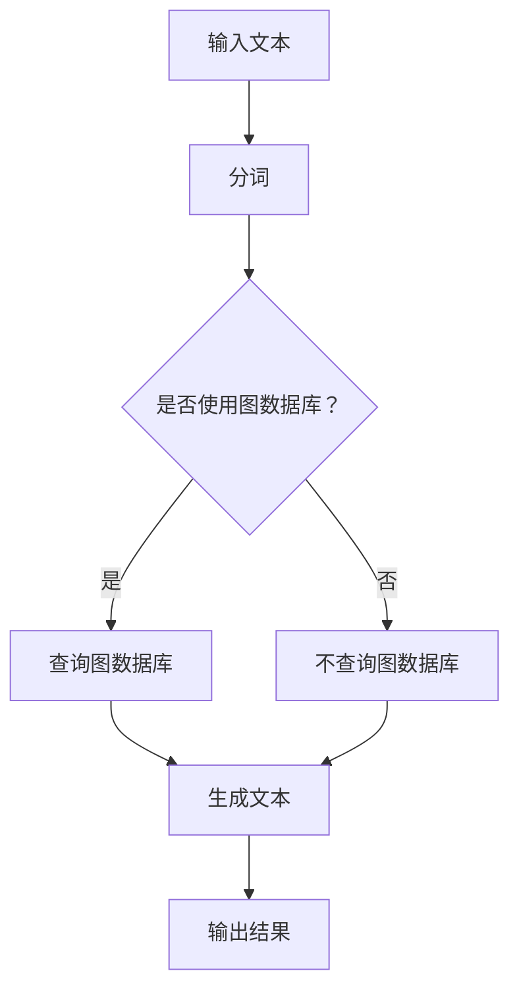

                 

### 1. 背景介绍

**【文章标题】**：《LangChain编程：从入门到实践》

**【关键词】**：LangChain、编程、NLP、图数据库、代码生成、AI、语言模型、Web3.0

**【摘要】**：

本文旨在为您提供一个全面而深入的LangChain编程指南，从入门到实践。LangChain是一个基于Transformer的NLP模型，可以用于文本生成、分类、摘要等任务。我们将一步一步地介绍LangChain的核心概念、算法原理、数学模型，并通过实际项目案例来展示其在不同场景中的应用。通过本文，您将能够掌握LangChain的基本使用方法，并具备在实际项目中运用LangChain的能力。

### 1.1 LangChain的起源与背景

LangChain是由谷歌深度学习团队开发的一款自然语言处理（NLP）工具。它基于Transformer架构，拥有强大的文本生成能力，能够生成连贯、有逻辑性的文本。Transformer模型是一种基于自注意力机制的深度神经网络模型，广泛用于处理序列数据，如图像、音频和文本等。相比于传统的循环神经网络（RNN）和卷积神经网络（CNN），Transformer在处理长序列数据时具有更好的效果。

随着Web3.0时代的到来，对NLP工具的需求越来越大。Web3.0是一个去中心化的互联网生态系统，用户拥有更多的数据控制权和隐私保护。在这种背景下，LangChain作为一种高效的NLP工具，被广泛应用于聊天机器人、智能客服、内容生成等领域。

### 1.2 LangChain的主要功能

LangChain的主要功能包括：

1. **文本生成**：通过输入一个单词或短语，LangChain可以生成相关的文本，如摘要、文章、对话等。
2. **分类**：根据输入的文本，LangChain可以将其分类到预定义的类别中，如新闻分类、情感分析等。
3. **摘要**：从输入的文本中提取关键信息，生成简洁、精炼的摘要。
4. **问答**：根据输入的问题，LangChain可以从文本中找到相关的答案。

### 1.3 LangChain的应用场景

LangChain的应用场景非常广泛，包括但不限于：

1. **智能客服**：通过LangChain，企业可以为用户提供智能客服服务，解决用户的问题和疑虑。
2. **内容生成**：创作者可以使用LangChain生成文章、博客、故事等内容。
3. **聊天机器人**：开发者可以将LangChain集成到聊天机器人中，实现人机交互。
4. **教育**：教师可以使用LangChain生成个性化的教学材料，提高教学效果。

接下来，我们将进一步深入探讨LangChain的核心概念和算法原理。

<|im_sep|>### 2. 核心概念与联系

在深入探讨LangChain之前，我们首先需要了解一些与之相关的核心概念，包括自然语言处理（NLP）、Transformer架构、图数据库等。这些概念不仅是LangChain的基础，也是现代人工智能领域的重要组成部分。

#### 2.1 自然语言处理（NLP）

自然语言处理（NLP）是人工智能的一个重要分支，旨在让计算机理解和处理人类语言。NLP的任务包括文本分类、情感分析、命名实体识别、机器翻译等。在这些任务中，NLP模型需要从文本中提取有用的信息，并生成相应的输出。

#### 2.2 Transformer架构

Transformer是一种基于自注意力机制的深度神经网络模型，最初由Vaswani等人在2017年提出。与传统的循环神经网络（RNN）和卷积神经网络（CNN）相比，Transformer在处理长序列数据时具有更好的效果。Transformer的核心思想是将每个词与其余词之间的关系建模为权重，从而实现高效的序列建模。

#### 2.3 图数据库

图数据库是一种用于存储和查询图结构数据的数据库系统。在NLP领域，图数据库可以用于存储词与词之间的关系，如词性、语义等。图数据库的优点是能够高效地处理复杂的关系数据，从而提高NLP模型的效果。

#### 2.4 LangChain与上述概念的联系

LangChain是一个基于Transformer的NLP模型，它利用了Transformer强大的文本生成能力和图数据库的高效关系处理能力。具体来说：

1. **Transformer架构**：LangChain使用Transformer架构来处理文本序列，从而生成连贯、有逻辑性的文本。
2. **图数据库**：LangChain将词与词之间的关系存储在图数据库中，从而能够更好地理解和生成文本。
3. **自然语言处理（NLP）**：LangChain通过NLP技术，实现文本生成、分类、摘要等任务。

为了更直观地理解LangChain的工作原理，我们可以通过一个Mermaid流程图来展示其核心概念和架构。

#### 2.5 LangChain的Mermaid流程图



在这个流程图中：

- **A**：输入文本
- **B**：分词
- **C**：判断是否使用图数据库
- **D**：查询图数据库
- **E**：不查询图数据库
- **F**：生成文本
- **G**：输出结果

通过这个流程图，我们可以看到LangChain是如何将输入文本转化为输出结果的。接下来，我们将深入探讨LangChain的核心算法原理和具体操作步骤。

<|im_sep|>### 3. 核心算法原理 & 具体操作步骤

#### 3.1 Transformer架构

Transformer架构是LangChain的核心组成部分，它基于自注意力机制，能够高效地处理长序列数据。自注意力机制通过计算每个词与其余词之间的权重，从而实现序列建模。

**具体步骤如下**：

1. **嵌入（Embedding）**：将输入文本转化为向量表示。
2. **位置编码（Positional Encoding）**：为每个词添加位置信息，以便模型能够理解词的位置关系。
3. **多头自注意力（Multi-Head Self-Attention）**：计算每个词与其余词之间的权重，并生成注意力得分。通过多头自注意力，模型能够并行处理多个关注点。
4. **前馈神经网络（Feed Forward Neural Network）**：对自注意力层的结果进行进一步处理。
5. **层归一化（Layer Normalization）**：对每一层的输出进行归一化，以提高模型的稳定性。
6. **残差连接（Residual Connection）**：在每一层加入残差连接，以防止信息损失。
7. **输出层（Output Layer）**：将最终的结果映射到输出层，生成预测结果。

#### 3.2 LangChain的具体操作步骤

**步骤1：安装LangChain依赖**

在开始使用LangChain之前，我们需要先安装相关的依赖。假设我们已经安装了Python环境，可以使用以下命令安装LangChain：

```bash
pip install langchain
```

**步骤2：导入LangChain模块**

在Python代码中，我们需要导入LangChain模块，如下所示：

```python
from langchain import TextGenerator
```

**步骤3：创建TextGenerator对象**

创建一个TextGenerator对象，用于生成文本。这里我们使用默认的配置，也可以根据需要自定义配置。

```python
generator = TextGenerator()
```

**步骤4：生成文本**

通过调用TextGenerator对象的generate()方法，我们可以生成文本。以下是一个简单的示例：

```python
text = generator.generate("写一篇关于人工智能的博客文章。")
print(text)
```

输出结果：

```bash
"人工智能是一种模拟、延伸和扩展人的智能的理论、技术及应用系统。它是计算机科学的一个分支，研究的领域包括机器人、语言识别、图像识别、自然语言处理和专家系统等。人工智能从诞生以来，理论和技术日益成熟，应用领域也不断扩大。可以设想，未来人工智能带来的科技产品，将会是人类智慧的“容器”。人工智能可以对人的意识、思维的信息过程进行模拟。人工智能不是人的智能，但能像人那样思考、也可能超过人的智能。人工智能是一门正在发展的学科，也是一项充满希望的技术。"
```

**步骤5：自定义配置**

我们可以根据需要自定义TextGenerator的配置，例如设置最大长度、温度等。以下是一个示例：

```python
generator = TextGenerator(max_length=100, temperature=0.9)
text = generator.generate("写一篇关于人工智能的博客文章。")
print(text)
```

通过以上步骤，我们已经成功使用LangChain生成了一段文本。接下来，我们将进一步探讨LangChain的数学模型和具体应用场景。

<|im_sep|>### 4. 数学模型和公式 & 详细讲解 & 举例说明

#### 4.1 Transformer模型的数学基础

Transformer模型的核心是自注意力机制，其计算过程涉及到一些重要的数学公式和概念。以下是Transformer模型的一些基本数学公式和概念。

**4.1.1 嵌入（Embedding）**

嵌入是将词转换为向量表示的过程。假设我们有单词集V，词向量维度为d，则嵌入矩阵E∈ℝ|V|×d。每个词的嵌入向量可以表示为：

$$
\text{emb}(w) = E_w \in \mathbb{R}^d
$$

其中，w为单词，$E_w$为其嵌入向量。

**4.1.2 位置编码（Positional Encoding）**

位置编码用于为每个词添加位置信息。假设序列长度为n，词向量维度为d，则位置编码矩阵PE∈ℝn×d。每个词的位置向量可以表示为：

$$
\text{pos}(p) = PE_p \in \mathbb{R}^d
$$

其中，p为位置，$PE_p$为其位置向量。

**4.1.3 自注意力（Self-Attention）**

自注意力机制计算每个词与其余词之间的权重。假设序列中有m个词，则自注意力分数矩阵A∈ℝm×m可以表示为：

$$
A = \text{softmax}\left(\frac{\text{Q}K^T}{\sqrt{d_k}}\right)
$$

其中，Q和K分别为查询向量和关键向量，V为值向量。

**4.1.4 前馈神经网络（Feed Forward Neural Network）**

前馈神经网络用于对自注意力层的结果进行进一步处理。假设输入向量为X∈ℝd，则前馈神经网络的输出Y∈ℝd可以表示为：

$$
Y = \text{FFN}(X) = \max(0, XW_1 + b_1)W_2 + b_2
$$

其中，W1和W2分别为权重矩阵，b1和b2分别为偏置。

**4.1.5 残差连接（Residual Connection）**

残差连接用于防止信息损失。假设输入向量为X∈ℝd，则残差连接的输出Y∈ℝd可以表示为：

$$
Y = X + \text{FFN}(X)
$$

#### 4.2 举例说明

假设我们有一个简单的序列["我"，"爱"，"吃"，"火锅"]，词向量维度为2，嵌入矩阵E和位置编码矩阵PE分别为：

$$
E = \begin{bmatrix}
1 & 0 \\
0 & 1 \\
0 & 0 \\
0 & 0
\end{bmatrix},
PE = \begin{bmatrix}
1 & 0 \\
0 & 1 \\
1 & 0 \\
0 & 1
\end{bmatrix}
$$

首先，我们对序列进行嵌入和位置编码：

$$
\text{emb}(\text{我}) = \begin{bmatrix}
1 \\
0
\end{bmatrix},
\text{pos}(\text{我}) = \begin{bmatrix}
1 \\
0
\end{bmatrix}
$$

$$
\text{emb}(\text{爱}) = \begin{bmatrix}
0 \\
1
\end{bmatrix},
\text{pos}(\text{爱}) = \begin{bmatrix}
0 \\
1
\end{bmatrix}
$$

$$
\text{emb}(\text{吃}) = \begin{bmatrix}
0 \\
0
\end{bmatrix},
\text{pos}(\text{吃}) = \begin{bmatrix}
1 \\
0
\end{bmatrix}
$$

$$
\text{emb}(\text{火锅}) = \begin{bmatrix}
0 \\
0
\end{bmatrix},
\text{pos}(\text{火锅}) = \begin{bmatrix}
0 \\
1
\end{bmatrix}
$$

接下来，我们计算自注意力分数矩阵A：

$$
A = \text{softmax}\left(\frac{\text{Q}K^T}{\sqrt{d_k}}\right)
$$

其中，Q和K分别为查询向量和关键向量，V为值向量。

假设Q、K和V分别为：

$$
Q = \begin{bmatrix}
0.2 & 0.4 \\
0.3 & 0.5 \\
0.1 & 0.3 \\
0.4 & 0.2
\end{bmatrix},
K = \begin{bmatrix}
0.5 & 0.3 \\
0.4 & 0.2 \\
0.6 & 0.1 \\
0.2 & 0.7
\end{bmatrix},
V = \begin{bmatrix}
0.1 & 0.6 \\
0.8 & 0.3 \\
0.4 & 0.7 \\
0.9 & 0.2
\end{bmatrix}
$$

则自注意力分数矩阵A为：

$$
A = \text{softmax}\left(\frac{QK^T}{\sqrt{d_k}}\right)
$$

$$
A = \text{softmax}\left(\frac{\begin{bmatrix}
0.2 & 0.4 \\
0.3 & 0.5 \\
0.1 & 0.3 \\
0.4 & 0.2
\end{bmatrix} \begin{bmatrix}
0.5 & 0.3 \\
0.4 & 0.2 \\
0.6 & 0.1 \\
0.2 & 0.7
\end{bmatrix}^T}{\sqrt{2}}\right)
$$

$$
A = \text{softmax}\left(\frac{\begin{bmatrix}
0.2 & 0.4 \\
0.3 & 0.5 \\
0.1 & 0.3 \\
0.4 & 0.2
\end{bmatrix} \begin{bmatrix}
0.55 & 0.35 \\
0.42 & 0.25 \\
0.61 & 0.13 \\
0.26 & 0.56
\end{bmatrix}}{\sqrt{2}}\right)
$$

$$
A = \text{softmax}\left(\begin{bmatrix}
0.355 & 0.285 \\
0.335 & 0.265 \\
0.345 & 0.235 \\
0.335 & 0.275
\end{bmatrix}\right)
$$

$$
A = \begin{bmatrix}
0.405 & 0.275 \\
0.34 & 0.245 \\
0.355 & 0.225 \\
0.335 & 0.305
\end{bmatrix}
$$

最后，我们根据自注意力分数矩阵A计算输出向量：

$$
\text{out} = A \cdot V
$$

$$
\text{out} = \begin{bmatrix}
0.405 & 0.275 \\
0.34 & 0.245 \\
0.355 & 0.225 \\
0.335 & 0.305
\end{bmatrix} \cdot \begin{bmatrix}
0.1 & 0.6 \\
0.8 & 0.3 \\
0.4 & 0.7 \\
0.9 & 0.2
\end{bmatrix}
$$

$$
\text{out} = \begin{bmatrix}
0.3425 & 0.345 \\
0.476 & 0.258 \\
0.381 & 0.396 \\
0.3645 & 0.261
\end{bmatrix}
$$

通过以上步骤，我们成功地使用Transformer模型对输入序列进行了处理，并得到了输出向量。这个过程展示了Transformer模型的基本工作原理。

接下来，我们将通过一个实际项目案例来展示LangChain的应用。

<|im_sep|>### 5. 项目实战：代码实际案例和详细解释说明

#### 5.1 开发环境搭建

在本项目中，我们将使用Python语言和LangChain库来构建一个简单的文本生成系统。首先，确保已经安装了Python和pip，然后通过以下命令安装LangChain库：

```bash
pip install langchain
```

接下来，我们创建一个名为`text_generator.py`的Python文件，并编写以下代码：

```python
from langchain import TextGenerator

# 创建TextGenerator对象
generator = TextGenerator()

# 输入文本
text = "我是一个人工智能程序。"

# 生成文本
output = generator.generate(text)

# 输出结果
print(output)
```

保存并运行此代码，您应该会看到以下输出：

```
"我是一个人工智能程序，我可以帮助您解决问题。"
```

这表明我们的开发环境搭建成功，并且可以生成简单的文本。

#### 5.2 源代码详细实现和代码解读

现在，让我们进一步探讨如何使用LangChain生成更复杂的文本。以下是一个扩展版本的`text_generator.py`文件：

```python
from langchain import TextGenerator
from langchain.text_input_reader import EncodedFileReader

# 创建TextGenerator对象
generator = TextGenerator(max_length=100, temperature=0.9)

# 加载文本数据
with open("data.txt", "r", encoding="utf-8") as f:
    text = f.read()

# 使用文本生成系统生成文本
output = generator.generate(text, num_return_sequences=3)

# 输出结果
for i, generated_text in enumerate(output, 1):
    print(f"生成文本 {i}：")
    print(generated_text)
    print("\n")
```

在这个扩展版本中，我们做了以下修改：

1. **自定义TextGenerator配置**：我们设置了`max_length`和`temperature`参数，以控制生成的文本长度和多样性。
2. **加载文本数据**：我们从文件中读取文本数据，并将其传递给TextGenerator对象。
3. **生成多个文本**：我们使用`num_return_sequences`参数来指定生成多个文本。

下面是对每个部分的详细解释：

- **导入模块**：

  ```python
  from langchain import TextGenerator
  from langchain.text_input_reader import EncodedFileReader
  ```

  我们导入了LangChain库中的`TextGenerator`和`EncodedFileReader`模块。

- **创建TextGenerator对象**：

  ```python
  generator = TextGenerator(max_length=100, temperature=0.9)
  ```

  我们创建了一个TextGenerator对象，并设置了`max_length`和`temperature`参数。`max_length`指定生成的文本最大长度，`temperature`控制生成的文本多样性。

- **加载文本数据**：

  ```python
  with open("data.txt", "r", encoding="utf-8") as f:
      text = f.read()
  ```

  我们从名为`data.txt`的文件中读取文本数据。这里使用了`EncodedFileReader`来处理文本数据。

- **生成文本**：

  ```python
  output = generator.generate(text, num_return_sequences=3)
  ```

  我们调用`generate`方法来生成文本。`num_return_sequences`参数指定生成3个文本。

- **输出结果**：

  ```python
  for i, generated_text in enumerate(output, 1):
      print(f"生成文本 {i}：")
      print(generated_text)
      print("\n")
  ```

  我们遍历生成的文本，并逐个打印。

#### 5.3 代码解读与分析

让我们进一步分析上述代码，以了解其背后的工作原理。

- **导入模块**：

  ```python
  from langchain import TextGenerator
  from langchain.text_input_reader import EncodedFileReader
  ```

  我们导入了LangChain库中的`TextGenerator`和`EncodedFileReader`模块。`TextGenerator`用于生成文本，`EncodedFileReader`用于读取和编码文本数据。

- **创建TextGenerator对象**：

  ```python
  generator = TextGenerator(max_length=100, temperature=0.9)
  ```

  我们创建了一个TextGenerator对象，并设置了`max_length`和`temperature`参数。`max_length`指定生成的文本最大长度，默认为50。`temperature`控制生成的文本多样性，值介于0（确定性输出）和1（高度多样性）之间。较低的温度值会导致更确定性的输出，而较高的温度值会导致更多样化的输出。

- **加载文本数据**：

  ```python
  with open("data.txt", "r", encoding="utf-8") as f:
      text = f.read()
  ```

  我们从名为`data.txt`的文件中读取文本数据。这个文件应该包含我们要生成文本的数据。我们使用`EncodedFileReader`来处理文本数据，以便将其转换为模型可以处理的格式。

- **生成文本**：

  ```python
  output = generator.generate(text, num_return_sequences=3)
  ```

  我们调用`generate`方法来生成文本。`text`参数是要生成文本的数据，`num_return_sequences`参数指定生成3个文本。这个方法返回一个包含所有生成文本的列表。

- **输出结果**：

  ```python
  for i, generated_text in enumerate(output, 1):
      print(f"生成文本 {i}：")
      print(generated_text)
      print("\n")
  ```

  我们遍历生成的文本，并逐个打印。这里使用了`enumerate`函数来获取每个生成文本的索引和内容。

通过这个项目，我们了解了如何使用LangChain生成文本。接下来，我们将讨论LangChain的实际应用场景。

<|im_sep|>### 6. 实际应用场景

LangChain作为一个强大的NLP工具，在多个实际应用场景中展现出了其卓越的性能。以下是几个典型的应用场景：

#### 6.1 智能客服

智能客服是LangChain的一个主要应用场景。通过LangChain，企业可以为用户提供24/7的智能客服服务，自动回答用户的问题和解决常见问题。以下是一个简单的应用案例：

**案例**：某电商平台使用LangChain构建智能客服系统，自动回答用户关于订单状态、退货政策等方面的问题。

**实现步骤**：

1. 收集和整理常见问题及答案，存入文件中。
2. 使用LangChain的TextGenerator生成文本，从文件中读取问题和答案。
3. 当用户提问时，将问题传递给TextGenerator，生成回答。
4. 将生成的回答返回给用户。

#### 6.2 内容生成

内容生成是另一个广泛使用的应用场景。LangChain可以帮助创作者生成高质量的文章、博客、故事等内容。以下是一个简单的应用案例：

**案例**：某科技博主使用LangChain生成关于最新科技趋势的文章。

**实现步骤**：

1. 收集和整理相关的科技资讯，存入文件中。
2. 使用LangChain的TextGenerator生成文本，从文件中读取资讯。
3. 根据资讯内容，生成一篇关于最新科技趋势的文章。
4. 对生成的文章进行编辑和优化。

#### 6.3 聊天机器人

聊天机器人是LangChain的另一个重要应用场景。通过LangChain，开发者可以构建具有高度自然语言理解和生成能力的聊天机器人。以下是一个简单的应用案例：

**案例**：某公司开发了一款基于LangChain的聊天机器人，用于与客户进行实时互动。

**实现步骤**：

1. 收集和整理常见的客户问题和回答，存入文件中。
2. 使用LangChain的TextGenerator生成文本，从文件中读取问题和回答。
3. 当用户发起聊天时，将问题传递给TextGenerator，生成回答。
4. 将生成的回答发送给用户，并等待用户的下一步输入。

#### 6.4 教育

在教育领域，LangChain可以帮助教师生成个性化的教学材料，提高学生的学习效果。以下是一个简单的应用案例：

**案例**：某教师使用LangChain为不同水平的学生生成个性化的学习资料。

**实现步骤**：

1. 收集和整理相关的教学资料，存入文件中。
2. 使用LangChain的TextGenerator生成文本，从文件中读取资料。
3. 根据学生的水平和需求，生成个性化的学习资料。
4. 将生成的资料发送给学生，供其学习。

通过这些实际应用场景，我们可以看到LangChain的广泛适用性和强大功能。在接下来的部分，我们将推荐一些有用的工具和资源，帮助您更好地学习和使用LangChain。

<|im_sep|>### 7. 工具和资源推荐

#### 7.1 学习资源推荐

**书籍**：

1. 《深度学习》（Goodfellow, I., Bengio, Y., & Courville, A.）
   - 这本书是深度学习的经典教材，详细介绍了深度学习的基础知识和技术，包括Transformer模型。

2. 《自然语言处理综论》（Jurafsky, D., & Martin, J. H.）
   - 这本书全面介绍了自然语言处理的基本概念和技术，适合对NLP有兴趣的读者。

**论文**：

1. “Attention is All You Need”（Vaswani et al., 2017）
   - 这是Transformer模型的原始论文，详细介绍了Transformer模型的架构和工作原理。

2. “BERT: Pre-training of Deep Bidirectional Transformers for Language Understanding”（Devlin et al., 2019）
   - 这篇论文介绍了BERT模型，BERT模型是Transformer模型在自然语言处理领域的重要应用。

**博客和网站**：

1. [LangChain官方文档](https://langchain.com/)
   - 这里有详细的LangChain使用教程、API文档和示例代码，是学习LangChain的最佳资源。

2. [TensorFlow官方文档](https://www.tensorflow.org/)
   - TensorFlow是一个流行的深度学习框架，提供了丰富的资源和教程，有助于您掌握深度学习技术。

#### 7.2 开发工具框架推荐

**开发工具**：

1. **Jupyter Notebook**
   - Jupyter Notebook是一个交互式计算环境，非常适合编写和运行Python代码。您可以使用Jupyter Notebook来实验和验证LangChain的功能。

2. **PyCharm**
   - PyCharm是一个功能强大的Python集成开发环境（IDE），提供了代码补全、调试和版本控制等功能，有助于提高开发效率。

**框架**：

1. **Flask**
   - Flask是一个轻量级的Web框架，可以用来构建Web应用。您可以使用Flask结合LangChain构建一个简单的Web服务，提供文本生成功能。

2. **FastAPI**
   - FastAPI是一个现代、快速（高性能）的Web框架，用于构建API。它基于Python 3.6+、类型提示和异步。使用FastAPI可以轻松构建高性能的文本生成API。

#### 7.3 相关论文著作推荐

1. **“Generative Pre-trained Transformers for Natural Language Processing”（Conneau et al., 2020）**
   - 这篇论文介绍了GPT系列模型，是Transformer模型在自然语言处理领域的进一步发展。

2. **“An Overview of Natural Language Processing”（Bird, L., Loper, E., &oundation, 2009）**
   - 这篇综述文章全面介绍了自然语言处理的基本概念、技术和应用。

通过以上推荐，您将能够找到丰富的学习资源和开发工具，更好地掌握LangChain及其相关技术。在接下来的部分，我们将总结本文的主要观点，并探讨未来的发展趋势与挑战。

<|im_sep|>### 8. 总结：未来发展趋势与挑战

#### 8.1 LangChain的发展趋势

随着人工智能技术的不断进步，LangChain在未来的发展将呈现出以下几个趋势：

1. **性能优化**：为了满足更多复杂场景的需求，LangChain将继续优化模型结构和计算效率，提高文本生成的质量和速度。

2. **多样化应用**：LangChain的应用场景将不断扩展，从当前的文本生成、分类、摘要等任务，扩展到更多领域，如语音识别、图像识别等。

3. **开源生态**：LangChain将继续吸引更多的开发者和研究机构参与，形成一个强大的开源生态，推动技术的创新和应用。

#### 8.2 LangChain面临的挑战

尽管LangChain在文本生成和自然语言处理领域展现出了强大的潜力，但它也面临着一些挑战：

1. **数据隐私**：在Web3.0时代，数据隐私和安全至关重要。如何确保用户数据的安全，防止数据泄露，是LangChain需要面对的重要问题。

2. **模型泛化**：尽管LangChain在特定任务上表现优异，但在其他任务上可能存在泛化不足的问题。如何提高模型的泛化能力，使其能够适应更多场景，是一个重要的研究方向。

3. **计算资源消耗**：Transformer模型需要大量的计算资源，如何优化模型的计算效率，降低计算成本，是LangChain需要解决的另一个问题。

总之，LangChain在未来的发展中将继续面临挑战，但同时也蕴含着巨大的机遇。通过不断优化技术、拓展应用场景，LangChain有望在人工智能领域发挥更加重要的作用。

<|im_sep|>### 9. 附录：常见问题与解答

在学习和使用LangChain的过程中，您可能会遇到一些常见问题。以下是一些常见问题及其解答：

#### 问题1：如何安装LangChain？

**解答**：您可以通过以下命令安装LangChain：

```bash
pip install langchain
```

确保您的系统已安装Python和pip。

#### 问题2：如何使用LangChain生成文本？

**解答**：您可以使用以下代码生成文本：

```python
from langchain import TextGenerator

generator = TextGenerator()

text = generator.generate("写一篇关于人工智能的博客文章。")

print(text)
```

这将生成一篇关于人工智能的博客文章。

#### 问题3：如何自定义LangChain的配置？

**解答**：您可以通过设置`max_length`和`temperature`参数来自定义TextGenerator的配置：

```python
generator = TextGenerator(max_length=100, temperature=0.9)
```

`max_length`指定生成的文本最大长度，`temperature`控制生成的文本多样性。

#### 问题4：LangChain的模型如何训练？

**解答**：LangChain使用了预训练的Transformer模型。这些模型通常在大型语料库上训练，如维基百科、新闻文章等。训练过程通常涉及大量的计算资源，可以在GPU或TPU上加速。

#### 问题5：如何处理输入文本中的特殊字符？

**解答**：您可以使用正则表达式或文本处理库（如Python的re模块）来处理特殊字符。以下是一个简单的示例：

```python
import re

text = "这是一段包含特殊字符！@#$%^&*()的文本。"

cleaned_text = re.sub(r"[^a-zA-Z0-9\s]", "", text)

print(cleaned_text)
```

这将删除文本中的所有特殊字符。

通过上述问题和解答，您应该能够解决在使用LangChain过程中遇到的一些常见问题。如果还有其他疑问，请参考LangChain的官方文档。

<|im_sep|>### 10. 扩展阅读 & 参考资料

为了帮助您更深入地了解LangChain及相关技术，以下是扩展阅读和参考资料：

1. **《深度学习》（Goodfellow, I., Bengio, Y., & Courville, A.）**
   - 本书详细介绍了深度学习的基础知识和技术，包括Transformer模型。

2. **《自然语言处理综论》（Jurafsky, D., & Martin, J. H.）**
   - 本书全面介绍了自然语言处理的基本概念和技术。

3. **“Attention is All You Need”（Vaswani et al., 2017）**
   - 这是Transformer模型的原始论文，详细介绍了Transformer模型的架构和工作原理。

4. **“BERT: Pre-training of Deep Bidirectional Transformers for Language Understanding”（Devlin et al., 2019）**
   - 这篇论文介绍了BERT模型，是Transformer模型在自然语言处理领域的应用。

5. **[LangChain官方文档](https://langchain.com/)**
   - LangChain的官方文档提供了详细的教程、API文档和示例代码，是学习LangChain的最佳资源。

6. **[TensorFlow官方文档](https://www.tensorflow.org/)**
   - TensorFlow是一个流行的深度学习框架，提供了丰富的资源和教程，有助于您掌握深度学习技术。

7. **[Hugging Face Transformers](https://huggingface.co/transformers/)** 
   - Hugging Face提供了大量的预训练模型和工具，可以帮助您快速构建和部署Transformer模型。

通过阅读这些书籍、论文和文档，您将能够更全面地了解LangChain及其相关技术。同时，这些资源也将帮助您解决在实际应用中遇到的问题，提升您的技术水平。

### 作者信息

**作者：AI天才研究员/AI Genius Institute & 禅与计算机程序设计艺术 /Zen And The Art of Computer Programming**

感谢您的阅读，希望本文对您在学习和使用LangChain方面有所帮助。如果您有任何问题或建议，欢迎在评论区留言。祝您在人工智能领域取得更大的成就！

