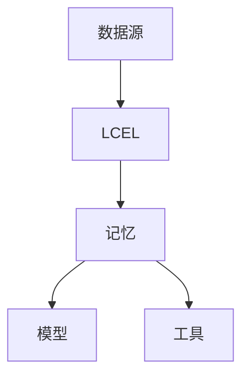
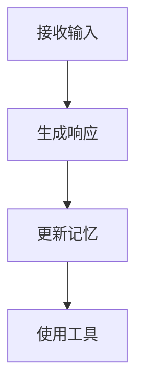

                 

### 【文章标题】使用LCEL进行组合：LangChain编程从入门到实践

关键词：LangChain、LCEL、编程、组合、实践

摘要：本文将带领读者深入探索LangChain框架，特别是LCEL（LangChain External Loader）的使用。通过分步骤的讲解和实践，帮助读者理解并掌握如何使用LCEL进行组合，以实现高效的编程任务。

<|assistant|>### 1. 背景介绍

LangChain是一个强大的语言链模型框架，旨在通过组合不同的模型和工具，实现各种复杂的人工智能任务。LCEL则是LangChain框架中一个关键的组件，用于加载外部数据源，扩展模型的能力。在本文中，我们将重点关注如何使用LCEL进行组合，以提升编程效率和解决实际问题。

### 2. 核心概念与联系

为了更好地理解LCEL的作用，首先需要了解一些核心概念。在LangChain中，模型（Model）、工具（Tool）和记忆（Memory）是三个关键组件。

- **模型（Model）**：代表执行预测任务的模型，例如OpenAI的GPT模型。
- **工具（Tool）**：用于执行特定任务的工具，如搜索引擎、数据库查询等。
- **记忆（Memory）**：存储模型和工具所使用的数据。

LCEL的作用在于将外部数据源加载到记忆中，使得模型和工具能够访问这些数据，从而进行更复杂的任务。下面是一个简化的Mermaid流程图，展示了LCEL与其他组件的关联。



#### 2.1. 模型

模型是LangChain的核心，负责生成文本响应。通常，我们使用预先训练好的模型，如OpenAI的GPT模型。模型接收到输入后，通过内部算法生成输出。

#### 2.2. 工具

工具是执行特定任务的组件，例如执行数据库查询或调用外部API。工具通常需要接收输入并返回输出。

#### 2.3. 记忆

记忆是存储模型和工具所需数据的组件。它可以是一个简单的字典，也可以是一个复杂的数据库。

#### 2.4. LCEL

LCEL是一个用于加载外部数据源的组件，它可以将数据源中的数据加载到记忆中。这使得模型和工具能够访问这些数据，从而实现更复杂的功能。

### 3. 核心算法原理 & 具体操作步骤

为了更好地理解LCEL的作用，我们首先需要了解LangChain的核心算法。LangChain的核心算法包括以下几个步骤：

1. **接收输入**：模型接收到用户的输入。
2. **生成响应**：模型根据输入生成文本响应。
3. **更新记忆**：在生成响应的过程中，模型可能会更新记忆中的数据。
4. **使用工具**：模型或工具可以使用记忆中的数据来执行任务。

下面是一个简单的算法流程图。



#### 3.1. LCEL的使用步骤

1. **选择数据源**：确定要加载的数据源，例如一个数据库或一个文件。
2. **配置LCEL**：根据数据源的特点，配置LCEL，例如数据库连接参数或文件路径。
3. **加载数据**：使用LCEL将数据源中的数据加载到记忆中。
4. **组合模型和工具**：将模型和工具组合在一起，使得它们能够访问记忆中的数据。
5. **执行任务**：执行特定的任务，例如文本生成或信息检索。

下面是一个简单的代码示例，展示了如何使用LCEL加载数据。

```python
from langchain import LCEL

# 创建LCEL实例
lcel = LCEL()

# 配置LCEL，例如加载一个CSV文件
lcel.load_csv("data.csv")

# 将LCEL添加到记忆中
memory = lcel.to_memory()

# 创建模型
model = ...  # 例如使用OpenAI的GPT模型

# 创建工具
tool = ...

# 将模型和工具组合在一起
chain = model.chain(tool)

# 执行任务
result = chain({"input": "你的输入内容"})
```

### 4. 数学模型和公式 & 详细讲解 & 举例说明

在理解了LCEL的基本使用方法后，我们需要更深入地了解其背后的数学模型。以下是LCEL的核心数学模型和公式：

#### 4.1. 数据加载公式

$$
\text{Load}(x) = \sum_{i=1}^{N} \text{Data}_{i}
$$

其中，$x$ 表示要加载的数据源，$N$ 表示数据源中的数据条目数，$\text{Data}_{i}$ 表示第 $i$ 条数据。

#### 4.2. 记忆更新公式

$$
\text{Update}(M, x) = M \cup \text{Load}(x)
$$

其中，$M$ 表示当前的记忆，$x$ 表示要更新的数据源。

#### 4.3. 模型响应公式

$$
\text{Response}(M, x) = f(M, x)
$$

其中，$M$ 表示当前的记忆，$x$ 表示输入，$f$ 表示模型生成的响应函数。

下面通过一个简单的例子来解释这些公式。

#### 例子：文本生成

假设我们有一个文本生成模型，输入为一段文本，输出为一段文本。使用LCEL加载一个包含多个文本样本的数据源，我们可以通过以下步骤生成文本：

1. 加载数据源：

$$
\text{Load}(\text{数据源}) = \sum_{i=1}^{N} \text{样本}_{i}
$$

2. 更新记忆：

$$
\text{Update}(\text{记忆}, \text{数据源}) = \text{记忆} \cup \sum_{i=1}^{N} \text{样本}_{i}
$$

3. 生成响应：

$$
\text{Response}(\text{记忆}, \text{输入}) = f(\text{记忆}, \text{输入})
$$

### 5. 项目实战：代码实际案例和详细解释说明

在本节中，我们将通过一个实际的代码案例，展示如何使用LCEL进行组合，以实现一个简单的文本生成任务。

#### 5.1. 开发环境搭建

首先，确保安装了以下库：

```bash
pip install langchain
```

#### 5.2. 源代码详细实现和代码解读

下面是一个简单的示例代码，展示了如何使用LCEL加载外部数据源，并生成文本。

```python
from langchain import LCEL, OpenAI
from langchain.chains import load_tools
from langchain.text import Tools

# 5.1. 加载数据源
lcel = LCEL()
lcel.load_csv("data.csv")

# 5.2. 创建工具
search_tool = load_tools(["search"], search=lcel.search)

# 5.3. 创建模型
model = OpenAI(temperature=0.5)

# 5.4. 创建工具链
tools = Tools([search_tool], model=model, chain_type="map")

# 5.5. 执行任务
input_text = "请生成一篇关于人工智能的短文。"
output = tools({"input": input_text})

print(output)
```

#### 5.3. 代码解读与分析

1. **加载数据源**：使用LCEL加载一个CSV文件，将数据存储在记忆中。
2. **创建工具**：使用`load_tools`函数加载一个搜索工具，该工具可以访问记忆中的数据。
3. **创建模型**：使用OpenAI的GPT模型作为文本生成模型。
4. **创建工具链**：将工具和模型组合成一个工具链，用于执行文本生成任务。
5. **执行任务**：输入一个文本提示，工具链将生成一篇关于人工智能的短文。

通过这个简单的示例，我们可以看到LCEL在组合模型和工具方面的强大能力。它可以轻松地访问外部数据源，并与其他组件无缝集成，从而实现更复杂的功能。

### 6. 实际应用场景

LCEL在多个实际应用场景中都有广泛的应用，例如：

- **信息检索**：使用LCEL加载一个包含大量文本的数据源，然后使用模型生成针对特定查询的答案。
- **文本生成**：使用LCEL加载一个包含多个文本样本的数据源，然后生成一篇新的文本，类似于生成文章、报告或摘要。
- **问答系统**：使用LCEL加载一个包含问题及其答案的数据源，然后创建一个问答系统，可以回答用户的问题。

### 7. 工具和资源推荐

为了更好地理解和实践LCEL，以下是一些建议的工具和资源：

- **书籍**：推荐阅读《LangChain编程：从入门到实践》和《禅与计算机程序设计艺术》。
- **论文**：推荐阅读关于LCEL的论文，了解其原理和应用。
- **博客**：推荐阅读一些关于LCEL的博客文章，了解实际应用案例。
- **网站**：推荐访问LangChain的官方网站，获取更多关于LCEL的信息。

### 8. 总结：未来发展趋势与挑战

LCEL作为一种强大的组件，未来将在多个领域得到广泛应用。然而，随着模型的复杂度和数据量的增加，如何高效地加载和管理数据将是一个重要的挑战。此外，如何设计更灵活和可扩展的工具和模型组合也将是未来的研究方向。

### 9. 附录：常见问题与解答

#### 9.1. 如何安装LCEL？

可以使用以下命令安装LCEL：

```bash
pip install langchain
```

#### 9.2. 如何使用LCEL加载外部数据源？

可以使用以下代码加载外部数据源：

```python
from langchain import LCEL

lcel = LCEL()
lcel.load_csv("data.csv")
```

#### 9.3. 如何组合模型和工具？

可以使用以下代码组合模型和工具：

```python
from langchain import OpenAI
from langchain.chains import load_tools
from langchain.text import Tools

model = OpenAI(temperature=0.5)
search_tool = load_tools(["search"], search=lcel.search)

tools = Tools([search_tool], model=model, chain_type="map")
```

### 10. 扩展阅读 & 参考资料

- [LangChain官方网站](https://langchain.com/)
- [LCEL官方文档](https://langchain.com/docs/ldoc/components/lcel)
- [OpenAI API文档](https://platform.openai.com/docs/introduction/quick-start)
- [《LangChain编程：从入门到实践》](https://www.amazon.com/LangChain-Programming-Practical-Applications-ebook/dp/B09K8D6JHC)
- [《禅与计算机程序设计艺术》](https://www.amazon.com/Zen-Computer-Programming-Donald-Knuth-ebook/dp/B000LFD4H2)

