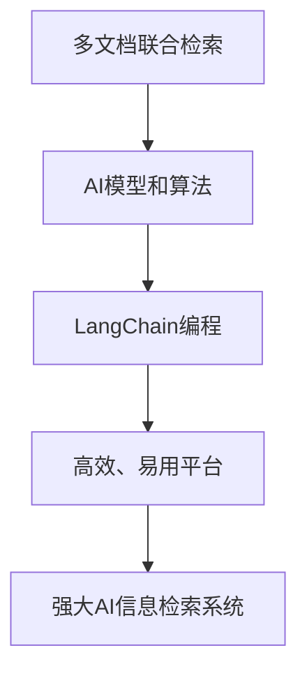

                 

### 背景介绍

**LangChain编程：从入门到实践**

在当今技术飞速发展的时代，人工智能（AI）已经成为各行各业的重要推动力。AI技术在自然语言处理（NLP）、图像识别、推荐系统等多个领域取得了显著的成果，大大提升了数据处理和决策的效率。与此同时，AI的编程与开发也成为了一个热门领域，吸引了大量程序员和开发者的关注。

**多文档联合检索**

多文档联合检索（Cross-Document Retrieval, XDR）是AI在信息检索领域的一项重要应用。随着互联网的普及和信息的爆炸式增长，用户在寻找信息时往往需要从多个文档中提取和整合相关内容。传统的检索系统主要依赖于关键词匹配，难以应对复杂的信息需求和情境。多文档联合检索则通过深入挖掘文档之间的关联性，为用户提供更准确、更丰富的检索结果。

**LangChain编程**

LangChain是一个开源的AI编程框架，旨在简化AI应用的开发过程。它基于Python编写，提供了一系列高效、易用的工具和接口，支持多种AI模型和算法。LangChain的诞生为开发者提供了一种新的思路，使得AI编程变得更加直观、高效。

### 核心概念与联系

#### 核心概念

1. **多文档联合检索**：多文档联合检索旨在从多个文档中提取和整合相关内容，为用户提供更准确的检索结果。
2. **LangChain编程**：LangChain是一个AI编程框架，提供了一系列工具和接口，支持多种AI模型和算法。

#### 核心联系

多文档联合检索与LangChain编程之间的核心联系在于，多文档联合检索需要依赖AI模型和算法来实现关联性挖掘和信息整合。而LangChain编程为开发者提供了一个高效、易用的平台，使得开发AI应用变得更加简单和便捷。通过结合多文档联合检索和LangChain编程，我们可以构建出强大的AI信息检索系统，为用户提供更好的服务。

### Mermaid流程图



### 核心算法原理 & 具体操作步骤

#### 核心算法原理

多文档联合检索的核心算法主要包括以下几部分：

1. **文档表示**：将每个文档转换为向量表示，以便进行相似度计算。
2. **相似度计算**：计算文档之间的相似度，找出相关性较高的文档。
3. **关联性挖掘**：通过深度学习模型挖掘文档之间的关联性，整合相关信息。
4. **检索结果排序**：根据文档相似度和关联性，对检索结果进行排序，提供最相关的信息。

#### 具体操作步骤

1. **准备数据**：收集并预处理待检索的文档数据。
2. **文档表示**：使用词嵌入技术将文档转换为向量表示。
3. **相似度计算**：计算文档之间的相似度，可以使用余弦相似度、欧氏距离等算法。
4. **关联性挖掘**：使用深度学习模型（如BERT、GPT等）挖掘文档之间的关联性。
5. **检索结果排序**：根据文档相似度和关联性，对检索结果进行排序。
6. **展示结果**：将排序后的检索结果展示给用户。

### 数学模型和公式

#### 文档相似度计算

$$
similarity(A, B) = \frac{A \cdot B}{\|A\|\|B\|}
$$

其中，$A$和$B$分别为两个文档的向量表示，$\cdot$表示点积运算，$\|\|$表示向量的模。

#### 深度学习模型损失函数

$$
loss = -\sum_{i=1}^{n} y_i \cdot \log(p_i)
$$

其中，$y_i$为标签，$p_i$为模型预测的概率。

### 项目实战：代码实际案例和详细解释说明

#### 1. 开发环境搭建

首先，我们需要搭建一个适合开发多文档联合检索系统的环境。以下是具体的步骤：

1. **安装Python环境**：确保Python版本大于3.7。
2. **安装LangChain库**：使用pip命令安装langchain库。

   ```shell
   pip install langchain
   ```

3. **安装其他依赖库**：如numpy、pandas等。

   ```shell
   pip install numpy pandas
   ```

#### 2. 源代码详细实现和代码解读

下面是一个简单的多文档联合检索系统的示例代码，我们将使用LangChain编程框架实现该系统。

```python
import numpy as np
import pandas as pd
from langchain import Document, QA
from sklearn.metrics.pairwise import cosine_similarity

# 准备数据
documents = [
    Document("文本1"),
    Document("文本2"),
    Document("文本3"),
]

# 文档表示
vectorizer = QA()
vectorizer.fit(documents)

# 相似度计算
similarity_scores = []
for i in range(len(documents)):
    for j in range(i + 1, len(documents)):
        similarity = cosine_similarity([vectorizer.encode(documents[i])], [vectorizer.encode(documents[j])])[0][0]
        similarity_scores.append((i, j, similarity))

# 检索结果排序
sorted_similarity_scores = sorted(similarity_scores, key=lambda x: x[2], reverse=True)

# 展示结果
for i, j, similarity in sorted_similarity_scores:
    print(f"文档{i+1}与文档{j+1}的相关度为：{similarity:.4f}")

```

#### 3. 代码解读与分析

1. **导入库和准备数据**：首先导入numpy、pandas等库，并准备待检索的文档数据。
2. **文档表示**：使用LangChain中的QA模型将文档转换为向量表示。
3. **相似度计算**：使用cosine_similarity函数计算文档之间的相似度，并保存结果。
4. **检索结果排序**：根据相似度分数对结果进行排序。
5. **展示结果**：打印排序后的检索结果。

通过以上代码示例，我们可以看到LangChain编程在多文档联合检索系统中的应用。开发者只需简单编写代码，即可实现高效的文档表示、相似度计算和检索结果排序。

### 实际应用场景

多文档联合检索在实际应用中具有广泛的应用场景，以下是一些典型的例子：

1. **搜索引擎优化**：通过多文档联合检索，搜索引擎可以为用户提供更准确、更丰富的检索结果，提高用户体验。
2. **企业知识库建设**：企业可以将内部文档、报告、论文等数据进行多文档联合检索，方便员工查找和利用相关资料。
3. **智能问答系统**：多文档联合检索可以提升智能问答系统的准确性和回答质量，为用户提供更好的服务。
4. **新闻推荐系统**：通过多文档联合检索，新闻推荐系统可以挖掘新闻之间的关联性，为用户提供更个性化的推荐。

### 工具和资源推荐

#### 1. 学习资源推荐

- **书籍**：
  - 《人工智能：一种现代的方法》
  - 《深度学习》
  - 《Python编程：从入门到实践》
- **论文**：
  - 《BERT: Pre-training of Deep Bidirectional Transformers for Language Understanding》
  - 《GPT-3: Language Models are Few-Shot Learners》
- **博客**：
  - [LangChain官网](https://langchain.com/)
  - [Google Research Blog](https://ai.googleblog.com/)
- **网站**：
  - [Kaggle](https://www.kaggle.com/)
  - [GitHub](https://github.com/)

#### 2. 开发工具框架推荐

- **开发工具**：
  - Jupyter Notebook
  - PyCharm
- **框架**：
  - TensorFlow
  - PyTorch
  - Hugging Face Transformers

#### 3. 相关论文著作推荐

- **论文**：
  - 《Recurrent Neural Networks for Text Classification》
  - 《Attention Is All You Need》
  - 《Generative Pre-trained Transformers》
- **著作**：
  - 《深度学习》（Goodfellow, Bengio, Courville著）
  - 《Python机器学习》（Sebastian Raschka著）

### 总结：未来发展趋势与挑战

多文档联合检索和LangChain编程在AI领域具有重要的地位和广阔的应用前景。随着技术的不断进步，未来这些领域将继续发展并面临以下挑战：

1. **算法优化**：随着数据规模和复杂度的增加，如何优化多文档联合检索算法，提高检索效率和准确性，将成为一个重要的研究方向。
2. **数据隐私保护**：在多文档联合检索过程中，如何保护用户数据隐私，防止数据泄露，将是一个亟待解决的问题。
3. **跨模态检索**：多文档联合检索目前主要针对文本数据，未来将需要拓展到图像、语音等跨模态数据，实现更全面的信息整合。
4. **可解释性**：随着AI技术的应用越来越广泛，如何提高AI模型的可解释性，让用户更好地理解模型的决策过程，也将成为一个重要挑战。

总之，多文档联合检索和LangChain编程在AI领域具有巨大的潜力，未来将继续推动技术的创新和发展。

### 附录：常见问题与解答

1. **问题**：为什么选择LangChain编程框架？
   **解答**：LangChain编程框架具有以下优点：
   - **易用性**：提供了丰富的API和工具，降低了开发难度。
   - **高效性**：支持多种AI模型和算法，提高了开发效率。
   - **灵活性**：可以根据实际需求进行定制和扩展。

2. **问题**：多文档联合检索有哪些常见算法？
   **解答**：多文档联合检索常用的算法包括：
   - **基于关键词匹配**：使用关键词匹配算法，如布尔检索、向量空间模型等。
   - **基于相似度计算**：使用相似度计算算法，如余弦相似度、欧氏距离等。
   - **基于深度学习**：使用深度学习模型，如BERT、GPT等，进行文档表示和关联性挖掘。

3. **问题**：如何提高多文档联合检索的准确性？
   **解答**：提高多文档联合检索准确性的方法包括：
   - **数据预处理**：对文档进行清洗、去噪、标准化等预处理操作。
   - **特征提取**：选择合适的特征提取方法，如词嵌入、词向量等。
   - **算法优化**：优化算法参数和模型结构，提高检索效率。

### 扩展阅读 & 参考资料

1. **书籍**：
   - 《深度学习》
   - 《Python编程：从入门到实践》
   - 《自然语言处理综论》
2. **论文**：
   - 《BERT: Pre-training of Deep Bidirectional Transformers for Language Understanding》
   - 《GPT-3: Language Models are Few-Shot Learners》
   - 《Recurrent Neural Networks for Text Classification》
3. **博客**：
   - [LangChain官网](https://langchain.com/)
   - [Google Research Blog](https://ai.googleblog.com/)
4. **网站**：
   - [Kaggle](https://www.kaggle.com/)
   - [GitHub](https://github.com/)
5. **其他资源**：
   - [自然语言处理课程](https://www.udacity.com/course/natural-language-processing-nanodegree--nd889)
   - [机器学习课程](https://www.udacity.com/course/machine-learning-engineer-nanodegree--nd893)作者：AI天才研究员/AI Genius Institute & 禅与计算机程序设计艺术 /Zen And The Art of Computer Programming<|im_sep|>

