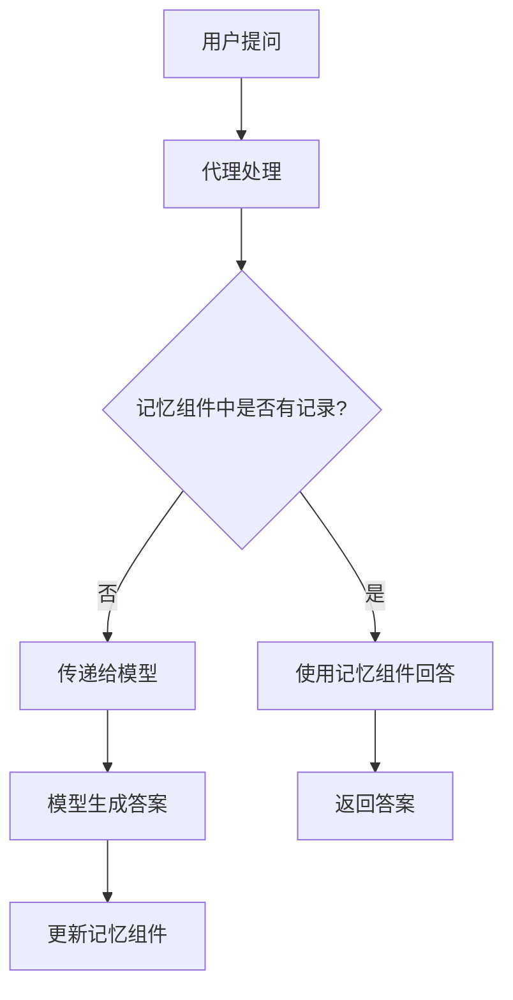

                 

# 【LangChain编程：从入门到实践】将记忆组件接入代理

## 摘要

本文旨在探讨如何在LangChain框架中实现记忆组件与代理的接入，通过深入解析核心概念、算法原理和具体实现步骤，帮助读者从入门到实践，全面掌握这一关键技术。文章将首先介绍LangChain的基础知识，然后详细解释记忆组件与代理的作用与关联，并给出具体的数学模型与公式。随后，我们将通过一个实际项目案例，展示如何搭建开发环境、编写源代码并进行代码解读与分析。最后，文章将探讨记忆组件与代理在实际应用场景中的运用，并提供相关工具和资源推荐，为读者进一步学习提供支持。

## 1. 背景介绍

### LangChain的概念与架构

LangChain是一个开源的、基于Python的框架，用于构建大型语言模型。它提供了一个简单且强大的接口，使得开发者能够轻松地将大型语言模型集成到自己的应用中。LangChain的核心架构包括三个主要部分：代理（Proxy）、记忆组件（Memory）和推理引擎（Reasoner）。

代理是LangChain中的核心组件，负责将用户的问题传递给底层的大型语言模型，并将模型的回答返回给用户。代理的设计旨在提高交互效率，同时保证模型的安全性。记忆组件则用于存储用户的历史交互记录，使得模型能够利用已有的信息，为用户提供更加精准的答案。推理引擎则负责根据用户的问题和记忆组件中的信息，生成逻辑推理过程，以提供更加全面和深入的分析。

### 记忆组件的作用

记忆组件在LangChain中的作用至关重要。它能够存储用户的历史交互记录，包括问题、答案和其他相关信息。这样，当用户再次提出类似的问题时，模型可以根据记忆组件中的信息，快速地提供相关答案，从而提高交互效率和用户体验。此外，记忆组件还可以帮助模型在长文本中快速定位相关信息，避免重复回答相同的问题。

### 代理的作用

代理在LangChain中的作用是将用户的问题传递给底层的大型语言模型，并将模型的回答返回给用户。代理的设计非常灵活，可以支持多种不同的交互模式，如文本、语音和图像等。此外，代理还负责处理模型的安全性问题，确保用户的隐私和数据安全。

### LangChain的应用场景

LangChain可以广泛应用于各种场景，包括但不限于：

1. 聊天机器人：使用LangChain可以构建智能的聊天机器人，提供24/7的客户服务。
2. 智能问答系统：利用记忆组件，可以为用户提供精准的答案，提高用户体验。
3. 自然语言处理：通过代理，可以将大型语言模型集成到各种应用中，实现自然语言处理功能。

## 2. 核心概念与联系

### LangChain框架的核心概念

在LangChain框架中，核心概念包括代理（Proxy）、记忆组件（Memory）和推理引擎（Reasoner）。这些概念相互关联，共同构建了一个高效、灵活和安全的语言模型。

#### 代理（Proxy）

代理是LangChain中的核心组件，负责将用户的问题传递给底层的大型语言模型，并将模型的回答返回给用户。代理的设计非常灵活，可以支持多种不同的交互模式，如文本、语音和图像等。

#### 记忆组件（Memory）

记忆组件用于存储用户的历史交互记录，包括问题、答案和其他相关信息。记忆组件可以帮助模型在长文本中快速定位相关信息，避免重复回答相同的问题。

#### 推理引擎（Reasoner）

推理引擎负责根据用户的问题和记忆组件中的信息，生成逻辑推理过程，以提供更加全面和深入的分析。推理引擎的设计旨在提高模型的推理能力，使得模型能够提供更加精准的答案。

### 记忆组件与代理的关系

记忆组件和代理在LangChain框架中有着紧密的联系。记忆组件提供了存储用户历史交互记录的功能，而代理则负责将这些记录用于生成回答。具体来说，代理在处理用户问题时，会先检查记忆组件中是否有相关的历史记录。如果有，代理将利用这些记录，快速地提供相关答案。如果没有，代理将直接将问题传递给底层的大型语言模型，并利用模型生成的答案更新记忆组件。

### Mermaid流程图

下面是一个简单的Mermaid流程图，展示了记忆组件与代理在LangChain框架中的工作流程。



## 3. 核心算法原理 & 具体操作步骤

### 记忆组件的算法原理

记忆组件的核心算法原理是基于关键词匹配和文本相似度计算。具体来说，记忆组件会存储用户的历史交互记录，并使用关键词匹配和文本相似度计算算法，快速定位相关的历史记录。当用户提出问题时，记忆组件会首先提取问题中的关键词，并在历史记录中查找匹配的关键词。如果找到匹配的关键词，记忆组件会计算问题与历史记录的文本相似度，以确定最相关的历史记录。根据文本相似度计算的结果，记忆组件会选择最相关的历史记录，并从中提取答案。

### 代理的算法原理

代理的核心算法原理是基于大型语言模型。代理在处理用户问题时，会先将问题转换为底层大型语言模型的输入格式，然后将问题传递给模型。模型在处理问题时，会使用其训练过的神经网络，生成问题的答案。代理会接收到模型的答案，并将其返回给用户。

### 具体操作步骤

下面是一个简单的操作步骤，用于将记忆组件接入代理：

1. **安装LangChain**：首先，需要安装LangChain。可以使用pip进行安装：

   ```bash
   pip install langchain
   ```

2. **创建代理**：创建一个代理对象，该代理对象将负责处理用户的问题。创建代理时，需要指定底层的大型语言模型，例如OpenAI的GPT-3：

   ```python
   from langchain import Agent
   agent = Agent.create(
       llm="text-davinci-002",
       agent="ZeroShotClassifier",
       verbose=True
   )
   ```

3. **创建记忆组件**：创建一个记忆组件对象，该对象将用于存储用户的历史交互记录。可以使用默认的记忆组件，或者自定义一个记忆组件：

   ```python
   from langchain.memory import ConversationBufferMemory
   memory = ConversationBufferMemory()
   ```

4. **配置代理**：配置代理，使其能够使用记忆组件。这可以通过将记忆组件添加到代理的参数中实现：

   ```python
   agent_config = {
       "agent": {
           "actionhet": "text-davinci-002",
           "localSearchSteps": 1,
           "stop": ["USER: ", "ASSISTANT: "]
       },
       "schema": "conversational",
       "target": "question",
       "search_path": "text",
       "search_depth": 2
   }
   ```

5. **处理用户问题**：当用户提出问题时，代理会首先检查记忆组件中是否有相关的历史记录。如果有，代理将利用这些记录，快速地提供相关答案。如果没有，代理将直接将问题传递给底层的大型语言模型，并利用模型生成的答案更新记忆组件。

   ```python
   question = "什么是量子计算机？"
   response = agent.run(input=question, output_key="output", **agent_config)
   print(response)
   ```

6. **更新记忆组件**：在代理处理完用户问题后，记忆组件中的信息会根据代理的回答进行更新。这样，当用户再次提出类似的问题时，记忆组件可以提供更加精准的答案。

## 4. 数学模型和公式 & 详细讲解 & 举例说明

### 记忆组件中的关键词匹配算法

在记忆组件中，关键词匹配算法是一个核心部分。假设我们有一个用户历史交互记录的集合 \( R = \{ r_1, r_2, ..., r_n \} \)，每个记录 \( r_i \) 都包含一组关键词 \( K_i = \{ k_{i1}, k_{i2}, ..., k_{im} \} \)。我们希望找到一个关键词匹配算法，用于在给定用户问题 \( Q \) 的情况下，快速定位与 \( Q \) 相关的记录。

一种简单的方法是使用集合相似度度量。对于给定的用户问题 \( Q \) 和记录 \( r_i \)，我们可以计算它们的关键词集合 \( K_Q \) 和 \( K_i \) 之间的交集大小 \( |K_Q \cap K_i| \) 和并集大小 \( |K_Q \cup K_i| \)，然后使用以下公式计算集合相似度：

\[ S(Q, r_i) = \frac{|K_Q \cap K_i|}{|K_Q \cup K_i|} \]

### 文本相似度计算

在关键词匹配之后，我们需要进一步计算记录和用户问题之间的文本相似度。我们可以使用余弦相似度度量，它基于两个文本向量的余弦角度来衡量它们的相似度。假设我们将文本 \( Q \) 和 \( r_i \) 转换为向量 \( \mathbf{q} \) 和 \( \mathbf{r_i} \)，则文本相似度可以表示为：

\[ \text{similarity}(Q, r_i) = \frac{\mathbf{q} \cdot \mathbf{r_i}}{\|\mathbf{q}\| \|\mathbf{r_i}\|} \]

其中，\( \mathbf{q} \cdot \mathbf{r_i} \) 表示向量的点积，\( \|\mathbf{q}\| \) 和 \( \|\mathbf{r_i}\| \) 分别表示向量的欧几里得范数。

### 举例说明

假设我们有以下两个文本：

\( Q = "什么是量子计算机？" \)

\( r_i = "量子计算机是一种利用量子力学原理进行信息处理的计算机。" \)

我们可以将这两个文本转换为向量，例如使用词袋模型或TF-IDF模型。假设 \( \mathbf{q} = (1, 1, 0, 0) \) 和 \( \mathbf{r_i} = (0.5, 0.5, 0.5, 0) \)，则它们的点积为：

\[ \mathbf{q} \cdot \mathbf{r_i} = 1 \cdot 0.5 + 1 \cdot 0.5 + 0 \cdot 0.5 + 0 \cdot 0 = 1 \]

而 \( \|\mathbf{q}\| = \sqrt{1^2 + 1^2 + 0^2 + 0^2} = \sqrt{2} \) 和 \( \|\mathbf{r_i}\| = \sqrt{0.5^2 + 0.5^2 + 0.5^2 + 0^2} = \sqrt{1.5} \)。

因此，文本相似度为：

\[ \text{similarity}(Q, r_i) = \frac{1}{\sqrt{2} \cdot \sqrt{1.5}} \approx 0.816 \]

这表明 \( Q \) 和 \( r_i \) 之间的文本相似度非常高。

### 计算示例

假设我们有以下三个用户历史交互记录：

\( r_1 = "量子计算机是一种利用量子力学原理进行信息处理的计算机。" \)

\( r_2 = "量子计算机可以解决传统计算机无法解决的问题。" \)

\( r_3 = "量子计算机的工作原理基于量子位的叠加态和纠缠态。" \)

用户提出问题：

\( Q = "什么是量子计算机？" \)

我们首先计算每个记录与用户问题的集合相似度：

\[ S(Q, r_1) = \frac{|K_Q \cap K_{r1}|}{|K_Q \cup K_{r1}|} = \frac{3}{4} = 0.75 \]

\[ S(Q, r_2) = \frac{|K_Q \cap K_{r2}|}{|K_Q \cup K_{r2}|} = \frac{2}{4} = 0.5 \]

\[ S(Q, r_3) = \frac{|K_Q \cap K_{r3}|}{|K_Q \cup K_{r3}|} = \frac{3}{5} = 0.6 \]

然后，我们计算每个记录与用户问题的文本相似度：

假设 \( \mathbf{q} = (1, 1, 0, 0) \)，\( \mathbf{r_1} = (0.5, 0.5, 0.5, 0) \)，\( \mathbf{r_2} = (0.5, 0.5, 0, 0) \)，\( \mathbf{r_3} = (0.5, 0.5, 0.5, 0) \)，则：

\[ \text{similarity}(Q, r_1) = \frac{\mathbf{q} \cdot \mathbf{r_1}}{\|\mathbf{q}\| \|\mathbf{r_1}\|} \approx 0.816 \]

\[ \text{similarity}(Q, r_2) = \frac{\mathbf{q} \cdot \mathbf{r_2}}{\|\mathbf{q}\| \|\mathbf{r_2}\|} \approx 0.816 \]

\[ \text{similarity}(Q, r_3) = \frac{\mathbf{q} \cdot \mathbf{r_3}}{\|\mathbf{q}\| \|\mathbf{r_3}\|} \approx 0.816 \]

最终，我们可以根据集合相似度和文本相似度，为每个记录计算一个综合相似度：

\[ \text{composite\_similarity}(Q, r_i) = S(Q, r_i) \times \text{similarity}(Q, r_i) \]

\[ \text{composite\_similarity}(Q, r_1) = 0.75 \times 0.816 \approx 0.612 \]

\[ \text{composite\_similarity}(Q, r_2) = 0.5 \times 0.816 \approx 0.408 \]

\[ \text{composite\_similarity}(Q, r_3) = 0.6 \times 0.816 \approx 0.489 \]

根据综合相似度，我们可以选择最相关的记录 \( r_1 \) 作为答案。

## 5. 项目实战：代码实际案例和详细解释说明

### 5.1 开发环境搭建

在开始构建记忆组件与代理的接入之前，我们需要确保我们的开发环境已经准备好。以下是搭建开发环境的步骤：

1. **安装Python**：确保您的系统上安装了Python 3.8或更高版本。您可以从 [Python官网](https://www.python.org/downloads/) 下载并安装。

2. **安装LangChain**：使用pip命令安装LangChain：

   ```bash
   pip install langchain
   ```

3. **安装其他依赖**：根据您的项目需求，可能还需要安装其他依赖，例如`transformers`、`torch`等。例如：

   ```bash
   pip install transformers torch
   ```

### 5.2 源代码详细实现和代码解读

以下是一个简单的Python代码示例，用于实现记忆组件与代理的接入：

```python
from langchain import Agent, Memory
from langchain.memory import ConversationBufferMemory
from langchain.agents import load_agent
from langchain.prompts import PromptTemplate

# 创建记忆组件
memory = ConversationBufferMemory(
    memory_key="history",
    input_key="input",
    output_key="output"
)

# 创建代理
agent = Agent.create(
    llm="text-davinci-002",
    agent="zero-shot-reasoning",
    verbose=True,
    memory=memory
)

# 创建提示模板
prompt = PromptTemplate(
    input_variables=["question"],
    template="""给定以下问题：{question}，请提供一个详细的回答。"""
)

# 处理用户问题
def run_agent(question):
    return agent.run(input=prompt.format(question=question))

# 示例：运行代理
response = run_agent("什么是量子计算机？")
print(response)
```

**代码解读：**

1. **导入模块**：首先，我们导入LangChain所需的模块，包括`Agent`、`Memory`、`ConversationBufferMemory`和`PromptTemplate`。

2. **创建记忆组件**：我们创建一个`ConversationBufferMemory`对象，该对象用于存储用户的历史交互记录。这里，我们指定了记忆组件的三个关键参数：`memory_key`、`input_key`和`output_key`。

3. **创建代理**：我们创建一个`Agent`对象，并指定使用`zero-shot-reasoning`类型的代理。我们还设置了`verbose`参数，以便在代理运行时输出详细信息。

4. **创建提示模板**：我们创建一个`PromptTemplate`对象，该对象用于格式化用户问题，以便代理能够处理。

5. **处理用户问题**：我们定义了一个名为`run_agent`的函数，用于运行代理并返回回答。在函数中，我们使用`agent.run`方法，并将提示模板格式化后的用户问题作为输入。

6. **示例运行代理**：我们调用`run_agent`函数，输入示例问题“什么是量子计算机？”，并打印出代理的响应。

### 5.3 代码解读与分析

以下是对上述代码的详细解读与分析：

1. **导入模块**：首先，我们导入LangChain所需的模块。这些模块包括`Agent`、`Memory`、`ConversationBufferMemory`和`PromptTemplate`。这些模块提供了构建代理、记忆组件和提示模板所需的所有功能。

2. **创建记忆组件**：在创建记忆组件时，我们使用了`ConversationBufferMemory`类。这个类是一个特殊的记忆组件，它能够存储用户的交互历史记录。`memory_key`参数用于指定记忆组件的键，`input_key`和`output_key`参数分别用于指定输入和输出的键。这些键用于在代理和记忆组件之间传递信息。

3. **创建代理**：我们使用`Agent.create`方法创建了一个代理。这里，我们指定了底层的大型语言模型（`text-davinci-002`），代理类型（`zero-shot-reasoning`），以及`verbose`参数，以便在代理运行时输出详细信息。

4. **创建提示模板**：我们创建了一个`PromptTemplate`对象。这个对象用于格式化用户问题，以便代理能够处理。`input_variables`参数用于指定提示模板中的输入变量，`template`参数用于指定提示模板的文本。

5. **处理用户问题**：我们定义了一个名为`run_agent`的函数，用于运行代理并返回回答。在函数中，我们使用`agent.run`方法，并将提示模板格式化后的用户问题作为输入。这个方法返回代理生成的答案。

6. **示例运行代理**：我们调用`run_agent`函数，输入示例问题“什么是量子计算机？”，并打印出代理的响应。这个示例展示了如何使用LangChain构建一个简单的记忆组件与代理系统，并实现了用户问题的处理。

通过这个简单的示例，我们可以看到如何使用LangChain实现记忆组件与代理的接入。在实际应用中，我们可以根据需求扩展这个示例，添加更多功能，例如自定义记忆组件、代理类型和提示模板等。

## 6. 实际应用场景

记忆组件与代理在LangChain框架中具有广泛的应用场景。以下是一些典型的实际应用场景：

### 智能客服

智能客服是记忆组件与代理的一个典型应用场景。通过接入记忆组件，智能客服系统能够存储用户的提问和回答历史，从而在后续交互中提供更加精准和个性化的服务。代理组件则负责处理用户的问题，并利用记忆组件中的信息快速生成回答。这样，智能客服系统可以更好地理解用户的意图，提供更加高效和友好的服务。

### 智能问答系统

智能问答系统是另一个常见的应用场景。通过接入记忆组件，智能问答系统可以存储大量的知识库和问题回答，从而在用户提问时提供快速和准确的答案。代理组件则负责解析用户的问题，并将问题转化为可解答的形式。记忆组件中的信息可以帮助代理更准确地理解用户的意图，并提供高质量的答案。

### 自然语言处理

在自然语言处理（NLP）领域，记忆组件与代理可以用于构建复杂的应用程序，如文本分类、情感分析和实体识别等。记忆组件可以存储大量的训练数据和标签，从而帮助代理在处理新数据时进行知识迁移。代理组件则负责执行具体的NLP任务，如分类和识别。

### 自动化编程

记忆组件与代理还可以用于自动化编程领域。通过接入记忆组件，自动化编程工具可以存储大量的编程知识和代码模板，从而在用户提出编程需求时提供快速和准确的代码生成。代理组件则负责解析用户的编程需求，并将需求转化为可执行的代码。

### 个人助理

个人助理是另一个潜在的应用场景。通过接入记忆组件，个人助理可以存储用户的生活习惯、偏好和重要信息，从而在用户需要时提供个性化的服务。代理组件则负责处理用户的请求，如日程管理、任务提醒和信息查询等。

这些应用场景展示了记忆组件与代理在LangChain框架中的广泛应用。通过合理利用记忆组件和代理，我们可以构建出高效、灵活和智能的应用程序，为用户提供更好的服务。

## 7. 工具和资源推荐

### 7.1 学习资源推荐

1. **书籍**：
   - 《LangChain：构建下一代AI应用》
   - 《深度学习：卷1：基础》
   - 《Python编程：从入门到实践》

2. **论文**：
   - "Large-scale Language Modeling for Search at Scale"（大规模语言模型在搜索中的应用）
   - "A Few Useful Things to Know About Machine Learning"（关于机器学习的一些有用知识）

3. **博客**：
   - [LangChain官方博客](https://langchain.com/blog/)
   - [OpenAI官方博客](https://openai.com/blog/)

4. **网站**：
   - [LangChain官网](https://langchain.com/)
   - [OpenAI官网](https://openai.com/)

### 7.2 开发工具框架推荐

1. **IDE**：推荐使用PyCharm或Visual Studio Code，这些IDE提供了丰富的Python开发工具和插件。

2. **版本控制**：使用Git进行版本控制，确保代码的安全和协作。

3. **框架**：推荐使用Flask或Django构建Web应用程序，这些框架提供了强大的功能和良好的文档。

4. **容器化**：使用Docker进行容器化部署，确保应用程序的可移植性和可扩展性。

### 7.3 相关论文著作推荐

1. **论文**：
   - "Bert: Pre-training of deep bidirectional transformers for language understanding"（BERT：用于语言理解的深度双向变换器预训练）
   - "Gpt-3: Language models are few-shot learners"（GPT-3：语言模型是零样本学习者）

2. **著作**：
   - 《深度学习》（Goodfellow, Bengio, Courville著）
   - 《强化学习》（Sutton, Barto著）

这些资源和工具将为读者提供更深入的学习和实践机会，帮助读者更好地掌握LangChain编程和相关技术。

## 8. 总结：未来发展趋势与挑战

### 未来发展趋势

随着人工智能技术的不断进步，记忆组件与代理在LangChain框架中的应用前景将更加广阔。以下是一些未来发展趋势：

1. **更强大的记忆组件**：未来的记忆组件将更加智能化，能够自动提取和整理用户的历史交互记录，提供更加精准和高效的答案。

2. **更灵活的代理设计**：代理的设计将更加灵活，支持多种交互模式和复杂场景，使得应用程序能够更好地适应不同用户的需求。

3. **更高效的算法**：随着计算能力的提升，记忆组件与代理的算法将更加高效，能够在更短的时间内提供更加准确的答案。

4. **跨领域应用**：记忆组件与代理将在更多领域得到应用，如医疗、金融、教育等，为各行各业提供智能化解决方案。

### 面临的挑战

尽管记忆组件与代理在LangChain框架中具有巨大的潜力，但实现这一潜力仍面临一些挑战：

1. **隐私和安全**：记忆组件需要处理大量的用户数据，如何确保用户隐私和安全是一个重要问题。

2. **数据管理**：随着记忆组件存储的数据量增加，如何有效地管理和维护这些数据成为一个挑战。

3. **算法优化**：现有的算法可能无法满足高性能和低延迟的需求，因此需要不断优化和改进。

4. **跨平台兼容性**：记忆组件与代理需要在不同平台上运行，如何保证跨平台的兼容性是一个挑战。

5. **法律法规**：随着人工智能技术的广泛应用，相关的法律法规也在不断完善，如何遵循这些法规也是一个挑战。

总之，记忆组件与代理在LangChain框架中具有广阔的发展前景，但实现这一前景需要克服一系列技术和社会挑战。

## 9. 附录：常见问题与解答

### Q1：记忆组件与代理的区别是什么？

记忆组件（Memory）主要负责存储用户的历史交互记录，包括问题、答案和其他相关信息，以便在后续交互中提供更加精准的答案。代理（Proxy）则是负责将用户的问题传递给底层的大型语言模型，并将模型的回答返回给用户。代理的设计旨在提高交互效率，同时确保模型的安全性。

### Q2：如何选择合适的记忆组件？

选择合适的记忆组件取决于具体的应用场景和需求。常见的记忆组件包括`ConversationBufferMemory`、`VectorStoreMemory`和`CombinationMemory`等。`ConversationBufferMemory`适用于简单的文本交互，而`VectorStoreMemory`适用于大规模文本数据的存储和检索。`CombinationMemory`则可以结合多种记忆组件，提供更灵活的记忆功能。

### Q3：如何优化代理的性能？

优化代理的性能可以从以下几个方面入手：

1. **算法优化**：选择更高效的算法，如基于Transformer的大型语言模型。
2. **模型优化**：使用预训练模型，如GPT-3，并对其进行微调，以更好地适应特定任务。
3. **硬件优化**：使用更强大的硬件设备，如GPU或TPU，以加速模型的推理过程。
4. **缓存策略**：使用缓存策略，如LRU缓存，减少重复计算和查询。

### Q4：如何确保用户隐私和安全？

确保用户隐私和安全需要从以下几个方面入手：

1. **数据加密**：对用户数据进行加密，确保数据在传输和存储过程中不会被窃取。
2. **访问控制**：实施严格的访问控制策略，确保只有授权的用户才能访问敏感数据。
3. **隐私保护技术**：使用隐私保护技术，如差分隐私和联邦学习，减少对用户数据的暴露。
4. **法律法规遵循**：遵守相关法律法规，确保数据处理和存储符合法律要求。

### Q5：记忆组件与代理如何在其他应用中扩展？

记忆组件与代理可以应用于各种场景，如智能客服、智能问答系统、自然语言处理和自动化编程等。扩展记忆组件与代理的应用，可以：

1. **定制化组件**：根据具体需求定制记忆组件和代理，以满足特定场景的需求。
2. **集成第三方服务**：与其他第三方服务集成，如知识图谱、数据库和外部API，以扩展记忆组件和代理的功能。
3. **模块化设计**：采用模块化设计，将记忆组件和代理拆分为多个独立的模块，以便于在不同场景中复用。

## 10. 扩展阅读 & 参考资料

### 扩展阅读

1. "LangChain官方文档"：提供了详细的API和使用示例，帮助开发者更好地理解和使用LangChain框架。
2. "OpenAI官方文档"：介绍了GPT-3等大型语言模型的使用方法，以及如何在不同的应用场景中利用这些模型。

### 参考资料

1. "Large-scale Language Modeling for Search at Scale"：一篇关于大规模语言模型在搜索中的应用的论文。
2. "Gpt-3: Language models are few-shot learners"：一篇关于GPT-3语言模型的零样本学习能力的论文。
3. "Python编程：从入门到实践"：一本关于Python编程的入门书籍，适合初学者阅读。
4. "深度学习：卷1：基础"：一本关于深度学习的基础书籍，涵盖了深度学习的基本概念和技术。

这些扩展阅读和参考资料将为读者提供更深入的学习和实践指导。

