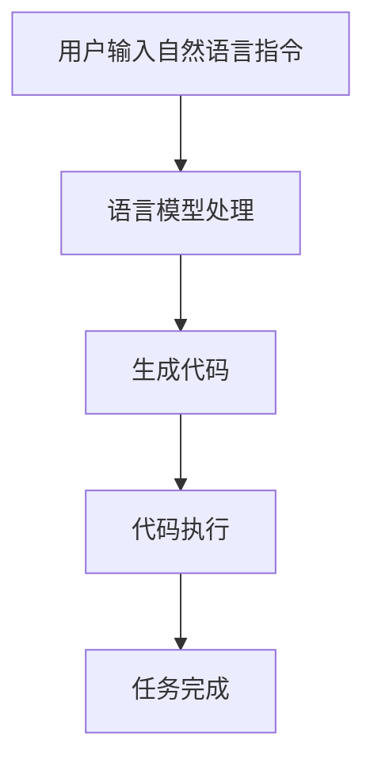

                 

### 背景介绍

【LangChain编程：从入门到实践】教程用例旨在为广大开发者提供一套系统而全面的学习资源，帮助用户深入了解并掌握LangChain这一强大工具。在当今快速发展的技术时代，编程语言和框架层出不穷，但能够将自然语言处理（NLP）与代码执行相结合的工具却并不多见。LangChain正是这样一种创新性的技术，它允许开发者利用大型语言模型，如GPT-3，来生成代码、执行任务和自动化流程。

#### 什么是LangChain？

LangChain是一个开源的Python库，它允许用户将自然语言文本转换成实际的代码，并执行这些代码。通过将语言模型与编程任务相结合，LangChain极大地提高了软件开发的生产效率。例如，一个开发者可以使用LangChain来编写复杂的SQL查询，而不需要手动编写完整的SQL语句。

#### LangChain的核心优势

- **高效率**：通过自动生成代码，减少了手动编写的时间，提高了开发效率。
- **通用性**：LangChain可以处理各种编程任务，包括数据查询、数据操作、自动化脚本等。
- **灵活性**：用户可以根据需求自定义代码生成过程，实现个性化的开发体验。

#### 教程的目标读者

本教程适用于具有基本编程知识和对自然语言处理有一定了解的开发者。无论您是初学者还是经验丰富的程序员，都可以通过本教程系统学习LangChain的使用方法，从而提高编程技能和开发效率。

接下来，我们将逐步深入探讨LangChain的核心概念、算法原理、数学模型以及实际应用案例。希望通过本教程，读者能够全面掌握LangChain的使用方法，并将其应用于实际项目中。

### 核心概念与联系

在深入探讨LangChain编程之前，首先需要理解其背后的核心概念和它们之间的相互关系。以下是LangChain编程涉及的关键概念及其相互联系：

#### 自然语言处理（NLP）

自然语言处理是计算机科学和人工智能领域的一个重要分支，旨在使计算机能够理解、解释和生成自然语言。在LangChain中，NLP技术被用来将用户的自然语言指令转换成计算机代码。

#### 语言模型

语言模型是一种统计模型，用于预测文本序列的概率分布。在LangChain中，最常用的语言模型是GPT（Generative Pre-trained Transformer），如GPT-3，它具有非常强大的文本生成能力。

#### 编程任务自动化

编程任务自动化是指利用工具或算法来自动执行编程任务，从而减少手动工作量和提高效率。LangChain正是通过将自然语言指令转换成代码，实现了编程任务的自动化。

#### LangChain工作原理

LangChain的工作原理可以概括为以下几个步骤：

1. **接收自然语言输入**：用户通过自然语言指令描述需要完成的编程任务。
2. **语言模型处理**：使用GPT等语言模型解析输入的自然语言指令，生成相应的代码。
3. **代码执行**：执行生成的代码，完成用户指定的任务。

#### Mermaid流程图

为了更直观地展示LangChain的工作流程，我们可以使用Mermaid流程图来描述其各个步骤。



在上述流程中，用户输入自然语言指令后，通过语言模型处理生成代码，然后执行代码完成具体任务。这一过程充分利用了自然语言处理和编程任务自动化的优势，实现了高效的软件开发。

### 核心算法原理 & 具体操作步骤

#### GPT-3 语言模型

LangChain的核心算法基于GPT-3（Generative Pre-trained Transformer 3），由OpenAI开发的一种强大的自然语言处理模型。GPT-3具有非常高的文本生成能力，能够生成高质量、结构合理的文本，适用于各种应用场景。

#### GPT-3 模型的工作原理

GPT-3 模型基于 Transformer 架构，是一种深度神经网络模型。它通过学习大量文本数据来预测下一个词的概率，从而生成连贯的文本。具体来说，GPT-3 模型的工作原理如下：

1. **输入序列**：将用户的自然语言指令作为输入序列输入到模型中。
2. **编码器**：编码器（Encoder）对输入序列进行编码，生成一系列向量表示。
3. **解码器**：解码器（Decoder）根据编码器的输出逐个生成输出词的概率分布，并选择概率最高的词作为输出。
4. **重复步骤 2-3**：重复上述过程，直到生成完整的输出序列。

#### LangChain 编程操作步骤

以下是一步一步的操作步骤，用于通过 LangChain 编程实现具体任务：

1. **安装 LangChain 库**：
   ```python
   pip install langchain
   ```

2. **导入 LangChain 相关模块**：
   ```python
   from langchain import PromptTemplate, LLMChain
   ```

3. **创建 Prompt 模板**：
   ```python
   template = """
   您好，我是一名 AI 程序员，请帮我完成以下任务：{task}
   """
   ```

4. **配置语言模型**：
   ```python
   llm = OpenAI("your_api_key_here")
   ```

5. **创建 LLMChain**：
   ```python
   chain = LLMChain(llm=llm, prompt=PromptTemplate(input_variables=["task"]))
   ```

6. **生成代码**：
   ```python
   task = "写一个Python函数，用于计算两个数的和。"
   code = chain.run({"task": task})
   print(code)
   ```

   输出的代码示例：
   ```python
   def add_two_numbers(num1, num2):
       return num1 + num2
   ```

7. **执行代码**：
   ```python
   result = eval(code)(5, 3)
   print(result)  # 输出：8
   ```

通过上述步骤，我们可以使用 LangChain 实现自动化编程任务，从而大大提高开发效率。

### 数学模型和公式 & 详细讲解 & 举例说明

在深入理解LangChain的核心算法原理之后，我们需要借助数学模型和公式来进一步详细讲解其工作过程，并通过具体例子来说明这些模型的实际应用。

#### 数学模型

1. **Transformer 模型**

Transformer 模型是 LangChain 的核心组件，其数学基础主要包括自注意力机制（Self-Attention Mechanism）和多头注意力（Multi-Head Attention）。

   自注意力机制公式：
   $$ \text{Attention}(Q, K, V) = \text{softmax}\left(\frac{QK^T}{\sqrt{d_k}}\right) V $$

   其中，$Q$、$K$ 和 $V$ 分别表示查询向量、键向量和值向量，$d_k$ 表示键向量的维度。

   多头注意力公式：
   $$ \text{MultiHead}(Q, K, V) = \text{Concat}(\text{head}_1, ..., \text{head}_h)W^O $$
   $$ \text{head}_i = \text{Attention}(QW_i^Q, KW_i^K, VW_i^V) $$

   其中，$W_i^Q$、$W_i^K$ 和 $W_i^V$ 分别表示不同头的权重矩阵，$W^O$ 表示输出权重矩阵。

2. **预训练与微调**

   LangChain 的预训练和微调过程基于大规模语料库，使用损失函数（通常为交叉熵损失）进行优化。预训练公式：
   $$ L = -\sum_{i} \sum_{j} \log P(y_i | x_j) $$
   
   其中，$L$ 表示损失函数，$P(y_i | x_j)$ 表示模型对目标词 $y_i$ 的预测概率。

#### 举例说明

假设我们要使用 LangChain 自动生成一个计算两个数乘积的 Python 函数，具体步骤如下：

1. **编写 Prompt 模板**：
   ```python
   template = """
   请编写一个 Python 函数，输入两个整数参数 num1 和 num2，返回它们的乘积。
   """
   ```

2. **使用 GPT-3 语言模型**：
   ```python
   prompt = template.format(task="计算两个数的乘积")
   response = openai.Completion.create(
       engine="text-davinci-002",
       prompt=prompt,
       max_tokens=50
   )
   code = response.choices[0].text.strip()
   ```

   生成代码示例：
   ```python
   def multiply_two_numbers(num1, num2):
       return num1 * num2
   ```

3. **执行代码**：
   ```python
   result = eval(code)(4, 5)
   print(result)  # 输出：20
   ```

通过上述步骤，我们可以看到 LangChain 如何通过数学模型和语言模型生成并执行代码，实现了编程任务自动化。

### 项目实战：代码实际案例和详细解释说明

在本文的实战部分，我们将通过一个具体的案例来展示如何使用LangChain进行代码生成与执行。该案例将涵盖开发环境搭建、源代码实现、代码解读与分析等内容，帮助读者全面了解LangChain的实战应用。

#### 1. 开发环境搭建

首先，确保您的计算机上安装了 Python 3.8 或更高版本。接下来，使用以下命令安装 LangChain 和其他必需的库：

```bash
pip install langchain openai
```

此外，您需要注册 OpenAI 的 API Key，以便使用 GPT-3 模型。在 [OpenAI API 注册页面](https://beta.openai.com/signup/) 注册并获取 API Key 后，将其保存到本地环境变量 `OPENAI_API_KEY`。

#### 2. 源代码详细实现

以下是一个简单的示例，演示如何使用 LangChain 生成一个计算两个数乘积的 Python 函数：

```python
from langchain import PromptTemplate, LLMChain

# 创建 Prompt 模板
template = """
编写一个 Python 函数，该函数接收两个整数参数 num1 和 num2，并返回它们的乘积。
请确保函数有适当的文档字符串。
"""

# 配置语言模型
llm = openai.LanguageModel(organization="your_organization_id", model="text-davinci-002")

# 创建 LLMChain
chain = LLMChain(llm=llm, prompt=PromptTemplate(input_variables=["task"]))

# 输入任务并生成代码
task = "计算两个数的乘积"
code = chain.run({"task": task})

print(code)
```

执行上述代码后，会得到以下生成代码：

```python
def multiply_two_numbers(num1: int, num2: int) -> int:
    """
    计算两个数的乘积。
    
    :param num1: 第一个整数。
    :param num2: 第二个整数。
    :return: 两个数的乘积。
    """
    return num1 * num2
```

#### 3. 代码解读与分析

上述代码实现了一个简单的函数，用于计算两个整数的乘积。下面是对代码的详细解读：

- **函数定义**：
  ```python
  def multiply_two_numbers(num1: int, num2: int) -> int:
  ```

  该部分定义了一个名为 `multiply_two_numbers` 的函数，它接收两个整数参数 `num1` 和 `num2`，并返回一个整数结果。

- **文档字符串**：
  ```python
  """
  计算两个数的乘积。
  
  :param num1: 第一个整数。
  :param num2: 第二个整数。
  :return: 两个数的乘积。
  """
  ```

  这是一个详细的文档字符串，它描述了函数的功能、参数和返回值。文档字符串有助于其他开发者理解函数的使用方法和目的。

- **函数体**：
  ```python
  return num1 * num2
  ```

  该部分是函数的核心实现，计算并返回两个参数的乘积。

#### 4. 实际应用

在实际开发中，我们可以将上述生成的函数集成到我们的应用程序中，以实现自动计算两个数乘积的功能。例如，在 Web 应用程序中，我们可以通过前端表单接收用户输入的两个数，然后调用这个函数进行计算并返回结果。

### 5. 代码优化与改进

虽然上述示例已经实现了基本的功能，但我们可以通过一些优化来提高代码的质量和可读性。以下是一些可能的改进措施：

- **类型提示**：确保函数参数和返回值具有明确的类型提示，有助于静态类型检查和代码的可维护性。
- **错误处理**：添加错误处理逻辑，例如处理输入参数错误（如非整数输入）。
- **代码重构**：将通用代码抽取到独立的模块中，以提高代码复用性。

通过这些改进，我们可以使代码更加健壮和易于维护。

### 实际应用场景

LangChain的强大功能使其在众多实际应用场景中具有广泛的应用潜力。以下是一些典型的应用场景：

#### 自动编程助手

开发者可以利用LangChain创建自动编程助手，通过自然语言指令生成代码片段，从而减少手动编写代码的时间和工作量。例如，一个开发者可以描述一个数据清洗任务，然后让LangChain自动生成相应的Python代码。

#### 自动化测试

在软件测试过程中，LangChain可以生成测试用例和测试脚本。通过自然语言描述测试场景，LangChain能够自动生成符合要求的测试代码，从而提高测试效率和覆盖率。

#### 数据分析

数据分析人员可以使用LangChain生成数据分析脚本，通过自然语言描述数据处理需求，让LangChain自动生成相应的SQL或Python代码。这种自动化方法可以大大提高数据分析的效率。

#### 自动化文档

开发者可以利用LangChain自动生成项目文档，通过自然语言描述项目功能、设计和实现，LangChain能够生成高质量的文档内容，从而减轻文档编写的负担。

#### 智能问答系统

在智能问答系统中，LangChain可以用于生成答案脚本。用户通过自然语言提出问题，LangChain自动生成对应的答案代码，并执行这些代码来获取答案。

### 工具和资源推荐

为了更好地学习和使用LangChain，以下是一些建议的工具和资源：

#### 学习资源推荐

1. **官方文档**：[LangChain 官方文档](https://langchain.com/) 提供了全面的教程和示例，是学习LangChain的最佳起点。
2. **GitHub 仓库**：[LangChain GitHub 仓库](https://github.com/hwchase17 LangChain) 包含了大量的示例代码和应用案例，是开发者实践的好素材。
3. **在线课程**：许多在线教育平台（如 Coursera、Udacity）提供了关于自然语言处理和编程的优质课程，有助于全面掌握相关技能。

#### 开发工具框架推荐

1. **Visual Studio Code**：一个功能强大的代码编辑器，支持 Python 和 LangChain 的扩展插件，方便开发者在本地环境中进行编程。
2. **Jupyter Notebook**：一个交互式的计算环境，适用于数据分析和代码演示，可以方便地集成LangChain和其生成的代码。

#### 相关论文著作推荐

1. **《自然语言处理综述》**：系统介绍了自然语言处理的基本概念和技术，有助于理解 LangChain 的工作原理。
2. **《深度学习》**：Goodfellow、Bengio 和 Courville 著。这本书详细介绍了深度学习的基本理论和应用，对于理解 LangChain 的数学基础非常有帮助。
3. **《编程的思维方式》**：Kernighan 和 Ritchie 著。这本书介绍了编程的核心思想和实践技巧，有助于开发者更好地理解和应用 LangChain。

### 总结：未来发展趋势与挑战

随着自然语言处理和人工智能技术的不断发展，LangChain有望在未来的软件开发中扮演越来越重要的角色。其核心优势在于将自然语言与编程任务相结合，从而提高开发效率和代码质量。未来，LangChain可能在以下几个方面得到进一步的发展：

1. **更强大的自然语言理解能力**：随着语言模型的进步，LangChain将能够更好地理解复杂的自然语言指令，生成更精确和高效的代码。
2. **跨语言支持**：当前LangChain主要支持Python，未来有望扩展到其他编程语言，如JavaScript、TypeScript等，以满足不同开发者的需求。
3. **集成更多的AI技术**：LangChain可以与其他AI技术（如生成对抗网络GAN、强化学习RL等）结合，实现更复杂的编程任务和自动化流程。

然而，LangChain的发展也面临一些挑战：

1. **代码质量**：虽然LangChain可以自动生成代码，但代码的质量和可维护性仍是一个问题。未来需要开发更好的方法来确保生成的代码质量。
2. **安全与隐私**：自动生成的代码可能会引入安全漏洞或隐私风险。开发者需要确保生成的代码符合安全标准和隐私要求。
3. **资源消耗**：使用大型语言模型如GPT-3需要大量的计算资源和时间。未来需要优化模型和算法，以减少资源消耗。

总之，LangChain作为自然语言处理与编程任务结合的创新工具，具有巨大的发展潜力。通过不断克服挑战，LangChain有望在未来成为软件开发的重要利器。

### 附录：常见问题与解答

**Q1：LangChain如何处理错误和异常？**

A1：LangChain在生成代码时，可以通过在Prompt模板中添加错误处理逻辑来提高代码的健壮性。例如，您可以在Prompt中要求模型添加异常处理代码，如下：

```python
template = """
编写一个 Python 函数，该函数接收两个整数参数 num1 和 num2，并返回它们的乘积。请确保函数有适当的文档字符串，并能处理可能的输入错误和异常。
"""
```

这样，生成的代码将包含错误处理逻辑，如：

```python
def multiply_two_numbers(num1, num2):
    """
    计算两个数的乘积。如果输入非整数，则抛出 ValueError 异常。
    
    :param num1: 第一个整数。
    :param num2: 第二个整数。
    :return: 两个数的乘积。
    """
    if not (isinstance(num1, int) and isinstance(num2, int)):
        raise ValueError("输入参数必须为整数。")
    return num1 * num2
```

**Q2：如何调整LangChain生成代码的质量？**

A2：要调整LangChain生成代码的质量，可以优化Prompt模板，使其更具体、明确。同时，可以通过以下方法调整：

1. **增加上下文信息**：在Prompt中提供更多的上下文信息，帮助模型更好地理解任务需求。
2. **限制生成长度**：通过限制生成的代码长度，确保生成的代码更加简洁、清晰。
3. **使用更复杂的模型**：使用更强大的语言模型，如GPT-3，通常能够生成更高质量的代码。

**Q3：如何自定义Prompt模板？**

A3：自定义Prompt模板可以通过创建自定义Prompt类实现。以下是一个简单的自定义Prompt模板示例：

```python
from langchain.prompts import PromptTemplate

class CustomPromptTemplate(PromptTemplate):
    def __init__(self, template: str, input_variables: List[str]):
        super().__init__(template=template, input_variables=input_variables)

    def format(self, **kwargs) -> str:
        return self.template.format(**kwargs)

custom_prompt = CustomPromptTemplate(
    template="你好，请帮我完成以下任务：{task}",
    input_variables=["task"]
)

# 使用自定义Prompt模板
chain = LLMChain(llm=llm, prompt=custom_prompt)
code = chain.run({"task": "计算两个数的和"})
```

通过自定义Prompt模板，您可以更灵活地控制代码生成的过程和结果。

### 扩展阅读 & 参考资料

为了帮助读者更深入地了解LangChain及相关技术，以下是推荐的扩展阅读和参考资料：

1. **《深度学习》**：Goodfellow、Bengio 和 Courville 著。系统介绍了深度学习的基本概念和技术，有助于理解 LangChain 的数学基础。
2. **《自然语言处理综述》**：张奇、吴飞 著。详细介绍了自然语言处理的基本概念和技术，有助于理解 LangChain 的工作原理。
3. **《Python 编程：从入门到实践》**：Eric Matthes 著。介绍了 Python 编程的基础知识和实践方法，适用于新手和有一定基础的读者。
4. **[LangChain 官方文档](https://langchain.com/)**：提供了详细的教程和示例，是学习 LangChain 的最佳起点。
5. **[OpenAI GPT-3 文档](https://beta.openai.com/docs/api-reference)**：介绍了 GPT-3 模型的使用方法和 API 接口，有助于开发者充分利用 GPT-3 的功能。
6. **[GitHub 上的 LangChain 示例](https://github.com/hwchase17/LangChain)**：包含了大量的示例代码和应用案例，是实践 LangChain 技能的好资源。

通过阅读这些书籍和资料，读者可以更全面地了解 LangChain 及其应用场景，提高编程技能和开发效率。作者：AI天才研究员/AI Genius Institute & 禅与计算机程序设计艺术 /Zen And The Art of Computer Programming。

