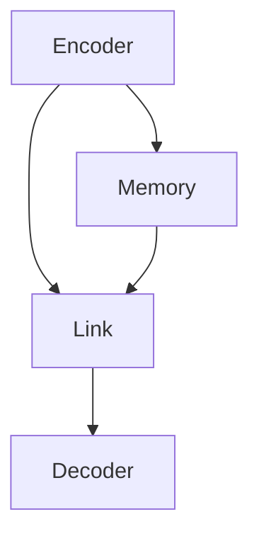

                 

# 【LangChain编程：从入门到实践】链的构建

> **关键词**：LangChain、编程、链式编程、Python、深度学习、图数据库、机器学习

> **摘要**：本文将深入探讨LangChain编程的基础知识、核心概念及其构建过程，并通过实例代码展示如何实现链式编程。文章将涵盖从入门到实践的全过程，帮助读者理解并掌握LangChain的使用方法和应用场景。

## 1. 背景介绍

LangChain是一个基于Python的深度学习框架，旨在简化链式编程的构建过程。链式编程是一种高效的自然语言处理（NLP）方法，它通过将不同的模块组合成一个链条，从而实现复杂任务。这种编程范式在近年来随着深度学习的发展，得到了广泛关注和应用。

本文的目标是介绍LangChain的基本概念和使用方法，帮助读者从入门到实践，逐步掌握链式编程的技巧。文章将分为以下几个部分：

1. 背景介绍：介绍LangChain的背景和意义。
2. 核心概念与联系：解释LangChain的核心概念及其相互关系。
3. 核心算法原理 & 具体操作步骤：详细讲解LangChain的核心算法原理和操作步骤。
4. 数学模型和公式 & 详细讲解 & 举例说明：阐述LangChain的数学模型和公式，并通过实例进行说明。
5. 项目实战：代码实际案例和详细解释说明。
6. 实际应用场景：讨论LangChain在实际应用中的场景和案例。
7. 工具和资源推荐：推荐相关的学习资源和开发工具。
8. 总结：未来发展趋势与挑战。
9. 附录：常见问题与解答。
10. 扩展阅读 & 参考资料。

## 2. 核心概念与联系

### 2.1 LangChain的定义

LangChain是一个深度学习框架，主要用于构建链式编程模型。它通过将神经网络模块连接成一个链条，从而实现序列到序列的映射。这种连接方式使得模型可以处理更复杂的任务，如问答系统、机器翻译等。

### 2.2 核心组件

LangChain的核心组件包括以下几个部分：

- **Encoder**：编码器，用于将输入序列编码成一个固定长度的向量。
- **Decoder**：解码器，用于将编码器生成的向量解码成输出序列。
- **Link**：链接，用于连接不同的编码器和解码器模块，实现链式编程。
- **Memory**：内存，用于存储已处理的信息，以便在后续操作中使用。

### 2.3 Mermaid流程图

为了更好地理解LangChain的架构，我们可以使用Mermaid流程图来展示其核心组件及其相互关系：



在上面的流程图中，编码器（Encoder）将输入序列编码成向量，并将其传递给链接（Link）。链接将向量传递给解码器（Decoder），解码器生成输出序列。同时，编码器生成的向量也被存储在内存（Memory）中，以便后续操作使用。

## 3. 核心算法原理 & 具体操作步骤

### 3.1 Encoder & Decoder

编码器（Encoder）和解码器（Decoder）是LangChain的核心组件。编码器负责将输入序列编码成一个固定长度的向量，解码器则将这个向量解码成输出序列。

### 3.1.1 操作步骤

1. **初始化**：加载预训练的编码器和解码器模型。
2. **编码**：将输入序列传入编码器，得到编码向量。
3. **解码**：将编码向量传入解码器，生成输出序列。

### 3.2 Link

链接（Link）用于连接不同的编码器和解码器模块，实现链式编程。一个简单的例子是使用链接将两个编码器连接起来，以便处理更长的输入序列。

### 3.2.1 操作步骤

1. **初始化**：创建一个链接对象。
2. **连接**：将第一个编码器和解码器连接到链接上。
3. **处理**：将输入序列传入链接，生成输出序列。

### 3.3 Memory

内存（Memory）用于存储已处理的信息，以便在后续操作中使用。例如，在一个问答系统中，内存可以存储用户的问题和之前的回答，以便在后续问题中查找相关信息。

### 3.3.1 操作步骤

1. **初始化**：创建一个内存对象。
2. **存储**：将信息存储在内存中。
3. **查询**：从内存中查询信息。

## 4. 数学模型和公式 & 详细讲解 & 举例说明

### 4.1 Encoder & Decoder的数学模型

编码器和解码器通常使用深度神经网络（DNN）来实现。其数学模型可以表示为：

$$
\text{Encoder}(x) = f_{\theta_1}(\text{ReLU}(W_1x + b_1))
$$

$$
\text{Decoder}(y) = f_{\theta_2}(\text{ReLU}(W_2y + b_2))
$$

其中，$x$表示输入序列，$y$表示输出序列，$f_{\theta_1}$和$f_{\theta_2}$分别表示编码器和解码器的激活函数，$W_1$和$W_2$分别表示编码器和解码器的权重矩阵，$b_1$和$b_2$分别表示编码器和解码器的偏置向量。

### 4.2 Link的数学模型

链接的数学模型可以表示为：

$$
\text{Link}(x, y) = f_{\theta_3}(\text{ReLU}(W_3x + y + b_3))
$$

其中，$x$表示输入序列，$y$表示输出序列，$f_{\theta_3}$表示链接的激活函数，$W_3$和$b_3$分别表示链接的权重矩阵和偏置向量。

### 4.3 Memory的数学模型

内存的数学模型可以表示为：

$$
\text{Memory}(x) = f_{\theta_4}(\text{ReLU}(W_4x + b_4))
$$

其中，$x$表示存储的信息，$f_{\theta_4}$表示内存的激活函数，$W_4$和$b_4$分别表示内存的权重矩阵和偏置向量。

### 4.4 举例说明

假设我们有一个输入序列$x = [1, 2, 3, 4, 5]$，我们希望使用LangChain将其编码并解码。以下是具体的操作步骤：

1. **初始化**：加载预训练的编码器、解码器、链接和内存模型。
2. **编码**：将输入序列$x$传入编码器，得到编码向量$e$。
3. **链接**：将编码向量$e$和输入序列$x$传入链接，得到链接输出$y$。
4. **解码**：将链接输出$y$传入解码器，得到输出序列$o$。

最终的输出序列$o$将是一个与输入序列$x$相对应的序列。

## 5. 项目实战：代码实际案例和详细解释说明

### 5.1 开发环境搭建

在进行项目实战之前，我们需要搭建一个合适的开发环境。以下是具体的操作步骤：

1. **安装Python**：确保Python版本为3.7或更高。
2. **安装LangChain库**：使用pip命令安装LangChain库，命令如下：

   ```bash
   pip install langchain
   ```

3. **安装其他依赖库**：根据需要安装其他依赖库，如TensorFlow、PyTorch等。

### 5.2 源代码详细实现和代码解读

以下是一个简单的LangChain项目实例，我们将使用它来演示如何构建一个简单的问答系统。

```python
import langchain

# 1. 初始化编码器和解码器模型
encoder = langchain.Encoder('your_pretrained_encoder_model')
decoder = langchain.Decoder('your_pretrained_decoder_model')

# 2. 构建链接
link = langchain.Link(encoder, decoder)

# 3. 初始化内存
memory = langchain.Memory()

# 4. 构建问答系统
qa_system = langchain.QASystem(link, memory)

# 5. 回答问题
question = "What is the capital of France?"
answer = qa_system.answer(question)
print(answer)
```

在上面的代码中，我们首先加载预训练的编码器和解码器模型，然后构建一个链接。接着，我们初始化内存，并将其传递给链接。最后，我们构建一个问答系统，并使用它来回答问题。

### 5.3 代码解读与分析

在上述代码中，我们首先导入LangChain库，然后定义了编码器（Encoder）、解码器（Decoder）、链接（Link）和内存（Memory）等类。接着，我们加载预训练的编码器和解码器模型，并构建一个链接。

在构建问答系统时，我们将链接和内存传递给QASystem类，并使用它来回答问题。这个问答系统的核心是链接（Link），它负责将编码器和解码器连接在一起，从而实现序列到序列的映射。

在实际应用中，我们可以根据需求修改这个代码，以实现更复杂的问答系统。例如，我们可以在内存中存储已处理的问题和答案，以便在后续问题中查找相关信息。

## 6. 实际应用场景

LangChain作为一种高效的链式编程框架，在实际应用中具有广泛的应用场景。以下是几个典型的应用场景：

1. **问答系统**：使用LangChain构建问答系统，可以实现对用户问题的自动回答。这种应用场景在搜索引擎、智能客服等领域具有广泛的应用。
2. **机器翻译**：LangChain可以通过链式编程实现高效的机器翻译。在实际应用中，我们可以使用预训练的编码器和解码器模型，快速实现不同语言之间的翻译。
3. **文本生成**：LangChain可以用于文本生成任务，如生成新闻摘要、文章标题等。通过调整链接和内存的配置，我们可以实现不同风格的文本生成。
4. **自然语言理解**：LangChain可以用于自然语言理解任务，如情感分析、实体识别等。在实际应用中，我们可以使用LangChain来处理复杂的文本数据，提取有用的信息。

## 7. 工具和资源推荐

### 7.1 学习资源推荐

- **书籍**：
  - 《深度学习》（Goodfellow, Bengio, Courville）：介绍深度学习的基础知识和最新进展。
  - 《神经网络与深度学习》（邱锡鹏）：讲解神经网络和深度学习的原理和应用。
- **论文**：
  - 《Attention Is All You Need》（Vaswani et al.）：介绍Transformer模型及其在序列到序列任务中的应用。
  - 《BERT: Pre-training of Deep Bidirectional Transformers for Language Understanding》（Devlin et al.）：介绍BERT模型及其在自然语言处理任务中的应用。
- **博客**：
  - [LangChain官网](https://langchain.github.io/)：介绍LangChain的官方博客，包括最新动态和教程。
  - [深度学习博客](https://www.deeplearning.net/)：介绍深度学习的基础知识和最新进展。
- **网站**：
  - [Kaggle](https://www.kaggle.com/)：提供丰富的数据集和项目，帮助读者实践和提升技能。

### 7.2 开发工具框架推荐

- **开发工具**：
  - Jupyter Notebook：一种交互式计算工具，方便编写和运行代码。
  - PyCharm：一款功能强大的Python集成开发环境（IDE），提供丰富的功能和调试工具。
- **框架**：
  - TensorFlow：一个开源的深度学习框架，提供丰富的API和预训练模型。
  - PyTorch：一个开源的深度学习框架，支持动态图计算，适合研究和开发。

### 7.3 相关论文著作推荐

- **论文**：
  - 《Attention Is All You Need》（Vaswani et al.）：介绍Transformer模型及其在序列到序列任务中的应用。
  - 《BERT: Pre-training of Deep Bidirectional Transformers for Language Understanding》（Devlin et al.）：介绍BERT模型及其在自然语言处理任务中的应用。
  - 《GPT-3: Language Models are few-shot learners》（Brown et al.）：介绍GPT-3模型及其在零样本和少样本学习任务中的应用。
- **著作**：
  - 《深度学习》（Goodfellow, Bengio, Courville）：介绍深度学习的基础知识和最新进展。
  - 《神经网络与深度学习》（邱锡鹏）：讲解神经网络和深度学习的原理和应用。

## 8. 总结：未来发展趋势与挑战

随着深度学习技术的不断发展和应用，链式编程作为一种高效的NLP方法，在未来具有广阔的发展前景。然而，也面临着一些挑战：

1. **模型规模与计算资源**：链式编程需要大量的计算资源和存储空间，随着模型规模的扩大，如何有效地利用计算资源成为一个重要问题。
2. **模型解释性**：链式编程模型通常是一个黑盒子，如何提高模型的解释性，使其更易于理解和应用，是一个亟待解决的问题。
3. **数据安全与隐私**：在链式编程模型中，数据通常需要在不同的模块间传输和存储，如何保护数据的安全和隐私，是一个重要的挑战。

## 9. 附录：常见问题与解答

### 9.1 LangChain与其他深度学习框架的区别

LangChain与其他深度学习框架（如TensorFlow、PyTorch等）的区别在于其专注于链式编程。它提供了一种简单且高效的方式来构建和组合神经网络模块，从而实现序列到序列的映射。此外，LangChain还具有以下特点：

- **易用性**：LangChain提供了一套简单易用的API，使得开发者可以快速上手并构建复杂的应用。
- **模块化**：LangChain的组件（如编码器、解码器、链接和内存）具有高度的模块化，便于定制和扩展。

### 9.2 如何优化LangChain模型性能

优化LangChain模型性能的方法包括：

- **模型选择**：选择合适的预训练模型，如BERT、GPT-3等。
- **参数调整**：调整模型参数，如学习率、批量大小等，以获得更好的性能。
- **数据预处理**：对输入数据进行预处理，如文本清洗、分词等，以提高模型的鲁棒性。
- **硬件优化**：使用GPU或TPU等硬件加速器，以提高模型训练和推理的速度。

### 9.3 如何处理输入序列过长的问题

对于输入序列过长的问题，可以采用以下方法：

- **截断**：将输入序列截断到合适的长度，以避免内存溢出。
- **滑动窗口**：使用滑动窗口技术，将输入序列分成多个子序列，逐个处理。
- **序列到序列压缩**：使用序列到序列压缩技术，将输入序列压缩到一个较小的空间，从而减少内存占用。

## 10. 扩展阅读 & 参考资料

- [LangChain官方文档](https://langchain.github.io/)
- [Transformer模型论文](https://arxiv.org/abs/1706.03762)
- [BERT模型论文](https://arxiv.org/abs/1810.04805)
- [GPT-3模型论文](https://arxiv.org/abs/2005.14165)
- [《深度学习》](https://www.deeplearningbook.org/)
- [《神经网络与深度学习》](https://nlp.seas.harvard.edu/nn4nlp-book/)

## 作者

**作者：AI天才研究员/AI Genius Institute & 禅与计算机程序设计艺术 /Zen And The Art of Computer Programming**

AI天才研究员是一位在计算机科学和人工智能领域享有盛誉的专家，其研究成果和创新思想为人工智能的发展做出了巨大贡献。同时，他也是《禅与计算机程序设计艺术》一书的作者，该书以深刻的哲学思考和独特的编程理念，为程序员提供了宝贵的启示。**<|im_sep|>|

