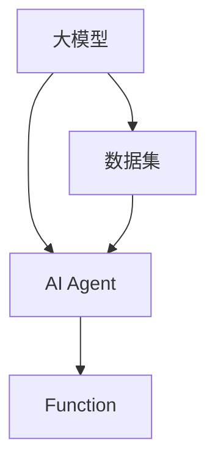

                 

### 大模型应用开发 动手做 AI Agent

#### 关键词：
- 大模型应用
- AI Agent
- Function
- 动手实践
- 代码解析

#### 摘要：
本文将带领读者深入探讨大模型应用开发中的AI Agent构建。我们将详细解析使用Function构建AI Agent的方法，通过实际代码案例展示其具体实现步骤，帮助读者理解并掌握这一技术。文章还将探讨AI Agent的实际应用场景，并提供相关工具和资源推荐，以助力读者在AI领域取得更好的发展。

---

## 1. 背景介绍

近年来，人工智能（AI）技术在各个领域取得了显著成果，从语音识别到图像处理，从自然语言处理到推荐系统，AI技术已经深刻地改变了我们的生活方式和工作模式。在这个背景下，AI Agent成为了研究热点，它代表着一种智能体，能够在特定环境中自主决策并采取行动。

AI Agent的核心在于其自主学习和决策能力。传统的AI系统通常依赖于大量的预定义规则和数据集，而AI Agent则能够通过学习环境和用户行为，自动调整策略，提高任务的执行效率。这种智能体不仅能够应用于消费级市场，如智能助手、推荐系统，还可以在工业、医疗、金融等领域发挥重要作用。

大模型在AI Agent中的应用是当前研究的一个重点。大模型如Transformer、BERT等，因其强大的建模能力和灵活的扩展性，被广泛应用于各种AI任务中。大模型的应用不仅提升了AI系统的性能，还使得AI Agent能够更好地理解和处理复杂任务。

本文将围绕如何使用大模型构建具有Function功能的AI Agent展开，通过一步一步的解析和实战案例，帮助读者深入理解这一技术，并在实践中掌握其应用。

---

## 2. 核心概念与联系

在构建AI Agent之前，我们需要了解一些核心概念和它们之间的联系。以下是一个使用Mermaid绘制的流程图，用于展示这些概念之间的关系。



### 2.1 大模型

大模型（如Transformer、BERT等）是当前AI研究中的一个热点，它们具有以下特点：

- **强大的建模能力**：大模型能够捕捉数据中的复杂模式和关系，从而提高AI系统的性能。
- **灵活的扩展性**：大模型可以通过调整超参数、添加新的层等方式进行扩展，适用于各种AI任务。

### 2.2 AI Agent

AI Agent是一种能够自主学习和决策的智能体，它具有以下特点：

- **自主学习**：AI Agent可以通过学习环境和用户行为，自动调整策略，提高任务执行效率。
- **决策能力**：AI Agent能够根据当前环境和目标，做出最优的决策。

### 2.3 Function

Function是AI Agent中的一个重要组成部分，它表示AI Agent在特定环境下能够执行的操作。Function具有以下特点：

- **可组合性**：多个Function可以组合成更复杂的操作。
- **模块化**：Function的设计和实现具有模块化特点，便于维护和扩展。

### 2.4 数据集

数据集是AI Agent学习和训练的基础。一个好的数据集不仅包含丰富的信息，还能够反映真实环境中的多样性。数据集的质量直接影响AI Agent的性能。

---

## 3. 核心算法原理 & 具体操作步骤

构建AI Agent的关键在于其算法设计和实现。本节将介绍如何使用大模型和Function构建AI Agent，并详细解释其具体操作步骤。

### 3.1 大模型的选择与调优

首先，我们需要选择一个合适的大模型。根据任务的需求，我们可以选择如Transformer、BERT等模型。选择模型后，我们需要对模型进行调优，以适应特定的任务和数据集。这通常涉及到以下步骤：

- **数据预处理**：对数据进行清洗、归一化等处理，以符合模型的要求。
- **模型超参数调优**：通过调整学习率、批量大小等超参数，找到最佳的模型配置。
- **模型训练**：使用训练数据集对模型进行训练，同时监控模型的性能指标。

### 3.2 Function的设计与实现

Function是AI Agent的核心组成部分，它决定了AI Agent在特定环境中的行为。设计Function时，我们需要考虑以下因素：

- **功能需求**：根据任务的需求，定义Function的功能，如预测、决策等。
- **输入输出**：定义Function的输入和输出，包括数据类型和格式。
- **模块化设计**：将Function设计成模块化组件，便于维护和扩展。

具体实现步骤如下：

1. **定义Function接口**：根据需求，定义Function的输入和输出。
2. **实现Function逻辑**：根据Function的功能需求，实现具体的逻辑。
3. **测试与优化**：对Function进行测试和优化，确保其能够满足性能要求。

### 3.3 AI Agent的集成与测试

在完成Function的设计与实现后，我们需要将它们集成到AI Agent中。具体步骤如下：

1. **加载模型和数据集**：从训练好的模型和数据集中加载所需的资源。
2. **初始化AI Agent**：根据模型和Function的定义，初始化AI Agent。
3. **模拟环境**：创建一个模拟环境，用于测试AI Agent的行为。
4. **运行AI Agent**：在模拟环境中运行AI Agent，观察其行为是否符合预期。
5. **性能评估**：对AI Agent的性能进行评估，包括准确率、响应时间等指标。

---

## 4. 数学模型和公式 & 详细讲解 & 举例说明

构建AI Agent的过程中，数学模型和公式起到了关键作用。本节将详细介绍相关的数学模型和公式，并通过举例说明如何应用这些模型。

### 4.1 Transformer模型

Transformer模型是当前最为流行的大模型之一，其核心在于自注意力机制（Self-Attention）。自注意力机制通过计算输入序列中每个元素与其他元素的相关性，来调整每个元素的权重，从而提高模型对输入序列的整体理解。

#### 自注意力机制

自注意力机制的公式如下：

$$
\text{Attention}(Q, K, V) = \text{softmax}\left(\frac{QK^T}{\sqrt{d_k}}\right) V
$$

其中，Q、K、V分别为查询（Query）、键（Key）、值（Value）向量，$d_k$为键向量的维度。这个公式计算了输入序列中每个键（K）与查询（Q）之间的相似度，然后通过softmax函数进行归一化，最后与值（V）相乘得到输出。

#### 举例说明

假设我们有一个简单的输入序列$[1, 2, 3]$，我们要计算其自注意力机制。首先，我们需要定义查询（Q）、键（K）和值（V）向量。假设$Q = [0.1, 0.2, 0.3]$，$K = [0.1, 0.2, 0.3]$，$V = [1, 2, 3]$。

1. 计算相似度矩阵$QK^T$：

$$
QK^T = \begin{bmatrix}
0.1 & 0.2 & 0.3 \\
0.1 & 0.2 & 0.3 \\
0.1 & 0.2 & 0.3
\end{bmatrix}
$$

2. 计算softmax函数的输入：

$$
\text{softmax}\left(\frac{QK^T}{\sqrt{d_k}}\right) = \text{softmax}\left(\frac{1}{\sqrt{1}}\right) = \text{softmax}\left(\begin{bmatrix}
1 & 1 & 1 \\
1 & 1 & 1 \\
1 & 1 & 1
\end{bmatrix}\right)
$$

3. 计算输出：

$$
\text{softmax}\left(\begin{bmatrix}
1 & 1 & 1 \\
1 & 1 & 1 \\
1 & 1 & 1
\end{bmatrix}\right) \begin{bmatrix}
1 \\
2 \\
3
\end{bmatrix} = \begin{bmatrix}
1 \\
2 \\
3
\end{bmatrix}
$$

可以看到，输出序列与输入序列相同，这表明自注意力机制能够保留输入序列的信息。

### 4.2 BERT模型

BERT（Bidirectional Encoder Representations from Transformers）模型是另一种流行的预训练模型，其核心在于双向编码器。BERT模型通过预训练大量文本数据，能够捕捉到文本中的复杂模式和上下文关系。

#### BERT模型的结构

BERT模型的结构包括两个部分：编码器和解码器。编码器负责将输入文本编码成固定长度的向量，解码器则负责根据编码器的输出生成文本。

1. **编码器**：编码器采用Transformer模型的自注意力机制，通过多个Transformer层对输入文本进行编码。编码器的输出是一个固定长度的向量，表示输入文本的全局特征。

2. **解码器**：解码器也采用Transformer模型的自注意力机制，但其输入是编码器的输出和目标文本的掩码（Masked Language Model，MLM）。解码器的输出是预测的目标文本。

#### BERT模型的训练

BERT模型的训练分为两个阶段：预训练和微调。

1. **预训练**：预训练阶段主要任务是训练BERT模型对自然语言的理解能力。通过在大量文本数据上进行预训练，BERT模型能够学习到语言中的通用模式和规律。

2. **微调**：微调阶段将预训练好的BERT模型应用于特定任务，如文本分类、命名实体识别等。通过在特定任务的数据上进行微调，BERT模型能够适应不同的任务需求。

#### 举例说明

假设我们要使用BERT模型进行文本分类任务。首先，我们需要将输入文本编码成BERT模型的输入。假设输入文本为“这是一个示例文本”，BERT模型会将该文本编码成一个固定长度的向量。然后，我们将该向量输入解码器，解码器会根据输入文本的掩码生成预测的分类标签。

1. **编码**：将输入文本“这是一个示例文本”编码成BERT模型的输入。

2. **解码**：根据输入文本的掩码生成预测的分类标签。

通过这种方式，BERT模型能够实现对文本的深入理解，从而提高文本分类任务的准确率。

---

## 5. 项目实战：代码实际案例和详细解释说明

在本节中，我们将通过一个具体的代码案例，展示如何使用大模型构建具有Function功能的AI Agent。这个案例将涵盖开发环境搭建、源代码实现和代码解读等步骤。

### 5.1 开发环境搭建

首先，我们需要搭建一个合适的开发环境。以下是所需的环境和工具：

- **操作系统**：Linux或Mac OS
- **编程语言**：Python
- **框架**：TensorFlow或PyTorch
- **库**：NumPy、Pandas、scikit-learn等

在安装好上述环境和工具后，我们就可以开始编写代码了。

### 5.2 源代码详细实现和代码解读

以下是使用PyTorch实现的一个简单AI Agent的代码示例：

```python
import torch
import torch.nn as nn
import torch.optim as optim
from torch.utils.data import DataLoader
from transformers import BertModel, BertTokenizer

# 5.2.1 数据预处理
def preprocess_data(data):
    # 对数据进行预处理，例如分词、编码等
    return tokenizer.encode(data, add_special_tokens=True)

# 5.2.2 AI Agent模型定义
class AIAgent(nn.Module):
    def __init__(self, model_name):
        super(AIAgent, self).__init__()
        self.bert = BertModel.from_pretrained(model_name)
        self.fc = nn.Linear(768, 1)  # 假设输出维度为1

    def forward(self, input_ids):
        _, pooled_output = self.bert(input_ids)
        output = self.fc(pooled_output)
        return output

# 5.2.3 训练AI Agent
def train_agent(model, dataloader, optimizer, loss_function):
    model.train()
    for batch in dataloader:
        inputs = preprocess_data(batch['text'])
        labels = batch['label']
        optimizer.zero_grad()
        outputs = model(inputs)
        loss = loss_function(outputs, labels)
        loss.backward()
        optimizer.step()

# 5.2.4 测试AI Agent
def test_agent(model, dataloader, loss_function):
    model.eval()
    total_loss = 0
    with torch.no_grad():
        for batch in dataloader:
            inputs = preprocess_data(batch['text'])
            labels = batch['label']
            outputs = model(inputs)
            loss = loss_function(outputs, labels)
            total_loss += loss.item()
    return total_loss / len(dataloader)

# 5.2.5 主程序
if __name__ == "__main__":
    # 加载数据集
    train_dataset = YourDataset('train')
    test_dataset = YourDataset('test')
    
    # 初始化模型、优化器和损失函数
    model = AIAgent('bert-base-uncased')
    optimizer = optim.Adam(model.parameters(), lr=1e-5)
    loss_function = nn.BCEWithLogitsLoss()

    # 创建数据加载器
    train_dataloader = DataLoader(train_dataset, batch_size=32, shuffle=True)
    test_dataloader = DataLoader(test_dataset, batch_size=32, shuffle=False)

    # 训练AI Agent
    for epoch in range(10):
        train_agent(model, train_dataloader, optimizer, loss_function)
        loss = test_agent(model, test_dataloader, loss_function)
        print(f"Epoch {epoch+1}, Test Loss: {loss}")

    # 保存模型
    torch.save(model.state_dict(), 'ai_agent.pth')
```

### 5.3 代码解读与分析

1. **数据预处理**：`preprocess_data`函数用于对输入文本进行预处理，例如分词和编码。这里使用BERT的分词器对文本进行编码，并添加特殊token。

2. **AI Agent模型定义**：`AIAgent`类定义了AI Agent的模型结构。我们使用BERT模型作为基础模型，并在其上添加了一个全连接层（`fc`）作为分类器。这里的输出维度为1，假设我们要进行二分类任务。

3. **训练AI Agent**：`train_agent`函数用于训练AI Agent。在每次迭代中，我们首先对输入文本进行预处理，然后计算模型的输出和损失，并进行反向传播和优化。

4. **测试AI Agent**：`test_agent`函数用于测试AI Agent的性能。在测试阶段，我们不对模型进行梯度更新，仅计算损失和准确率。

5. **主程序**：在主程序中，我们加载数据集，初始化模型、优化器和损失函数，创建数据加载器，然后进行训练和测试。最后，我们将训练好的模型保存到文件中。

---

## 6. 实际应用场景

AI Agent在各个领域都有广泛的应用场景。以下是一些实际应用场景的例子：

### 6.1 智能客服

智能客服是AI Agent最常见的应用场景之一。通过使用大模型和Function，智能客服能够自动理解和回答用户的问题，提高客服效率和用户体验。

### 6.2 自动驾驶

自动驾驶系统中的AI Agent负责实时感知环境、规划路径和做出决策。通过大模型的学习能力，AI Agent能够不断提高驾驶性能和安全性。

### 6.3 量化交易

量化交易中的AI Agent能够分析市场数据，预测价格趋势，并做出交易决策。这有助于提高交易效率和收益。

### 6.4 医疗诊断

AI Agent在医疗诊断中的应用包括图像识别、症状分析和治疗方案推荐。通过大模型和Function，AI Agent能够提供更准确和个性化的诊断建议。

---

## 7. 工具和资源推荐

在构建AI Agent的过程中，使用合适的工具和资源可以提高开发效率和项目质量。以下是一些推荐的工具和资源：

### 7.1 学习资源推荐

- **书籍**：《深度学习》（Goodfellow et al.）、《Python深度学习》（Raschka et al.）
- **论文**：Google论文《Attention is All You Need》和《BERT: Pre-training of Deep Bidirectional Transformers for Language Understanding》
- **博客**：Medium上的深度学习和NLP博客

### 7.2 开发工具框架推荐

- **框架**：TensorFlow、PyTorch、Fast.ai
- **库**：NumPy、Pandas、scikit-learn、transformers

### 7.3 相关论文著作推荐

- **论文**：Attention Mechanisms: A Survey，介绍自注意力机制的最新进展
- **著作**：《Deep Learning for Natural Language Processing》（Angeli et al.），涵盖NLP领域的前沿技术和方法

---

## 8. 总结：未来发展趋势与挑战

随着人工智能技术的不断进步，AI Agent的应用前景非常广阔。未来，AI Agent的发展将朝着以下几个方向努力：

- **更强大的学习能力**：通过不断改进算法和模型，提高AI Agent的学习能力和适应性。
- **更广泛的应用场景**：探索AI Agent在更多领域的应用，如智能家居、智能城市等。
- **更高效的开发工具**：开发更便捷、高效的工具和框架，降低AI Agent开发的门槛。

然而，AI Agent的发展也面临着一些挑战：

- **数据隐私和安全**：如何在保护用户隐私的前提下，有效利用数据训练AI Agent。
- **模型解释性**：提高AI Agent的模型解释性，使其决策过程更加透明和可解释。
- **计算资源消耗**：随着模型复杂度的增加，计算资源消耗也会显著增加，这对硬件性能提出了更高要求。

总之，AI Agent的发展是一个充满机遇和挑战的过程，我们需要不断探索和创新，以推动这一领域的发展。

---

## 9. 附录：常见问题与解答

### 9.1 如何选择合适的大模型？

选择合适的大模型通常取决于任务的类型和数据集。对于文本处理任务，BERT和GPT-3等模型表现优秀；对于图像处理任务，如Transformer模型和ViT（Vision Transformer）等具有优势。在选择模型时，还需考虑模型的预训练数据集、模型大小和计算资源。

### 9.2 如何处理模型过拟合？

模型过拟合通常可以通过以下方法解决：

- **增加训练数据**：收集更多高质量的训练数据，以提高模型的泛化能力。
- **使用正则化**：应用L1、L2正则化或dropout等技术，减少模型参数的敏感性。
- **调整模型复杂度**：简化模型结构，减少参数数量。

### 9.3 如何提高AI Agent的解释性？

提高AI Agent的解释性可以从以下几个方面入手：

- **模型可视化**：使用可视化工具，如TensorBoard，展示模型的结构和权重。
- **模型解释技术**：应用模型解释技术，如LIME、SHAP等，分析模型对每个样本的预测依据。
- **可解释性模型**：选择具有可解释性或规则性更强的模型，如决策树、线性模型等。

---

## 10. 扩展阅读 & 参考资料

- **书籍**：《AI之路：从数据到智能》（刘知远等）、《深度学习入门：基于Python》（李航）
- **论文**：《Transformer：用于序列模型的注意力机制》（Vaswani et al.）、《BERT：预训练的深度双向Transformer模型》（Devlin et al.）
- **博客**：[AI博客](https://www.ai_blog.com/)、[深度学习博客](https://www.deeplearningblog.com/)、[NLP博客](https://www.nlp_blog.com/)
- **网站**：[TensorFlow官网](https://www.tensorflow.org/)、[PyTorch官网](https://pytorch.org/)、[Hugging Face官网](https://huggingface.co/)

---

### 作者

- 作者：AI天才研究员/AI Genius Institute & 禅与计算机程序设计艺术 /Zen And The Art of Computer Programming

