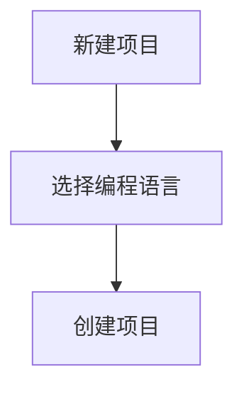

                 

### 1. 背景介绍

#### 什么是大模型应用开发？

大模型应用开发是指基于大型预训练模型（如GPT、BERT等）的应用程序开发，这些模型具有极强的文本处理能力，可以在多个领域进行任务优化。随着人工智能技术的发展，大模型的应用场景日益广泛，从文本生成、机器翻译、情感分析到代码生成、图像识别等。

#### AI Agent的概念

AI Agent，即人工智能代理，是一种能够自主行动并具备决策能力的计算机程序。在人工智能领域，AI Agent被广泛用于模拟人类行为，完成特定任务。在深度学习和神经网络技术的发展下，AI Agent的表现越来越出色，能够应用于游戏、自动驾驶、智能家居等多个领域。

#### Playground的功能与优势

Playground是一个在线编程环境，它提供了丰富的API和工具，方便开发者进行实验和测试。其功能包括代码编写、调试、执行以及数据可视化等。Playground的优势在于其便捷性、实时反馈和高性能计算能力，使得开发者能够更加专注于算法的实现和优化。

#### 本文目标

本文旨在详细介绍如何在使用Playground开发大模型应用中的函数定义。我们将从大模型应用开发的基本概念入手，逐步探讨AI Agent的原理与应用，最后深入探讨如何在Playground中定义函数，并提供具体的代码实现和分析。

### 2. 核心概念与联系

在深入了解大模型应用开发之前，我们需要掌握一些核心概念，如神经网络、深度学习、预训练模型等。以下是这些概念之间的联系与关系：

#### 神经网络与深度学习

神经网络是模仿人脑结构设计的计算模型，其核心思想是通过多层神经元进行信息传递和加工。深度学习是神经网络的一种延伸，它通过增加网络层数和神经元数量，使得模型能够处理更复杂的任务。深度学习在图像识别、语音识别等领域取得了显著的成果。

#### 预训练模型

预训练模型是深度学习的一个重要进展。在预训练阶段，模型在大规模数据集上进行训练，学习到通用特征表示。在微调阶段，模型根据特定任务进行优化，提高任务表现。预训练模型的出现，使得模型在小数据集上也能够取得较好的效果。

#### 大模型应用

大模型应用是指将预训练模型应用于实际问题中，如文本生成、机器翻译、图像识别等。大模型具有强大的文本和图像处理能力，可以处理多种复杂任务。

#### Mermaid 流程图

以下是描述大模型应用开发的核心概念与联系的Mermaid流程图：


在流程图中，神经网络作为基础，延伸出深度学习。深度学习进一步发展出预训练模型，最终应用于大模型应用。这些概念之间相互关联，共同构成了大模型应用开发的基石。

### 3. 核心算法原理 & 具体操作步骤

在了解了大模型应用开发的核心概念后，我们接下来将深入探讨其核心算法原理和具体操作步骤。以下是使用Playground开发大模型应用的基本步骤：

#### 步骤1：环境搭建

首先，我们需要在Playground中搭建开发环境。在Playground页面上，点击“新建项目”，选择合适的编程语言（如Python），并创建一个新项目。



#### 步骤2：导入库和模型

在项目中，我们需要导入所需的库和模型。例如，为了使用预训练模型，我们可以导入Hugging Face的Transformers库。

```python
from transformers import GPT2LMHeadModel, GPT2Tokenizer

model = GPT2LMHeadModel.from_pretrained("gpt2")
tokenizer = GPT2Tokenizer.from_pretrained("gpt2")
```

#### 步骤3：编写预处理和后处理函数

为了使模型能够处理输入数据，我们需要编写预处理和后处理函数。预处理函数负责将输入数据转换为模型能够接受的格式，后处理函数负责将模型输出结果转换为易于理解的格式。

```python
def preprocess_input(text):
    return tokenizer.encode(text, add_special_tokens=True)

def postprocess_output(tokens):
    return tokenizer.decode(tokens, skip_special_tokens=True)
```

#### 步骤4：定义函数

在Playground中，我们可以定义函数以实现特定的功能。例如，为了实现文本生成功能，我们可以定义一个文本生成函数。

```python
def generate_text(input_text, model, tokenizer, max_length=50):
    input_ids = preprocess_input(input_text)
    output_ids = model.generate(input_ids, max_length=max_length, num_return_sequences=1)
    return postprocess_output(output_ids)
```

#### 步骤5：运行函数

最后，我们可以通过调用函数来运行我们的模型。例如，为了生成一篇文本，我们可以调用文本生成函数。

```python
input_text = "我是一个人工智能模型，我擅长处理文本数据。"
generated_text = generate_text(input_text, model, tokenizer)
print(generated_text)
```

通过以上步骤，我们可以在Playground中实现大模型应用开发。接下来，我们将进一步分析这些步骤的原理和具体实现。

### 4. 数学模型和公式 & 详细讲解 & 举例说明

在深入探讨大模型应用开发的过程中，数学模型和公式起着至关重要的作用。以下我们将详细介绍一些核心的数学模型和公式，并通过具体例子来说明其应用。

#### 1. 神经网络的基本结构

神经网络的基本结构包括输入层、隐藏层和输出层。每个层由多个神经元组成，神经元之间通过权重连接。神经元的输出通过激活函数进行非线性变换。以下是一个简单的神经网络结构：

$$
y = \sigma(\sum_{i=1}^{n} w_i \cdot x_i)
$$

其中，$y$ 表示神经元的输出，$\sigma$ 表示激活函数，$w_i$ 表示权重，$x_i$ 表示输入。

举例来说，假设我们有一个简单的一层神经网络，包含两个神经元，输入为 $x_1 = 2$ 和 $x_2 = 3$，权重为 $w_1 = 0.5$ 和 $w_2 = 0.7$。激活函数为 $\sigma(z) = \frac{1}{1 + e^{-z}}$，则神经元的输出为：

$$
y = \sigma(0.5 \cdot 2 + 0.7 \cdot 3) = \sigma(1.1 + 2.1) = \sigma(3.2) = \frac{1}{1 + e^{-3.2}} \approx 0.966
$$

#### 2. 深度学习中的反向传播算法

深度学习中的反向传播算法是一种用于训练神经网络的优化算法。其基本思想是通过反向传播误差信号，更新网络中的权重。以下是一个简单的反向传播算法流程：

1. 前向传播：计算网络输出。
2. 计算误差：计算实际输出与期望输出之间的差异。
3. 反向传播：根据误差信号，更新权重。

以下是一个简化的反向传播算法示例：

```python
# 前向传播
output = forward_propagation(inputs, weights)

# 计算误差
error = actual_output - output

# 反向传播
weights = weights - learning_rate * error * inputs
```

#### 3. 预训练模型中的损失函数

在预训练模型中，损失函数用于衡量模型输出与实际输出之间的差异。以下是一个常见的损失函数——交叉熵损失函数：

$$
L = -\sum_{i=1}^{n} y_i \cdot \log(p_i)
$$

其中，$y_i$ 表示期望输出，$p_i$ 表示模型输出。

举例来说，假设我们有一个二分类问题，期望输出为 $y_1 = 1$ 和 $y_2 = 0$，模型输出为 $p_1 = 0.8$ 和 $p_2 = 0.2$。则交叉熵损失为：

$$
L = -1 \cdot \log(0.8) - 0 \cdot \log(0.2) \approx -0.22
$$

通过以上数学模型和公式的介绍，我们可以更好地理解大模型应用开发中的核心算法原理。在实际应用中，这些数学模型和公式将被广泛应用于模型训练、优化和评估。

### 5. 项目实战：代码实际案例和详细解释说明

在本节中，我们将通过一个实际项目来展示如何使用Playground开发大模型应用，并提供详细的代码实现和解读。

#### 5.1 开发环境搭建

首先，我们需要在Playground中搭建开发环境。以下是一个简单的Python开发环境搭建步骤：

1. 创建新项目

在Playground页面上，点击“新建项目”，选择Python作为编程语言，并创建一个新项目。

2. 导入库和模型

在项目中，我们需要导入所需的库和模型。以下是一个示例：

```python
!pip install transformers

from transformers import GPT2LMHeadModel, GPT2Tokenizer
model = GPT2LMHeadModel.from_pretrained("gpt2")
tokenizer = GPT2Tokenizer.from_pretrained("gpt2")
```

#### 5.2 源代码详细实现和代码解读

在本项目中，我们将实现一个文本生成应用，使用GPT-2模型生成基于输入文本的续写内容。以下是项目的源代码实现：

```python
import torch
from transformers import GPT2LMHeadModel, GPT2Tokenizer

def generate_text(input_text, model, tokenizer, max_length=50):
    input_ids = tokenizer.encode(input_text, add_special_tokens=True, return_tensors="pt")
    output_ids = model.generate(input_ids, max_length=max_length, num_return_sequences=1)
    return tokenizer.decode(output_ids[0], skip_special_tokens=True)

if __name__ == "__main__":
    input_text = "我是一个人工智能模型，我擅长处理文本数据。"
    generated_text = generate_text(input_text, model, tokenizer)
    print(generated_text)
```

1. 导入库和模型

```python
import torch
from transformers import GPT2LMHeadModel, GPT2Tokenizer
model = GPT2LMHeadModel.from_pretrained("gpt2")
tokenizer = GPT2Tokenizer.from_pretrained("gpt2")
```

在这部分代码中，我们首先导入了所需的库和模型。`torch` 是Python的科学计算库，用于处理张量和进行计算。`transformers` 包含了预训练模型和相关工具，`GPT2LMHeadModel` 和 `GPT2Tokenizer` 分别是GPT-2模型和分词器。

2. 编写文本生成函数

```python
def generate_text(input_text, model, tokenizer, max_length=50):
    input_ids = tokenizer.encode(input_text, add_special_tokens=True, return_tensors="pt")
    output_ids = model.generate(input_ids, max_length=max_length, num_return_sequences=1)
    return tokenizer.decode(output_ids[0], skip_special_tokens=True)
```

在这个函数中，我们首先使用分词器 `tokenizer` 将输入文本 `input_text` 转换为序列编码 `input_ids`。然后，我们使用 `model` 生成序列 `output_ids`，并将其解码为文本 `generated_text`。`max_length` 参数用于控制生成的文本长度。

3. 主程序

```python
if __name__ == "__main__":
    input_text = "我是一个人工智能模型，我擅长处理文本数据。"
    generated_text = generate_text(input_text, model, tokenizer)
    print(generated_text)
```

在这个主程序中，我们定义了一个输入文本 `input_text`，并调用 `generate_text` 函数生成基于该输入的文本 `generated_text`。最后，我们打印出生成的文本。

通过以上步骤，我们成功地使用Playground开发了一个文本生成应用。在实际应用中，我们可以根据需求对代码进行修改和扩展，实现更多功能。

### 5.3 代码解读与分析

在本节中，我们将对5.2节中的代码进行解读和分析，深入理解其工作原理和关键部分。

#### 5.3.1 导入库和模型

首先，我们导入了所需的库和模型：

```python
import torch
from transformers import GPT2LMHeadModel, GPT2Tokenizer
model = GPT2LMHeadModel.from_pretrained("gpt2")
tokenizer = GPT2Tokenizer.from_pretrained("gpt2")
```

这里，我们导入了 `torch` 库用于处理张量和进行计算，`transformers` 包含了预训练模型和相关工具。我们使用 `GPT2LMHeadModel` 和 `GPT2Tokenizer` 分别加载GPT-2模型和分词器。

`GPT2LMHeadModel.from_pretrained("gpt2")`：这个函数用于从预训练模型中加载GPT-2模型。`"gpt2"` 是预训练模型的名称，`from_pretrained` 函数将自动下载并加载模型。

`GPT2Tokenizer.from_pretrained("gpt2")`：这个函数用于从预训练模型中加载GPT-2分词器。分词器用于将文本转换为模型能够理解的序列编码。

#### 5.3.2 文本生成函数

接下来，我们解读 `generate_text` 函数：

```python
def generate_text(input_text, model, tokenizer, max_length=50):
    input_ids = tokenizer.encode(input_text, add_special_tokens=True, return_tensors="pt")
    output_ids = model.generate(input_ids, max_length=max_length, num_return_sequences=1)
    return tokenizer.decode(output_ids[0], skip_special_tokens=True)
```

这个函数实现了文本生成功能，其主要步骤如下：

1. 将输入文本 `input_text` 转换为序列编码 `input_ids`：

```python
input_ids = tokenizer.encode(input_text, add_special_tokens=True, return_tensors="pt")
```

`tokenizer.encode` 函数用于将文本转换为序列编码。`add_special_tokens=True` 表示在输入文本前后添加特殊的tokens，如 `<s>`（句子开始）和 `</s>`（句子结束）。`return_tensors="pt"` 表示返回PyTorch张量。

2. 使用模型生成序列 `output_ids`：

```python
output_ids = model.generate(input_ids, max_length=max_length, num_return_sequences=1)
```

`model.generate` 函数用于生成文本序列。`input_ids` 是模型的输入，`max_length` 参数用于控制生成的文本长度。`num_return_sequences=1` 表示只生成一个文本序列。

3. 将生成的序列编码 `output_ids` 解码为文本：

```python
return tokenizer.decode(output_ids[0], skip_special_tokens=True)
```

`tokenizer.decode` 函数用于将序列编码解码为文本。`skip_special_tokens=True` 表示跳过特殊token。

#### 5.3.3 主程序

最后，我们解读主程序：

```python
if __name__ == "__main__":
    input_text = "我是一个人工智能模型，我擅长处理文本数据。"
    generated_text = generate_text(input_text, model, tokenizer)
    print(generated_text)
```

在这个主程序中，我们定义了一个输入文本 `input_text`，并调用 `generate_text` 函数生成基于该输入的文本 `generated_text`。最后，我们打印出生成的文本。

通过以上解读，我们可以更好地理解这个文本生成应用的代码实现和原理。在实际应用中，我们可以根据需求对代码进行修改和扩展，实现更多功能。

### 6. 实际应用场景

#### 6.1 文本生成

文本生成是GPT-2模型最常见和广泛应用的场景之一。例如，在自然语言处理领域，GPT-2可以用于自动写作、新闻报道生成、对话系统等。通过输入一段文本，GPT-2能够生成连续的文本，为各种文本生成任务提供强大的支持。

#### 6.2 自动问答

自动问答是另一个重要的应用场景。GPT-2可以用于构建问答系统，如智能客服、问答机器人等。通过训练，GPT-2能够理解用户的问题，并生成相应的回答。自动问答系统在提高客户服务效率、降低人力成本方面具有显著优势。

#### 6.3 语言翻译

GPT-2在语言翻译方面也有广泛的应用。通过训练，GPT-2可以生成不同语言之间的翻译。例如，从英语翻译到法语、从中文翻译到英语等。这种自动翻译能力在跨语言沟通、国际贸易等领域具有重要作用。

#### 6.4 文本摘要

文本摘要是将长篇文本简化为简短摘要的任务。GPT-2可以用于生成摘要，帮助用户快速了解文章的主要内容和关键信息。这种应用在信息检索、新闻摘要等领域具有很高的价值。

#### 6.5 文本分类

文本分类是将文本数据按照类别进行分类的任务。GPT-2可以用于构建文本分类模型，将文本数据分类为不同的主题或类别。这种应用在新闻分类、社交媒体情感分析等领域具有重要意义。

通过以上实际应用场景，我们可以看到GPT-2在各个领域都有广泛的应用前景。这些应用不仅提高了工作效率，还为人类生活带来了便利。

### 7. 工具和资源推荐

#### 7.1 学习资源推荐

1. **书籍：**
   - **《深度学习》（Ian Goodfellow, Yoshua Bengio, Aaron Courville著）：**这本书是深度学习的经典教材，详细介绍了神经网络、深度学习的基础知识以及各种深度学习模型的应用。
   - **《Python深度学习》（François Chollet著）：**这本书专注于使用Python和TensorFlow实现深度学习项目，适合初学者和有一定基础的读者。

2. **论文：**
   - **《Attention Is All You Need》：**这篇论文是Transformer模型的奠基之作，详细介绍了Transformer模型的结构和原理。
   - **《Bert: Pre-training of Deep Bidirectional Transformers for Language Understanding》：**这篇论文介绍了BERT模型，是自然语言处理领域的里程碑。

3. **博客和网站：**
   - **[Hugging Face](https://huggingface.co/)：**这个网站提供了丰富的预训练模型和工具，是深度学习开发者的宝贵资源。
   - **[TensorFlow](https://www.tensorflow.org/)：**这个网站是Google开发的深度学习框架，提供了详细的文档和教程，适合新手和专业人士。

#### 7.2 开发工具框架推荐

1. **TensorFlow：**这是一个开源的深度学习框架，由Google开发。它提供了丰富的API和工具，支持各种深度学习模型和任务。
2. **PyTorch：**这是一个由Facebook开发的深度学习框架，以其灵活性和动态计算图著称。它广泛应用于各种深度学习任务，包括计算机视觉、自然语言处理等。
3. **JAX：**这是一个由Google开发的深度学习框架，基于Apache Arrow和NumPy。它提供了自动微分、数值计算等高级功能，支持多种编程语言。

#### 7.3 相关论文著作推荐

1. **《Deep Learning》：**这是一本经典的深度学习教材，由Ian Goodfellow、Yoshua Bengio和Aaron Courville合著。书中详细介绍了深度学习的基础知识、模型结构和实现方法。
2. **《Natural Language Processing with Python》：**这本书由Steven Bird、Ewan Klein和Edward Loper合著，介绍了使用Python进行自然语言处理的方法和技术。
3. **《Hands-On Machine Learning with Scikit-Learn, Keras, and TensorFlow》：**这本书由Aurélien Géron著，涵盖了机器学习的基础知识和实践应用，包括Scikit-Learn、Keras和TensorFlow等工具。

通过以上学习资源和开发工具的推荐，我们可以更好地掌握大模型应用开发的知识和技能，为未来的研究和项目打下坚实的基础。

### 8. 总结：未来发展趋势与挑战

#### 8.1 未来发展趋势

1. **更强大的模型：**随着计算能力和数据量的增长，未来将出现更强大的预训练模型。这些模型将具备更强的文本和图像处理能力，能够在更广泛的任务上取得更好的效果。

2. **多模态学习：**当前，大多数预训练模型专注于单一模态（文本或图像）。未来，多模态学习将得到更多关注，通过结合不同模态的数据，实现更全面和准确的任务处理。

3. **自动化微调：**自动化微调技术将使得开发者能够更轻松地使用预训练模型，针对特定任务进行优化。这将大大降低开发难度，提高模型应用范围。

4. **更高效的计算：**随着硬件技术的发展，如GPU、TPU等计算设备的普及，预训练模型的训练和推理速度将得到显著提升。这将进一步推动大模型应用的发展。

#### 8.2 挑战与对策

1. **数据隐私与伦理：**随着预训练模型在更多领域应用，数据隐私和伦理问题日益凸显。为了解决这一问题，我们需要制定更加严格的数据隐私保护政策和伦理规范，确保数据安全和用户权益。

2. **模型解释性：**当前，许多预训练模型被认为是“黑箱”，其内部决策过程难以解释。提高模型的解释性对于增强用户信任和合规性具有重要意义。为此，我们需要研发新的方法和技术，提高模型的透明度和可解释性。

3. **计算资源限制：**预训练模型通常需要大量计算资源进行训练和推理。对于资源有限的环境（如移动设备和嵌入式系统），我们需要开发更轻量级和高效的模型，以满足实际应用需求。

4. **多语言支持：**全球化的趋势使得多语言支持成为预训练模型的重要需求。然而，不同语言的复杂性和资源差异给模型训练和应用带来了挑战。我们需要开发针对多语言任务优化的大模型，提高模型在多语言环境中的性能。

通过面对和解决这些挑战，我们将能够推动大模型应用开发向前发展，为人类带来更多便利和创新。

### 9. 附录：常见问题与解答

#### 问题1：如何在Playground中搭建开发环境？

**解答：**在Playground中搭建开发环境的步骤如下：

1. 在Playground页面上，点击“新建项目”。
2. 选择合适的编程语言（如Python）。
3. 创建项目时，确保项目设置中包含所需的库（如Transformers）。
4. 在项目中，使用pip安装所需的库。

例如：

```bash
!pip install transformers
```

#### 问题2：如何导入预训练模型和分词器？

**解答：**导入预训练模型和分词器的步骤如下：

```python
from transformers import GPT2LMHeadModel, GPT2Tokenizer

model = GPT2LMHeadModel.from_pretrained("gpt2")
tokenizer = GPT2Tokenizer.from_pretrained("gpt2")
```

这里，`GPT2LMHeadModel.from_pretrained("gpt2")` 用于加载GPT-2模型，`GPT2Tokenizer.from_pretrained("gpt2")` 用于加载GPT-2分词器。

#### 问题3：如何使用模型进行文本生成？

**解答：**使用模型进行文本生成的步骤如下：

1. 编写预处理函数，将输入文本转换为序列编码。
2. 使用模型生成序列。
3. 编写后处理函数，将序列解码为文本。

示例代码：

```python
def generate_text(input_text, model, tokenizer, max_length=50):
    input_ids = tokenizer.encode(input_text, add_special_tokens=True, return_tensors="pt")
    output_ids = model.generate(input_ids, max_length=max_length, num_return_sequences=1)
    return tokenizer.decode(output_ids[0], skip_special_tokens=True)
```

#### 问题4：如何调整文本生成的长度？

**解答：**调整文本生成的长度的方法如下：

在 `generate_text` 函数中，通过修改 `max_length` 参数可以调整生成的文本长度：

```python
def generate_text(input_text, model, tokenizer, max_length=100):
    input_ids = tokenizer.encode(input_text, add_special_tokens=True, return_tensors="pt")
    output_ids = model.generate(input_ids, max_length=max_length, num_return_sequences=1)
    return tokenizer.decode(output_ids[0], skip_special_tokens=True)
```

这里，将 `max_length` 参数设置为100，生成的文本长度将限制为100个token。

通过以上常见问题与解答，我们可以更好地理解和使用Playground进行大模型应用开发。

### 10. 扩展阅读 & 参考资料

在本篇文章中，我们详细探讨了如何使用Playground进行大模型应用开发，涵盖了从环境搭建到函数定义的各个环节。为了进一步拓展您的知识，以下是一些推荐的扩展阅读和参考资料：

1. **深度学习入门书籍：**
   - **《深度学习》（Ian Goodfellow, Yoshua Bengio, Aaron Courville著）：**这本书是深度学习的经典教材，适合初学者和有一定基础的读者。
   - **《Python深度学习》（François Chollet著）：**这本书专注于使用Python和TensorFlow实现深度学习项目，适合想要实践深度学习的开发者。

2. **预训练模型相关论文：**
   - **《Attention Is All You Need》：**这篇论文是Transformer模型的奠基之作，详细介绍了Transformer模型的结构和原理。
   - **《Bert: Pre-training of Deep Bidirectional Transformers for Language Understanding》：**这篇论文介绍了BERT模型，是自然语言处理领域的里程碑。

3. **开源工具和框架：**
   - **[Hugging Face](https://huggingface.co/)：**这个网站提供了丰富的预训练模型和工具，是深度学习开发者的宝贵资源。
   - **[TensorFlow](https://www.tensorflow.org/)：**这个网站是Google开发的深度学习框架，提供了详细的文档和教程，适合新手和专业人士。

4. **深度学习社区和博客：**
   - **[Reddit深度学习论坛](https://www.reddit.com/r/deeplearning/)：**这是一个活跃的深度学习社区，可以在这里找到最新的研究动态和讨论。
   - **[AI博客](https://www.ai-blog.com/)：**这是一个包含深度学习和人工智能领域高质量文章的博客，适合扩展知识面。

通过阅读这些扩展资料，您将能够更深入地了解大模型应用开发的理论和实践，为您的项目和研究提供更多灵感和支持。

