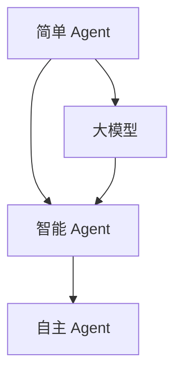

                 

# 【大模型应用开发 动手做AI Agent】大模型出现之前的Agent

> **关键词：** 人工智能，Agent，大模型，应用开发，编程实践

> **摘要：** 本文将探讨在大模型普及之前，如何动手开发一个AI Agent。我们将从背景介绍开始，深入核心概念、算法原理、数学模型，并通过实际代码案例进行详细讲解。文章还将涉及应用场景、工具推荐以及总结未来发展趋势与挑战。

## 1. 背景介绍

在人工智能的发展历程中，Agent 是一个重要的概念。Agent 是具有智能行为、可以独立自主地完成任务的实体。传统的 Agent 技术主要依赖于规则系统、专家系统和搜索算法。然而，随着深度学习技术的发展，大模型的出现为 Agent 的开发带来了新的可能性。

大模型，如 GPT-3、BERT 等，拥有强大的文本理解和生成能力。这使得 Agent 能够在更复杂的场景中发挥作用。例如，在客户服务、智能助理、内容生成等领域，大模型的应用已经取得了显著的效果。

然而，在大量应用大模型之前，我们需要了解如何在早期阶段开发一个 AI Agent。本文将分步骤介绍这一过程。

## 2. 核心概念与联系

### 2.1 Agent 的定义与分类

Agent 是具有智能行为、可以独立自主地完成任务的实体。根据自主程度和任务复杂度，Agent 可以分为以下几类：

- **简单 Agent**：只能完成特定任务的实体，如移动机器人。
- **智能 Agent**：具备一定的智能，可以自主完成复杂任务，如聊天机器人。
- **自主 Agent**：具有高度智能，能够独立地解决复杂问题，如自动驾驶汽车。

### 2.2 大模型的引入

大模型，如 GPT-3、BERT 等，通过大规模的文本数据训练，可以模拟人类的语言理解和生成能力。这使得 Agent 能够在更复杂的场景中发挥作用。

### 2.3 Mermaid 流程图

下面是一个简单的 Mermaid 流程图，展示了 Agent 的核心概念与联系。



## 3. 核心算法原理 & 具体操作步骤

### 3.1 GPT-3 的原理

GPT-3 是一个基于 Transformer 的预训练模型，具有 1750 亿参数。它通过无监督的方式在大规模文本数据上训练，从而获得强大的语言理解和生成能力。

具体操作步骤：

1. 收集大规模文本数据。
2. 使用 Transformer 架构构建模型。
3. 对模型进行预训练，优化参数。
4. 对模型进行微调，适应特定任务。

### 3.2 BERT 的原理

BERT 是一个基于 Transformer 的预训练模型，通过双向编码器表示文本。它通过在两个方向上对文本进行编码，从而获得更好的语言理解能力。

具体操作步骤：

1. 收集大规模文本数据。
2. 使用 Transformer 架构构建模型。
3. 对模型进行预训练，优化参数。
4. 对模型进行微调，适应特定任务。

### 3.3 大模型在 Agent 中的应用

大模型在 Agent 中的应用主要包括两个方面：

- **文本生成**：利用大模型生成自然语言响应。
- **语言理解**：利用大模型理解用户输入，并生成相应的响应。

具体操作步骤：

1. 收集用户输入。
2. 使用大模型进行语言理解，提取关键信息。
3. 根据提取的信息，使用大模型生成自然语言响应。
4. 将响应返回给用户。

## 4. 数学模型和公式 & 详细讲解 & 举例说明

### 4.1 Transformer 的数学模型

Transformer 模型基于自注意力机制，其数学模型可以表示为：

$$
\text{Attention}(Q, K, V) = \frac{softmax(\text{softmax}(\text{QK}^T / \sqrt{d_k}), V)}
$$

其中，Q、K、V 分别代表查询向量、键向量和值向量，d_k 表示键向量的维度。

### 4.2 BERT 的数学模型

BERT 模型基于 Transformer 的架构，其数学模型可以表示为：

$$
\text{BERT}(x) = \text{softmax}(\text{Transformer}(x))
$$

其中，x 代表输入文本，Transformer(x) 表示对输入文本进行编码。

### 4.3 举例说明

假设我们有一个输入文本：“今天的天气很好，适合户外运动。” 我们可以使用 BERT 模型对其进行分析。

1. 输入文本到 BERT 模型。
2. BERT 模型对输入文本进行编码，得到一个固定长度的向量。
3. 根据编码后的向量，生成相应的自然语言响应。

例如，BERT 模型可能会生成：“是的，今天的天气非常适合户外运动。” 这是一个基于大模型在语言理解基础上生成的响应。

## 5. 项目实战：代码实际案例和详细解释说明

### 5.1 开发环境搭建

在本节中，我们将使用 Python 语言和 Hugging Face 的 Transformers 库来搭建开发环境。

1. 安装 Python（建议使用 Python 3.7 或更高版本）。
2. 安装 Hugging Face 的 Transformers 库。

```shell
pip install transformers
```

### 5.2 源代码详细实现和代码解读

下面是一个简单的 Python 代码示例，展示了如何使用 BERT 模型进行文本生成。

```python
from transformers import BertTokenizer, BertModel
import torch

# 加载 BERT 模型和分词器
tokenizer = BertTokenizer.from_pretrained('bert-base-chinese')
model = BertModel.from_pretrained('bert-base-chinese')

# 输入文本
input_text = "今天的天气很好，适合户外运动。"

# 对输入文本进行编码
input_ids = tokenizer.encode(input_text, return_tensors='pt')

# 输入 BERT 模型进行编码
outputs = model(input_ids)

# 获取编码后的文本向量
encoded_text = outputs.last_hidden_state[:, 0, :]

# 使用编码后的文本向量进行文本生成
generated_text = tokenizer.decode(encoded_text[0], skip_special_tokens=True)

# 输出生成的文本
print(generated_text)
```

代码解读：

1. 导入必要的库。
2. 加载 BERT 模型和分词器。
3. 定义输入文本。
4. 对输入文本进行编码。
5. 输入 BERT 模型进行编码。
6. 获取编码后的文本向量。
7. 使用编码后的文本向量进行文本生成。
8. 输出生成的文本。

### 5.3 代码解读与分析

在本节中，我们将对上述代码进行解读和分析。

1. 导入必要的库：`transformers` 和 `torch`。
2. 加载 BERT 模型和分词器：使用 `BertTokenizer.from_pretrained()` 和 `BertModel.from_pretrained()` 方法加载预训练的 BERT 模型和分词器。
3. 定义输入文本：输入文本为 “今天的天气很好，适合户外运动。”。
4. 对输入文本进行编码：使用 `tokenizer.encode()` 方法对输入文本进行编码，得到一个 PyTorch 张量。
5. 输入 BERT 模型进行编码：使用 `model(input_ids)` 方法将编码后的文本输入到 BERT 模型中。
6. 获取编码后的文本向量：从 BERT 模型的输出中提取编码后的文本向量。
7. 使用编码后的文本向量进行文本生成：使用 `tokenizer.decode()` 方法将编码后的文本向量解码为自然语言响应。
8. 输出生成的文本：将生成的文本输出到控制台。

通过这个简单的代码示例，我们可以看到如何使用 BERT 模型进行文本生成。这为我们在实际项目中开发 AI Agent 提供了基础。

## 6. 实际应用场景

### 6.1 客户服务

AI Agent 可以在客户服务领域发挥重要作用。通过大模型，Agent 可以实现自然语言处理，从而提供高效的客户服务。

### 6.2 智能助理

智能助理是另一个重要的应用场景。通过大模型，智能助理可以实现更复杂的任务，如日程管理、任务分配等。

### 6.3 内容生成

内容生成是另一个广泛的应用领域。通过大模型，可以生成高质量的文章、报告、故事等。

## 7. 工具和资源推荐

### 7.1 学习资源推荐

- **书籍**：《深度学习》、《自然语言处理综论》。
- **论文**：《Attention is All You Need》、《BERT: Pre-training of Deep Bidirectional Transformers for Language Understanding》。
- **博客**：Hugging Face 官方博客、机器学习中文社区。

### 7.2 开发工具框架推荐

- **开发工具**：PyTorch、TensorFlow。
- **框架**：Hugging Face 的 Transformers 库。

### 7.3 相关论文著作推荐

- **论文**：《GPT-3: Language Models are Few-Shot Learners》。
- **著作**：《深度学习》、《自然语言处理综论》。

## 8. 总结：未来发展趋势与挑战

随着大模型技术的不断发展，AI Agent 在各个领域的应用前景广阔。然而，我们仍需面对以下挑战：

- **数据隐私**：如何保护用户数据隐私是一个重要问题。
- **模型可解释性**：如何解释大模型的决策过程是一个挑战。
- **计算资源**：大模型训练和推理需要大量的计算资源。

未来，随着技术的不断进步，我们有望克服这些挑战，实现更强大的 AI Agent。

## 9. 附录：常见问题与解答

### 9.1 如何获取大模型的数据？

大模型的数据通常来自于互联网上的公开数据集。例如，GPT-3 使用了大量来自互联网的文本数据。

### 9.2 如何训练大模型？

训练大模型通常需要使用高性能计算资源和大量的数据。可以使用现有的深度学习框架，如 PyTorch 或 TensorFlow，来训练大模型。

## 10. 扩展阅读 & 参考资料

- **扩展阅读**：《深度学习》、《自然语言处理综论》。
- **参考资料**：Hugging Face 官方文档、机器学习中文社区。

---

**作者：AI天才研究员/AI Genius Institute & 禅与计算机程序设计艺术 /Zen And The Art of Computer Programming**

