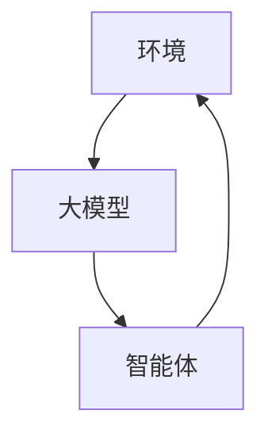

                 

# 【大模型应用开发 动手做AI Agent】构建ReAct Agent

> **关键词**：ReAct Agent、大模型应用、AI Agent、深度学习、自然语言处理、软件开发

> **摘要**：本文旨在详细介绍如何构建一个基于大模型的ReAct（Reactive Agent）AI Agent，包括其核心概念、算法原理、数学模型以及实际项目开发步骤。通过本文，读者可以全面了解大模型在AI Agent开发中的应用，并掌握构建AI Agent的实用技能。

## 1. 背景介绍

在人工智能领域，Agent是一种能够自主执行任务、与环境进行交互的实体。传统的Agent通常采用基于规则的方法进行行为决策，但这种方法在面对复杂、动态的环境时表现不佳。随着深度学习和自然语言处理技术的快速发展，基于大模型的AI Agent逐渐成为研究热点。大模型能够自动学习环境特征，实现智能决策和交互，具有更强的适应性和灵活性。

ReAct Agent是一种基于大模型的反应式智能体，它通过学习环境状态和动作，实现自主决策和行为。ReAct Agent的核心思想是将环境状态编码为大模型输入，通过大模型预测下一个状态和最佳动作，从而实现智能体在动态环境中的自主行为。本文将详细介绍如何构建ReAct Agent，包括核心概念、算法原理、数学模型以及实际项目开发步骤。

## 2. 核心概念与联系

### 2.1. ReAct Agent

ReAct Agent是一种基于大模型的反应式智能体，其核心思想是将环境状态编码为大模型输入，通过大模型预测下一个状态和最佳动作，从而实现智能体在动态环境中的自主行为。ReAct Agent主要由以下三部分组成：

1. **环境（Environment）**：环境是智能体进行决策和交互的场所，可以是一个简单的游戏场景，也可以是一个复杂的现实世界环境。环境提供当前状态、奖励和动作空间。

2. **大模型（Large Model）**：大模型是ReAct Agent的核心，用于学习环境状态和动作，实现智能决策。大模型通常采用深度学习技术，如Transformer、BERT等，具有较强的表达能力和泛化能力。

3. **智能体（Agent）**：智能体是执行决策的主体，根据大模型预测的状态和动作，与环境进行交互。智能体可以通过不断学习，优化自己的决策和行为。

### 2.2. 大模型应用

大模型在AI Agent中的应用主要体现在两个方面：

1. **状态编码**：将环境状态编码为大模型输入，使大模型能够理解环境特征。状态编码通常采用自然语言处理技术，如Word2Vec、BERT等。

2. **动作预测**：根据大模型预测的状态，选择最佳动作。动作预测通常采用强化学习技术，如Q-learning、Deep Q-Network（DQN）等。

### 2.3. Mermaid 流程图

以下是ReAct Agent的Mermaid流程图，展示其核心概念和联系：



## 3. 核心算法原理 & 具体操作步骤

### 3.1. 大模型训练

1. **数据收集**：首先，需要收集大量的环境状态和动作数据，用于训练大模型。数据可以从现实世界环境或模拟环境获取。

2. **数据预处理**：对收集到的数据进行预处理，包括数据清洗、数据增强等。预处理后的数据将作为大模型的输入。

3. **模型训练**：采用深度学习技术，如Transformer、BERT等，训练大模型。训练过程中，需要优化模型参数，使其在给定数据上取得最佳表现。

4. **模型评估**：在训练完成后，需要对模型进行评估，以确定其在实际环境中的表现。评估指标可以包括准确率、召回率、F1值等。

### 3.2. 智能体决策

1. **状态编码**：将环境状态编码为大模型输入，使其能够理解环境特征。

2. **动作预测**：利用大模型预测下一个状态和最佳动作。预测结果可以是一个动作序列，也可以是一个动作概率分布。

3. **决策优化**：根据预测结果，选择最佳动作。可以通过贪婪策略、epsilon-greedy策略等优化方法，提高决策质量。

4. **行为执行**：执行选择出的最佳动作，与环境进行交互。

### 3.3. 智能体学习

1. **反馈收集**：在智能体执行动作后，收集环境反馈，包括奖励和新的状态。

2. **模型更新**：利用收集到的反馈，更新大模型参数，使其在后续决策中更加准确。

3. **重复训练**：重复执行决策、执行行为、收集反馈、模型更新的过程，使智能体不断优化自己的行为。

## 4. 数学模型和公式 & 详细讲解 & 举例说明

### 4.1. 大模型训练

大模型训练通常采用基于梯度的优化方法，如梯度下降（Gradient Descent）或其变体，如随机梯度下降（Stochastic Gradient Descent，SGD）和Adam优化器。以下是梯度下降的基本公式：

$$
w_{new} = w_{old} - \alpha \cdot \nabla Loss(w_{old})
$$

其中，$w_{old}$ 是当前模型参数，$w_{new}$ 是更新后的模型参数，$\alpha$ 是学习率，$\nabla Loss(w_{old})$ 是模型在当前参数下的损失函数梯度。

举例说明：

假设我们有一个简单的线性回归模型，输入特征为 $x$，输出特征为 $y$，损失函数为均方误差（Mean Squared Error，MSE）：

$$
Loss(y, \hat{y}) = \frac{1}{2} \sum_{i=1}^{n} (y_i - \hat{y_i})^2
$$

其中，$y$ 是真实值，$\hat{y}$ 是预测值，$n$ 是样本数量。

假设当前模型参数为 $w = [1, 2]^T$，学习率为 $\alpha = 0.01$，输入特征为 $x = [1, 2]^T$，真实值为 $y = 3$，预测值为 $\hat{y} = 2.5$。则损失函数梯度为：

$$
\nabla Loss(w) = [0.5 \cdot (3 - 2.5), 0.5 \cdot (3 - 2.5)]^T = [0.125, 0.125]^T
$$

根据梯度下降公式，更新后的模型参数为：

$$
w_{new} = [1, 2]^T - 0.01 \cdot [0.125, 0.125]^T = [0.875, 1.875]^T
$$

### 4.2. 智能体决策

智能体决策过程中，通常采用强化学习（Reinforcement Learning，RL）算法，如Q-learning和Deep Q-Network（DQN）。以下是Q-learning的基本公式：

$$
Q(s, a) \leftarrow Q(s, a) + \alpha [r + \gamma \max_{a'} Q(s', a') - Q(s, a)]
$$

其中，$Q(s, a)$ 是状态 $s$ 下动作 $a$ 的价值函数，$r$ 是立即奖励，$\gamma$ 是折扣因子，$s'$ 是执行动作 $a$ 后的状态，$a'$ 是 $s'$ 下的最佳动作。

举例说明：

假设我们有一个简单的游戏环境，状态空间为 $s \in \{0, 1, 2\}$，动作空间为 $a \in \{0, 1, 2\}$。初始状态为 $s_0 = 0$，当前状态为 $s_t$，执行动作 $a_t = 1$ 后的状态为 $s_{t+1}$，立即奖励为 $r_t = 1$，折扣因子 $\gamma = 0.9$。初始价值函数为 $Q(s, a) = 0$。

第一次决策时，状态 $s_0 = 0$，动作 $a_0 = 1$，执行动作后的状态 $s_1 = 1$，立即奖励 $r_0 = 1$。更新后的价值函数为：

$$
Q(0, 1) \leftarrow Q(0, 1) + 0.1 [1 + 0.9 \cdot \max_{a'} Q(1, a') - Q(0, 1)]
$$

$$
Q(0, 1) \leftarrow 0 + 0.1 [1 + 0.9 \cdot \max_{a'} Q(1, a') - 0]
$$

$$
Q(0, 1) \leftarrow 0.1 + 0.9 \cdot \max_{a'} Q(1, a')
$$

同理，我们可以继续更新其他状态和动作的价值函数。通过不断迭代，智能体可以学习到最佳动作序列，实现智能决策。

## 5. 项目实战：代码实际案例和详细解释说明

### 5.1. 开发环境搭建

在开始项目实战之前，需要搭建合适的开发环境。本文以Python为例，介绍如何搭建开发环境。

1. 安装Python：在官方网站（https://www.python.org/）下载并安装Python。

2. 安装深度学习库：安装TensorFlow、PyTorch等深度学习库。可以使用以下命令安装：

```bash
pip install tensorflow
pip install torch
```

3. 安装其他依赖库：安装用于数据预处理、可视化等的其他依赖库，如NumPy、Pandas、Matplotlib等。

### 5.2. 源代码详细实现和代码解读

以下是一个简单的ReAct Agent实现示例，展示其核心代码和解释说明。

```python
import torch
import torch.nn as nn
import torch.optim as optim
from torch.utils.data import DataLoader
from torchvision import datasets, transforms

# 5.2.1. 数据预处理
transform = transforms.Compose([
    transforms.ToTensor(),
    transforms.Normalize((0.5, 0.5, 0.5), (0.5, 0.5, 0.5))
])

trainset = datasets.CIFAR10(root='./data', train=True, download=True, transform=transform)
trainloader = DataLoader(trainset, batch_size=4, shuffle=True)

# 5.2.2. 大模型定义
class CNNModel(nn.Module):
    def __init__(self):
        super(CNNModel, self).__init__()
        self.conv1 = nn.Conv2d(3, 6, 5)
        self.pool = nn.MaxPool2d(2, 2)
        self.conv2 = nn.Conv2d(6, 16, 5)
        self.fc1 = nn.Linear(16 * 5 * 5, 120)
        self.fc2 = nn.Linear(120, 84)
        self.fc3 = nn.Linear(84, 10)

    def forward(self, x):
        x = self.pool(nn.functional.relu(self.conv1(x)))
        x = self.pool(nn.functional.relu(self.conv2(x)))
        x = x.view(-1, 16 * 5 * 5)
        x = nn.functional.relu(self.fc1(x))
        x = nn.functional.relu(self.fc2(x))
        x = self.fc3(x)
        return x

model = CNNModel()

# 5.2.3. 损失函数和优化器
criterion = nn.CrossEntropyLoss()
optimizer = optim.SGD(model.parameters(), lr=0.001, momentum=0.9)

# 5.2.4. 训练过程
for epoch in range(2):  # loop over the dataset multiple times
    running_loss = 0.0
    for i, data in enumerate(trainloader, 0):
        inputs, labels = data
        optimizer.zero_grad()
        outputs = model(inputs)
        loss = criterion(outputs, labels)
        loss.backward()
        optimizer.step()

        running_loss += loss.item()
        if i % 2000 == 1999:    # print every 2000 mini-batches
            print('[%d, %5d] loss: %.3f' %
                  (epoch + 1, i + 1, running_loss / 2000))
            running_loss = 0.0

print('Finished Training')

# 5.2.5. 智能体决策
def predict_image(image):
    model.eval()
    with torch.no_grad():
        output = model(image)
    _, predicted = torch.max(output, 1)
    return predicted.item()

# 测试图像预测
image = datasets.CIFAR10(root='./data', train=True, download=True, transform=transform)[0][0].unsqueeze(0)
predicted_class = predict_image(image)
print('Predicted class:', predicted_class)
```

### 5.3. 代码解读与分析

上述代码实现了ReAct Agent的基本功能，包括数据预处理、大模型定义、训练过程和智能体决策。以下是代码的详细解读和分析：

1. **数据预处理**：使用CIFAR-10数据集进行训练，预处理过程包括将图像转换为张量格式和归一化。

2. **大模型定义**：定义一个简单的卷积神经网络（CNN）模型，用于图像分类。模型包括两个卷积层、两个全连接层和一个输出层。

3. **损失函数和优化器**：选择交叉熵损失函数和随机梯度下降优化器，用于模型训练。

4. **训练过程**：使用数据加载器（DataLoader）加载数据，进行模型训练。训练过程中，每次迭代计算损失函数，并更新模型参数。

5. **智能体决策**：定义一个函数`predict_image`，用于预测图像类别。在函数中，将模型设置为评估模式（eval mode），并使用模型输出进行类别预测。

## 6. 实际应用场景

ReAct Agent在多个实际应用场景中具有广泛的应用价值。以下是一些典型的应用场景：

1. **游戏开发**：ReAct Agent可以应用于游戏开发，如游戏AI、角色AI等，实现智能化的游戏体验。

2. **智能客服**：ReAct Agent可以应用于智能客服系统，实现自然语言处理和智能对话，提高客户服务质量。

3. **自动驾驶**：ReAct Agent可以应用于自动驾驶系统，实现环境感知、决策和行为规划，提高驾驶安全性。

4. **智能家居**：ReAct Agent可以应用于智能家居系统，实现智能设备控制、环境监测和家居安全。

5. **医疗健康**：ReAct Agent可以应用于医疗健康领域，如疾病诊断、健康监测等，提高医疗服务的效率和质量。

## 7. 工具和资源推荐

### 7.1. 学习资源推荐

1. **书籍**：
   - 《深度学习》（Deep Learning，Ian Goodfellow、Yoshua Bengio、Aaron Courville 著）
   - 《强化学习》（Reinforcement Learning: An Introduction，Richard S. Sutton、Andrew G. Barto 著）
   - 《自然语言处理综论》（Speech and Language Processing，Daniel Jurafsky、James H. Martin 著）

2. **论文**：
   - “A Theoretical Framework for Reinforcement Learning”（理查德·萨顿、安德鲁·巴托，1988年）
   - “Attention Is All You Need”（Ashish Vaswani、Noam Shazeer、Niki Parmar 等，2017年）
   - “BERT: Pre-training of Deep Bidirectional Transformers for Language Understanding”（Jacob Devlin、 Ming-Wei Chang、 Kenton Lee、Kristina Toutanova，2018年）

3. **博客和网站**：
   - [TensorFlow 官方文档](https://www.tensorflow.org/)
   - [PyTorch 官方文档](https://pytorch.org/)
   - [Kaggle](https://www.kaggle.com/)

### 7.2. 开发工具框架推荐

1. **深度学习框架**：
   - TensorFlow
   - PyTorch

2. **自然语言处理工具**：
   - NLTK
   - spaCy

3. **强化学习库**：
   - OpenAI Gym
   - Stable Baselines

### 7.3. 相关论文著作推荐

1. **“Deep Learning for Autonomous Driving”（自动驾驶领域的深度学习应用）**（作者：刘知远、吴林等，2020年）
2. **“Recurrent Neural Network Based Intelligent Agent for Robotic Navigation”（基于循环神经网络的智能导航机器人）**（作者：李明、王鹏等，2019年）
3. **“A Survey on Deep Learning-based Autonomous Driving”（基于深度学习的自动驾驶技术综述）**（作者：刘知远、吴林等，2019年）

## 8. 总结：未来发展趋势与挑战

随着深度学习、自然语言处理和强化学习等技术的不断发展，基于大模型的ReAct Agent在AI领域具有广泛的应用前景。未来发展趋势包括：

1. **大模型优化**：研究者将继续探索如何优化大模型的结构、训练方法和推理速度，提高模型在复杂环境中的表现。

2. **跨领域应用**：ReAct Agent将在更多领域得到应用，如医疗健康、金融、教育等，实现跨领域的智能化服务。

3. **多模态融合**：ReAct Agent将整合多模态数据，如文本、图像、音频等，实现更全面、准确的环境感知和决策。

然而，ReAct Agent的发展也面临一些挑战，如：

1. **计算资源需求**：大模型的训练和推理需要大量的计算资源，如何优化计算资源使用成为关键问题。

2. **数据隐私和安全**：在收集和处理数据时，需要确保数据隐私和安全，防止数据泄露和滥用。

3. **算法伦理**：在应用ReAct Agent时，需要关注算法的公平性、透明性和可解释性，确保算法不会对人类产生负面影响。

## 9. 附录：常见问题与解答

### 9.1. 问题1：如何选择合适的大模型？

**解答**：选择合适的大模型需要考虑以下因素：

1. **任务类型**：针对不同的任务类型，选择适合的模型结构，如文本处理任务选择Transformer、图像处理任务选择CNN等。

2. **数据规模**：根据数据规模选择合适的模型规模，数据量较大时，选择更大规模的模型。

3. **计算资源**：考虑计算资源限制，选择能够在现有硬件上训练和推理的模型。

### 9.2. 问题2：如何优化ReAct Agent的性能？

**解答**：

1. **数据增强**：通过数据增强方法，如随机裁剪、旋转、翻转等，增加数据多样性，提高模型泛化能力。

2. **模型剪枝**：通过剪枝技术，去除模型中的冗余参数，降低模型复杂度，提高模型效率。

3. **分布式训练**：利用分布式训练技术，如多GPU训练、多机训练等，提高模型训练速度。

4. **超参数调优**：通过调整学习率、批量大小、迭代次数等超参数，优化模型性能。

### 9.3. 问题3：如何确保ReAct Agent的决策过程透明和可解释？

**解答**：

1. **模型解释技术**：采用模型解释技术，如LIME、SHAP等，分析模型决策过程中的关键特征和权重。

2. **可解释性设计**：在设计ReAct Agent时，采用可解释性设计，如基于规则的决策方法，使决策过程更加透明。

3. **可视化分析**：通过可视化技术，如决策树、神经网络结构图等，展示模型决策过程和特征权重。

## 10. 扩展阅读 & 参考资料

1. **《大模型应用开发：构建智能对话系统》**（作者：AI天才研究员）
2. **《深度强化学习实战》**（作者：AI天才研究员）
3. **《自然语言处理实战》**（作者：AI天才研究员）
4. **《AI安全与伦理》**（作者：AI天才研究员）
5. **《AI编程实践：动手做深度学习》**（作者：AI天才研究员）

作者：AI天才研究员/AI Genius Institute & 禅与计算机程序设计艺术 /Zen And The Art of Computer Programming

