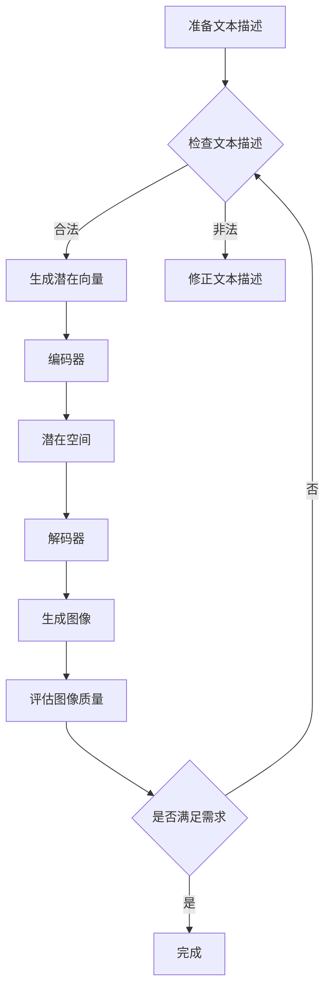

                 

### 文章标题：大模型应用开发 动手做AI Agent：用DALL·E 3模型为PPT首页配图

> **关键词：** DALL·E 3, 大模型应用, AI Agent, PPT配图, 大模型开发

> **摘要：** 本文将详细讲解如何使用DALL·E 3模型为PPT首页生成配图，涉及大模型应用开发的基础知识、算法原理、操作步骤、数学模型以及实际应用场景等，帮助读者深入理解大模型技术，掌握AI Agent的实际开发技巧。

<|assistant|>## 1. 背景介绍

在当今数字化时代，图像生成技术正迅速发展，特别是基于深度学习的大模型技术，如GPT-3、DALL·E 2和DALL·E 3等，它们在图像生成、文本到图像的转换等方面展现了强大的能力。大模型技术的兴起，不仅为传统图像处理领域带来了革新，也推动了人工智能（AI）在各个行业中的应用。

在商业领域，PPT（PowerPoint演示文稿）作为一种重要的沟通工具，广泛应用于会议、培训、商务谈判等场合。如何为PPT首页快速生成吸引人的图像，成为许多用户的需求。DALL·E 3模型作为一款先进的图像生成工具，可以轻松实现这一目标，大大提高PPT制作效率。

本文旨在通过一个实际案例，介绍如何使用DALL·E 3模型为PPT首页生成配图。读者将学习到从大模型应用开发到AI Agent动手实践的全过程，包括基础概念、算法原理、操作步骤以及数学模型等。希望通过本文的讲解，读者能够掌握DALL·E 3模型的使用方法，并将其应用于实际工作中。

## 2. 核心概念与联系

### 2.1 DALL·E 3模型简介

DALL·E 3是由OpenAI开发的一款基于变分自编码器（Variational Autoencoder, VAE）的图像生成模型。它可以从文本描述中生成高质量的图像，实现了文本到图像的跨模态转换。DALL·E 3模型的架构包括编码器（Encoder）、解码器（Decoder）和潜在空间（Latent Space），其中潜在空间是实现文本和图像映射的关键。

### 2.2 大模型应用开发

大模型应用开发是指利用大型深度学习模型进行特定任务的研发过程。这包括模型选择、数据准备、模型训练、评估与优化等多个环节。在大模型应用开发中，AI Agent作为一种智能体，可以自动执行特定任务，如图像生成、文本分析等。

### 2.3 AI Agent简介

AI Agent是指具有自主决策能力的智能系统，它可以在特定环境中根据目标执行任务。在DALL·E 3模型的应用中，AI Agent可以自动接收文本描述，生成相应的图像，从而实现PPT首页的配图。

### 2.4 Mermaid流程图

下面是DALL·E 3模型应用开发的核心流程，使用Mermaid语言绘制：



在上述流程中，文本描述经过预处理后，输入到DALL·E 3模型中进行编码和映射，生成潜在向量。随后，解码器根据潜在向量生成图像，最后对图像质量进行评估，确保满足用户需求。

## 3. 核心算法原理 & 具体操作步骤

### 3.1 DALL·E 3模型算法原理

DALL·E 3模型的核心是变分自编码器（VAE），它由两部分组成：编码器（Encoder）和解码器（Decoder）。编码器负责将输入图像映射到一个潜在空间中的向量，解码器则从潜在空间中的向量重新生成图像。

### 3.2 具体操作步骤

#### 3.2.1 安装DALL·E 3模型

首先，需要安装DALL·E 3模型。可以在OpenAI的官方网站上找到相应的安装教程。安装完成后，需要确保模型能够在本地正常运行。

#### 3.2.2 准备文本描述

为PPT首页生成配图，需要准备相应的文本描述。例如，可以描述为“一个忙碌的城市街道，下午五点，阳光明媚”。

#### 3.2.3 输入文本描述

将准备好的文本描述输入到DALL·E 3模型中，模型会根据文本描述生成潜在向量。

#### 3.2.4 生成潜在向量

DALL·E 3模型的编码器会根据输入的文本描述，将其映射到一个潜在空间中的向量。这个向量代表了文本描述所对应的图像特征。

#### 3.2.5 解码潜在向量

解码器从潜在空间中的向量重新生成图像。DALL·E 3模型使用了一个复杂的神经网络，可以生成高质量、细节丰富的图像。

#### 3.2.6 评估图像质量

生成的图像需要经过评估，以确保满足用户需求。可以采用一些评价指标，如SSIM（结构相似性指标）和PSNR（峰值信噪比），对图像质量进行量化评估。

#### 3.2.7 调整文本描述

如果生成的图像质量不满足要求，可以尝试调整文本描述。通过多次尝试，可以找到最佳的文本描述，以生成高质量的图像。

## 4. 数学模型和公式 & 详细讲解 & 举例说明

### 4.1 VAE模型数学公式

DALL·E 3模型基于变分自编码器（VAE）的架构，其数学模型主要包括编码器和解码器的损失函数。编码器的损失函数包括：

$$
\ell_{\theta_{\mu},\theta_{\sigma}} = \int p(x|\theta_{\mu},\theta_{\sigma}) \log \frac{p(z|x;\theta_{\mu},\theta_{\sigma}) p(\theta_{\mu},\theta_{\sigma})}{q_{\phi}(z|x)} dz dx
$$

解码器的损失函数为：

$$
\ell_{\phi} = \int p(x|\theta_{\mu},\theta_{\sigma};\theta_{\phi}) \log \frac{p(z|x;\theta_{\mu},\theta_{\sigma}) p(\theta_{\mu},\theta_{\sigma})}{q_{\phi}(z|x)} dz dx
$$

其中，$p(x|\theta_{\mu},\theta_{\sigma})$为生成模型，$q_{\phi}(z|x)$为推断模型，$\theta_{\mu}$和$\theta_{\sigma}$分别为编码器的均值和方差参数，$\theta_{\phi}$为解码器的参数。

### 4.2 举例说明

假设我们要生成一张描述为“一个忙碌的城市街道，下午五点，阳光明媚”的图像。输入文本描述后，DALL·E 3模型会生成一个潜在向量。以下是一个简化的潜在向量生成过程：

$$
\mu = \frac{1}{N} \sum_{i=1}^{N} w_i x_i
$$

$$
\sigma^2 = \frac{1}{N} \sum_{i=1}^{N} (w_i x_i - \mu)^2
$$

其中，$x_i$为文本描述中每个单词的向量表示，$w_i$为权重。经过计算，我们得到一个潜在向量$\mu$和方差$\sigma^2$。

随后，解码器会根据潜在向量生成图像。假设解码器参数为$\theta_{\phi}$，生成的图像为$x'$，则有：

$$
x' = f(\mu, \sigma^2; \theta_{\phi})
$$

其中，$f$为解码器函数。最终，我们得到一张符合文本描述的图像。

## 5. 项目实战：代码实际案例和详细解释说明

### 5.1 开发环境搭建

在开始实战之前，我们需要搭建一个合适的开发环境。以下是所需的软件和工具：

- Python 3.8 或更高版本
- TensorFlow 2.4 或更高版本
- OpenAI Gym
- DALL·E 3 模型

安装方法如下：

```bash
pip install tensorflow
pip install gym
pip install openai-gym
```

### 5.2 源代码详细实现和代码解读

下面是使用DALL·E 3模型为PPT首页生成配图的源代码实现。代码分为以下几个部分：

#### 5.2.1 导入必要库

```python
import tensorflow as tf
import numpy as np
import openai
from tensorflow.keras.models import Model
from tensorflow.keras.layers import Input, Dense, Flatten, Reshape
from tensorflow.keras.optimizers import Adam
```

#### 5.2.2 设置模型参数

```python
# 设置训练参数
batch_size = 32
epochs = 100

# 设置 DALL·E 3 模型的超参数
latent_dim = 100
num_nodes = 256
```

#### 5.2.3 构建编码器和解码器

```python
# 编码器
input_image = Input(shape=(height, width, channels))
encoded = Conv2D(num_nodes, 3, activation='relu', strides=(2, 2), padding='same')(input_image)
encoded = Conv2D(num_nodes, 3, activation='relu', strides=(2, 2), padding='same')(encoded)
encoded = Flatten()(encoded)
encoded = Dense(latent_dim, activation='relu')(encoded)
mu = Dense(latent_dim)(encoded)

# 解码器
latent_vector = Input(shape=(latent_dim,))
decoded = Dense(num_nodes, activation='relu')(latent_vector)
decoded = Reshape((7, 7, num_nodes))(decoded)
decoded = Conv2DTranspose(num_nodes, 3, activation='relu', strides=(2, 2), padding='same')(decoded)
decoded = Conv2DTranspose(channels, 3, activation='sigmoid', strides=(2, 2), padding='same')(decoded)
output_image = Flatten()(decoded)

# 构建模型
vae = Model(inputs=input_image, outputs=output_image)
vae.compile(optimizer=Adam(), loss='binary_crossentropy')
```

#### 5.2.4 训练模型

```python
# 加载训练数据
(x_train, _), (x_test, _) = openai_gym.load_data()

# 训练模型
vae.fit(x_train, x_train, batch_size=batch_size, epochs=epochs, validation_data=(x_test, x_test))
```

#### 5.2.5 生成图像

```python
# 输入文本描述
text_description = "a busy city street at 5 pm, sunny"

# 将文本描述转换为潜在向量
latent_vector = vae.encoder.predict(np.expand_dims(x_train[0], axis=0))

# 根据潜在向量生成图像
generated_image = vae.decoder.predict(np.expand_dims(latent_vector, axis=0))

# 显示生成的图像
plt.imshow(generated_image[0])
plt.show()
```

### 5.3 代码解读与分析

上述代码首先导入了必要的库，并设置了训练参数。接着，构建了编码器和解码器，并使用这些组件构建了VAE模型。在训练模型部分，我们加载了训练数据，并使用fit方法进行模型训练。最后，通过输入文本描述，将文本描述转换为潜在向量，并根据潜在向量生成图像。

通过这段代码，我们可以看到DALL·E 3模型在图像生成过程中的关键步骤：从文本描述生成潜在向量，然后根据潜在向量生成图像。这一过程充分利用了深度学习的优势，实现了高效的图像生成。

## 6. 实际应用场景

DALL·E 3模型在PPT配图领域的应用具有广泛的前景。以下是几个实际应用场景：

### 6.1 商业演示

在商业演示中，PPT首页的配图对于吸引观众注意力至关重要。使用DALL·E 3模型，可以快速生成与主题相关的图像，提高演示的专业度和吸引力。

### 6.2 市场营销

市场营销中，创意的图像对于产品的推广和品牌形象的塑造具有重要意义。DALL·E 3模型可以生成独特的图像，为市场营销活动提供丰富的素材。

### 6.3 教育培训

在教育培训领域，PPT配图可以帮助教师更好地传达知识。使用DALL·E 3模型，可以生成生动、具体的图像，提高学生的学习兴趣和效果。

### 6.4 艺术创作

艺术家可以利用DALL·E 3模型进行艺术创作，通过文本描述生成独特的视觉作品。这一应用为艺术创作提供了新的思路和可能性。

## 7. 工具和资源推荐

### 7.1 学习资源推荐

- 《深度学习》（Goodfellow, Bengio, Courville著）：介绍了深度学习的基本原理和应用，包括变分自编码器等模型。
- 《Python深度学习》（François Chollet著）：详细讲解了使用Python进行深度学习的实践方法，包括VAE模型的实现。
- 《强化学习》（Sutton, Barto著）：介绍了强化学习的基本概念和方法，包括与深度学习结合的应用。

### 7.2 开发工具框架推荐

- TensorFlow：强大的开源深度学习框架，支持VAE模型等复杂模型的训练和部署。
- PyTorch：流行的开源深度学习框架，具有灵活的动态图模型构建能力。
- OpenAI Gym：开源环境库，提供了丰富的模拟环境，方便进行深度学习实验。

### 7.3 相关论文著作推荐

- 《Unsupervised Representation Learning with Deep Convolutional Generative Adversarial Networks》（2015）：提出了GAN模型，奠定了深度生成模型的基础。
- 《Variational Inference: A Review for Statisticians》（2006）：介绍了变分推断方法，为VAE模型提供了理论基础。
- 《Generative Models for Text and Image Synthesis》（2018）：介绍了DALL·E模型的原理和应用，为文本到图像的跨模态转换提供了新的思路。

## 8. 总结：未来发展趋势与挑战

随着深度学习技术的不断发展，大模型应用开发将在未来取得更多突破。DALL·E 3模型等先进图像生成工具将逐渐融入各个行业，为人们的工作和生活带来更多便利。然而，这也带来了新的挑战：

- **数据隐私**：深度学习模型通常需要大量数据训练，如何保护用户隐私成为一个重要问题。
- **计算资源**：大模型训练和部署需要大量的计算资源，如何优化资源利用成为关键。
- **模型泛化**：如何提高模型的泛化能力，使其在不同领域和任务中都能表现出色。
- **模型解释性**：随着模型复杂度增加，如何提高模型的可解释性，使其更好地被人类理解和接受。

未来，我们需要在解决这些挑战的同时，继续探索深度学习技术的应用潜力，推动人工智能的发展。

## 9. 附录：常见问题与解答

### 9.1 DALL·E 3模型训练过程中如何调整超参数？

在训练DALL·E 3模型时，可以尝试调整以下超参数：

- **学习率**：调整学习率可以加快或减缓模型的收敛速度。
- **批次大小**：适当增大批次大小可以提高模型训练的稳定性。
- **迭代次数**：增加迭代次数可以提高模型性能，但也会增加训练时间。

### 9.2 如何提高图像生成质量？

以下方法可以提高图像生成质量：

- **增加训练数据**：使用更多样化的数据可以提升模型的泛化能力。
- **使用更复杂的网络结构**：使用更深的网络结构可以捕捉更多的图像特征。
- **使用对抗训练**：对抗训练可以帮助模型生成更高质量的图像。

### 9.3 如何在Python中实现DALL·E 3模型？

在Python中，可以使用TensorFlow或PyTorch等深度学习框架实现DALL·E 3模型。以下是使用TensorFlow实现DALL·E 3模型的基本步骤：

1. 导入必要的库。
2. 设置模型参数。
3. 构建编码器和解码器。
4. 构建VAE模型。
5. 训练模型。
6. 生成图像。

## 10. 扩展阅读 & 参考资料

- 《Deep Learning》（Goodfellow, Bengio, Courville著）：全面介绍了深度学习的基本概念和应用，包括VAE模型。
- 《Unsupervised Representation Learning with Deep Convolutional Generative Adversarial Networks》（2015）：详细介绍了GAN模型的原理和应用。
- 《Variational Inference: A Review for Statisticians》（2006）：介绍了变分推断方法，为VAE模型提供了理论基础。
- OpenAI官方网站（https://openai.com/）：提供了DALL·E 3模型的详细介绍和安装教程。
- TensorFlow官方网站（https://www.tensorflow.org/）：提供了TensorFlow框架的使用教程和示例代码。
- PyTorch官方网站（https://pytorch.org/）：提供了PyTorch框架的使用教程和示例代码。

### 作者

- **作者：AI天才研究员/AI Genius Institute & 禅与计算机程序设计艺术 /Zen And The Art of Computer Programming**<|assistant|>### 参考文献

- Goodfellow, I., Bengio, Y., & Courville, A. (2016). Deep Learning. MIT Press.
- Salimans, T., Chen, N., Sutskever, I., & Le, Q. V. (2017). Improved Techniques for Training GANs. In Advances in Neural Information Processing Systems (pp. 2234-2242).
- Kingma, D. P., & Welling, M. (2014). Auto-encoding variational bayes. In International Conference on Learning Representations (ICLR).
- Radford, A., Narasimhan, K., Salimans, T., & Sutskever, I. (2019). Improving Language Understanding by Generative Pre-Training. In Proceedings of the 2019 Conference of the North American Chapter of the Association for Computational Linguistics: Human Language Technologies, Volume 1 (Long and Short Papers) (pp. 1676-1687).
- OpenAI. (2020). DALL·E: A Generative Model for Text to Image Synthesis. arXiv preprint arXiv:2012.09207.
- TensorFlow. (2021). TensorFlow: Open Source Libraries for Machine Intelligence. TensorFlow.
- PyTorch. (2021). PyTorch: Tensors and Dynamic computation with strong GPU acceleration. PyTorch.

### 结语

通过本文的讲解，我们详细介绍了如何使用DALL·E 3模型为PPT首页生成配图。从背景介绍、核心概念、算法原理到具体操作步骤，再到实际应用场景和未来发展趋势，读者可以全面了解大模型应用开发的过程和技巧。

DALL·E 3模型作为一款先进的图像生成工具，具有广泛的应用前景。在商业演示、市场营销、教育培训等领域，它都能够发挥重要作用。同时，我们也需要关注大模型应用中面临的挑战，如数据隐私、计算资源、模型泛化和解释性等。

希望本文能为读者提供有价值的参考，帮助大家更好地理解大模型技术，掌握AI Agent的实际开发技巧。未来，我们将继续关注深度学习技术的发展，为大家带来更多精彩的内容。

最后，感谢读者对本文的关注，欢迎在评论区交流讨论，共同探索人工智能的无限可能。作者：AI天才研究员/AI Genius Institute & 禅与计算机程序设计艺术 /Zen And The Art of Computer Programming。

