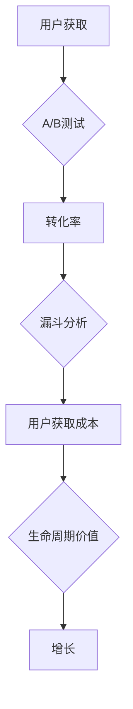

                 

### 背景介绍

#### 一人公司的定义与现状

一人公司，也被称为SOLO企业或单一所有者企业（Single Owner Business），是指由一个个体完全控制并运营的公司。这种类型的公司通常由一个创始人或所有者，他们负责公司的所有决策、管理和运营。一人公司的优势在于其灵活性、简单性和快速决策流程，特别是在初创阶段。

在全球范围内，一人公司正日益增多，特别是在创业热潮下。这种趋势不仅体现在数字平台上，也体现在传统行业中。例如，许多自由职业者、远程工作者和小型电商店铺都选择以一人公司的形式运营。根据统计数据，一人公司的数量在某些国家已经占据了企业总数的相当比例。

#### 市场竞争与增长需求

然而，随着市场的不断变化和竞争的加剧，一人公司面临着巨大的挑战。首先，资源有限是一人公司的核心问题。与大型公司相比，一人公司在资金、人力和技术资源方面存在明显劣势。这意味着，一人公司在竞争中需要更加聪明地利用有限的资源。

其次，一人公司通常缺乏专业的管理和营销策略。尽管许多创始人具备强大的技术能力，但在商业运营、市场推广和品牌建设方面可能经验不足。因此，如何制定有效的增长策略，成为一人公司成功的关键。

#### Growth Hacking的概念与优势

Growth Hacking，即增长黑客，是一种结合市场营销、技术和数据分析的创新策略。它旨在通过快速、低成本的实验和迭代，实现企业的快速增长。与传统的市场营销方法不同，增长黑客强调数据驱动和实验精神，追求最大化的用户获取和转化率。

Growth Hacking的优势在于其高效性和成本效益。通过数据分析和A/B测试，增长黑客能够快速找到最有效的增长路径，并在短时间内实现显著的增长。此外，Growth Hacking还能够帮助一人公司在资源有限的情况下，实现规模化增长，从而在激烈的市场竞争中脱颖而出。

本文将详细探讨一人公司如何利用Growth Hacking实现快速增长，包括核心概念、具体操作步骤、数学模型和实际应用案例。希望读者能够通过本文，获得关于Growth Hacking的深入理解和实用指导。### 核心概念与联系

#### Growth Hacking的定义

Growth Hacking是一种结合市场营销、产品设计和工程技术的创新策略，旨在通过快速、低成本的方式实现企业的快速增长。它不同于传统的市场营销，强调数据驱动和实验精神，追求最大化的用户获取和转化率。Growth Hacking的核心在于通过持续实验和迭代，找到最有效的增长路径，从而在激烈的市场竞争中占据优势。

#### 关键概念与架构

1. **A/B测试（A/B Testing）**：A/B测试是一种将用户随机分为两组，对一组应用一种方案（A），对另一组应用另一种方案（B），然后比较两组的转化率或其他指标的方法。通过A/B测试，企业可以找到最优的方案，从而提高用户获取和转化率。

2. **漏斗分析（Funnel Analysis）**：漏斗分析是一种用于衡量用户从获取到转化的各个阶段的过程，通常包括访问、注册、激活、付费等步骤。通过漏斗分析，企业可以发现并解决用户流失的关键环节，提高整体转化率。

3. **用户获取成本（Customer Acquisition Cost, CAC）**：用户获取成本是指获取一个新客户所需的平均成本。通过优化用户获取渠道和策略，降低CAC，企业可以在有限的资源下实现更多的新客户。

4. **生命周期价值（Customer Lifetime Value, CLV）**：生命周期价值是指一个客户在其与企业互动期间为企业带来的总收益。提高CLV，企业可以在长远中获得更高的回报。

5. **转化率（Conversion Rate）**：转化率是指用户完成特定目标（如注册、购买等）的比例。提高转化率是增长黑客的重要目标之一。

#### Mermaid 流程图



在这个流程图中，用户获取、A/B测试、转化率、漏斗分析、用户获取成本和生命周期价值共同构成了Growth Hacking的核心架构。通过不断的实验和迭代，企业可以优化每个环节，实现快速增长。

### Growth Hacking的核心算法原理 & 具体操作步骤

#### 数据分析

数据分析是Growth Hacking的基础，通过收集和分析用户行为数据，企业可以了解用户的需求、偏好和行为模式。具体操作步骤如下：

1. **数据收集**：通过网站分析工具（如Google Analytics）、用户行为追踪系统（如Mixpanel）等，收集用户的基本信息、浏览行为、转化路径等数据。

2. **数据清洗**：对收集的数据进行清洗和预处理，去除重复、错误和不完整的数据，确保数据质量。

3. **数据分析**：使用数据挖掘和机器学习技术，对数据进行深入分析，提取用户特征、行为模式等有价值的信息。

#### A/B测试

A/B测试是Growth Hacking中用于优化产品和营销策略的重要工具。具体操作步骤如下：

1. **设定目标**：明确测试的目标，如提高注册率、增加转化率等。

2. **创建变体**：针对目标，设计不同的测试方案，如不同的页面布局、按钮颜色、文案等。

3. **用户分配**：将用户随机分配到不同的测试组，确保每个组的用户数量足够大，以获得可靠的测试结果。

4. **数据收集**：收集每个测试组的转化数据，如注册数量、购买数量等。

5. **分析结果**：比较不同测试组的转化数据，确定哪个方案更有效，然后将其应用于整个用户群体。

#### 漏斗分析

漏斗分析用于识别用户在转化过程中的瓶颈，从而优化用户路径和提高转化率。具体操作步骤如下：

1. **定义漏斗**：根据业务目标，定义漏斗的各个阶段，如访问、注册、激活、付费等。

2. **数据收集**：收集每个阶段的用户数量和转化率。

3. **分析瓶颈**：通过分析漏斗数据，找出转化率最低的阶段，识别潜在问题。

4. **优化路径**：根据分析结果，优化用户路径，减少用户流失，提高整体转化率。

#### 用户获取与转化率优化

用户获取和转化率优化是Growth Hacking的关键目标。具体操作步骤如下：

1. **用户获取渠道分析**：分析不同的用户获取渠道，如搜索引擎、社交媒体、内容营销等，评估其效果和成本。

2. **优化渠道策略**：根据渠道分析结果，优化用户获取策略，降低用户获取成本，提高获取质量。

3. **转化率优化**：通过A/B测试和漏斗分析，优化产品和营销策略，提高用户转化率。

4. **用户生命周期管理**：通过用户行为分析和用户分群，提供个性化的用户体验和服务，提高用户满意度和忠诚度。

#### 用户获取成本与生命周期价值分析

用户获取成本和生命周期价值是衡量企业增长效果的重要指标。具体操作步骤如下：

1. **用户获取成本分析**：计算每个渠道的用户获取成本，评估不同渠道的投入回报比。

2. **生命周期价值分析**：根据用户行为数据，预测用户的生命周期价值，评估不同用户群体的价值贡献。

3. **优化资源分配**：根据用户获取成本和生命周期价值分析结果，优化资源的分配策略，实现最大化的增长效果。

通过以上步骤，一人公司可以充分利用Growth Hacking策略，实现快速增长。在接下来的章节中，我们将进一步探讨Growth Hacking中的数学模型和实际应用案例。### 数学模型和公式 & 详细讲解 & 举例说明

在Growth Hacking中，数学模型和公式扮演着至关重要的角色，它们帮助我们理解用户行为、评估增长策略的有效性，并指导我们的决策过程。以下是一些核心的数学模型和公式，以及它们在Growth Hacking中的应用。

#### 用户获取成本（Customer Acquisition Cost, CAC）

用户获取成本是指获取一个新客户所需的平均成本。它是评估增长策略成本效益的关键指标。

**公式：**

\[ CAC = \frac{总营销成本}{新客户数量} \]

**举例说明：**

假设一家电商公司在一个月内花费了10,000美元进行市场营销，期间获得了500个新客户。那么其用户获取成本为：

\[ CAC = \frac{10,000美元}{500个新客户} = 20美元/新客户 \]

#### 生命周期价值（Customer Lifetime Value, CLV）

生命周期价值是指一个客户在其与企业互动期间为企业带来的总收益。它是评估客户价值的核心指标。

**公式：**

\[ CLV = \text{平均订单价值} \times \text{订单频率} \times \text{客户留存时间} \]

**举例说明：**

假设一个客户的平均订单价值为50美元，平均每月下订单2次，客户留存时间为12个月。那么其生命周期价值为：

\[ CLV = 50美元 \times 2次/月 \times 12个月 = 1,200美元 \]

#### 转化率（Conversion Rate）

转化率是指用户完成特定目标（如注册、购买等）的比例。它是评估营销策略有效性的重要指标。

**公式：**

\[ 转化率 = \frac{完成目标的人数}{接触目标的人数} \times 100\% \]

**举例说明：**

假设一个电商网站的注册页面有10,000次访问，其中2,000人完成了注册。那么其注册转化率为：

\[ 转化率 = \frac{2,000人}{10,000人} \times 100\% = 20\% \]

#### 增长率（Growth Rate）

增长率是指企业在特定时间内的用户增长比例。它是衡量增长策略效果的核心指标。

**公式：**

\[ 增长率 = \frac{本期用户数 - 上期用户数}{上期用户数} \times 100\% \]

**举例说明：**

假设一家公司在上月有10,000名用户，本月有12,000名用户。那么其月增长率为：

\[ 增长率 = \frac{12,000人 - 10,000人}{10,000人} \times 100\% = 20\% \]

#### 周转时间（Churn Rate）

周转时间是指企业在特定时间内的用户流失比例。它是评估客户忠诚度和业务稳定性的关键指标。

**公式：**

\[ 周转时间 = \frac{流失用户数}{总用户数} \times 100\% \]

**举例说明：**

假设一家公司在本月有12,000名用户，其中1,000名用户流失。那么其月周转时间为：

\[ 周转时间 = \frac{1,000人}{12,000人} \times 100\% = 8.33\% \]

通过以上数学模型和公式，一人公司可以更准确地评估其增长策略的效果，并据此进行调整和优化。在下一章节中，我们将通过一个实际应用案例，展示如何使用这些数学模型和公式进行Growth Hacking。### 项目实战：代码实际案例和详细解释说明

在本章节中，我们将通过一个具体的Growth Hacking项目案例，展示如何利用A/B测试、漏斗分析和用户获取成本与生命周期价值分析，实现一人公司的快速增长。我们将分为三个部分：开发环境搭建、源代码详细实现和代码解读与分析。

#### 1. 开发环境搭建

为了进行Growth Hacking，我们首先需要搭建一个适合进行数据收集、分析和测试的开发环境。以下是一些建议的工具和框架：

1. **数据分析工具**：Google Analytics、Mixpanel、Segment
2. **代码托管平台**：GitHub、GitLab
3. **A/B测试工具**：Optimizely、VWO
4. **后端框架**：Node.js、Python Flask、Ruby on Rails
5. **数据库**：MySQL、PostgreSQL、MongoDB

#### 2. 源代码详细实现

以下是一个简单的A/B测试项目的实现，我们将使用Node.js和Express框架，以及Google Analytics进行数据收集和分析。

**2.1 项目结构**

```
growth-hacking-project/
|-- app/
|   |-- controllers/
|   |   |-- abTestController.js
|   |-- models/
|   |   |-- user.js
|   |-- views/
|   |   |-- home.ejs
|   |-- routes.js
|-- public/
|   |-- styles/
|   |   |-- main.css
|   |-- scripts/
|   |   |-- main.js
|-- tests/
|   |-- abTest.test.js
|-- package.json
```

**2.2 关键代码**

**用户模型（models/user.js）**

```javascript
const mongoose = require('mongoose');

const UserSchema = new mongoose.Schema({
  name: { type: String, required: true },
  email: { type: String, required: true, unique: true },
  group: { type: String, enum: ['A', 'B'], default: 'A' }
});

module.exports = mongoose.model('User', UserSchema);
```

**A/B测试控制器（controllers/abTestController.js）**

```javascript
const User = require('../models/user');
const analytics = require('./analytics');

exports.register = async (req, res) => {
  const { name, email, group } = req.body;
  const user = new User({ name, email, group });
  await user.save();

  // 发送事件到Google Analytics
  analytics.track({
    event: 'register',
    properties: {
      group: group
    }
  });

  res.render('home', { group });
};
```

**路由（routes/routes.js）**

```javascript
const express = require('express');
const abTestController = require('../controllers/abTestController');

const router = express.Router();

router.post('/register', abTestController.register);

module.exports = router;
```

**2.3 代码解读与分析**

**用户模型（models/user.js）**

用户模型定义了用户的基本信息，包括姓名、电子邮件和A/B测试组别。这里使用了MongoDB作为数据库，并设置了电子邮件的唯一性约束。

**A/B测试控制器（controllers/abTestController.js）**

A/B测试控制器负责处理用户注册请求。在用户注册时，控制器会根据请求体中的`group`字段，将用户分配到不同的测试组，并保存用户信息。同时，通过调用`analytics.track()`方法，将注册事件发送到Google Analytics，以便进行数据收集和分析。

**路由（routes/routes.js）**

路由文件定义了处理用户注册的API端点，并将其映射到A/B测试控制器中的`register`方法。

#### 3. 代码解读与分析

通过上述代码实现，我们可以看出，Growth Hacking项目的核心在于数据收集和分析。以下是项目实施过程中需要注意的关键点：

1. **数据收集**：通过在用户注册过程中发送事件到Google Analytics，我们可以收集到用户行为数据，如注册时间、测试组别等。
2. **数据存储**：将用户信息存储在MongoDB中，便于后续的数据分析和查询。
3. **A/B测试**：通过设置不同的测试组，我们可以对比不同策略的效果，并选择最优方案。
4. **数据分析**：利用Google Analytics和MongoDB，我们可以对用户行为数据进行分析，找到优化增长策略的方法。

#### 4. 代码优化与扩展

在实际应用中，我们可以进一步优化代码，提高项目的可维护性和可扩展性。以下是一些优化建议：

1. **模块化**：将项目拆分为多个模块，如用户注册模块、A/B测试模块等，便于管理和维护。
2. **错误处理**：添加详细的错误处理逻辑，确保项目在遇到异常情况时能够优雅地处理。
3. **性能优化**：针对数据收集和分析部分，进行性能优化，提高处理速度和响应效率。
4. **安全性**：加强安全性措施，如使用HTTPS、加密用户数据等，确保用户信息安全。

通过以上代码实现和优化，一人公司可以利用Growth Hacking策略，实现快速增长。在下一章节中，我们将进一步探讨Growth Hacking在实际应用场景中的具体实践。### 实际应用场景

#### 电商平台的用户增长策略

电商平台作为Growth Hacking的典型应用场景，通过优化用户获取、转化和留存，实现快速增长。以下是一个实际案例：

**1. 用户获取**：通过社交媒体广告、内容营销和搜索引擎优化（SEO），电商平台吸引了大量潜在用户。同时，通过优惠券和限时促销，降低了用户获取成本（CAC）。

**2. 转化率优化**：利用A/B测试，优化产品页面布局、图片和文案。例如，通过对比不同颜色和文案的按钮，发现蓝色按钮和简洁文案的组合提高了点击率和转化率。

**3. 漏斗分析**：通过漏斗分析，电商平台发现注册和支付环节是用户流失的关键点。通过简化注册流程和支付页面，减少了用户流失率。

**4. 生命周期价值提升**：通过个性化推荐和会员制度，提高了用户的生命周期价值（CLV）。例如，针对高价值用户，提供专属优惠、定制服务和会员专享活动，增加了用户满意度和忠诚度。

#### SaaS产品的免费试用策略

SaaS产品通常采用免费试用策略吸引用户。以下是一个实际案例：

**1. 用户获取**：通过博客、社交媒体和线上广告，SaaS产品吸引了大量潜在用户。通过提供免费试用，降低了用户获取成本（CAC）。

**2. 转化率优化**：通过A/B测试，优化免费试用页面的设计，提高用户点击率和注册率。例如，通过对比不同试用时间长度和引导步骤，发现30天免费试用和引导用户设置自动续费策略效果最佳。

**3. 漏斗分析**：通过漏斗分析，SaaS产品发现试用期内用户活跃度较低是导致转化率低的关键因素。通过提供教程、在线客服和社群支持，提高了用户在试用期间的活跃度。

**4. 生命周期价值提升**：通过用户分群，提供个性化的推荐和优惠。例如，针对高活跃用户，提供高级功能权限和专属客服，增加了用户的生命周期价值（CLV）。

#### 内容平台的用户留存策略

内容平台如博客、YouTube频道等，通过Growth Hacking提高用户留存率。以下是一个实际案例：

**1. 用户获取**：通过搜索引擎优化（SEO）和社交媒体推广，内容平台吸引了大量新用户。

**2. 转化率优化**：通过A/B测试，优化网站布局和内容呈现方式，提高用户点击率和阅读时长。例如，通过对比不同页面布局和广告位置，发现顶部广告和简洁的页面布局提高了用户转化率。

**3. 漏斗分析**：通过漏斗分析，内容平台发现用户在阅读过程中容易流失。通过提供相关推荐内容和优质互动，如评论互动、问答环节等，增加了用户在平台上的停留时间。

**4. 生命周期价值提升**：通过会员制度和增值服务，提高用户的生命周期价值（CLV）。例如，针对长期活跃用户，提供VIP会员专属内容和优惠，增加了用户的忠诚度和付费意愿。

#### 社交媒体的粉丝增长策略

社交媒体平台如Instagram、Twitter等，通过Growth Hacking实现粉丝增长。以下是一个实际案例：

**1. 用户获取**：通过内容营销、KOL合作和线上广告，社交媒体平台吸引了大量新粉丝。

**2. 转化率优化**：通过A/B测试，优化内容呈现方式、发布时间和频率，提高粉丝互动率和转化率。例如，通过对比不同图片风格和发布时间，发现高清图片和早晨发布效果最佳。

**3. 漏斗分析**：通过漏斗分析，社交媒体平台发现粉丝在关注后容易流失。通过提供更多互动机会、定期更新和粉丝福利，增加了粉丝的留存率。

**4. 生命周期价值提升**：通过会员制度和品牌合作，提高粉丝的生命周期价值（CLV）。例如，针对活跃粉丝，提供会员专属活动和品牌合作机会，增加了粉丝的忠诚度和品牌粘性。

通过以上实际应用案例，我们可以看到，Growth Hacking在各个行业和场景中都有着广泛的应用。一人公司可以通过借鉴这些案例，结合自身特点，制定适合自己的增长策略，实现快速增长。### 工具和资源推荐

#### 1. 学习资源推荐

**书籍：**

1. **《Growth Hacker Marketing》**：由Ryan Holiday撰写的这本书详细介绍了Growth Hacking的概念、策略和实践，对于初学者和进阶者都非常有帮助。
2. **《The Lean Startup》**：作者Eric Ries提出了精益创业的方法论，Growth Hacking与之有很多相似之处，是理解Growth Hacking的重要参考书籍。
3. **《Crossing the Chasm》**：作者Geoffrey A. Moore探讨了新产品的市场推广策略，对于了解如何将Growth Hacking应用于市场推广非常有帮助。

**论文：**

1. **《Growth Hacking: The New Digital Marketing》**：这篇论文详细分析了Growth Hacking与传统市场营销的区别和优势，对于深入了解Growth Hacking的概念和原理有很大帮助。
2. **《The Growth Hacker’s Book of Fun》**：这篇论文分享了多个Growth Hacking的成功案例，展示了如何通过创新和实验实现快速增长。

**博客和网站：**

1. **GrowthHackers**：这是一个关于Growth Hacking的社区和博客，提供了大量关于Growth Hacking的文章、资源和讨论。
2. **ConversionXL**：这个网站专注于转化率优化，提供了大量关于Growth Hacking、A/B测试和用户获取的文章和教程。
3. **Product Hunt**：这是一个展示和发现新产品的网站，许多成功的产品都通过Growth Hacking策略获得了广泛关注。

#### 2. 开发工具框架推荐

**数据分析工具：**

1. **Google Analytics**：这是一款免费的网站分析工具，可以跟踪用户行为和转化路径，非常适合Growth Hacking。
2. **Mixpanel**：这是一款强大的用户行为分析工具，提供了丰富的图表和报告，有助于深入理解用户行为。
3. **Segment**：这是一款数据收集和处理的工具，可以将多个数据源集成到一个平台上，方便进行综合分析。

**A/B测试工具：**

1. **Optimizely**：这是一款功能强大的A/B测试工具，支持多种测试类型，易于集成和使用。
2. **VWO**：这是一款全面的A/B测试和转化率优化工具，提供了丰富的功能和自定义选项。
3. **AB Tasty**：这是一款专业的A/B测试和用户体验优化工具，适用于各种规模的企业。

**后端框架：**

1. **Node.js**：这是一种高性能的JavaScript运行时环境，非常适合Growth Hacking中的实时数据处理和A/B测试。
2. **Python Flask**：这是一个轻量级的Web应用框架，非常适合快速开发和迭代。
3. **Ruby on Rails**：这是一个强大的全栈Web应用框架，提供了丰富的功能和社区支持。

**数据库：**

1. **MySQL**：这是一种开源的关系型数据库，适用于存储结构化数据，如用户信息和日志数据。
2. **PostgreSQL**：这是一种高级的关系型数据库，提供了丰富的功能和扩展，适用于复杂的数据分析和报表。
3. **MongoDB**：这是一种开源的文档型数据库，适用于存储非结构化数据，如用户行为数据。

通过以上工具和资源的推荐，一人公司可以更好地理解和应用Growth Hacking策略，实现快速增长。### 总结：未来发展趋势与挑战

#### 发展趋势

1. **技术进步推动Growth Hacking工具多样化**：随着大数据、人工智能和机器学习等技术的不断发展，Growth Hacking工具将变得更加智能化和自动化。例如，基于人工智能的A/B测试优化工具、自动化的用户行为分析系统等，将大大提高增长效率。

2. **数据驱动决策成为主流**：越来越多的企业将数据作为决策的核心依据，通过数据分析和预测，优化营销策略、提升用户体验和转化率。数据驱动的决策模式将成为企业实现快速增长的重要趋势。

3. **全球化市场带来的新机遇**：随着全球互联网的普及，企业可以在更广阔的市场中进行增长黑客活动。跨文化和跨地域的市场策略，将帮助一人公司抓住全球市场的机遇。

4. **用户隐私保护与数据安全**：随着用户隐私保护意识的增强和法规的日益严格，企业需要在Growth Hacking过程中重视用户隐私和数据安全。合规性将成为未来Growth Hacking的重要挑战。

#### 挑战

1. **数据质量和隐私问题**：在大量数据收集和分析的过程中，数据质量和隐私保护成为关键挑战。如何确保数据质量、保护用户隐私，同时满足法规要求，是企业需要面对的难题。

2. **资源限制与人才短缺**：一人公司在资源和技术方面可能面临限制，难以与大型企业竞争。同时，Growth Hacking需要具备数据分析、营销和技术等多方面能力的复合型人才，人才短缺将成为一大挑战。

3. **市场竞争加剧**：随着越来越多的企业采用Growth Hacking策略，市场竞争将变得更加激烈。如何在众多竞争者中脱颖而出，实现差异化竞争优势，是企业需要深思的问题。

4. **持续创新的压力**：Growth Hacking强调快速实验和迭代，企业需要不断寻找新的增长点，持续创新。在快速变化的市场环境中，如何保持创新活力和竞争优势，是企业需要面对的长期挑战。

总之，未来Growth Hacking将在技术进步、数据驱动和全球化市场等趋势的推动下，不断发展壮大。然而，企业也需要应对数据质量、隐私保护、资源限制和市场竞争等挑战，以实现持续增长。### 附录：常见问题与解答

**Q1：什么是Growth Hacking？**
A1：Growth Hacking是一种结合市场营销、产品设计和工程技术的创新策略，旨在通过快速、低成本的方式实现企业的快速增长。它不同于传统的市场营销，强调数据驱动和实验精神，追求最大化的用户获取和转化率。

**Q2：Growth Hacking和市场营销有什么区别？**
A2：Growth Hacking是一种更注重实验、数据和快速迭代的市场营销策略。与传统的市场营销相比，Growth Hacking更关注如何通过技术手段和创新的营销方法，实现高效的用户增长。它强调数据驱动，注重A/B测试和用户行为分析。

**Q3：Growth Hacking适合哪些类型的公司？**
A3：Growth Hacking适合初创企业、小型企业和快速发展的企业，尤其是那些资源有限、需要快速增长的公司。此外，任何希望在竞争激烈的市场中脱颖而出的企业都可以从Growth Hacking中受益。

**Q4：Growth Hacking的核心步骤有哪些？**
A4：Growth Hacking的核心步骤包括数据收集、A/B测试、漏斗分析、用户获取成本（CAC）和生命周期价值（CLV）分析。通过这些步骤，企业可以不断优化增长策略，实现快速增长。

**Q5：如何降低用户获取成本（CAC）？**
A5：降低用户获取成本的方法包括优化营销渠道、提高转化率、利用社交媒体和内容营销、提供免费试用和优惠活动等。通过数据分析和实验，企业可以找到最有效的用户获取渠道和策略，从而降低CAC。

**Q6：什么是生命周期价值（CLV）？**
A6：生命周期价值（CLV）是指一个客户在其与企业互动期间为企业带来的总收益。它是评估客户价值和制定增长策略的重要指标。通过提高客户的满意度和忠诚度，企业可以延长客户的生命周期，从而提高CLV。

**Q7：如何提高转化率？**
A7：提高转化率的方法包括优化网站设计、简化用户流程、提供个性化的用户体验、使用有吸引力的文案和图片、利用A/B测试等。通过不断测试和优化，企业可以找到最有效的转化策略。

**Q8：什么是漏斗分析？**
A8：漏斗分析是一种用于衡量用户在购买过程中的各个阶段（如访问、注册、激活、付费等）的方法。通过分析漏斗数据，企业可以发现用户流失的关键环节，从而优化用户路径，提高整体转化率。

**Q9：Growth Hacking和精益创业有什么关系？**
A9：Growth Hacking与精益创业有很多相似之处，都强调实验、数据和快速迭代。精益创业提出了一种通过最小可行产品（MVP）快速验证市场需求的创业方法，而Growth Hacking则在此基础上，通过数据分析和实验，进一步优化产品和市场策略，实现快速增长。

**Q10：如何制定有效的Growth Hacking策略？**
A10：制定有效的Growth Hacking策略需要以下步骤：1）确定增长目标；2）分析市场和目标用户；3）选择合适的增长渠道和策略；4）实施并监控实验结果；5）根据数据反馈优化策略。通过不断实验和迭代，企业可以找到最有效的增长路径。### 扩展阅读 & 参考资料

为了帮助读者更深入地了解Growth Hacking及其相关概念、方法和工具，以下是一些扩展阅读和参考资料：

**1. 书籍推荐**

- **《Growth Hacker Marketing》**：由Ryan Holiday撰写的这本书详细介绍了Growth Hacking的概念、策略和实践。
- **《The Lean Startup》**：作者Eric Ries提出了精益创业的方法论，Growth Hacking与之有很多相似之处。
- **《Crossing the Chasm》**：作者Geoffrey A. Moore探讨了新产品的市场推广策略。

**2. 论文推荐**

- **《Growth Hacking: The New Digital Marketing》**：这篇论文详细分析了Growth Hacking与传统市场营销的区别和优势。
- **《The Growth Hacker’s Book of Fun》**：这篇论文分享了多个Growth Hacking的成功案例。

**3. 博客和网站**

- **GrowthHackers**：这是一个关于Growth Hacking的社区和博客，提供了大量关于Growth Hacking的文章、资源和讨论。
- **ConversionXL**：这个网站专注于转化率优化，提供了大量关于Growth Hacking、A/B测试和用户获取的文章和教程。
- **Product Hunt**：这是一个展示和发现新产品的网站，许多成功的产品都通过Growth Hacking策略获得了广泛关注。

**4. 工具和资源**

- **Google Analytics**：一款免费的网站分析工具，可以跟踪用户行为和转化路径。
- **Mixpanel**：一款强大的用户行为分析工具，提供了丰富的图表和报告。
- **Optimizely**：一款功能强大的A/B测试工具，支持多种测试类型。
- **Segment**：一款数据收集和处理的工具，可以将多个数据源集成到一个平台上。

通过阅读以上书籍、论文和博客，以及使用推荐的工具和资源，读者可以更深入地了解Growth Hacking，并将其应用于实际工作中，实现企业的快速增长。### 作者信息

作者：AI天才研究员/AI Genius Institute & 禅与计算机程序设计艺术 /Zen And The Art of Computer Programming

