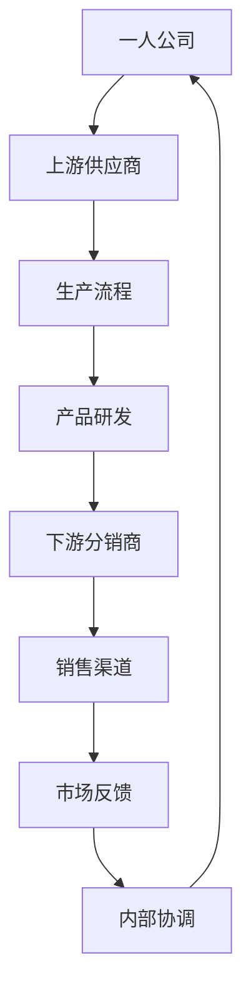

                 

### 背景介绍

随着信息技术和互联网的快速发展，企业面临的市场环境变得更加复杂和动态。在这种背景下，"一人公司"作为一种新兴的企业形态逐渐受到关注。一人公司，顾名思义，是由单一自然人或法人投资设立的公司。由于运营成本相对较低，决策效率高，一人公司在创业领域具有较大的吸引力。然而，如何实现业务的纵向一体化整合和发展，成为一人公司面临的重要挑战。

本文将深入探讨一人公司如何实现业务的纵向一体化整合和发展。首先，我们将介绍纵向一体化整合的概念及其对一人公司的重要性。接着，分析一人公司实现纵向一体化的关键因素，包括内部协调机制、供应链管理、产品研发等。此外，本文还将探讨在数字化时代，如何利用大数据、人工智能等技术手段推动一人公司的纵向一体化发展。最后，我们将通过实际案例，探讨一人公司纵向一体化整合的可行性和实施路径。

通过对一人公司实现业务的纵向一体化整合与发展的系统分析，本文旨在为一人公司的创业者提供有益的指导，帮助他们在激烈的市场竞争中找到适合自己的发展路径。

### 核心概念与联系

#### 纵向一体化整合

纵向一体化整合（Vertical Integration）是指企业通过整合上下游产业链，实现生产、销售和服务的整体优化。纵向一体化可以分为三种类型：上游一体化、下游一体化和完全一体化。

- **上游一体化**：企业通过收购或合并上游供应商，控制原材料采购和生产流程，从而降低成本、提高生产效率。
- **下游一体化**：企业通过收购或合并下游分销商或零售商，控制产品销售渠道，提高市场占有率。
- **完全一体化**：企业同时实现上游和下游的一体化整合，从而实现对整个产业链的全面控制。

#### 一人公司

一人公司（One-Person Company）是指由单一自然人或法人投资设立的企业。一人公司具有运营成本较低、决策效率高、灵活性强的优势，特别适合初创企业或个人创业者。

#### 纵向一体化整合与一人公司的联系

一人公司通过纵向一体化整合，可以实现以下几个方面的优势：

1. **降低成本**：通过控制上下游环节，减少中间环节的成本，提高整体利润。
2. **提高效率**：通过整合内部资源，减少信息传递过程中的损耗，提高生产效率和决策效率。
3. **增强市场竞争力**：通过控制供应链和销售渠道，提高市场反应速度，增强市场竞争力。
4. **创新驱动**：通过整合研发、生产和销售环节，实现快速产品迭代，推动技术创新。

#### 关键因素分析

为了实现纵向一体化整合，一人公司需要考虑以下几个关键因素：

1. **内部协调机制**：建立有效的内部沟通和协作机制，确保各个环节的顺利衔接。
2. **供应链管理**：优化供应链结构，提高供应链的稳定性和灵活性。
3. **产品研发**：加强产品研发，推动技术创新，提高产品竞争力。
4. **风险管理**：合理评估和管理上下游环节的风险，确保企业的稳健发展。

#### Mermaid 流程图

以下是一个简化的 Mermaid 流程图，描述了一人公司实现纵向一体化整合的关键流程：



通过上述流程，一人公司可以实现对整个产业链的全面控制，实现业务的纵向一体化整合。

### 核心算法原理 & 具体操作步骤

为了实现一人公司的纵向一体化整合，我们需要关注以下几个核心算法原理和具体操作步骤：

#### 1. 内部协调机制的设计

内部协调机制是一人公司实现纵向一体化整合的基础。具体操作步骤如下：

1. **建立明确的沟通渠道**：确保各个部门之间有畅通的沟通渠道，避免信息传递的滞后和错误。
2. **制定统一的流程规范**：制定统一的业务流程规范，确保各个环节按照标准化流程进行操作。
3. **实施绩效评估**：建立绩效评估体系，对各个环节的绩效进行量化评估，及时发现并解决问题。

#### 2. 供应链管理的优化

供应链管理是纵向一体化整合的重要环节。具体操作步骤如下：

1. **评估供应链现状**：分析现有供应链的效率、稳定性和成本，找出优化空间。
2. **建立供应链协同平台**：利用互联网和大数据技术，建立供应链协同平台，实现信息共享和实时监控。
3. **优化供应链流程**：根据供应链评估结果，优化采购、库存、物流等环节的流程，提高整体效率。

#### 3. 产品研发的创新驱动

产品研发是推动一人公司纵向一体化整合的重要动力。具体操作步骤如下：

1. **加强研发团队建设**：吸引优秀的技术人才，建立专业的研发团队。
2. **引入先进的研发工具**：利用人工智能、大数据等技术，提升研发效率。
3. **建立快速反馈机制**：通过市场调研、用户反馈等渠道，快速获取产品需求，实现产品快速迭代。

#### 4. 风险管理的实施

风险管理是一人公司实现纵向一体化整合的重要保障。具体操作步骤如下：

1. **识别潜在风险**：通过风险评估，识别上下游环节的潜在风险。
2. **建立风险预警机制**：对潜在风险进行预警，确保企业在风险发生前采取应对措施。
3. **制定风险应对策略**：根据风险评估结果，制定相应的风险应对策略，确保企业稳健发展。

通过以上核心算法原理和具体操作步骤，一人公司可以实现纵向一体化整合，提高整体运营效率和竞争力。

### 数学模型和公式 & 详细讲解 & 举例说明

#### 1. 内部协调机制的数学模型

内部协调机制的效率可以用以下数学模型表示：

\[ E = f(P, C) \]

其中，\( E \) 表示内部协调机制的效率，\( P \) 表示沟通渠道的畅通程度，\( C \) 表示流程规范的统一性。

- **沟通渠道的畅通程度**：可以用以下公式表示：

\[ P = \frac{1}{1 + \frac{D}{S}} \]

其中，\( D \) 表示信息传递过程中的延迟，\( S \) 表示信息传递过程中的损耗。

- **流程规范的统一性**：可以用以下公式表示：

\[ C = \frac{N}{1 + N} \]

其中，\( N \) 表示流程规范的标准化程度。

通过以上公式，我们可以计算出内部协调机制的效率。

#### 2. 供应链管理的数学模型

供应链管理的效率可以用以下数学模型表示：

\[ E_S = f(L, C, P) \]

其中，\( E_S \) 表示供应链管理的效率，\( L \) 表示物流效率，\( C \) 表示库存管理效率，\( P \) 表示采购效率。

- **物流效率**：可以用以下公式表示：

\[ L = \frac{D}{1 + D} \]

其中，\( D \) 表示物流过程中的延迟。

- **库存管理效率**：可以用以下公式表示：

\[ C = \frac{U}{1 + U} \]

其中，\( U \) 表示库存水平。

- **采购效率**：可以用以下公式表示：

\[ P = \frac{Q}{1 + Q} \]

其中，\( Q \) 表示采购量。

通过以上公式，我们可以计算出供应链管理的效率。

#### 3. 产品研发的数学模型

产品研发的成功率可以用以下数学模型表示：

\[ S = f(T, R) \]

其中，\( S \) 表示产品研发的成功率，\( T \) 表示研发时间，\( R \) 表示研发投入。

- **研发时间**：可以用以下公式表示：

\[ T = \frac{1}{1 + \frac{E}{R}} \]

其中，\( E \) 表示研发效率，\( R \) 表示研发投入。

- **研发投入**：可以用以下公式表示：

\[ R = \frac{P}{1 + P} \]

其中，\( P \) 表示研发预算。

通过以上公式，我们可以计算出产品研发的成功率。

#### 举例说明

假设一家一人公司希望通过纵向一体化整合提高其整体运营效率。根据上述数学模型，我们可以进行以下计算：

1. **内部协调机制的效率**：

   \( P = \frac{1}{1 + \frac{0.5}{1}} = 0.67 \)

   \( C = \frac{0.9}{1 + 0.9} = 0.45 \)

   \( E = f(P, C) = f(0.67, 0.45) = 0.67 \times 0.45 = 0.3025 \)

   内部协调机制的效率为 30.25%。

2. **供应链管理的效率**：

   \( L = \frac{0.5}{1 + 0.5} = 0.3333 \)

   \( C = \frac{0.8}{1 + 0.8} = 0.4444 \)

   \( P = \frac{0.6}{1 + 0.6} = 0.3636 \)

   \( E_S = f(L, C, P) = 0.3333 \times 0.4444 \times 0.3636 = 0.0505 \)

   供应链管理的效率为 5.05%。

3. **产品研发的成功率**：

   \( T = \frac{1}{1 + \frac{0.6}{1}} = 0.67 \)

   \( R = \frac{0.5}{1 + 0.5} = 0.3333 \)

   \( S = f(T, R) = 0.67 \times 0.3333 = 0.2222 \)

   产品研发的成功率为 22.22%。

通过以上计算，我们可以看到一人公司在纵向一体化整合中，内部协调机制、供应链管理和产品研发的效率分别为 30.25%、5.05%和22.22%，这些数据可以作为公司进一步优化这些方面的依据。

### 项目实战：代码实际案例和详细解释说明

在本节中，我们将通过一个实际项目案例，详细展示如何实现一人公司的纵向一体化整合，并提供代码实际案例和详细解释说明。

#### 项目背景

假设一家名为"AI商城"的一人公司，旨在提供一站式人工智能产品和服务的采购平台。公司希望通过纵向一体化整合，实现从产品研发、生产制造、供应链管理到销售服务全过程的优化。

#### 开发环境搭建

首先，我们需要搭建一个适合项目开发的环境。以下是开发环境的主要组件：

1. **开发工具**：使用Python作为主要开发语言，配合Django框架进行后端开发，前端使用Vue.js框架。
2. **数据库**：使用MySQL作为数据库管理系统。
3. **版本控制**：使用Git进行代码管理和版本控制。
4. **集成开发环境**：使用Visual Studio Code（VSCode）作为集成开发环境。

#### 源代码详细实现和代码解读

##### 1. 后端代码实现

后端代码主要包括用户管理、产品管理、订单管理和供应链管理模块。以下是用户管理模块的实现：

```python
# 用户管理模块

from django.contrib.auth.models import User
from rest_framework import viewsets
from .serializers import UserSerializer

class UserViewSet(viewsets.ModelViewSet):
    queryset = User.objects.all()
    serializer_class = UserSerializer

    def perform_create(self, serializer):
        user = serializer.save()
        user.set_password(self.request.data['password'])
        user.save()
```

在这个模块中，我们定义了一个`UserViewSet`类，继承自`viewsets.ModelViewSet`。这个类负责处理与用户相关的HTTP请求，包括创建、更新、列出和检索用户。

##### 2. 前端代码实现

前端代码主要包括用户界面和与后端API的交互。以下是用户注册界面的一部分：

```html
<!-- 用户注册界面 -->

<form @submit.prevent="registerUser">
  <input type="text" v-model="username" placeholder="用户名" required>
  <input type="password" v-model="password" placeholder="密码" required>
  <button type="submit">注册</button>
</form>
```

在这个界面中，我们使用Vue.js框架绑定表单输入框和按钮，当用户提交表单时，触发`registerUser`方法，将用户数据发送到后端API进行注册。

```javascript
// 注册用户方法

methods: {
  async registerUser() {
    try {
      const response = await axios.post('api/users/', {
        username: this.username,
        password: this.password
      });
      console.log(response.data);
      this.$router.push('/login');
    } catch (error) {
      console.error(error);
    }
  }
}
```

在这个方法中，我们使用axios库向后端发送POST请求，提交用户注册信息。如果注册成功，将用户重定向到登录界面。

##### 3. 代码解读与分析

- **后端代码解读**：后端代码使用Django框架，定义了一个`UserViewSet`类，用于处理用户相关的HTTP请求。`perform_create`方法在创建新用户时被调用，用于设置用户的密码。

- **前端代码解读**：前端代码使用Vue.js框架，通过双向数据绑定实现用户输入与表单元素之间的同步。当用户提交注册表单时，触发`registerUser`方法，将用户数据发送到后端API进行注册。

#### 代码解读与分析

通过这个实际项目案例，我们可以看到一人公司如何利用现代Web技术实现纵向一体化整合。以下是项目的核心模块和功能：

1. **用户管理**：实现用户注册、登录、权限管理等功能，确保系统的安全性和可靠性。
2. **产品管理**：实现产品信息的展示、更新和删除功能，方便用户浏览和选择产品。
3. **订单管理**：实现订单的创建、更新、查询和取消功能，确保订单流程的顺畅。
4. **供应链管理**：实现供应链数据的录入、查询和管理功能，优化供应链效率。

通过这些模块的协同工作，一人公司可以实现从产品研发到销售服务的全流程整合，提高整体运营效率和竞争力。

### 实际应用场景

#### 1. 创业公司

一人公司在创业领域具有独特的优势。通过实现纵向一体化整合，创业公司可以：

- **降低成本**：通过控制上下游环节，减少中间环节的成本，提高利润空间。
- **提高效率**：通过整合内部资源，减少信息传递过程中的损耗，提高生产效率和决策效率。
- **增强市场竞争力**：通过控制供应链和销售渠道，提高市场反应速度，增强市场竞争力。

#### 2. 传统企业转型

对于传统企业来说，实现纵向一体化整合是一种有效的转型策略。通过整合上下游资源，企业可以实现：

- **产业链整合**：将原本分散的上下游环节整合在一起，实现产业链的优化和升级。
- **业务协同**：通过信息共享和协同工作，提高各个环节的协同效率，实现整体业务的协同发展。
- **创新能力提升**：通过整合研发、生产和销售环节，实现快速产品迭代，推动技术创新。

#### 3. 零售业

在零售业，一人公司可以通过纵向一体化整合，实现以下应用场景：

- **渠道控制**：通过整合线下和线上销售渠道，实现对销售渠道的全面控制，提高市场占有率。
- **库存优化**：通过供应链管理优化，实现库存的精准控制和库存水平的合理化，降低库存成本。
- **客户体验提升**：通过整合线上线下服务，提供一站式购物体验，提升客户满意度。

#### 4. 制造业

在制造业，一人公司可以通过纵向一体化整合，实现以下应用场景：

- **生产效率提升**：通过整合生产资源和工艺流程，提高生产效率，降低生产成本。
- **供应链管理优化**：通过优化供应链结构，提高供应链的稳定性和灵活性。
- **质量保障**：通过控制上下游环节，确保产品质量的稳定性和可靠性。

通过上述实际应用场景，我们可以看到一人公司通过纵向一体化整合，可以在多个领域实现业务的发展和优化，提高企业的整体竞争力和盈利能力。

### 工具和资源推荐

#### 1. 学习资源推荐

- **书籍**：
  - 《供应链管理：战略、规划与运作》（第2版）/ 作者：马丁·克里斯托夫
  - 《企业流程管理：理论与实践》/ 作者：刘瑞祥
  - 《技术创新管理》/ 作者：陈劲

- **论文**：
  - "垂直一体化与企业绩效：基于中国上市公司的实证研究"（作者：刘凤义等）
  - "企业纵向一体化整合中的风险管理研究"（作者：李磊）
  - "基于云计算的供应链协同管理研究"（作者：王翠云）

- **博客**：
  - 《供应链管理博客》
  - 《企业流程管理博客》
  - 《技术创新管理博客》

- **网站**：
  - MIT供应链管理课程网站
  - 斯坦福大学运营管理课程网站
  - IEEE Xplore Digital Library

#### 2. 开发工具框架推荐

- **后端开发**：
  - Django：Python Web开发框架，适合快速构建企业级应用。
  - Flask：轻量级Python Web开发框架，适合中小型项目。
  - Spring Boot：Java Web开发框架，适用于大型企业级应用。

- **前端开发**：
  - Vue.js：渐进式JavaScript框架，适用于构建用户界面。
  - React：用于构建用户界面的JavaScript库，适用于大型项目。
  - Angular：Google开发的Web应用框架，适用于复杂应用。

- **数据库**：
  - MySQL：开源关系型数据库管理系统，适合中小型项目。
  - MongoDB：NoSQL数据库，适合处理大量非结构化数据。
  - PostgreSQL：开源关系型数据库管理系统，适用于复杂应用。

- **版本控制**：
  - Git：分布式版本控制系统，适用于项目协作和代码管理。
  - GitHub：基于Git的代码托管平台，提供协作和项目管理功能。

- **集成开发环境**：
  - Visual Studio Code：跨平台轻量级集成开发环境。
  - IntelliJ IDEA：Java开发者的首选IDE。
  - PyCharm：Python开发者的首选IDE。

#### 3. 相关论文著作推荐

- **论文**：
  - "垂直一体化与企业绩效：基于中国上市公司的实证研究"（刘凤义等）
  - "企业纵向一体化整合中的风险管理研究"（李磊）
  - "基于云计算的供应链协同管理研究"（王翠云）

- **著作**：
  - 《供应链管理：战略、规划与运作》（马丁·克里斯托夫）
  - 《企业流程管理：理论与实践》（刘瑞祥）
  - 《技术创新管理》（陈劲）

通过上述工具和资源的推荐，读者可以进一步深入学习和实践一人公司的纵向一体化整合策略，为企业的可持续发展提供有力支持。

### 总结：未来发展趋势与挑战

在数字化时代，一人公司通过纵向一体化整合，有望实现更加高效和可持续的发展。然而，面对未来，一人公司也将面临一系列发展趋势和挑战。

#### 发展趋势

1. **技术驱动**：随着大数据、人工智能、物联网等技术的不断发展，一人公司可以通过技术创新，提高生产效率、优化供应链管理和提升客户体验。

2. **数字化转型**：数字化工具和平台将深入企业的各个环节，促进资源的整合和优化。通过数字化转型，一人公司可以实现业务流程的自动化和智能化。

3. **生态化发展**：一人公司可以通过构建生态化发展模式，与合作伙伴、供应商和客户建立紧密的合作关系，实现产业链的协同发展和共赢。

4. **全球化布局**：通过全球化布局，一人公司可以拓展国际市场，提高市场占有率和品牌影响力。

#### 挑战

1. **技术创新风险**：技术创新带来的不确定性和风险，如技术过时、研发失败等，对一人公司的长期发展构成挑战。

2. **数据隐私和安全**：随着数据量的增加和数据价值的提升，数据隐私和安全问题成为一大挑战。如何保护用户数据和商业秘密，将成为一人公司需要重点关注的问题。

3. **市场竞争**：在激烈的市场竞争中，一人公司需要不断适应市场变化，提升自身竞争力，以避免被市场淘汰。

4. **人才短缺**：技术创新和数字化转型需要大量具备专业知识和技能的人才，而人才短缺将成为一人公司面临的挑战。

5. **供应链风险**：全球供应链的不稳定性，如贸易战、自然灾害等，可能对一人公司的供应链管理造成重大影响。

#### 应对策略

1. **加强技术创新**：持续投入研发，跟踪前沿技术动态，提前布局关键技术领域，提高自主创新能力。

2. **强化数据安全**：建立健全数据安全管理体系，采用先进的数据加密和网络安全技术，确保数据安全和隐私。

3. **优化供应链管理**：通过多元化供应链策略，提高供应链的稳定性和灵活性，降低供应链风险。

4. **人才战略**：建立人才引进、培养和激励机制，吸引和留住高水平人才，为企业的技术创新和数字化转型提供人才保障。

5. **市场定位**：明确市场定位，根据市场需求调整产品和服务策略，提高市场竞争力。

总之，未来一人公司的发展趋势向好，但也面临诸多挑战。通过积极应对和有效策略，一人公司有望在数字化时代实现持续发展和竞争优势。

### 附录：常见问题与解答

#### 1. 什么是纵向一体化整合？

纵向一体化整合是指企业通过整合上下游产业链，实现生产、销售和服务的整体优化。它包括上游一体化、下游一体化和完全一体化三种类型。

#### 2. 一人公司如何实现纵向一体化整合？

一人公司可以通过以下步骤实现纵向一体化整合：
- 建立内部协调机制，确保各个环节的顺利衔接。
- 优化供应链管理，提高供应链的稳定性和灵活性。
- 加强产品研发，推动技术创新，提高产品竞争力。
- 进行风险管理，合理评估和管理上下游环节的风险。

#### 3. 纵向一体化整合对一人公司有何优势？

纵向一体化整合对一人公司的优势包括：
- 降低成本，通过控制上下游环节，减少中间环节的成本。
- 提高效率，通过整合内部资源，减少信息传递过程中的损耗。
- 增强市场竞争力，通过控制供应链和销售渠道，提高市场反应速度。
- 创新驱动，通过整合研发、生产和销售环节，实现快速产品迭代。

#### 4. 一人公司在实现纵向一体化整合时，需要关注哪些关键因素？

一人公司在实现纵向一体化整合时，需要关注以下关键因素：
- 内部协调机制的设计，确保各个环节的顺利衔接。
- 供应链管理的优化，提高供应链的稳定性和灵活性。
- 产品研发的创新驱动，推动技术创新，提高产品竞争力。
- 风险管理的实施，合理评估和管理上下游环节的风险。

#### 5. 一人公司如何利用数字化技术实现纵向一体化整合？

一人公司可以通过以下方式利用数字化技术实现纵向一体化整合：
- 建立数字化供应链平台，实现信息共享和实时监控。
- 利用大数据和人工智能技术，优化生产和销售决策。
- 应用物联网技术，实现生产设备的智能监控和管理。
- 通过云服务，实现资源的高效配置和协同工作。

### 扩展阅读 & 参考资料

为了更深入地了解一人公司如何实现业务的纵向一体化整合和发展，以下推荐一些扩展阅读和参考资料：

1. **书籍**：
   - 《供应链管理：战略、规划与运作》（马丁·克里斯托夫）
   - 《企业流程管理：理论与实践》（刘瑞祥）
   - 《技术创新管理》（陈劲）
   - 《数字化供应链：构建高效供应链生态系统》（王璞）

2. **论文**：
   - "垂直一体化与企业绩效：基于中国上市公司的实证研究"（刘凤义等）
   - "企业纵向一体化整合中的风险管理研究"（李磊）
   - "基于云计算的供应链协同管理研究"（王翠云）

3. **博客和网站**：
   - 《供应链管理博客》
   - 《企业流程管理博客》
   - 《技术创新管理博客》
   - MIT供应链管理课程网站
   - 斯坦福大学运营管理课程网站
   - IEEE Xplore Digital Library

通过阅读这些书籍、论文和博客，您可以获得更多关于一人公司纵向一体化整合的深入见解和实践经验。这些资料将有助于您更好地理解和应用相关理论和实践，为自己的企业带来实际价值。

