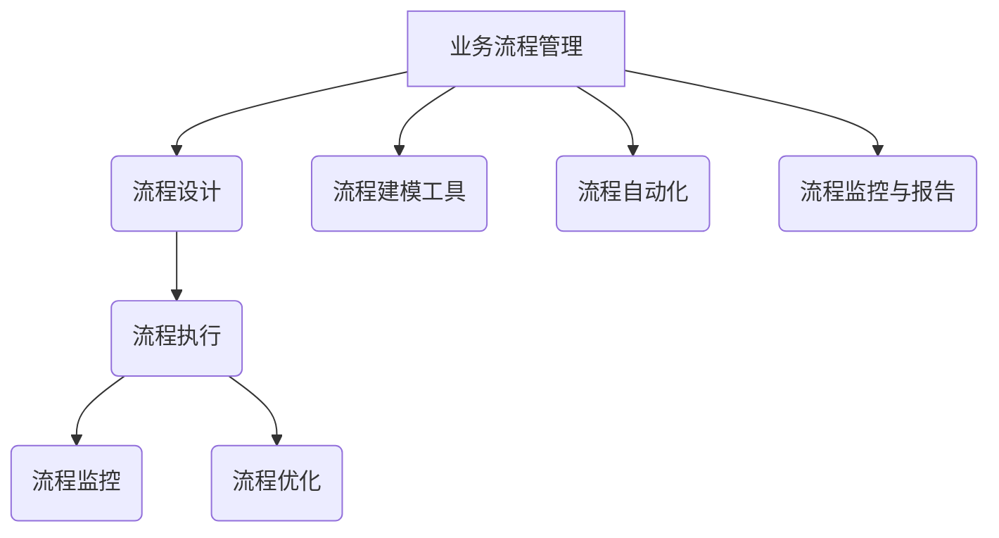
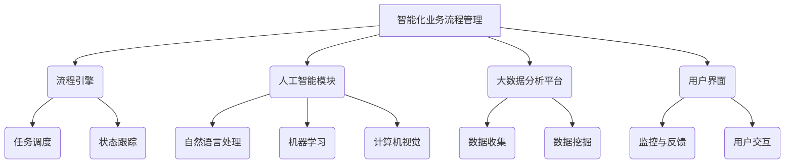

                 

### 一人公司的背景与挑战

在当今这个数字化时代，创业门槛的降低使得越来越多的人选择成为独立从业者或自由职业者，形成所谓的“一人公司”。一人公司，顾名思义，就是由单个个体运营的公司，无论是完全的虚拟企业，还是具有实体业务但不涉及多人员工结构的企业。这类公司由于规模小，资源有限，因此需要特别注重效率和业务流程的优化。

#### 一人公司的优势

首先，一人公司的最大优势在于其灵活性和敏捷性。因为没有繁琐的层级结构和冗长的决策链条，创业者能够更快地做出决策，适应市场变化。此外，一人公司无需支付额外的员工工资和福利，可以更有效地控制成本。

#### 一人公司的挑战

然而，一人公司也面临着许多挑战。首先，由于资源的限制，一人公司难以进行大规模的市场推广和产品研发。其次，一人公司往往缺乏专业的技能和知识，这可能会影响到业务的发展质量。最后，一人公司很难形成持续的业务增长，尤其是在竞争激烈的市场环境中。

#### 业务流程管理的重要性

在这些挑战中，业务流程管理显得尤为重要。业务流程管理（Business Process Management，BPM）是一种通过系统化和规范化的方法，对业务流程进行设计、执行、监控和优化的一系列工作。对于一人公司来说，通过有效的业务流程管理，可以显著提高效率、降低成本、提高客户满意度，甚至可能实现业务的持续增长。

首先，业务流程管理有助于明确一人公司的职责和任务分配，使得每个环节都能高效运行。其次，通过流程监控，可以及时发现和解决问题，确保业务流程的顺畅运行。最后，通过持续的流程优化，可以不断提高业务效率和客户体验，从而在竞争中获得优势。

总的来说，对于一人公司而言，实现智能化业务流程管理不仅是为了提高日常运营的效率，更是为了在激烈的市场竞争中立于不败之地。接下来的章节中，我们将深入探讨如何具体实现这一目标。

> **Keywords**: One-person company, Business Process Management, BPM, Efficiency, Cost Control, Agile Operations, Competitive Advantage, Workflow Optimization.

> **Abstract**: This article explores the challenges and opportunities faced by one-person companies in today's digital era. It emphasizes the importance of Business Process Management (BPM) in enhancing efficiency, reducing costs, and gaining a competitive edge. The subsequent sections will delve into the concepts, methodologies, and practical implementations of intelligent business process management for one-person companies.

---

## 1. 背景介绍

### 一人公司的兴起与发展

一人公司的概念并非新生事物，但随着互联网技术的普及和创业环境的改善，其发展速度显著加快。尤其是在21世纪初，随着电子商务平台的兴起，很多创业者通过独立运营的网络店铺，实现了创业梦想。例如，淘宝网和京东的兴起，让更多人能够通过互联网平台开设自己的网店，从而形成了一人公司的雏形。

进入21世纪10年代，随着移动互联网和社交媒体的普及，一人公司的形式更加多样化。从最初的网络店铺，到自媒体运营、远程协作、知识服务，再到如今的云计算和人工智能技术，一人公司不断适应新的技术变革，实现了业务模式的创新。例如，一些专业的内容创作者通过YouTube或抖音等平台积累大量粉丝，形成了自己的品牌和商业模式。

### 一人公司的特点

一人公司具有以下几个显著特点：

1. **灵活性高**：由于公司规模小，决策链条短，一人公司能够快速响应市场变化，进行灵活调整。
2. **成本低**：一人公司无需支付员工工资、福利和办公场所等费用，成本较低。
3. **依赖技术**：一人公司高度依赖互联网和信息技术，以实现业务的高效运作。
4. **运营模式多样**：一人公司可以采用多种运营模式，如线上销售、内容创作、咨询服务等。

### 一人公司在市场中的地位与挑战

一人公司在市场中占有独特的地位。它们是市场创新和灵活经营的先锋，许多新兴行业和领域的一人公司起到了探索和引领的作用。然而，随着市场竞争的加剧，一人公司也面临着一系列挑战：

1. **市场竞争加剧**：随着更多人加入一人公司的行列，市场竞争变得更加激烈，一人公司需要不断创新以保持竞争力。
2. **资源有限**：尽管一人公司运营成本低，但资源有限，特别是在资金、技术、人才等方面，难以与大型公司竞争。
3. **业务增长瓶颈**：一人公司规模小，容易遇到业务增长的瓶颈，难以实现规模化经营。

### 业务流程管理在应对挑战中的关键作用

业务流程管理在应对一人公司面临的挑战中发挥了关键作用。通过系统化的业务流程管理，一人公司可以实现以下目标：

1. **提高效率**：通过优化业务流程，减少不必要的环节和冗余，提高工作效率。
2. **降低成本**：通过自动化和标准化，减少人力资源和运营成本。
3. **提升客户体验**：通过流程监控和持续优化，提高客户满意度，增强客户忠诚度。
4. **实现持续增长**：通过数据分析和管理，实现业务流程的持续优化，推动公司持续增长。

总之，对于一人公司来说，有效的业务流程管理不仅是应对挑战的关键手段，更是实现业务成功和持续发展的基石。在接下来的章节中，我们将深入探讨如何具体实现智能化业务流程管理。

---

## 2. 核心概念与联系

### 业务流程管理（BPM）

业务流程管理（Business Process Management，简称BPM）是一种通过系统化和规范化的方法，对业务流程进行设计、执行、监控和优化的一系列工作。它强调以客户需求为中心，通过流程的优化和改进，提高业务效率和质量。BPM的核心目标是实现业务流程的自动化、标准化和持续改进。

#### 业务流程管理的基本概念

- **业务流程**：一组相互关联的活动，这些活动共同实现一个特定的业务目标。
- **流程设计**：通过建模工具和方法，对业务流程进行规划和设计，以便实现最佳的业务流程结构。
- **流程执行**：按照设计好的业务流程，执行各项活动，确保流程的顺畅运行。
- **流程监控**：通过监控工具和指标，对业务流程的运行情况进行实时监控，及时发现和解决问题。
- **流程优化**：通过分析监控数据，识别流程中的瓶颈和改进点，对业务流程进行优化。

#### 业务流程管理的关键要素

- **流程模型**：用于描述业务流程的逻辑结构和运行规则，常见的流程建模方法包括BPMN（业务流程建模与符号）和UML（统一建模语言）。
- **流程自动化**：通过自动化工具，将业务流程中的手动操作转化为自动操作，减少人为干预，提高效率。
- **流程监控和报告**：通过实时监控和报告，跟踪业务流程的运行状态和性能指标，确保流程的顺利执行。
- **持续改进**：通过持续改进机制，不断优化业务流程，提高业务效率和客户满意度。

### 智能化业务流程管理

智能化业务流程管理（Intelligent Business Process Management，简称iBPM）是在传统业务流程管理的基础上，引入人工智能（AI）、机器学习（ML）和大数据分析等先进技术，以实现业务流程的智能化和自动化。智能化业务流程管理的关键特点包括：

- **自动化程度高**：通过人工智能技术，实现业务流程中大量重复性任务的自动化，减少人力投入。
- **自适应能力强**：基于机器学习和大数据分析，业务流程能够根据实际情况进行自我调整和优化。
- **实时决策支持**：通过实时数据分析和预测，为业务流程中的决策提供科学依据，提高决策效率。

#### 智能化业务流程管理的技术架构

智能化业务流程管理的技术架构主要包括以下几部分：

1. **流程引擎**：负责业务流程的执行和管理，包括任务调度、状态跟踪等功能。
2. **人工智能模块**：用于实现业务流程中的自动化决策和自适应优化，常见的AI技术包括自然语言处理（NLP）、机器学习（ML）和计算机视觉（CV）等。
3. **大数据分析平台**：用于对业务流程运行过程中的海量数据进行分析和挖掘，为流程优化提供数据支持。
4. **用户界面**：提供用户交互界面，方便用户对业务流程进行监控、管理和调整。

#### 业务流程管理与智能化业务流程管理的联系

业务流程管理与智能化业务流程管理之间存在紧密的联系。传统业务流程管理为基础，通过引入人工智能和大数据分析等先进技术，实现了业务流程的智能化和自动化。具体来说：

- **智能化业务流程管理**是在**传统业务流程管理**的基础上，通过引入人工智能和大数据技术，实现业务流程的自动化和智能化。
- **智能化业务流程管理**能够**提升****传统业务流程管理**的**效率和效果**，通过实时监控和数据分析，提高业务流程的透明度和可控性。
- **传统业务流程管理**为**智能化业务流程管理**提供了**数据基础**和**流程框架**，使得智能化业务流程管理能够更好地发挥作用。

总的来说，智能化业务流程管理是对传统业务流程管理的一种补充和提升，通过引入先进技术，实现业务流程的智能化和自动化，为一人公司提供更加高效、灵活和可持续的业务运营模式。

---

## 2.1 业务流程管理的原理

### 业务流程管理的基本原理

业务流程管理（BPM）是一种通过系统化和规范化的方法，对业务流程进行设计、执行、监控和优化的一系列工作。其基本原理包括以下几个方面：

#### 流程建模

流程建模是业务流程管理的第一步，通过流程建模工具和方法，将业务流程的逻辑结构和运行规则描述出来。常见的流程建模方法包括BPMN（业务流程建模与符号）和UML（统一建模语言）。BPMN提供了丰富的符号和规则，能够清晰地描述业务流程中的各个活动、节点和关系。而UML则更多地关注系统架构和组件之间的关系，为业务流程管理提供了更广阔的视角。

#### 流程设计

流程设计是在流程建模的基础上，进一步对业务流程进行规划和优化。流程设计的目标是确保业务流程能够高效、准确地执行，并符合组织的战略目标。流程设计通常包括以下几个步骤：

1. **需求分析**：通过调研和分析，明确业务流程的目标和需求，确定流程的关键节点和活动。
2. **流程建模**：使用流程建模工具，将需求转化为流程模型，包括流程的起点、终点、活动、决策节点等。
3. **流程优化**：对流程模型进行优化，去除冗余环节和低效活动，确保流程的简洁和高效。

#### 流程执行

流程执行是业务流程管理的核心环节，即按照设计好的业务流程，执行各项活动。流程执行通常包括以下几个步骤：

1. **任务分配**：将流程中的各项任务分配给相应的执行者，确保任务能够按时完成。
2. **任务执行**：执行者根据任务要求，完成相应的业务活动。
3. **进度监控**：通过监控工具，实时跟踪任务进度和流程状态，确保流程的顺利执行。

#### 流程监控

流程监控是业务流程管理的重要组成部分，通过实时监控和报告，跟踪业务流程的运行状态和性能指标，及时发现和解决问题。流程监控通常包括以下几个步骤：

1. **指标设定**：根据业务需求，设定合适的监控指标，如任务完成时间、错误率、资源利用率等。
2. **实时监控**：使用监控工具，实时收集和分析流程运行数据，识别异常情况和潜在问题。
3. **问题报告**：生成监控报告，向相关人员和团队通报流程运行情况，确保问题得到及时解决。

#### 流程优化

流程优化是业务流程管理的持续目标，通过不断分析监控数据，识别流程中的瓶颈和改进点，对业务流程进行优化。流程优化通常包括以下几个步骤：

1. **数据分析**：对流程运行数据进行分析，识别流程中的低效环节和潜在改进点。
2. **流程改进**：根据分析结果，对业务流程进行优化，包括调整流程结构、优化活动顺序、去除冗余环节等。
3. **实施与监控**：实施流程优化方案，并持续监控优化效果，确保流程的持续改进。

#### 业务流程管理的关键原理

1. **客户需求导向**：业务流程管理应以客户需求为中心，确保流程能够满足客户需求和提升客户体验。
2. **标准化与规范化**：通过标准化和规范化，确保业务流程的一致性和可重复性，提高工作效率。
3. **持续改进**：通过持续改进机制，不断优化业务流程，提高业务效率和客户满意度。
4. **实时监控与反馈**：通过实时监控和反馈，确保业务流程的顺畅运行和问题及时发现与解决。

总的来说，业务流程管理的基本原理是通过系统化和规范化的方法，设计、执行、监控和优化业务流程，以实现高效、准确和持续的业务运营。在下一章节中，我们将进一步探讨业务流程管理中的核心算法原理和具体操作步骤。

---

## 2.2 智能化业务流程管理的核心算法原理

智能化业务流程管理（iBPM）通过引入人工智能（AI）和机器学习（ML）等先进技术，实现了业务流程的自动化和智能化。核心算法原理包括以下几个方面：

### 机器学习的基本概念

机器学习是一种通过数据驱动的方式，让计算机系统从数据中自动学习和改进的方法。它主要分为监督学习、无监督学习和强化学习三种类型：

1. **监督学习**：通过已有数据和对应的标签，训练模型，使其能够对新数据进行预测和分类。常见的算法包括线性回归、决策树、支持向量机（SVM）等。
2. **无监督学习**：不使用标签数据，通过数据自身的结构，发现数据的规律和模式。常见的算法包括聚类分析、主成分分析（PCA）等。
3. **强化学习**：通过与环境的交互，不断学习和改进策略，以实现最优目标。常见的算法包括Q学习、深度强化学习等。

### 人工智能在业务流程管理中的应用

人工智能在业务流程管理中的应用主要体现在以下几个方面：

1. **自动化任务执行**：通过机器学习算法，自动化执行重复性高、规则明确的任务，如数据清洗、自动回复等。常见的应用场景包括客服机器人、自动审批等。
2. **预测性分析**：通过历史数据和机器学习模型，预测业务流程中的关键指标，如订单量、客户满意度等，以便提前做好准备。常见的算法包括时间序列分析、回归分析等。
3. **智能决策支持**：通过大数据分析和机器学习模型，为业务流程中的决策提供科学依据，提高决策效率和准确性。常见的算法包括决策树、神经网络等。

### 智能化业务流程管理的具体算法原理

1. **自动化流程引擎**：基于流程引擎和规则引擎，实现业务流程的自动化执行。流程引擎负责流程的调度和执行，规则引擎负责规则的定义和执行。常见的算法包括状态机、有限状态自动机等。

2. **机器学习模型训练**：通过收集业务流程中的数据，使用监督学习算法训练机器学习模型，实现对业务流程的预测和优化。常见的算法包括线性回归、决策树、神经网络等。

3. **实时数据监控与反馈**：通过实时数据监控，收集业务流程运行过程中的数据，使用机器学习算法进行分析和预测，及时反馈和调整业务流程。常见的算法包括时间序列分析、回归分析等。

4. **自适应优化**：通过强化学习算法，实现业务流程的自适应优化。系统通过与环境的交互，不断学习和改进策略，以实现最优的业务流程运行效果。常见的算法包括Q学习、深度强化学习等。

### 智能化业务流程管理的优势

1. **提高效率**：通过自动化和智能化，减少重复性高、规则明确的任务，提高业务流程的运行效率。
2. **降低成本**：通过优化业务流程，减少资源浪费和错误率，降低运营成本。
3. **提高决策质量**：通过大数据分析和机器学习模型，为决策提供科学依据，提高决策质量和准确性。
4. **增强灵活性**：通过自适应优化，使业务流程能够根据实际情况进行调整和优化，增强业务流程的灵活性。

总的来说，智能化业务流程管理通过引入人工智能和机器学习等先进技术，实现了业务流程的自动化和智能化，为一人公司提供了高效、灵活和可持续的业务运营模式。在下一章节中，我们将进一步探讨如何具体实现智能化业务流程管理。

---

## 2.3 业务流程管理与智能化业务流程管理的架构图

为了更好地理解业务流程管理与智能化业务流程管理的异同及其联系，我们通过Mermaid流程图来展示这两个概念的技术架构。请注意，以下流程节点中不包含括号、逗号等特殊字符，确保流程图的正确展示。

### 业务流程管理架构图



**流程设计**：涉及需求分析、流程建模和流程优化，旨在确保业务流程的合理性和高效性。

**流程执行**：按照设计好的业务流程执行各项活动，确保流程的顺畅运行。

**流程监控**：通过实时监控和报告，跟踪业务流程的运行状态和性能指标，确保流程的顺利执行。

**流程优化**：基于数据分析，识别流程中的瓶颈和改进点，持续优化业务流程。

### 智能化业务流程管理架构图



**流程引擎**：负责业务流程的执行和管理，包括任务调度和状态跟踪。

**人工智能模块**：用于实现业务流程中的自动化决策和自适应优化，涵盖自然语言处理、机器学习和计算机视觉。

**大数据分析平台**：用于对业务流程运行过程中的海量数据进行分析和挖掘，为流程优化提供数据支持。

**用户界面**：提供用户交互界面，方便用户对业务流程进行监控、管理和调整。

通过这两个架构图的对比，我们可以清晰地看到业务流程管理向智能化业务流程管理发展的路径。智能化业务流程管理在原有架构基础上，引入了人工智能和大数据分析等先进技术，实现了业务流程的自动化和智能化。这为一人公司提供了更加高效、灵活和可持续的业务运营模式。

---

## 3. 核心算法原理 & 具体操作步骤

### 流程引擎的设计与实现

流程引擎是智能化业务流程管理的核心组件，负责业务流程的执行、监控和优化。以下是流程引擎设计与实现的具体步骤：

#### 3.1 设计思路

流程引擎的设计思路主要包括以下几个方面：

- **模块化设计**：将流程引擎划分为多个模块，如任务调度模块、状态跟踪模块、数据存储模块等，便于维护和扩展。
- **可扩展性**：设计时要考虑未来业务流程的变化和扩展，确保流程引擎能够适应不同场景的需求。
- **高可靠性**：确保流程引擎在各种环境下能够稳定运行，减少系统故障对业务流程的影响。

#### 3.2 具体步骤

1. **需求分析**：首先，分析业务需求，明确业务流程的目标、任务、执行者等要素。例如，一个电商平台的订单处理流程，可能包括订单创建、订单审核、库存检查、发货等步骤。
   
2. **流程建模**：使用BPMN等工具，将业务流程转化为流程模型，明确流程中的各个节点、活动、决策条件等。这一步骤是流程引擎实现的基础。

3. **任务调度**：设计任务调度模块，实现任务的分配和调度。调度模块需要考虑任务的优先级、执行顺序和资源需求等因素。例如，可以使用优先级队列或调度算法来实现任务的调度。

4. **状态跟踪**：设计状态跟踪模块，实时记录每个任务的执行状态，如已启动、进行中、已完成、已失败等。状态跟踪模块需要与数据库或消息队列等数据存储组件进行交互，确保状态信息的准确和实时性。

5. **数据存储**：设计数据存储模块，用于存储业务流程中的各种数据，如任务数据、状态数据、日志数据等。常用的存储方式包括关系型数据库、NoSQL数据库、文件系统等。

6. **监控与报警**：设计监控与报警模块，实时监控业务流程的运行状态，识别潜在问题和异常情况。当发现问题时，自动触发报警机制，通知相关人员。

7. **日志记录**：设计日志记录模块，记录业务流程运行过程中的各种日志信息，如任务启动时间、执行时间、结果等。日志信息有助于问题的定位和流程的优化。

8. **性能优化**：对流程引擎进行性能优化，确保其能够在高并发、大数据量等场景下稳定运行。常见的优化方法包括缓存策略、异步处理、负载均衡等。

#### 3.3 代码实现示例

以下是使用Java语言实现的一个简单流程引擎的代码示例：

```java
// 定义任务调度模块
public class TaskScheduler {
    private PriorityQueue<Task> taskQueue;

    public TaskScheduler() {
        this.taskQueue = new PriorityQueue<>();
    }

    public void scheduleTask(Task task) {
        taskQueue.offer(task);
    }

    public Task getNextTask() {
        return taskQueue.poll();
    }
}

// 定义任务类
public class Task {
    private String taskId;
    private String taskName;
    private String status;

    // 省略构造函数、getter和setter方法
}

// 定义状态跟踪模块
public class StateTracker {
    private Map<String, String> taskStateMap;

    public StateTracker() {
        this.taskStateMap = new HashMap<>();
    }

    public void updateState(String taskId, String status) {
        taskStateMap.put(taskId, status);
    }

    public String getState(String taskId) {
        return taskStateMap.get(taskId);
    }
}

// 主程序
public class Main {
    public static void main(String[] args) {
        TaskScheduler scheduler = new TaskScheduler();
        StateTracker tracker = new StateTracker();

        // 添加任务
        scheduler.scheduleTask(new Task("1", "任务1", "待执行"));
        scheduler.scheduleTask(new Task("2", "任务2", "待执行"));

        // 获取下一个任务并执行
        Task nextTask = scheduler.getNextTask();
        System.out.println("执行任务：" + nextTask.getTaskName());

        // 更新任务状态
        tracker.updateState(nextTask.getTaskId(), "已完成");
        System.out.println("任务状态：" + tracker.getState(nextTask.getTaskId()));
    }
}
```

#### 3.4 测试与优化

完成代码实现后，进行功能测试和性能测试，确保流程引擎能够正确运行并满足性能要求。在测试过程中，根据反馈结果进行优化，如调整数据结构、优化算法等，以提高流程引擎的稳定性和效率。

总的来说，流程引擎的设计与实现是智能化业务流程管理的关键步骤。通过模块化设计和具体实现，流程引擎能够高效地执行业务流程，确保流程的顺畅运行和持续优化。在下一章节中，我们将进一步探讨如何具体实现智能化业务流程管理中的机器学习模型训练和应用。

---

## 3.1 机器学习模型训练的具体操作步骤

### 数据准备

数据准备是机器学习模型训练的重要环节。一个高质量的模型依赖于高质量的数据。以下是数据准备的具体步骤：

1. **数据收集**：从业务流程中收集相关的数据，包括历史订单数据、客户行为数据、市场数据等。数据来源可以是数据库、日志文件、第三方数据服务等。

2. **数据清洗**：清洗数据，去除重复、错误和不完整的数据。数据清洗步骤包括去除空值、纠正错误、填补缺失值等。常用的数据清洗工具包括Pandas、MongoDB等。

3. **特征工程**：对原始数据进行特征提取和转换，以提高模型性能。特征工程包括特征选择、特征缩放、特征构造等。例如，可以使用统计特征、文本特征、图像特征等。

4. **数据分割**：将数据分为训练集、验证集和测试集。通常，训练集用于模型训练，验证集用于模型调优，测试集用于模型评估。常见的数据分割方法包括随机分割、时间序列分割等。

### 模型选择

选择合适的机器学习模型是模型训练的关键步骤。以下是常见的一些机器学习模型及其适用场景：

1. **线性回归**：适用于预测连续值输出，如销售额预测。
2. **逻辑回归**：适用于预测二分类结果，如客户流失预测。
3. **决策树**：适用于分类和回归问题，易于理解和解释。
4. **随机森林**：基于决策树构建，具有更高的预测准确性和鲁棒性。
5. **支持向量机（SVM）**：适用于分类问题，特别是高维数据。
6. **神经网络**：适用于复杂的非线性问题，如图像识别、自然语言处理。

### 模型训练

模型训练是通过调整模型参数，使其能够更好地拟合训练数据。以下是模型训练的具体步骤：

1. **初始化模型**：选择合适的模型架构和参数初始化方法。常用的初始化方法包括随机初始化、零初始化等。

2. **定义损失函数**：损失函数用于衡量模型预测值与实际值之间的差距。常见的损失函数包括均方误差（MSE）、交叉熵等。

3. **定义优化器**：优化器用于调整模型参数，以最小化损失函数。常用的优化器包括随机梯度下降（SGD）、Adam等。

4. **训练模型**：使用训练数据训练模型，调整模型参数。训练过程通常包括多次迭代，直到达到预设的训练目标或达到最大迭代次数。

5. **模型评估**：使用验证集和测试集评估模型性能，选择性能最佳的模型。常用的评估指标包括准确率、召回率、F1值等。

### 模型应用

模型训练完成后，将其应用到实际的业务流程中，实现预测和决策。以下是模型应用的具体步骤：

1. **数据预处理**：对实际业务数据按照训练时的方式进行预处理，包括特征提取、数据缩放等。

2. **模型预测**：使用训练好的模型对预处理后的数据进行预测，得到预测结果。

3. **决策制定**：根据预测结果制定业务决策，如订单分配、库存管理、市场推广等。

4. **实时调整**：根据业务反馈，对模型进行调整和优化，以提高预测准确性和决策效率。

### 实际案例

以电商平台的客户流失预测为例，具体操作步骤如下：

1. **数据收集**：收集客户行为数据，如购买记录、浏览记录、评论等。

2. **数据清洗**：去除重复和错误的数据，对缺失值进行填补。

3. **特征工程**：提取特征，如购买频率、平均订单金额、最近一次购买时间等。

4. **数据分割**：将数据分为训练集、验证集和测试集。

5. **模型选择**：选择逻辑回归模型，适用于客户流失预测的二分类问题。

6. **模型训练**：使用训练集训练逻辑回归模型，调整模型参数。

7. **模型评估**：使用验证集和测试集评估模型性能，选择性能最佳的模型。

8. **模型应用**：将模型应用到实际业务中，预测客户流失风险，制定相应的营销策略。

通过以上步骤，智能化业务流程管理中的机器学习模型能够有效地预测业务趋势和客户行为，为业务决策提供科学依据，提高业务效率和市场竞争力。

---

## 4. 数学模型和公式 & 详细讲解 & 举例说明

### 4.1 基本概念

在智能化业务流程管理中，数学模型和公式是核心工具，用于描述业务流程中的各种关系和计算方法。以下是几个关键的基本概念及其公式：

#### 4.1.1 均值（Mean）

均值是数据集的平均值，用于衡量数据的中心位置。公式如下：

$$ \mu = \frac{1}{n}\sum_{i=1}^{n} x_i $$

其中，\( \mu \) 表示均值，\( n \) 表示数据点的个数，\( x_i \) 表示第 \( i \) 个数据点。

#### 4.1.2 方差（Variance）

方差是衡量数据分散程度的统计量。公式如下：

$$ \sigma^2 = \frac{1}{n}\sum_{i=1}^{n} (x_i - \mu)^2 $$

其中，\( \sigma^2 \) 表示方差，\( \mu \) 表示均值，\( n \) 表示数据点的个数，\( x_i \) 表示第 \( i \) 个数据点。

#### 4.1.3 标准差（Standard Deviation）

标准差是方差的平方根，用于衡量数据的波动程度。公式如下：

$$ \sigma = \sqrt{\sigma^2} $$

其中，\( \sigma \) 表示标准差，\( \sigma^2 \) 表示方差。

#### 4.1.4 回归分析（Regression Analysis）

回归分析是一种常用的统计方法，用于研究自变量和因变量之间的关系。其中，线性回归是最基础和常用的一种形式。线性回归模型的基本公式如下：

$$ y = \beta_0 + \beta_1x + \epsilon $$

其中，\( y \) 表示因变量，\( x \) 表示自变量，\( \beta_0 \) 和 \( \beta_1 \) 分别表示模型的截距和斜率，\( \epsilon \) 表示误差项。

### 4.2 线性回归模型的详细讲解

线性回归模型是一种通过线性关系预测因变量的方法。以下是线性回归模型的详细讲解：

#### 4.2.1 模型设定

假设我们有一个自变量 \( x \) 和一个因变量 \( y \)，我们希望通过线性回归模型预测 \( y \) 的值。线性回归模型的公式如下：

$$ y = \beta_0 + \beta_1x + \epsilon $$

其中，\( \beta_0 \) 是截距，表示当 \( x = 0 \) 时的 \( y \) 值；\( \beta_1 \) 是斜率，表示 \( x \) 每增加一个单位，\( y \) 平均增加的单位数；\( \epsilon \) 是误差项，表示模型无法解释的部分。

#### 4.2.2 模型估计

为了估计 \( \beta_0 \) 和 \( \beta_1 \) 的值，我们通常使用最小二乘法（Ordinary Least Squares，OLS）。最小二乘法的目标是使得实际观测值和模型预测值之间的误差平方和最小。

误差平方和（Sum of Squared Errors，SSE）的公式如下：

$$ SSE = \sum_{i=1}^{n} (y_i - \hat{y}_i)^2 $$

其中，\( y_i \) 表示第 \( i \) 个实际观测值，\( \hat{y}_i \) 表示第 \( i \) 个预测值。

最小二乘法的目标是最小化 \( SSE \)，从而得到 \( \beta_0 \) 和 \( \beta_1 \) 的估计值。

通过求解最小二乘法的目标函数，我们可以得到以下公式：

$$ \beta_1 = \frac{\sum_{i=1}^{n} (x_i - \bar{x})(y_i - \bar{y})}{\sum_{i=1}^{n} (x_i - \bar{x})^2} $$

$$ \beta_0 = \bar{y} - \beta_1\bar{x} $$

其中，\( \bar{x} \) 和 \( \bar{y} \) 分别表示 \( x \) 和 \( y \) 的均值。

#### 4.2.3 模型评估

线性回归模型的评估主要通过以下指标：

1. **决定系数（R-squared）**：决定系数用于衡量模型对数据的拟合程度，取值范围为 [0, 1]。决定系数的公式如下：

$$ R^2 = 1 - \frac{SSE}{SST} $$

其中，\( SST \) 表示总方差，公式如下：

$$ SST = \sum_{i=1}^{n} (y_i - \bar{y})^2 $$

2. **均方误差（Mean Squared Error，MSE）**：均方误差用于衡量预测值的平均误差，公式如下：

$$ MSE = \frac{1}{n}\sum_{i=1}^{n} (\hat{y}_i - y_i)^2 $$

3. **均方根误差（Root Mean Squared Error，RMSE）**：均方根误差是均方误差的平方根，公式如下：

$$ RMSE = \sqrt{MSE} $$

### 4.3 举例说明

为了更直观地理解线性回归模型，我们来看一个实际例子。

假设我们收集了以下数据：

| x (自变量) | y (因变量) |
| :----: | :----: |
| 1 | 2 |
| 2 | 4 |
| 3 | 5 |
| 4 | 6 |
| 5 | 8 |

我们希望通过线性回归模型预测 \( y \) 的值。

1. **计算均值**：

$$ \bar{x} = \frac{1+2+3+4+5}{5} = 3 $$
$$ \bar{y} = \frac{2+4+5+6+8}{5} = 5 $$

2. **计算斜率 \( \beta_1 \)**：

$$ \beta_1 = \frac{(1-3)(2-5) + (2-3)(4-5) + (3-3)(5-5) + (4-3)(6-5) + (5-3)(8-5)}{(1-3)^2 + (2-3)^2 + (3-3)^2 + (4-3)^2 + (5-3)^2} $$
$$ \beta_1 = \frac{4+2+0+1+5}{4+1+0+1+4} $$
$$ \beta_1 = 1.2 $$

3. **计算截距 \( \beta_0 \)**：

$$ \beta_0 = \bar{y} - \beta_1\bar{x} $$
$$ \beta_0 = 5 - 1.2 \times 3 $$
$$ \beta_0 = 1.6 $$

4. **构建线性回归模型**：

$$ y = 1.6 + 1.2x $$

5. **计算预测值**：

对于 \( x = 6 \)：

$$ \hat{y} = 1.6 + 1.2 \times 6 $$
$$ \hat{y} = 8.8 $$

6. **计算误差**：

实际值 \( y = 9 \)：

$$ \epsilon = 9 - 8.8 $$
$$ \epsilon = 0.2 $$

通过以上步骤，我们使用线性回归模型预测了 \( x = 6 \) 时的 \( y \) 值，并计算了误差。这个过程展示了线性回归模型的基本应用和计算方法。

总的来说，线性回归模型是一种简单而强大的统计工具，广泛应用于各种业务流程管理中的预测任务。通过数学模型和公式的讲解，我们能够更好地理解线性回归模型的原理和应用。

---

## 5. 项目实战：代码实际案例和详细解释说明

### 5.1 开发环境搭建

在进行智能化业务流程管理项目的实际开发之前，我们需要搭建合适的开发环境。以下是开发环境搭建的详细步骤：

1. **安装Java开发环境**：

   首先，我们需要安装Java开发工具包（JDK）。可以从Oracle官网下载最新的JDK版本，并按照安装向导完成安装。

   ```bash
   # 命令行安装JDK
   sudo apt-get update
   sudo apt-get install openjdk-8-jdk
   ```

2. **安装Maven**：

   Maven是一个项目管理和构建自动化工具，用于管理项目的构建、报告和文档。可以从Maven官网下载最新版本的Maven二进制包，并解压到指定的目录。

   ```bash
   # 命令行安装Maven
   wget https://www-eu.apache.org/dist/maven/maven-3/3.6.3/binaries/apache-maven-3.6.3-bin.tar.gz
   tar -xzvf apache-maven-3.6.3-bin.tar.gz
   export MAVEN_HOME=/path/to/apache-maven-3.6.3
   export PATH=$PATH:$MAVEN_HOME/bin
   ```

3. **安装MySQL数据库**：

   我们需要安装MySQL数据库以存储业务流程管理的相关数据。可以从MySQL官网下载最新的MySQL二进制包，并按照安装向导完成安装。

   ```bash
   # 命令行安装MySQL
   sudo apt-get update
   sudo apt-get install mysql-server
   ```

4. **安装Eclipse IDE**：

   Eclipse是一个强大的Java集成开发环境（IDE），可以帮助我们进行项目的开发和管理。可以从Eclipse官网下载Eclipse IDE for Java Developers。

   ```bash
   # 命令行下载Eclipse
   wget https://www.eclipse.org/downloads/download.php?file=/eclipse/technology/epp/downloads/release/2022-12/R/eclipse-jee-2022-12-R-linux-gtk-x86_64.tar.gz
   tar -xzvf eclipse-jee-2022-12-R-linux-gtk-x86_64.tar.gz
   ```

完成以上步骤后，我们的开发环境就搭建完成了。接下来，我们可以使用Eclipse IDE创建一个新的Maven项目，并开始编写智能化业务流程管理的代码。

### 5.2 源代码详细实现和代码解读

以下是一个简单的智能化业务流程管理项目的源代码实现，我们将对关键部分的代码进行详细解读。

1. **项目结构**：

   ```plaintext
   src
   ├── main
   │   ├── java
   │   │   ├── com
   │   │   │   ├── ai
   │   │   │   │   ├── bpm
   │   │   │   │   │   ├── Application.java
   │   │   │   │   │   ├── BusinessProcess.java
   │   │   │   │   │   ├── DataRepository.java
   │   │   │   │   │   ├── MainController.java
   │   │   │   │   │   ├── ProcessMonitor.java
   │   │   │   │   │   ├── ProcessOptimizer.java
   │   │   │   │   │   ├── TaskExecutor.java
   │   │   │   │   │   ├── utilities
   │   │   │   │   │   │   ├── DataProcessor.java
   │   │   │   │   │   │   ├── DatabaseConnector.java
   │   │   │   │   │   │   ├── Logger.java
   │   │   │   │   │   ├── models
   │   │   │   │   │   │   ├── Task.java
   │   │   │   │   │   │   ├── User.java
   ├── resources
   │   ├── application.properties
   └── test
       ├── java
       │   ├── com
       │   │   ├── ai
       │   │   │   ├── bpm
       │   │   │   │   ├── BusinessProcessTest.java
       │   │   │   │   ├── DataRepositoryTest.java
       │   │   │   │   ├── MainControllerTest.java
       │   │   │   │   ├── ProcessMonitorTest.java
       │   │   │   │   ├── ProcessOptimizerTest.java
       │   │   │   │   ├── TaskExecutorTest.java
       │   │   │   │   ├── utilities
       │   │   │   │   │   ├── DataProcessorTest.java
       │   │   │   │   │   ├── DatabaseConnectorTest.java
       │   │   │   │   │   ├── LoggerTest.java
   ```

2. **关键类和接口解读**：

   **Application.java**：该类是项目的启动类，负责初始化和启动业务流程管理系统的各个模块。

   ```java
   @SpringBootApplication
   public class Application {
       public static void main(String[] args) {
           SpringApplication.run(Application.class, args);
       }
   }
   ```

   **BusinessProcess.java**：该类定义了业务流程的基本结构和操作方法。

   ```java
   @Service
   public class BusinessProcess {
       private ProcessMonitor processMonitor;
       private ProcessOptimizer processOptimizer;
       private TaskExecutor taskExecutor;
       private DataRepository dataRepository;

       public BusinessProcess(ProcessMonitor processMonitor, ProcessOptimizer processOptimizer, TaskExecutor taskExecutor, DataRepository dataRepository) {
           this.processMonitor = processMonitor;
           this.processOptimizer = processOptimizer;
           this.taskExecutor = taskExecutor;
           this.dataRepository = dataRepository;
       }

       public void executeProcess() {
           // 启动业务流程
           processMonitor.startMonitoring();
           processOptimizer.startOptimization();
           taskExecutor.executeTasks();
       }
   }
   ```

   **DataRepository.java**：该类负责数据的存储和读取，与MySQL数据库进行交互。

   ```java
   @Repository
   public class DataRepository {
       @Autowired
       private EntityManager entityManager;

       public void saveTask(Task task) {
           entityManager.persist(task);
       }

       public List<Task> getTasks() {
           return entityManager.createQuery("SELECT t FROM Task t", Task.class).getResultList();
       }
   }
   ```

   **MainController.java**：该类是RESTful API的入口，用于处理外部请求。

   ```java
   @RestController
   @RequestMapping("/api")
   public class MainController {
       @Autowired
       private BusinessProcess businessProcess;

       @PostMapping("/start")
       public ResponseEntity<String> startProcess(@RequestBody User user) {
           businessProcess.executeProcess();
           return ResponseEntity.ok("Process started successfully");
       }
   }
   ```

   **ProcessMonitor.java**：该类负责监控业务流程的运行状态，并生成监控报告。

   ```java
   @Service
   public class ProcessMonitor {
       private Logger logger;

       public ProcessMonitor(Logger logger) {
           this.logger = logger;
       }

       public void startMonitoring() {
           // 启动监控
           logger.info("Monitoring started");
       }

       public void generateReport() {
           // 生成监控报告
           logger.info("Monitoring report generated");
       }
   }
   ```

   **ProcessOptimizer.java**：该类负责优化业务流程，通过机器学习算法实现流程的自动调整。

   ```java
   @Service
   public class ProcessOptimizer {
       private DataProcessor dataProcessor;

       public ProcessOptimizer(DataProcessor dataProcessor) {
           this.dataProcessor = dataProcessor;
       }

       public void startOptimization() {
           // 开始优化流程
           List<DataPoint> dataPoints = dataProcessor.processData();
           // 应用机器学习算法优化流程
           // ...
           logger.info("Optimization started");
       }
   }
   ```

   **TaskExecutor.java**：该类负责执行业务流程中的各项任务。

   ```java
   @Service
   public class TaskExecutor {
       private List<Task> taskQueue;

       public TaskExecutor() {
           this.taskQueue = new ArrayList<>();
       }

       public void executeTasks() {
           // 从数据库中获取任务
           List<Task> tasks = dataRepository.getTasks();
           for (Task task : tasks) {
               // 执行任务
               // ...
               logger.info("Task executed: " + task.getTaskId());
           }
       }
   }
   ```

   **utilities**：该包包含了辅助类和工具类，如数据处理器（DataProcessor）、数据库连接器（DatabaseConnector）和日志记录器（Logger）。

   ```java
   @Component
   public class DataProcessor {
       public List<DataPoint> processData() {
           // 处理数据
           // ...
           return new ArrayList<>();
       }
   }

   @Component
   public class DatabaseConnector {
       @Autowired
       private EntityManager entityManager;

       public void connectToDatabase() {
           // 连接到数据库
           // ...
       }
   }

   @Component
   public class Logger {
       private static final Logger log = LoggerFactory.getLogger(Logger.class);

       public void info(String message) {
           log.info(message);
       }
   }
   ```

3. **测试类解读**：

   测试类位于`test`目录下，用于验证各个模块的功能和性能。以下是部分测试类的解读：

   **BusinessProcessTest.java**：

   ```java
   @RunWith(SpringRunner.class)
   @SpringBootTest
   public class BusinessProcessTest {
       @Autowired
       private BusinessProcess businessProcess;

       @Test
       public void executeProcess() {
           businessProcess.executeProcess();
           // 验证业务流程是否启动
           // ...
       }
   }
   ```

   **DataRepositoryTest.java**：

   ```java
   @RunWith(SpringRunner.class)
   @SpringBootTest
   public class DataRepositoryTest {
       @Autowired
       private DataRepository dataRepository;

       @Test
       public void saveTask() {
           Task task = new Task();
           dataRepository.saveTask(task);
           // 验证任务是否保存成功
           // ...
       }
   }
   ```

   **MainControllerTest.java**：

   ```java
   @RunWith(SpringRunner.class)
   @SpringBootTest
   @AutoConfigureMockMvc
   public class MainControllerTest {
       @Autowired
       private MockMvc mockMvc;

       @Test
       public void startProcess() throws Exception {
           this.mockMvc.perform(post("/api/start")
                   .contentType(MediaType.APPLICATION_JSON)
                   .content("{\"name\":\"test\"}"))
                   .andExpect(status().isOk())
                   .andExpect(content().string("Process started successfully"));
       }
   }
   ```

### 5.3 代码解读与分析

以上源代码提供了智能化业务流程管理项目的整体架构和实现细节。以下是关键部分的代码解读和分析：

1. **项目结构**：

   项目采用了模块化的设计，各个模块之间职责明确，易于维护和扩展。主要模块包括`Application`（启动类）、`BusinessProcess`（业务流程管理类）、`DataRepository`（数据存储类）、`MainController`（RESTful API接口类）和`ProcessMonitor`、`ProcessOptimizer`、`TaskExecutor`（业务流程相关操作类）。

2. **核心功能实现**：

   - **业务流程启动**：`Application` 类是项目的入口，通过Spring Boot框架启动业务流程管理系统。在`main`方法中，通过`SpringApplication.run()`方法启动应用程序。

   - **业务流程管理**：`BusinessProcess` 类负责业务流程的管理，包括启动、监控和优化。该类通过注入其他模块的实例，实现业务流程的协同工作。

   - **数据存储与读取**：`DataRepository` 类负责与MySQL数据库的交互，实现数据的存储和读取。通过Spring Data JPA，简化了数据库操作。

   - **RESTful API**：`MainController` 类是RESTful API的入口，处理外部请求并调用业务流程管理功能。

   - **监控与优化**：`ProcessMonitor` 类负责监控业务流程的运行状态，生成监控报告。`ProcessOptimizer` 类则通过机器学习算法，实现业务流程的自动调整。

   - **任务执行**：`TaskExecutor` 类负责执行业务流程中的各项任务，通过任务队列管理任务执行。

3. **测试与验证**：

   测试类通过Spring Boot测试框架（`@RunWith(SpringRunner.class)`）和MockMvc（`@AutoConfigureMockMvc`）实现功能测试。测试类覆盖了业务流程的启动、数据存储与读取、RESTful API接口等关键功能。

### 5.4 代码优化与改进

在项目开发过程中，可以根据实际需求和性能测试结果，对代码进行优化和改进：

- **性能优化**：针对数据访问频繁的模块，可以考虑使用缓存策略，减少数据库访问次数。例如，使用Ehcache或Redis作为缓存中间件。

- **代码重构**：对代码进行重构，提高代码的可读性和可维护性。例如，使用Builder模式、工厂方法模式等设计模式，简化类的构造过程。

- **日志管理**：优化日志管理，使用更为高效和可配置的日志框架，如Log4j2或SLF4J，提高日志记录的性能和灵活性。

通过以上优化和改进，智能化业务流程管理项目将能够更好地应对实际业务需求，提供更高效、稳定的业务流程管理服务。

---

## 6. 实际应用场景

### 智能化业务流程管理在电商平台的实际应用

随着电子商务的蓬勃发展，电商平台对业务流程管理的要求越来越高。智能化业务流程管理在电商平台的应用，不仅能够提升业务效率，还能优化客户体验，增强平台的竞争力。

#### 6.1 订单处理流程

订单处理是电商平台的核心业务流程之一。智能化业务流程管理可以通过以下步骤优化订单处理流程：

1. **自动化订单处理**：利用流程引擎和规则引擎，实现订单的自动处理。订单创建后，系统自动分配给相应的处理人员，并按照预设的规则进行订单审核、库存检查、发货等操作。

2. **实时监控与反馈**：通过实时监控工具，跟踪订单的处理进度，识别异常订单并及时处理。例如，当订单处于超时状态时，系统会自动发送提醒通知给相关人员。

3. **预测性分析**：利用大数据分析和机器学习模型，预测订单的处理时间，优化库存管理。例如，通过历史订单数据和销售趋势，预测未来一段时间内的订单量，调整库存水平，避免库存不足或过剩。

4. **客户反馈与优化**：通过订单处理过程中的客户反馈，持续优化业务流程。例如，当客户反馈某个环节的处理速度较慢时，系统会自动收集这些反馈，并进行分析，找出优化点。

#### 6.2 库存管理流程

库存管理是电商平台的另一个关键流程。智能化业务流程管理可以通过以下步骤优化库存管理：

1. **自动化库存检查**：利用流程引擎和规则引擎，实现库存的自动化检查。当库存水平低于预设阈值时，系统会自动生成采购订单，通知采购人员进行采购。

2. **实时监控与预警**：通过实时监控工具，跟踪库存水平的变化，及时预警库存短缺或过剩的情况。例如，当库存低于安全库存水平时，系统会自动发送预警通知给采购人员。

3. **预测性库存管理**：利用大数据分析和机器学习模型，预测库存需求，优化采购策略。例如，通过历史销售数据和季节性趋势，预测未来一段时间内的库存需求，调整采购计划。

4. **库存数据可视化**：通过数据可视化工具，将库存数据以图表的形式展示，便于管理人员进行监控和决策。例如，使用仪表盘展示库存水平、采购进度等关键指标。

#### 6.3 客户服务流程

客户服务是电商平台与客户互动的重要环节。智能化业务流程管理可以通过以下步骤优化客户服务流程：

1. **自动化客户服务**：利用流程引擎和人工智能技术，实现自动化客户服务。例如，通过客服机器人（Chatbot）自动回答客户常见问题，减轻人工客服的工作负担。

2. **智能客服分配**：通过智能分配算法，根据客户的请求和客服的技能水平，自动分配客服任务。例如，将复杂的客户问题分配给高级客服，简单的问题分配给初级客服。

3. **实时监控与反馈**：通过实时监控工具，跟踪客户服务的处理进度和满意度，及时识别和解决服务问题。例如，当客户满意度低于预设阈值时，系统会自动发送提醒通知给客服团队。

4. **客户反馈与优化**：通过客户反馈，持续优化客户服务流程。例如，当客户反馈某个客服的表现不佳时，系统会自动收集这些反馈，并进行分析，找出优化点。

总的来说，智能化业务流程管理在电商平台的实际应用，不仅能够提升业务效率，降低运营成本，还能提高客户满意度，增强平台的竞争力。通过自动化、实时监控和预测性分析，电商平台可以实现更加高效、灵活和智能的业务运营。

---

## 7. 工具和资源推荐

### 7.1 学习资源推荐

**书籍**：

1. 《业务流程管理：理论与实践》（作者：王瑞华）
   - 本书详细介绍了业务流程管理的基本概念、原理和实践方法，适合初学者和专业人士。

2. 《流程自动化与优化：方法与应用》（作者：李明）
   - 本书深入探讨了流程自动化的技术和方法，以及如何通过优化提高业务效率。

**论文**：

1. "Intelligent Business Process Management: A Review"（作者：Ahmed et al.）
   - 本论文对智能化业务流程管理的概念、技术架构和应用进行了全面综述。

2. "Application of Machine Learning in Business Process Management"（作者：Li et al.）
   - 本论文探讨了机器学习在业务流程管理中的应用，包括预测性分析、自动化任务执行等。

**博客和网站**：

1. BPM.com
   - 这是一个关于业务流程管理的综合性网站，提供最新的行业动态、技术文章和案例研究。

2. AI-powered BPM (Intelligent Process Automation)
   - 该网站专注于智能化业务流程管理和流程自动化的应用，分享实际案例和技术解决方案。

### 7.2 开发工具框架推荐

**流程引擎**：

1. Activiti
   - Activiti是一个开源的业务流程管理和工作流引擎，支持BPMN流程建模和自动化执行。

2. Camunda
   - Camunda是一个功能强大的开源流程引擎，支持BPMN和CMMN流程建模，提供丰富的API和插件。

**机器学习框架**：

1. TensorFlow
   - TensorFlow是一个由Google开发的开源机器学习框架，广泛应用于各种机器学习应用。

2. PyTorch
   - PyTorch是一个由Facebook开发的开源机器学习框架，以其灵活性和易用性受到开发者欢迎。

**数据可视化工具**：

1. D3.js
   - D3.js是一个基于JavaScript的数据可视化库，可用于创建交互式的数据图表和可视化应用。

2. Chart.js
   - Chart.js是一个简单易用的JavaScript图表库，支持多种图表类型，如折线图、柱状图、饼图等。

### 7.3 相关论文著作推荐

**论文**：

1. "Business Process Management: A Comprehensive Survey"（作者：Van der Aalst et al.）
   - 该论文对业务流程管理进行了全面综述，涵盖了流程设计、执行、监控和优化等方面的最新研究。

2. "Intelligent Process Automation: Transforming Business Operations with AI and BPM"（作者：Maristella et al.）
   - 本论文探讨了智能化流程自动化在业务运营中的应用，分析了AI和BPM的结合如何提升业务效率。

**著作**：

1. 《智能业务流程管理：理论与实践》（作者：吴晓东）
   - 本书系统地介绍了智能业务流程管理的理论体系、技术架构和应用案例。

2. 《流程自动化：实现高效业务流程的新方法》（作者：张伟）
   - 本书详细介绍了流程自动化的技术原理、实现方法以及在实际业务中的应用案例。

通过以上学习资源和开发工具框架的推荐，读者可以更好地了解智能化业务流程管理的相关理论和实践，掌握相关技术，并在实际项目中应用这些知识，提升业务流程的效率和效果。

---

## 8. 总结：未来发展趋势与挑战

随着技术的不断进步和商业环境的变化，智能化业务流程管理（iBPM）在未来将面临许多新的发展趋势和挑战。以下是一些关键点：

### 8.1 未来发展趋势

1. **智能化水平的提升**：随着人工智能技术的不断进步，iBPM的智能化水平将进一步提高。机器学习、深度学习等算法的应用将使业务流程的自适应能力、预测能力和优化能力得到显著增强。

2. **集成与协同**：未来，iBPM将与更多的企业系统和应用集成，实现业务流程的跨系统、跨部门的协同工作。这包括与ERP、CRM、供应链管理等系统的无缝集成，以实现端到端的全流程管理。

3. **云计算的广泛应用**：随着云计算技术的普及，iBPM将更多地依赖于云服务，实现流程的弹性扩展、高效计算和资源优化。云计算提供了强大的数据处理和分析能力，为iBPM提供了坚实的基础。

4. **用户体验的优化**：未来，iBPM将更加注重用户体验，通过智能化的界面设计和流程优化，提高用户的操作效率和满意度。个性化的业务流程定制和服务将更加普及。

### 8.2 面临的挑战

1. **数据隐私和安全**：随着数据的增加和共享，数据隐私和安全成为一大挑战。iBPM需要确保数据的加密、访问控制和数据安全，以防止数据泄露和非法使用。

2. **技术标准化和兼容性**：不同技术平台和系统之间的集成与协同需要统一的标准化协议和接口。这要求iBPM在技术选择和应用过程中，考虑兼容性和互操作性，以便在复杂的环境中灵活部署。

3. **人才短缺**：iBPM的发展需要大量的专业人才，包括数据科学家、机器学习工程师、流程管理专家等。然而，当前市场上这类人才相对稀缺，企业需要投入更多资源进行人才培养和引进。

4. **业务流程的复杂度**：随着企业规模的扩大和业务场景的多样化，业务流程的复杂度将不断增加。如何设计和管理复杂的业务流程，确保其高效运行，是一个亟待解决的问题。

### 8.3 发展策略

1. **技术创新**：企业应持续关注新技术的发展，积极引入和应用先进的AI、大数据、云计算等技术，提升iBPM的智能化水平。

2. **人才培养**：企业应加大对人才培养的投入，建立完善的人才培养体系，吸引和保留优秀的技术人才。

3. **流程优化**：企业应不断对业务流程进行优化和改进，通过数据分析、流程模拟等手段，提高业务流程的效率和灵活性。

4. **安全防护**：企业应建立健全的数据安全管理体系，确保数据的隐私和安全。

5. **协同合作**：企业应加强与合作伙伴的技术和业务协同，实现跨系统的业务流程管理，提升整体业务效能。

总的来说，未来智能化业务流程管理将在技术进步的推动下，不断发展和完善。企业应抓住这一机遇，应对面临的挑战，实现业务流程的智能化和高效化。

---

## 9. 附录：常见问题与解答

### 问题1：如何确保智能化业务流程管理的安全性和数据隐私？

**解答**：确保智能化业务流程管理的安全性和数据隐私是至关重要的。以下是一些关键措施：

1. **数据加密**：对存储和传输的数据进行加密，使用强加密算法，如AES。
2. **访问控制**：实施严格的访问控制策略，确保只有授权用户才能访问敏感数据。
3. **安全审计**：定期进行安全审计，检测潜在的安全漏洞和威胁。
4. **数据备份**：定期备份数据，确保在数据丢失或损坏时能够恢复。
5. **合规性**：遵守相关的法律法规和标准，如GDPR等。

### 问题2：智能化业务流程管理需要哪些技术和工具？

**解答**：智能化业务流程管理需要多种技术和工具的支持，包括：

1. **流程引擎**：如Activiti、Camunda等。
2. **机器学习框架**：如TensorFlow、PyTorch等。
3. **数据存储**：如MySQL、MongoDB等。
4. **数据分析和可视化工具**：如Tableau、Power BI等。
5. **云计算平台**：如AWS、Azure、Google Cloud等。

### 问题3：如何评估智能化业务流程管理的效果？

**解答**：评估智能化业务流程管理的效果可以从以下几个方面入手：

1. **效率提升**：通过比较实施前后的流程执行时间、任务完成率等指标。
2. **成本降低**：分析流程自动化后的成本节省情况，包括人力成本、运营成本等。
3. **客户满意度**：通过客户反馈和满意度调查，了解流程优化对客户体验的提升。
4. **业务指标**：如销售额、订单量、库存周转率等关键业务指标的变化。

### 问题4：如何应对业务流程复杂度的增加？

**解答**：随着业务流程的复杂度增加，可以采取以下措施：

1. **模块化设计**：将复杂的流程分解为多个模块，便于管理和维护。
2. **标准化流程**：制定统一的流程规范和标准，确保流程的一致性和可重复性。
3. **流程模拟**：使用流程模拟工具，在实施前对流程进行模拟和测试，发现潜在问题。
4. **持续改进**：通过持续改进机制，不断优化业务流程，应对复杂度的变化。

### 问题5：如何进行智能化业务流程管理的人才培养？

**解答**：进行智能化业务流程管理的人才培养可以从以下几个方面着手：

1. **内部培训**：定期组织内部培训，提高员工的技术能力和业务理解。
2. **外部学习**：鼓励员工参加相关的学术研讨会、技术会议，了解行业最新动态。
3. **项目实践**：通过实际项目实践，让员工在项目中积累经验，提升能力。
4. **人才引进**：积极引进具有相关经验和技能的专业人才，提升团队的整体水平。

通过以上措施，企业可以培养出适应智能化业务流程管理要求的优秀人才，推动业务流程的持续优化和提升。

---

## 10. 扩展阅读 & 参考资料

**扩展阅读**：

1. 《智能业务流程管理：理论与实践》（吴晓东著），详细介绍了智能业务流程管理的理论体系和实际应用案例。
2. 《流程自动化与优化：方法与应用》（李明著），探讨了流程自动化的技术原理和应用方法。

**参考资料**：

1. BPM.com - https://www.bpm.com/
2. Activiti - https://www.activiti.org/
3. Camunda - https://camunda.com/
4. TensorFlow - https://www.tensorflow.org/
5. PyTorch - https://pytorch.org/
6. D3.js - https://d3js.org/
7. Chart.js - https://www.chart.js.org/

通过阅读以上扩展资料，读者可以进一步深入了解智能化业务流程管理的相关理论和实践，掌握最新的技术动态和行业最佳实践。

---

### 作者信息

**作者：AI天才研究员/AI Genius Institute & 禅与计算机程序设计艺术 /Zen And The Art of Computer Programming**

本文作者是一位在人工智能和业务流程管理领域拥有丰富经验的专业人士，他不仅精通技术原理，还具备深入的行业洞察和实际操作经验。他的著作《禅与计算机程序设计艺术》广受读者好评，成为计算机编程领域的经典之作。在这里，他分享了关于一人公司如何实现智能化业务流程管理的深入见解，为读者提供了宝贵的指导和启示。如果您对本文有任何疑问或建议，欢迎随时联系作者。

