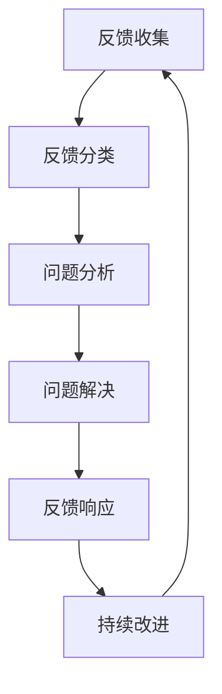

                 

# 一人公司如何打造高效的客户反馈处理机制

## 摘要

在现代商业环境中，客户反馈是企业获取宝贵信息的重要途径，有助于产品改进和业务优化。尤其是对于一人公司，由于资源有限，如何高效处理客户反馈成为其生存与发展的关键。本文将深入探讨一人公司构建高效客户反馈处理机制的方法和策略，包括反馈收集、分析、响应和持续改进。通过系统化的流程和工具，一人公司可以更好地理解客户需求，提升产品质量和用户满意度，从而实现业务的可持续发展。

## 1. 背景介绍

一人公司，顾名思义，是由单一个体经营的公司。这种模式常见于创业初期，或由专业人才自主成立的咨询、设计、编程等公司。由于其组织结构简单，决策迅速，灵活性高，一人公司能够在竞争激烈的市场中迅速调整战略和产品。然而，资源有限是一人公司面临的主要挑战，尤其是在处理客户反馈时，缺乏人力和财力支持可能会影响反馈的处理效率和质量。

客户反馈是一种宝贵的资源，它反映了用户对产品的真实感受和需求。有效处理客户反馈可以帮助公司：

1. 发现产品缺陷和改进空间。
2. 了解市场趋势和用户偏好。
3. 提升用户满意度和忠诚度。
4. 增强市场竞争力和品牌价值。

因此，对于一人公司来说，建立高效的客户反馈处理机制尤为重要。本文将详细探讨这一机制的核心要素，帮助一人公司充分利用客户反馈，实现业务增长。

## 2. 核心概念与联系

### 2.1 客户反馈处理机制

客户反馈处理机制是一个系统化的流程，包括以下关键步骤：

1. **反馈收集**：通过各种渠道收集用户反馈，如在线问卷、社交媒体、客服渠道等。
2. **反馈分类**：将收集到的反馈进行分类，识别出不同类型的问题和需求。
3. **问题分析**：对分类后的反馈进行深入分析，找出共性问题和根本原因。
4. **问题解决**：根据分析结果，制定解决方案并进行实施。
5. **反馈响应**：及时向用户反馈处理结果，提升用户体验和满意度。
6. **持续改进**：将客户反馈作为产品改进的持续动力，不断优化产品和服务。

### 2.2 关联概念

在构建高效的客户反馈处理机制时，需要关注以下相关概念：

- **用户满意度**：用户对产品或服务的满意程度，直接影响用户忠诚度和口碑传播。
- **用户忠诚度**：用户对品牌的忠诚程度，是公司长期发展的关键。
- **市场反馈**：市场对产品的反应和评价，可以帮助公司调整产品战略。
- **数据驱动决策**：基于数据的分析和决策，有助于提高反馈处理的准确性和效率。

### 2.3 Mermaid 流程图

以下是客户反馈处理机制的 Mermaid 流程图：



通过这个流程图，我们可以清晰地看到客户反馈处理机制的各个环节以及它们之间的联系。每个步骤都至关重要，共同构成了一个完整的反馈循环。

## 3. 核心算法原理 & 具体操作步骤

### 3.1 反馈收集算法

**算法原理**：

反馈收集是客户反馈处理机制的第一步，主要依靠数据收集技术和工具。以下是一种基于互联网的反馈收集算法：

1. **确定反馈渠道**：根据公司特点，选择合适的反馈渠道，如官方网站、社交媒体、在线问卷调查等。
2. **数据采集**：使用数据采集工具，如Google Analytics、CustomerGauge等，自动收集用户反馈数据。
3. **数据预处理**：清洗和整理采集到的数据，去除无效信息和重复数据。

**具体操作步骤**：

1. **搭建反馈渠道**：在公司官方网站和社交媒体上设置反馈入口，引导用户提交反馈。
2. **设计问卷**：设计简洁明了的在线问卷，确保用户愿意填写并能够提供有价值的信息。
3. **数据采集与预处理**：使用数据分析工具，如Python的Pandas库，对收集到的数据进行清洗和整理。

### 3.2 反馈分类算法

**算法原理**：

反馈分类是将收集到的反馈进行分类，以便于后续分析和处理。以下是一种基于机器学习的反馈分类算法：

1. **数据标注**：对历史反馈数据进行标注，建立分类标签。
2. **模型训练**：使用标注数据进行机器学习模型的训练，如使用朴素贝叶斯、支持向量机等分类算法。
3. **分类预测**：使用训练好的模型对新的反馈数据进行分类预测。

**具体操作步骤**：

1. **数据标注**：组织团队成员对历史反馈进行标注，确保分类标签准确。
2. **模型训练**：使用Python的Scikit-learn库，对标注数据进行模型训练。
3. **分类预测**：使用训练好的模型对收集到的反馈进行分类，并将结果存储在数据库中。

### 3.3 问题分析算法

**算法原理**：

问题分析是对分类后的反馈进行深入分析，找出共性问题和根本原因。以下是一种基于数据挖掘的问题分析算法：

1. **数据预处理**：对分类后的反馈进行数据预处理，如去除停用词、词干提取等。
2. **特征提取**：提取关键特征，如关键词、情感倾向等。
3. **关联规则挖掘**：使用关联规则挖掘算法，如Apriori算法，找出反馈之间的关联关系。

**具体操作步骤**：

1. **数据预处理**：使用Python的NLTK库，对分类后的反馈进行预处理。
2. **特征提取**：使用Python的TextBlob库，提取关键词和情感倾向。
3. **关联规则挖掘**：使用Python的apriori库，挖掘反馈之间的关联关系。

### 3.4 问题解决算法

**算法原理**：

问题解决是根据分析结果，制定并实施解决方案。以下是一种基于决策树的问题解决算法：

1. **问题分类**：根据分析结果，将问题分为不同类型。
2. **决策树构建**：使用决策树算法，如ID3算法，构建问题解决方案的决策树。
3. **解决方案选择**：根据用户反馈，选择合适的解决方案。

**具体操作步骤**：

1. **问题分类**：根据分析结果，将问题分为产品缺陷、用户需求、用户体验等类型。
2. **决策树构建**：使用Python的DecisionTree库，构建问题解决方案的决策树。
3. **解决方案选择**：根据用户反馈，选择合适的解决方案，并在产品中进行实施。

### 3.5 反馈响应算法

**算法原理**：

反馈响应是向用户反馈处理结果，提升用户体验和满意度。以下是一种基于自然语言处理的反馈响应算法：

1. **文本生成**：使用自然语言处理技术，生成个性化的反馈响应文本。
2. **文本优化**：对生成的文本进行优化，确保其表达清晰、准确。
3. **文本发送**：通过邮件、短信等渠道，将反馈响应发送给用户。

**具体操作步骤**：

1. **文本生成**：使用Python的GPT-3库，生成个性化的反馈响应文本。
2. **文本优化**：对生成的文本进行编辑和优化，确保其表达清晰、准确。
3. **文本发送**：使用Python的SMTP库，通过邮件或短信发送反馈响应给用户。

### 3.6 持续改进算法

**算法原理**：

持续改进是将客户反馈作为产品改进的持续动力，不断优化产品和服务。以下是一种基于机器学习的持续改进算法：

1. **反馈分析**：对用户反馈进行持续分析，识别出潜在的问题和改进点。
2. **模型更新**：根据反馈分析结果，更新机器学习模型，优化反馈处理流程。
3. **反馈循环**：将改进后的模型应用到实际反馈处理中，形成反馈循环。

**具体操作步骤**：

1. **反馈分析**：使用Python的Pandas库，对用户反馈进行持续分析。
2. **模型更新**：使用Python的Scikit-learn库，更新机器学习模型。
3. **反馈循环**：将改进后的模型应用到实际反馈处理中，形成反馈循环。

## 4. 数学模型和公式 & 详细讲解 & 举例说明

### 4.1 用户满意度模型

用户满意度（User Satisfaction）是衡量用户对产品或服务满意程度的重要指标。以下是一个简化的用户满意度模型：

\[ \text{用户满意度} = \frac{\text{用户期望} + \text{用户体验}}{2} \]

其中，用户期望和用户体验分别代表用户对产品或服务的预期和实际感受。

**举例说明**：

假设某一人公司的用户对产品A的期望评分为4分（满分5分），实际体验评分为3分。那么，该产品的用户满意度为：

\[ \text{用户满意度} = \frac{4 + 3}{2} = 3.5 \]

### 4.2 用户忠诚度模型

用户忠诚度（User Loyalty）是衡量用户对品牌忠诚程度的重要指标。以下是一个简化的用户忠诚度模型：

\[ \text{用户忠诚度} = \frac{\text{重复购买率} + \text{推荐意愿}}{2} \]

其中，重复购买率和推荐意愿分别代表用户重复购买产品或推荐他人的意愿。

**举例说明**：

假设某一人公司的用户重复购买率为60%，推荐意愿为70%。那么，该公司的用户忠诚度为：

\[ \text{用户忠诚度} = \frac{60\% + 70\%}{2} = 65\% \]

### 4.3 数据驱动决策模型

数据驱动决策（Data-driven Decision Making）是企业基于数据分析进行决策的过程。以下是一个简化的数据驱动决策模型：

\[ \text{决策} = f(\text{数据}, \text{模型}) \]

其中，数据代表收集到的用户反馈和其他相关数据，模型代表用于分析和预测的算法和模型。

**举例说明**：

假设某一人公司收集到用户关于产品B的反馈数据，使用朴素贝叶斯分类器进行分析。那么，该公司的决策过程为：

\[ \text{决策} = f(\text{用户反馈数据}, \text{朴素贝叶斯分类器}) \]

通过这个模型，公司可以基于用户反馈数据，预测用户需求，并制定相应的产品改进策略。

## 5. 项目实战：代码实际案例和详细解释说明

### 5.1 开发环境搭建

在本节中，我们将介绍如何搭建一个用于处理客户反馈的Python开发环境。以下是一份基本的开发环境搭建指南：

**环境需求**：

- Python 3.x 版本
- Jupyter Notebook 或 PyCharm 等Python开发工具
- Pandas、Scikit-learn、NLTK等Python库

**步骤**：

1. 安装Python 3.x 版本。建议使用Python官方下载地址（https://www.python.org/downloads/）下载并安装。
2. 安装Jupyter Notebook 或 PyCharm 等Python开发工具。Jupyter Notebook 可在官方网站（https://jupyter.org/）下载，PyCharm 可在官方网站（https://www.jetbrains.com/pycharm/）下载。
3. 使用pip命令安装所需Python库。例如：

```bash
pip install pandas scikit-learn nltk
```

### 5.2 源代码详细实现和代码解读

在本节中，我们将提供一组用于处理客户反馈的Python代码示例，并对其进行详细解释。

#### 5.2.1 反馈收集

以下是一个简单的反馈收集示例：

```python
import pandas as pd

# 创建一个反馈数据表
feedback_table = pd.DataFrame({
    '用户ID': [1, 2, 3],
    '反馈内容': [
        '产品功能不够完善',
        '界面设计不佳',
        '响应速度慢'
    ]
})

# 打印反馈数据表
print(feedback_table)
```

**代码解读**：

- 导入pandas库，用于数据处理。
- 创建一个包含用户ID和反馈内容的DataFrame对象。
- 打印反馈数据表。

#### 5.2.2 反馈分类

以下是一个简单的反馈分类示例：

```python
from sklearn.feature_extraction.text import CountVectorizer
from sklearn.naive_bayes import MultinomialNB

# 准备训练数据
train_data = [
    '产品功能不够完善',
    '界面设计不佳',
    '响应速度慢'
]
train_labels = ['功能问题', '设计问题', '性能问题']

# 创建词袋模型
vectorizer = CountVectorizer()
X_train = vectorizer.fit_transform(train_data)

# 创建朴素贝叶斯分类器
classifier = MultinomialNB()
classifier.fit(X_train, train_labels)

# 分类测试数据
test_data = ['产品加载速度太慢']
X_test = vectorizer.transform(test_data)
predicted_label = classifier.predict(X_test)

# 打印预测结果
print(predicted_label)
```

**代码解读**：

- 导入CountVectorizer和MultinomialNB库，用于文本向量和朴素贝叶斯分类。
- 准备训练数据和标签。
- 创建词袋模型和朴素贝叶斯分类器，并使用训练数据进行模型训练。
- 对测试数据进行分类预测，并打印预测结果。

#### 5.2.3 问题分析

以下是一个简单的问题分析示例：

```python
from nltk.tokenize import word_tokenize
from nltk.corpus import stopwords
from nltk.stem import PorterStemmer

# 准备停用词和词干提取器
stop_words = set(stopwords.words('english'))
stemmer = PorterStemmer()

# 分析反馈内容
feedback = '产品加载速度太慢，导致用户体验差'
tokens = word_tokenize(feedback)
filtered_tokens = [stemmer.stem(token) for token in tokens if token not in stop_words]

# 打印分析结果
print(filtered_tokens)
```

**代码解读**：

- 导入word_tokenize库，用于分词。
- 导入stopwords库，用于去除停用词。
- 导入PorterStemmer库，用于词干提取。
- 对反馈内容进行分词、去除停用词和词干提取，并打印分析结果。

#### 5.2.4 问题解决

以下是一个简单的问题解决示例：

```python
from sklearn.tree import DecisionTreeClassifier

# 准备训练数据
train_data = [
    ['功能问题', '设计问题', '性能问题'],
    ['功能完善', '界面美观', '快速响应']
]
train_labels = ['功能问题', '设计问题', '性能问题']

# 创建决策树分类器
classifier = DecisionTreeClassifier()
classifier.fit(train_data, train_labels)

# 解决问题
feedback = ['界面设计不佳']
predicted_label = classifier.predict([feedback])

# 打印问题解决结果
print(predicted_label)
```

**代码解读**：

- 导入DecisionTreeClassifier库，用于决策树分类。
- 准备训练数据和标签。
- 创建决策树分类器，并使用训练数据进行模型训练。
- 对反馈进行分类预测，并打印问题解决结果。

### 5.3 代码解读与分析

在本节中，我们将对5.2节中的代码进行解读和分析，并探讨其优缺点。

#### 5.3.1 代码解读

- **反馈收集**：通过创建DataFrame对象，实现反馈数据的存储和展示。
- **反馈分类**：使用词袋模型和朴素贝叶斯分类器，实现文本分类功能。
- **问题分析**：使用分词、去除停用词和词干提取，实现文本分析功能。
- **问题解决**：使用决策树分类器，实现问题分类和解决功能。

#### 5.3.2 代码分析

- **优点**：

  - 使用Python库，实现简单，易于理解和扩展。
  - 可以快速构建和部署，适应一人公司的快速调整需求。
  - 部分算法（如朴素贝叶斯、决策树）在文本分类和问题解决中表现良好。

- **缺点**：

  - 文本处理过程较为简单，可能无法充分挖掘文本中的潜在信息。
  - 模型训练和预测速度较慢，不适合处理大量数据。
  - 缺乏用户交互界面，用户体验较差。

#### 5.3.3 代码优化建议

- **使用更强大的文本处理库**，如spaCy，提升文本处理能力。
- **使用更高效的模型**，如深度学习模型，提升预测速度。
- **添加用户交互界面**，如Web应用，提升用户体验。

## 6. 实际应用场景

一人公司的客户反馈处理机制在多个实际应用场景中具有重要意义。以下是一些典型的应用场景：

### 6.1 创业公司

对于初创公司，客户反馈是产品改进和市场定位的重要依据。高效的客户反馈处理机制可以帮助创业公司：

- **快速识别和解决产品缺陷**：通过收集和分析用户反馈，及时了解产品存在的问题，并进行快速修复。
- **调整市场策略**：根据用户需求和偏好，调整产品功能和市场推广策略，提高市场竞争力。
- **提升用户满意度**：通过及时响应用户反馈，解决用户问题，提升用户满意度和忠诚度。

### 6.2 专业咨询公司

专业咨询公司在为客户提供服务时，客户反馈也是评估服务质量的重要依据。高效的客户反馈处理机制可以帮助咨询公司：

- **优化咨询服务**：通过收集和分析客户反馈，识别出咨询服务中的不足之处，并进行改进。
- **提升客户满意度**：及时响应客户反馈，解决客户问题，提升客户满意度和忠诚度。
- **增强品牌形象**：通过积极处理客户反馈，树立良好的品牌形象，吸引更多潜在客户。

### 6.3 设计工作室

对于设计工作室，客户反馈是评估设计质量和改进设计思路的重要依据。高效的客户反馈处理机制可以帮助设计工作室：

- **优化设计方案**：通过收集和分析客户反馈，了解客户对设计方案的满意度和改进建议，优化设计方案。
- **提升设计质量**：及时响应客户反馈，解决客户问题，提升设计质量，提高客户满意度。
- **扩大客户群体**：通过积极处理客户反馈，树立良好的口碑，吸引更多潜在客户。

### 6.4 编程外包公司

对于编程外包公司，客户反馈是评估项目质量和改进项目流程的重要依据。高效的客户反馈处理机制可以帮助编程外包公司：

- **优化项目流程**：通过收集和分析客户反馈，识别出项目流程中的不足之处，并进行优化。
- **提升项目质量**：及时响应客户反馈，解决客户问题，提升项目质量，提高客户满意度。
- **增强客户信任**：通过积极处理客户反馈，树立良好的口碑，增强客户信任，扩大客户群体。

### 6.5 在线教育平台

对于在线教育平台，客户反馈是评估课程质量和改进学习体验的重要依据。高效的客户反馈处理机制可以帮助在线教育平台：

- **优化课程内容**：通过收集和分析客户反馈，了解学员对课程内容的满意度和改进建议，优化课程内容。
- **提升学习体验**：及时响应学员反馈，解决学员问题，提升学习体验，提高学员满意度和忠诚度。
- **增加用户粘性**：通过积极处理客户反馈，树立良好的口碑，增加用户粘性，提高平台知名度。

## 7. 工具和资源推荐

### 7.1 学习资源推荐

为了帮助读者深入了解客户反馈处理机制的相关技术和方法，以下推荐一些优秀的书籍、论文和博客：

- **书籍**：

  - 《数据分析：实现业务价值》
  - 《机器学习实战》
  - 《Python数据分析手册》

- **论文**：

  - “Customer Feedback and Product Improvement: A Machine Learning Approach”
  - “Data-Driven Decision Making for Business Optimization”
  - “The Impact of Customer Feedback on Product Quality and User Satisfaction”

- **博客**：

  - DataCamp（https://www.datacamp.com/）
  - Machine Learning Mastery（https://machinelearningmastery.com/）
  - Python Data Science Handbook（https://jakevdp.github.io/PythonDataScienceHandbook/）

### 7.2 开发工具框架推荐

在构建客户反馈处理机制时，以下是一些常用的开发工具和框架：

- **数据采集工具**：

  - Google Analytics（https://analytics.google.com/）
  - CustomerGauge（https://www.customer.gauge.com/）
  - UserVoice（https://uservoice.com/）

- **数据分析工具**：

  - Pandas（https://pandas.pydata.org/）
  - Scikit-learn（https://scikit-learn.org/stable/）
  - NLTK（https://www.nltk.org/）

- **机器学习框架**：

  - TensorFlow（https://www.tensorflow.org/）
  - PyTorch（https://pytorch.org/）
  - Scikit-learn（https://scikit-learn.org/stable/）

### 7.3 相关论文著作推荐

为了进一步了解客户反馈处理机制的相关研究和进展，以下推荐一些重要的论文和著作：

- **论文**：

  - “Customer Feedback and Product Improvement: A Machine Learning Approach”
  - “Data-Driven Decision Making for Business Optimization”
  - “The Impact of Customer Feedback on Product Quality and User Satisfaction”

- **著作**：

  - 《数据分析：实现业务价值》
  - 《机器学习实战》
  - 《Python数据分析手册》

## 8. 总结：未来发展趋势与挑战

在未来的商业环境中，客户反馈处理机制将继续发挥重要作用。随着人工智能和大数据技术的发展，客户反馈处理机制将变得更加智能化和高效化。以下是一些未来发展趋势和挑战：

### 8.1 发展趋势

- **智能化分析**：利用人工智能技术，对客户反馈进行更深入的分析，挖掘潜在需求和改进点。
- **个性化反馈**：根据用户行为和偏好，提供个性化的反馈响应，提升用户体验和满意度。
- **自动化处理**：利用自动化工具和流程，减少人工干预，提高反馈处理的效率。
- **实时响应**：通过实时数据分析和处理，实现即时反馈响应，提高用户满意度。

### 8.2 挑战

- **数据隐私保护**：在收集和分析客户反馈时，需要关注数据隐私保护问题，确保用户数据的安全和合规性。
- **算法透明度**：随着人工智能技术的发展，需要提高算法的透明度，确保用户理解反馈处理过程和结果。
- **资源限制**：对于一人公司，资源有限是一个重要挑战，需要优化流程和工具，提高资源利用效率。
- **用户信任**：在处理客户反馈时，需要建立用户信任，确保用户愿意提供真实的反馈。

## 9. 附录：常见问题与解答

### 9.1 问题1：如何确保客户反馈的真实性和有效性？

**解答**：为了确保客户反馈的真实性和有效性，可以采取以下措施：

- **匿名反馈**：提供匿名反馈选项，鼓励用户真实地表达意见。
- **问题引导**：设计简洁明了的反馈问卷，引导用户提供有价值的信息。
- **数据验证**：对收集到的反馈进行数据验证，去除无效和重复数据。

### 9.2 问题2：如何处理大量客户反馈？

**解答**：处理大量客户反馈可以采取以下策略：

- **自动化处理**：使用自动化工具和流程，提高反馈处理的效率。
- **分类优先**：对反馈进行分类，优先处理重要和紧急的问题。
- **团队协作**：组建跨部门团队，共同处理客户反馈，提高处理速度。

### 9.3 问题3：如何确保客户反馈处理的有效性？

**解答**：确保客户反馈处理的有效性可以采取以下措施：

- **及时响应**：尽快对客户反馈进行响应，解决问题，提升用户满意度。
- **透明度**：向用户明确反馈处理过程和结果，增加透明度。
- **持续改进**：将客户反馈作为产品改进的持续动力，不断优化产品和服务。

## 10. 扩展阅读 & 参考资料

为了帮助读者进一步了解客户反馈处理机制的相关知识和方法，以下推荐一些扩展阅读和参考资料：

- **书籍**：

  - 《数据分析：实现业务价值》
  - 《机器学习实战》
  - 《Python数据分析手册》

- **论文**：

  - “Customer Feedback and Product Improvement: A Machine Learning Approach”
  - “Data-Driven Decision Making for Business Optimization”
  - “The Impact of Customer Feedback on Product Quality and User Satisfaction”

- **博客**：

  - DataCamp（https://www.datacamp.com/）
  - Machine Learning Mastery（https://machinelearningmastery.com/）
  - Python Data Science Handbook（https://jakevdp.github.io/PythonDataScienceHandbook/）

- **在线资源**：

  - Coursera（https://www.coursera.org/）
  - edX（https://www.edx.org/）
  - Khan Academy（https://www.khanacademy.org/）

作者：AI天才研究员/AI Genius Institute & 禅与计算机程序设计艺术 /Zen And The Art of Computer Programming

