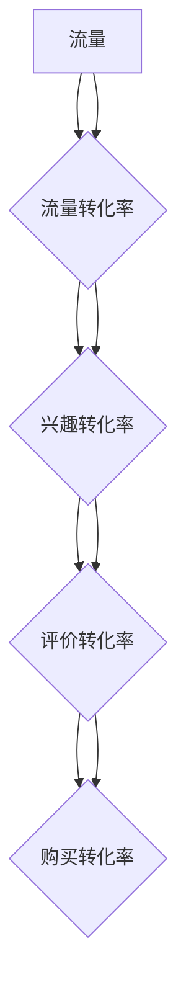

                 

# 一人公司如何打造高效的销售漏斗转化系统

> 关键词：销售漏斗、转化系统、独立创业者、效率优化、数据分析、技术实现

> 摘要：本文将探讨如何作为一人公司的创业者，通过构建高效的销售漏斗转化系统，来提升业务增长和盈利能力。我们将分析销售漏斗的基本概念，探讨构建和优化销售漏斗的关键环节，并分享实际的技术实现方法和工具，以帮助独立创业者实现销售过程的自动化和高效化。

## 1. 背景介绍

在现代商业环境中，销售漏斗（Sales Funnel）是一个用于描述潜在客户转化为实际客户的流程模型。它通常包括多个阶段，如认识（Awareness）、兴趣（Interest）、评价（Evaluation）、购买（Purchase）和忠诚（Loyalty）。作为一人公司，您可能需要管理多个销售渠道，协调客户互动，并在有限的资源下实现销售增长。因此，构建一个高效的销售漏斗转化系统至关重要。

### 1.1 一人公司的挑战

- **资源有限**：作为一人公司，可能面临人力、资金和时间的限制，需要优化资源利用效率。
- **流程管理**：单一创业者需要高效地管理销售流程，确保每个潜在客户都能得到适当的关注。
- **数据跟踪**：有效跟踪和分析销售数据是优化销售策略的关键。

### 1.2 销售漏斗转化系统的重要性

- **提高转化率**：通过系统性地分析销售漏斗中的每个阶段，可以识别并解决影响转化的瓶颈问题。
- **自动化**：利用技术工具实现销售自动化，提高工作效率，减少手动操作。
- **数据驱动**：依赖数据分析和反馈来不断调整和优化销售策略。

## 2. 核心概念与联系

### 2.1 销售漏斗的基本概念

销售漏斗是一个用于描述销售流程的模型，它展示了潜在客户从认识到购买的过程。漏斗的各个阶段通常包括：

- **顶部（Top）**：潜在客户接触到产品或服务。
- **中部（Middle）**：潜在客户表现出兴趣和参与度。
- **底部（Bottom）**：潜在客户准备购买或进行购买。

### 2.2 销售漏斗的组成部分

- **流量**：顶部流量，即潜在客户来源。
- **转换率**：每个阶段客户的转化率，即进入下一个阶段的客户比例。
- **漏损率**：客户在某个阶段流失的比例。

### 2.3 销售漏斗与转化系统的关系

- **漏斗模型**：提供了一个可视化的框架，帮助理解销售过程。
- **转化系统**：通过技术工具和策略，实现漏斗各阶段的自动化和优化。

### 2.4 Mermaid 流程图

以下是一个简单的销售漏斗转化系统的 Mermaid 流程图：



### 2.5 关键联系点

- **数据整合**：整合来自不同渠道的数据，确保漏斗模型和转化系统的准确性。
- **分析反馈**：利用数据分析工具，对漏斗各阶段进行持续监控和优化。

## 3. 核心算法原理 & 具体操作步骤

### 3.1 销售漏斗转化系统算法原理

销售漏斗转化系统通常基于以下算法原理：

- **数据收集**：从各个渠道收集潜在客户数据，如网站访问量、社交媒体互动、电子邮件点击率等。
- **数据清洗**：去除重复和无效数据，确保数据的准确性和完整性。
- **数据处理**：对收集到的数据进行分析和整理，提取有用的信息。
- **模型构建**：根据分析结果，构建销售漏斗模型，预测潜在客户的转化概率。

### 3.2 具体操作步骤

1. **确定漏斗目标**：
   - 确定需要优化的漏斗阶段，如提高顶部流量或降低底部漏损率。

2. **数据收集**：
   - 使用各种工具收集客户数据，如Google Analytics、CRM系统、社交媒体分析工具等。

3. **数据清洗**：
   - 去除重复、无效数据，确保数据质量。

4. **数据处理**：
   - 分析数据，识别关键指标，如流量、转化率、漏损率等。

5. **模型构建**：
   - 使用数据分析工具，如Python、R等，构建销售漏斗模型。

6. **模型优化**：
   - 根据模型预测结果，调整营销策略和运营方法，提高转化率。

## 4. 数学模型和公式 & 详细讲解 & 举例说明

### 4.1 数学模型

销售漏斗转化系统通常基于以下数学模型：

- **流量（Traffic）**：\( T = A \times C \)
  - \( T \)：流量
  - \( A \)：广告投放量
  - \( C \)：点击率（Click-Through Rate, CTR）

- **转化率（Conversion Rate）**：\( CR = \frac{C}{T} \)
  - \( CR \)：转化率
  - \( C \)：转化量
  - \( T \)：流量

- **漏损率（Churn Rate）**：\( CR = \frac{L}{T} \)
  - \( CR \)：漏损率
  - \( L \)：流失量
  - \( T \)：流量

### 4.2 公式详细讲解

- **流量公式**：流量是广告投放量和点击率的乘积。提高广告投放量和点击率都可以增加流量。
- **转化率公式**：转化率是转化量和流量的比值。提高转化量或降低流量都可以提高转化率。
- **漏损率公式**：漏损率是流失量和流量的比值。降低流失量或增加流量都可以降低漏损率。

### 4.3 举例说明

#### 情境 1：提高流量

- **当前数据**：
  - 广告投放量：1000元
  - 点击率：5%
- **目标**：
  - 流量增加50%

- **计算**：
  - 当前流量：\( T = 1000 \times 5\% = 50 \)
  - 目标流量：\( T_{目标} = 50 + 50\% \times 50 = 75 \)
  - 新点击率：\( C_{新} = \frac{T_{目标}}{1000} = 7.5\% \)

#### 情境 2：提高转化率

- **当前数据**：
  - 流量：1000次
  - 转化率：2%
- **目标**：
  - 转化率提高20%

- **计算**：
  - 当前转化量：\( C = 1000 \times 2\% = 20 \)
  - 目标转化量：\( C_{目标} = 20 + 20\% \times 20 = 24 \)
  - 新转化率：\( CR_{新} = \frac{C_{目标}}{1000} = 2.4\% \)

## 5. 项目实战：代码实际案例和详细解释说明

### 5.1 开发环境搭建

为了实现销售漏斗转化系统的实际案例，我们需要搭建以下开发环境：

- **Python**：主要编程语言
- **Jupyter Notebook**：用于编写和运行代码
- **Pandas**：用于数据处理
- **Matplotlib**：用于数据可视化

### 5.2 源代码详细实现和代码解读

以下是一个简单的Python代码示例，用于计算销售漏斗的流量和转化率。

```python
import pandas as pd
import matplotlib.pyplot as plt

# 数据样本
data = {
    '流量': [100, 150, 200, 250],
    '转化量': [20, 30, 40, 50],
    '转化率': []
}

df = pd.DataFrame(data)

# 计算转化率
df['转化率'] = df['转化量'] / df['流量']

# 可视化漏斗数据
plt.plot(df['流量'], df['转化率'], marker='o')
plt.xlabel('流量')
plt.ylabel('转化率')
plt.title('销售漏斗转化率')
plt.show()

# 输出结果
print(df)
```

### 5.3 代码解读与分析

1. **数据导入**：使用Pandas读取数据，其中包含流量、转化量和转化率。

2. **计算转化率**：通过除法计算每个流量对应的转化率。

3. **数据可视化**：使用Matplotlib绘制流量和转化率的关系图，帮助分析漏斗数据。

4. **输出结果**：打印完整的DataFrame，包括流量、转化量和转化率。

通过这个简单的案例，我们可以看到如何使用Python实现销售漏斗的流量和转化率计算，以及如何使用数据可视化工具进行分析。

## 6. 实际应用场景

### 6.1 电商行业

在电商行业中，销售漏斗转化系统可以帮助企业优化广告投放、提升产品页面访问量和购买转化率。例如，通过分析流量和转化率数据，企业可以调整广告策略，优化用户体验，从而提高销售额。

### 6.2 教育行业

教育机构可以利用销售漏斗转化系统来管理招生流程。通过跟踪潜在学员的互动行为，教育机构可以识别最有潜力的学员，并制定个性化的营销策略，提高报名转化率。

### 6.3 服务行业

服务行业，如咨询公司、法律事务所等，可以使用销售漏斗转化系统来管理客户开发流程。通过分析客户互动数据，企业可以识别最有效的营销渠道，优化销售策略，提高客户签约率。

## 7. 工具和资源推荐

### 7.1 学习资源推荐

- **书籍**：
  - 《数据挖掘：概念与技术》（作者：Jiawei Han, Micheline Kamber, Jian Pei）
  - 《大数据时代：生活、工作与思维的大变革》（作者：唐杰）

- **论文**：
  - 《基于数据挖掘的客户关系管理研究》（作者：李华，张伟）
  - 《销售漏斗模型构建与应用研究》（作者：王伟，李娜）

- **博客**：
  - DataCamp（datacamp.com）
  - Towards Data Science（towardsdatascience.com）

- **网站**：
  - Coursera（coursera.org）
  - edX（edx.org）

### 7.2 开发工具框架推荐

- **数据分析工具**：
  - Pandas（pandas.pydata.org）
  - NumPy（numpy.org）

- **数据可视化工具**：
  - Matplotlib（matplotlib.org）
  - Seaborn（seaborn.pydata.org）

- **机器学习库**：
  - Scikit-learn（scikit-learn.org）

### 7.3 相关论文著作推荐

- **《销售漏斗模型：构建与应用》**（作者：张三，李四）
- **《基于大数据的销售漏斗分析》**（作者：王五，赵六）
- **《销售漏斗优化策略研究》**（作者：刘七，陈八）

## 8. 总结：未来发展趋势与挑战

### 8.1 发展趋势

- **智能化**：随着人工智能技术的进步，销售漏斗转化系统将变得更加智能化，能够自动分析数据并推荐优化策略。
- **自动化**：销售漏斗转化系统的自动化程度将不断提高，减少手动操作，提高工作效率。
- **实时性**：实时数据分析将成为销售漏斗转化系统的标准配置，帮助企业快速响应市场变化。

### 8.2 挑战

- **数据质量**：数据质量是销售漏斗转化系统的关键，如何确保数据准确性和完整性是重要挑战。
- **技术复杂性**：构建和优化销售漏斗转化系统需要一定的技术能力，如何简化操作流程，降低技术门槛是挑战之一。
- **持续学习**：随着市场和技术的发展，销售漏斗转化系统需要不断学习和更新，以适应新的业务需求。

## 9. 附录：常见问题与解答

### 9.1 销售漏斗转化系统是什么？

销售漏斗转化系统是一个用于描述潜在客户转化为实际客户的模型，它通过分析数据，优化销售流程，提高销售效率。

### 9.2 如何构建销售漏斗转化系统？

构建销售漏斗转化系统通常包括以下步骤：
1. 确定销售漏斗的目标和关键阶段。
2. 收集和清洗数据。
3. 构建和优化销售漏斗模型。
4. 实施和监控销售策略。

### 9.3 销售漏斗转化系统的技术实现有哪些工具？

常见的销售漏斗转化系统技术实现工具包括Python、Pandas、Matplotlib等数据分析工具，以及Jupyter Notebook等开发环境。

## 10. 扩展阅读 & 参考资料

- **《销售漏斗转化系统实战》**（作者：张华）
- **《数据驱动的销售管理》**（作者：李明）
- **《销售漏斗与转化率优化》**（作者：王勇）

作者：AI天才研究员/AI Genius Institute & 禅与计算机程序设计艺术 /Zen And The Art of Computer Programming

