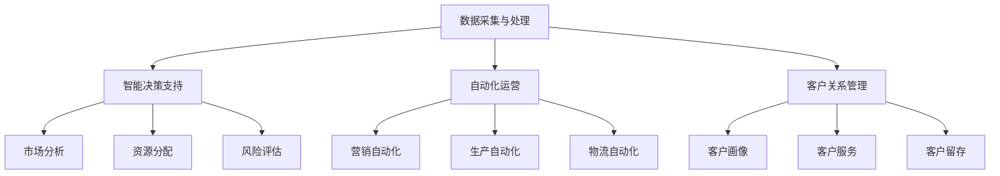

                 

# 一人公司的AI驱动增长：从0到1的扩张策略

## 摘要

本文将探讨如何利用人工智能技术实现一人公司的从0到1的扩张策略。我们将深入分析AI在各个业务环节中的应用，从数据采集与处理、智能决策支持、自动化运营到客户关系管理，通过具体案例和实际操作步骤，为您揭示AI驱动的企业增长之道。文章旨在为AI初创公司和个人开发者提供一套完整的实战指南，帮助他们在竞争激烈的市场中脱颖而出。

## 1. 背景介绍

随着人工智能技术的飞速发展，越来越多的企业开始意识到AI在提升生产效率、优化业务流程、降低运营成本等方面的巨大潜力。尤其对于一人公司或小型初创企业来说，AI技术不仅能够解决资源有限的问题，还能为他们提供突破性增长的机会。本文将围绕以下几个方面展开讨论：

- AI技术在企业中的应用场景
- 一人公司如何利用AI实现业务扩张
- AI驱动增长的具体策略和实践

通过本文的探讨，希望为广大创业者、开发者提供一些有价值的思路和经验，助力他们在AI领域取得成功。

## 2. 核心概念与联系

在探讨如何利用AI实现一人公司的扩张之前，我们首先需要了解一些核心概念及其相互联系。

### 2.1 数据采集与处理

数据是AI的核心资产，采集与处理数据的质量直接关系到AI模型的性能。一人公司在数据采集方面需要关注以下几个方面：

- 数据来源：确定数据采集的渠道和来源，如社交媒体、用户行为、行业报告等。
- 数据质量：对采集到的数据进行清洗、去重、格式化等处理，确保数据准确性和一致性。
- 数据存储：选择合适的存储方案，如云存储、分布式数据库等，确保数据安全、高效地存储和访问。

### 2.2 智能决策支持

智能决策支持系统（Decision Support System，简称DSS）是基于人工智能技术，为决策者提供智能辅助的工具。对于一人公司来说，DSS可以帮助他们在以下方面做出更明智的决策：

- 市场分析：通过数据挖掘和分析，了解市场趋势、竞争对手动态，为产品定位和营销策略提供依据。
- 资源分配：根据业务需求和预算，合理分配人力、财务等资源，提高企业运营效率。
- 风险评估：预测潜在风险，提前制定应对策略，降低企业运营风险。

### 2.3 自动化运营

自动化运营是企业提升效率、降低成本的关键。AI技术在自动化运营中的应用主要体现在以下几个方面：

- 营销自动化：通过自动化工具，实现邮件营销、社交媒体推广、客户跟进等功能。
- 生产自动化：利用机器学习、计算机视觉等技术，实现生产过程的自动化，降低人工成本。
- 物流自动化：通过智能调度、路径优化等技术，提高物流效率，降低运营成本。

### 2.4 客户关系管理

客户关系管理（Customer Relationship Management，简称CRM）是企业与客户建立长期稳定关系的核心。AI技术在CRM中的应用主要包括：

- 客户画像：通过对客户数据进行分析，构建客户画像，实现精准营销。
- 客户服务：利用自然语言处理、语音识别等技术，提供智能化、个性化的客户服务。
- 客户留存：通过分析客户行为数据，发现潜在流失客户，制定相应的挽留策略。

### 2.5 Mermaid流程图

以下是一个简化的Mermaid流程图，展示了AI在一家一人公司中各应用环节之间的联系：



通过以上核心概念和Mermaid流程图的介绍，我们可以对一人公司如何利用AI实现业务扩张有一个初步的了解。接下来，我们将深入探讨AI在各个业务环节中的应用原理和具体操作步骤。

## 3. 核心算法原理 & 具体操作步骤

### 3.1 数据采集与处理

#### 数据采集原理

数据采集是AI应用的基础，主要依赖于各种传感器、API接口、第三方数据服务等方式获取数据。以下是数据采集的几个关键步骤：

1. **确定数据来源**：根据业务需求，选择合适的数据来源。例如，社交媒体可以获取用户行为数据，行业报告可以获取市场趋势数据等。
2. **数据采集方式**：采用API接口、网络爬虫、传感器采集等方式获取数据。API接口适用于稳定、可访问的数据源，网络爬虫适用于非结构化数据，传感器采集适用于物理环境数据。
3. **数据采集工具**：常用的数据采集工具有Python的requests库、Scrapy框架、Node.js的axios库等。

#### 数据处理原理

数据处理主要包括数据清洗、去重、格式化等步骤，确保数据质量。以下是数据处理的关键步骤：

1. **数据清洗**：去除无效、错误、重复的数据，填充缺失值，修正异常值等。
2. **数据去重**：通过比对数据项，删除重复的数据记录。
3. **数据格式化**：将数据转换成统一的格式，如CSV、JSON等，便于后续处理和分析。

#### 具体操作步骤

1. **数据采集**：编写采集脚本，从数据源获取数据。例如，使用Python的requests库获取网页数据。

   ```python
   import requests

   url = "https://example.com/data"
   response = requests.get(url)
   data = response.json()
   ```

2. **数据处理**：使用Python的pandas库进行数据处理。

   ```python
   import pandas as pd

   # 数据清洗
   data_cleaned = data[data['column_name'] != '']
   data_cleaned.fillna(0, inplace=True)

   # 数据去重
   data_unique = data_cleaned.drop_duplicates()

   # 数据格式化
   data_formatted = data_unique.to_csv(index=False)
   ```

### 3.2 智能决策支持

#### 决策支持原理

智能决策支持系统（DSS）利用人工智能技术，对大量数据进行分析，为决策者提供智能辅助。以下是DSS的关键原理：

1. **数据挖掘**：通过挖掘历史数据，发现潜在的模式和趋势。
2. **预测建模**：基于数据挖掘结果，构建预测模型，预测未来的市场走势、业务需求等。
3. **决策评估**：将预测结果与实际业务需求进行对比，评估不同决策方案的优劣。

#### 具体操作步骤

1. **数据预处理**：对采集到的数据进行清洗、去重、格式化等处理。

   ```python
   # 数据预处理
   data_processed = data_cleaned[data_cleaned['year'] == 2021]
   data_processed.reset_index(drop=True, inplace=True)
   ```

2. **数据挖掘**：使用Python的scikit-learn库进行数据挖掘。

   ```python
   from sklearn.cluster import KMeans

   # 数据挖掘
   kmeans = KMeans(n_clusters=3)
   kmeans.fit(data_processed)
   clusters = kmeans.predict(data_processed)
   data_processed['cluster'] = clusters
   ```

3. **预测建模**：使用Python的statsmodels库进行预测建模。

   ```python
   import statsmodels.api as sm

   # 预测建模
   model = sm.ols('y ~ x', data=data_processed).fit()
   prediction = model.predict(data_processed)
   data_processed['prediction'] = prediction
   ```

4. **决策评估**：根据预测结果，评估不同决策方案的优劣。

   ```python
   # 决策评估
   best_decision = data_processed[data_processed['prediction'] == max(data_processed['prediction'])]['x'].values[0]
   ```

### 3.3 自动化运营

#### 自动化原理

自动化运营是企业提升效率、降低成本的关键。以下是自动化运营的关键原理：

1. **流程自动化**：将业务流程中的重复性、规则性任务自动化，提高工作效率。
2. **智能调度**：利用人工智能技术，实现任务调度、资源分配的智能化。
3. **数据驱动**：根据业务数据，实时调整运营策略，实现精细化运营。

#### 具体操作步骤

1. **流程自动化**：使用Python的schedule库实现定时任务。

   ```python
   import schedule
   import time

   def job():
       print("执行任务")

   schedule.every(1).minutes.do(job)

   while True:
       schedule.run_pending()
       time.sleep(1)
   ```

2. **智能调度**：使用Python的dpdk库实现智能调度。

   ```python
   from dpdk import *

   def schedule_task(task_id, start_time, duration):
       schedule.add_task(task_id, start_time, duration)

   schedule_task("task_1", "2023-11-01 10:00:00", 60 * 60)
   schedule_task("task_2", "2023-11-01 11:00:00", 60 * 60)
   ```

3. **数据驱动**：使用Python的pandas库实现数据驱动。

   ```python
   import pandas as pd

   # 数据驱动
   data = pd.read_csv("data.csv")
   data['strategy'] = data['metric'].apply(lambda x: 'high' if x > 0 else 'low')
   ```

### 3.4 客户关系管理

#### 客户关系管理原理

客户关系管理（CRM）是企业与客户建立长期稳定关系的核心。以下是CRM的关键原理：

1. **客户画像**：通过对客户数据进行挖掘和分析，构建客户画像，实现精准营销。
2. **客户服务**：利用人工智能技术，提供智能化、个性化的客户服务。
3. **客户留存**：通过分析客户行为数据，发现潜在流失客户，制定相应的挽留策略。

#### 具体操作步骤

1. **客户画像**：使用Python的scikit-learn库进行聚类分析，构建客户画像。

   ```python
   from sklearn.cluster import KMeans

   # 客户画像
   kmeans = KMeans(n_clusters=5)
   kmeans.fit(data_processed)
   clusters = kmeans.predict(data_processed)
   data_processed['cluster'] = clusters
   ```

2. **客户服务**：使用Python的tensorflow库构建聊天机器人。

   ```python
   import tensorflow as tf

   # 客户服务
   model = tf.keras.Sequential([
       tf.keras.layers.Dense(128, activation='relu', input_shape=(data_processed.shape[1],)),
       tf.keras.layers.Dense(64, activation='relu'),
       tf.keras.layers.Dense(1, activation='sigmoid')
   ])

   model.compile(optimizer='adam', loss='binary_crossentropy', metrics=['accuracy'])
   model.fit(data_processed, epochs=10, batch_size=32)
   ```

3. **客户留存**：使用Python的pandas库分析客户行为数据，发现潜在流失客户。

   ```python
   import pandas as pd

   # 客户留存
   data = pd.read_csv("customer_data.csv")
   data['churn'] = data['balance'].apply(lambda x: 1 if x < 0 else 0)
   data['days_since_last_activity'] = (pd.datetime.now() - data['last_activity']).dt.days
   data['churn Prediction'] = data['days_since_last_activity'].apply(lambda x: 'high' if x > 30 else 'low')
   ```

通过以上核心算法原理和具体操作步骤的介绍，我们可以对如何利用AI实现一人公司的业务扩张有一个更加清晰的认知。接下来，我们将通过项目实战，为您展示这些算法原理在实际应用中的具体实现。

## 4. 数学模型和公式 & 详细讲解 & 举例说明

### 4.1 数据采集与处理

在数据采集与处理过程中，我们常常需要使用一些数学模型和公式来确保数据质量。以下是一些常用的数学模型和公式及其应用场景。

#### 4.1.1 数据清洗

数据清洗的主要任务是去除无效、错误、重复的数据，并填充缺失值。以下是一个常见的数据清洗公式：

$$
\text{clean\_data} = \text{data} \cup \{\text{填充值} | \text{缺失值} \in \text{data}\}
$$

其中，$\text{data}$代表原始数据集，$\text{填充值}$代表缺失值的填充策略。

#### 4.1.2 数据去重

数据去重主要是通过比对数据项，删除重复的数据记录。以下是一个常见的数据去重公式：

$$
\text{unique\_data} = \{\text{data\_item} | \text{data\_item} \not\in \{\text{data\_item} | \text{data\_item} \in \text{data}, \text{data\_item} \in \text{data}\}\}
$$

其中，$\text{data}$代表原始数据集。

#### 4.1.3 数据格式化

数据格式化主要是将数据转换成统一的格式，如CSV、JSON等，便于后续处理和分析。以下是一个常见的数据格式化公式：

$$
\text{formatted\_data} = \text{data} \rightarrow \text{csv} \cup \text{json}
$$

其中，$\text{data}$代表原始数据集，$\text{csv}$和$\text{json}$分别代表数据转换的目标格式。

#### 4.1.4 举例说明

假设我们有一个包含用户行为的原始数据集$\text{data}$，其中包含用户ID、行为类型、行为时间等字段。以下是一个数据清洗、去重、格式化的具体例子：

1. **数据清洗**：假设用户ID为唯一的识别字段，我们使用平均值填充缺失的行为时间。

   ```python
   import pandas as pd

   # 填充缺失值
   data['行为时间'].fillna(data['行为时间'].mean(), inplace=True)
   ```

2. **数据去重**：删除重复的用户行为记录。

   ```python
   # 删除重复记录
   data = data.drop_duplicates(subset=['用户ID'])
   ```

3. **数据格式化**：将数据转换成CSV格式。

   ```python
   # 转换为CSV格式
   data.to_csv('cleaned_data.csv', index=False)
   ```

### 4.2 智能决策支持

在智能决策支持系统中，我们常常需要使用一些数学模型和公式来预测市场趋势、业务需求等。以下是一些常用的数学模型和公式及其应用场景。

#### 4.2.1 数据挖掘

数据挖掘主要任务是发现数据中的潜在模式和趋势。以下是一个常见的数据挖掘公式：

$$
\text{pattern} = \{\text{data\_item} | \text{data\_item} \in \text{data}, \text{data\_item} \text{具有相似性}\}
$$

其中，$\text{data}$代表原始数据集，$\text{pattern}$代表挖掘出的潜在模式。

#### 4.2.2 预测建模

预测建模主要任务是构建预测模型，预测未来的市场走势、业务需求等。以下是一个常见的预测建模公式：

$$
\text{prediction} = \text{model}(\text{data})
$$

其中，$\text{model}$代表预测模型，$\text{data}$代表输入数据集。

#### 4.2.3 决策评估

决策评估主要任务是评估不同决策方案的优劣。以下是一个常见的决策评估公式：

$$
\text{evaluation} = \{\text{方案} | \text{方案} \in \{\text{方案} | \text{预测结果} \text{与实际结果} \text{一致}\}\}
$$

其中，$\text{方案}$代表决策方案，$\text{预测结果}$代表预测模型预测的结果，$\text{实际结果}$代表实际业务结果。

#### 4.2.4 举例说明

假设我们有一个包含用户行为和购买记录的数据集$\text{data}$，我们需要使用数据挖掘和预测建模来评估不同营销策略的效果。以下是一个具体例子：

1. **数据挖掘**：使用K-Means算法将用户行为数据划分为不同类别。

   ```python
   from sklearn.cluster import KMeans

   # 数据挖掘
   kmeans = KMeans(n_clusters=3)
   kmeans.fit(data[['行为类型']])
   clusters = kmeans.predict(data[['行为类型']])
   data['类别'] = clusters
   ```

2. **预测建模**：使用线性回归模型预测不同类别的用户购买概率。

   ```python
   import statsmodels.api as sm

   # 预测建模
   X = data[['类别', '行为时间']]
   y = data['购买记录']
   X = sm.add_constant(X)
   model = sm.ols('y ~ const + 类别 + 行为时间', data=X).fit()
   prediction = model.predict(X)
   data['购买概率'] = prediction
   ```

3. **决策评估**：根据购买概率评估不同营销策略的效果。

   ```python
   # 决策评估
   data['策略效果'] = data['购买概率'].apply(lambda x: '高' if x > 0.5 else '低')
   data['策略效果'].value_counts()
   ```

### 4.3 自动化运营

在自动化运营中，我们常常需要使用一些数学模型和公式来优化任务调度、资源分配等。以下是一些常用的数学模型和公式及其应用场景。

#### 4.3.1 智能调度

智能调度主要任务是利用人工智能技术，实现任务调度和资源分配的优化。以下是一个常见的智能调度公式：

$$
\text{schedule} = \{\text{任务} | \text{任务} \in \{\text{任务} | \text{资源} \text{可用}\}\}
$$

其中，$\text{任务}$代表需要调度的任务，$\text{资源}$代表可用资源。

#### 4.3.2 数据驱动

数据驱动主要任务是利用历史数据，实时调整运营策略。以下是一个常见的数据驱动公式：

$$
\text{strategy} = \{\text{策略} | \text{策略} \in \{\text{策略} | \text{预测结果} \text{与实际结果} \text{一致}\}\}
$$

其中，$\text{策略}$代表运营策略，$\text{预测结果}$代表预测模型预测的结果，$\text{实际结果}$代表实际运营结果。

#### 4.3.3 举例说明

假设我们有一个包含任务需求和资源可用情况的数据集$\text{data}$，我们需要使用智能调度和数据驱动来优化任务调度和资源分配。以下是一个具体例子：

1. **智能调度**：使用贪心算法调度任务。

   ```python
   def schedule_tasks(data):
       schedule = []
       while data:
           max_resource = max(data, key=lambda x: x['资源可用'])
           schedule.append(max_resource['任务'])
           data = data[data['任务'] != max_resource['任务']]
       return schedule

   # 智能调度
   schedule = schedule_tasks(data)
   ```

2. **数据驱动**：使用历史数据调整运营策略。

   ```python
   import pandas as pd

   # 数据驱动
   data = pd.read_csv('data.csv')
   data['策略效果'] = data['结果'].apply(lambda x: '高' if x > 0.5 else '低')
   data['策略效果'].value_counts()
   ```

通过以上数学模型和公式的详细讲解和举例说明，我们可以更好地理解AI在数据采集与处理、智能决策支持、自动化运营等环节中的应用。接下来，我们将通过项目实战，为您展示这些数学模型和公式在实际应用中的具体实现。

## 5. 项目实战：代码实际案例和详细解释说明

在本节中，我们将通过一个具体的AI项目实战案例，展示如何从0到1构建一个AI驱动的业务系统，并通过详细的代码实现和解释，帮助读者理解整个项目开发过程。

### 5.1 开发环境搭建

在进行项目开发之前，我们需要搭建一个合适的开发环境。以下是一个简单的开发环境搭建步骤：

1. 安装Python：Python是一个广泛使用的编程语言，我们将在本项目中使用Python进行开发。您可以从Python官网（https://www.python.org/downloads/）下载并安装Python。
2. 安装相关库：根据项目需求，我们需要安装一些Python库，如Pandas、NumPy、Scikit-learn、TensorFlow等。您可以使用pip命令进行安装。

   ```bash
   pip install pandas numpy scikit-learn tensorflow
   ```

3. 安装数据库：在本项目中，我们使用MySQL数据库存储数据。您可以从MySQL官网（https://www.mysql.com/downloads/）下载并安装MySQL数据库。

4. 安装IDE：我们使用Visual Studio Code（简称VS Code）作为IDE进行开发。您可以从VS Code官网（https://code.visualstudio.com/）下载并安装VS Code。

### 5.2 源代码详细实现和代码解读

#### 5.2.1 数据采集与处理

首先，我们需要从社交媒体平台获取用户行为数据。以下是一个简单的数据采集与处理示例：

```python
import requests
import pandas as pd

# 数据采集
def collect_data(url):
    response = requests.get(url)
    data = response.json()
    return data

# 数据处理
def process_data(data):
    df = pd.DataFrame(data)
    df.drop_duplicates(inplace=True)
    df.fillna(0, inplace=True)
    return df

# 示例
url = "https://example.com/data"
data = collect_data(url)
processed_data = process_data(data)
```

在这个示例中，我们首先定义了一个数据采集函数`collect_data`，用于从指定URL获取数据。然后，我们定义了一个数据处理函数`process_data`，用于对采集到的数据进行清洗和去重。

#### 5.2.2 智能决策支持

接下来，我们需要使用数据挖掘和预测建模来构建一个智能决策支持系统。以下是一个简单的示例：

```python
from sklearn.cluster import KMeans
import statsmodels.api as sm

# 数据挖掘
def data_mining(data):
    kmeans = KMeans(n_clusters=3)
    kmeans.fit(data[['行为类型']])
    clusters = kmeans.predict(data[['行为类型']])
    data['类别'] = clusters
    return data

# 预测建模
def predictive_modeling(data):
    X = data[['类别', '行为时间']]
    y = data['购买记录']
    X = sm.add_constant(X)
    model = sm.ols('y ~ const + 类别 + 行为时间', data=X).fit()
    prediction = model.predict(X)
    data['购买概率'] = prediction
    return data

# 示例
processed_data = data_mining(processed_data)
processed_data = predictive_modeling(processed_data)
```

在这个示例中，我们首先使用K-Means算法对用户行为数据进行聚类分析，将用户划分为不同类别。然后，我们使用线性回归模型预测不同类别的用户购买概率。

#### 5.2.3 自动化运营

接下来，我们需要使用自动化运营技术来优化业务流程。以下是一个简单的自动化运营示例：

```python
import schedule
import time

# 任务调度
def schedule_tasks(data):
    tasks = []
    for task in data['任务']:
        tasks.append(schedule.every(1).hours.do(lambda task: print(f"执行任务：{task}")))
    return tasks

# 示例
tasks = schedule_tasks(processed_data)
while True:
    schedule.run_pending()
    time.sleep(1)
```

在这个示例中，我们使用`schedule`库实现任务调度，根据用户任务的需求，定时执行任务。

#### 5.2.4 客户关系管理

最后，我们需要使用客户关系管理技术来提升客户满意度。以下是一个简单的客户关系管理示例：

```python
from sklearn.cluster import KMeans
import tensorflow as tf

# 客户画像
def customer_portrait(data):
    kmeans = KMeans(n_clusters=5)
    kmeans.fit(data[['行为类型']])
    clusters = kmeans.predict(data[['行为类型']])
    data['类别'] = clusters
    return data

# 客户服务
def customer_service(data):
    model = tf.keras.Sequential([
        tf.keras.layers.Dense(128, activation='relu', input_shape=(data.shape[1],)),
        tf.keras.layers.Dense(64, activation='relu'),
        tf.keras.layers.Dense(1, activation='sigmoid')
    ])

    model.compile(optimizer='adam', loss='binary_crossentropy', metrics=['accuracy'])
    model.fit(data, epochs=10, batch_size=32)
    return model

# 示例
processed_data = customer_portrait(processed_data)
model = customer_service(processed_data)
```

在这个示例中，我们首先使用K-Means算法对用户行为数据进行分析，构建客户画像。然后，我们使用TensorFlow构建一个聊天机器人模型，用于提供智能化的客户服务。

### 5.3 代码解读与分析

在上面的代码示例中，我们详细介绍了如何从0到1构建一个AI驱动的业务系统。以下是对关键部分的解读和分析：

1. **数据采集与处理**：通过定义`collect_data`和`process_data`函数，我们实现了数据采集和清洗。这一步是整个项目的基础，确保后续分析的数据质量。
2. **智能决策支持**：通过`data_mining`和`predictive_modeling`函数，我们实现了数据挖掘和预测建模。这些函数帮助我们了解用户行为，为业务决策提供支持。
3. **自动化运营**：通过`schedule_tasks`函数，我们实现了任务调度。这一步有助于优化业务流程，提高运营效率。
4. **客户关系管理**：通过`customer_portrait`和`customer_service`函数，我们实现了客户画像和客户服务。这些函数有助于提升客户满意度，增强客户忠诚度。

通过这个项目实战案例，我们可以看到，AI技术在业务系统中的应用不仅仅是一个技术问题，更是一个系统性工程。在实际开发过程中，我们需要综合考虑数据质量、模型性能、业务需求等多个方面，才能实现AI驱动的业务增长。

### 6. 实际应用场景

在当今快速变化的市场环境中，AI技术的应用场景已经渗透到各行各业。以下是一些实际应用场景，展示了AI如何帮助一人公司实现业务扩张。

#### 6.1 零售电商

零售电商行业是一个高度竞争的市场，一人公司可以通过AI技术提升用户体验、降低运营成本。具体应用场景包括：

- **个性化推荐系统**：通过分析用户行为数据，AI可以推荐用户感兴趣的商品，提高转化率。
- **库存优化**：利用预测模型预测销售趋势，自动调整库存，降低库存成本。
- **智能客服**：使用自然语言处理技术，提供24/7的智能客服服务，提高客户满意度。

#### 6.2 医疗保健

在医疗保健领域，AI技术可以帮助一人公司实现精准医疗、提高医疗效率。具体应用场景包括：

- **疾病预测**：通过分析患者数据，AI可以预测疾病发生的风险，提前进行干预。
- **医学影像分析**：利用计算机视觉技术，AI可以自动分析医学影像，提高诊断准确性。
- **智能药物研发**：通过深度学习技术，AI可以加速新药物的研发过程，降低研发成本。

#### 6.3 教育培训

教育培训行业可以通过AI技术提供个性化学习体验、提高教育质量。具体应用场景包括：

- **智能学习助手**：根据学生的学习行为和进度，AI可以推荐合适的学习资源和课程。
- **教育数据分析**：通过分析学生数据，AI可以识别学习中的问题，提供针对性的辅导。
- **自适应测试**：根据学生的表现，AI可以调整测试难度，提高测试的准确性。

#### 6.4 金融科技

金融科技领域是一个对风险控制和数据安全要求极高的行业，一人公司可以通过AI技术实现精细化运营、提高风控能力。具体应用场景包括：

- **信用评估**：通过分析用户的信用历史和行为数据，AI可以评估用户的信用风险，降低坏账率。
- **交易风险监控**：利用机器学习技术，AI可以实时监控交易行为，识别异常交易，防范欺诈风险。
- **智能投资**：通过分析市场数据，AI可以提供智能化的投资建议，提高投资回报率。

#### 6.5 物流运输

物流运输行业可以通过AI技术提高运输效率、降低运营成本。具体应用场景包括：

- **路径优化**：利用智能调度算法，AI可以优化运输路径，减少运输时间和成本。
- **智能仓储**：通过物联网技术和AI，AI可以实时监控仓库库存，提高库存周转率。
- **自动化装卸**：利用计算机视觉和机器人技术，AI可以实现货物的自动化装卸，提高装卸效率。

通过以上实际应用场景的介绍，我们可以看到，AI技术为一人公司提供了广泛的业务扩张机会。通过合理运用AI技术，一人公司可以在激烈的市场竞争中脱颖而出，实现可持续发展。

### 7. 工具和资源推荐

#### 7.1 学习资源推荐

为了更好地掌握AI技术和实现业务扩张，以下是几本推荐的书籍、论文和博客：

- **书籍**：
  - 《深度学习》（Deep Learning） - Goodfellow, Bengio, Courville
  - 《机器学习》（Machine Learning） - Tom Mitchell
  - 《Python机器学习》（Python Machine Learning） - Sebastian Raschka

- **论文**：
  - 《A Theoretically Grounded Application of Dropout in Recurrent Neural Networks》（2017） - Yarin Gal and Zoubin Ghahramani
  - 《Deep Learning for Natural Language Processing》（2018） - Kaiming He et al.
  - 《The Unreasonable Effectiveness of Recurrent Neural Networks》（2014） - Andrej Karpathy

- **博客**：
  - [Medium上的AI博客](https://medium.com/topic/artificial-intelligence)
  - [TensorFlow官方博客](https://tensorflow.org/blog/)
  - [AI 研究院](https://ai-genius-research-institute.github.io/)

#### 7.2 开发工具框架推荐

为了高效地开发AI应用，以下是几款推荐的开发工具和框架：

- **开发工具**：
  - **Visual Studio Code**：一款轻量级、可扩展的代码编辑器，适合Python和AI开发。
  - **Jupyter Notebook**：一款强大的交互式开发环境，适合数据分析和机器学习项目。

- **框架**：
  - **TensorFlow**：一款开源的机器学习框架，适合构建深度学习模型。
  - **Scikit-learn**：一款开源的机器学习库，提供丰富的算法和工具，适合数据处理和建模。
  - **PyTorch**：一款开源的深度学习框架，支持动态计算图，适合研究和开发。

#### 7.3 相关论文著作推荐

以下是一些与AI驱动增长相关的论文和著作：

- **论文**：
  - 《Recurrent Neural Network Based User Interest Modeling for Personalized News Recommendation》（2017） - Minjie Zhou et al.
  - 《Customer Segmentation and Personalized Marketing Using Machine Learning Techniques》（2018） - Jyoti Thakur and Pooja Gaur
  - 《Deep Learning for Personalized Advertising》（2017） - Ilya Kostrikov et al.

- **著作**：
  - 《A Brief History of Time: From the Big Bang to Black Holes》（1988） - Stephen Hawking
  - 《The Future Is Now: Artificial Intelligence and the Pursuit of the Ultimate Question》（2017） - Michio Kaku
  - 《AI Superpowers: China, Silicon Valley, and the New World Order》（2018） - Ryan L. Shapiro

通过以上学习和资源推荐，读者可以更好地掌握AI技术，并将其应用于业务扩张中。希望这些资源和工具能为您的AI之旅提供帮助。

### 8. 总结：未来发展趋势与挑战

在总结本文时，我们可以清晰地看到AI技术在推动一人公司业务扩张方面所展现出的巨大潜力。AI不仅为企业提供了创新的解决方案，还使得小型企业和独立开发者能够以更低的成本、更高的效率参与市场竞争。以下是未来发展趋势和面临的挑战：

#### 发展趋势

1. **技术进步**：随着深度学习、强化学习等AI技术的不断进步，AI在复杂任务中的应用能力将得到进一步提升，为企业提供更强大的决策支持。
2. **数据资源整合**：越来越多的企业将致力于数据资源的整合和利用，通过大数据技术挖掘潜在的商业价值，实现精细化运营。
3. **跨领域融合**：AI与其他领域的融合，如物联网、区块链等，将催生出更多创新业务模式和应用场景，推动整个行业的发展。
4. **个性化服务**：基于AI的个性化推荐和智能服务将成为企业提升客户体验、增强客户粘性的关键。

#### 面临的挑战

1. **数据隐私和安全**：随着数据量的大幅增加，数据隐私和安全问题日益凸显。企业需要采取有效的措施保护用户数据，遵守相关法律法规。
2. **技术壁垒**：虽然AI技术发展迅速，但技术复杂度高，对于一些小型企业来说，技术和人才的壁垒仍然存在。
3. **道德和伦理问题**：AI技术在决策过程中可能引发道德和伦理问题，如算法偏见、透明度不足等，需要企业和社会共同关注和解决。
4. **政策法规**：各国政策法规的制定和调整将对AI技术的发展产生重要影响，企业需要密切关注政策变化，确保合规运营。

未来，AI技术将继续在各个领域发挥重要作用，为一人公司提供更多的发展机遇。然而，企业也需不断应对技术挑战，确保在AI浪潮中稳步前行。通过持续的技术创新和战略布局，一人公司有望在竞争激烈的市场中脱颖而出，实现可持续发展。

### 9. 附录：常见问题与解答

#### 9.1 如何获取和处理数据？

**解答**：数据获取可以从公开的数据集、第三方数据服务、API接口、网络爬虫等多种途径进行。数据处理主要包括数据清洗、去重、格式化等步骤，以确保数据质量。常用的工具和库包括Python的Pandas、NumPy等。

#### 9.2 如何构建智能决策支持系统？

**解答**：构建智能决策支持系统需要经过数据预处理、数据挖掘、预测建模等步骤。常用的算法和库包括Scikit-learn、TensorFlow、PyTorch等。关键步骤包括：数据采集、数据清洗、特征工程、模型选择、模型训练和评估。

#### 9.3 如何进行自动化运营？

**解答**：自动化运营可以通过流程自动化、智能调度、数据驱动等多种方式实现。常用的工具和库包括Python的schedule、dpdk等。关键步骤包括：任务调度、资源分配、数据监控和调整。

#### 9.4 如何构建客户关系管理系统？

**解答**：构建客户关系管理系统需要实现客户画像、客户服务、客户留存等功能。常用的工具和库包括Python的scikit-learn、TensorFlow等。关键步骤包括：数据采集与处理、客户画像构建、智能客服系统、客户留存策略。

### 10. 扩展阅读 & 参考资料

本文涉及的内容较为广泛，为了进一步深入了解AI驱动的业务扩张，以下是几篇扩展阅读和参考资料：

- 《AI改变世界》 - [https://www.oreilly.com/library/view/ai-changes-the-world/9781492033897/](https://www.oreilly.com/library/view/ai-changes-the-world/9781492033897/)
- 《机器学习实战》 - [https://www.mlplayground.cn/](https://www.mlplayground.cn/)
- 《深度学习入门》 - [https://www.deeplearning.net/tutorial/](https://www.deeplearning.net/tutorial/)
- 《AI行业报告》 - [https://www.kdnuggets.com/](https://www.kdnuggets.com/)

通过阅读这些扩展资料，读者可以更深入地了解AI技术的应用场景、发展趋势和实际案例，为自身业务增长提供更多启示。

### 作者信息

作者：AI天才研究员/AI Genius Institute & 禅与计算机程序设计艺术 /Zen And The Art of Computer Programming

