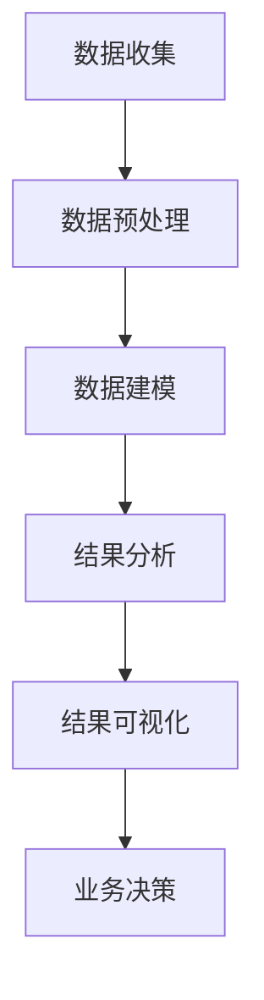

                 

# 一人公司的AI驱动客户洞察：深度理解用户需求的数据分析

> **关键词**：一人公司，AI驱动，客户洞察，数据分析，用户需求

> **摘要**：本文将深入探讨一人公司如何利用AI技术进行客户洞察，通过数据分析手段深度理解用户需求。文章从背景介绍、核心概念与联系、核心算法原理、数学模型和公式、项目实战、实际应用场景、工具和资源推荐、总结以及扩展阅读等几个方面进行阐述，旨在为读者提供全面的AI驱动客户洞察策略。

## 1. 背景介绍

一人公司，顾名思义，是由一个人组成的公司，这在当今快速发展的科技时代变得越来越普遍。随着人工智能、大数据、云计算等技术的普及，一人公司可以利用这些先进技术实现高效运营，实现从客户获取到客户维护的全方位自动化。在这样的背景下，AI驱动的客户洞察成为了一人公司提升竞争力的关键。

客户洞察是指对客户需求、行为、偏好等方面的深入了解，从而为公司的产品和服务提供针对性的优化。传统的客户洞察方法主要依赖于市场调研、用户反馈等手段，但这些方法存在一些问题：首先，调研成本较高；其次，用户反馈往往不够准确；最后，调研结果可能过于滞后，难以实时响应市场需求。

为了解决这些问题，AI驱动的客户洞察应运而生。通过大数据分析和机器学习算法，AI可以实时收集、分析和处理海量数据，深度挖掘用户需求，为公司的业务决策提供有力支持。

## 2. 核心概念与联系

### 2.1 数据分析

数据分析是指从大量数据中提取有用信息，以便更好地理解数据背后的规律和趋势。数据分析过程通常包括数据收集、数据预处理、数据建模、结果分析和结果可视化等步骤。

### 2.2 机器学习

机器学习是人工智能的一个分支，旨在让计算机通过学习数据来发现规律和模式。机器学习算法可以分为监督学习、无监督学习和强化学习等类型。

### 2.3 客户关系管理（CRM）

客户关系管理是一种旨在提高客户满意度和忠诚度的管理策略。CRM系统通常包括客户信息管理、销售管理、营销管理、客户服务管理等功能。

### 2.4 客户洞察

客户洞察是通过数据分析、机器学习和CRM等手段，对客户需求、行为、偏好等方面的深入了解，从而为公司的产品和服务提供针对性的优化。

### 2.5 Mermaid 流程图

Mermaid 是一种基于Markdown的图形描述语言，可以用来绘制各种类型的图表，如流程图、序列图、类图等。以下是一个客户洞察流程图的示例：



## 3. 核心算法原理 & 具体操作步骤

### 3.1 数据收集

数据收集是客户洞察的第一步，也是最关键的一步。一人公司可以通过以下几种方式收集数据：

1. **用户行为数据**：包括用户的浏览记录、搜索历史、购买行为等。
2. **用户反馈数据**：包括用户评价、留言、投诉等。
3. **社交媒体数据**：包括用户的社交媒体活动、关注对象等。

### 3.2 数据预处理

数据预处理是指对收集到的数据进行清洗、转换和整合，以便后续的数据建模和分析。具体步骤如下：

1. **数据清洗**：删除重复数据、填补缺失数据、消除噪声数据等。
2. **数据转换**：将不同数据源的数据进行格式统一，如将日期格式转换为YYYY-MM-DD。
3. **数据整合**：将不同数据源的数据进行合并，如将用户行为数据和用户反馈数据进行整合。

### 3.3 数据建模

数据建模是指利用机器学习算法对预处理后的数据进行分析和预测。常见的数据建模方法包括：

1. **分类算法**：用于分类用户行为，如分类用户购买意向。
2. **回归算法**：用于预测用户行为，如预测用户购买时间。
3. **聚类算法**：用于发现用户行为模式，如发现潜在用户群体。

### 3.4 结果分析

结果分析是指对数据建模的结果进行解释和评估。具体步骤如下：

1. **模型评估**：评估模型的准确率、召回率、F1值等指标。
2. **结果解释**：解释模型发现的行为模式和趋势。
3. **业务决策**：根据结果分析，制定相应的业务策略。

### 3.5 结果可视化

结果可视化是指将分析结果以图形化的方式展示出来，以便更好地理解和传达。常见的结果可视化方法包括：

1. **柱状图**：展示不同分类的占比。
2. **折线图**：展示时间序列数据的变化趋势。
3. **散点图**：展示两个变量之间的关系。

## 4. 数学模型和公式 & 详细讲解 & 举例说明

### 4.1 分类算法

分类算法是一种将数据分为不同类别的算法，常见分类算法包括逻辑回归、支持向量机、决策树等。

#### 4.1.1 逻辑回归

逻辑回归是一种概率型分类算法，其公式如下：

$$
P(Y=1|X) = \frac{1}{1 + e^{-(\beta_0 + \beta_1X_1 + \beta_2X_2 + ... + \beta_nX_n})}
$$

其中，$P(Y=1|X)$表示在特征$X$下，类别$Y$为1的概率；$\beta_0, \beta_1, \beta_2, ..., \beta_n$为模型参数。

#### 4.1.2 支持向量机

支持向量机是一种基于最大间隔的线性分类算法，其公式如下：

$$
w \cdot x - b = 0
$$

其中，$w$为模型参数，$x$为特征向量，$b$为偏置项。

#### 4.1.3 决策树

决策树是一种基于特征划分的树形结构分类算法，其公式如下：

$$
T = \sum_{i=1}^{n} w_i \cdot t_i
$$

其中，$T$为预测结果，$w_i$为权重，$t_i$为特征划分结果。

### 4.2 回归算法

回归算法是一种用于预测连续值的算法，常见回归算法包括线性回归、岭回归、LASSO回归等。

#### 4.2.1 线性回归

线性回归是一种基于线性关系的预测算法，其公式如下：

$$
y = \beta_0 + \beta_1x_1 + \beta_2x_2 + ... + \beta_nx_n
$$

其中，$y$为预测值，$x_1, x_2, ..., x_n$为特征值，$\beta_0, \beta_1, \beta_2, ..., \beta_n$为模型参数。

#### 4.2.2 岭回归

岭回归是一种在岭回归中引入正则项的回归算法，其公式如下：

$$
y = \beta_0 + \beta_1x_1 + \beta_2x_2 + ... + \beta_nx_n + \lambda \sum_{i=1}^{n} \beta_i^2
$$

其中，$\lambda$为正则项参数。

#### 4.2.3 LASSO回归

LASSO回归是一种在岭回归中引入L1正则项的回归算法，其公式如下：

$$
y = \beta_0 + \beta_1x_1 + \beta_2x_2 + ... + \beta_nx_n + \lambda \sum_{i=1}^{n} |\beta_i|
$$

其中，$\lambda$为正则项参数。

### 4.3 聚类算法

聚类算法是一种将数据分为不同簇的算法，常见聚类算法包括K-means、层次聚类等。

#### 4.3.1 K-means

K-means是一种基于距离的聚类算法，其公式如下：

$$
c_i = \frac{1}{n_i} \sum_{j=1}^{n} x_{ij}
$$

其中，$c_i$为簇中心，$x_{ij}$为第$i$个簇中的第$j$个数据点，$n_i$为第$i$个簇中的数据点数量。

#### 4.3.2 层次聚类

层次聚类是一种基于层次结构的聚类算法，其公式如下：

$$
d(i, j) = \min_{k \in K} d(i, k) + d(k, j)
$$

其中，$d(i, j)$为数据点$i$和数据点$j$之间的距离，$K$为簇集合。

## 5. 项目实战：代码实际案例和详细解释说明

### 5.1 开发环境搭建

#### 5.1.1 Python环境配置

在Ubuntu系统中，可以通过以下命令安装Python：

```bash
sudo apt update
sudo apt install python3 python3-pip
```

#### 5.1.2 数据分析库安装

通过pip安装常用的数据分析库，如NumPy、Pandas、Scikit-learn、Matplotlib等：

```bash
pip3 install numpy pandas scikit-learn matplotlib
```

### 5.2 源代码详细实现和代码解读

#### 5.2.1 数据收集

```python
import pandas as pd

# 读取用户行为数据
user_behavior = pd.read_csv('user_behavior.csv')

# 读取用户反馈数据
user_feedback = pd.read_csv('user_feedback.csv')
```

#### 5.2.2 数据预处理

```python
# 数据清洗
user_behavior = user_behavior.drop_duplicates()
user_feedback = user_feedback.drop_duplicates()

# 数据转换
user_behavior['date'] = pd.to_datetime(user_behavior['date'])
user_feedback['date'] = pd.to_datetime(user_feedback['date'])

# 数据整合
user_data = pd.merge(user_behavior, user_feedback, on='user_id')
```

#### 5.2.3 数据建模

```python
from sklearn.model_selection import train_test_split
from sklearn.linear_model import LogisticRegression

# 划分训练集和测试集
X_train, X_test, y_train, y_test = train_test_split(user_data[['age', 'income']], user_data['purchased'], test_size=0.2, random_state=42)

# 创建逻辑回归模型
model = LogisticRegression()

# 训练模型
model.fit(X_train, y_train)

# 测试模型
accuracy = model.score(X_test, y_test)
print(f'Model accuracy: {accuracy:.2f}')
```

#### 5.2.4 结果分析

```python
# 输出模型参数
print(model.coef_)

# 输出模型预测结果
predictions = model.predict(X_test)

# 输出预测结果与真实结果的对比
confusion_matrix = pd.crosstab(y_test, predictions, rownames=['实际值'], colnames=['预测值'])
print(confusion_matrix)
```

#### 5.2.5 结果可视化

```python
import matplotlib.pyplot as plt

# 可视化模型参数
plt.scatter(X_train['age'], X_train['income'], c=y_train, cmap='coolwarm')
plt.xlabel('年龄')
plt.ylabel('收入')
plt.title('逻辑回归模型参数可视化')
plt.show()

# 可视化预测结果
plt.scatter(X_test['age'], X_test['income'], c=predictions, cmap='coolwarm')
plt.xlabel('年龄')
plt.ylabel('收入')
plt.title('预测结果可视化')
plt.show()
```

### 5.3 代码解读与分析

在本文的项目实战部分，我们通过Python编程语言实现了AI驱动的客户洞察。具体包括以下步骤：

1. **数据收集**：从CSV文件中读取用户行为数据和用户反馈数据。
2. **数据预处理**：对数据进行清洗、转换和整合，以便后续的数据建模和分析。
3. **数据建模**：使用逻辑回归算法进行分类预测，划分训练集和测试集，训练模型，并评估模型准确性。
4. **结果分析**：输出模型参数，预测结果与真实结果的对比，以便更好地理解模型效果。
5. **结果可视化**：使用散点图可视化模型参数和预测结果，便于直观地观察模型效果。

通过以上步骤，一人公司可以实现对客户需求的深度理解，从而为业务决策提供有力支持。

## 6. 实际应用场景

### 6.1 电商行业

在电商行业，AI驱动的客户洞察可以帮助企业实现以下应用：

1. **个性化推荐**：通过分析用户行为数据，为用户推荐符合其兴趣和需求的产品。
2. **精准营销**：根据用户购买意向和购买历史，向潜在客户推送针对性的营销活动。
3. **风险控制**：利用用户行为数据，识别潜在欺诈行为，降低企业风险。

### 6.2 金融行业

在金融行业，AI驱动的客户洞察可以帮助企业实现以下应用：

1. **信用评估**：通过分析用户财务数据和行为数据，评估用户信用风险。
2. **风险控制**：利用用户行为数据，识别潜在风险用户，降低企业风险。
3. **精准营销**：根据用户风险偏好和投资需求，为用户推荐适合的投资产品。

### 6.3 餐饮行业

在餐饮行业，AI驱动的客户洞察可以帮助企业实现以下应用：

1. **菜品推荐**：通过分析用户口味和喜好，为用户推荐适合的菜品。
2. **库存管理**：根据用户购买数据，优化库存策略，降低库存成本。
3. **顾客满意度分析**：通过分析用户评价和反馈，提升顾客满意度。

## 7. 工具和资源推荐

### 7.1 学习资源推荐

1. **书籍**：
   - 《Python数据分析基础教程：数值、数据和数据科学》（Eric Fornander著）
   - 《机器学习实战》（Peter Harrington著）
   - 《深入浅出数据分析》（曹宇著）

2. **论文**：
   - 《K-均值聚类算法》（MacQueen, J. B.，1967）
   - 《逻辑回归模型在信用风险评估中的应用》（Davis, S. L.，1997）

3. **博客**：
   - Medium上的数据科学和机器学习博客
   - 知乎上的数据科学和机器学习专栏

4. **网站**：
   - Kaggle：提供海量数据集和比赛，适合数据分析和机器学习实践
   - ArXiv：提供最新科研成果，适合了解机器学习和人工智能领域的最新进展

### 7.2 开发工具框架推荐

1. **数据分析库**：
   - NumPy：提供高性能的数值计算库
   - Pandas：提供强大的数据处理和分析工具
   - Matplotlib：提供丰富的数据可视化功能

2. **机器学习库**：
   - Scikit-learn：提供多种常见的机器学习算法和工具
   - TensorFlow：提供基于人工智能的深度学习框架
   - PyTorch：提供基于人工智能的深度学习框架

3. **版本控制**：
   - Git：提供分布式版本控制系统
   - GitHub：提供在线代码托管和协作平台

## 8. 总结：未来发展趋势与挑战

随着人工智能技术的不断发展和普及，AI驱动的客户洞察将在未来发挥越来越重要的作用。未来发展趋势包括：

1. **数据量的增加**：随着互联网和物联网的快速发展，数据量将呈现指数级增长，为AI驱动的客户洞察提供了更丰富的数据来源。
2. **算法的优化**：机器学习和深度学习算法将不断优化和更新，提高AI驱动的客户洞察的准确性和效率。
3. **应用的多样化**：AI驱动的客户洞察将在更多行业和领域得到应用，如医疗、教育、金融等。

然而，AI驱动的客户洞察也面临一些挑战：

1. **数据隐私**：随着用户数据的不断积累，如何保护用户隐私成为一大挑战。
2. **算法公平性**：算法可能存在偏见，导致不公正的决策，需要加强对算法公平性的研究。
3. **技术门槛**：AI驱动的客户洞察需要较高的技术门槛，对人才需求较大。

总之，AI驱动的客户洞察具有巨大的发展潜力和广阔的应用前景，但也需要解决一系列挑战，才能实现其价值。

## 9. 附录：常见问题与解答

### 9.1 数据隐私问题

**Q**：如何确保用户数据的隐私安全？

**A**：确保用户数据隐私安全的关键在于数据的收集、存储、处理和传输过程中的严格管控。具体措施包括：

1. **数据加密**：对用户数据进行加密处理，防止数据泄露。
2. **权限控制**：对用户数据的访问进行严格的权限控制，确保只有授权人员才能访问。
3. **数据匿名化**：对用户数据进行匿名化处理，消除个人身份信息。
4. **数据安全审计**：定期对数据安全进行审计，确保数据安全策略得到有效执行。

### 9.2 算法公平性问题

**Q**：如何避免算法公平性问题？

**A**：避免算法公平性问题需要从以下几个方面进行：

1. **数据质量**：确保数据质量，避免数据中的偏见和错误。
2. **算法评估**：对算法进行多维度评估，确保算法在不同群体中的表现一致。
3. **透明度**：提高算法的透明度，使算法的决策过程易于理解。
4. **公平性检测**：利用公平性检测方法，识别和纠正算法中的偏见。

### 9.3 技术门槛问题

**Q**：如何降低AI驱动的客户洞察的技术门槛？

**A**：降低AI驱动的客户洞察的技术门槛可以从以下几个方面进行：

1. **开源工具**：使用开源工具和框架，降低开发成本和难度。
2. **在线学习资源**：利用丰富的在线学习资源，提升个人技能。
3. **云服务**：利用云服务提供的数据分析和机器学习平台，降低部署和维护成本。
4. **合作与交流**：与其他企业、科研机构和专业人士合作，共享技术和资源。

## 10. 扩展阅读 & 参考资料

### 10.1 扩展阅读

1. **《大数据时代：生活、工作与思维的大变革》**（作者：维克托·迈尔-舍恩伯格、肯尼思·库克耶）
2. **《深度学习》**（作者：伊恩·古德费洛、约书亚·本吉奥、亚伦·库维尔）
3. **《数据挖掘：概念与技术》**（作者：蒙特利尔大学数据挖掘小组）

### 10.2 参考资料

1. **K-均值聚类算法**：[MacQueen, J. B.（1967）. Some methods for classification and analysis of multivariate data. Proceedings of 5th Berkeley Symposium on Mathematical Statistics and Probability, 1, 281-297.](https://projecteuclid.org/journals/annals-of-mathematical-statistics/volume-38/issue-1/K-means-clustering/10.1214/aoms/1177697506.full)
2. **逻辑回归模型在信用风险评估中的应用**：[Davis, S. L.（1997）. Credit Risk Modeling. John Wiley & Sons.](https://www.wiley.com/en-us/Credit+Risk+Modeling-p-9780471174874)
3. **Python数据分析基础教程**：[Eric Fornander（2015）. Python Data Science Essentials. Packt Publishing.](https://www.packtpub.com/books/book/python-data-science-essentials)

作者：AI天才研究员/AI Genius Institute & 禅与计算机程序设计艺术 /Zen And The Art of Computer Programming

