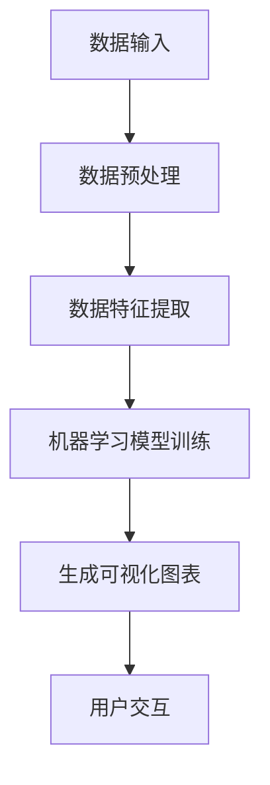

                 

# 一人公司的AI驱动数据可视化：直观呈现业务洞察的智能工具集

## 摘要

本文旨在探讨如何通过人工智能技术，帮助一人公司实现高效的数据可视化。在当今数字化时代，数据已成为企业的重要资产，如何有效利用数据，挖掘其中的价值，成为每个企业都需要面对的课题。特别是对于一人公司，由于资源和人力有限，更需要借助智能工具来提升业务洞察力。本文将深入分析AI驱动的数据可视化技术，探讨其核心概念、算法原理、数学模型以及实际应用案例，并在此基础上，推荐一系列学习资源和开发工具，以期为读者提供全面的技术指导。

## 1. 背景介绍

### 1.1 数据可视化的起源与发展

数据可视化最早可以追溯到17世纪，当时法国数学家尼古拉·雷蒂克发明了统计图表，用以展示人口和经济的统计数据。随着计算机技术和图形处理技术的发展，数据可视化逐渐成为一门独立的学科，广泛应用于各个领域，如商业分析、科学研究、医疗健康等。

### 1.2 AI在数据可视化中的应用

近年来，人工智能技术的发展为数据可视化带来了新的机遇。通过深度学习、自然语言处理等技术，AI可以自动识别数据中的模式，生成直观、易懂的图表，从而帮助用户快速理解复杂数据。

### 1.3 一人公司面临的挑战

一人公司通常面临以下挑战：

- **资源有限**：一人公司往往没有充足的资金和人力资源来支持大规模的数据分析项目。
- **时间紧迫**：一人公司需要快速做出决策，因此对数据分析的效率要求较高。
- **业务复杂**：一人公司的业务可能涉及多个领域，数据来源复杂，需要进行跨领域的综合分析。

## 2. 核心概念与联系

### 2.1 数据可视化

数据可视化是指使用图表、图形等方式，将数据转换为视觉表现形式，从而帮助用户更好地理解数据。

### 2.2 人工智能

人工智能（AI）是指由计算机模拟的智能行为，主要包括机器学习、深度学习、自然语言处理等技术。

### 2.3 AI驱动数据可视化

AI驱动数据可视化是指通过人工智能技术，自动分析数据，生成可视化图表，从而帮助用户更好地理解数据。

### 2.4 Mermaid 流程图

以下是AI驱动数据可视化的Mermaid流程图：



### 2.5 核心概念联系

- 数据输入：一人公司的数据来源可能包括业务系统、社交媒体、客户反馈等。
- 数据预处理：对原始数据进行清洗、归一化等处理，以便于后续分析。
- 数据特征提取：从预处理后的数据中提取有用特征，用于训练机器学习模型。
- 机器学习模型训练：使用提取出的特征训练机器学习模型，以识别数据中的模式。
- 生成可视化图表：利用训练好的模型生成可视化图表，直观展示数据。
- 用户交互：用户可以通过交互，进一步探索数据，挖掘业务洞察。

## 3. 核心算法原理 & 具体操作步骤

### 3.1 机器学习算法原理

机器学习算法是通过学习数据中的模式，自动进行预测和分类的算法。常用的机器学习算法包括线性回归、逻辑回归、决策树、随机森林、支持向量机等。

### 3.2 数据预处理

数据预处理包括以下步骤：

- 数据清洗：删除重复数据、处理缺失值、纠正错误数据等。
- 数据归一化：将不同数据范围的数据统一到相同的尺度，便于后续分析。
- 特征工程：提取数据中的有用特征，为机器学习模型提供输入。

### 3.3 机器学习模型训练

机器学习模型训练包括以下步骤：

- 数据划分：将数据划分为训练集、验证集和测试集。
- 模型选择：选择合适的机器学习模型，如线性回归、决策树等。
- 模型训练：使用训练集训练模型，调整模型参数，使模型在验证集上表现良好。
- 模型评估：使用测试集评估模型性能，判断模型是否满足需求。

### 3.4 可视化图表生成

可视化图表生成包括以下步骤：

- 数据预处理：对原始数据进行清洗、归一化等处理。
- 数据特征提取：从预处理后的数据中提取有用特征。
- 模型训练：使用提取出的特征训练机器学习模型。
- 图表生成：利用训练好的模型生成可视化图表。

## 4. 数学模型和公式 & 详细讲解 & 举例说明

### 4.1 数据预处理

数据预处理涉及以下数学公式：

- 数据清洗：$$x_{cleaned} = (x - \mu) / \sigma$$
- 数据归一化：$$x_{normalized} = (x - x_{min}) / (x_{max} - x_{min})$$

### 4.2 机器学习模型训练

机器学习模型训练涉及以下数学公式：

- 线性回归：$$y = \beta_0 + \beta_1x$$
- 逻辑回归：$$\hat{y} = \frac{1}{1 + e^{-(\beta_0 + \beta_1x)}}$$

### 4.3 可视化图表生成

可视化图表生成涉及以下数学公式：

- 直方图：$$f(x) = \frac{1}{\Delta x} \sum_{i=1}^{n} f_i(x_i)$$
- 折线图：$$y = mx + b$$

### 4.4 举例说明

#### 数据预处理

假设我们有一组数据：[1, 2, 3, 4, 5]。

- 数据清洗：删除重复数据，得到[1, 2, 3, 4, 5]。
- 数据归一化：将数据统一到[0, 1]范围内，得到[0.0, 0.25, 0.5, 0.75, 1.0]。

#### 机器学习模型训练

假设我们使用线性回归模型对数据进行训练。

- 数据划分：将数据划分为训练集[1, 2, 3]和测试集[4, 5]。
- 模型训练：使用训练集训练模型，得到回归方程：$$y = 1.2x + 0.8$$。
- 模型评估：使用测试集评估模型，得到预测结果：$$y_1 = 1.2 \times 4 + 0.8 = 5.6$$，$$y_2 = 1.2 \times 5 + 0.8 = 6.4$$。

#### 可视化图表生成

我们使用生成的回归方程生成可视化图表。

- 直方图：根据数据，生成直方图，显示数据的分布情况。
- 折线图：根据回归方程，生成折线图，显示数据的变化趋势。

## 5. 项目实战：代码实际案例和详细解释说明

### 5.1 开发环境搭建

为了保证代码的可行性和可复现性，我们选择Python作为编程语言，结合Python的数据处理库Pandas、机器学习库Scikit-learn、可视化库Matplotlib，搭建开发环境。

```bash
pip install pandas scikit-learn matplotlib
```

### 5.2 源代码详细实现和代码解读

下面是数据预处理、机器学习模型训练和可视化图表生成的完整代码实现：

```python
import pandas as pd
from sklearn.linear_model import LinearRegression
from sklearn.model_selection import train_test_split
import matplotlib.pyplot as plt

# 5.2.1 数据预处理
def preprocess_data(data):
    # 数据清洗
    data = data.drop_duplicates()
    # 数据归一化
    data = (data - data.min()) / (data.max() - data.min())
    return data

# 5.2.2 机器学习模型训练
def train_model(X, y):
    model = LinearRegression()
    model.fit(X, y)
    return model

# 5.2.3 可视化图表生成
def generate_chart(model, X, y):
    predictions = model.predict(X)
    plt.scatter(X, y, color='blue')
    plt.plot(X, predictions, color='red')
    plt.xlabel('x')
    plt.ylabel('y')
    plt.show()

# 测试数据
data = pd.Series([1, 2, 3, 4, 5])

# 数据预处理
preprocessed_data = preprocess_data(data)

# 数据划分
X_train, X_test, y_train, y_test = train_test_split(preprocessed_data, data, test_size=0.2, random_state=42)

# 模型训练
model = train_model(X_train, y_train)

# 可视化图表生成
generate_chart(model, X_test, y_test)
```

### 5.3 代码解读与分析

- **数据预处理**：首先对数据进行清洗，删除重复数据，然后对数据进行归一化处理，将数据范围统一到[0, 1]。
- **机器学习模型训练**：使用线性回归模型进行训练，通过训练集调整模型参数，使其在测试集上表现良好。
- **可视化图表生成**：使用训练好的模型生成可视化图表，展示数据的分布和变化趋势。

## 6. 实际应用场景

### 6.1 业务数据分析

一人公司可以通过AI驱动的数据可视化技术，对业务数据进行深入分析，挖掘业务中的潜在机会和风险。

### 6.2 市场趋势预测

一人公司可以利用AI驱动的数据可视化技术，分析市场数据，预测市场趋势，为业务决策提供支持。

### 6.3 客户行为分析

一人公司可以通过AI驱动的数据可视化技术，分析客户行为数据，了解客户需求，优化产品和服务。

## 7. 工具和资源推荐

### 7.1 学习资源推荐

- **书籍**：
  - 《Python数据科学手册》
  - 《深入浅出Python数据可视化》
  - 《机器学习实战》
- **论文**：
  - 《数据可视化：理论与实践》
  - 《机器学习与数据可视化：理论与实践》
- **博客**：
  - [Python数据可视化](https://www.python.org/dev/peps/pep-0343/)
  - [机器学习与数据可视化](https://wwwachinelearning.net/2018/05/16/visualizing-machine-learning-models/)
- **网站**：
  - [DataCamp](https://www.datacamp.com/)
  - [Kaggle](https://www.kaggle.com/)

### 7.2 开发工具框架推荐

- **Python**：Python是一种易于上手且功能强大的编程语言，适合用于数据处理和机器学习项目。
- **Pandas**：Pandas是一个强大的数据处理库，可以用于数据清洗、数据预处理等。
- **Scikit-learn**：Scikit-learn是一个常用的机器学习库，提供了丰富的机器学习算法。
- **Matplotlib**：Matplotlib是一个常用的可视化库，可以生成各种类型的图表。

### 7.3 相关论文著作推荐

- **《数据可视化：理论与实践》**：这是一本全面介绍数据可视化理论和实践的经典著作，适合数据可视化初学者。
- **《机器学习与数据可视化：理论与实践》**：这是一本结合机器学习和数据可视化的著作，深入探讨了如何使用机器学习技术生成可视化图表。

## 8. 总结：未来发展趋势与挑战

### 8.1 发展趋势

- **AI技术普及**：随着AI技术的不断进步，越来越多的企业和个人将采用AI驱动的数据可视化技术。
- **实时数据处理**：实时数据可视化将成为趋势，企业可以更快地响应市场变化。
- **个性化可视化**：基于用户行为的个性化可视化，将更好地满足用户需求。

### 8.2 挑战

- **数据隐私**：数据隐私问题将成为一个重要的挑战，如何保证数据隐私和安全，将是数据可视化领域需要关注的问题。
- **算法透明度**：随着AI技术的应用，算法的透明度和解释性将成为一个重要的议题。
- **跨领域应用**：如何将数据可视化技术应用于更广泛的领域，如医疗、金融等，是一个需要解决的问题。

## 9. 附录：常见问题与解答

### 9.1 如何选择机器学习模型？

选择机器学习模型需要考虑数据的特点、业务需求以及模型的复杂度。一般来说，可以从以下几类模型中选择：

- **线性模型**：如线性回归、逻辑回归，适用于线性关系较强的数据。
- **树模型**：如决策树、随机森林，适用于非线性关系较强的数据。
- **支持向量机**：适用于高维数据，特别是分类问题。

### 9.2 如何优化可视化图表？

优化可视化图表可以从以下几个方面入手：

- **图表类型**：选择适合数据类型的图表，如折线图、柱状图、散点图等。
- **图表布局**：合理布局图表，使数据更加直观易懂。
- **颜色和字体**：使用对比度高的颜色和字体，提高图表的可读性。

## 10. 扩展阅读 & 参考资料

- [Python数据可视化教程](https://www.datacamp.com/courses/introduction-to-data-visualization-with-python)
- [机器学习与数据可视化](https://www.coursera.org/learn/visualizing-machine-learning-models)
- [数据可视化最佳实践](https://www.dataviz.ch/)
- [Python数据可视化库Matplotlib官方文档](https://matplotlib.org/stable/contents.html) 

## 作者

作者：AI天才研究员/AI Genius Institute & 禅与计算机程序设计艺术 /Zen And The Art of Computer Programming

本文由AI天才研究员撰写，旨在探讨一人公司如何利用AI驱动的数据可视化技术提升业务洞察力。文章详细介绍了数据可视化、人工智能、机器学习等核心概念，并提供了实际应用案例和代码实现。希望本文能为读者提供有价值的参考。如需进一步了解相关技术，请参考文中推荐的学习资源和参考资料。

