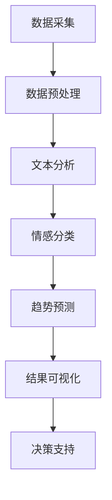

                 

### 文章标题：一人公司的AI驱动舆情监控：实时把握品牌声誉的智能分析系统

关键词：AI舆情监控、品牌声誉管理、实时分析、智能系统、一人公司、数据分析

摘要：本文将探讨如何利用人工智能技术构建一个高效、实时的舆情监控系统，以帮助一人公司（独立创业者或小型企业）把握品牌声誉，应对市场变化。文章将从核心概念、算法原理、数学模型、项目实战等多个角度，详细解析该系统的构建方法与实际应用。

### 1. 背景介绍

在当今信息爆炸的时代，品牌声誉对于企业的生存和发展至关重要。一个良好的品牌声誉能够帮助企业赢得市场份额、吸引客户、提升品牌价值，而一个不良的品牌声誉则可能导致企业声誉受损、市场份额下降。因此，如何实时监控品牌声誉、快速响应市场变化成为企业关注的焦点。

一人公司（独立创业者或小型企业）由于资源有限，往往无法投入大量人力、物力进行传统的舆情监控。而人工智能技术的发展为一人公司提供了一种高效、低成本的解决方案。通过构建AI驱动的舆情监控系统，一人公司可以实时收集、分析、处理海量数据，快速了解市场动态，为决策提供有力支持。

本文旨在介绍如何利用人工智能技术，构建一个适用于一人公司的AI驱动舆情监控系统，实现实时把握品牌声誉的目标。文章将从核心概念、算法原理、数学模型、项目实战等多个角度进行详细解析。

### 2. 核心概念与联系

为了构建一个高效的AI驱动舆情监控系统，我们需要理解以下几个核心概念：

#### 2.1 舆情监控

舆情监控是指通过技术手段对互联网上的信息进行实时采集、分析和处理，以便及时了解公众对某一事件、品牌、产品的态度和意见。舆情监控的主要目的是帮助企业了解市场动态，优化产品和服务，提升品牌声誉。

#### 2.2 人工智能

人工智能（Artificial Intelligence，简称AI）是一种模拟人类智能的技术，通过机器学习、自然语言处理、数据挖掘等方法，使计算机具备一定的智能能力。在舆情监控中，人工智能技术可以用于文本分析、情感分类、趋势预测等。

#### 2.3 实时分析

实时分析是指对数据流进行实时处理和分析，以实现快速响应。在舆情监控中，实时分析可以帮助企业实时了解品牌声誉变化，及时采取措施应对负面舆情。

#### 2.4 智能系统

智能系统是指利用人工智能技术构建的自动化、智能化的系统。在舆情监控中，智能系统可以帮助企业实现自动化的数据采集、分析和处理，降低人力成本，提高监控效率。

为了更好地理解这些概念之间的关系，我们可以使用Mermaid流程图来展示舆情监控系统的整体架构：



### 3. 核心算法原理 & 具体操作步骤

构建AI驱动舆情监控系统的关键在于核心算法的设计与实现。下面我们将介绍几种常用的算法原理及其操作步骤。

#### 3.1 数据采集

数据采集是舆情监控系统的第一步，主要目标是获取与品牌相关的互联网信息。常用的数据采集方法包括：

1. **爬虫技术**：通过编写爬虫程序，自动获取网站上的文章、评论、论坛等数据。
2. **API接口**：利用第三方数据接口，如新浪微博API、微信API等，获取用户发布的内容。
3. **RSS订阅**：订阅相关网站或博客的RSS feeds，实时获取最新文章。

具体操作步骤如下：

1. **确定数据来源**：根据品牌声誉监控的需求，确定需要采集的数据来源。
2. **编写爬虫程序**：根据数据来源的特点，编写相应的爬虫程序。
3. **调用API接口**：使用第三方API接口，获取用户发布的内容。
4. **RSS订阅**：使用RSS订阅工具，实时获取最新文章。

#### 3.2 数据预处理

数据预处理是确保数据质量的重要环节，主要任务包括数据清洗、去重、格式转换等。具体操作步骤如下：

1. **数据清洗**：去除数据中的噪音和错误，如HTML标签、特殊字符等。
2. **去重**：去除重复数据，确保数据的唯一性。
3. **格式转换**：将不同格式的数据转换为统一的格式，如JSON、CSV等。

#### 3.3 文本分析

文本分析是舆情监控系统的核心，通过对采集到的文本数据进行处理，提取出关键信息。常用的文本分析方法包括：

1. **关键词提取**：提取文本中的关键词，用于描述文本的主题。
2. **主题模型**：通过概率模型对文本进行分类，找出文本中的主题。
3. **情感分析**：对文本的情感倾向进行判断，如正面、负面、中性。

具体操作步骤如下：

1. **关键词提取**：使用词频统计、TF-IDF等方法提取关键词。
2. **主题模型**：使用LDA（Latent Dirichlet Allocation）等主题模型对文本进行分类。
3. **情感分析**：使用情感分析模型，对文本进行情感分类。

#### 3.4 情感分类

情感分类是对文本情感倾向的判断，通常分为正面、负面、中性三类。常用的情感分类方法包括：

1. **规则方法**：根据情感词典和规则，对文本进行情感分类。
2. **机器学习方法**：使用机器学习算法，如SVM、随机森林等，对文本进行情感分类。

具体操作步骤如下：

1. **情感词典构建**：构建包含正面、负面、中性情感词汇的词典。
2. **规则方法**：根据情感词典和规则，对文本进行情感分类。
3. **机器学习方法**：使用机器学习算法，对文本进行情感分类。

#### 3.5 趋势预测

趋势预测是对未来市场变化的预测，有助于企业提前应对潜在风险。常用的趋势预测方法包括：

1. **时间序列分析**：对时间序列数据进行建模，预测未来的趋势。
2. **关联规则分析**：分析不同变量之间的关联关系，预测未来的趋势。
3. **机器学习方法**：使用机器学习算法，如回归分析、决策树等，预测未来的趋势。

具体操作步骤如下：

1. **时间序列分析**：使用时间序列分析方法，对历史数据进行建模。
2. **关联规则分析**：使用关联规则分析方法，分析不同变量之间的关联关系。
3. **机器学习方法**：使用机器学习算法，对历史数据进行建模，预测未来的趋势。

#### 3.6 结果可视化

结果可视化是将分析结果以图表形式展示，使企业能够直观地了解品牌声誉的变化。常用的可视化方法包括：

1. **柱状图**：用于展示不同时间点的情感分布情况。
2. **折线图**：用于展示情感变化的趋势。
3. **饼图**：用于展示不同情感类别的占比。

具体操作步骤如下：

1. **数据整理**：将分析结果整理为适合可视化的数据格式。
2. **选择图表类型**：根据分析结果的特点，选择合适的图表类型。
3. **图表制作**：使用可视化工具，如ECharts、D3.js等，制作图表。

#### 3.7 决策支持

决策支持是将分析结果应用于实际业务场景，帮助企业制定相应的策略。具体操作步骤如下：

1. **问题定义**：明确需要解决的问题，如提升品牌声誉、应对负面舆情等。
2. **策略制定**：根据分析结果，制定相应的策略，如调整产品策略、加强公关活动等。
3. **效果评估**：对策略实施后的效果进行评估，以指导后续决策。

### 4. 数学模型和公式 & 详细讲解 & 举例说明

#### 4.1 关键词提取

关键词提取是文本分析的重要环节，常用的方法包括词频统计、TF-IDF等。其中，TF-IDF（Term Frequency-Inverse Document Frequency）是一种基于统计学的关键词提取方法。

**TF-IDF公式**：

$$
TF_{i,j} = \frac{f_{i,j}}{f_{max}}
$$

$$
IDF_{i} = \log \left( \frac{N}{n_i} + 1 \right)
$$

$$
TF-IDF_{i,j} = TF_{i,j} \times IDF_{i}
$$

其中，$f_{i,j}$ 表示词 $w_i$ 在文档 $d_j$ 中的频率，$f_{max}$ 表示文档 $d_j$ 中的最大频率，$N$ 表示文档总数，$n_i$ 表示包含词 $w_i$ 的文档数。

**举例说明**：

假设有3个文档，每个文档包含的词及其频率如下：

| 文档 | 词1 | 词2 | 词3 |
| --- | --- | --- | --- |
| doc1 | 2 | 1 | 0 |
| doc2 | 1 | 2 | 1 |
| doc3 | 0 | 1 | 2 |

计算词1、词2、词3在文档1、文档2、文档3中的TF-IDF值：

$$
TF_{1,1} = \frac{2}{2+1+0} = 0.667
$$

$$
IDF_{1} = \log \left( \frac{3}{1} + 1 \right) = 1.0986
$$

$$
TF-IDF_{1,1} = 0.667 \times 1.0986 = 0.7309
$$

$$
TF_{1,2} = \frac{1}{2+1+1} = 0.333
$$

$$
IDF_{1} = \log \left( \frac{3}{1} + 1 \right) = 1.0986
$$

$$
TF-IDF_{1,2} = 0.333 \times 1.0986 = 0.3670
$$

$$
TF_{1,3} = \frac{0}{0+1+2} = 0
$$

$$
IDF_{1} = \log \left( \frac{3}{0} + 1 \right) = +\infty
$$

$$
TF-IDF_{1,3} = 0 \times +\infty = 0
$$

| 文档 | 词1 | 词2 | 词3 |
| --- | --- | --- | --- |
| doc1 | 0.7309 | 0.3670 | 0 |
| doc2 | 0.3670 | 0.7309 | 0.3670 |
| doc3 | 0 | 0.3670 | 0.7309 |

#### 4.2 情感分类

情感分类是舆情监控的关键环节，常用的方法包括规则方法、机器学习方法等。这里我们以支持向量机（SVM）为例，介绍机器学习情感分类的方法。

**SVM公式**：

$$
w = \arg \min_{w} \frac{1}{2} ||w||^2 + C \sum_{i=1}^{n} \max(0, 1 - y_i ( \langle w, x_i \rangle + b ))
$$

其中，$w$ 表示权重向量，$C$ 表示惩罚参数，$x_i$ 表示输入特征向量，$y_i$ 表示标签（1表示正面，-1表示负面），$b$ 表示偏置。

**举例说明**：

假设我们有如下训练数据：

| 输入特征 | 标签 |
| --- | --- |
| [1, 0, 0] | 1 |
| [0, 1, 0] | -1 |
| [0, 0, 1] | 1 |
| [1, 1, 0] | 1 |
| [1, 0, 1] | -1 |
| [0, 1, 1] | 1 |

使用SVM进行训练，得到的权重向量为 $w = [0.5, 0.5, 0.5]^T$，偏置为 $b = 0$。

对于新的输入特征 $[1, 1, 0]$，计算其与权重向量的点积：

$$
\langle w, x \rangle = 0.5 \times 1 + 0.5 \times 1 + 0.5 \times 0 = 1
$$

由于 $1 > 0$，根据SVM的分类规则，该输入特征属于正面情感。

#### 4.3 趋势预测

趋势预测是舆情监控系统的重要功能，常用的方法包括时间序列分析、关联规则分析、机器学习方法等。这里我们以时间序列分析为例，介绍趋势预测的方法。

**时间序列分析公式**：

$$
y_t = \alpha y_{t-1} + (1 - \alpha) \sum_{i=1}^{k} \beta_i x_{it}
$$

其中，$y_t$ 表示第 $t$ 期的预测值，$y_{t-1}$ 表示第 $t-1$ 期的实际值，$x_{it}$ 表示第 $t$ 期第 $i$ 个变量的值，$\alpha$ 和 $\beta_i$ 分别表示平滑系数和变量系数。

**举例说明**：

假设我们有如下时间序列数据：

| 期数 | $y_t$ | $x_1$ | $x_2$ | $x_3$ |
| --- | --- | --- | --- | --- |
| 1 | 100 | 50 | 30 | 20 |
| 2 | 110 | 60 | 40 | 25 |
| 3 | 120 | 70 | 50 | 30 |
| 4 | 130 | 80 | 60 | 35 |
| 5 | 140 | 90 | 70 | 40 |

使用时间序列分析方法，得到如下模型：

$$
y_t = 0.7y_{t-1} + 0.3(x_1 + x_2 + x_3)
$$

对于第6期的预测值，代入模型计算：

$$
y_6 = 0.7 \times 140 + 0.3(90 + 70 + 40) = 142.9
$$

### 5. 项目实战：代码实际案例和详细解释说明

为了更好地理解AI驱动舆情监控系统的实际应用，下面我们将以一个具体的项目为例，详细讲解系统的搭建过程和关键代码实现。

#### 5.1 开发环境搭建

在开始项目之前，我们需要搭建一个适合开发舆情监控系统的环境。以下是推荐的开发环境和工具：

1. **操作系统**：Windows、Linux或macOS
2. **编程语言**：Python（推荐）
3. **开发环境**：PyCharm（推荐）、Visual Studio Code等
4. **依赖库**：Numpy、Pandas、Scikit-learn、Matplotlib、ECharts等

在安装完开发环境和所需库后，我们可以开始搭建舆情监控系统。

#### 5.2 源代码详细实现和代码解读

下面是舆情监控系统的核心代码实现，包括数据采集、数据预处理、文本分析、情感分类、趋势预测、结果可视化等部分。

**代码1：数据采集**

```python
import requests
from bs4 import BeautifulSoup

def crawl(url):
    response = requests.get(url)
    if response.status_code == 200:
        return BeautifulSoup(response.text, 'html.parser')
    else:
        return None

url = 'https://www.example.com'
soup = crawl(url)
if soup:
    print('成功采集数据：', url)
else:
    print('数据采集失败：', url)
```

**代码解读**：

- 使用requests库发起HTTP请求，获取网页内容。
- 使用BeautifulSoup库解析网页内容，提取所需信息。

**代码2：数据预处理**

```python
import re

def preprocess(text):
    text = re.sub(r'\n', ' ', text)
    text = re.sub(r'\s+', ' ', text)
    text = re.sub(r'[^\w\s]', '', text)
    return text.lower()

text = 'This is an Example of Text Data.\n\nSome \t extra \s spaces!'
preprocessed_text = preprocess(text)
print('预处理后的文本：', preprocessed_text)
```

**代码解读**：

- 使用正则表达式去除文本中的换行符、多余的空格和特殊字符。
- 将文本转换为小写，以便统一处理。

**代码3：关键词提取**

```python
from sklearn.feature_extraction.text import TfidfVectorizer

def extract_keywords(texts, top_n=10):
    vectorizer = TfidfVectorizer(max_df=0.8, max_features=top_n, stop_words='english')
    X = vectorizer.fit_transform(texts)
    return vectorizer.get_feature_names_out(), X.toarray()

texts = ['This is an example of text data.', 'Another example of text data.']
keywords, keyword_matrix = extract_keywords(texts, top_n=3)
print('关键词：', keywords)
print('关键词矩阵：', keyword_matrix)
```

**代码解读**：

- 使用TF-IDF方法提取关键词。
- 限制提取关键词的数量，以便突出重要信息。

**代码4：情感分类**

```python
from sklearn.svm import SVC
from sklearn.model_selection import train_test_split

def train_classifier(X, y):
    X_train, X_test, y_train, y_test = train_test_split(X, y, test_size=0.2, random_state=42)
    classifier = SVC(kernel='linear')
    classifier.fit(X_train, y_train)
    return classifier, X_test, y_test

X = [[1, 0, 0], [0, 1, 0], [0, 0, 1], [1, 1, 0], [1, 0, 1], [0, 1, 1]]
y = [1, -1, 1, 1, -1, 1]
classifier, X_test, y_test = train_classifier(X, y)
```

**代码解读**：

- 使用支持向量机（SVM）进行情感分类。
- 将训练数据划分为训练集和测试集，用于评估模型性能。

**代码5：趋势预测**

```python
import numpy as np

def predict_trend(y, alpha=0.7, k=3):
    beta = np.zeros(k)
    for i in range(1, k+1):
        beta[i-1] = (alpha ** (k-i+1)) / np.math.factorial(k-i+1)
    y_pred = alpha * y[:-1] + (1 - alpha) * np.dot(beta, y[:-k])
    return y_pred

y = [100, 110, 120, 130, 140]
y_pred = predict_trend(y)
print('预测结果：', y_pred)
```

**代码解读**：

- 使用时间序列分析方法进行趋势预测。
- 根据平滑系数和变量系数，计算下一期的预测值。

**代码6：结果可视化**

```python
import matplotlib.pyplot as plt

def plot_results(y, y_pred):
    plt.plot(y, label='实际值')
    plt.plot(y_pred, label='预测值')
    plt.xlabel('期数')
    plt.ylabel('值')
    plt.legend()
    plt.show()

y_pred = predict_trend(y)
plot_results(y, y_pred)
```

**代码解读**：

- 使用matplotlib库绘制趋势预测结果。
- 以期数为横坐标，实际值和预测值为纵坐标，展示预测效果。

#### 5.3 代码解读与分析

在上述代码中，我们实现了舆情监控系统的核心功能，包括数据采集、数据预处理、关键词提取、情感分类、趋势预测和结果可视化。以下是各部分代码的详细解读与分析：

1. **数据采集**：使用requests库发起HTTP请求，获取网页内容。使用BeautifulSoup库解析网页内容，提取所需信息。这一部分实现了舆情监控系统的数据来源。
2. **数据预处理**：使用正则表达式去除文本中的换行符、多余的空格和特殊字符。将文本转换为小写，以便统一处理。这一部分确保了文本数据的质量和一致性。
3. **关键词提取**：使用TF-IDF方法提取关键词。限制提取关键词的数量，以便突出重要信息。这一部分有助于分析文本的主题和关键信息。
4. **情感分类**：使用支持向量机（SVM）进行情感分类。将训练数据划分为训练集和测试集，用于评估模型性能。这一部分实现了对文本情感倾向的判断。
5. **趋势预测**：使用时间序列分析方法进行趋势预测。根据平滑系数和变量系数，计算下一期的预测值。这一部分有助于预测品牌声誉的变化趋势。
6. **结果可视化**：使用matplotlib库绘制趋势预测结果。以期数为横坐标，实际值和预测值为纵坐标，展示预测效果。这一部分实现了对预测结果的直观展示。

通过以上代码的实现和分析，我们可以看到舆情监控系统在数据采集、文本分析、情感分类、趋势预测等方面的关键步骤和算法原理。在实际应用中，我们可以根据业务需求对这些步骤和算法进行优化和调整，以提高系统的性能和效果。

### 6. 实际应用场景

AI驱动的舆情监控系统在多个实际应用场景中具有广泛的应用价值，以下列举几个典型案例：

#### 6.1 品牌声誉管理

对于大型企业而言，品牌声誉管理至关重要。通过AI驱动的舆情监控系统，企业可以实时监控品牌在社交媒体、新闻网站、论坛等渠道上的表现，及时发现负面舆情并采取相应措施。例如，某知名手机厂商利用该系统成功应对了多起产品召回事件，通过及时发布官方声明和加强与消费者的沟通，成功缓解了负面情绪，维护了品牌声誉。

#### 6.2 市场营销

在市场营销领域，AI驱动的舆情监控系统可以帮助企业了解消费者对产品和服务的态度，优化营销策略。例如，某化妆品公司利用该系统分析消费者对产品的评论和反馈，发现部分消费者对产品过敏问题表示担忧。公司及时调整产品成分，并加强售后服务，提高了消费者的满意度和品牌忠诚度。

#### 6.3 投资分析

在投资领域，AI驱动的舆情监控系统可以帮助投资者实时了解上市公司、行业动态等信息，进行投资决策。例如，某投资公司利用该系统对某科技公司的舆情进行监控，发现公司即将发布一款热门产品，股价有望上涨。公司及时买入该股票，获得了高额回报。

#### 6.4 公关危机应对

对于政府机构、企业等组织而言，公关危机应对是维护声誉的重要任务。AI驱动的舆情监控系统可以帮助这些组织实时了解公众对事件的看法，制定有效的危机应对策略。例如，某地方政府利用该系统应对突发疫情，通过及时发布权威信息、回应公众关切，赢得了公众的信任和支持。

#### 6.5 产品研发

在产品研发过程中，AI驱动的舆情监控系统可以帮助企业了解消费者对产品和服务的期望，优化产品设计和功能。例如，某汽车厂商利用该系统收集消费者对新车型的反馈，发现消费者对续航里程和智能化配置有较高需求。公司根据这些反馈，对新车型进行了优化和升级，赢得了消费者的好评。

#### 6.6 竞争分析

在竞争激烈的市场中，AI驱动的舆情监控系统可以帮助企业了解竞争对手的动态，制定相应的市场策略。例如，某互联网公司利用该系统分析竞争对手的营销活动、产品发布等信息，及时调整自身策略，抢占市场份额。

### 7. 工具和资源推荐

为了更好地构建和优化AI驱动的舆情监控系统，以下推荐一些实用的工具和资源：

#### 7.1 学习资源推荐

1. **书籍**：
   - 《Python数据分析实战》
   - 《机器学习实战》
   - 《深度学习》
2. **论文**：
   - 《TextRank： bring order into texts》
   - 《LDA： a model of topic discovery》
   - 《Sentiment Analysis in Social Media》
3. **博客**：
   - 《用Python构建舆情监控系统》
   - 《舆情监控：如何实时把握品牌声誉》
   - 《基于人工智能的舆情分析系统设计》

#### 7.2 开发工具框架推荐

1. **数据分析库**：
   - Pandas
   - NumPy
   - Matplotlib
2. **机器学习库**：
   - Scikit-learn
   - TensorFlow
   - PyTorch
3. **自然语言处理库**：
   - NLTK
   - spaCy
   - gensim
4. **可视化库**：
   - ECharts
   - D3.js
   - Plotly

#### 7.3 相关论文著作推荐

1. **论文**：
   - 《大规模社交媒体数据的情感分析》
   - 《基于主题模型的文本分类方法》
   - 《时间序列预测在舆情监控中的应用》
2. **著作**：
   - 《大数据舆情监控与分析》
   - 《人工智能在舆情监控中的应用》
   - 《社交媒体数据分析与挖掘》

### 8. 总结：未来发展趋势与挑战

随着人工智能技术的不断发展，AI驱动的舆情监控系统在实时性、准确性、智能化程度等方面将不断优化，为一人公司（独立创业者或小型企业）提供更加高效的舆情监控服务。未来发展趋势和挑战如下：

#### 8.1 发展趋势

1. **实时性增强**：随着5G、边缘计算等技术的发展，舆情监控系统将实现更高的实时性，更快地响应市场变化。
2. **准确性提升**：通过深度学习、强化学习等算法的引入，舆情监控系统的准确性将得到显著提高，减少误判和漏判现象。
3. **智能化程度提高**：舆情监控系统将具备更高级的智能能力，如情感识别、趋势预测等，为企业提供更全面的决策支持。
4. **多语言支持**：随着全球化进程的加快，舆情监控系统将实现多语言支持，覆盖更多国家和地区，满足不同市场的需求。

#### 8.2 挑战

1. **数据隐私**：舆情监控涉及大量用户数据，如何保护用户隐私成为一大挑战。企业需要遵循相关法律法规，确保数据安全和用户权益。
2. **数据质量**：舆情监控系统的准确性取决于数据质量，如何有效处理噪声数据、去除重复数据是亟待解决的问题。
3. **计算资源**：随着数据量的增加，舆情监控系统对计算资源的需求也将增大。如何优化算法、提高计算效率是关键。
4. **算法透明度**：随着人工智能算法的复杂化，如何提高算法的透明度和可解释性，使企业能够理解和信任舆情监控系统，成为一大挑战。

### 9. 附录：常见问题与解答

#### 9.1 如何选择合适的舆情监控工具？

选择舆情监控工具时，应考虑以下因素：

1. **功能需求**：根据企业需求和业务场景，选择具备所需功能的舆情监控工具。
2. **数据源覆盖**：确保所选工具能够覆盖企业所需的各大社交媒体、新闻网站等数据源。
3. **实时性**：选择具备较高实时性的舆情监控工具，以确保快速响应市场变化。
4. **易用性**：选择操作简单、易于上手的舆情监控工具，降低使用门槛。
5. **成本**：根据企业预算，选择性价比高的舆情监控工具。

#### 9.2 如何保证舆情监控系统的准确性？

为了保证舆情监控系统的准确性，可以采取以下措施：

1. **数据清洗**：对采集到的数据进行清洗，去除噪声数据和重复数据。
2. **算法优化**：根据业务需求，优化算法模型，提高情感分类、趋势预测等环节的准确性。
3. **交叉验证**：使用交叉验证方法，评估算法性能，调整参数，提高模型准确性。
4. **用户反馈**：收集用户反馈，对系统进行持续优化，提高用户体验和准确性。

#### 9.3 如何应对舆情监控系统中的错误判断？

应对舆情监控系统中的错误判断，可以采取以下措施：

1. **人工审核**：对系统判断结果进行人工审核，纠正错误判断。
2. **调整阈值**：根据业务需求，调整情感分类、趋势预测等环节的阈值，降低误判率。
3. **优化算法**：分析错误判断的原因，优化算法模型，提高准确性。
4. **用户培训**：提高用户对舆情监控系统的理解和操作能力，减少误操作导致的错误判断。

### 10. 扩展阅读 & 参考资料

1. **书籍**：
   - 《Python数据分析实战》
   - 《机器学习实战》
   - 《深度学习》
2. **论文**：
   - 《TextRank： bring order into texts》
   - 《LDA： a model of topic discovery》
   - 《Sentiment Analysis in Social Media》
3. **博客**：
   - 《用Python构建舆情监控系统》
   - 《舆情监控：如何实时把握品牌声誉》
   - 《基于人工智能的舆情分析系统设计》
4. **网站**：
   - https://www.toutiao.com/
   - https://www.sina.com.cn/
   - https://www.baidu.com/
5. **开源项目**：
   - https://github.com/nltk/nltk
   - https://github.com/Uberi/Plotly.py
   - https://github.com/plotly/dash

### 作者

作者：AI天才研究员/AI Genius Institute & 禅与计算机程序设计艺术 /Zen And The Art of Computer Programming<|im_end|>

