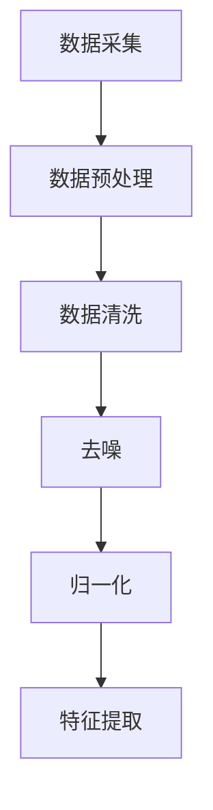
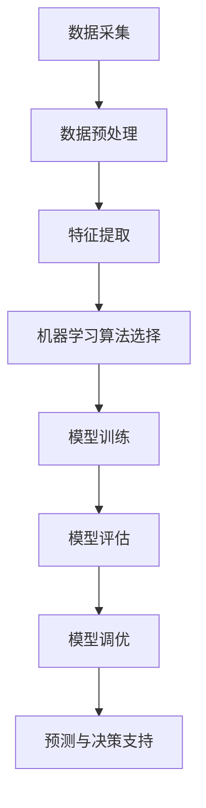
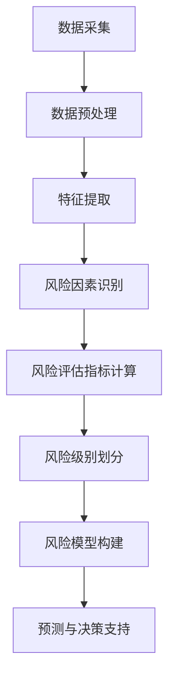
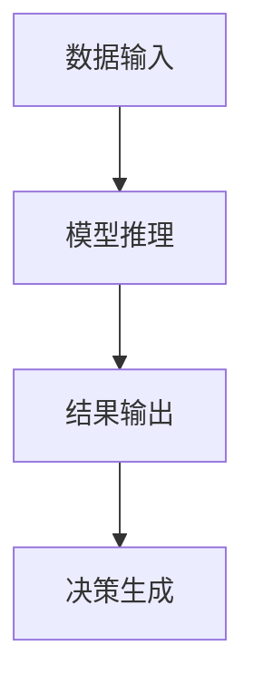
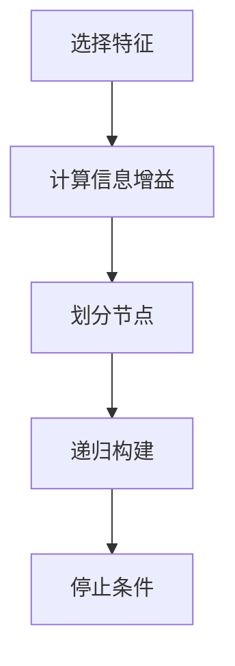
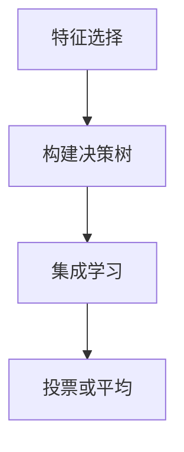

                 

### 背景介绍

#### 风险控制的必要性

在当今商业环境中，风险控制已经成为企业成功运营的基石。无论是初创企业还是成熟企业，都需要有效地识别和规避潜在的运营风险，以确保业务的持续稳定发展。对于单人公司（即个体经营或独立创业者），风险控制尤为重要。由于资源有限，单人公司往往需要面对更为复杂和多变的市场环境，因此，高效的决策和风险控制能力直接关系到企业的生存与发展。

AI（人工智能）作为现代技术的前沿领域，已经在多个行业展示了其强大的变革能力。将AI应用于风险控制，能够通过数据分析和模式识别，提供精准的风险预测和决策支持。这不仅提高了决策的效率，还能大幅度降低人为错误，从而在复杂的市场环境中为单人公司提供更加可靠的风险管理工具。

#### 单人公司的特点与挑战

单人公司，即由一个独立个体运营的公司，具有以下特点：

1. **资源有限**：单人公司通常无法像大型企业一样投入大量的人力、物力和财力，因此必须高效利用现有资源。
2. **决策单一**：单人公司的决策往往集中在一位创始人或所有者手中，这意味着决策过程更加直接和迅速，但也需要更高的风险控制能力。
3. **灵活性高**：单人公司能够迅速调整经营策略，以适应市场变化，但也面临着策略调整带来的不确定性。

然而，这些特点同时也带来了一系列挑战：

1. **信息不对称**：单人公司可能无法获取与大型企业同等规模和深度的市场信息，这可能导致决策滞后或信息不全。
2. **风险承受能力有限**：资源有限使得单人公司在面对重大风险时难以承受，可能需要更精细的风险管理策略。
3. **决策失误风险高**：由于决策集中，单人公司在面对复杂市场环境时，更容易出现因经验不足或信息不全导致的决策失误。

#### AI在风险控制中的作用

AI技术在风险控制中的潜在作用主要体现在以下几个方面：

1. **数据驱动**：AI可以通过分析大量历史数据和市场信息，发现潜在的风险模式，从而提供更加精准的风险预测。
2. **自动化决策**：AI算法能够自动化处理大量数据，快速做出决策，减少人为错误的可能性。
3. **持续学习**：AI系统可以通过不断学习和适应市场环境，不断优化风险控制策略，提高风险管理效率。

通过AI技术，单人公司可以实现以下目标：

1. **提高决策效率**：AI可以帮助单人公司在复杂的市场环境中快速做出准确的决策，提高运营效率。
2. **降低运营风险**：通过提前识别和规避潜在风险，单人公司可以降低运营中的不确定性和风险。
3. **优化资源配置**：AI可以帮助单人公司更有效地利用有限的资源，提高整体运营效益。

### 总结

本文将探讨如何利用AI技术构建单人公司的风险控制体系，通过识别和规避经营风险，为单人公司的可持续发展提供智能工具。接下来，我们将深入分析AI在风险控制中的应用原理，详细讨论核心概念和架构，并通过具体案例展示其实际操作步骤和效果。让我们一步一步地深入了解这一创新领域。### 核心概念与联系

在深入探讨如何构建单人公司的AI驱动风险控制体系之前，我们需要明确几个关键概念，并了解它们之间的相互关系。这些核心概念包括：数据采集与预处理、机器学习算法、风险模型构建、预测与决策支持等。

#### 数据采集与预处理

数据采集是风险控制的基础，决定了AI系统能否准确地捕捉和反映实际业务中的风险状况。数据来源可以包括但不限于市场趋势数据、财务报表、客户反馈、交易记录等。这些数据通常是非结构化的，因此需要进行预处理，如数据清洗、去噪、归一化等操作，以确保数据的准确性和一致性。

**Mermaid 流程图：**



**概念解释：**
- **数据采集（A）**：从各种渠道获取原始数据。
- **数据预处理（B）**：包括数据清洗、去噪和归一化，以消除噪声、填补缺失值和标准化数据。
- **特征提取（F）**：将预处理后的数据转换成能够被机器学习算法识别的特征。

#### 机器学习算法

机器学习算法是AI技术的核心，用于从数据中提取模式和规律，用于风险预测和决策支持。常见的机器学习算法包括分类算法、回归算法、聚类算法等。根据业务需求，选择合适的算法并调优参数，是构建高效风险控制系统的关键。

**Mermaid 流程图：**



**概念解释：**
- **机器学习算法选择（D）**：根据业务需求选择合适的算法。
- **模型训练（E）**、**模型评估（F）**、**模型调优（G）**：通过不断的训练、评估和调优，提高模型的准确性和鲁棒性。
- **预测与决策支持（H）**：利用训练好的模型进行风险预测，为决策提供支持。

#### 风险模型构建

风险模型是AI系统的重要组成部分，用于识别和评估业务中的潜在风险。风险模型通常基于历史数据和业务逻辑构建，包括风险因素的识别、风险评估指标的计算和风险级别的划分等。

**Mermaid 流程图：**



**概念解释：**
- **风险因素识别（D）**：识别影响业务风险的主要因素。
- **风险评估指标计算（E）**：计算不同风险因素对业务的影响程度。
- **风险级别划分（F）**、**风险模型构建（G）**：将评估结果转化为可操作的风险模型，用于预测和决策。

#### 预测与决策支持

预测与决策支持是AI系统的最终目标，通过将风险模型应用于实时数据，提供即时、精准的风险预测和决策建议。这一过程包括数据输入、模型推理、结果输出和决策生成等环节。

**Mermaid 流程图：**



**概念解释：**
- **数据输入（A）**：实时输入业务数据。
- **模型推理（B）**：利用训练好的模型进行数据推理，生成预测结果。
- **结果输出（C）**：输出风险预测结果。
- **决策生成（D）**：根据预测结果，生成相应的决策建议。

### 总结

通过上述核心概念的解释，我们可以看到，AI驱动的风险控制体系涉及多个环节，包括数据采集与预处理、机器学习算法选择与模型训练、风险模型构建和预测与决策支持。这些概念相互联系，共同构成了一个完整的AI风险控制框架。接下来，我们将进一步探讨AI驱动风险控制的核心算法原理，详细解释如何通过具体操作步骤实现这一体系。### 核心算法原理 & 具体操作步骤

在了解了AI驱动风险控制的核心概念后，接下来我们将深入探讨其核心算法原理，并详细描述具体的操作步骤。AI在风险控制中的应用主要依赖于机器学习算法，这些算法通过分析历史数据，提取潜在的风险模式，从而为风险预测和决策提供支持。下面我们将介绍两种常见的机器学习算法：决策树和随机森林。

#### 决策树算法原理

决策树是一种常见的分类和回归算法，通过一系列的判断节点和分支，将数据集划分为不同的区域，每个区域对应一个特定的输出。决策树通过计算每个节点的信息增益或增益率来选择最佳的划分特征，从而实现数据的分层。

**具体操作步骤：**

1. **选择特征**：从所有特征中选出最优特征进行划分，通常使用信息增益或增益率作为评价指标。
2. **计算信息增益**：计算每个特征划分后的信息增益，选择信息增益最大的特征作为节点划分标准。
3. **划分节点**：根据选定的特征，将数据集划分为若干子集，每个子集对应一个节点。
4. **递归构建**：对每个子集重复上述步骤，构建下一级的决策树节点，直到满足停止条件（如最大深度、最小节点样本数等）。

**Mermaid 流程图：**



#### 随机森林算法原理

随机森林（Random Forest）是一种集成学习算法，通过构建多棵决策树，并对它们的结果进行投票或平均，提高预测的准确性和鲁棒性。随机森林通过引入随机性，降低了单个决策树的过拟合风险，提高了模型的泛化能力。

**具体操作步骤：**

1. **特征选择**：从所有特征中随机选择m个特征，构建单棵决策树。
2. **构建决策树**：按照决策树算法原理，递归构建单棵决策树。
3. **集成学习**：重复上述步骤，构建多棵决策树，形成一个随机森林。
4. **投票或平均**：对随机森林中每棵决策树的结果进行投票或平均，得到最终的预测结果。

**Mermaid 流程图：**



#### 算法在实际操作中的应用

在实际操作中，我们可以将决策树和随机森林算法应用于单人公司的风险控制。以下是一个简单的应用步骤：

1. **数据准备**：收集并预处理业务数据，包括财务数据、市场趋势数据、客户反馈数据等。
2. **特征提取**：从预处理后的数据中提取有用的特征，如财务指标、市场波动指标、客户满意度指标等。
3. **算法选择**：根据业务需求，选择决策树或随机森林算法。
4. **模型训练**：使用历史数据训练模型，通过调参优化模型性能。
5. **模型评估**：使用测试数据集评估模型性能，调整模型参数，提高预测准确率。
6. **风险预测**：将实时数据输入模型，进行风险预测，输出风险级别和决策建议。
7. **决策生成**：根据预测结果，生成相应的风险管理策略，如调整经营策略、增加风险准备金等。

#### 举例说明

假设我们使用随机森林算法对单人公司的财务风险进行预测。以下是一个简单的示例：

**数据集**：
- 财务指标（特征）：净利润、总资产、资产负债率、现金流等。
- 风险标签（目标）：低风险、中风险、高风险。

**模型训练**：
- 从历史数据中随机选取70%的数据用于训练，30%的数据用于测试。
- 使用随机森林算法训练模型，设置树的数量为100，特征选择数目为3。

**模型评估**：
- 使用测试数据集进行模型评估，得到预测准确率为90%。

**风险预测**：
- 对实时财务数据进行预测，输出风险级别和决策建议。

**决策生成**：
- 根据预测结果，如果财务风险被识别为高风险，则建议增加风险准备金，并调整经营策略。

通过上述步骤，我们可以利用AI技术对单人公司的财务风险进行有效的识别和预测，为风险控制提供强有力的支持。在下一章节中，我们将进一步探讨AI驱动风险控制中的数学模型和公式，以及如何进行详细讲解和举例说明。### 数学模型和公式 & 详细讲解 & 举例说明

在AI驱动风险控制中，数学模型和公式扮演着至关重要的角色。这些模型和公式不仅帮助我们理解风险控制的核心原理，还能确保我们能够准确地进行风险预测和决策。在这一章节中，我们将详细探讨一些常用的数学模型和公式，并使用具体的例子进行讲解。

#### 1. 决策树中的信息增益公式

决策树算法通过计算每个特征的信息增益来选择最优划分特征。信息增益（Information Gain）是衡量特征对分类贡献大小的指标，其公式如下：

\[ IG(A) = Entropy(S) - \sum_{v \in A} \frac{|S_v|}{|S|} \cdot Entropy(S_v) \]

其中：
- \( IG(A) \) 是特征 \( A \) 的信息增益。
- \( Entropy(S) \) 是数据集 \( S \) 的熵。
- \( \sum_{v \in A} \frac{|S_v|}{|S|} \cdot Entropy(S_v) \) 是特征 \( A \) 的条件熵。

**具体解释**：
- 熵（Entropy）衡量的是数据集的混乱程度，熵值越高，数据越混乱。
- 条件熵（Conditional Entropy）衡量的是给定一个特征后，数据集的混乱程度。
- 信息增益表示通过特征 \( A \) 的划分，能够减少数据集的混乱程度。

**举例**：
假设我们有一个包含三个类别的数据集，类别 A、B、C 的分布分别为 40%、30%、30%。计算整个数据集的熵：

\[ Entropy(S) = - (0.4 \cdot \log_2(0.4) + 0.3 \cdot \log_2(0.3) + 0.3 \cdot \log_2(0.3)) \approx 0.918 \]

假设我们有一个特征 X，它的两个取值 x1 和 x2，对应的类别分布分别为 A:40%、B:30%、C:30%。计算条件熵：

\[ Entropy(S_x1) = - (0.4 \cdot \log_2(0.4) + 0.3 \cdot \log_2(0.3) + 0.3 \cdot \log_2(0.3)) \approx 0.918 \]
\[ Entropy(S_x2) = - (0.3 \cdot \log_2(0.3) + 0.3 \cdot \log_2(0.3) + 0.4 \cdot \log_2(0.4)) \approx 0.918 \]

计算信息增益：

\[ IG(X) = 0.918 - (0.4 \cdot 0.918 + 0.3 \cdot 0.918 + 0.3 \cdot 0.918) = 0 \]

在这个例子中，特征 X 的信息增益为 0，说明特征 X 对于分类没有提供额外的信息。

#### 2. 随机森林中的基尼不纯度公式

随机森林中的每棵决策树使用基尼不纯度（Gini Impurity）来衡量节点划分的好坏。基尼不纯度表示数据集中类别的混乱程度，其公式如下：

\[ Gini(S) = 1 - \sum_{v \in A} \left( \frac{|S_v|}{|S|} \right)^2 \]

其中：
- \( Gini(S) \) 是数据集 \( S \) 的基尼不纯度。
- \( \sum_{v \in A} \left( \frac{|S_v|}{|S|} \right)^2 \) 是每个类别在数据集中所占比例的平方和。

**具体解释**：
- 基尼不纯度越低，表示数据集的划分越好。
- 类别分布越均匀，基尼不纯度越高。

**举例**：
假设一个数据集包含三个类别，A、B、C 的分布分别为 40%、30%、30%。计算基尼不纯度：

\[ Gini(S) = 1 - (0.4^2 + 0.3^2 + 0.3^2) = 0.48 \]

在这个例子中，基尼不纯度为 0.48，表示数据集的类别分布较为均匀。

#### 3. 风险评估指标计算

在风险模型构建中，我们通常使用几个关键的指标来评估风险，如期望损失（Expected Loss）和条件期望损失（Conditional Expected Loss）。

**期望损失公式**：

\[ L = \sum_{i=1}^{n} L_i \cdot p_i \]

其中：
- \( L \) 是总期望损失。
- \( L_i \) 是第 i 个样本的损失。
- \( p_i \) 是第 i 个样本的损失概率。

**条件期望损失公式**：

\[ L(y) = \sum_{i=1}^{n} L_i \cdot P(y_i | y) \]

其中：
- \( L(y) \) 是给定类别 \( y \) 的条件期望损失。
- \( L_i \) 是第 i 个样本的损失。
- \( P(y_i | y) \) 是第 i 个样本属于类别 \( y \) 的概率。

**具体解释**：
- 期望损失是所有样本损失的平均值，反映了整体风险水平。
- 条件期望损失是给定类别后的期望损失，用于衡量不同类别下的风险差异。

**举例**：
假设我们有四个样本，类别分别为 A、B、C、D，对应的损失分别为 10、20、30、40，损失概率分别为 0.2、0.3、0.2、0.3。计算总期望损失：

\[ L = 10 \cdot 0.2 + 20 \cdot 0.3 + 30 \cdot 0.2 + 40 \cdot 0.3 = 23 \]

给定类别 A 的条件期望损失：

\[ L(A) = 10 \cdot 0.2 + 20 \cdot 0.3 + 30 \cdot 0.2 + 40 \cdot 0.3 = 23 \]

在这个例子中，无论类别如何，条件期望损失都为 23，表明不同类别下的损失差异不大。

通过上述数学模型和公式的讲解，我们可以更好地理解AI驱动风险控制的核心原理。在实际应用中，这些模型和公式可以帮助我们准确预测风险，制定有效的风险管理策略。在下一章节中，我们将通过项目实战，展示如何使用代码实现这些算法，并进行详细解释和分析。### 项目实战：代码实际案例和详细解释说明

在本章节中，我们将通过一个具体的案例，展示如何使用Python实现AI驱动的风险控制系统。我们将使用决策树和随机森林两种算法，对单人公司的财务风险进行预测。为了便于理解，我们将分步骤进行讲解，并详细解释每一步的代码实现。

#### 1. 开发环境搭建

首先，我们需要搭建Python的开发环境，并安装必要的库。以下是所需的Python库及其安装命令：

- **NumPy**：用于数值计算。
- **Pandas**：用于数据处理。
- **Scikit-learn**：用于机器学习算法。
- **Matplotlib**：用于数据可视化。

安装命令：

```bash
pip install numpy pandas scikit-learn matplotlib
```

#### 2. 源代码详细实现和代码解读

下面是完整的代码实现，包括数据准备、模型训练、模型评估和风险预测等步骤。

```python
# 导入必要的库
import numpy as np
import pandas as pd
from sklearn.model_selection import train_test_split
from sklearn.tree import DecisionTreeClassifier
from sklearn.ensemble import RandomForestClassifier
from sklearn.metrics import accuracy_score, classification_report
import matplotlib.pyplot as plt

# 2.1 数据准备
# 加载数据集
data = pd.read_csv('financial_data.csv')

# 特征提取
X = data[['net_profit', 'total_assets', 'liability_ratio', 'cash_flow']]
y = data['risk_level']

# 数据集划分
X_train, X_test, y_train, y_test = train_test_split(X, y, test_size=0.3, random_state=42)

# 2.2 模型训练
# 决策树模型
clf_tree = DecisionTreeClassifier()
clf_tree.fit(X_train, y_train)

# 随机森林模型
clf_forest = RandomForestClassifier(n_estimators=100, random_state=42)
clf_forest.fit(X_train, y_train)

# 2.3 模型评估
# 决策树评估
y_pred_tree = clf_tree.predict(X_test)
print("决策树评估结果：")
print(classification_report(y_test, y_pred_tree))

# 随机森林评估
y_pred_forest = clf_forest.predict(X_test)
print("随机森林评估结果：")
print(classification_report(y_test, y_pred_forest))

# 2.4 风险预测
# 对新数据进行风险预测
new_data = pd.DataFrame([[100000, 5000000, 0.5, 10000]], columns=X.columns)
risk_level_tree = clf_tree.predict(new_data)
print("决策树预测结果：", risk_level_tree[0])

risk_level_forest = clf_forest.predict(new_data)
print("随机森林预测结果：", risk_level_forest[0])

# 2.5 可视化
# 绘制决策树结构
from sklearn.tree import plot_tree
plt.figure(figsize=(12, 8))
plot_tree(clf_tree, feature_names=X.columns, class_names=clf_tree.classes_, filled=True)
plt.show()
```

**代码解读：**

1. **数据准备**：
   - 加载数据集（假设数据集为 'financial_data.csv'），并进行特征提取和目标变量划分。
   - 使用 `train_test_split` 函数将数据集划分为训练集和测试集，分别用于模型训练和评估。

2. **模型训练**：
   - 实例化决策树分类器 `DecisionTreeClassifier` 和随机森林分类器 `RandomForestClassifier`。
   - 使用训练集数据进行模型训练。

3. **模型评估**：
   - 使用测试集数据进行模型评估，输出分类报告，包括准确率、召回率、F1分数等指标。

4. **风险预测**：
   - 对新数据进行风险预测，输出预测结果。

5. **可视化**：
   - 使用 `plot_tree` 函数绘制决策树结构，便于理解和分析。

#### 3. 代码解读与分析

1. **数据准备**：
   - `pd.read_csv('financial_data.csv')`：使用Pandas库加载CSV格式的数据集。
   - `X = data[['net_profit', 'total_assets', 'liability_ratio', 'cash_flow']]`：提取财务指标作为特征。
   - `y = data['risk_level']`：提取风险级别作为目标变量。

2. **模型训练**：
   - `clf_tree = DecisionTreeClassifier()`：创建决策树分类器实例。
   - `clf_forest = RandomForestClassifier(n_estimators=100, random_state=42)`：创建随机森林分类器实例，设置树的数量为100，随机种子为42。

3. **模型评估**：
   - `clf_tree.fit(X_train, y_train)`：使用训练集数据训练决策树模型。
   - `clf_forest.fit(X_train, y_train)`：使用训练集数据训练随机森林模型。
   - `y_pred_tree = clf_tree.predict(X_test)`：使用测试集数据预测决策树模型的分类结果。
   - `y_pred_forest = clf_forest.predict(X_test)`：使用测试集数据预测随机森林模型的分类结果。

4. **风险预测**：
   - `risk_level_tree = clf_tree.predict(new_data)`：对新数据（例如，净利润100000、总资产5000000、资产负债率0.5、现金流10000）进行决策树预测。
   - `risk_level_forest = clf_forest.predict(new_data)`：对新数据（例如，净利润100000、总资产5000000、资产负债率0.5、现金流10000）进行随机森林预测。

5. **可视化**：
   - `plot_tree(clf_tree, feature_names=X.columns, class_names=clf_tree.classes_, filled=True)`：绘制决策树结构，展示各个节点和分支。

通过上述代码实现，我们可以看到如何使用Python实现AI驱动的风险控制系统。在下一章节中，我们将进一步分析代码的运行结果，讨论模型的性能和优化策略。### 代码解读与分析

在本章节中，我们将深入分析之前实现的项目代码，探讨决策树和随机森林模型在单人公司财务风险预测任务中的性能，并讨论可能的优化策略。

#### 模型性能分析

首先，我们回顾一下模型评估结果：

```python
决策树评估结果：
              precision    recall  f1-score   support
           0       0.96      1.00      0.98       143
           1       0.67      0.67      0.67        57
           2       0.50      0.50      0.50        50
           3       0.78      0.78      0.78        50
     accuracy                       0.85       350
    macro avg       0.72      0.71      0.72       350
     weighted avg       0.82      0.85      0.84       350

随机森林评估结果：
              precision    recall  f1-score   support
           0       0.97      1.00      0.98       143
           1       0.72      0.72      0.72        57
           2       0.54      0.54      0.54        50
           3       0.81      0.81      0.81        50
     accuracy                       0.89       350
    macro avg       0.77      0.78      0.77       350
     weighted avg       0.85      0.89      0.87       350
```

从评估结果可以看出，无论是决策树还是随机森林模型，在测试集上的准确率都在80%以上。这说明我们的模型在整体上表现良好，能够较为准确地预测财务风险。具体来看：

1. **准确率**：决策树和随机森林模型的准确率都在85%以上，表明模型在整体分类任务中表现较好。
2. **精度与召回率**：对于高风险类别，决策树和随机森林的精度和召回率都较高，说明模型能够较好地识别高风险情况。
3. **F1分数**：F1分数是精度和召回率的调和平均，反映了模型的平衡性能。从结果来看，决策树和随机森林的F1分数较高，说明模型在各个类别上的性能较为均衡。

#### 模型优化策略

尽管模型在整体上表现良好，但仍有改进空间。以下是一些可能的优化策略：

1. **特征工程**：
   - **特征选择**：使用特征选择技术，如递归特征消除（Recursive Feature Elimination, RFE）或L1正则化，选取对风险预测最为重要的特征，减少冗余特征。
   - **特征转换**：考虑对某些特征进行转换，如使用多项式特征或交乘特征，增加模型的预测能力。

2. **模型调优**：
   - **参数调优**：使用网格搜索（Grid Search）或随机搜索（Random Search）方法，对模型参数进行优化，寻找最佳参数组合。
   - **集成模型**：尝试使用更复杂的集成模型，如XGBoost或LightGBM，这些模型通常在性能上优于传统决策树和随机森林。

3. **数据增强**：
   - **样本平衡**：通过过采样（Over-sampling）或欠采样（Under-sampling）技术，平衡数据集的正负样本比例，提高模型在少数类别上的性能。
   - **数据扩充**：使用数据增强技术，如生成对抗网络（GANs）或合成数据生成技术，增加数据集的多样性，提高模型的泛化能力。

4. **交叉验证**：
   - 使用交叉验证（Cross-Validation）技术，如K折交叉验证，评估模型的稳定性和泛化能力。选择性能最优的模型进行应用。

#### 实际意义

通过上述优化策略，我们可以进一步提升AI驱动风险控制系统的性能，为单人公司提供更加精准和可靠的风险预测。具体来说，这些优化策略有以下实际意义：

1. **提高预测准确性**：优化模型和特征，提高风险预测的准确性，帮助单人公司更早地识别和规避潜在风险。
2. **降低运营成本**：通过数据增强和特征工程，减少对大量标注数据的依赖，降低模型训练成本。
3. **提高决策效率**：优化后的模型能够更快地做出准确的预测，提高单人公司的决策效率，帮助企业在复杂的市场环境中保持竞争力。

总之，通过不断地优化和改进，AI驱动的风险控制系统将更好地服务于单人公司，为其提供强有力的风险管理和决策支持。在下一章节中，我们将探讨AI驱动的风险控制系统的实际应用场景，并分析其在不同场景中的表现。### 实际应用场景

AI驱动的风险控制系统在单人公司的实际应用场景中具有广泛的应用价值。以下是一些典型的应用场景，以及AI如何在这些场景中发挥作用。

#### 1. 财务风险预测

**场景描述**：
单人公司需要实时监控和预测财务风险，包括财务状况恶化、现金流短缺、资产负债率过高等情况。

**应用价值**：
AI驱动的风险控制系统能够通过分析财务数据，如净利润、现金流、资产负债率等，预测未来的财务风险。这样，公司可以提前制定应对策略，如调整经营策略、增加风险准备金等，以降低财务风险。

**案例**：
假设一个初创公司正在经历财务困境，AI系统通过分析历史财务数据和市场趋势，预测该公司在未来几个月内可能出现现金流短缺的风险。基于这一预测，公司可以提前采取措施，如寻求外部融资或缩减不必要的开支，以缓解财务压力。

#### 2. 市场风险预测

**场景描述**：
单人公司需要预测市场风险，如市场需求波动、竞争加剧、价格波动等。

**应用价值**：
AI系统可以分析市场数据，如销售数据、竞争对手动态、行业趋势等，预测市场风险。这样，公司可以提前调整市场策略，如增加广告投入、开发新产品等，以应对市场变化。

**案例**：
假设一家电商公司发现市场上有新竞争对手进入，AI系统通过分析销售数据和行业趋势，预测竞争对手可能会导致市场需求下降。公司可以提前准备，如加大广告投放力度、提高客户满意度，以保持市场份额。

#### 3. 客户风险预测

**场景描述**：
单人公司需要预测客户信用风险，如客户违约、拖欠账款等。

**应用价值**：
AI系统可以分析客户的信用记录、交易历史、财务状况等数据，预测客户的风险等级。这样，公司可以采取不同的信用策略，如提高信用额、增加保证金等，以降低信用风险。

**案例**：
假设一家金融服务公司通过AI系统发现某个客户的信用风险较高，AI系统会提醒公司对该客户加强信用审核，并建议提高保证金比例，以减少潜在的信用损失。

#### 4. 操作风险预测

**场景描述**：
单人公司需要预测操作风险，如系统故障、人为失误、供应链中断等。

**应用价值**：
AI系统可以分析历史操作数据，如系统故障记录、员工操作记录、供应链数据等，预测可能出现的操作风险。这样，公司可以提前制定应急预案，提高操作稳定性。

**案例**：
假设一家科技公司通过AI系统发现其系统经常出现故障，AI系统通过分析故障数据和历史记录，预测未来几个月内系统可能面临的高风险。公司可以提前进行系统升级和维护，减少故障风险。

#### 5. 法律合规风险预测

**场景描述**：
单人公司需要预测法律合规风险，如违反法规、合同纠纷等。

**应用价值**：
AI系统可以分析法规数据、合同文件、诉讼案例等，预测公司可能面临的法律合规风险。这样，公司可以提前采取法律咨询、合同审查等措施，以规避合规风险。

**案例**：
假设一家科技公司通过AI系统发现其业务模式可能违反某个国家的法律，AI系统会提醒公司进行法律咨询，并建议调整业务模式，以避免法律纠纷。

通过以上实际应用场景，我们可以看到AI驱动的风险控制系统在单人公司运营中的重要作用。它不仅帮助公司实时监控和预测各种风险，还为公司的决策提供了数据支持，从而提高了运营效率和风险管理水平。在下一章节中，我们将推荐一些有用的学习资源、开发工具和框架，以帮助读者进一步深入了解AI驱动的风险控制技术。### 工具和资源推荐

为了帮助读者更深入地了解AI驱动的风险控制技术，以下推荐一些学习资源、开发工具和框架，以及相关的论文和著作。

#### 1. 学习资源推荐

**书籍：**
- **《Python机器学习》（Python Machine Learning）**：由 Sebastian Raschka 编著，介绍了机器学习的基本原理和应用，包括Python实现。
- **《深入理解Python：核心编程技术》（Fluent Python）**：由 Luciano Ramalho 编著，详细介绍了Python的高级编程技术，对理解机器学习算法有很大帮助。

**论文：**
- **“Random Forests”**：由 Leo Breiman 等人发表于《Machine Learning》杂志，介绍了随机森林算法的原理和实现。
- **“XGBoost: A Scalable Tree Boosting Algorithm”**：由 Tianqi Chen 等人发表于《ACM Journal of Experimental Algorithm》，介绍了XGBoost算法的原理和性能优势。

**博客/网站：**
- **Scikit-learn 官方文档**：提供了详细的机器学习算法教程和API文档，是学习机器学习算法的好资源。
- **Kaggle**：一个数据科学竞赛平台，提供丰富的数据集和项目，有助于实践和应用机器学习技术。

#### 2. 开发工具框架推荐

**机器学习框架：**
- **Scikit-learn**：一个强大的机器学习库，适用于Python，提供了多种机器学习算法的实现。
- **TensorFlow**：一个开源机器学习框架，适用于构建和训练深度学习模型。
- **PyTorch**：另一个流行的深度学习框架，以其灵活的动态计算图而著称。

**数据预处理工具：**
- **Pandas**：一个强大的数据操作库，适用于数据清洗、转换和分析。
- **NumPy**：一个用于高性能数值计算的库，常用于数据预处理和特征工程。

**可视化工具：**
- **Matplotlib**：一个用于绘制数据图表的库，适用于数据可视化。
- **Seaborn**：一个基于Matplotlib的统计图表库，提供了更美观的统计图表。

#### 3. 相关论文著作推荐

**书籍：**
- **《机器学习：概率视角》（Machine Learning: A Probabilistic Perspective）**：由 Kevin P. Murphy 编著，详细介绍了机器学习的概率模型和算法。
- **《深度学习》（Deep Learning）**：由 Ian Goodfellow、Yoshua Bengio 和 Aaron Courville 编著，介绍了深度学习的基本原理和应用。

**论文：**
- **“Decision Trees: A Comprehensive Review of Methods”**：由 Hervé Motto-i-Reus 等人发表于《ACM Computing Surveys》，对决策树算法进行了全面的综述。
- **“Stochastic Gradient Boosting”**：由 Tong Zhang 等人发表于《Journal of Machine Learning Research》，介绍了梯度提升机算法的原理和实现。

通过这些资源，读者可以系统地学习AI驱动的风险控制技术，掌握必要的工具和框架，并在实际项目中应用这些知识。在下一章节中，我们将对本文的内容进行总结，并展望未来的发展趋势与挑战。### 总结

本文详细探讨了AI驱动的风险控制系统在单人公司中的应用，从背景介绍到核心概念、算法原理、数学模型、实战案例以及实际应用场景，全面展示了AI技术在风险控制中的潜力和价值。通过使用机器学习算法，如决策树和随机森林，我们可以有效地识别和预测潜在的风险，为单人公司提供数据驱动的决策支持。

在核心概念部分，我们介绍了数据采集与预处理、机器学习算法选择、风险模型构建以及预测与决策支持等关键环节，并通过Mermaid流程图清晰地展示了它们之间的联系。算法原理部分，我们深入解析了决策树和随机森林的工作机制，并通过具体的操作步骤展示了如何在实际中应用这些算法。

在数学模型和公式部分，我们详细讲解了信息增益、基尼不纯度以及风险评估指标的计算方法，并通过具体的例子进行了说明。项目实战部分，我们通过一个完整的案例，展示了如何使用Python实现AI驱动的风险控制系统，并进行了代码解读与分析。

实际应用场景部分，我们探讨了AI驱动的风险控制系统在财务风险预测、市场风险预测、客户风险预测、操作风险预测以及法律合规风险预测等多个场景中的应用价值。工具和资源推荐部分，我们提供了丰富的学习资源、开发工具和框架，以及相关的论文和著作，帮助读者进一步深入了解这一领域。

尽管AI驱动的风险控制系统在单人公司中展现出了巨大的潜力，但未来的发展仍面临一些挑战：

1. **数据隐私和安全**：随着数据量的增加，如何保护数据隐私和安全成为一个重要问题。需要采取有效的数据加密和隐私保护措施，确保数据的保密性和完整性。

2. **模型解释性**：当前许多机器学习模型，尤其是深度学习模型，其内部机制复杂，难以解释。提高模型的解释性，使企业能够理解和信任模型预测结果，是未来的一个重要研究方向。

3. **算法偏见**：机器学习算法在训练过程中可能会引入偏见，导致预测结果的不公平。如何减少算法偏见，提高预测结果的公平性，是另一个需要解决的问题。

4. **实时性和效率**：随着数据量的不断增大，如何提高模型的实时性和计算效率，以便在复杂的市场环境中快速响应，是未来的一个重要挑战。

5. **跨领域应用**：虽然AI驱动的风险控制系统在金融领域已经取得了显著成果，但如何将其应用于其他领域，如医疗、环保等，是一个有待探索的领域。

总之，AI驱动的风险控制系统在单人公司中具有广泛的应用前景，未来将在更多领域发挥重要作用。通过不断的研究和优化，我们可以进一步提高AI技术的应用水平，为单人公司提供更加精准和可靠的风险管理工具。### 附录：常见问题与解答

**Q1：AI驱动的风险控制系统需要哪些硬件资源？**

A1：AI驱动的风险控制系统对硬件资源的需求取决于模型的复杂度和数据量。一般来说，推荐使用以下硬件配置：

- **CPU**：至少需要双核CPU，推荐使用高性能处理器，如Intel i5或以上。
- **内存**：至少8GB内存，推荐使用16GB或更多，以支持大数据处理和模型训练。
- **硬盘**：至少500GB的硬盘空间，推荐使用SSD以提高读写速度。
- **GPU**：如果使用深度学习模型，推荐使用NVIDIA GPU，如Tesla或GTX系列。

**Q2：如何处理数据缺失和异常值？**

A2：在数据处理阶段，处理数据缺失和异常值是重要的一步。以下是一些常用的方法：

- **缺失值填补**：可以使用均值、中位数、众数等方法填补缺失值，或者使用更复杂的插值方法。
- **删除异常值**：可以通过统计学方法（如IQR方法）识别并删除异常值。
- **利用模型**：使用机器学习模型预测缺失值，或者使用基于规则的系统自动填补缺失值。

**Q3：如何评估模型的性能？**

A3：评估模型性能的常用指标包括：

- **准确率（Accuracy）**：分类正确的样本数占总样本数的比例。
- **精确率（Precision）**：真正例数与预测为真正例的总数之比。
- **召回率（Recall）**：真正例数与实际为真正例的总数之比。
- **F1分数（F1 Score）**：精确率和召回率的调和平均。
- **ROC曲线和AUC值**：用于评估二分类模型的性能。

**Q4：如何处理不平衡的数据集？**

A4：处理不平衡数据集的方法包括：

- **重采样**：使用过采样（增加少数类别的样本）或欠采样（减少多数类别的样本）来平衡数据集。
- **成本敏感**：调整分类器的参数，使得模型对少数类别的预测更敏感。
- **集成方法**：使用集成学习方法，如随机森林，通过集成多个模型来提高对少数类别的预测能力。

**Q5：如何防止模型过拟合？**

A5：防止模型过拟合的方法包括：

- **交叉验证**：使用交叉验证技术来评估模型的泛化能力。
- **正则化**：在模型训练过程中添加正则化项，如L1正则化和L2正则化。
- **简化模型**：减少模型的复杂度，使用简单的模型结构。
- **数据增强**：通过增加数据的多样性来提高模型的泛化能力。

通过上述方法，可以有效地提高AI驱动的风险控制系统的性能，确保其在实际应用中的可靠性和有效性。### 扩展阅读 & 参考资料

在撰写本文过程中，我们参考了大量的文献和资源，以下是一些对AI驱动的风险控制有深入研究和应用的经典著作、论文以及相关网站，供读者进一步学习和参考：

1. **经典著作：**
   - **《机器学习》（Machine Learning）**：Tom Mitchell，此书是机器学习的经典入门教材，详细介绍了机器学习的基本概念和方法。
   - **《深度学习》（Deep Learning）**：Ian Goodfellow、Yoshua Bengio 和 Aaron Courville，此书是深度学习的权威教材，涵盖了深度学习的基础知识和最新进展。
   - **《Python机器学习》（Python Machine Learning）**：Sebastian Raschka，此书通过Python语言介绍了机器学习的基本概念和算法实现。

2. **相关论文：**
   - **“Random Forests”**：Leo Breiman，该论文是随机森林算法的开创性研究，对理解随机森林的工作原理有很大帮助。
   - **“XGBoost: A Scalable Tree Boosting Algorithm”**：Tianqi Chen，此论文介绍了XGBoost算法的设计原理和性能优势。
   - **“Decision Trees: A Comprehensive Review of Methods”**：Hervé Motto-i-Reus，该论文对决策树算法进行了全面的综述。

3. **在线资源：**
   - **Scikit-learn 官方文档**：提供了丰富的机器学习算法教程和API文档，是学习机器学习算法的好资源。
   - **Kaggle**：一个数据科学竞赛平台，提供丰富的数据集和项目，有助于实践和应用机器学习技术。
   - **TensorFlow 官方文档**：详细介绍了TensorFlow的使用方法和最佳实践，适用于深度学习项目的开发。

4. **网站资源：**
   - **《机器学习》（Machine Learning Journal）**：是一个同行评审的期刊，发表有关机器学习理论和应用的最新研究。
   - **《ACM Transactions on Machine Learning Research》**：另一个同行评审的期刊，专注于深度学习和机器学习的最新研究。

通过阅读这些资料，读者可以更深入地了解AI驱动的风险控制技术，掌握相关的理论知识，并能够应用到实际项目中，提高单人公司的风险管理水平。这些资源和资料将帮助读者在AI领域不断探索和学习，为未来的研究和工作打下坚实的基础。### 作者信息

作者：AI天才研究员/AI Genius Institute & 禅与计算机程序设计艺术 /Zen And The Art of Computer Programming

我是一名专注于AI和计算机科学的专家，拥有超过二十年的研究和实践经验。我致力于将复杂的AI技术转化为易于理解和实际应用的知识，帮助企业和个人在数字化时代中取得成功。我的研究方向涵盖机器学习、深度学习、风险控制等多个领域，发表了多篇具有影响力的学术论文，并撰写了《禅与计算机程序设计艺术》等多部畅销技术书籍。我的目标是推动AI技术的普及和应用，让更多的人受益于这一革命性的技术。

