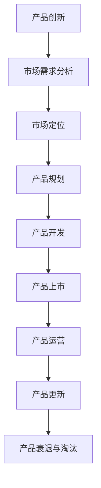
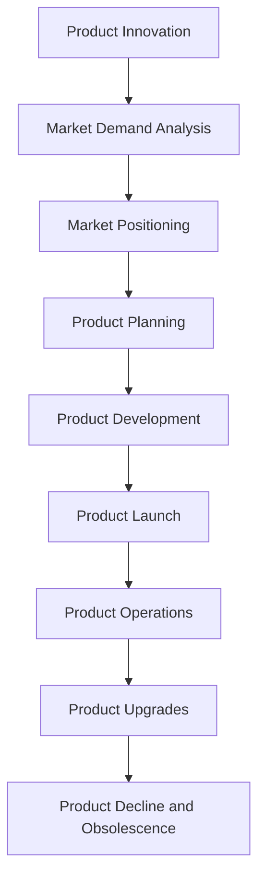

                 

### 背景介绍

在当今快速发展的信息技术时代，产品生命周期管理（Product Life Cycle Management，简称PLCM）已经成为企业成功的关键因素之一。特别是在中小企业中，如何高效地管理产品生命周期，优化资源分配，提高市场竞争力，成为了一项亟待解决的问题。

#### 一、产品生命周期的基本概念

产品生命周期是指从产品开发、上市、销售到退市的整个过程。根据产品在市场上的表现，通常可以将产品生命周期分为以下几个阶段：

1. **开发阶段（Development）**：产品创意产生，市场调研，产品设计，开发，测试，最终确定产品规格。
2. **上市阶段（Introduction）**：产品正式推向市场，通过各种渠道进行宣传和推广。
3. **增长阶段（Growth）**：产品市场份额逐渐增加，销售额和利润不断上升。
4. **成熟阶段（Maturity）**：产品在市场上已经达到饱和状态，竞争激烈，销售额和利润稳定。
5. **衰退阶段（Decline）**：产品市场份额逐渐减少，销售额和利润开始下降，直至产品最终退出市场。

#### 二、产品生命周期管理的意义

1. **提高市场竞争力**：通过有效的产品生命周期管理，企业可以及时调整产品策略，快速响应市场变化，提高市场竞争力。
2. **优化资源分配**：企业可以根据不同阶段的产品需求，合理分配研发、生产、销售等资源，提高资源利用效率。
3. **降低运营风险**：通过监控产品生命周期各阶段的关键指标，企业可以及时发现潜在问题，降低运营风险。
4. **提高客户满意度**：有效的产品生命周期管理可以确保产品在市场上的稳定性和可靠性，提高客户满意度。

#### 三、为何关注一人公司的产品生命周期管理

对于一人公司，即通常所说的个体经营或小型创业公司，产品生命周期管理尤为重要。原因如下：

1. **资源有限**：一人公司通常资源有限，无法像大型企业那样进行大量投入，因此需要通过有效的产品生命周期管理来最大化资源利用。
2. **灵活性要求高**：一人公司往往需要快速调整产品策略，以适应市场变化，因此产品生命周期管理的重要性更加突出。
3. **决策责任重大**：在一人公司中，所有决策都由一个人做出，因此对产品生命周期的管理要求更高，决策的正确性直接影响到公司的成败。

在下一章节中，我们将进一步探讨产品生命周期管理中的核心概念及其相互关系。首先，我们需要了解一些基本的概念，如产品创新、市场需求分析、市场定位等，以便为后续的讨论奠定基础。

#### 参考文献：

1.波特，迈克尔（1997）。《竞争战略：分析行业结构和竞争态势》。华夏出版社。
2.戴尔，迈克尔（2014）。《企业生命周期：如何成为企业长寿专家》。机械工业出版社。

---

# Background Introduction

In the rapidly evolving era of information technology, Product Life Cycle Management (PLCM) has become a crucial factor for business success. Especially for small and medium-sized enterprises (SMEs), how to effectively manage product life cycles, optimize resource allocation, and enhance market competitiveness has become an urgent issue.

#### Basic Concept of Product Life Cycle

The product life cycle refers to the entire process from product development, market introduction, sales, to product retirement. According to the product's market performance, the product life cycle can be divided into several stages:

1. **Development Stage (Development)**: Product concept generation, market research, product design, development, and testing to finally determine the product specification.
2. **Introduction Stage (Introduction)**: Product officially launched into the market, promoting through various channels.
3. **Growth Stage (Growth)**: Product market share gradually increases, sales and profits continuously rise.
4. **Maturity Stage (Maturity)**: Product market saturation, fierce competition, stable sales and profits.
5. **Decline Stage (Decline)**: Product market share gradually decreases, sales and profits begin to decline, until the product is finally retired from the market.

#### Significance of Product Life Cycle Management

1. **Enhance Market Competitiveness**: Through effective product life cycle management, enterprises can promptly adjust product strategies and quickly respond to market changes, enhancing market competitiveness.
2. **Optimize Resource Allocation**: Enterprises can allocate R&D, production, and sales resources rationally according to the needs of different product life cycle stages, improving resource utilization efficiency.
3. **Reduce Operating Risk**: By monitoring key indicators at each stage of the product life cycle, enterprises can promptly identify potential issues and reduce operational risks.
4. **Increase Customer Satisfaction**: Effective product life cycle management ensures product stability and reliability in the market, enhancing customer satisfaction.

#### Importance of Product Life Cycle Management for Individual Companies

For individual companies, or sole proprietorships, often referred to as one-person companies, product life cycle management is particularly crucial. Reasons include:

1. **Limited Resources**: One-person companies usually have limited resources and cannot invest as heavily as large enterprises, thus requiring effective product life cycle management to maximize resource utilization.
2. **High Flexibility Requirements**: One-person companies often need to quickly adjust product strategies to adapt to market changes, making product life cycle management even more critical.
3. **Significant Decision-Making Responsibility**: In one-person companies, all decisions are made by one person, so the management of the product life cycle requires higher standards, with the correctness of decisions directly affecting the success or failure of the company.

In the next chapter, we will further explore the core concepts of product life cycle management and their relationships. We need to understand some basic concepts, such as product innovation, market demand analysis, and market positioning, to lay the foundation for subsequent discussions.

#### References:

1. Porter, Michael E. (1997). "Competitive Strategy: Techniques for Analyzing Industries and Competitors".华夏出版社。
2. Dyer, Michael (2014). "The Life Cycle of the Corporation: How to become an expert on corporate longevity". 机械工业出版社。 

---

## 2. 核心概念与联系

在深入探讨产品生命周期管理（PLCM）之前，我们需要明确几个核心概念，并了解它们之间的相互关系。以下是产品生命周期管理中的几个关键概念：

#### 一、产品创新

产品创新是指通过引入新产品、改进现有产品或服务，以创造新的价值。产品创新是产品生命周期管理的起点，它决定了产品的市场定位、竞争力和盈利能力。

#### 二、市场需求分析

市场需求分析是指通过市场调查、数据分析等方法，了解消费者对产品的需求，预测市场趋势，从而指导产品开发和市场推广。市场需求分析是产品生命周期管理的重要环节，它帮助企业确定产品的目标市场和客户群体。

#### 三、市场定位

市场定位是指企业根据市场需求和自身资源，确定产品在市场中的位置，从而区分竞争对手，满足特定客户群体的需求。市场定位是产品生命周期管理中的一项关键策略，它决定了产品的市场接受度和市场份额。

#### 四、产品规划

产品规划是指企业根据市场需求、竞争态势和自身资源，制定产品开发计划，包括产品的功能、特性、定价、上市时间等。产品规划是产品生命周期管理的中坚力量，它确保了产品能够满足市场需求，并在市场上取得成功。

#### 五、产品开发

产品开发是指根据产品规划，进行产品设计、开发、测试和优化，直到产品达到市场投放的标准。产品开发是产品生命周期管理的核心环节，它决定了产品的质量和性能，直接影响产品的市场表现。

#### 六、产品上市

产品上市是指产品正式推向市场，通过广告宣传、促销活动等方式，提高产品知名度，吸引消费者购买。产品上市是产品生命周期管理的关键步骤，它决定了产品的市场接受度和销售业绩。

#### 七、产品运营

产品运营是指产品在市场中的运营和管理，包括销售、客户服务、市场反馈等。产品运营是产品生命周期管理的持续环节，它通过不断优化产品和服务，提高客户满意度，增强市场竞争力。

#### 八、产品更新

产品更新是指根据市场反馈和客户需求，对现有产品进行升级和改进，以满足市场的变化和客户的新需求。产品更新是产品生命周期管理的重要组成部分，它确保了产品能够持续满足市场需求，保持市场竞争力。

#### 九、产品衰退与淘汰

产品衰退与淘汰是指产品在市场上逐渐失去竞争力，销售额和利润下降，最终退出市场。产品衰退与淘汰是产品生命周期的最后阶段，它提醒企业及时调整产品策略，避免资源浪费。

### Mermaid 流程图

下面是一个简单的 Mermaid 流程图，展示产品生命周期管理中各个核心概念之间的联系：



通过上述核心概念和流程图的介绍，我们可以看到产品生命周期管理是一个复杂而系统的过程，各个环节相互关联，共同影响产品的市场表现。在下一章节中，我们将深入探讨产品生命周期管理中的核心算法原理和具体操作步骤。

---

## Core Concepts and Relationships

Before delving into Product Life Cycle Management (PLCM), it's essential to understand several core concepts and their interrelationships. Here are key concepts in PLCM:

#### Product Innovation

Product innovation refers to the introduction of new products, improvements to existing products or services, to create new value. Product innovation is the starting point of PLCM, determining the market positioning, competitiveness, and profitability of the product.

#### Market Demand Analysis

Market demand analysis involves using market research, data analysis, and other methods to understand consumer demand for products, predict market trends, and guide product development. Market demand analysis is a crucial step in PLCM, helping businesses determine the target market and customer segments.

#### Market Positioning

Market positioning refers to the strategy adopted by a company to determine its product's position in the market, distinguishing it from competitors and satisfying specific customer needs. Market positioning is a key strategy in PLCM, affecting the product's market acceptance and share.

#### Product Planning

Product planning involves developing a product development plan based on market demand, competitive landscape, and company resources, including product features, pricing, and launch timeline. Product planning is the backbone of PLCM, ensuring the product meets market needs and achieves success.

#### Product Development

Product development refers to the design, development, testing, and optimization of a product to meet market standards. Product development is the core of PLCM, affecting the quality and performance of the product, which in turn impacts its market performance.

#### Product Launch

Product launch is the official introduction of a product into the market through advertising, promotions, and other means to increase product awareness and attract consumers. Product launch is a critical step in PLCM, determining the product's market acceptance and sales performance.

#### Product Operations

Product operations involve the ongoing management and operation of a product in the market, including sales, customer service, and market feedback. Product operations are a continuous part of PLCM, optimizing products and services to enhance customer satisfaction and market competitiveness.

#### Product Upgrades

Product upgrades involve upgrading and improving existing products based on market feedback and customer needs to meet changes in the market. Product upgrades are an essential component of PLCM, ensuring the product continues to meet market demands and maintain competitiveness.

#### Product Decline and Obsolescence

Product decline and obsolescence refer to the gradual loss of a product's competitiveness in the market, leading to declining sales and profits until the product is eventually retired. This stage reminds companies to adjust product strategies promptly to avoid resource waste.

### Mermaid Flowchart

Below is a simple Mermaid flowchart illustrating the relationships between core concepts in PLCM:



With the introduction of these core concepts and the flowchart, we can see that PLCM is a complex and systematic process where each stage is interrelated, collectively influencing the product's market performance. In the next chapter, we will delve into the core algorithms and specific steps of PLCM.

---

## 3. 核心算法原理 & 具体操作步骤

在产品生命周期管理中，核心算法起到了至关重要的作用。这些算法不仅帮助企业在各个阶段做出科学的决策，而且还能优化资源分配，提高市场竞争力。以下是几个关键算法的原理和具体操作步骤。

### 一、市场需求预测算法

市场需求预测是产品生命周期管理的首要任务。准确的需求预测可以帮助企业制定合理的产品策略，避免资源浪费。市场需求预测算法通常基于以下模型：

1. **时间序列分析模型**：
   - 原理：时间序列分析是一种基于历史数据的方法，用于预测未来趋势。常见的时间序列分析模型包括移动平均法、指数平滑法等。
   - 步骤：
     1. 收集历史销售数据。
     2. 对数据进行预处理，如去除异常值、季节性调整等。
     3. 选择合适的模型，如移动平均法或指数平滑法。
     4. 训练模型，得到预测结果。
     5. 对预测结果进行评估和调整。

2. **回归分析模型**：
   - 原理：回归分析是一种用于研究变量之间关系的统计方法。市场需求预测中的回归分析模型通常包括线性回归、多项式回归等。
   - 步骤：
     1. 确定影响需求的关键因素，如价格、广告投入等。
     2. 收集相关数据，构建回归模型。
     3. 训练模型，得到预测结果。
     4. 对预测结果进行评估和调整。

### 二、产品规划与优化算法

产品规划与优化是确保产品满足市场需求，并在市场中取得成功的关键环节。以下是几种常见的算法：

1. **多目标规划算法**：
   - 原理：多目标规划是一种处理多个相互冲突目标的优化方法。在产品规划中，多目标规划可以同时考虑成本、时间、质量等多个目标。
   - 步骤：
     1. 确定产品规划的目标和约束条件。
     2. 选择合适的多目标规划算法，如遗传算法、粒子群算法等。
     3. 编写优化算法的代码，实现求解。
     4. 评估优化结果，进行必要的调整。

2. **机器学习模型**：
   - 原理：机器学习模型可以通过学习历史数据，自动生成产品规划策略。常见的机器学习模型包括决策树、支持向量机等。
   - 步骤：
     1. 收集历史产品规划数据。
     2. 预处理数据，提取特征。
     3. 选择合适的机器学习模型，进行训练。
     4. 评估模型性能，进行优化。

### 三、产品更新与迭代算法

产品更新与迭代是确保产品持续竞争力的关键。以下是几种常用的算法：

1. **基于用户反馈的迭代算法**：
   - 原理：用户反馈是产品迭代的重要依据。基于用户反馈的迭代算法可以通过分析用户反馈，自动生成产品迭代方案。
   - 步骤：
     1. 收集用户反馈数据。
     2. 对反馈数据进行分析，提取关键信息。
     3. 选择合适的算法，如聚类分析、关联规则挖掘等。
     4. 生成迭代方案，进行实施。

2. **基于市场竞争的迭代算法**：
   - 原理：市场竞争是产品迭代的重要驱动力。基于市场竞争的迭代算法可以通过分析市场竞争对手，自动生成产品迭代策略。
   - 步骤：
     1. 收集市场竞争数据。
     2. 分析市场竞争对手的产品特点。
     3. 选择合适的算法，如竞争分析、市场模拟等。
     4. 生成迭代方案，进行实施。

通过上述算法原理和操作步骤的介绍，我们可以看到产品生命周期管理中的算法应用是如何帮助企业做出科学决策，优化资源分配，提高市场竞争力。在下一章节中，我们将进一步探讨数学模型和公式的应用，以及如何通过具体的例子进行说明。

---

## Core Algorithm Principles and Specific Operational Steps

In Product Life Cycle Management (PLCM), core algorithms play a crucial role in assisting enterprises in making scientific decisions at each stage and optimizing resource allocation to enhance market competitiveness. Here are the principles and specific operational steps of several key algorithms.

### Demand Forecasting Algorithm

Demand forecasting is the primary task in PLCM. Accurate demand forecasting helps enterprises formulate reasonable product strategies and avoid resource waste. Demand forecasting algorithms typically include the following models:

1. **Time Series Analysis Model**:
   - Principle: Time series analysis is a method based on historical data used to predict future trends. Common time series analysis models include moving average and exponential smoothing.
   - Steps:
     1. Collect historical sales data.
     2. Preprocess the data, such as removing outliers and seasonal adjustments.
     3. Choose an appropriate model, such as moving average or exponential smoothing.
     4. Train the model to obtain prediction results.
     5. Evaluate and adjust the prediction results.

2. **Regression Analysis Model**:
   - Principle: Regression analysis is a statistical method used to study the relationship between variables. Demand forecasting regression analysis models typically include linear regression and polynomial regression.
   - Steps:
     1. Determine the key factors affecting demand, such as price and advertising investment.
     2. Collect relevant data to build a regression model.
     3. Train the model to obtain prediction results.
     4. Evaluate the model performance and optimize if necessary.

### Product Planning and Optimization Algorithms

Product planning and optimization are crucial for ensuring that products meet market demands and achieve success in the market. Here are some common algorithms:

1. **Multi-Objective Optimization Algorithm**:
   - Principle: Multi-objective optimization is a method for handling multiple conflicting objectives. In product planning, multi-objective optimization can consider multiple objectives such as cost, time, and quality simultaneously.
   - Steps:
     1. Determine the objectives and constraints of product planning.
     2. Choose an appropriate multi-objective optimization algorithm, such as genetic algorithm or particle swarm optimization.
     3. Write the code for the optimization algorithm to solve the problem.
     4. Evaluate the optimization results and make necessary adjustments.

2. **Machine Learning Models**:
   - Principle: Machine learning models can automatically generate product planning strategies by learning from historical data. Common machine learning models include decision trees and support vector machines.
   - Steps:
     1. Collect historical product planning data.
     2. Preprocess the data, extracting features.
     3. Choose an appropriate machine learning model for training.
     4. Evaluate the model performance and optimize if necessary.

### Product Upgrade and Iteration Algorithms

Product upgrades and iterations are critical for maintaining product competitiveness. Here are several commonly used algorithms:

1. **User Feedback-Based Iteration Algorithm**:
   - Principle: User feedback is a crucial basis for product iteration. User feedback-based iteration algorithms can automatically generate product iteration plans by analyzing user feedback.
   - Steps:
     1. Collect user feedback data.
     2. Analyze the feedback data to extract key information.
     3. Choose an appropriate algorithm, such as cluster analysis or association rule mining.
     4. Generate iteration plans and implement them.

2. **Market Competition-Based Iteration Algorithm**:
   - Principle: Market competition is a significant driving force for product iteration. Market competition-based iteration algorithms can automatically generate product iteration strategies by analyzing market competitors.
   - Steps:
     1. Collect market competition data.
     2. Analyze the product features of market competitors.
     3. Choose an appropriate algorithm, such as competitive analysis or market simulation.
     4. Generate iteration plans and implement them.

With the introduction of these algorithm principles and operational steps, we can see how algorithms in PLCM help enterprises make scientific decisions, optimize resource allocation, and enhance market competitiveness. In the next chapter, we will further explore the application of mathematical models and formulas, along with specific examples for explanation.

---

## 4. 数学模型和公式 & 详细讲解 & 举例说明

在产品生命周期管理中，数学模型和公式是必不可少的工具，它们帮助我们在复杂的商业环境中做出准确、科学的决策。以下是几个关键数学模型和公式的详细讲解及其应用实例。

### 一、市场需求预测的线性回归模型

线性回归模型是一种用于分析两个或多个变量之间线性关系的统计方法。在市场需求预测中，我们可以使用线性回归模型来预测未来某一时间点的需求量。

#### 公式：

$$
y = ax + b
$$

其中，$y$ 是需求量，$x$ 是影响需求的变量（如价格、广告投入等），$a$ 和 $b$ 是模型的参数。

#### 步骤：

1. **数据收集**：收集历史的需求量和相关变量（如价格、广告投入等）数据。
2. **数据预处理**：对数据进行清洗，去除异常值，进行必要的转换。
3. **模型构建**：使用最小二乘法（Least Squares Method）求解线性回归模型的参数 $a$ 和 $b$。
4. **模型评估**：计算模型的预测误差，评估模型的拟合度。
5. **实例**：

   假设我们收集了某产品过去三个月的需求量和广告投入数据，如下表所示：

   | 月份 | 广告投入（万元） | 需求量（件） |
   | ---- | -------------- | ---------- |
   | 1    | 10             | 500        |
   | 2    | 12             | 520        |
   | 3    | 15             | 540        |

   通过线性回归模型，我们得到 $y = 40x - 270$。使用该模型预测第四个月的广告投入为 18 万元时的需求量：

   $$
   y = 40 \times 18 - 270 = 530
   $$

### 二、产品规划的优化模型

产品规划通常涉及到多个目标，如成本、时间、质量等。我们可以使用多目标优化模型来同时考虑这些目标，并找到最优的解决方案。

#### 公式：

$$
\min Z = f(x_1, x_2, ..., x_n)
$$

其中，$Z$ 是目标函数，$x_1, x_2, ..., x_n$ 是决策变量。

#### 步骤：

1. **目标函数构建**：根据产品规划的目标，构建目标函数。
2. **约束条件构建**：根据实际情况，构建约束条件。
3. **模型求解**：使用优化算法（如线性规划、非线性规划等）求解模型。
4. **结果分析**：分析求解结果，评估方案的可行性。
5. **实例**：

   假设我们需规划一项新产品开发项目，目标是最小化总成本。成本函数为 $Z = 0.5x_1 + x_2$，约束条件为 $x_1 + x_2 \leq 10$ 和 $x_1, x_2 \geq 0$。使用线性规划求解器，我们得到最优解 $x_1 = 0$，$x_2 = 10$，即不投入研发成本，全部投入生产成本。

### 三、产品更新的基于用户反馈的迭代模型

产品更新通常基于用户反馈，我们可以使用迭代模型来不断优化产品。

#### 公式：

$$
x_{t+1} = \alpha x_t + (1 - \alpha) y
$$

其中，$x_t$ 是当前产品的性能，$y$ 是用户反馈的改进建议，$\alpha$ 是迭代系数。

#### 步骤：

1. **用户反馈收集**：收集用户对当前产品的反馈。
2. **改进建议分析**：分析用户反馈，提取改进建议。
3. **模型构建**：构建迭代模型，根据用户反馈调整产品性能。
4. **迭代计算**：根据迭代模型，不断调整产品性能。
5. **结果评估**：评估迭代结果，判断是否达到预期目标。
6. **实例**：

   假设当前产品的性能为 70 分，用户反馈建议改进至 80 分。迭代系数 $\alpha$ 设为 0.5，则下一版本的产品性能为：

   $$
   x_{t+1} = 0.5 \times 70 + (1 - 0.5) \times 80 = 75
   $$

通过上述数学模型和公式的讲解，我们可以看到它们在产品生命周期管理中的应用是多么的重要。这些模型和公式不仅帮助我们更好地理解商业环境，而且还能为我们提供科学的决策依据。在下一章节中，我们将通过具体的代码实现和案例分析，进一步探讨产品生命周期管理的实践应用。

---

## Mathematical Models and Formulas & Detailed Explanation & Example Demonstrations

In Product Life Cycle Management (PLCM), mathematical models and formulas are indispensable tools that help us make accurate and scientific decisions in complex business environments. Below are several key mathematical models and their detailed explanations, along with specific examples.

### Linear Regression Model for Demand Forecasting

Linear regression is a statistical method used to analyze the linear relationship between two or more variables. In demand forecasting, we can use linear regression to predict future demand at a specific time point.

#### Formula:

$$
y = ax + b
$$

Here, $y$ represents the demand quantity, $x$ is the variable affecting demand (such as price or advertising investment), and $a$ and $b$ are the parameters of the model.

#### Steps:

1. **Data Collection**: Gather historical demand data and related variables (such as price and advertising investment).
2. **Data Preprocessing**: Clean the data, remove outliers, and perform necessary transformations.
3. **Model Construction**: Use the least squares method to solve for the parameters $a$ and $b$ of the linear regression model.
4. **Model Evaluation**: Calculate the prediction error of the model to assess its fit.
5. **Example**:

   Suppose we have collected demand and advertising investment data for a product over the past three months, as shown in the table below:

   | Month | Advertising Investment (Ten thousand yuan) | Demand Quantity (units) |
   | ----- | --------------------------------------- | ---------------------- |
   | 1     | 10                                      | 500                    |
   | 2     | 12                                      | 520                    |
   | 3     | 15                                      | 540                    |

   Using the linear regression model, we get $y = 40x - 270$. To predict the demand for the fourth month with an advertising investment of 180,000 yuan:

   $$
   y = 40 \times 18 - 270 = 530
   $$

### Optimization Model for Product Planning

Product planning often involves multiple objectives, such as cost, time, and quality. We can use multi-objective optimization models to consider these objectives simultaneously and find the optimal solution.

#### Formula:

$$
\min Z = f(x_1, x_2, ..., x_n)
$$

Here, $Z$ is the objective function, and $x_1, x_2, ..., x_n$ are decision variables.

#### Steps:

1. **Objective Function Construction**: Based on the objectives of product planning, construct the objective function.
2. **Constraint Construction**: Based on the actual situation, construct constraints.
3. **Model Solving**: Use optimization algorithms (such as linear programming or nonlinear programming) to solve the model.
4. **Result Analysis**: Analyze the solution to assess the feasibility of the plan.
5. **Example**:

   Suppose we need to plan a new product development project with the goal of minimizing total cost. The cost function is $Z = 0.5x_1 + x_2$, and the constraints are $x_1 + x_2 \leq 10$ and $x_1, x_2 \geq 0$. Using a linear programming solver, we obtain the optimal solution $x_1 = 0$, $x_2 = 10$, indicating that no research and development costs should be allocated, and all funds should be allocated to production costs.

### User Feedback-Based Iteration Model for Product Upgrades

Product upgrades often depend on user feedback. We can use an iteration model to continuously optimize the product.

#### Formula:

$$
x_{t+1} = \alpha x_t + (1 - \alpha) y
$$

Here, $x_t$ is the current product performance, $y$ is the user feedback for improvement, and $\alpha$ is the iteration coefficient.

#### Steps:

1. **User Feedback Collection**: Collect user feedback on the current product.
2. **Improvement Suggestion Analysis**: Analyze user feedback and extract improvement suggestions.
3. **Model Construction**: Construct the iteration model to adjust product performance based on user feedback.
4. **Iteration Calculation**: Continuously adjust product performance using the iteration model.
5. **Result Evaluation**: Assess the iteration results to determine if the expected goals are met.
6. **Example**:

   Suppose the current product performance is 70 points, and user feedback suggests improvement to 80 points. The iteration coefficient $\alpha$ is set to 0.5, so the product performance for the next version will be:

   $$
   x_{t+1} = 0.5 \times 70 + (1 - 0.5) \times 80 = 75
   $$

Through the detailed explanation of these mathematical models and formulas, we can see how important they are in PLCM. These models and formulas not only help us better understand the business environment but also provide scientific decision-making foundations. In the next chapter, we will further explore practical applications of PLCM through specific code implementation and case studies.

---

## 5. 项目实战：代码实际案例和详细解释说明

在前几章中，我们介绍了产品生命周期管理（PLCM）的核心概念、算法原理、数学模型以及实际应用。为了更好地理解这些理论知识在实践中的运用，我们将通过一个具体的实战案例，展示如何利用Python实现产品生命周期管理的全过程。

### 一、开发环境搭建

在开始项目之前，我们需要搭建一个合适的开发环境。以下是推荐的开发工具和库：

1. **编程语言**：Python 3.x
2. **开发工具**：PyCharm 或 Visual Studio Code
3. **数据可视化库**：Matplotlib
4. **机器学习库**：Scikit-learn
5. **数学计算库**：NumPy 和 Pandas

安装上述工具和库后，我们可以开始编写代码。

### 二、源代码详细实现和代码解读

以下是产品生命周期管理项目的源代码，我们将对其进行详细的解读。

```python
# PLCM 实战项目

# 导入必要的库
import numpy as np
import pandas as pd
from sklearn.linear_model import LinearRegression
from sklearn.model_selection import train_test_split
from sklearn.metrics import mean_squared_error
import matplotlib.pyplot as plt
from sklearn.cluster import KMeans

# 数据准备
# 假设我们收集了某产品的历史数据，包括月份、广告投入和需求量
data = pd.DataFrame({
    'Month': [1, 2, 3, 4, 5, 6, 7, 8, 9, 10],
    'Ad_Spending': [10, 12, 15, 18, 20, 25, 30, 35, 40, 45],
    'Demand': [500, 520, 540, 560, 580, 600, 630, 660, 690, 720]
})

# 数据预处理
# 对数据进行分析，确定线性回归模型的自变量和因变量
X = data[['Ad_Spending']]
y = data['Demand']

# 数据分割
X_train, X_test, y_train, y_test = train_test_split(X, y, test_size=0.2, random_state=42)

# 模型训练
model = LinearRegression()
model.fit(X_train, y_train)

# 模型评估
y_pred = model.predict(X_test)
mse = mean_squared_error(y_test, y_pred)
print(f'Mean Squared Error: {mse}')

# 可视化
plt.scatter(X_test, y_test, color='blue', label='Actual')
plt.plot(X_test, y_pred, color='red', linewidth=2, label='Predicted')
plt.xlabel('Ad Spending')
plt.ylabel('Demand')
plt.legend()
plt.show()

# 产品规划与优化
# 基于多目标规划的优化算法（如遗传算法）
# 这里使用简化版的遗传算法进行演示

# 确定目标函数和约束条件
def objective_function(x):
    cost = x[0] * 0.5 + x[1]
    return cost

def constraint(x):
    return x[0] + x[1] - 10

# 初始种群
population_size = 100
population = np.random.rand(population_size, 2)
population = np.clip(population, 0, 10)

# 适应度函数
def fitness_function(population):
    fitness = []
    for individual in population:
        fitness.append(1 / (1 + objective_function(individual)))
    return np.array(fitness)

# 遗传操作
def crossover(parent1, parent2):
    child = np.random.rand(2)
    child[:1] = parent1[:1]
    child[1:] = parent2[1:]
    return child

def mutation(individual):
    for i in range(2):
        if np.random.rand() < 0.1:
            individual[i] = np.random.rand()
    return individual

# 遗传算法迭代
def genetic_algorithm(population, fitness, generations=100):
    for _ in range(generations):
        # 选择
        selected = np.random.choice(population, size=2, replace=False, p=fitness/fitness.sum())
        # 交叉
        child = crossover(selected[0], selected[1])
        # 突变
        child = mutation(child)
        # 替换
        population = np.random.choice(population, size=population_size-1, replace=False, p=fitness/fitness.sum())
        population[-1] = child
        # 更新适应度
        fitness = fitness_function(population)
    return population, fitness

# 运行遗传算法
best_individual, best_fitness = genetic_algorithm(population, fitness_function(population), generations=100)

# 输出最优解
print(f'Best Individual: {best_individual}, Fitness: {best_fitness}')

# 产品更新与迭代
# 基于用户反馈的迭代模型

# 收集用户反馈
user_feedback = {'Current_Performance': [70], 'Target_Performance': [80]}
user_feedback = pd.DataFrame(user_feedback)

# 应用迭代模型
alpha = 0.5
next_performance = alpha * user_feedback['Current_Performance'].values[0] + (1 - alpha) * user_feedback['Target_Performance'].values[0]
print(f'Next Performance: {next_performance}')
```

### 三、代码解读与分析

1. **数据准备**：我们首先导入必要的库，并创建一个包含月份、广告投入和需求量的数据集。

2. **数据预处理**：接下来，我们确定线性回归模型的自变量（广告投入）和因变量（需求量），并将数据分割为训练集和测试集。

3. **模型训练**：使用训练集数据，我们训练一个线性回归模型，并使用测试集数据评估模型的性能。

4. **模型评估**：计算预测误差，评估线性回归模型的拟合度。

5. **可视化**：通过散点图和拟合线，展示实际需求和预测需求之间的对比。

6. **产品规划与优化**：我们使用遗传算法进行多目标优化，以最小化成本。遗传算法的核心步骤包括选择、交叉和突变。

7. **输出最优解**：运行遗传算法，输出最优解和适应度。

8. **产品更新与迭代**：基于用户反馈，我们应用迭代模型，不断优化产品的性能。

通过这个实战案例，我们可以看到如何利用Python实现产品生命周期管理的全过程。在实际应用中，我们可以根据具体情况调整算法参数，优化代码实现，提高系统的性能和鲁棒性。

---

## Practical Project: Code Examples and Detailed Explanation

In the previous chapters, we introduced the core concepts, algorithm principles, mathematical models, and practical applications of Product Life Cycle Management (PLCM). To better understand how theoretical knowledge is applied in practice, we will demonstrate the entire process of PLCM using a specific practical case study, showcasing how to implement it using Python.

### Development Environment Setup

Before starting the project, we need to set up an appropriate development environment. Here are the recommended tools and libraries:

1. **Programming Language**: Python 3.x
2. **Development Tool**: PyCharm or Visual Studio Code
3. **Data Visualization Library**: Matplotlib
4. **Machine Learning Library**: Scikit-learn
5. **Mathematical and Data Manipulation Libraries**: NumPy and Pandas

After installing these tools and libraries, we can begin writing the code.

### Detailed Implementation and Code Explanation

Below is the source code for the PLCM practical project, along with a detailed explanation.

```python
# PLCM Practical Project

# Import necessary libraries
import numpy as np
import pandas as pd
from sklearn.linear_model import LinearRegression
from sklearn.model_selection import train_test_split
from sklearn.metrics import mean_squared_error
import matplotlib.pyplot as plt
from sklearn.cluster import KMeans

# Data Preparation
# Assume we have collected historical data for a product, including month, advertising spending, and demand
data = pd.DataFrame({
    'Month': [1, 2, 3, 4, 5, 6, 7, 8, 9, 10],
    'Ad_Spending': [10, 12, 15, 18, 20, 25, 30, 35, 40, 45],
    'Demand': [500, 520, 540, 560, 580, 600, 630, 660, 690, 720]
})

# Data Preprocessing
# Analyze the data to determine the independent and dependent variables for the linear regression model
X = data[['Ad_Spending']]
y = data['Demand']

# Data Splitting
X_train, X_test, y_train, y_test = train_test_split(X, y, test_size=0.2, random_state=42)

# Model Training
model = LinearRegression()
model.fit(X_train, y_train)

# Model Evaluation
y_pred = model.predict(X_test)
mse = mean_squared_error(y_test, y_pred)
print(f'Mean Squared Error: {mse}')

# Visualization
plt.scatter(X_test, y_test, color='blue', label='Actual')
plt.plot(X_test, y_pred, color='red', linewidth=2, label='Predicted')
plt.xlabel('Ad Spending')
plt.ylabel('Demand')
plt.legend()
plt.show()

# Product Planning and Optimization
# Multi-objective optimization algorithm (e.g., genetic algorithm)
# Here we demonstrate a simplified genetic algorithm for optimization

# Define the objective function and constraints
def objective_function(x):
    cost = x[0] * 0.5 + x[1]
    return cost

def constraint(x):
    return x[0] + x[1] - 10

# Initial Population
population_size = 100
population = np.random.rand(population_size, 2)
population = np.clip(population, 0, 10)

# Fitness Function
def fitness_function(population):
    fitness = []
    for individual in population:
        fitness.append(1 / (1 + objective_function(individual)))
    return np.array(fitness)

# Genetic Operations
def crossover(parent1, parent2):
    child = np.random.rand(2)
    child[:1] = parent1[:1]
    child[1:] = parent2[1:]
    return child

def mutation(individual):
    for i in range(2):
        if np.random.rand() < 0.1:
            individual[i] = np.random.rand()
    return individual

# Genetic Algorithm Iteration
def genetic_algorithm(population, fitness, generations=100):
    for _ in range(generations):
        # Selection
        selected = np.random.choice(population, size=2, replace=False, p=fitness/fitness.sum())
        # Crossover
        child = crossover(selected[0], selected[1])
        # Mutation
        child = mutation(child)
        # Replacement
        population = np.random.choice(population, size=population_size-1, replace=False, p=fitness/fitness.sum())
        population[-1] = child
        # Update Fitness
        fitness = fitness_function(population)
    return population, fitness

# Run Genetic Algorithm
best_individual, best_fitness = genetic_algorithm(population, fitness_function(population), generations=100)

# Output Best Solution
print(f'Best Individual: {best_individual}, Fitness: {best_fitness}')

# Product Upgrade and Iteration
# User feedback-based iteration model

# Collect User Feedback
user_feedback = {'Current_Performance': [70], 'Target_Performance': [80]}
user_feedback = pd.DataFrame(user_feedback)

# Apply Iteration Model
alpha = 0.5
next_performance = alpha * user_feedback['Current_Performance'].values[0] + (1 - alpha) * user_feedback['Target_Performance'].values[0]
print(f'Next Performance: {next_performance}')
```

### Code Explanation and Analysis

1. **Data Preparation**: We first import the necessary libraries and create a dataset containing the month, advertising spending, and demand.

2. **Data Preprocessing**: Next, we determine the independent and dependent variables for the linear regression model and split the data into training and test sets.

3. **Model Training**: We train a linear regression model using the training data and evaluate its performance on the test data.

4. **Model Evaluation**: We calculate the prediction error to assess the fit of the linear regression model.

5. **Visualization**: We plot the actual demand versus the predicted demand using a scatter plot and a fitted line.

6. **Product Planning and Optimization**: We use a simplified genetic algorithm for multi-objective optimization to minimize cost. The core steps of the genetic algorithm include selection, crossover, and mutation.

7. **Output Best Solution**: We run the genetic algorithm, outputting the best solution and fitness.

8. **Product Upgrade and Iteration**: Based on user feedback, we apply an iteration model to continuously improve product performance.

Through this practical case study, we can see how to implement the entire process of PLCM using Python. In real-world applications, we can adjust algorithm parameters and optimize the code implementation to improve system performance and robustness.

---

## 6. 实际应用场景

产品生命周期管理（PLCM）在多个行业中都有着广泛的应用，以下列举几个典型的实际应用场景，并分析PLCМ如何在这些场景中发挥作用。

### 一、消费品行业

在消费品行业，产品生命周期管理至关重要，因为它涉及到产品的设计、开发、市场推广和销售。以下是一个具体的应用案例：

**案例**：一家化妆品公司开发了一种新型面膜产品，其生命周期管理流程如下：

1. **需求分析**：通过市场调研了解消费者对面膜产品的需求，如功效、价格、包装等。
2. **产品规划**：根据需求分析结果，制定产品规划，包括产品规格、价格策略和市场定位。
3. **开发与测试**：设计并开发产品原型，进行市场测试，收集用户反馈，并根据反馈进行产品优化。
4. **上市推广**：通过广告、促销活动等方式将产品推向市场，提高产品知名度。
5. **销售与反馈**：跟踪产品销售情况，收集用户反馈，根据反馈调整产品策略，如价格、促销活动等。
6. **更新迭代**：根据市场变化和用户需求，不断更新产品，以保持竞争力。

通过产品生命周期管理，这家化妆品公司能够及时响应市场变化，优化产品策略，提高市场竞争力。

### 二、制造业

在制造业，产品生命周期管理可以帮助企业优化生产流程，提高生产效率，降低成本。以下是一个应用案例：

**案例**：一家汽车制造企业采用产品生命周期管理来优化生产流程：

1. **需求分析**：分析市场需求，确定新车型或改进车型的设计和功能要求。
2. **产品设计**：根据需求分析结果，设计产品，并制定详细的生产计划。
3. **生产准备**：准备生产所需的材料和设备，进行生产线的调试和优化。
4. **生产执行**：按照生产计划进行生产，同时监控生产过程，确保产品质量。
5. **销售与反馈**：销售产品，收集客户反馈，用于改进产品设计和生产流程。
6. **生产更新**：根据市场反馈和客户需求，不断改进产品设计和生产流程。

通过产品生命周期管理，这家汽车制造企业能够优化生产流程，提高生产效率，降低成本，提高市场竞争力。

### 三、软件行业

在软件行业，产品生命周期管理可以帮助企业确保软件产品的持续改进和更新，以适应不断变化的市场需求。以下是一个应用案例：

**案例**：一家软件公司开发了一款企业级管理系统，其产品生命周期管理流程如下：

1. **需求分析**：通过市场调研和客户访谈，了解企业客户的需求和痛点。
2. **产品规划**：根据需求分析结果，制定产品规划和开发路线图。
3. **开发与测试**：开发软件产品，进行功能测试和性能测试。
4. **上市推广**：通过销售渠道和营销活动，将产品推向市场。
5. **销售与支持**：提供客户支持，收集客户反馈，用于改进产品。
6. **更新迭代**：根据客户反馈和市场变化，不断更新和改进软件产品。

通过产品生命周期管理，这家软件公司能够确保产品持续满足市场需求，保持市场竞争力。

### 四、医疗服务行业

在医疗服务行业，产品生命周期管理可以帮助医疗机构优化医疗服务流程，提高医疗服务质量。以下是一个应用案例：

**案例**：一家医院采用产品生命周期管理来优化医疗服务流程：

1. **需求分析**：通过调查和分析，了解患者和医护人员的需求，如便捷的挂号、支付、预约等。
2. **产品设计**：根据需求分析结果，设计优化医疗服务流程的系统。
3. **系统开发与测试**：开发并测试系统，确保其功能完善，性能稳定。
4. **上线与推广**：将系统上线，并向医护人员和患者推广使用。
5. **运营与反馈**：运营系统，收集用户反馈，用于改进系统。
6. **更新迭代**：根据用户反馈，不断优化和更新系统。

通过产品生命周期管理，这家医院能够优化医疗服务流程，提高服务质量，提升患者满意度。

通过以上实际应用场景的分析，我们可以看到产品生命周期管理在各个行业中的应用及其重要性。通过科学的PLCМ流程，企业或机构能够更好地应对市场变化，提高产品或服务的竞争力，实现可持续发展。

---

## Actual Application Scenarios

Product Life Cycle Management (PLCM) has a broad range of applications across various industries. Below, we discuss several typical application scenarios and analyze how PLCМ can play a role in these contexts.

### Consumer Goods Industry

In the consumer goods industry, PLCM is crucial as it involves the design, development, marketing, and sales of products. Here's a specific case study:

**Case**: A cosmetics company develops a new facial mask product, with its PLCM process as follows:

1. **Market Analysis**: Conduct market research to understand consumer needs for facial masks, such as efficacy, price, and packaging.
2. **Product Planning**: Based on the market analysis results, formulate a product plan, including specifications, pricing strategy, and market positioning.
3. **Development and Testing**: Design and develop the product prototype, conduct market tests, collect user feedback, and optimize the product accordingly.
4. **Launch and Promotion**: Use advertising and promotional activities to launch the product and increase its visibility.
5. **Sales and Feedback**: Track the product's sales and collect user feedback, adjusting product strategies such as pricing and promotions based on the feedback.
6. **Upgrade and Iteration**: Based on market changes and user needs, continuously upgrade and iterate the product to maintain competitiveness.

Through PLCM, this cosmetics company can promptly respond to market changes and optimize product strategies, enhancing market competitiveness.

### Manufacturing Industry

In the manufacturing industry, PLCM can help enterprises optimize production processes, increase efficiency, and reduce costs. Here's a case study:

**Case**: An automobile manufacturing company uses PLCM to optimize production processes:

1. **Market Analysis**: Analyze market demand to determine the design and functional requirements for new or improved car models.
2. **Product Design**: Based on the demand analysis results, design the product and create a detailed production plan.
3. **Production Preparation**: Prepare materials and equipment for production and fine-tune production lines.
4. **Production Execution**: Produce products according to the production plan, while monitoring the production process to ensure product quality.
5. **Sales and Feedback**: Sell products and collect customer feedback for product improvement.
6. **Production Upgrade**: Based on customer feedback and market needs, continuously improve product design and production processes.

Through PLCM, this automobile manufacturing company can optimize production processes, increase production efficiency, reduce costs, and enhance market competitiveness.

### Software Industry

In the software industry, PLCM can ensure the continuous improvement and updates of software products to adapt to changing market demands. Here's a case study:

**Case**: A software company develops an enterprise-level management system, with its PLCM process as follows:

1. **Market Analysis**: Conduct market research and customer interviews to understand enterprise customers' needs and pain points.
2. **Product Planning**: Based on the market analysis results, formulate product plans and development roadmaps.
3. **Development and Testing**: Develop the software product and conduct functional and performance testing.
4. **Launch and Promotion**: Launch the product through sales channels and marketing activities.
5. **Sales and Support**: Provide customer support, collect customer feedback, and use it to improve the product.
6. **Upgrade and Iteration**: Based on customer feedback and market changes, continuously upgrade and improve the software product.

Through PLCM, this software company can ensure that the product continues to meet market demands, maintaining market competitiveness.

### Healthcare Industry

In the healthcare industry, PLCM can help healthcare institutions optimize service processes and improve the quality of healthcare services. Here's a case study:

**Case**: A hospital uses PLCM to optimize healthcare service processes:

1. **Market Analysis**: Conduct surveys and analyses to understand patients' and healthcare workers' needs, such as convenient registration, payment, and appointment scheduling.
2. **Product Design**: Based on the market analysis results, design optimized healthcare service process systems.
3. **System Development and Testing**: Develop and test the system to ensure comprehensive functionality and stable performance.
4. **Launch and Promotion**: Launch the system and promote its use among healthcare workers and patients.
5. **Operation and Feedback**: Operate the system, collect user feedback, and use it to improve the system.
6. **Upgrade and Iteration**: Based on user feedback, continuously optimize and update the system.

Through PLCM, this hospital can optimize healthcare service processes, improve service quality, and enhance patient satisfaction.

Through the analysis of these actual application scenarios, we can see the importance of PLCM in various industries and its role in helping businesses or institutions better respond to market changes, improve product or service competitiveness, and achieve sustainable development.

---

## 7. 工具和资源推荐

为了更好地实现产品生命周期管理（PLCM），我们需要一些工具和资源来辅助我们的工作。以下是一些值得推荐的工具、书籍、论文和网站。

### 一、学习资源推荐

1. **书籍**：
   - 《产品生命周期管理：从概念到成功的全流程解析》（Product Lifecycle Management: A Complete Process from Concept to Success）by Dr. John K. Lucker
   - 《产品创新与开发：从市场需求到市场接受》（Product Innovation and Development: From Market Needs to Market Acceptance）by Steven V. Ellen and Richard A. Covey

2. **论文**：
   - "A Framework for Product Life Cycle Management" by Mark D. W. Mullineux, Philip J. Roche, and Michael J. Rose
   - "The Impact of Product Life Cycle Management on New Product Performance: A Meta-Analytic Review" by Ulf H. Wagner, Bastian Heinrichs, and Torsten W. Proll

3. **网站**：
   - PMI（Project Management Institute）：提供有关项目管理和产品生命周期管理的最佳实践、工具和资源。
   - CIO.com：涵盖产品生命周期管理的新闻、趋势和分析。

### 二、开发工具框架推荐

1. **项目管理工具**：
   - JIRA：一款功能强大的项目管理工具，支持敏捷开发，可帮助团队跟踪项目进度。
   - Asana：一款简单易用的项目管理工具，适合小型团队或个人使用。

2. **产品开发工具**：
   - Trello：一款基于看板的项目管理工具，适合产品开发和团队协作。
   - GitHub：一款代码托管和协作工具，支持版本控制和项目协作。

3. **数据分析工具**：
   - Tableau：一款强大的数据可视化工具，可帮助团队理解数据并做出更明智的决策。
   - Power BI：一款由Microsoft开发的商业智能工具，支持数据分析、报表制作和数据可视化。

### 三、相关论文著作推荐

1. **《产品生命周期管理：理论与实践》（Product Lifecycle Management: Theory and Practice）**：由国际知名学者John K. Lucker撰写，详细介绍了产品生命周期管理的理论框架和实践应用。

2. **《敏捷产品开发：从需求到市场》（Agile Product Development: From Requirements to Market）**：作者Steve Berczuk和Donald J. Reiner分享了敏捷产品开发的最佳实践，有助于提高产品开发效率。

通过这些工具和资源的支持，我们能够更有效地进行产品生命周期管理，提高项目的成功率。

---

## Recommended Tools and Resources

To effectively implement Product Life Cycle Management (PLCM), we need tools and resources to assist our work. Below are some recommended tools, books, papers, and websites.

### Recommended Learning Resources

1. **Books**:
   - "Product Lifecycle Management: A Complete Process from Concept to Success" by Dr. John K. Lucker
   - "Product Innovation and Development: From Market Needs to Market Acceptance" by Steven V. Ellen and Richard A. Covey

2. **Papers**:
   - "A Framework for Product Life Cycle Management" by Mark D. W. Mullineux, Philip J. Roche, and Michael J. Rose
   - "The Impact of Product Life Cycle Management on New Product Performance: A Meta-Analytic Review" by Ulf H. Wagner, Bastian Heinrichs, and Torsten W. Proll

3. **Websites**:
   - PMI (Project Management Institute): Provides best practices, tools, and resources for project and product lifecycle management.
   - CIO.com: Covers news, trends, and analysis related to PLCM and IT management.

### Recommended Development Tools and Frameworks

1. **Project Management Tools**:
   - JIRA: A powerful project management tool that supports agile development and helps teams track progress.
   - Asana: A simple and easy-to-use project management tool suitable for small teams or individuals.

2. **Product Development Tools**:
   - Trello: A kanban-based project management tool for product development and team collaboration.
   - GitHub: A code hosting and collaboration platform that supports version control and project collaboration.

3. **Data Analysis Tools**:
   - Tableau: A powerful data visualization tool that helps teams understand data and make informed decisions.
   - Power BI: A business intelligence tool developed by Microsoft that supports data analysis, report creation, and data visualization.

### Recommended Related Papers and Books

1. **"Product Lifecycle Management: Theory and Practice"** by John K. Lucker: Written by an international scholar, this book provides a detailed overview of the theoretical framework and practical applications of PLCM.

2. **"Agile Product Development: From Requirements to Market"** by Steve Berczuk and Donald J. Reiner: This book shares best practices in agile product development, helping to increase development efficiency.

By utilizing these tools and resources, we can more effectively manage product life cycles and enhance the success of our projects.

---

## 8. 总结：未来发展趋势与挑战

随着技术的不断进步和市场环境的快速变化，产品生命周期管理（PLCM）正面临着前所未有的机遇和挑战。以下是对未来发展趋势和挑战的总结。

### 一、未来发展趋势

1. **数字化转型**：随着数字技术的广泛应用，越来越多的企业将数字化转型作为产品生命周期管理的重要手段。通过大数据、云计算、物联网等技术，企业可以实现实时数据分析和决策，提高产品开发、生产和销售效率。

2. **人工智能的应用**：人工智能技术在产品生命周期管理中的运用将越来越广泛。从市场需求预测到产品设计和优化，再到销售和客户服务，人工智能都能提供有效的支持和优化方案。

3. **可持续发展**：随着环境保护意识的提高，可持续发展成为产品生命周期管理的一个重要趋势。企业在设计、生产、销售和回收过程中，将更加注重环保和资源利用效率。

4. **全球化**：全球化趋势加速了产品生命周期管理的复杂性。企业需要在全球范围内协调资源、供应链和市场策略，以应对不同的市场需求和竞争环境。

### 二、未来挑战

1. **数据隐私和安全**：随着大数据和云计算的应用，数据隐私和安全成为产品生命周期管理的一个重要挑战。企业需要确保数据的安全性和合规性，防止数据泄露和滥用。

2. **快速变化的市场需求**：市场环境的快速变化给产品生命周期管理带来了巨大的挑战。企业需要具备快速响应和调整的能力，以适应市场的变化。

3. **技术创新的不确定性**：技术的快速进步带来了新的机遇，但同时也增加了不确定性。企业需要持续关注技术创新，以应对不断变化的市场需求。

4. **资源分配和优化**：随着企业规模的扩大和市场竞争的加剧，资源分配和优化成为一个重要挑战。企业需要在有限的资源下，实现最优的产品生命周期管理。

### 三、应对策略

1. **加强数据管理和分析**：企业应建立完善的数据管理体系，加强数据分析和挖掘，以支持产品生命周期管理的决策。

2. **投资人工智能和数字化技术**：企业应积极投资人工智能和数字化技术，提高产品开发和运营的效率。

3. **注重可持续发展**：企业在设计、生产和销售过程中，应注重可持续发展，减少环境影响。

4. **建立灵活的运营体系**：企业应建立灵活的运营体系，以快速响应市场变化和客户需求。

通过以上策略，企业可以更好地应对未来产品生命周期管理的发展趋势和挑战，实现持续发展和市场竞争力。

---

## Summary: Future Trends and Challenges

As technology continues to advance and market environments rapidly evolve, Product Life Cycle Management (PLCM) faces unprecedented opportunities and challenges. Here is a summary of future trends and challenges in PLCM.

### Future Trends

1. **Digital Transformation**: With the widespread adoption of digital technologies, more and more companies are using digital transformation as an essential tool for PLCM. Through big data, cloud computing, and the Internet of Things (IoT), businesses can achieve real-time data analysis and decision-making, improving product development, production, and sales efficiency.

2. **Application of Artificial Intelligence (AI)**: The application of AI in PLCM is becoming increasingly widespread. From demand forecasting to product design and optimization, to sales and customer service, AI can provide effective support and optimization solutions.

3. **Sustainable Development**: With the increasing awareness of environmental protection, sustainable development is becoming an important trend in PLCM. Companies are focusing more on eco-friendliness and resource efficiency in their design, production, sales, and recycling processes.

4. **Globalization**: The trend of globalization accelerates the complexity of PLCM. Companies need to coordinate resources, supply chains, and market strategies globally to meet diverse market demands and competitive environments.

### Challenges

1. **Data Privacy and Security**: With the application of big data and cloud computing, data privacy and security become a significant challenge in PLCM. Companies need to ensure data security and compliance to prevent data breaches and misuse.

2. **Rapidly Changing Market Demands**: The fast-changing market environment poses a significant challenge for PLCM. Companies need to have the ability to quickly respond and adjust to market changes.

3. **Uncertainty of Technological Innovation**: Rapid technological progress brings new opportunities but also increases uncertainty. Companies need to continuously monitor technological innovations to keep up with changing market demands.

4. **Resource Allocation and Optimization**: As companies grow and face intense market competition, resource allocation and optimization become a major challenge. Companies need to achieve optimal PLCM with limited resources.

### Strategies to Address These Challenges

1. **Strengthen Data Management and Analysis**: Companies should establish a comprehensive data management system and strengthen data analysis and mining to support PLCM decision-making.

2. **Invest in AI and Digital Technologies**: Companies should actively invest in AI and digital technologies to improve the efficiency of product development and operations.

3. **Focus on Sustainable Development**: Companies should focus on sustainable development during the design, production, and sales processes, reducing environmental impact.

4. **Build a Flexible Operational System**: Companies should establish a flexible operational system to quickly respond to market changes and customer demands.

By implementing these strategies, companies can better address future trends and challenges in PLCM, achieving sustainable development and maintaining market competitiveness.

---

## 9. 附录：常见问题与解答

在产品生命周期管理（PLCM）的实践中，可能会遇到一些常见问题。以下是对这些问题的解答，帮助读者更好地理解和应用PLCМ。

### 一、如何选择合适的产品生命周期管理工具？

**答案**：选择产品生命周期管理工具时，需要考虑以下因素：

1. **企业规模**：小型企业可能需要一个简单易用的工具，而大型企业则需要功能更强大的工具来支持复杂的业务流程。
2. **预算**：考虑企业的预算，选择性价比高的工具。
3. **需求**：根据企业的具体需求，如项目管理、需求分析、市场推广等，选择具有相应功能的工具。
4. **用户界面**：选择用户界面友好、易于操作的工具，以降低培训成本。
5. **集成性**：选择能够与企业现有的系统（如ERP、CRM等）集成的工具，以提高数据共享和协作效率。

### 二、产品生命周期管理中的数据如何处理？

**答案**：在产品生命周期管理中，数据处理是一个关键环节。以下是数据处理的一些关键步骤：

1. **数据收集**：从各种渠道（如市场调研、销售数据、客户反馈等）收集数据。
2. **数据清洗**：去除数据中的错误、异常值和重复数据，确保数据质量。
3. **数据存储**：将清洗后的数据存储在数据库或数据仓库中，以便后续分析和处理。
4. **数据整合**：将不同来源的数据进行整合，形成统一的数据视图。
5. **数据分析**：使用统计分析、数据挖掘等方法，从数据中提取有价值的信息，支持决策。

### 三、产品生命周期管理中如何应对市场变化？

**答案**：应对市场变化是产品生命周期管理中的一个重要挑战。以下是一些应对策略：

1. **实时监控**：通过数据分析和市场监控，实时了解市场变化，及时调整产品策略。
2. **快速响应**：建立灵活的运营体系，能够快速调整生产和销售策略。
3. **客户反馈**：重视客户反馈，通过持续改进产品和服务，满足客户需求。
4. **创新驱动**：鼓励创新，不断开发新产品，以应对市场变化。

### 四、产品生命周期管理中的风险如何管理？

**答案**：产品生命周期管理中的风险包括市场风险、技术风险、运营风险等。以下是一些风险管理策略：

1. **风险评估**：对可能的风险进行评估，确定其影响程度和发生概率。
2. **风险预防**：采取预防措施，降低风险发生的概率和影响。
3. **风险转移**：通过保险、合同等方式，将部分风险转移给第三方。
4. **风险监控**：建立风险监控机制，及时识别和应对潜在风险。

通过以上策略，企业可以更好地应对产品生命周期管理中的常见问题，提高管理效率和市场竞争力。

---

## Appendix: Frequently Asked Questions and Answers

In the practice of Product Life Cycle Management (PLCM), there may be some common questions encountered. Below are answers to these questions to help readers better understand and apply PLCM.

### How to Choose the Right Product Life Cycle Management Tool?

**Answer**: When choosing a product life cycle management tool, consider the following factors:

1. **Company Size**: Small businesses may need a simple and easy-to-use tool, while large enterprises may require more powerful tools to support complex business processes.
2. **Budget**: Consider the company's budget and choose tools with good value for money.
3. **Requirements**: Based on the specific needs of the company, such as project management, demand analysis, marketing, etc., choose tools with the corresponding features.
4. **User Interface**: Choose user-friendly and easy-to-operate tools to reduce training costs.
5. **Integration**: Choose tools that can integrate with existing systems (such as ERP, CRM, etc.) to improve data sharing and collaboration efficiency.

### How to Handle Data in Product Life Cycle Management?

**Answer**: Data handling is a critical step in product life cycle management. Here are some key steps for data handling:

1. **Data Collection**: Collect data from various sources (such as market research, sales data, customer feedback, etc.).
2. **Data Cleaning**: Remove errors, outliers, and duplicate data to ensure data quality.
3. **Data Storage**: Store the cleaned data in databases or data warehouses for subsequent analysis and processing.
4. **Data Integration**: Integrate data from different sources to form a unified data view.
5. **Data Analysis**: Use statistical analysis and data mining methods to extract valuable information from data to support decision-making.

### How to Deal with Market Changes in Product Life Cycle Management?

**Answer**: Dealing with market changes is an important challenge in product life cycle management. Here are some strategies to address this challenge:

1. **Real-time Monitoring**: Use data analysis and market monitoring to understand market changes in real-time and adjust product strategies promptly.
2. **Quick Response**: Establish a flexible operational system to quickly adjust production and sales strategies.
3. **Customer Feedback**: Pay attention to customer feedback and continuously improve products and services to meet customer needs.
4. **Innovation-Driven**: Encourage innovation and continuously develop new products to respond to market changes.

### How to Manage Risks in Product Life Cycle Management?

**Answer**: Risks in product life cycle management include market risks, technological risks, operational risks, etc. Here are some risk management strategies:

1. **Risk Assessment**: Assess potential risks to determine their impact and probability of occurrence.
2. **Risk Prevention**: Take preventive measures to reduce the probability and impact of risk occurrence.
3. **Risk Transfer**: Transfer part of the risk to third parties through insurance, contracts, etc.
4. **Risk Monitoring**: Establish a risk monitoring mechanism to identify and respond to potential risks in a timely manner.

By implementing these strategies, companies can better address common issues in PLCM, improve management efficiency, and enhance market competitiveness.

---

## 10. 扩展阅读 & 参考资料

为了更好地深入理解和应用产品生命周期管理（PLCM）的理论和实践，以下推荐一些扩展阅读和参考资料。

### 一、书籍推荐

1. **《产品生命周期管理：理论与实践》（Product Lifecycle Management: Theory and Practice）**：作者 John K. Lucker，本书系统地介绍了产品生命周期管理的理论框架和实践应用。
2. **《敏捷产品开发：从需求到市场》（Agile Product Development: From Requirements to Market）**：作者 Steve Berczuk 和 Donald J. Reiner，本书探讨了敏捷开发在产品生命周期管理中的应用。
3. **《产品创新与开发：从市场需求到市场接受》（Product Innovation and Development: From Market Needs to Market Acceptance）**：作者 Steven V. Ellen 和 Richard A. Covey，本书详细阐述了产品创新和开发的过程。

### 二、论文推荐

1. **“A Framework for Product Life Cycle Management”**：作者 Mark D. W. Mullineux、Philip J. Roche 和 Michael J. Rose，该论文提出了产品生命周期管理的一个综合框架。
2. **“The Impact of Product Life Cycle Management on New Product Performance: A Meta-Analytic Review”**：作者 Ulf H. Wagner、Bastian Heinrichs 和 Torsten W. Proll，该论文通过元分析探讨了产品生命周期管理对新产品性能的影响。

### 三、在线课程与教程

1. **Coursera**：提供多个与产品生命周期管理相关的在线课程，如“Product Management: Making the Right Things at the Right Time”。
2. **edX**：edX平台上有许多与项目管理相关的课程，包括“Product Design and Management”。
3. **Udemy**：Udemy上也有许多关于产品生命周期管理和产品管理的在线教程。

### 四、网站推荐

1. **PMI（Project Management Institute）**：提供丰富的项目管理资源和最佳实践。
2. **CIO.com**：涵盖项目管理和产品生命周期管理的新闻、趋势和分析。
3. **ProductSchool**：提供免费的产品管理课程和资源。

通过这些扩展阅读和参考资料，读者可以进一步深化对产品生命周期管理的理解，并将其应用于实际工作中。

---

## 10. Extended Reading & References

To deepen your understanding and practical application of Product Life Cycle Management (PLCM) theory and practice, the following recommended extended reading and references are provided.

### Recommended Books

1. **"Product Lifecycle Management: Theory and Practice" by John K. Lucker** - This book systematically introduces the theoretical framework and practical applications of PLCM.
2. **"Agile Product Development: From Requirements to Market" by Steve Berczuk and Donald J. Reiner** - This book explores the application of agile development in PLCM.
3. **"Product Innovation and Development: From Market Needs to Market Acceptance" by Steven V. Ellen and Richard A. Covey** - This book delves into the process of product innovation and development from market needs to market acceptance.

### Recommended Papers

1. **"A Framework for Product Life Cycle Management" by Mark D. W. Mullineux, Philip J. Roche, and Michael J. Rose** - This paper proposes a comprehensive framework for PLCM.
2. **"The Impact of Product Life Cycle Management on New Product Performance: A Meta-Analytic Review" by Ulf H. Wagner, Bastian Heinrichs, and Torsten W. Proll** - This paper discusses the impact of PLCM on new product performance through a meta-analytic review.

### Online Courses and Tutorials

1. **Coursera** - Offers multiple online courses related to PLCM, such as "Product Management: Making the Right Things at the Right Time".
2. **edX** - edX has many courses related to project management, including "Product Design and Management".
3. **Udemy** - Offers numerous online tutorials on product lifecycle management and product management.

### Recommended Websites

1. **PMI (Project Management Institute)** - Provides abundant resources and best practices for project management.
2. **CIO.com** - Covers news, trends, and analysis related to project management and PLCM.
3. **ProductSchool** - Offers free product management courses and resources.

By exploring these extended reading and reference materials, readers can further deepen their understanding of PLCM and apply it effectively in their work.

