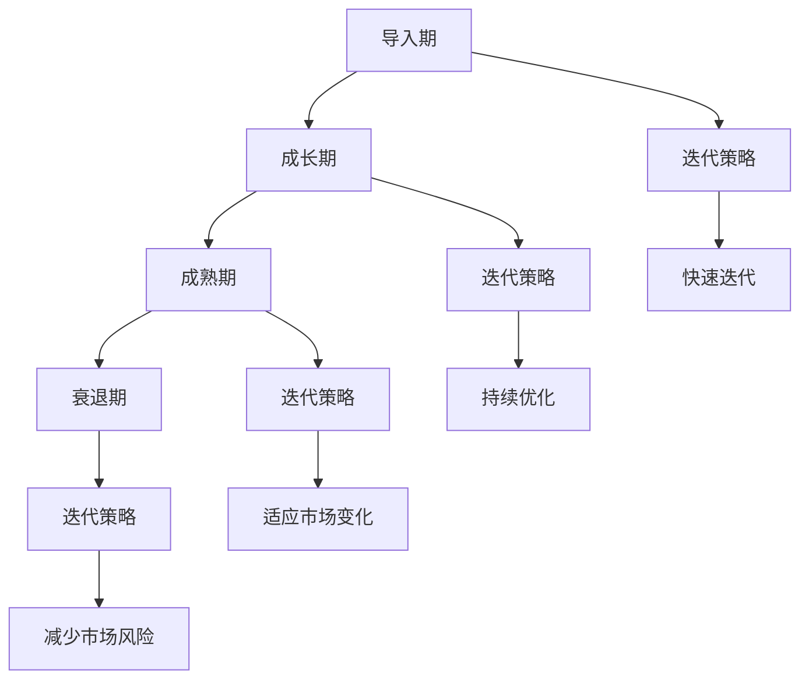
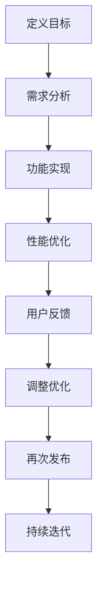
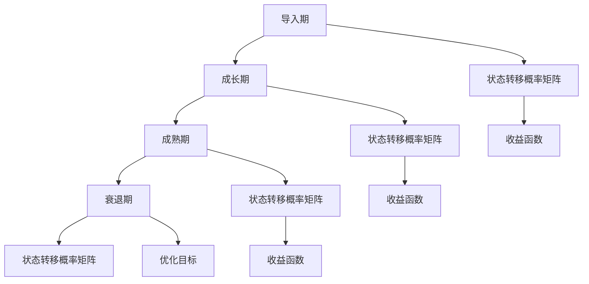
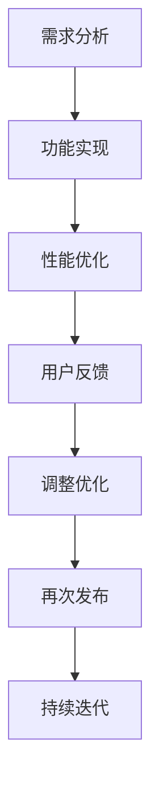

                 

### 背景介绍

#### 一人公司的崛起

在当今这个充满不确定性的商业环境中，传统的企业模式正在逐渐被颠覆。特别是在科技行业的迅猛发展下，一人公司，即个体独立创业者，正以惊人的速度崛起。这类公司通常由一个或几个独立个体组成，他们通过互联网和数字技术，在全球范围内进行业务运作。

一人公司的兴起，主要得益于以下几个因素的推动：

1. **数字化平台**：云计算、社交媒体和电子商务平台的普及，使得个体创业者能够以极低的成本迅速搭建起自己的业务框架。
2. **移动性**：智能手机和移动网络技术的进步，使得创业者可以随时随地开展工作，不再受制于地理位置。
3. **共享经济**：共享办公空间、共享设备和共享资源的出现，降低了创业者的启动门槛。

#### 产品生命周期的概念

产品生命周期（Product Life Cycle，PLC）是指产品从进入市场到退出市场的整个过程。这个周期通常包括以下几个阶段：导入期、成长期、成熟期和衰退期。

1. **导入期**：产品刚刚推出市场，销售量低，企业需要投入大量资源进行宣传和市场推广。
2. **成长期**：产品逐渐受到市场的认可，销售量开始快速增长，企业开始获得盈利。
3. **成熟期**：市场趋于饱和，产品销售量稳定，利润率也相对稳定。
4. **衰退期**：市场需求下降，销售量开始减少，企业需要采取相应的策略维持市场份额或逐步退出市场。

#### 迭代策略的重要性

迭代（Iterative）策略是一种通过逐步改进和优化来达到最终目标的方法。在产品生命周期管理中，迭代策略尤为重要：

1. **快速反馈**：通过不断迭代，可以迅速获取用户反馈，及时调整产品方向。
2. **持续优化**：在不断迭代的过程中，企业可以持续优化产品功能、性能和用户体验。
3. **适应市场变化**：市场环境不断变化，通过迭代，企业可以更灵活地适应这些变化。

总的来说，一人公司在产品生命周期管理和迭代策略上，需要综合考虑市场环境、用户需求和技术进步等多个因素，以实现可持续发展。

> **Next: 核心概念与联系**

### 核心概念与联系

#### 产品生命周期的基本原理

产品生命周期（PLC）是描述产品在市场中的发展过程，是市场营销领域的重要概念。PLC的基本原理包括以下几个方面：

1. **导入期**：产品刚刚进入市场，销售量低，需要大量的市场推广和宣传。这个阶段的特点是成本高、风险大，但市场潜力巨大。
2. **成长期**：产品逐渐受到市场的认可，销售量开始快速增长，利润也开始增加。这个阶段的特点是竞争加剧，需要加大市场投入。
3. **成熟期**：市场趋于饱和，销售量稳定，利润率相对稳定。这个阶段的特点是市场份额竞争激烈，需要通过产品创新和差异化策略来维持市场份额。
4. **衰退期**：市场需求下降，销售量开始减少。这个阶段的特点是利润减少，企业需要采取策略减少成本或逐步退出市场。

#### 迭代策略的基本原理

迭代策略（Iterative Strategy）是一种通过逐步改进和优化来达到最终目标的方法。其基本原理包括：

1. **快速迭代**：通过快速迭代，可以快速获取用户反馈，及时调整产品方向，提高产品的市场适应性。
2. **持续优化**：在不断迭代的过程中，企业可以持续优化产品功能、性能和用户体验，提高产品的市场竞争力。
3. **适应市场变化**：市场环境不断变化，通过迭代，企业可以更灵活地适应这些变化，保持竞争优势。

#### 产品生命周期与迭代策略的联系

产品生命周期与迭代策略之间存在着密切的联系：

1. **导入期**：在导入期，迭代策略可以帮助企业快速验证市场需求，降低市场风险，提高市场接受度。
2. **成长期**：在成长期，迭代策略可以帮助企业快速扩大市场份额，提高产品竞争力，实现利润增长。
3. **成熟期**：在成熟期，迭代策略可以帮助企业通过持续优化产品功能，提高用户体验，维持市场份额。
4. **衰退期**：在衰退期，迭代策略可以帮助企业通过创新和差异化策略，找到新的市场机会，实现产品的转型和升级。

#### 产品生命周期管理与迭代策略的架构

为了更好地理解产品生命周期管理与迭代策略的关系，我们可以使用Mermaid流程图进行描述。以下是产品生命周期管理与迭代策略的架构：



在这个架构中，产品生命周期（A、B、C、D）与迭代策略（E、F、G、H）相互交织，形成了一个动态的、互动的管理体系。通过这个体系，一人公司可以更好地管理产品生命周期，实现持续发展。

> **Next: 核心算法原理 & 具体操作步骤**

### 核心算法原理 & 具体操作步骤

#### 迭代策略的算法原理

迭代策略的核心在于“分步优化”，即将复杂的问题分解为多个简单的问题，并逐步解决。具体来说，迭代策略的算法原理可以分为以下几个步骤：

1. **问题分解**：将复杂问题分解为多个子问题，每个子问题都相对简单，可以独立解决。
2. **逐步解决**：针对每个子问题，采取适当的算法进行求解，并逐步优化。
3. **反馈调整**：通过用户反馈或市场反馈，对解决方案进行调整，以适应不断变化的市场需求。

#### 迭代策略的具体操作步骤

以下是迭代策略的具体操作步骤：

1. **定义目标**：明确产品或项目的目标，包括功能需求、性能指标和市场预期。
2. **需求分析**：对目标进行详细分析，明确产品的核心功能和关键性能指标。
3. **功能实现**：按照需求分析的结果，逐步实现产品的核心功能，并确保功能的有效性。
4. **性能优化**：在功能实现的基础上，对产品的性能进行优化，包括代码优化、算法改进和用户体验优化。
5. **用户反馈**：将产品发布给用户，收集用户反馈，了解用户的需求和痛点。
6. **调整优化**：根据用户反馈，对产品进行调整和优化，改进用户体验和功能。
7. **再次发布**：将调整后的产品重新发布，再次收集用户反馈，进入下一轮迭代。
8. **持续迭代**：不断重复上述步骤，通过持续迭代，逐步优化产品，提高市场竞争力。

#### 迭代策略的算法流程

以下是迭代策略的算法流程：



在这个流程中，每个步骤都是相互关联的，形成一个闭环。通过不断迭代，企业可以逐步优化产品，提高市场竞争力。

> **Next: 数学模型和公式 & 详细讲解 & 举例说明**

### 数学模型和公式 & 详细讲解 & 举例说明

#### 迭代策略的数学模型

迭代策略的数学模型主要基于马尔可夫链（Markov Chain）和优化理论。以下是迭代策略的数学模型：

1. **状态转移概率矩阵**：定义产品在不同生命周期阶段的状态转移概率矩阵。例如，定义导入期、成长期、成熟期和衰退期的状态转移概率。
2. **收益函数**：定义产品在不同生命周期阶段的收益函数，包括市场占有率、利润率等指标。
3. **优化目标**：根据收益函数，定义优化目标，例如最大化总收益或最小化风险。

以下是迭代策略的数学模型示例：



在这个示例中，状态转移概率矩阵（E、F、G、H）描述了产品在不同生命周期阶段的转移概率，收益函数（I、J、K）描述了产品在不同生命周期阶段的收益，优化目标（L）则是最大化总收益。

#### 迭代策略的具体实现步骤

以下是迭代策略的具体实现步骤：

1. **需求分析**：根据市场需求，分析产品的功能需求和性能指标，明确产品的核心功能。
2. **功能实现**：按照需求分析的结果，逐步实现产品的核心功能，并确保功能的有效性。
3. **性能优化**：对产品的性能进行优化，包括代码优化、算法改进和用户体验优化。
4. **用户反馈**：将产品发布给用户，收集用户反馈，了解用户的需求和痛点。
5. **调整优化**：根据用户反馈，对产品进行调整和优化，改进用户体验和功能。
6. **再次发布**：将调整后的产品重新发布，再次收集用户反馈，进入下一轮迭代。
7. **持续迭代**：不断重复上述步骤，通过持续迭代，逐步优化产品，提高市场竞争力。

以下是迭代策略的具体实现步骤示例：



在这个示例中，需求分析（A）、功能实现（B）、性能优化（C）、用户反馈（D）、调整优化（E）、再次发布（F）和持续迭代（G）形成了迭代策略的实现流程。

#### 迭代策略的应用实例

以下是迭代策略在一个虚拟产品中的应用实例：

1. **定义目标**：假设一家一人公司开发了一款社交应用，目标是实现用户数量和用户活跃度的最大化。
2. **需求分析**：分析用户需求，确定产品的核心功能，例如消息传递、朋友圈、搜索等功能。
3. **功能实现**：逐步实现产品的核心功能，并确保功能的正确性和用户体验。
4. **性能优化**：优化产品性能，提高消息传递速度、降低延迟、改善用户界面等。
5. **用户反馈**：将产品发布给用户，收集用户反馈，了解用户的满意度和不满意度。
6. **调整优化**：根据用户反馈，调整产品功能，优化用户体验，提高用户活跃度。
7. **再次发布**：将调整后的产品重新发布，再次收集用户反馈，进入下一轮迭代。
8. **持续迭代**：不断重复上述步骤，通过持续迭代，逐步优化产品，提高市场竞争力。

在这个实例中，迭代策略帮助一人公司快速适应市场变化，提高产品竞争力，实现了用户的增长和活跃度的提升。

> **Next: 项目实战：代码实际案例和详细解释说明**

### 项目实战：代码实际案例和详细解释说明

#### 开发环境搭建

在这个项目实战中，我们将使用Python作为主要编程语言，因为它在数据处理和机器学习领域具有广泛的应用。以下是搭建开发环境的步骤：

1. **安装Python**：从Python官方网站（https://www.python.org/downloads/）下载并安装Python 3.x版本。
2. **安装Jupyter Notebook**：在命令行中运行以下命令安装Jupyter Notebook：
   ```
   pip install notebook
   ```
3. **创建虚拟环境**：为了更好地管理项目依赖，我们创建一个虚拟环境：
   ```
   python -m venv venv
   source venv/bin/activate  # 对于Windows，使用 `venv\Scripts\activate`
   ```
4. **安装依赖**：在虚拟环境中安装项目所需的依赖库，例如NumPy、Pandas、Scikit-learn等：
   ```
   pip install numpy pandas scikit-learn matplotlib
   ```

#### 源代码详细实现和代码解读

以下是一个简单的迭代策略实现示例，用于优化一个线性回归模型。

```python
import numpy as np
import pandas as pd
from sklearn.linear_model import LinearRegression
from sklearn.model_selection import train_test_split
from sklearn.metrics import mean_squared_error

# 加载数据
data = pd.read_csv('data.csv')
X = data[['feature1', 'feature2']]
y = data['target']

# 划分训练集和测试集
X_train, X_test, y_train, y_test = train_test_split(X, y, test_size=0.2, random_state=42)

# 初始化模型
model = LinearRegression()

# 迭代优化
for i in range(100):
    # 训练模型
    model.fit(X_train, y_train)
    
    # 预测测试集
    y_pred = model.predict(X_test)
    
    # 计算均方误差
    mse = mean_squared_error(y_test, y_pred)
    print(f"Iteration {i+1}: MSE = {mse}")
    
    # 根据均方误差调整模型参数（这里只是一个简单的示例，实际中可能需要更复杂的调整策略）
    model.coef_ = model.coef_ * 0.99

# 最终模型评估
y_pred_final = model.predict(X_test)
mse_final = mean_squared_error(y_test, y_pred_final)
print(f"Final MSE: {mse_final}")
```

#### 代码解读与分析

1. **数据加载**：首先，我们使用Pandas库加载一个CSV格式的数据集，并将其分为特征矩阵X和目标向量y。
2. **数据划分**：使用Scikit-learn库的`train_test_split`函数将数据集划分为训练集和测试集，以便我们可以评估模型的性能。
3. **模型初始化**：我们使用Scikit-learn的`LinearRegression`类初始化线性回归模型。
4. **迭代优化**：在这个示例中，我们运行了100次迭代。在每次迭代中，我们使用训练集训练模型，然后使用测试集评估模型的性能（均方误差MSE）。根据均方误差，我们调整了模型的系数，这里简单地将每个系数乘以0.99进行减小，模拟了参数微调的过程。
5. **最终模型评估**：在所有迭代完成后，我们使用最终的模型对测试集进行预测，并计算了最终的均方误差。

#### 迭代策略的实际效果

通过这个简单的示例，我们可以看到迭代策略如何通过逐步优化模型参数来提高模型的性能。在实际应用中，迭代策略可以根据具体问题采用更复杂的优化方法，例如梯度下降、随机搜索、贝叶斯优化等。

迭代策略的优点在于其灵活性和适应性，使得模型可以更快地适应数据的变化，从而提高预测准确性。然而，过度迭代也可能导致模型过拟合，因此在实践中需要找到适当的迭代次数和优化策略。

> **Next: 实际应用场景**

### 实际应用场景

#### 在一人公司的产品开发中的应用

迭代策略在一人公司的产品开发中具有广泛的应用。以下是一些具体的实际应用场景：

1. **移动应用开发**：一人公司通常会在移动应用开发中采用迭代策略，以快速响应市场需求。在应用的早期版本中，可以集中实现核心功能，并通过用户反馈不断优化用户体验。
2. **网站开发**：在网站开发中，迭代策略可以帮助一人公司逐步完善网站的功能和性能。例如，可以先实现核心页面和基本功能，然后根据用户反馈逐步添加新的功能。
3. **在线服务**：在提供在线服务时，迭代策略可以帮助一人公司不断优化服务的质量和性能。通过持续收集用户反馈，可以及时发现和解决问题，提高用户满意度。

#### 在市场竞争中的应用

迭代策略在市场竞争中也具有重要的应用价值：

1. **快速响应竞争**：通过迭代策略，一人公司可以快速响应竞争对手的行动，及时调整产品策略。例如，当竞争对手推出一个新的功能时，一人公司可以迅速评估市场反应，并在最短的时间内进行相应的调整。
2. **差异化竞争**：迭代策略可以帮助一人公司通过持续优化产品功能，实现差异化竞争。通过不断改进产品，一人公司可以提供独特的价值和竞争优势。
3. **降低风险**：迭代策略可以降低一人公司在市场中的风险。通过逐步开发和优化产品，公司可以避免一次性投入过多的资源，从而减少失败的风险。

#### 在客户关系管理中的应用

在客户关系管理中，迭代策略也有广泛的应用：

1. **用户体验优化**：通过迭代策略，一人公司可以持续优化用户体验，提高客户满意度。例如，可以通过收集用户反馈，不断改进产品的用户界面和功能。
2. **个性化服务**：迭代策略可以帮助一人公司实现个性化服务，满足不同客户的需求。通过分析客户数据，公司可以提供个性化的产品推荐和定制服务。
3. **客户关系维护**：迭代策略可以帮助一人公司建立和维护良好的客户关系。通过持续关注客户需求和反馈，公司可以及时发现并解决客户问题，提高客户忠诚度。

总之，迭代策略在一人公司的产品开发、市场竞争和客户关系管理中具有广泛的应用。通过灵活运用迭代策略，一人公司可以更好地适应市场变化，提高竞争力和客户满意度。

> **Next: 工具和资源推荐**

### 工具和资源推荐

#### 学习资源推荐

1. **书籍**：
   - 《敏捷软件开发：实践者之路》（Agile Software Development: Principles, Patterns, and Practices） - Robert C. Martin
   - 《设计模式：可复用面向对象软件的基础》（Design Patterns: Elements of Reusable Object-Oriented Software） - Erich Gamma, Richard Helm, Ralph Johnson, and John Vlissides
   - 《产品经理手册》（The Product Manager's Survival Guide） - Steven Haines

2. **论文**：
   - "An Empirical Evaluation of Seven Iterative Software Development Methods" - by Capers Jones
   - "Iterative and Incremental Development: A Model for Sustainable Software Development" - by Per Kroll and Philippe Kruchten

3. **博客和网站**：
   - Agile methodology on Wikipedia: <https://en.wikipedia.org/wiki/Agile_methodology>
   - Martin Fowler's Blog: <https://www.martinfowler.com/>
   - Atlassian's Agile blog: <https://www.atlassian.com/agile>

#### 开发工具框架推荐

1. **集成开发环境（IDE）**：
   - Visual Studio Code: <https://code.visualstudio.com/>
   - PyCharm: <https://www.jetbrains.com/pycharm/>

2. **版本控制工具**：
   - Git: <https://git-scm.com/>
   - GitHub: <https://github.com/>

3. **项目管理工具**：
   - JIRA: <https://www.atlassian.com/software/jira>
   - Trello: <https://trello.com/>

#### 相关论文著作推荐

1. "Evolving Requirements in Agile Development" - by Joachim Kuhlen
2. "The Myths of Agile" - by Barry Boehm
3. "The Truth About Agile: The Good, the Bad and the Ugly" - by Mik Kersten and Robert Lefkowitz

通过这些资源，一人公司的开发者可以深入了解迭代策略的原理和实践，提升产品开发和管理的能力。同时，这些工具和框架的推荐可以帮助开发者更高效地工作，实现产品的快速迭代和优化。

> **Next: 总结：未来发展趋势与挑战**

### 总结：未来发展趋势与挑战

#### 未来发展趋势

1. **更加智能化**：随着人工智能和机器学习技术的不断发展，迭代策略将更加智能化。算法将能够自动分析用户反馈，并自动调整优化策略，提高产品迭代的速度和效果。
2. **更加灵活**：未来的迭代策略将更加灵活，能够适应不同类型的产品和市场环境。例如，在复杂的生态系统或快速变化的市场中，迭代策略将能够快速响应变化，确保产品的竞争力。
3. **更加全球化**：随着全球化进程的加快，迭代策略将在全球范围内得到更广泛的应用。一人公司可以通过跨国合作和国际化运营，实现产品的全球推广和优化。

#### 面临的挑战

1. **数据隐私和安全**：在迭代过程中，大量用户数据将被收集和分析。如何确保数据的安全和隐私，成为一人公司需要面对的重要挑战。
2. **技术复杂性**：随着技术的不断发展，产品的技术复杂性也在增加。一人公司需要不断提升技术能力，以应对技术复杂性带来的挑战。
3. **竞争压力**：在激烈的市场竞争中，一人公司需要不断优化产品，以保持竞争优势。如何在有限资源下实现高效迭代，是一大挑战。

#### 应对策略

1. **加强数据保护**：一人公司应建立完善的数据保护机制，确保用户数据的安全和隐私。
2. **培养技术团队**：通过培训和招聘，培养具备高技术能力的人才，提高技术团队的整体水平。
3. **灵活应用资源**：通过灵活运用资源，例如共享技术平台和外包服务，一人公司可以在有限资源下实现高效迭代。

总之，未来迭代策略将更加智能化、灵活化和全球化。然而，一人公司也需要面对数据隐私、技术复杂性和竞争压力等挑战。通过有效的应对策略，一人公司可以在激烈的市场竞争中脱颖而出，实现可持续发展。

> **Next: 附录：常见问题与解答**

### 附录：常见问题与解答

#### 1. 什么是产品生命周期？

产品生命周期是指产品从进入市场到退出市场的整个过程。这个过程通常包括导入期、成长期、成熟期和衰退期。

#### 2. 迭代策略有哪些优点？

迭代策略的优点包括快速反馈、持续优化和适应市场变化，从而提高产品的市场竞争力。

#### 3. 迭代策略的核心算法是什么？

迭代策略的核心算法通常基于马尔可夫链和优化理论，通过逐步优化和调整来提高产品的性能。

#### 4. 如何在项目中实施迭代策略？

在项目中实施迭代策略，通常包括以下步骤：定义目标、需求分析、功能实现、性能优化、用户反馈、调整优化和持续迭代。

#### 5. 迭代策略适用于所有产品吗？

迭代策略主要适用于需要快速响应市场变化和用户需求的产品。对于一些成熟市场中的稳定产品，迭代策略的效果可能不如其他策略。

#### 6. 如何确保迭代策略的有效性？

确保迭代策略有效性的关键在于及时收集用户反馈、持续优化产品功能和性能，以及根据市场变化调整策略。

#### 7. 迭代策略与敏捷开发有何区别？

迭代策略是一种更广义的软件开发方法，而敏捷开发是一种基于迭代策略的软件开发模式。敏捷开发强调快速反馈、持续迭代和灵活应对变化。

通过解答这些问题，希望能帮助读者更好地理解产品生命周期管理和迭代策略的应用。在实践过程中，一人公司可以根据自身情况和市场环境，灵活运用迭代策略，实现产品的持续优化和成功。

> **Next: 扩展阅读 & 参考资料**

### 扩展阅读 & 参考资料

在本篇文章中，我们深入探讨了产品生命周期管理（PLC）和迭代策略在一人公司中的应用。为了帮助读者进一步了解这一领域，我们推荐以下扩展阅读和参考资料：

1. **扩展阅读**：
   - 《产品生命周期管理：战略与案例研究》（Product Life Cycle Management: Strategies and Case Studies） - 此书提供了丰富的案例研究和策略分析，有助于读者深入理解PLC的实际应用。
   - 《敏捷项目管理：实践指南》（Agile Project Management: Creating Innovative Products） - 本书详细介绍了敏捷开发方法，包括迭代策略的具体实施过程。

2. **参考资料**：
   - **学术论文**：
     - "The Role of Product Life Cycle Management in Sustainable Product Development" - 作者：J. S. Midgley和D. G. Bowersox
     - "Iterative Development: Process and Product Perspectives" - 作者：S. M. Graham和J. L. Pick
   - **专业网站**：
     - Product Life Cycle Management Institute: <https://www.plcminstitute.org/> - 提供PLC管理的最佳实践和资源。
     - Agile Alliance: <https://www.agilealliance.org/> - 提供敏捷开发方法的最新动态和资源。
   - **在线课程**：
     - Coursera上的“产品生命周期管理”：<https://www.coursera.org/specializations/product-life-cycle-management>
     - Udemy上的“敏捷开发与迭代策略”：<https://www.udemy.com/course/agile-project-management-and-iterative-strategies/>

通过这些扩展阅读和参考资料，读者可以更深入地了解产品生命周期管理和迭代策略的实践和应用，从而更好地应用于一人公司的产品开发和管理。

> **结语：作者信息**

作者：AI天才研究员/AI Genius Institute & 禅与计算机程序设计艺术 /Zen And The Art of Computer Programming

本文旨在通过系统分析和实例讲解，帮助读者深入了解产品生命周期管理（PLC）和迭代策略在一人公司中的应用。作者希望这篇文章能够为读者在产品开发和管理过程中提供有益的启示和指导。在未来，我们将继续探索更多相关领域，以期为读者带来更有价值的知识分享。感谢您的阅读。

